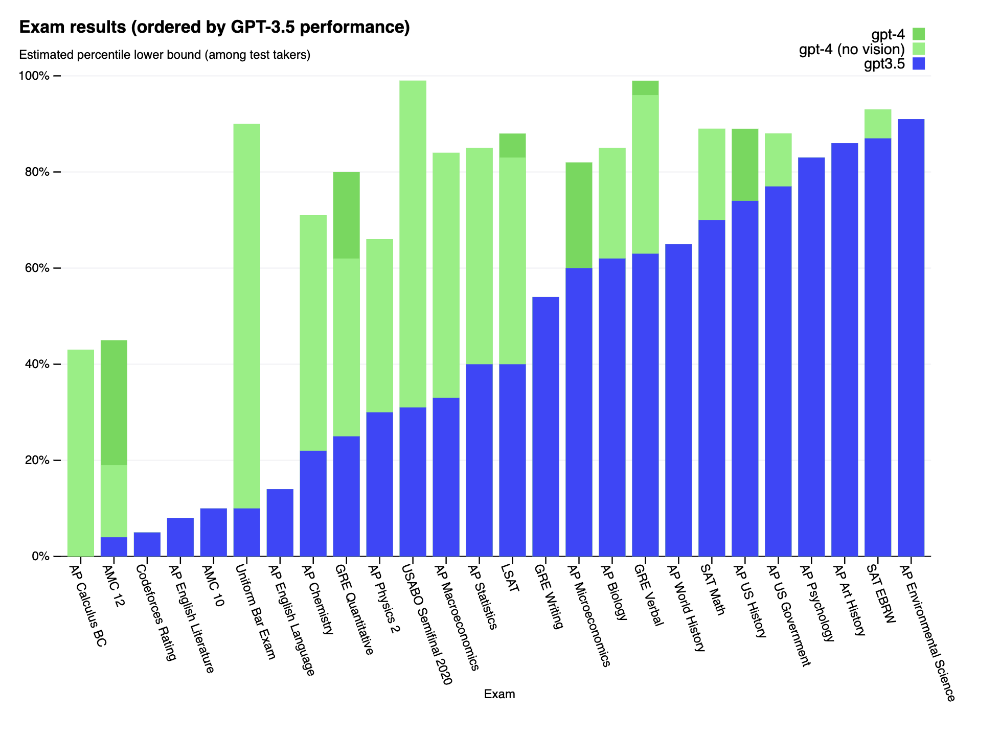
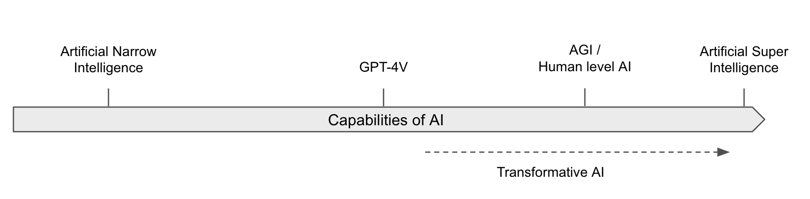
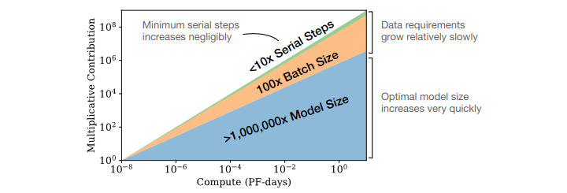
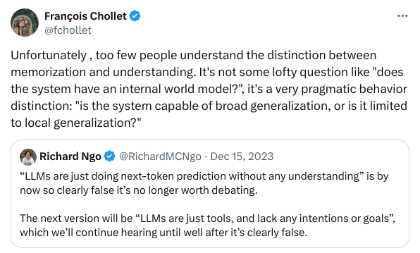
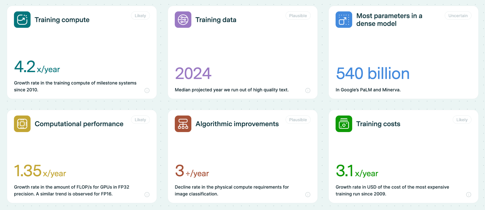
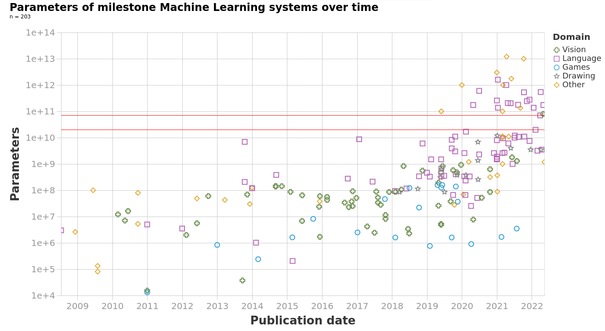

# Chapter 1 - Capabilities

*Human-Level AI, What, How and When?*

[Chapter Overview 2](#chapteroverview2)
[State-of-the-Art AI 3](#stateoftheartai3)
[Language 4](#language4)
[Image Generation 7](#imagegeneration7)
[Multi & Cross modality 9](#multicrossmodality9)
[Robotics 10](#robotics10)
[Playing Games 12](#playinggames12)
[Foundation Models 14](#foundationmodels14)
[Techniques 15](#techniques15)
[Properties 17](#properties17)
[Limitations & Risks 18](#limitationsrisks18)
[Terminology 19](#terminology19)
[Capabilities vs. Intelligence 19](#capabilitiesvsintelligence19)
[Definitions of advanced AI Systems 21](#definitionsofadvancedaisystems21)
[(t,n)-AGI 22](#tnagi22)
[Leveraging Computation 23](#leveragingcomputation23)
[The Bitter Lesson 24](#thebitterlesson24)
[Scaling Variables 25](#scalingvariables25)
[Scaling Laws 26](#scalinglaws26)
[Scaling Hypotheses 29](#scalinghypotheses29)
[Forecasting 30](#forecasting30)
[Zeroth-Order Forecasting 31](#zerothorderforecasting31)
[First-Order Forecasting 32](#firstorderforecasting32)
[Biological Anchors Framework 33](#biologicalanchorsframework33)
[Takeoff 41](#takeoff41)
 [Speed 41](#speed41)
 [Similarity 44](#similarity44)
 [Polarity 44](#polarity44)
 [Takeoff Arguments 45](#takeoffarguments45)
[Appendix 1: Expert Opinions 48](#appendix1expertopinions48)
[Surveys 48](#surveys48)
[Expert Quotes 49](#expertquotes49)
[Prediction Markets 49](#predictionmarkets49)
[Appendix 2: Discussions on LLMs 50](#appendix2discussionsonllms50)
[Empirically insufficiency? 50](#empiricallyinsufficiency50)
[Shallow Understanding? 52](#shallowunderstanding52)
[Structural inadequacy? 56](#structuralinadequacy56)
[Differences with the brain 59](#differenceswiththebrain59)
[Further reasons to continue scaling LLMs 59](#furtherreasonstocontinuescalingllms59)
[Appendix 3: Trends 60](#appendix3trends60)
[Compute Trends 61](#computetrends61)
[Model Size Trends 62](#modelsizetrends62)
[Algorithmic Trends 63](#algorithmictrends63)
[Data Trends 64](#datatrends64)

# Chapter Overview

This chapter seeks to outline the recent important developments in AI and presents some potential trajectories for developing highly capable AI systems.

**State-of-the-Art AI**. We begin with a brief introduction to the current advancements in artificial intelligence as of 2024. We aim to acquaint readers with the latest breakthroughs across various domains such as language processing, vision, and robotics.

**Foundation Models**. The second section focuses on foundation models, the paradigm powering the state-of-the-art systems introduced in the previous section. We explain the key techniques underpinning the huge success of these models such as self-supervised learning, zero-shot learning, and fine-tuning. The section concludes by looking at the risks that the foundation model paradigm could pose such as power centralization, homogenization, and the potential for emergent capabilities.

**Terminology**. Before diving deeper, we establish the definitions that this book will be working with. This section explains why "capabilities" rather than "intelligence" is a more pragmatic measure for discussing AI risks. We also delineate key terms within the AI debate, such as Artificial General Intelligence (AGI), Artificial Super Intelligence (ASI), and Transformative AI (TAI). The section concludes by introducing the (t,n)-AGI framework which allows us to more concretely measure the level of AI capabilities on a continuous scale, rather than having to rely on discrete thresholds.

**Leveraging Computation**. In this section, we explore the importance of computation in AI's progress introducing the three main variables that govern the capabilities of today's foundation models - compute, data and parameter count. We explore scaling laws and hypotheses that predict the future capabilities of AI based on current scaling trends of these variables, offering insights into the computational strategies that could pave the way to AGI.

**Forecasting**. Finally, the chapter addresses the challenge of forecasting AI's future, using biological anchors as a method to estimate the computational needs for transformative AI. This section sets the groundwork for discussing AI takeoff dynamics, including speed, polarity, and homogeneity, offering a comprehensive view of potential futures shaped by AI development.

**Estimated reading time**: 2 Hours 40 minutes reading at 100 wpm. Given the density and type of material covered in this chapter, this should be taken as a lower bound estimate.

**Estimated reading time (including Appendices)**: 3 Hours 40 minutes reading at 100 wpm. The appendices are meant for people already quite familiar with topics in machine learning.

# State-of-the-Art AI

Over the last decade, the field of artificial intelligence (AI) has experienced a profound transformation, largely attributed to the successes in deep learning. This remarkable progress has redefined the boundaries of AI capabilities, challenging many preconceived notions of what machines can achieve. The following sections detail some of these advancements.

**Figure**: Once a benchmark is published, it takes less and less time to solve it. This can illustrate the accelerating progress in AI and how quickly AI benchmarks are “saturating”, and starting to surpass human performance on a variety of tasks. **(**[source](https://www.science.org/content/article/computers-ace-iq-tests-still-make-dumb-mistakes-can-different-tests-help)) , From DynaBench.

## Language

**Language-based tasks.** There have been transformative changes in sequence and language-based tasks, primarily through the development of large language models (LLMs). Early language models in 2018 struggled to construct coherent sentences. The evolution from these to the advanced capabilities of GPT-3 (Generative Pre-Trained Transformer) and ChatGPT within less than 5 years is remarkable. These models demonstrate not only an improved capacity for generating text but also for responding to complex queries with nuanced, common-sense reasoning. Their performance in various question-answering tasks, including those requiring strategic thinking, has been particularly impressive.

**GPT-4.**One of the state-of-the-art language models in 2024 is OpenAI’s LLM GPT-4. In contrast with the text-only GPT-3 and follow-ups, GPT-4 is multimodal: it was trained on both text and images. This means that it can now not only generate text based on images but has also gained some other capabilities. GPT-4 saw an upgraded context window with up to 32k tokens (tokens ≈ words). The short-term memory limit of an LLM can be thought of as the model's ability to retain information from previous tokens within a certain context window. GPT-4 is trained via next-token prediction (autoregressive self-supervised learning). In 2018 GPT-1 was barely able to count to 10, while in 2024 GPT-4 can implement complex programmatic functions among other things.

Figure: a list of "Nowhere near solved” [...] issues in AI, from "A brief history of AI", published in January 2021 ([source](https://www.amazon.com/Brief-History-Artificial-Intelligence-Where/dp/1250770742)). They also say: “At present, we have no idea how to get computers to do the tasks at the bottom of the list”. But everything in the category “Nowhere near solved” has been solved by GPT-4 ([source](https://arxiv.org/abs/2303.12712)), except human-level general intelligence.

**Scaling**. Remarkably, GPT-4 is trained using roughly the same methods as GPT-1, 2, and 3. The only significant difference is the size of the model and the data given to it during training. The size of the model has gone from 1.5B parameters to hundreds of billions of parameters, and datasets have become similarly larger and more diverse.

 \
Figure: How fast is AI Improving? ([source](https://theaidigest.org/progress-and-dangers))

We have observed that just an expansion in scale has contributed to enhanced performance. This includes improvements in the ability to generate contextually appropriate responses, and highly diverse text across a range of domains. It has also contributed to overall improved understanding, and coherence. Most of those advances in the GPT series come from increasing the size and computation power behind the models, rather than fundamental shifts in architecture or training.

Here are some of the capabilities that have been emerging in the last few years:

- **Few-shot and Zero-shot Learning**. The model's proficiency at understanding and executing tasks with minimal or no prior examples. 'Few-shot' means accomplishing the task after having seen a few examples in the context window, while 'Zero-shot' indicates performing the task without any specific examples ([source](https://transformer-circuits.pub/2022/in-context-learning-and-induction-heads/index.html)). This also includes induction capabilities, i.e. identifying patterns and generalizing rules not present in the training, but only present in the current context window ([source](https://arxiv.org/abs/2005.14165)).

- **Metacognition**. This refers to the ability to recognize its own knowledge and limitations, for example, being able to know the probability of the truth of something ([source](https://arxiv.org/abs/2207.05221)).

- **Theory of Mind**. The capability to attribute mental states to itself and others, which helps in predicting human behaviors and responses for more nuanced interactions ([source](https://arxiv.org/abs/2302.02083), [source](https://arxiv.org/abs/2402.06044)).

- **Tool Use**. Being able to interact with external tools, like using a calculator or browsing the internet, expanding its problem-solving abilities ([source](https://arxiv.org/abs/2307.16789)).

- **Self-correction**. The model's ability to identify and correct its own mistakes, which is crucial for improving the accuracy of AI-generated content ([source](https://arxiv.org/abs/2303.11366)).

Figure: An example of a mathematical problem solved by GPT-4 using Chain of Thought (CoT), from the paper “Sparks of Artificial General Intelligence” ([source](https://arxiv.org/abs/2303.12712)).

- **Reasoning**. The advancements in LLMs have also led to significant improvements in the ability to process and generate logical chains of thought and reasoning. This is particularly important in problem-solving tasks where a straightforward answer isn't immediately available, and a step-by-step reasoning process is required. ([Source](https://arxiv.org/abs/2303.12712))

- **Programming ability**. In coding, AI models have progressed from basic code autocompletion to writing sophisticated, functional programs.

- **Scientific & Mathematical ability**. In mathematics, AI's have assisted in the subfield of automatic theorem proving for decades. Today's models continue to assist in solving complex problems. AI can even achieve a gold medal level in the mathematical Olympiad by solving geometry problems ([source](https://www.nature.com/articles/s41586-023-06747-5)).

Figure: GPT-4 solves some tasks that GPT-3.5 was unable to, like the uniform bar examination, where GPT-4 scores 90% compared to 10% for GPT-3.5. GPT-4 is also capable of vision processing, and the added vision component had only a minor impact, but it helped others tremendously.  ([source](https://openai.com/research/gpt-4))

## Image Generation

The leap forward in image generation is not just in accuracy, but also in the ability to handle complex, real-world images. The latter, particularly with the advent of Generative Adversarial Networks (GANs) in 2014, has shown an astounding rate of progress. The quality of images generated by AI has evolved from simple, blurry representations to highly detailed and creative scenes, often in response to intricate language prompts.

Figure: An example of state-of-the-art image recognition. The Segment Anything Model (SAM) by Meta’s FAIR (Fundamental AI Research) lab, can classify and segment visual data at highly precise levels. The detection is performed without the need to annotate images. ([source](https://viso.ai/deep-learning/segment-anything-model-sam-explained/))

|  |  |  |  |
|---|---|---|---|
| 2014 | 2015 | 2016 | 2017 |
| GANs | Deep Convolutional GANs | CoGANs | Progressive Growing GANs |

|  |  |  |  |
|---|---|---|---|
| 2018 | 2019 | 2020 | 2021 |
| StyleGAN-1 | StyleGAN-2 | Diffusion Models | StyleGAN-3 |

|  |  |  |  |
|---|---|---|---|
| 2021 | 2022 | 2022 | 2023 |
| DALL-E | Imagen | DALL-E 2 | Midjourney V5 |

Figure: An example of the evolution of image generation. At the top left, starting from GANs (Generative Adversarial Networks) to the bottom right, an image from MidJourney V5.

The rate of progress within a single year alone is quite astounding as is seen from the improvements between the V1 of the MidJourney image generation model in early 2022, to the V6 in December 2023.

|  |  |  |  |  |  |
|---|---|---|---|---|---|
|  V1 (Feb 22) | V2 (Apr 22) | V3 (Jul 22) | V4 (Nov 22) | V5 (Mar 23) | V6 (Dec 23) |
| Figure: MidJourney AI image generation over 2022-2023. Prompt: high-quality photography of a young Japanese woman smiling, backlighting, natural pale light, film camera, by Rinko Kawauchi, HDR (source) |  |  |  |  |  |

## Multi & Cross modality

AI systems are becoming increasingly multimodal. This means that they can process images, text, audio, vision, and robotics using the same model. So they are trained using multiple different “modes” and can translate between them after deployment.

**Cross-modality**. A model is called cross-modal when the input of a model is in one modality (e.g. text) and the output is in another modality (e.g. image). The section on computer vision showed fast progress between 2014 and 2020 in cross-modality. We went from text-to-image models only capable of generating black-and-white pixelated images of faces, to models capable of generating an image of any textual prompt. More examples of cross-modality include OpenAIs Whisper ([source](https://cdn.openai.com/papers/whisper.pdf)) which is capable of speech-to-text transcription.

**Multi-modality**. A model is called multi-modal when both the inputs and outputs of a model can be in more than one modality. E.g. audio-to-text, video-to-text, text-to-image, etc…

|  |  |  |
|---|---|---|
| Figure: Image-to-text and text-to-image multimodality from the Flamingo model. (source) |  |  |

DeepMind’s 2022 Flamingo model, could be “*rapidly adapted to various image/video understanding tasks*” and “*is also capable of multi-image visual dialogue*”. ([source](https://arxiv.org/abs/2204.14198)) Similarly, DeepMind’s 2022 Gato model, was called a "Generalist Agent". It was a single network with the same weights which could “*play Atari, caption images, chat, stack blocks with a real robot arm, and much more*”. ([source](https://arxiv.org/abs/2205.06175)) Continuing this trend, DeepMind’s 2023 Google Gemini model could be called a Large Multimodal Model (LMM). The paper described Gemini as “*natively multimodal*” and claimed to be able to “*seamlessly combine their capabilities across modalities (e.g. extracting information and spatial layout out of a table, a chart, or a figure) with the strong reasoning capabilities of a language model (e.g. its state-of-art-performance in math and coding)*”([source](https://arxiv.org/abs/2312.11805))

## Robotics

The field of robotics has also been progressing alongside artificial intelligence. In this section, we provide a couple of examples where these two fields are merging, highlighting some robots using inspiration from machine learning techniques to make advancements.

Figure: Researchers used Model-Free Reinforcement Learning to automatically learn quadruped locomotion in only 20 minutes in the real world instead of in simulated environments. The Figure shows examples of learned gaits on a variety of real-world terrains. ([source](https://arxiv.org/abs/2208.07860))

**Advances in robotics**. At the forefront of robotic advancements is PaLM-E, a general-purpose, embodied model with 562 billion parameters that integrates vision, language, and robot data for real-time manipulator control and excels in language tasks involving geospatial reasoning. ([source](https://arxiv.org/abs/2303.03378))

Simultaneously, developments in vision-language models have led to breakthroughs in fine-grained robot control, with models like RT-2 showing significant capabilities in object manipulation and multimodal reasoning. RT-2 demonstrates how we can use LLM-inspired prompting methods (chain-of-thought), to learn a self-contained model that can both plan long-horizon skill sequences and predict robot actions. ([source](https://deepmind.google/discover/blog/rt-2-new-model-translates-vision-and-language-into-action/))

Mobile ALOHA is another example of combining modern machine learning techniques with robotics. Trained using supervised behavioral cloning, the robot can autonomously perform complex tasks “*such as sauteing and serving a piece of shrimp, opening a two-door wall cabinet to store heavy cooking pots, calling and entering an elevator, and lightly rinsing a used pan using a kitchen faucet.*” ([source](https://arxiv.org/abs/2401.02117)) Such advancements not only demonstrate the increasing sophistication and applicability of robotic systems but also highlight the potential for further groundbreaking developments in autonomous technologies.

Figure: DeepMinds RT-2 can both plan long-horizon skill sequences and predict robot actions using inspiration from LLM prompting techniques (chain-of-thought). ([source](https://deepmind.google/discover/blog/rt-2-new-model-translates-vision-and-language-into-action/))

## Playing Games

**AI and board games.** AI has made continuous progress in game playing for decades. Starting from AIs beating the world champion at chess in 1997 ([source](https://en.wikipedia.org/wiki/Deep_Blue_(chess_computer))), Scrabble in 2006 ([source](https://content.time.com/time/specials/packages/article/0,28804,2049187_2049195_2049083,00.html)) to DeepMind’s [AlphaGo](https://www.deepmind.com/research/highlighted-research/alphago) in 2016, which was good enough to defeat the world champion in the game of Go, a game assumed to be notoriously difficult for AI. Within a year, the next model [AlphaZero](https://www.deepmind.com/blog/alphazero-shedding-new-light-on-chess-shogi-and-go) trained through self-play had mastered multiple games of Go, chess, and shogi reaching a superhuman level after less than three days of training.

**AI and video games.** We started using machine learning techniques on simple Atari games in 2013 ([source](https://arxiv.org/abs/1312.5602)). By 2019, OpenAI Five defeated the world champions at DOTA2 ([source](https://openai.com/research/openai-five-defeats-dota-2-world-champions)), while in the same year, DeepMind’s AlphaStar beat professional esports players at StarCraft II ([source](https://www.deepmind.com/blog/alphastar-mastering-the-real-time-strategy-game-starcraft-ii)). Both these games require thousands of actions in a row at a high number of actions per minute. In 2020 DeepMind MuZero model, described as “*a significant step forward in the pursuit of general-purpose algorithms*” ([source](https://www.deepmind.com/blog/muzero-mastering-go-chess-shogi-and-atari-without-rules)), was capable of playing Atari games, Go, chess, and shogi without even being told the rules.

In recent years, AI's capability has extended to open-ended environments like Minecraft, showcasing an ability to perform complex sequences of actions. In strategy games, Meta’s Cicero displayed intricate strategic negotiation and deception skills in natural language for the game Diplomacy ([source](https://arxiv.org/abs/2210.05492)).

 \
**Figure**: A map of diplomacy and the dialog box where the AI negotiates. ([source](https://www.youtube.com/watch?v=u5192bvUS7k&t=2216s))

| Box. Example of Voyager: Planning and Continuous Learning in Minecraft with GPT-4 |
|---|
| Voyager (source) stands as a particularly impressive example of the capabilities of AI in continuous learning environments. This AI is designed to play Minecraft, a task that involves a significant degree of planning and adaptive learning. What makes Voyager so remarkable is its ability to learn continuously and progressively within the game's environment, using GPT-4 contextual reasoning abilities to plan and write the code necessary for each new challenge. Starting from scratch in a single game session, Voyager initially learns to navigate the virtual world, engage and defeat enemies, and remember all these skills in its long-term memory. As the game progresses, it continues to learn and store new skills, leading up to the challenging task of mining diamonds, a complex activity that requires a deep understanding of the game mechanics and strategic planning. The ability of Voyager to integrate new information continuously and utilize it effectively showcases the potential of AI in managing complex, changing environments and performing tasks that require a long-term buildup of knowledge and skills.

Figure from Voyager: Voyager discovers new Minecraft items and skills continually by self-driven exploration, significantly outperforming the baselines. |

# Foundation Models

Foundation models emerged in the mid-to-late 2010s, symbolizing a move away from the labor-intensive, one-model-per-task approach. These models are trained on vast, diverse datasets to learn broad patterns and skills, ready to be adapted to a multitude of tasks. Imagine them as the Swiss Army knives of the AI that can tackle everything from language translation to generating artwork. This marked a shift in strategy, to leveraging large, unlabeled datasets creating generalist models that can later be fine-tuned for specific needs.

**Economics of Foundation Models.** The shift towards foundation models was fueled by several factors: the explosion of data, advances in computational power, and refinements in machine learning techniques. These models are also extremely resource-intensive. Their development, training, and deployment often requires significant investment. This capital requirement comes from three main areas:

- **Data Acquisition**. The large-scale datasets they're trained on, often sourced from the internet. Collecting, cleaning, and updating these datasets can be expensive, especially for specialized or proprietary data.

- **Computational Resources**. The sheer size of foundation models and the datasets used in their training demands significant computational resources, not just in terms of hardware but also the electricity needed for operation.

- **Research and Development**. Beyond the immediate costs of data and computation, there's the ongoing investment in research required to develop new techniques, and fine-tune the existing models. This requires both financial resources and specialized expertise.

The next section provides a deeper dive into the machinery that powers these models.

## Techniques

**Pre-training.** This is the initial training phase on a large dataset comprising millions, if not billions, of examples. Here the models learn general patterns, structures, and knowledge.

**Self-Supervised Learning (SSL).** This is how we actually implement the pre-training. Unlike traditional supervised learning (SL) that relies heavily on labeled data, Self-Supervised Learning (SSL) leverages unlabeled data, enabling models to learn from the inherent structure of the data itself. The development of this technique was a crucial step because it allowed developers to not be restricted by human provided labels. Now, we can leverage nearly unlimited (unlabeled) data available on the web.

As an example of how this technique would work - suppose you have an image of a dog in a park. Instead of a human labeling the image, and then training the model to learn what the human would say, the task for the model is to predict a portion of the image given the rest of it. For instance, the model might be given the top half of the image, and its task would be to predict what the bottom half looks like.

This is repeated on a large number of such images, learning to recognize patterns and structures in this data. Through these examples, the model might learn for instance that images with trees and grass at the top often have more grass, or perhaps a path, at the bottom. It learns about objects and their context — trees and grass often appear in parks, dogs are often found in these environments, paths are usually horizontal, and so on. These learned representations can then be used for a wide variety of tasks that the model was not explicitly trained for, such as identifying dogs in images, or recognizing parks - all without any human-provided labels!

**Zero & Few-Shot Learning.** These are techniques in machine learning where models learn to perform tasks with very few examples. Zero-shot is when they perform well without any specific examples. This is yet another example of a technique which is useful when collecting extensive labeled data is impractical or too costly. Think about introducing a human to the concept of a cat for the first time with just a few images. Despite only seeing three examples, they learn to identify cats in a variety of contexts, not limited to the initial examples. Similarly, few-shot learning enables AI models to generalize from a minimal set of instances, identifying new examples in broader categories they've scarcely encountered.

**Transfer Learning.**Transfer learning is the next step that follows the pre-training. It's where the model takes the general patterns, structures, and knowledge it has learned from the pre-training phase and applies them to new, related tasks. This technique hinges on the fact that knowledge acquired in one context can actually be "transferred" to enhance learning in another. It allows for the utilization of pre-existing knowledge, thereby sidestepping the need to start from scratch for every new task.

**Fine-Tuning.** The fine-tuning phase is where the model is specifically adapted to perform particular tasks. Fine-tuning enables the creation of versatile models capable of undertaking a wide range of tasks, from following instructions to doing programming or scientific analysis. This can be further enhanced later through methods like "Reinforcement Learning from Human Feedback" (RLHF), which refines models to be more effective and user-friendly by reinforcing desirable outputs. We will talk about this technique in detail in later chapters.

Source: Bommasani Rishi et. al. (2022) "[On the Opportunities and Risks of Foundation Models](https://arxiv.org/pdf/2108.07258.pdf)"

**Elicitation Techniques**. Prompting is how we interact with the models. It's akin to giving the model a nudge in the right direction, ensuring that the vast knowledge it has acquired is applied in a way that's relevant and useful. So the structure of the prompt can have a large effect on the overall performance you are able to elicit out of the system. We only briefly introduce the concept here. There are a variety of elicitation techniques like chain-of-thought (CoT) that will be discussed in later chapters.

Prompting serves as a critical interface between human users and the sophisticated capabilities of foundation models. It's akin to giving the model a nudge in the right direction, ensuring that the vast knowledge it has acquired is applied in a way that's relevant and useful. The development of prompting techniques also reflects a broader shift in AI towards more interactive, user-friendly models like ChatGPT. We only briefly introduce the concept here, a broad variety of elicitation and prompting techniques will be discussed in later chapters.

The learning journey of a student—beginning with acquiring broad knowledge, honing specific skills, engaging in self-directed exploration, and seeking expert guidance—mirrors the trajectory of foundation model development. From the foundational broad learning in pre-training through specialization via fine-tuning to the targeted application through prompting, this progression encapsulates the evolving interaction between AI models and the complex, multifaceted tasks they are now capable of addressing.

## Properties

Source: Bommasani Rishi et. al. (2022) "[On the Opportunities and Risks of Foundation Models](https://arxiv.org/pdf/2108.07258.pdf)"

**Efficient use of resources**. Foundation models have the capacity to elevate their performance by leveraging additional data, more powerful computing resources, or advancements in model architecture. It's not merely a technique, but a pivotal attribute that dictates how well a model can adapt and expand its capabilities. As foundation models scale, they don't just grow; they become more nuanced, capable, and efficient in processing information, mirroring the enrichment of understanding and knowledge transfer. This makes scalability a crucial determinant in the operational efficacy of these models. We will discuss this capability further in the subsequent section on leveraging computation.

**Generalization**. This is the cornerstone of foundation models' effectiveness, enabling these AI systems to perform accurately on data they haven't previously encountered. This trait ensures the models remain versatile and reliable across various applications, making them indispensable tools in the AI toolkit. However, even though foundation models are displaying increasingly better generalization of capabilities, more research is needed to ensure the generalization of goals as well. The issue of capability generalization without goal generalization is something we will tackle in depth in subsequent chapters.

**Multi-modality**. This is a newer property that is still emerging as of 2024, but is expected to become extremely relevant as the years progress. This opinion was reflected by Sam Altman, CEO of OpenAI in a conversation with Bill Gates, where he mentioned "*Multimodality will definitely be important. Speech in, speech out, images, eventually video. Clearly, people really want that. Customizability and personalization will also be very important.*" ([source](https://www.linkedin.com/pulse/altman-multimodality-important-david-cronshaw-5fz0c))

We slightly touched on these capabilities in the section on state-of-the-art AI. This characterizes the capability of foundation models to process, interpret, and generate insights from various types of data, or "modalities," such as text, images, audio, and video. The power of multimodality in foundation models lies in its potential to create richer, more nuanced representations of information. By leveraging multiple forms of data, these models can establish deeper connections and uncover insights that might be missed when data types are considered in isolation. This can be considered similar to humans, where our comprehension of the environment is enhanced by integrating visual, auditory, and textual information, thereby offering a more holistic understanding of our surroundings.

## Limitations & Risks

**Balancing Cost and Accessibility.**The development and training of foundation models require a significant investment, posing a delicate balance between cost and accessibility. While adapting an existing model for a specific task might be more cost-effective than developing a new one from scratch, potentially democratizing access to cutting-edge AI capabilities, the substantial initial costs risk centralizing power among a few well-resourced entities. Ensuring equitable access and ethical use of these technologies is vital to harness their societal benefits fully.

**Homogenization**. The process of homogenization refers to the situation where an increasing number of AI systems are merely fine-tuned versions of the same foundation models. Therefore, if a foundation model has certain biases or failure modes, these could potentially be propagated to all models that are fine-tuned from this foundation. This is a significant risk because if the same problem exists in the foundation model, it could manifest across many different models and applications, leading to widespread and potentially correlated failures. For example, if a foundation model has been trained on data that has gender or racial biases, these biases could propagate to all models fine-tuned from it, leading to biased decisions across various applications, whether it be text generation, sentiment analysis, or even predictive policing.

**Emergence**. Increasing the centralization of general-purpose capabilities within a single model might result in unexpected and unexplainable behavior arising as a function of scale. This describes the phenomenon where foundation models exhibit complex behaviors or outputs not explicitly programmed, arising unpredictably from some underlying learned patterns. Emergent qualities rather than their explicit construction provide immense benefits, but this also makes foundation models hard to understand, predict, and control. This lack of predictability and control is a significant concern when these models are used in high-stakes domains. If they fail in ways that are outside our current understanding and expectations, these failures could be particularly problematic when combined with homogenization described above. The same foundation model integrated into multiple critical functions could lead to correlated failures that span multiple critical functions or failsafes. This phenomenon of emergence is also talked about in more detail in subsequent sections.

# Terminology

This section continues the discussion on the terminology necessary to discuss AI capabilities. It focuses in particular on certain thresholds that we might reach in the cognitive capabilities of these AI models.

## Capabilities vs. Intelligence

**The difficulty of defining and measuring intelligence**. Defining something is akin to establishing a standard unit of measurement, such as a gram for weight or a meter for distance. This foundational step is critical for assessment, understanding, and measurement. However, crafting a universally accepted definition of intelligence has proven to be a formidable challenge. Approaches tried in the past such as the Turing test, endeavored to test if AI systems think or act like humans. These criteria are outdated, and we need much more precise benchmarking not for systems that think or act purely rationally. ([source](https://www.ibm.com/topics/artificial-intelligence)) Since then there have been many attempts made at formalizing definitions of “intelligence”, “machine intelligence”([source](https://arxiv.org/abs/cs/0605024)), “human-like general intelligence” ([source](https://arxiv.org/abs/1911.01547)), and so on. The difficulty in finding a universally agreed-upon definition comes from several key factors:

- **Multidimensional Nature**: Intelligence is not a singular, linear attribute but a composite of various cognitive abilities including problem-solving, adaptability, learning capacity, and understanding complex concepts. It is multidimensional and context-dependent, which makes it challenging to condense into a single, universally agreed-upon definition.

- **Field-Specific Interpretations**: Different academic disciplines approach intelligence through diverse lenses. Psychologists may emphasize cognitive skills measurable by IQ tests. Computer scientists might view intelligence as the capability of machines to perform tasks requiring human-like cognitive processes. Neuroscientists approach intelligence from a biological standpoint, focusing on the brain's physical and functional properties, whereas anthropologists and sociologists might perceive intelligence as culturally relative, emphasizing social and emotional competencies. Philosophers' intelligence abstractly, its nature and components, including abstract thought, self-awareness, creativity, etc... Each perspective enriches the discussion but complicates the formation of a consensus.

- **Human-centric Bias**: Many existing definitions of intelligence are rooted in human cognition, posing limitations when considering AI systems or non-human intelligence. This bias suggests a need for broader criteria that can encompass intelligence in all its forms, not just those familiar to human cognition.

- **Implementation Independence**: Intelligence manifests across the natural world, making its measurement across species or entities particularly challenging. An effective definition should be impartial, recognizing intelligence even when it operates in unfamiliar or not fully understood ways.

- **Abstract and Ambiguous Nature**: Intelligence is an abstract concept and abstract concepts often carry inherent ambiguities. This ambiguity can lead to different interpretations and debates about what constitutes "real" or "true" intelligence.

Due to all these reasons, when discussing artificial intelligence, particularly in the context of risks and safety, it's often more effective and precise to focus on "capabilities" rather than "intelligence".

**Defining Capabilities**. The term "capabilities" encompasses the specific, measurable abilities of an AI system. These can range from pattern recognition across large datasets, learning and adapting from the environment to mastering complex tasks traditionally requiring human intelligence. Unlike the abstract qualities often associated with the notion of intelligence, such as consciousness or self-awareness, capabilities are directly observable and quantifiable aspects of AI performance.

**Advantages of Focusing on Capabilities**. Focusing on capabilities offers a clearer and more pragmatic framework for discussing AI systems, particularly when evaluating potential risks. This approach facilitates direct comparisons of AI abilities with human skills, sidestepping the ambiguities tied to the concept of intelligence. For instance, rather than debating an AI system's intelligence relative to humans, we can assess its proficiency in specific tasks, enabling a more straightforward understanding and management of AI-related risks. ([source](https://www.alignmentforum.org/posts/JtuTQgp9Wnd6R6F5s/when-discussing-ai-risks-talk-about-capabilities-not)) Talking about capabilities instead of intelligence gives us the following advantages:

- **Ambiguity of Intelligence & Measurement challenges**: The concept of intelligence is fraught with ambiguity and subjective interpretations, complicating discussions around AI and its implications. Capabilities allow us to talk about risks, despite the lack of a universally agreed-upon definition of intelligence, and a way to measure it.

- **Tangibility and specificity**: Capabilities refer to the specific skills or abilities of an AI system, which are often easier to measure and discuss than intelligence. For instance, we can evaluate an AI system's capability to recognize patterns in data, learn from its environment, or perform complex tasks. Discussing AI in terms of these specific capabilities can provide a clearer and more accurate picture of what AI systems can do and how they might pose risks.

- **Irrelevance of human-like qualities**: The discussion of AI risk is not contingent on “humanlike qualities” such as being conscious, being alive, or having human-like emotions. AI systems might have none of these qualities but still display advanced and dangerous capabilities. Focusing on “what they can do”, rather abstract qualities of “what they are” avoids these potentially confusing and irrelevant comparisons.

Despite the preference for capabilities, the discourse surrounding AI, both historically and in contemporary settings, frequently invokes "intelligence" in multiple contexts. To bridge this gap, the next few sections will present a comprehensive overview of the diverse definitions of intelligence in the field.

## Definitions of advanced AI Systems

This section explores various definitions of different AI capability thresholds. The following list encompasses some of the most frequently used terms:

**Intelligence**: As the previous section outlined, the term intelligence is very hard to define. This book does not depend on any specific definition. A commonly accepted definition is - “*Intelligence measures an agent's ability to achieve goals in a wide range of environments.*” - Legg, Shane; Hutter, Marcus; (Dec 2007) "[Universal Intelligence: A Definition of Machine Intelligence](https://arxiv.org/abs/0712.3329)"

**Artificial intelligence**: An AI system is a machine-based system that, for explicit or implicit objectives, infers, from the input it receives, how to generate outputs such as predictions, content, recommendations, or decisions that can influence physical or virtual environments. Different AI systems vary in their levels of autonomy and adaptiveness after deployment ([OECD.AI](https://oecd.ai/en/wonk/ai-system-definition-update), 2023).

**Artificial Narrow Intelligence (ANI)**: “*Weak AI—also called Narrow AI or Artificial Narrow Intelligence (ANI)—is AI trained and focused to perform specific tasks. Weak AI drives most of the AI that surrounds us today. ‘Narrow’ might be a more accurate descriptor for this type of AI as it is anything but weak; it enables some very robust applications, such as Apple's Siri, Amazon's Alexa, IBM Watson, and autonomous vehicles.*” ([source IBM](https://www.ibm.com/topics/artificial-intelligence))

**Artificial General Intelligence (AGI)**: Also known as strong AI. AGI refers to systems that can apply their intelligence to a similarly extensive range of domains as humans. These AIs do not need to perform all tasks; they merely need to be capable enough to invent tools to facilitate the completion of tasks. Much like how humans are not perfectly capable in all domains but can invent tools to make problems in all domains easier to solve. AGI often gets described as “*the ability to achieve complex goals in complex environments using limited computational resources. This includes efficient cross-domain optimization and the ability to transfer learning from one domain to another.*” - Muehlhauser, Luke (Aug 2013) “[What is AGI?](https://intelligence.org/2013/08/11/what-is-agi/)”

**Human-Level AI (HLAI)**: This term is sometimes used interchangeably with AGI, and refers to an AI system that equals human intelligence in essentially all economically valuable work. However, the term is a bit controversial as 'human-level' is not well-defined ([source](https://intelligence.org/2013/06/19/what-is-intelligence-2/)). This concept contrasts with current AI, which is vastly superhuman at certain tasks while weaker at others.

**Transformative AI (TAI)**. One of the main things we seek to assess about any given cause is its importance: how many people are affected, and how deeply? All else equal, we’re more interested in AI developments that would affect more people and more deeply. The concept of “transformative AI” has some overlap with concepts such as “superintelligence” and “artificial general intelligence.” However, “transformative AI” is intended to be a more inclusive term, leaving open the possibility of AI systems that count as “transformative” despite lacking many abilities humans have. Succinctly, TAI is a “*potential future AI that triggers a transition equivalent to, or more significant than, the agricultural or industrial revolution.*”- Karnofsky, Holden; (May 2016) "[Some Background on Our Views Regarding Advanced Artificial Intelligence](https://www.openphilanthropy.org/research/some-background-on-our-views-regarding-advanced-artificial-intelligence/)"

**Artificial Super Intelligence (ASI)**: *“This is any intellect that greatly exceeds the cognitive performance of humans in virtually all domains of interest*". — Bostrom, Nick (2014) “Superintelligence” Unlike AGI, an ASI refers to a system that not only matches but greatly exceeds human capabilities in virtually all economically valuable work or domains of interest. ASI implies a level of intelligence where the AI system can outperform the best human brains in practically every field, including scientific creativity, general wisdom, and social skills. This would mean an ASI could potentially perform tasks that humans couldn't even comprehend.

Figure: For illustrative purposes. This graph could be criticized because it is not clear that the capabilities of those AIs can be reduced to a single dimension.

Often, these terms get used as discrete capability thresholds; that is, individuals tend to categorize an AI as potentially an AGI, an ASI, or neither. The next section will introduce a framework for viewing AI capabilities on a continuous scale, providing a more granular and insightful lens through which to assess AI development and its implications for humanity.

## (t,n)-AGI

**Defi****ning (t,n)-AGI**. A system receives the designation of "t-AGI" if it can surpass a human expert in a certain cognitive task within the timespan 't'. A system gets identified as (t,n)-AGI if it can outdo a group of 'n' human experts working collectively on a set of cognitive tasks for the duration 't'.

For instance, an AI that exceeds the capability of a human expert in one second on a given cognitive task would be classified as a "one-second AGI". This scalable measure extends to longer durations, such as one minute, one hour, or even one year, depending on the AI's efficiency compared to human expertise within those periods.

- **One-second AGI**: Beating humans at recognizing objects in images, basic physics intuitions (e.g. "What happens if I push a string?"), answering trivia questions, etc.

- **One-minute****AGI**: Beating humans at answering questions about short text passages or videos, common-sense reasoning (e.g. Yann LeCuns gear problems), looking up facts, justifying an opinion, etc.

Figure: Example of gears problems by Yann LeCun ([source](https://twitter.com/ylecun/status/1639696127132835840))

- **One-hour****AGI**: Beating humans at problem sets/exams, composing short articles or blog posts, executing most tasks in white-collar jobs (e.g., diagnosing patients, providing legal opinions), conducting therapy, etc.

- **One-day****AGI**: Beating humans at negotiating business deals, developing new apps, running scientific experiments, reviewing scientific papers, summarizing books, etc.

- **One-month****AGI**: Beating humans at carrying out medium-term plans coherently (e.g., founding a startup), supervising large projects, becoming proficient in new fields, writing large software applications (e.g., a new operating system), making novel scientific discoveries, etc.

- **One-year AGI**: These AIs would beat humans at basically everything. Mainly because most projects can be divided into sub-tasks that can be completed in shorter timeframes.

Although it is more formal than the definitions provided in the previous section, the (t,n)-AGI framework does not account for how many copies of the AI run simultaneously, or how much compute.

As of the third quarter of 2023, we can establish a rough equivalence “*from informal initial experiments, our guess is that humans need about three minutes per problem to be overall as useful as GPT-4 when playing the role of trusted high-quality labor.”*([source](https://arxiv.org/abs/2312.06942)) So existing systems can roughly be believed to qualify as one-second AGIs, and are considered to be nearing the level of one-minute AGIs.

They might be a few years away from becoming one-hour AGIs. Within this framework, Ngo anticipates that a superintelligence (ASI) could be something akin to a (one year, eight billion)-AGI, that is, an ASI could be seen as an AGI that outperforms all eight billion humans coordinating for one year on a given task.

# Leveraging Computation

Leveraging computation refers to the strategic utilization of computational resources to maximize the performance of AI models. We learned in the previous section that foundation models have ushered in an era where scale—model size, data volume, and computational resources—has become a cornerstone of AI capabilities. This section aims to delve further into model scaling and its pivotal role in AI capabilities.

## The Bitter Lesson

**What is the bitter lesson?** Traditionally, AI research has predominantly designed systems under the assumption that a fixed amount of computing power will be available to the designed agent. However, over time, computing power so far has been expanding in line with Moore's law (the number of transistors in an integrated circuit doubles every 1.5 years) ([source](https://en.wikipedia.org/wiki/Moore's_law)). So researchers could either leverage their human knowledge of the domain or exploit increases in general-purpose computational methods. Theoretically, the two were mutually compatible, but as time went on it was discovered that “*the biggest lesson that can be read from 70 years of AI research is that general methods that leverage computation are ultimately the most effective, and by a large margin. … [The bitter lesson teaches us] the great power of general purpose methods, of methods that continue to scale with increased computation even as the available computation becomes very great.*” - Sutton, Rich (March 2019) “[The Bitter Lesson](http://www.incompleteideas.net/IncIdeas/BitterLesson.html)”

**Why is it bitter?** The 'bitter' part of the lesson refers to a hard-learned truth: human ingenuity is not as important as we thought it was. The lesson outlines how general methods leveraging computation are ultimately more effective in achieving AI performance, often by a large margin. Despite the vast amount of human ingenuity put into crafting domain-specific knowledge and features for AI systems, computation often outperforms these human-crafted systems. It's essential to note that, while the Bitter Lesson suggests that leveraging computation is key to advancing AI, it does not completely negate the value of human knowledge. Rather, it underscores the need to find ways to effectively combine human knowledge with computational power to achieve better performance in AI systems.

**Historical evidence**. The Bitter Lesson has been evidenced by the success of AI in various domains like games, vision, and language modeling. For instance, Deep Blue's victory over chess world champion Garry Kasparov was achieved not through a detailed understanding of human chess strategies, but through leveraging a massive deep search of possible moves. Similarly, AlphaGo, which defeated Go world champion Lee Sedol, used deep learning and Monte Carlo tree search to find its moves, rather than relying on human-crafted Go strategies. Following this, AlphaZero, using self-play without any human-generated Go data, managed to beat AlphaGo. In each of these cases, the AI systems leveraged computation over human knowledge, demonstrating the Bitter Lesson in action. In 1970, the DARPA SUR (Speech Understanding Research) was held. One faction endeavored to leverage expert knowledge of words, phonemes, the human vocal tract, etc. In contrast, the other side employed newer, more statistical methods that necessitated considerably more computation, based on hidden Markov models (HMMs). This example shows yet again, that the statistical methods surpassed the human-knowledge-based methods. Since then, deep learning recurrent neural network-based or transformer-based methods have virtually dominated the field of sequence-based tasks. ([source](http://www.incompleteideas.net/IncIdeas/BitterLesson.html))

This subsection talked about why we started aggressively scaling out models. Due to repeated reminders of the bitter lesson, the field of AI has increasingly learned to favor general-purpose methods of search and learning. The next sections show empirical evidence for this claim delving into trends of scale in compute, dataset size, and parameter count.

## Scaling Variables

This section explains the primary variables involved in scaling - compute, data, and parameters.

**Compute**. Compute refers to the total processing power and resources utilized for machine learning tasks measured in floating-point operations per second (FLOP/s). FLOP/s refers to a measure of computer performance and is used to quantify the number of arithmetic operations (like addition, subtraction, multiplication, and division) that a processor can perform per second. It dictates the speed and capacity of training runs. As the amount of training data increases, the model requires more information to analyze in each training run, hence increasing the total amount of processing power required. This aspect ties closely with the duration of the training process. For instance, extended training runs generally result in lower loss, and the total computational power needed partially depends on this training duration.

**Dataset size**. Dataset size refers to the amount of data used for training the machine learning model. The larger the dataset, the more information the model can read. Simultaneously, to read and learn from more data, the training runs also need to be generally longer, which in turn increases the total computational power needed before the model can be deemed "trained." The relation between model size and dataset size is typically one-to-one, meaning that as we scale up the model, we also need to scale up the dataset. The quality of the data is also crucial, and not just the quantity.

**Parameter Count**. Parameter count represents the number of tunable variables or weights in a machine learning model. The size of the model, meaning the number of parameters, affects the compute required: the more parameters a model has, the more compute-heavy the process of calculating loss and updating weights becomes. A larger parameter count allows the model to learn more complex representations but also increases the risk of overfitting, where the model becomes too tailored to the training data and performs poorly on unseen data.

The following example offers a tangible illustration of capabilities increasing with an increasing parameter count in image generation models. In the following images, the same model architecture ([Parti](https://parti.research.google/)) is used to generate an image using an identical prompt, with the sole difference between the models being the parameter size.

| 350M | 750M | 3B | 20B |
|---|---|---|---|
|  |  |  |  |
| Prompt: A portrait photo of a kangaroo wearing an orange hoodie and blue sunglasses standing on the grass in front of the Sydney Opera House holding a sign on the chest that says Welcome Friends!
Source: GoogleAI (2022) , "Parti (Pathways Autoregressive Text-to-Image model)" |  |  |  |

Increased numbers of parameters not only enhance image quality but also aid the network in generalizing in various ways. More parameters enable the model to generate accurate representations of complex elements, such as hands and text, which are notoriously challenging. There are noticeable leaps in quality, and somewhere between 3 billion and 20 billion parameters, the model acquires the ability to spell words correctly. Parti is the first model with the ability to spell correctly. Before Parti, it was uncertain if such an ability could be obtained merely through scaling, but it is now evident that spelling correctly is another capability gained simply by leveraging scale. ([source](https://www.lesswrong.com/posts/uKp6tBFStnsvrot5t/what-dall-e-2-can-and-cannot-do))

Below is a chart illustrating the impact of each of these three factors on model loss.

Source: Kaplan, Jared et. al. (Jan 2020) “[Scaling Laws for Neural Language Models](https://arxiv.org/abs/2001.08361)”

## Scaling Laws

**Why do we care about scaling laws?** Scaling laws are mathematical relationships that describe how the performance of a machine learning model changes as we vary different aspects of the model and its training process. Training large foundation models like GPT is expensive. When potentially millions of dollars are invested in training AI models, developers need to ensure that funds are efficiently allocated. Developers need to decide on an appropriate resource allocation between - model size, training time, and dataset size. Scaling laws can guide decisions between trade-offs, such as: Should a developer invest in a license to train on Stack Overflow's data, or should they invest in more GPUs? Would it be efficient if they continued to cover the extra costs incurred by longer model training? If access to compute increases tenfold, how many parameters should be added to the model for optimal use of GPUs? For sizable language models like GPT-3, these trade-offs might resemble choosing between training a 20-billion parameter model on 40% of an internet archive or a 200-billion parameter model on just 4% of the same archive. ([source](https://www.lesswrong.com/posts/midXmMb2Xg37F2Kgn/new-scaling-laws-for-large-language-models)) In short, scaling laws are important because they help us optimally allocate resources, and they allow us to make predictions about how changes in compute, model size, and data size will affect the performance of future models.

**2020 OpenAI’s scaling laws**. OpenAI developed the first generation of formal neural scaling laws in their 2020 paper “[Scaling Laws for Neural Language Models](https://arxiv.org/abs/2001.08361)”, moving away from reliance on experience and intuition. To determine the relationships between different scaling variables, some elements were held fixed while others were varied. As an example, data can be kept constant, while parameter count and training time are varied, or parameter count is kept constant and data amounts are varied, etc… This allows a measurement of the relative contribution of each towards overall performance. Such experiments allowed the development of concrete relationships that OpenAI first introduced as scaling laws.

The paper presented several scaling laws. One scaling law compares model shape and model size and found that performance correlates strongly with scale and weakly with architectural hyperparameters of model shape, such as depth vs. width. Another law compared the relative performance contribution of the different factors of scale - data, training steps, and parameter count. They found that larger language models tend to be more sample-efficient, meaning they can achieve better performance with less data. The following graph shows the relationship between the relative contributions of different factors in scaling models. The graph indicates that for optimally compute-efficient training “*most of the increase should go towards increased model size. A relatively small increase in data is needed to avoid reuse. Of the increase in data, most can be used to increase parallelism through larger batch sizes, with only a very small increase in serial training time required.*” ([source](https://arxiv.org/abs/2001.08361)) As an example, according to OpenAI's results, if you get 10x more compute, you increase your model size by about 5x and your data size by about 2x. Another 10x in compute, and model size is 25x bigger, and the data size is only 4x bigger. ([source](https://www.lesswrong.com/posts/midXmMb2Xg37F2Kgn/new-scaling-laws-for-large-language-models))

Source: Kaplan, Jared et. al. (Jan 2020) “[Scaling Laws for Neural Language Models](https://arxiv.org/abs/2001.08361)”

**What are the scaling equations?** The mathematical representation of scaling laws often takes the form of power-law relationships. For instance, one of the key findings of OpenAI's research was that model performance (measured as loss) scales as a power law with respect to model size, dataset size, and the amount of compute. The exact equations can vary depending on the specific scaling law, but a general form could be:

\text{Performance} = k \cdot (\text{Compute})^a \cdot (\text{Model size})^b \cdot (\text{Data size})^c

Where 'k' is a constant, and 'a', 'b', and 'c' are the exponents that describe how performance scales with compute, model size, and data size, respectively.

**2022 DeepMinds scaling law update**. In 2022, DeepMind provided an update to these scaling laws by publishing a paper called “[Training Compute-Optimal Large Language Models](https://arxiv.org/abs/2203.15556)”. They choose 9 different quantities of compute, ranging from about 10^18 FLOPs to 10^21 FLOPs. They hold the compute fixed at these amounts, and then for each quantity of compute, they train many different-sized models. Because the quantity of compute is constant for each level, the smaller models are trained for more time and the larger models for less. Based on their research DeepMind concluded that for every increase in compute, you should increase data size and model size by approximately the same amount. If you get a 100x increase in compute, you should make your model 10x bigger and your data 10x bigger. ([source](https://www.lesswrong.com/posts/midXmMb2Xg37F2Kgn/new-scaling-laws-for-large-language-models))

To validate this law, DeepMind trained a 70-billion parameter model ("Chinchilla") using the same compute as had been used for the 280-billion parameter model Gopher. That is, the smaller Chinchilla was trained with 1.4 trillion tokens, whereas the larger Gopher was only trained with 300 billion tokens. As predicted by the new scaling laws, Chinchilla surpasses Gopher in almost every metric.

**Scaling laws and future models.** As for what scaling laws tell us about future AI models, they suggest that we can continue to see performance improvements as we scale up models, especially if we do so in a balanced way across compute, model size, and data size. However, they also indicate that there will be diminishing returns as we keep scaling up, and there may be practical and economic limits to how far we can push each variable.

## Scaling Hypotheses

We have explored and understood foundation models, as well as observed the increasing capabilities obtained through sheer scale. There are some researchers who believe that scale is overemphasized, while others think that scale alone is enough to lead us to AGI. Researchers are divided: some argue for new paradigms or algorithms, while others believe in scaling current models to achieve AGI. In this subsection, we explore two scaling hypotheses: from considering computation as a crucial but not exclusive factor to viewing it as the primary bottleneck.

**Weak Scaling Hypothesis**. The weak scaling hypothesis suggests that computation is a main bottleneck to AGI, but other factors, like architecture, might also be vital. It was originally coined by Gwern, and states that “*… AGI will require us to “find the right algorithms” effectively replicating a mammalian brain module by module, and that while these modules will be extremely large & expensive by contemporary standards (which is why compute is important, to give us “a more powerful tool with which to hunt for the right algorithms”), they still need to be invented & finetuned piece by piece, with little risk or surprise until the final assembly.*“ - Gwern (2022) “[The Scaling Hypothesis](https://gwern.net/scaling-hypothesis#scaling-hypothesis)”.

LeCun's H-Jepa architecture ([source](https://openreview.net/pdf?id=BZ5a1r-kVsf)), or Richard Sutton’s Alberta Plan ([source](https://arxiv.org/abs/2208.11173)) are notable plans that might support the weak scaling hypothesis. Proponents of this hypothesis generally have a number of criticisms regarding current LLMs, which are discussed in the Appendix.

**Strong Scaling Hypothesis**. In the same post, Gwern also posited the strong scaling hypothesis, which states that “*... once we find a scalable architecture like self-attention or convolutions, which like the brain can be applied fairly uniformly, we can simply train ever larger NNs and ever more sophisticated behavior will emerge naturally as the easiest way to optimize for all the tasks & data. More powerful NNs are ‘just’ scaled-up weak NNs, in much the same way that human brains look much like scaled-up primate brains.*” - Gwern (2022) “[The Scaling Hypothesis](https://gwern.net/scaling-hypothesis#scaling-hypothesis)”

This hypothesis advocates that merely scaling up models on more data, modalities, and computation will resolve most current AI limitations. This strong scaling hypothesis is strongly coupled with the phenomenon that is called “The blessing of scale”, which is a general phenomenon in the literature: “*The blessings of scale are the observation that for deep learning, hard problems are easier to solve than easy problems—everything gets better as it gets larger (in contrast to the usual outcome in research, where small things are hard and large things impossible). The bigger the neural net/compute/data/problem, the faster it learns, the better it learns, the stabler it learns, and so on. A problem we can’t solve at all at small n may suddenly become straightforward with millions or billions of n. “NNs are lazy”: they can do far more than we make them do when we push them beyond easy answers & cheap shortcuts. The bitter lesson is the harder and bigger, the better.*” See a discussion in “[The Scaling Hypothesis](https://gwern.net/scaling-hypothesis#blessings-of-scale)” for other, many examples in the literature.

Proponents include OpenAI ([source](https://openai.com/blog/planning-for-agi-and-beyond)) *[Footnote: The Superintelligence team at OpenAI announces their goal of creating AI capable of autonomous alignment research within 4 years (by 2027). (**[source](https://openai.com/blog/introducing-superalignment)**)]*, Anthropic’s head Dario Amodei ([source](https://www.youtube.com/watch?v=Nlkk3glap_U)), DeepMind’s safety team ([source](https://www.lesswrong.com/posts/GctJD5oCDRxCspEaZ/clarifying-ai-x-risk#Development_model__)) *[Footnote: According to the DeepMind team, there are "not many more fundamental innovations needed for AGI. Scaled-up deep learning foundation models with RL from human feedback (RLHF) fine-tuning [should suffice]"; (**[source](https://www.lesswrong.com/posts/GctJD5oCDRxCspEaZ/clarifying-ai-x-risk)**)]*, Conjecture ([source](https://www.lesswrong.com/posts/PE22QJSww8mpwh7bt/agi-in-sight-our-look-at-the-game-board)) and others.

# Forecasting

This section of the chapter investigates techniques used to forecast AI timelines and takeoff dynamics.

AI Forecasting refers to the practice of making predictions about the future progress and impacts of AI. The aim is to anticipate when certain milestones will be reached, how AI will evolve, and what implications this could have for society. Examples of milestones are passing benchmarks, achieving mouse-level intelligence, observation of qualities such as external tool use, and long-term planning.

Forecasting in AI is the process of predicting how and when artificial intelligence will progress, focusing on key milestones like surpassing human benchmarks or achieving complex cognitive tasks. This anticipation helps us understand the potential trajectory and societal impact of AI technologies.

**Importance of forecasting**. Forecasting in AI is critical because it allows us to orient ourselves and prepare adequate safety measures and governance strategies according to both which capabilities are expected to emerge and when they are expected. Here are a couple of ways that timelines might affect the AI Risk case:

- **Resource Allocation and Urgency**: Belief in imminent AI advancements (short timelines) may prompt a swift allocation of resources toward AI safety, policymaking, and immediate practical measures. This is rooted in the concern that rapid transformative AI development might leave limited time to address safety and ethical considerations.

- **Research Focus**: The perceived timeline influences research priorities. A belief in Short timelines might steer efforts toward immediate safeguards for existing or soon-to-be-developed AI systems. In contrast, a belief in longer timelines allows for a deeper exploration of theoretical and foundational aspects of AI safety and alignment.

- **Career Choices**: Individual decisions on engaging in AI safety work are also timeline-dependent. A short timeline perspective may drive one to contribute directly and immediately to AI safety efforts. Conversely, a belief in longer timelines might encourage further skill and knowledge development before entering the field.

- **Governance and Policy-making**: Estimations of AI development timelines shape governance strategies, differentiating between short-term emergency measures and long-term institutional frameworks. This distinction is crucial in crafting effective policies that are responsive to the pace of AI evolution.

## Zeroth-Order Forecasting

Zeroth-order forecasting, also known as reference class forecasting ([source](https://forecasting.quarto.pub/book/zeroth-first.html?ref=bounded-regret.ghost.io#first-order-approximation)), uses the outcomes of similar past situations to predict future events. This method assumes that the best predictor of future events is the average outcome of these past events. By comparing a current situation with a reference class of similar past instances, forecasters can make more accurate predictions without needing to delve into the details of the current case. This technique effectively bypasses the complexities of individual situations by focusing on historical averages, offering a straightforward way to estimate future outcomes based on past experiences.

**Understanding Reference Classes**. A reference class is a collection of similar situations from the past that serves as a benchmark for making predictions. Selecting an appropriate reference class is crucial; it must closely align with the current forecasting scenario to ensure accuracy. The process involves identifying past events that share key characteristics with the situation being predicted, allowing forecasters to draw on a wealth of historical data. The challenge lies in finding a truly analogous set of instances, which requires careful analysis and expert judgment. Reference classes ground predictions in reality, providing a statistical foundation by which we can gauge the likelihood of future occurrences.

**The Role of Anchors in Forecasting**. Anchors are initial estimates or known data points that act as a starting point for predictions, helping to set expectations and guide subsequent adjustments. They are crucial for establishing a baseline from which to refine forecasts, offering a concrete reference that aids in calibration and reducing speculation. While an anchor typically refers to a specific data point or benchmark, a reference class encompasses a broader set of data or experiences, making both concepts integral to informed forecasting. Anchors help in grounding the forecasting process, ensuring that predictions are not made in a vacuum but are instead based on observable and reliable data.

**Integrating Anchors and Reference Classes**. Together, anchors and reference classes form the backbone of effective forecasting. Anchors provide a solid starting point, while reference classes offer a comprehensive historical context, allowing forecasters to approach predictions with a balanced perspective. This combination enables a more systematic and data-driven approach to forecasting, minimizing biases and enhancing the reliability of predictions.

**What are some important anchors?** In the context of forecasting AI progress, some key anchors to consider include:

- **Current machine learning (ML) anchor**. The current state of machine learning systems serves as a starting point for forecasting future AI capabilities. By examining the strengths and limitations of existing ML systems, researchers can make educated guesses about the trajectory of AI development. This methodology can then be refined into the first-order forecasting methodology.

- **Biological anchor**. Comparisons to biological systems, like the human brain, serve as useful anchors. For instance, the 'computational capacity of the human brain' is often used as a benchmark to estimate when AI might achieve comparable capabilities.

- **Compute anchor**. This refers to the advancements in computing hardware that could potentially influence the speed and efficiency of AI development. It also covers the financial cost of training AI models, especially large-scale ones. Understanding this cost can provide insights into the resources required for further AI progress.

This is because both methods leverage the concept of 'reference classes' or 'anchors' to make predictions about future developments in AI.

## First-Order Forecasting

First-order forecasting moves beyond the static approach of zeroth-order forecasting by considering the rate of change observed in historical data. The first-order approximation is like saying, "If the rate of change continues as it has in the past, then the future state will be this way." It projects future developments by extrapolating current trends, assuming that the observed pace of progress or change will continue. This dynamic method of prediction considers both the present state and its historical evolution, offering predictions that reflect ongoing trends. However, it's worth noting that such forecasts may not account for sudden shifts in progress rates, potentially leading to inaccuracies if trends dramatically change. ([source](https://forecasting.quarto.pub/book/zeroth-first.html?ref=bounded-regret.ghost.io#first-order-approximation))

**Contrast with Zeroth-Order Forecasting**. Unlike zeroth-order forecasting, which assumes the future will mirror the current state without considering the past rate of change, first-order forecasting integrates this rate into its predictions. This means, that instead of expecting the status quo to persist, first-order forecasting anticipates growth or decline based on past trends. This method acknowledges that developments, especially in fast-evolving fields like AI, often follow a trajectory that can inform future expectations. However, choosing between these forecasting methods depends on the specific context and the predictability of the trend in question.

**Implementing First-Order Forecasting in AI**. In practice, first-order forecasting for AI involves analyzing the historical progression of AI capabilities and technology improvements to forecast future advancements. For example, observing the development timeline and performance enhancements of AI models, such as the GPT series by OpenAI, provides a basis for predicting the release and capabilities of future iterations. Similarly, applying first-order forecasting to hardware advancements, guided by historical trends like Moore's Law, allows for projections about the future computational power available for AI development.

**Practical Examples and Methodology**. One example of a first-order forecasting framework in AI is trend extrapolation using performance curves. This involves plotting the performance of AI systems against time or resources (like data or compute), fitting a curve to the data, and then extrapolating this curve into the future. This approach has been used to forecast trends in areas like image recognition, chess playing, and natural language processing.

Another example is looking at how quickly new versions of models like OpenAI's GPT series are being developed and how much their performance is improving with each iteration. By extrapolating these trends, forecasters could make predictions about when we might see future versions of these models and how capable they are likely to be.

Yet another common approach in first-order forecasting is to analyze trends in hardware improvements, such as those predicted by Moore's Law. Moore's Law, which predicts that the number of transistors on a microchip doubles approximately every two years, has been a reliable trend in the computing industry for several decades. Forecasters might extrapolate this trend to make predictions about future developments in computing power, which are crucial for training increasingly powerful AI models.

**First-Order Forecasts**. Here are some forecasts for GPT-2030, by Jacob Steinhardt based on this first-order forecasting methodology. He used "*empirical scaling laws, projections of future compute and data availability, the velocity of improvement on specific benchmarks, empirical inference speed of current systems, and potential future enhancements in parallelism. […]*” ([source](https://bounded-regret.ghost.io/what-will-gpt-2030-look-like/)) to predict these capabilities.

- GPT-2030 will likely be superhuman at various specific tasks, including coding, hacking, and math […]

- GPT-2030 can be run in parallel. The organization that trains GPT-2030 would have enough compute to run many parallel copies: I estimate enough to perform 1.8 million years of work when adjusted to human working speeds […]

- GPT-2030’s copies can share knowledge due to having identical model weights, allowing for rapid parallel learning: I estimate 2,500 human-equivalent years of learning in 1 day.”

## Biological Anchors Framework

**What are Biological anchors?** Biological anchors are a forecasting technique. To find a reference class, assume that the human brain is indicative of general intelligence. This means we can treat it as a proof of concept. Whatever “amount of compute” it takes to train a human being, might be roughly the same amount it should take to train a TAI. The biological anchors approach estimates the compute required for AI to reach a level of intelligence comparable to humans, outlined through several steps:

- First, assess how much computation the human brain performs, translating this into a quantifiable measure similar to computer operations in FLOP/s.

- Second, estimate the amount of computation needed to train a neural network to match the brain's inferential capacity, adjusting for future improvements in algorithmic efficiency.

- Third, examine when it would be feasible to afford such vast computational resources, taking into account the decreasing cost of compute, economic growth, and increasing investment in AI.

- Finally, by analyzing these factors, we can predict when it might be economically viable for AI companies to deploy the necessary resources for developing TAI.

Determining the exact computational equivalent for the human brain's training process is complex, leading to the proposal of six hypotheses, collectively referred to as "biological anchors" or "bioanchors." Each anchor has a different weighting contributing to the overall prediction.

Evolution Anchor: Total computational effort across all evolutionary history.

Lifetime Anchor: Brain's computational activity from birth to adulthood (0-32).

Neural Network and Genome Anchors: Various computational benchmarks based on the human brain and genome to gauge the scale of parameters needed for AI to achieve general intelligence.

**Forecasting with Biological Anchors**. By integrating these anchors with projections of future compute accessibility, we can outline a potential timeline for TAI. This method aims to provide a "soft upper bound" on TAI's arrival rather than pinpointing an exact year, acknowledging the complexity and unpredictability of AI development. ([source](https://forum.effectivealtruism.org/posts/ajBYeiggAzu6Cgb3o/biological-anchors-is-about-bounding-not-pinpointing-ai)) The following image gives an overview of the methodology.

([source](https://epochai.org/blog/grokking-bioanchors))

**Evolution anchor.**This anchor quantifies the computational effort invested by evolution in shaping the human brain. It considers the vast amount of processing and learning that has taken place from the emergence of the first neurons to the development of the modern human brain. This method suggests that evolution has served as a form of "pre-training" for the human brain, enhancing its ability to adapt and survive. To estimate the computational power of this evolutionary "pre-training", the report considers the total amount of compute used by all animal brains over the course of evolution. This includes not just the brains of humans, but also those of our ancestors and other animals with nervous systems. The idea is that all of this brain activity represents a form of learning or adaptation that has contributed to the development of the modern human brain. While the exact calculations involved in this estimate are complex and subject to considerable uncertainty, the basic idea is to multiply the number of animals that have ever lived by the amount of compute each of their brains performed over their lifetimes. This gives an estimate of the total compute performed by all animal brains over the course of evolution.

([source](https://epochai.org/blog/grokking-bioanchors))

Cotra accounts for these considerations and assumes that the “average ancestor” performed as many FLOP/s as a nematode, and that there were on average ~1e21 ancestors at any time. This yields a **median of ~1e41 FLOP**, which seems extraordinarily high compared to modern machine learning. As an example, Google’s PaLM model was trained with ~2.5e24 FLOP (17 orders of magnitude smaller). She gives this anchor a **weight of 10%**. ([source](https://epochai.org/blog/grokking-bioanchors))

**Lifetime anchor.**This refers to the total computational activity the human brain performs over a human lifetime. This anchor is essentially a measure of the "training" a human brain undergoes from birth to adulthood and incorporates factors such as the number of neurons in the human brain, the amount of computation each neuron performs per year, and the number of years it takes for a human to reach adulthood. The human brain has an estimated 86 billion neurons. Each of these neurons performs a certain number of computations per second, which can be calculated as a certain number of operations per second in FLOP/s. When calculating the total amount of compute over a lifetime, these factors are multiplied together, along with the number of years a human typically lives.

For example, if we assume that a neuron is able to perform about 1000 operations per second, and there are about 31.5 million seconds in a year, then a single neuron would perform about 31.5 billion operations in a year. Now, if we multiply this by the estimated number of neurons in the human brain (86 billion), we get an estimate of the total brain-compute performed in one year. We can then multiply this by the number of years in a typical human lifespan to estimate the total brain-compute over a lifetime. Plugging in the numbers about brain FLOP/s seems to suggest that ~1e27 FLOP would be required to reach TAI. This seems low since examples from other technological domains suggest that the efficiency of things we build (on relevant metrics) is generally not great when compared to nature ([source](https://docs.google.com/document/d/1HUtUBpRbNnnWBxiO2bz3LumEsQcaZioAPZDNcsWPnos/edit)).

([source](https://epochai.org/blog/grokking-bioanchors))

Cotra's report finds a median of ~1e28 FLOP and only gives the lifetime anchor a 5% weight, indicating that it's not the most influential factor in the overall model. The report acknowledges the inherent uncertainties and complexities involved in such a calculation and uses this anchor as one of several to provide a range of estimates for the compute required to achieve AI with human-level performance. ([source](https://epochai.org/blog/grokking-bioanchors))

**Neural network Anchors.** Each of the neural network anchors serves to provide a different perspective on the amount of compute that might be required to train a TAI. There are three Neural Network Anchors presented in the report: long (~1e37 FLOP), medium (~1e34 FLOP), and short horizon (~1e32 FLOP). These anchors hypothesize that the ratio of parameters to compute used by a TAI should be similar to the ratio observed in today's neural networks. Additionally, a TAI should perform approximately as many FLOPs per subjective second as a human brain. A “subjective second” is the time it takes a model to process as much data as a human can in one second ([source](https://epochai.org/blog/grokking-bioanchors)). As an example a typical human reads about 3-4 words per second for non-technical material, so “one subjective second” for a language model would correspond to however much time that the model takes to process about ~3-4 words of data. ([source](https://www.alignmentforum.org/posts/KrJfoZzpSDpnrv9va/draft-report-on-ai-timelines)) Cotra determines the training data requirements based on a mix of machine learning theory and empirical considerations. She puts 15% weight on short horizons, 30% on medium horizons, and 20% on long horizons, for a total of 65% on the three anchors. ([source](https://epochai.org/blog/grokking-bioanchors))

([source](https://epochai.org/blog/grokking-bioanchors))

**Genome Anchor**. The genome anchor looks at the FLOP/subj sec of the human brain and expects TAI to require as many parameters as there are bytes in the human genome. This hypothesis implicitly assumes a training process that’s structurally analogous to evolution, and that TAI will have some critical cognitive ability that evolution optimized for. This differs from the evolution anchor in that it assumes we can search over possible architectures/algorithms a lot more efficiently than evolution, using gradients. Due to this structural similarity, and because feedback signals about the fitness of a particular genome configuration are generally sparse, this suggests that the anchor only really makes sense with long horizon lengths. ([source](https://epochai.org/blog/grokking-bioanchors))

([source](https://epochai.org/blog/grokking-bioanchors))

At least at the time of writing (May 2022), machine learning architectures don’t look very much like the human genome, and we are yet to develop TAI – thus Cotra updates against this hypothesis towards requiring more FLOP. Overall, she finds a median of ~1e33 FLOP and places 10% weight on this anchor. ([source](https://epochai.org/blog/grokking-bioanchors))

**Affordability of compute.**The costs related to bio anchors are calculated by considering three different factors: Algorithmic progress, compute price estimates, and willingness to spend on machine learning. The report considers a doubling in algorithmic efficiency every ~2-3 years. As for prices, Cotra assumes cost decreases over time, halving every ~2.5 years, and further expects this to level off after 6 orders of magnitude. Cotra assumes that the willingness to spend on machine learning training runs should be capped at 1% of the GDP of the largest country, referencing previous case studies with megaprojects (e.g. the Manhattan Project), and should follow a doubling time of 2 years after 2025. ([source](https://epochai.org/blog/grokking-bioanchors)) The main uncertainty is whether or not existing trends are going to persist more than several years into the future. For instance, Epoch found that OpenAI’s *AI and Compute* investigation ([source](https://openai.com/blog/ai-and-compute/)) was too aggressive in its findings for compute growth. ([source](https://epochai.org/blog/grokking-bioanchors)) This suggests taking caution when interpreting the forecasts made by the Bio Anchors report.

([source](https://epochai.org/blog/grokking-bioanchors))

The following graph gives an overview of the findings. Overall, the graph takes a weighted average of the different ways that the trajectory could flow. This gives us an estimate of a >10% chance of transformative AI by 2036, a ~50% chance by 2055, and an ~80% chance by 2100. In 2022 a two-year update on the author’s (Ajeya Cotra) timelines was published. The updated timelines for TAI are ~15% probability by 2030, ~35% probability by 2036, a median of ~2040, and a ~60% probability by 2050. ([source](https://www.alignmentforum.org/posts/AfH2oPHCApdKicM4m/two-year-update-on-my-personal-ai-timelines))

([source](https://forum.effectivealtruism.org/posts/vCaEnTbZ5KbypaGsm/forecasting-transformative-ai-the-biological-anchors-method))

**Criticisms.**The Biological Anchors framework provides a unique perspective but it's also crucial to recognize its limitations and the broader debates it sparks within the AI research community. It is not universally accepted as the primary predictive tool among all ML scientists or alignment researchers.

Platt's Law is a generalized observation named after Charles Platt. It is used to highlight a historical pattern where the estimated arrival of AGI (Artificial General Intelligence) consistently seems to be "just 30 years away". Vernor Vinge referenced it in the body of his famous 1993 NASA speech, whose abstract begins, “*Within thirty years, we will have the technological means to create superhuman intelligence. Shortly after, the human era will be ended.*” ([source](https://intelligence.org/2021/12/03/biology-inspired-agi-timelines-the-trick-that-never-works/)) Yudkowsky notes that this law seems to fit remarkably well with the prediction made by the Biological Anchors report in 2020. As the statistical aphorism goes: "All models are wrong, but some are useful".

So to get a complete picture of how biological anchors were received, here are some of the criticisms of the Biological Anchors report:

- **Challenges Beyond Compute**: While Biological Anchors highlight compute power as a critical factor for AI development, they may oversimplify the complexity of achieving transformative AI. Factors beyond sheer computing capacity, such as algorithm design, data availability, and the intricacies of learning environments, play pivotal roles. It’s overly simplistic to equate the future of AI solely with compute availability, as transformative AI development encompasses more nuanced challenges like algorithm innovation and data accessibility. ([source](https://www.cold-takes.com/biological-anchors-is-about-bounding-not-pinpointing-ai-timelines/))

- **Potential for Rapid Advancements**: Critics of the Biological Anchors method, such as Eliezer Yudkowsky, emphasize the unpredictability of AI progress and the potential for breakthroughs that could dramatically alter AI capabilities without adhering strictly to computational benchmarks derived from biology. These critiques highlight the importance of considering a range of factors and potential shifts in AI development paradigms that could accelerate progress beyond current forecasts. ([source](https://www.alignmentforum.org/posts/nNqXfnjiezYukiMJi/reply-to-eliezer-on-biological-anchors))

- **Purpose and Misinterpretation**: The Biological Anchors approach is intended to provide boundary estimates for AI development timelines rather than precise predictions. Misinterpretations may arise from expecting the method to offer specific year forecasts, whereas its goal is to outline possible upper and lower bounds, acknowledging the significant uncertainties in AI development. ([source](https://www.cold-takes.com/biological-anchors-is-about-bounding-not-pinpointing-ai-timelines/))

- **Contemplating Paradigm Shifts**: The AI field's history suggests that major paradigm shifts and technological breakthroughs could substantially impact development timelines. While deep learning currently dominates AI advances, the possibility of new, transformative methodologies emerging remains open, challenging the assumption that current trends will linearly continue into the future.

This is not an exhaustive list of all the criticisms but it serves to highlight the complexity of forecasting AI's future.

## Takeoff

This section introduces the concept of AI takeoff. There is much debate about how AI development will play out in the future. The main questions to consider are:

- **Speed**: How quickly do AI systems become more powerful?

- **Continuity**: Does the speed progress in sudden jumps or is the speed gradual?

- **Homogeneity**: How similar are the AI systems to each other?

- **Polarity**: How many AI systems do we see vying for power in the world?

**Takeoff vs. Timelines**. The difference between these two concepts is subtle, and forecasts in one domain affect the outlooks in the other. However, both takeoff and timelines offer some distinct insights: timelines provide a countdown to AI breakthroughs, while takeoff dynamics forecast the speed and breadth of their societal impact. Understanding both perspectives is key to preparing for the future of AI, guiding safety measures, policy development, and strategic research investment.

### Speed

**Takeoff Speeds**. Slow and fast takeoff scenarios offer contrasting views on AI's future trajectory, emphasizing different challenges and preparation strategies. While slow takeoff allows for iterative safety measures and societal adaptation, fast takeoff underscores the urgency of robust, pre-established safety frameworks. Understanding both dynamics is crucial for informed AI governance, safety research, and policy development, ensuring readiness for a range of possible futures.

**Slow takeoff**. This refers to a scenario where AI capabilities improve in a gradual and measured manner over a relatively longer temporal interval, which could be years or even decades. Note that the "speed" of the takeoff is not just about the raw increase in AI capabilities, but also about the societal and economic impact of those capabilities. Slow takeoff's advantage lies in the preparation time it affords, potentially allowing us to adapt, respond, and correct course if things go wrong. However, on the other hand, more time being exposed to a certain growth trajectory might also breed complacency. It might also be the case that most preparations undertaken before the onset of a slow takeoff would be rendered obsolete as better solutions gradually become visible which utilize new AI capabilities. In a slow takeoff scenario, humanity’s fate essentially depends on preparations put in place during the times when such growth is apparent. The terms "slow takeoff" and "soft takeoff" are often used interchangeably.

**Fast takeoff**. A "fast takeoff" envisages AI's leap to superintelligence in a short timeframe, such as hours or days, limiting human capacity for response or control. This speed leaves little to no room for humans to react, adapt, or manage the situation. Fast takeoff scenarios highlight the critical importance of preemptive safety and alignment efforts, as the window for post-emergence intervention could be minimal. Given such a short time to react, local dynamics of the takeoff become relevant. The primary mechanism behind a fast takeoff is often considered to be 'recursive self-improvement' through an “intelligence explosion”, where the AI system continually improves its own intelligence and capabilities. We talk about an intelligence explosion, and discontinuity in the next subsection. Terms like “fast takeoff”, “hard takeoff” and “FOOM” are often used interchangeably.

**Speed vs. Continuity.** We observe that AI systems are created in discrete "events", sometimes many months or years apart. As an example GPT-3 was released in June 2020, and GPT-4 was released in March 2023. Is there a sudden, extremely large jump between such releases? or could the capabilities have been predicted by extrapolating trends? Where speed might be a measure of how quickly the AI becomes superintelligent, continuity can be thought of as a measure of "surprise". Continuity measures the predictability and pattern of AI advancements, focusing on whether these advancements occur through gradual, steady improvements or unexpected breaks in previous technological trends. Even though we are presenting speed and continuity separately, the distinction between them is extremely nuanced. They are very related concepts, so much so that oftentimes most researchers use slow takeoff as analogous to continuous takeoff, and fast takeoff as analogous to discontinuous takeoff, making no distinction whatsoever.

**Continuous takeoff**. Continuous takeoff depicts AI's progression as an extension of existing trends, where advancements are made incrementally. An example is the steady advancement of technology witnessed during the Industrial Revolution, where each decade produced slightly better tools and machinery. The term 'continuous' in this context borrows from mathematical terminology, where a function is considered continuous if it doesn't have any abrupt changes or discontinuities. Some people prefer the term 'gradual' or 'incremental' over 'continuous' as they find it more descriptive and mathematically accurate.

**Discontinuous Takeoff**. The term 'discontinuous' in this context suggests that there are sudden jumps in capabilities, rather than being a smooth, gradual increase. This means that the AI system makes leaps that significantly exceed what would be expected based on past progress. In a discontinuous takeoff scenario, the AI's capabilities quickly surpass human control and understanding. The terms 'fast takeoff' and 'discontinuous takeoff' are often used interchangeably. However, the images below displaying different takeoff trajectories might help in clarifying the subtle differences between the concepts.

|  |  |
|---|---|
| Slow Continuous Takeoff | Slow Discontinuous takeoff |

|  |  |
|---|---|
| Fast Continuous Takeoff | Fast discontinuous takeoff |

Figure: A comparative illustration of combinations of slow and fast takeoff, alongside continuity. Source: Samuel Dylan Martin, Daniel_Eth (Sep 2021) “[Takeoff Speeds and Discontinuities](https://www.alignmentforum.org/posts/pGXR2ynhe5bBCCNqn/takeoff-speeds-and-discontinuities)”

### Similarity

**Homogenous takeoff.**This refers to the similarity among different AI systems in play during the development and deployment of advanced AI. ([source](https://www.lesswrong.com/posts/mKBfa8v4S9pNKSyKK/homogeneity-vs-heterogeneity-in-ai-takeoff-scenarios)) Future AI systems might share significant similarities in their design, capabilities, and alignment. This could be due to shared underlying foundation models, common APIs, or similar training methods. The uniformity of AI systems under a homogenous takeoff scenario might imply the potential for easy cooperation between AI entities. Additionally, if homogeneity arises due to fine-tuning prevailing as the paradigm; the alignment of the initial AI system becomes the crucial factor for the alignment of all subsequent AI systems. A single misaligned system could, therefore, have widespread consequences, underscoring the importance of rigorous alignment and safety measures in early AI development stages. Homogeneity could either mitigate risks or exacerbate them, depending on the alignment and governance frameworks established during the initial phases of AI development.

**Heterogeneity**. A heterogeneous takeoff scenario represents diversity and variation in the development, safety levels, and deployment of AI systems. Several factors contribute to the heterogeneity in AI takeoff. First is the diversity in AI development approaches. Organizations and researchers might adopt different strategies and technologies, leading to varied outcomes in terms of AI capabilities and alignment. Moreover, competitive dynamics among AI projects could exacerbate this diversity, as teams race to achieve breakthroughs without necessarily aligning on methodologies or sharing crucial information. As an example, we might have a future where AI becomes a strategic national asset, and AI development is closely guarded. In this environment, the pursuit of AI capabilities becomes siloed, each company or country would then employ different development methodologies, potentially leading to a wide range of behaviors, functionalities, and safety levels.

### Polarity

Takeoff polarity in the context of AI development explores how power and control might be distributed during the critical phase when AI systems transition to higher levels of intelligence and capability. It measures whether we will see power centralized in the hands of a single entity or dispersed among various actors.

**Unipolar Takeoff**. In a unipolar takeoff scenario, the landscape is characterized by the emergence of a single AI system or entity that achieves a significant lead over all others. This lead could be due to a breakthrough that allows for a sudden leap in capabilities, enabling this entity to outpace competitors rapidly, or due to something like an intelligence explosion. The concept hinges on the idea that early advantages in AI development—be it through technological breakthroughs, resource accumulation, or strategic positioning—could allow one project to dominate the field. This dominance could then be used to consolidate power, leveraging economic gains and network effects to maintain a hold over AI advancements and their applications.

**Multipolar Takeoff**. Conversely, a multipolar takeoff scenario envisions a more balanced distribution of advanced AI systems across multiple entities. This diversity could stem from slower, more incremental progress in AI capabilities, allowing various projects to evolve in tandem without any single entity pulling decisively ahead. Factors contributing to a multipolar landscape include widespread sharing of technological advancements, collaborative efforts to ensure safety and alignment, and regulatory environments that promote competition and mitigate monopolistic outcomes. A unipolar scenario raises concerns about the concentration of power and the potential for misuse of advanced AI capabilities, while a multipolar world presents challenges in coordination among diverse entities or AI systems.

Factors Influencing Polarity. Several key elements influence whether takeoff polarity leans towards a unipolar or multipolar outcome:

- Speed of AI Development: A rapid takeoff might favor a unipolar outcome by giving a significant advantage to the fastest developer. In contrast, a slower takeoff could lead to a multipolar world where many entities reach advanced capabilities more or less simultaneously.

- Collaboration vs. Competition: The degree of collaboration and openness in the AI research community can significantly affect takeoff polarity. High levels of collaboration and information sharing could support a multipolar outcome, while secretive or highly competitive environments might push towards unipolarity.

- Regulatory and Economic Dynamics: Regulatory frameworks and economic incentives also play a crucial role. Policies that encourage diversity in AI development and mitigate against the accumulation of too much power in any single entity's hands could foster a multipolar takeoff.

### Takeoff Arguments

**The Overhang Argument**. There might be situations where there are substantial advancements or availability in one aspect of the AI system, such as hardware or data, but the corresponding software or algorithms to fully utilize these resources haven't been developed yet. The term 'overhang' is used because these situations imply a kind of 'stored’ or ‘latent’ potential. Once the software or algorithms catch up to the hardware or data, there could be a sudden unleashing of this potential, leading to a rapid leap in AI capabilities. Overhangs provide one possible argument for why we might favor discontinuous or fast takeoffs. There are two types of overhangs commonly discussed:

- **Hardware Overhang**: This refers to a situation where there is enough computing hardware to run many powerful AI systems, but the software to run such systems hasn't been developed yet. If such hardware could be repurposed for AI, this would mean that as soon as one powerful AI system exists, probably a large number of them would exist, which might amplify the impact of the arrival of human-level AI.

- **Data Overhang**: This would be a situation where there is an abundance of data available that could be used for training AI systems, but the AI algorithms capable of utilizing all that data effectively haven't been developed or deployed yet.

**The Intelligence Explosion Argument**. This concept of the 'intelligence explosion' is also central to the conversation around discontinuous takeoff. It originates from I.J. Good's thesis, which posits that sufficiently advanced machine intelligence could build a smarter version of itself. This smarter version could in turn build an even smarter version of itself, and so on, creating a cycle that could lead to intelligence vastly exceeding human capability ([source](https://intelligence.org/files/IEM.pdf)). In their 2012 report on the evidence for Intelligence Explosions, Muehlhauser and Salamon delve into the numerous advantages that machine intelligence holds over human intelligence, which facilitate rapid intelligence augmentation. ([source](https://intelligence.org/files/IE-EI.pdf)) These include:

- **Computational Resources**: Human computational ability remains somewhat stationary, whereas machine computation possesses scalability.

- **Speed**: Humans communicate at a rate of two words per second, while GPT-4 can process 32k words in an instant. Once LLMs can write "better" than humans, their speed will most probably surpass us entirely.

- **Duplicability**: Machines exhibit effortless duplicability. Unlike humans, they do not need birth, education, or training. While humans predominantly improve individually, machines have the potential to grow collectively. Humans take 20 years to become competent from birth, whereas once we have one capable AI, we can duplicate it immediately. Once AIs reach the level of the best programmer, we can just duplicate this AI. The same goes for other jobs.

- **Editability**: Machines potentially allow more regulated variations. They exemplify the equivalent of direct brain enhancements via neurosurgery in opposition to laborious education or training requirements. Humans can also improve and learn new skills, but they don't have root access to their hardware: we are just starting to be able to understand the genome's "spaghetti code," while AI could use code versioning tools to improve itself, being able to attempt risky experiments with backup options in case of failure. This allows for much more controlled variation.

- **Goal coordination**: Copied AIs possess the capability to share goals effortlessly, a feat challenging for humans.

**The Economic Growth Argument**. Historical patterns of economic growth, driven by human population increases, suggest a potential for slow and continuous AI takeoff. This argument posits that as AIs augment the effective economic population, we might witness a gradual increase in economic growth, mirroring past expansions but at a potentially accelerated rate due to AI-enabled automation. Limitations in AI's ability to automate certain tasks, alongside societal and regulatory constraints (e.g. that medical or legal services can only be rendered by humans), could lead to a slower expansion of AI capabilities. Alternatively, growth might far exceed historical rates. Using a similar argument for a fast takeoff hinges on AI's potential to quickly automate human labor on a massive scale, leading to unprecedented economic acceleration.

**Compute Centric Takeoff Argument**. This argument, similar to the Bio Anchors report, assumes that compute will be sufficient for transformative AI. Based on this assumption, Tom Davidson's 2023 report on compute-centric AI takeoff discusses feedback loops that may contribute to takeoff dynamics.

- **Investment feedback loop**: There might be increasing investment in AI, as AIs play a larger and larger role in the economy. This increases the amount of compute available to train models, as well as potentially leading to the discovery of novel algorithms. All of this increases capabilities, which drives economic progress, and further incentivizes investment.

- **Automation feedback loop**: As AIs get more capable, they will be able to automate larger parts of the work of coming up with better AI algorithms, or helping in the design of better GPUs. Both of these will increase the capability of the AIs, which in turn allow them to automate more labor.

Depending on the strength and interplay of these feedback loops, they can create a self-fulfilling prophecy leading to either an accelerating fast takeoff if regulations don't curtail various aspects of such loops, or a slow takeoff if the loops are weaker or counterbalanced by other factors. The entire model is shown in the diagram below:

([source](https://www.openphilanthropy.org/research/what-a-compute-centric-framework-says-about-takeoff-speeds/))

# Appendix 1: Expert Opinions

## Surveys

According to a recent survey conducted by AI Impact ([source](https://aiimpacts.org/wp-content/uploads/2023/04/Thousands_of_AI_authors_on_the_future_of_AI.pdf)): *“****Expected time to human-level performance dropped 1–5 decades since the 2022 survey****. As always, our questions about ‘high-level machine intelligence’ (HLMI) and ‘full automation of labor’ (FAOL) got very different answers, and individuals disagreed a lot (shown as thin lines below), but the aggregate forecasts for both sets of questions dropped sharply. For context, between 2016 and 2022 surveys, the forecast for HLMI had only shifted about a year.”*

([source](https://blog.aiimpacts.org/p/2023-ai-survey-of-2778-six-things))

It is also possible to compare the predictions of the same study in 2022 to the current results. It is interesting to note that the community has generally underestimated the speed of progress over the year 2023 and has adjusted its predictions downward. Some predictions are quite surprising. For example, tasks like "Write High School Essay" and "Transcribe Speech" are arguably already automated with ChatGPT and Whisper, respectively. However, it appears that researchers are not aware of these results. Additionally, it is surprising that “AI researcher” has longer timelines than “High-level machine intelligence (all human tasks)”.

The median of the most recent expert survey predicts human-level machine intelligence (HLMI) in 2049.

## Expert Quotes

Here are some quotes from experts regarding transformative AI:

- **Geoffrey Hinton**: "Until quite recently, I thought it was going to be like 20 to 50 years before we have general purpose AI," Hinton said. "And now I think it may be 20 years or less." ([source](https://www.cbsnews.com/news/godfather-of-artificial-intelligence-weighs-in-on-the-past-and-potential-of-artificial-intelligence/))

- **Yoshua Bengio**: Leading expert in AI, Yoshua Bengio: "...it started to dawn on me that my previous estimates of when human-level AI would be reached needed to be radically changed. Instead of decades to centuries, I now see it as 5 to 20 years with 90%." ([source](https://yoshuabengio.org/2023/08/12/personal-and-psychological-dimensions-of-ai-researchers-confronting-ai-catastrophic-risks/))

- Yann **LeCun**: “By "not any time soon", I mean "clearly not in the next 5 years", contrary to a number of folks in the AI industry.” ([source](https://www.cnbc.com/2023/12/03/meta-ai-chief-yann-lecun-skeptical-about-agi-quantum-computing.html))

- **Ilya Sutskever**: "You're gonna see dramatically more intelligent systems in 10 or 15 years from now, and I think it's highly likely that those systems will have a completely astronomical impact on society" ([source](https://old.reddit.com/r/singularity/comments/kxgg1b/openais_chief_scientist_ilya_sutskever_comments/))

- **Demis Hassabis:** “We could only be a few years, maybe a decade away” ([source](https://www.wsj.com/video/events/the-race-for-true-ai-at-google/7953FE4B-AE84-4AFA-9722-AA215EB357EE.html))

Note that Hinton, Bengio, and Sutskever are the 3 most cited researchers in the field of AI. And that Hinton, Bengio, and LeCun are the recipients of the Turing Award in Deep Learning. Some users on reddit have put together a comprehensive list of publicly stated AI timelines forecasts from famous researchers and industry leaders. The full list can be found at [this link](https://www.reddit.com/r/singularity/comments/18vawje/comment/kfpntso/).

## Prediction Markets

A prediction market, such as manifold market, allows users to bet on future events, for example the result of a national election, or the release date of a particular product. Prediction markets are one of the best probabilistic crystal balls we currently have, and they are, in general, better tools than surveys or experts. An article on the prediction of the reproducibility of scientific articles compared these prediction methods, and it was found that prediction markets outperformed expert surveys ([source](https://www.pnas.org/doi/10.1073/pnas.1516179112)). The argument is that either prediction markets are more accurate than experts, or experts should be able to make a lot of money from these markets and, in doing so, correct the markets. As of January 2024, in response to the question “When will the first weakly general AI system be devised, tested, and publicly announced?”, the Metaculus market predicts currently a median year of 2026 ([source](https://www.notion.so/Economic-foresight-from-the-perspective-of-AI-development-8e2cf5c63f1748af85fa25e37fd5bc22?pvs=21)), and for the question “When will the first general AI system be devised, tested, and publicly announced?”Metaculus predicts currently a median of 2031. ([source](https://www.metaculus.com/questions/5121/date-of-artificial-general-intelligence/)).

# Appendix 2: Discussions on LLMs

Current LLMs, although trained on abundant data, are still far from perfect.

Will these problems persist in future iterations, or will they disappear? This section examines the main criticisms of those models and tries to determine if they are valid even for future LLMs.

This kind of qualitative assessment is important to know whether LLMs represent the most likely route to AGI or not.

## Empirically insufficiency?

Do LLMs empirically not work as expected or fall short in practice? This section opens the discussion and examines some essential aspects of LLMs that may be missing to create a transformative AI.

**Creativity?**

The creativity of LLMs is often debated, but there are clear indications that AI, in principle, is capable of creative processes in various ways:

- **Autonomous Scientific Research**: Recent advancements have shown that LLMs can indeed make novel discoveries. For instance, a study by DeepMind demonstrated that an LLM["discovered new solutions for the cap set problem, a long-standing open problem in mathematics,"](https://deepmind.google/discover/blog/funsearch-making-new-discoveries-in-mathematical-sciences-using-large-language-models/) which was a favorite open problem of Terence Tao. This indicates that AI can not only understand existing knowledge but also contribute new insights in complex fields like mathematics.

- **Autonomous Discovery**: AI has the capability to rediscover human strategies and openings independently. AlphaGo, for example,[rediscovered human Go strategies and openings through self-play](https://arxiv.org/pdf/2111.09259.pdf), without any human data input. This demonstrates an AI's ability to independently learn and innovate within established domains.

- **Creative Optimization**: AI can optimize in surprisingly creative ways. The phenomena of specification gaming, where AI finds unintended solutions to problems, illustrate this. Although this unpredictability poses its challenges, it also shows that AI systems can come up with novel, creative solutions that might not be immediately obvious or intuitive to human problem solvers. DeepMind's blog post on [Specification Gaming](https://deepmind.google/discover/blog/specification-gaming-the-flip-side-of-ai-ingenuity/) illustrates this point vividly.

- (Footnote) While currently, creativity might often be in the formulation of instructions, it's conceivable to imagine a system that can automatically generate creative instructions or tasks. For instance, GPT-4 could be prompted to create bizarre or novel instructions, showcasing its ability to generate creative and unconventional ideas.

**Slow Learning Speed?**

The slow learning speed of LLMs compared to humans is often highlighted. It's typically said that to increase performance in new tasks or situations, LLMs require training on vast amounts of data — millions of times more than a human would need. However, there's a growing belief that data efficiency can be significantly improved in future models.

EfficientZero is a reinforcement learning agent that surpasses median human performance on a set of 26 Atari games after just two hours of real-time experience per game. ([source](https://github.com/YeWR/EfficientZero)) This is a considerable improvement over previous algorithms, showcasing the potential leaps in data efficiency. The promise here is not just more efficient learning but also the potential for rapid adaptation and proficiency in new tasks, akin to a child's learning speed. EfficientZero is not an LLM, but it shows that deep learning can sometimes be made efficient.

Scaling laws indicate that larger AIs tend to be more data efficient, requiring less data to reach the same level of performance as their smaller counterparts. Papers  such as ["Language Models are Few-Shot Learners"](https://arxiv.org/abs/2005.14165) and the evidence that [larger models seem to take less data to reach the same level of performance](https://arxiv.org/pdf/2001.08361.pdf), suggest that as models scale, they become more proficient with fewer examples. This trend points towards a future where AI can rapidly adapt and learn from limited data, challenging the notion that AIs are inherently slow learners compared to humans.

**Non-Robust?**

While it is true that AI has not yet achieved maximal robustness, for example being able to perform perfectly after a distributional change, there has been considerable progress:

- **Robustness correlates with capabilities**: Robustness is closely linked to the capabilities of AI models when AIs are trained on difficult tasks. For instance, there is a significant improvement in robustness and transfer learning from GPT-2 to GPT-4. In computer vision, recent models like Segment Anything ([source](https://arxiv.org/abs/2304.02643)) are far more robust and capable of transfer learning than their less capable predecessors. This progression isn't due to any mysterious factors but rather a result of scaling and improving upon existing architectures.

- **Robustness is a continuum, and perfect robustness may be not necessary:**Robustness in AI should not be viewed as a binary concept, but rather as existing on a continuum. This continuum is evident in the way AI models, like those in image classification, often surpass human performance in both capability and robustness ([source](https://aiimpacts.org/time-for-ai-to-cross-the-human-performance-range-in-imagenet-image-classification/)). However, it's important to recognize that no system is completely immune to challenges such as adversarial attacks. This is exemplified by advanced AIs like Katago in Go, which, despite being vulnerable to such attacks, still achieves a superhuman level of play. However, the quest for perfect robustness may not be essential to create capable transformative AI, as even systems with certain vulnerabilities can achieve superhuman levels of competence. However, while robustness may not be necessary to create capable AI, the creation of safe, aligned AI will have to solve the problem of misgeneralizing goals.

## Shallow Understanding?

**Stochastic Parrot: Do AIs only memorize information without truly compressing it?**

([source](https://twitter.com/fchollet/status/1735799743505433020))

For example, François Chollet said ([tweet](https://twitter.com/fchollet/status/1735799743505433020)): *“Unfortunately, too few people understand the distinction between memorization and understanding. It's not some lofty question like "does the system have an internal world model?", it's a very pragmatic behavior distinction: "is the system capable of broad generalization, or is it limited to local generalization?”.*François Chollet then listed papers aiming to show that LLMs do not really understand. ([source](https://x.com/fchollet/status/1736079054313574578?s=20)) There is a small informal commentary on this list [at this link](https://x.com/CRSegerie/status/1736466297175560268?s=20).

There are two archetypal ways to represent information in an LLM: either memorize point by point, like a look-up table, or compress the information by only memorizing higher-level features, which we can then call “the world model”. This is explained in the very important paper "Superposition, Memorization, and Double Descent": it turns out that to store points, initially the model learns the position of all the points (pure memorization), then, if we increase the number of points, the model starts to compress this knowledge, and the model is now capable of generalization (and implements a simple model of the data).

 \
([source](https://pbs.twimg.com/media/GBki4GWXcAAO22Y?format=jpg&name=medium))

AI is capable of compressing information, often in a relevant manner. For example, when examining the representations of words representing colors in LLMs like “red” and “blue”, the structure formed by all the embeddings of those colors creates the correct color circle (This uses a nonlinear projection such as a T-SNE to project from high-dimensional space to the 2D plane). Other examples of world models are presented in ([source](https://arxiv.org/abs/2304.00612)). Of course, there are other domains where AI resembles more of a look-up table, but it is a spectrum, and each case should be examined individually. For instance, for "factual association," the paper “Locating and Editing Factual Associations in GPT” shows that the underlying data structure for GPT-2 is more of a look-up table ([source](https://arxiv.org/abs/2202.05262)), but the paper “Emergent Linear Representations in World Models of Self-Supervised Sequence Models” demonstrates that a small GPT is capable of learning a compressed world model of OthelloGpt. ([source](https://arxiv.org/abs/2309.00941)) There are more examples in the section dedicated to world models in the paper “Eight Things to Know about Large Language Models” ([source](https://arxiv.org/abs/2304.00612)).

It’s clear that LLMs are compressing their representations at least a bit. Many examples of impressive capabilities are presented in the work "The Stochastic Parrot Hypothesis is debatable for the last generation of LLMs", which shows that it cannot be purely a memorization. ([source](https://www.lesswrong.com/posts/HxRjHq3QG8vcYy4yy/the-stochastic-parrot-hypothesis-is-debatable-for-the-last))

**Will LLMs Inevitably Hallucinate?**

LLMs are prone to "hallucinate," a term used to describe the generation of content that is nonsensical or factually incorrect in response to certain prompts. This issue, highlighted in studies such as "On Faithfulness and Factuality in Abstractive Summarization" by Maynez et al. and "TruthfulQA: Measuring How Models Mimic Human Falsehoods" by Lin et al., poses a significant challenge. However, it's important to see that these challenges are anticipated due to the training setup and can be mitigated:

- **Inherent Bias in Source Texts**: One of the fundamental reasons LLMs may produce untrue content is training data, which may not always be entirely factual or unbiased. In essence, LLMs are reflecting the diverse and sometimes contradictory nature of their training data. In this context, LLMs are constantly 'hallucinating', but occasionally, these hallucinations align with our perception of reality.

- **Strategies to Enhance Factual Accuracy**: The tendency of LLMs to generate hallucinations can be significantly diminished using various techniques. See the box below for a breakdown of those.

- **Larger models can be more truthful than smaller ones.** This is the case with TruthfulQA. OpenAI reports that GPT-4 is 40% more accurate and factually consistent than its predecessor.

| Box. Many techniques can be used to increase the truthfulness of LLM |
|---|
| Fine-tuning LLMs for Factuality: In this paper (link), the authors recommend fine-tuning methods using Direct Preference Optimization (DPO) to decrease the rate of hallucinations. By applying such techniques, a 7B Llama 2 model saw a 58% reduction in factual error rate compared to its original model.
Retrieval Augmented Generation (RAG). This method works by incorporating a process of looking up real-world information (retrieval, like a Google search) and then using that information to guide the AI's responses (generation, based on the document retrieved). By doing so, the AI is better anchored in factual reality, reducing the chances of producing unrealistic or incorrect content. Essentially, it's like giving the AI a reference library to check facts against while it learns and responds, ensuring its output is more grounded in reality. This approach is particularly useful in the context of in-context learning, where the AI learns from the information and context provided in each interaction.
Prompting techniques in AI have evolved to include sophisticated methods like
Consistency checks (source), that involve comparing the output from multiple instances of the model on the same prompt, identifying and resolving any disagreements in the responses. This method enhances the accuracy and credibility of the information provided. For instance, if different iterations of the model produce conflicting answers, this discrepancy can be used to refine and improve the model's understanding.
Reflexion. The Reflexion technique ("Reflexion: Language Agents with Verbal Reinforcement Learning"): It’s possible to simply ask the LLM to take a step back, to question whether what it has done is correct or not, and to consider ways to improve the previous answer, and this enhances a lot the capabilities of GPT-4, and this technique is emergent and does not work well with previous models. (source).
verification chains, like selection inference (source). Chain-of-Thought has access to the whole context, so each reasoning step is not necessarily causally connected to the last. But selection inference enforces a structure where each reasoning step necessarily follows from the last, and therefore the whole reasoning chain is causal. This process involves the AI model examining its own reasoning or the steps it took to arrive at a conclusion. By doing so, it can verify the logic and consistency of its responses, ensuring they are well-founded and trustworthy.
Allowing the AI to express degrees of confidence in its answers, acknowledging uncertainty when appropriate. For instance, instead of a definitive "Yes" or "No," the model might respond with "I am not sure," reflecting a more nuanced understanding akin to human reasoning. This approach is evident in advanced models like Gopher (source), which contrasts with earlier models such as WebGPT which may not exhibit the same level of nuanced responses.
Process-based training ensures that the systems are accustomed to detailing their thoughts in much greater detail and not being able to skip too many reasoning steps. For example, see OpenAI’s Improving Mathematical Reasoning with process supervision (source).
Training for metacognition: Models can be trained to give the probability of what they assert, a form of metacognition. For instance, the paper "Language Models (Mostly) Know What They Know" (source) demonstrates that AIs can be Bayesian calibrated about their knowledge. This implies that they can have a rudimentary form of self-awareness, recognizing the likelihood of their own accuracy. Informally, this means it is possible to query a chatbot with "Are you sure about what you are telling me?" and receive a relatively reliable response. This can serve as training against hallucinations.
It's worth noting that these techniques enable substantial problem mitigation for the current LLMs, but they don’t solve all the problems that we encounter with AI that are potentially deceptive, as we will see in the chapter on goal misgeneralization. |

## Structural inadequacy?

**Missing System 2?******System 1 and System 2 are terms popularized by economist Daniel Kahneman in his book "Thinking, Fast and Slow," describing the two different ways our brains form thoughts and make decisions. System 1 is fast, automatic, and intuitive; it's the part of our thinking that handles everyday decisions and judgments without much effort or conscious deliberation. For instance, when you recognize a face or understand simple sentences, you're typically using System 1. On the other hand, System 2 is slower, more deliberative, and more logical. It takes over when you're solving a complex problem, making a conscious choice, or focusing on a difficult task. It requires more energy and is more controlled, handling tasks such as planning for the future, checking the validity of a complex argument, or any activity that requires deep focus. Together, these systems interact and influence how we think, make judgments, and decide, highlighting the complexity of human thought and behavior.

A key concern is whether LLMs are able to emulate System 2 processes, which involve slower, more deliberate, and logical thinking. Some theoretical arguments about the depth limit in transformers show that they are provably incapable of internally dividing large integers ([source](https://arxiv.org/abs/2207.02098)). However, this is not what we observe in practice: GPT-4 is capable of detailing some calculations step-by-step and obtaining the expected result through a chain of thought or via the usage of tools like a code interpreter.

**Emerging Metacognition**. Emerging functions in LLMs, like the Reflexion technique ([source](https://arxiv.org/abs/2303.11366)), allow these models to retrospectively analyze and improve their answers. It is possible to ask the LLM to take a step back, question the correctness of its previous actions, and consider ways to improve the previous answer. This greatly enhances the capabilities of GPT-4, enhancing its capabilities and aligning them more closely with human System 2 operations. Note that this technique is emergent and does not work well with previous models.

These results suggest a blurring of the lines between these two systems. System 2 processes may be essentially an assembly of multiple System 1 processes, appearing slower due to involving more steps and interactions with slower forms of memory. This perspective is paralleled in how language models operate, with each step in a System 1 process akin to a constant time execution step in models like GPT. Although these models struggle with intentionally orchestrating these steps to solve complex problems, breaking down tasks into smaller steps [Least to most prompting] or prompting them for incremental reasoning [Chain of Thought] significantly improves their performance.

**Missing World Model?**

The notion of a "world model" in AI need not be confined to explicit encoding within an architecture. Contrary to approaches like H-JEPA ([source](https://openreview.net/pdf?id=BZ5a1r-kVsf)), which advocate for an explicit world model to enhance AI training, there's growing evidence that a world model can be effectively implicit. This concept is particularly evident in reinforcement learning (RL), where the distinction between model-based and model-free RL can be somewhat misleading. Even in model-free RL, algorithms often implicitly encode a form of a world model that is crucial for optimal performance.

- **Time and geographical coordinates:** Research on Llama-2 models reveals how these models can represent spatial and temporal information ([source](https://arxiv.org/abs/2310.02207)). LLMs like Llama-2 models encode approximate real-world coordinates and historical timelines of cities. Key findings include the gradual emergence of geographical representations across model layers, the linearity of these representations, and the models' robustness to different prompts. Significantly, the study shows that the models are not just passively processing this information but actively learning the global geometry of space and time.

- **Board representation:** In the paper “Emergent Linear Representations in World Models of Self-Supervised Sequence Models” ([source](https://arxiv.org/abs/2309.00941)), the author presents significant findings on the nature of representations in AI models. The paper delves into how the Othello-GPT model, trained to predict legal moves in the game of Othello, develops an emergent world representation of the game board! Contrary to previous beliefs that this representation was non-linear, he demonstrates that it is, in fact, linear. He discovers that the model represents board states not in terms of black or white pieces, but as "my color" or "their color," aligning with the model's perspective of playing both sides. This work sheds light on the potential of AI models to develop complex, yet linear, world representations through simple objectives like next-token prediction.

- **Other examples** are presented in the paper: “Eight Things to know about LLMs”.  ([source](https://arxiv.org/abs/2304.00612))

**Continual Learning & Long-Term Memory in AI?**

Continual learning and the effective management of long-term memory represent significant challenges in the field of AI.

**A crucial obstacle in this area is catastrophic forgetting**, a phenomenon where a neural network, upon learning new information, tends to entirely forget previously learned information. This issue is an important focus of ongoing research, aiming to develop AI systems that can retain and build upon their knowledge over time. For example, suppose we train an AI on an Atari game. At the end of the second training, the AI has most likely forgotten how to play the first game. This is an example of catastrophic forgetting.

But now suppose we train a large AI on many ATARI games, simultaneously, and even add some Internet text and some robotic tasks. This can just work. For example, the AI GATO is an example of such a training process and exemplifies what we call the **blessing of scale**, which is that what is impossible in small regimes can become possible in large regimes.

Other techniques are being developed to solve long-term memory, for example, **Scaffolding-based approaches** have also been employed for achieving long-term memory and continual learning in AI. Scaffolding in AI refers to the use of hard-coded wrappers explicitly programmed structures by humans that involve a for loop to query continuously the model:

- **LangChain** addresses these challenges by creating extensive memory banks. LangChain is a Python library that allows LLM to retrieve and utilize information from large datasets, essentially providing a way for AI to access a vast repository of knowledge and use this information to construct more informed responses. However, this approach may not be the most elegant due to its reliance on external data sources and complex retrieval mechanisms. A potentially more seamless and integrated solution could involve utilizing the neural network's weights as dynamic memory, constantly evolving and updating based on the tasks performed by the network.

- **Voyager:** A remarkable example of a scaffolding-based long-term memory is the AI Voyager, an AI system developed under the "AutoGPT" paradigm. This system is notable for its ability to engage in continuous learning within a 3D game environment like Minecraft. In a single game session, AI Voyager demonstrates the capacity to learn basic controls, achieve initial goals such as resource acquisition, and eventually advance to more complex behaviors, including combat with enemies and crafting tools for gathering sophisticated resources. This demonstrates a significant stride in LLM's ability to learn continually and manage long-term memory within dynamic environments.

It should be noted that scaffold-based long-term memory is not considered an elegant solution, and purists would prefer to use the system's own weights as long-term memory.

**Planning**

Planning is an area that AIs currently struggle with, but there is significant progress. Some paradigms, such as those based on scaffolding, enable task decomposition and breaking down objectives into smaller, more achievable sub-objectives [see AutoGPT box].

Furthermore, the paper [Voyager](https://voyager.minedojo.org/) demonstrates that it is possible to use GPT-4 for planning in Natural language in Minecraft. See the [Voyager] box.

## Differences with the brain

It appears that there are several points of convergence between the LLMs and the linguistic cortex:

- **Behavioral similarities.** From [[4]](https://www.lesswrong.com/posts/3nMpdmt8LrzxQnkGp/ai-timelines-via-cumulative-optimization-power-less-long#fn-uL4CtAHDBwDHrweh8-4), it's highlighted that LLMs show a close comparison to human linguistic abilities and the linguistic cortex. These models have excelled in mastering syntax and a significant portion of semantics in human language. Of course, today, they still lag in aspects such as long-term memory, coherence, and general reasoning - faculties that in humans depend on various brain regions like the hippocampus and prefrontal cortex, but we explained in the last sections that those problems may be solvable.

- **Convergence in internal Representations**: LLMs have a representation that converges with scale toward the brain representation. This is supported by the study, "Brains and algorithms partially converge in natural language processing." ([source](https://scholar.google.com/scholar?cluster=7281145279140743388&hl=en&as_sdt=0,5)) Additional insights can be found in the works "The Brain as a Universal Learning Machine" ([source](https://www.lesswrong.com/posts/9Yc7Pp7szcjPgPsjf/the-brain-as-a-universal-learning-machine)) and "Brain Efficiency: Much More than You Wanted to Know." ([source](https://www.lesswrong.com/posts/xwBuoE9p8GE7RAuhd/brain-efficiency-much-more-than-you-wanted-to-know)) At comparable learning stages, LLMs and the linguistic cortex develop similar or equivalent feature representations. In some evaluations, advanced LLMs have been able to predict 100% of the explainable neural variance, as detailed by Schrimpf, Martin, et al. in "The neural architecture of language: Integrative modeling converges on predictive processing." ([source](https://www.pnas.org/content/118/45/e2105646118))

- **Scale is also important in primates.** The principal architectural difference between human and other primate brains seems to be the number of neurons rather than anything else, as demonstrated in various studies. ([source](https://www.pnas.org/doi/10.1073/pnas.1201895109)) ([source](https://onlinelibrary.wiley.com/doi/10.1002/ajpa.24712)) ([source](https://royalsocietypublishing.org/doi/10.1098/rspb.2020.2987)).

## Further reasons to continue scaling LLMs

Following are some reasons to believe that labs will continue to scale LLMs.

**Scaling Laws on LLM implies further qualitative improvements.**The scaling laws might not initially appear impressive. However, linking these quantitative measures can translate to a qualitative improvement in algorithm quality. An algorithm that achieves near-perfect loss, though, is one that necessarily comprehends all subtleties, and displays enormous adaptability. The fact that the scaling laws are not bending is very significant and means that we can make the model a qualitatively better reasoner.

**From simple correlations to understanding.** During a training run, GPTs go from basic correlations to deeper and deeper understanding. Initially, the model merely establishes connections between successive words. Gradually, it develops an understanding of grammar and semantics, creating links between sentences and subsequently between paragraphs. Eventually, GPT masters the nuances of writing style. Footnote: See also "The Scaling Hypothesis," to delve into this progression in a fascinating story.

**Toggle box: Exercise: Scaling Laws on LLM implies further qualitative improvements.** Let's calculate the difference in loss, measured in bits, between two model outputs: "Janelle ate some ice cream because he likes sweet things like ice cream." and "Janelle ate some ice cream because she likes sweet things like ice cream.” The sentence contains approximately twenty tokens. If the model vacillates between "He" or "She," choosing randomly (50/50 odds), it incurs a loss of 2 bits on the pronoun token when incorrect. The loss for other tokens remains the same in both models. However, since the model is only incorrect half the time, a factor of 1/2 should be applied. This results in a difference of (1/2) * (2/20) = 1/20, or 0.05 bits. Thus, a model within 0.05 bits of the minimal theoretical loss should be capable of understanding even more nuanced concepts than the one discussed above.

**Text completion is probably an AI-complete test** ([source](https://en.wikipedia.org/wiki/AI-complete)).

**Current LLMs have only as many parameters as small mammals have synapses, no wonder they are still imperfect.**Models like GPT-4, though very big compared to other models, should be noted for their relatively modest scale compared to the size of a human brain. To illustrate, the largest GPT-3 model has a similar number of parameters to the synapses of a hedgehog.  We don't really know how many parameters GPT-4 has, but if it is the same size as PALM, which has 512 B parameters, then GPT-4 has only as many parameters as a chinchilla has synapses. In contrast, the human neocortex contains about 140 trillion synapses, which is over 200 times more synapses than a chinchilla. For a more in-depth discussion on this comparison, see the related discussion [here](https://www.lesswrong.com/posts/YKfNZAmiLdepDngwi/gpt-175bee). For a discussion of the number of parameters necessary to emulate a synapse, see [Ajeya].

**GPT-4 is still orders of magnitude cheaper than other big science projects.**: Despite the high costs associated with training large models, the significant leaps in AI capabilities provided by scaling justify these costs. For example, GPT-4 is expensive compared to other ML models. It is said to cost 50M in training [source]. But the Manhattan Project cost 25B, which is 500 times more without accounting for inflation, and achieving Human-level intelligence, may be more economically important than achieving the nuclear bomb.

Collectively, these points support the idea that AGI it is plausible that AGI can be achieved by only scaling current algorithms.

# Appendix 3: Trends

Generally, the three main components recognized as the main variables of advancement in deep learning are: computational power available, algorithmic improvements, and the availability of data. ([source](https://cset.georgetown.edu/publication/the-ai-triad-and-what-it-means-for-national-security-strategy/))

We can anticipate that models will continue to scale in the near future. Increased scale combined with the increasingly general-purpose nature of foundation models could potentially lead to a sustained growth in general-purpose AI capabilities.

Figure: Monitoring the trends in ML quantitatively. Epoch (2023), "Key trends and figures in Machine Learning". Published online at epochai.org. ([source](https://epochai.org/trends))

## Compute Trends

The first thing to look at is the trends in the overall amount of training compute required when we train our model. Training compute grew by 1.58 times/year up until the Deep Learning revolution around 2010, after which growth rates increased to 4.2 times/year. We also find a new trend of “large-scale” models that emerged in 2016, trained with 2-3 OOMs more compute than other systems in the same period.

Hardware advancements are paralleling these trends in training compute and data. GPUs are seeing a yearly 1.35 times increase in floating-point operations per second (FLOP/s). However, memory constraints are emerging as potential bottlenecks, with DRAM capacity and bandwidth improving at a slower rate. Investment trends reflect these technological advancements

In 2010, before the deep learning revolution, DeepMind co-founder Shane Legg predicted human-level AI by 2028 using compute-based estimates ([source](http://www.vetta.org/2010/12/goodbye-2010/)). OpenAI co-founder Ilya Sutskever, whose AlexNet paper sparked the deep learning revolution, was also an early proponent of the idea that scaling up deep learning would be transformative.

Source: Epoch (2023), "[Key trends and figures in Machine Learning](https://epochai.org/trends)"

## Model Size Trends

In this section, let's look at the trends in model parameters. The following graph shows how even though parameter counts have always been increasing, in the new 2018+ era, we have really entered a different phase of growth. Overall, between the 1950s and 2018, models have grown at a rate of 0.1 orders of magnitude per year (OOM/year). This means that in the 68 years between 1950 and 2018 models grew by a total of 7 orders of magnitude. However, post-2018, in just the last 5 years models have increased by yet another 4 orders of magnitude (not accounting for however many parameters GPT-4 has because we don't know).

The following table and graph illustrate the trend change in machine learning models' parameter growth. Note the increase to half a trillion parameters with constant training data.

| model | year | size (#parameters) | data (#training tokens) |
|---|---|---|---|
| LaMDA | 2021 | 137 billion | 168 billion |
| GPT-3 | 2020 | 174 billion | 300 billion |
| Jurassic | 2021 | 178 billion | 300 billion |
| Gopher | 2021 | 280 billion | 300 billion |
| MT-NLG 530B | 2022 | 530 billion | 270 billion |

Source: Villalobos, Pablo et. al. (Jul 2022) “[Machine Learning Model Sizes and the Parameter Gap](https://arxiv.org/abs/2207.02852)”

## Algorithmic Trends

**Algorithmic advancements** also play a role. For instance, between 2012 and 2021, the computational power required to match the performance of AlexNet has been reduced by a factor of 40, which corresponds to a threefold yearly reduction in the compute required for achieving the same performance on image classification tasks like ImageNet. Improving the architecture also counts as algorithmic advancement. A particularly influential architecture is that of Transformers, central to many recent innovations, especially in chatbots and autoregressive learning. Their ability to be trained in parallel over every token of the context window fully exploits the power of modern GPUs, and this is thought to be one of the main reasons why they work so well compared to their predecessor, even if this point is controversial.

[Maybe insert the image of algorithmic advances]

| Toggle Box. Do Architectures Really Matter? |
|---|
| This is a complicated question, but some evidence suggests that once an architecture is expressive and scalable enough, the architecture matters less than we might have thought:

In a paper titled ‘ConvNets Match Vision Transformers at Scale,' Google researchers found that Visual Transformers (ViT) can achieve the same results as CNNs simply by using more compute. They took a special CNN architecture and trained it on a massive dataset of four billion images. The resulting model matched the accuracy of existing ViT systems that used similar training compute.  
Even fully-connected networks—hard to get much simpler than them—work surprisingly well for many tasks.
Variational Auto Encoders (long an also-ran to GANs or autoregressive models in terms of image generation) catch up if you make them very deep (Child 2020, Vahdat & Kautz 2020).
Progress in late 2023, such as the mamba architecture (source), appears to be an improvement on the transformer. It can be seen as an algorithmic advancement that reduces the amount of training computation needed to achieve the same performance.
The connections and normalizations in the transformer, which were thought to be important, can be taken out if the weights are set up correctly. This can also make the transformer design simpler (Note however that this architecture is slower to converge than the others). (source)

On the other side of the argument:
Certain attention architectures are significantly more scalable when dealing with long context windows, and no feasible amount of training could compensate for this in more basic transformer models. Architectures specifically designed to handle long sequences, like Sparse Transformers (source) or Longformer (source), can outperform standard transformers by a considerable margin for this usage.
In computer vision, architectures like CNNs are inherently structured to recognize spatial hierarchies in images, making them more efficient for these tasks than architectures not specialized in handling spatial data when the amount of data is limited, and the “prior” encoded in the architecture makes the model learn faster. |

## Data Trends

The last trend we are going to look at is one of increasing data. Basically, we are using ever-increasing amounts of data to train our models. The paradigm of training foundation models to fine-tune later is accelerating this trend. If we want a generalist base model then we need to provide it with ‘general data’ which is code for all the data we can get our hands on. You have probably heard that models like ChatGPT and PaLM are trained on data from the internet. The internet is the biggest repository of data that humans have. Additionally, as we observed from the Chinchilla papers scaling laws, it is possible that data to train our models is the actual bottleneck, and not compute or parameter count. So the natural question is how much data is left on the internet for us to keep training our models? and how much more data do we humans generate every year?

**How much data do we generate?**

The total amount of data generated every single day is on the order of ~463EB (Source: [World Economic Forum](https://www.weforum.org/agenda/2019/04/how-much-data-is-generated-each-day-cf4bddf29f/)). But in this post, we will assume that models are not training on ‘all the data generated’ (yet), rather they will continue to only train on open-source internet text and image data. The available stock of text and image data grew by 0.14 OOM/year between 1990 and 2018 but has since slowed to 0.03 OOM/year.

**How much data is left?**

The median projection for when the training dataset of notable ML models exhausts the stock of professionally edited texts on the internet is 2024. The median projection for the year in which ML models use up all the text on the internet is 2040. Overall, projections by Epochai predict that we will have exhausted high-quality language data before 2026, low-quality language data somewhere between 2030 and 2050, and vision data between 2030 and 2060. This might be an indicator of slowing down ML progress after the next couple of decades. These conclusions from Epochai, like all the other conclusions in this entire leveraging computation section, rely on the unrealistic assumptions that current trends in ML data usage and production will continue and that there will be no major innovations in data efficiency, i.e. we are assuming that the amount of capabilities gained per training datapoint will not change from current standards.

ML data consumption and data production trends for low-quality text, high-quality text, and images. - Source: Epoch (2023), "[Key trends and figures in Machine Learning](https://epochai.org/trends)"

Even if we run out of Data, many solutions are proposed, from using synthetic data, for example, filtering and preprocessing the data with GPT-3.5 to create a new cleaner dataset, an approach used in the paper "Textbooks are all you need" with models like Phi 1.5B that demonstrate excellent performance for their size through the use of high-quality filtered data, to the use of more efficient trainings, or being more efficient by training on more epochs.
