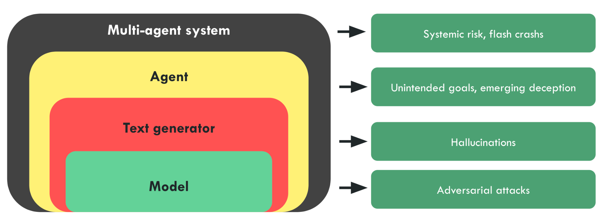
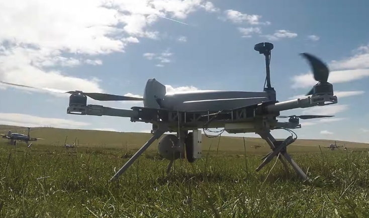
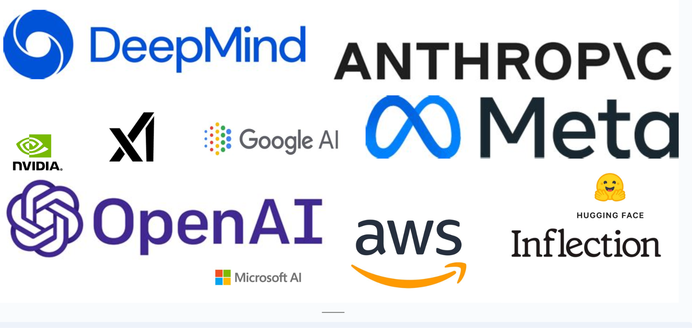

# Risk Aggravators
Before diving into the specific scenarios for the risk categories outlined in the previous sections, we cover some underlying common qualities of AI, or the economic space surrounding AI that serve to increase risk.

## Unpredictability

**AI surprised even the experts. **The first thing to keep in mind is that the rate of capabilities progress has shocked everyone, including the experts. We have seen many examples in history where scientists, and experts significantly underestimate the time it takes for a groundbreaking technological advancement to become a reality.

The Wright brothers famously claimed that powered flight was fifty years away, just two years before they achieved it. Lord Rutherford, a prominent physicist and the father of nuclear physics, dismissed the idea of extracting energy from nuclear fission as “moonshine,” only for Leo Szilard to invent the nuclear chain reaction less than 24 hours later. Similarly, Enrico Fermi expressed 90 percent confidence in 1939 that it was impossible to use uranium to sustain a fission chain reaction—yet, just four years later he was personally overseeing the first reactor.

Similarly, developments in AI have caught experts off guard too. In fact, it often does. The defeat of Lee Sedol by AlphaGo in 2016 came as a surprise to many experts, as it was widely believed that achieving such a feat would still require many more years of development. ([source](https://www.aisafetybook.com/textbook/1-4))

| Anecdote: Steinhardt’s forecasting contest |
|---|
| ML researchers, superforecasters, and most others were all surprised by the progress in large language models in 2022 and 2023.

In mid-2021, ML professor Jacob Steinhardt ran a contest to predict progress on MATH and MMLU, two famous benchmarks.

Figure: Experts have been consistently underestimating the pace of AI progress. 
Superforecasters massively undershot reality: 
In 2021, they predicted that performance on MMLU would improve moderately from 44% in 2021 to 57% by June 2022. The actual performance was 68%, which superforecasters had rated incredibly unlikely. (source). 
Shortly after that, models got even better — GPT-4 achieved 86.4% on this benchmark, close to the 89.8% that would be “expert-level” within each domain, corresponding to 95th percentile among human test takers within a given subtest. (source)

This is even more visible for the MATH dataset, that consists of free-response questions taken from math contests aimed at the best high school math students in the country. Most college-educated adults would get well under half of these problems right. At the time of its introduction in January 2021, the best model achieved only about ~7% accuracy on MATH. (source). And here is what happened:

 |

Not all forms of progress can be easily captured in quantifiable benchmarks. Often we care more about when AI systems will achieve more qualitative *milestones*: when will they translate as well as a fluent human? When will they beat the best humans at Starcraft? When will they prove novel mathematical theorems?

Katja Grace of AI Impacts asked ML experts to predict a wide variety of AI milestones in 2022. This was a few months before ChatGPT was released. This time accuracy was lower — experts failed to anticipate the progress that ChatGPT and GPT-4 would soon bring. These models achieved milestones like “Write an essay for a high school history class” or “Answer easily Googleable factual but open-ended questions better than an expert” just a few months after the survey was conducted, whereas the experts expected them to take years. ([source](https://www.planned-obsolescence.org/language-models-surprised-us/))

That means that even after the big 2022 benchmark surprises, experts were still in some cases strikingly conservative about anticipated progress, and undershooting the real situation.

For a long time, famous cognitive scientist Douglas Hofstadter was among those predicting slow progress. “I felt it would be hundreds of years before anything even remotely like a human mind”, he said in a recent interview. ([source](https://www.youtube.com/watch?v=lfXxzAVtdpU&t=1763s&ref=planned-obsolescence.org))

Now? “*This started happening at an accelerating pace, where unreachable goals and things that computers shouldn't be able to do started toppling. …systems got better and better at translation between languages, and then at producing intelligible responses to difficult questions in natural language, and even writing poetry. …The accelerating progress has been so unexpected, so completely caught me off guard, not only myself but many, many people, that there is a certain kind of terror of an oncoming tsunami that is going to catch all humanity off guard.*” - Douglas Hofstadter ([source](https://www.youtube.com/watch?v=lfXxzAVtdpU&t=1763s&ref=planned-obsolescence.org))

## Black-boxes

**These risks are made more acute by the black-box nature of advanced ML systems**. Our understanding of how AI systems behave, what goals they pursue, and our understanding of their internal behaviors lags far behind the capabilities they exhibit. The field of interpretability aims to progress on this front but remains very limited.

**AI models are ****trained****, not built.** This is very different from how a plane is assembled from pieces that are all tested and approved, to create a modular, robust, and understood system. AI models learn the heuristics needed to perform tasks by themselves, and we have relatively little control or understanding of what these heuristics are. Gradient descent is a powerful optimization strategy, but we have little control and understanding of the structure it discovers. To give an analogy, this is the difference between a codebase that is documented function by function and a codebase that is more like spaghetti code, with leaky and non-robust abstractions and poor modularity.

**AI systems are a series of emergent phenomena we steer but don't understand.** We can give a general direction, for example by designing the dataset or through prompt engineering, but this is far from the precision of software engineers or when designing a system like in the aerospace industry. There are no formal guarantees that the system will behave as expected. AI systems are like Russian dolls, with each technological layer surrounded by emergent problems and blind spots unforeseen at previous steps.

- **The Model:** Making a prediction on the next word or action, but it can be jailbroken through adversarial attacks.

- **Text generator:** The model that predicts the next token must be put into a system that constructs sentences, to create, for example, the APIs that allow getting a paragraph response to a question. But at this scale, the sentences can contain false information and hallucinations.

- **Agent:** The text generator can be put in a loop to create an agent: We give an objective to an agent, and the agent will decompose the objective into sub-objectives and sub-actions until accomplishing the goal. But goal-directed systems are subject once again to problems of unintended goals or emerging deception, as exhibited by the agent Cicero.

- **Multi-agent system:** The agent can dialogue with other agents or humans, resulting in a complex system that is subject to new phenomena, such as flash crashes in the financial world.

For illustrative purposes. Figure from the French Center for AI Safety’s agenda.

**Interpretability is not yet ready to help. **Interpretability research in AI aims to develop methods that enable humans to understand and explain the decision-making processes of machine learning models in ways that are accessible and comprehensible to non-experts.** **We are making progress, but so far, interpretability has not been very useful in practice for debugging models or predicting failure modes ([source](https://www.lesswrong.com/posts/LNA8mubrByG7SFacm/against-almost-every-theory-of-impact-of-interpretability-1)). Neural networks right now are just big piles of millions of numbers like -2, 4.5, 5.4, … Giving meaning, or deriving coherent behavior from just a heap of numbers is really hard. There is some debate about how much we understand models like GPT-2, but the bottom line is that we don't understand a fraction of the simplest phenomenon in GPT-2. We already know that models trained to predict tokens are superhuman at predicting the next token ([source](https://arxiv.org/abs/2212.11281)). This means that models use superhuman alien concepts to perform next token prediction, and there is little reason to think these concepts would be learnable or describable to humans in natural language ([source](https://www.lesswrong.com/posts/tEPHGZAb63dfq2v8n/how-useful-is-mechanistic-interpretability)). Even if these concepts were describable in natural language, it would not be a security guarantee because natural language is insecure, and there are many ways to create confusion with language since it is full of leaky abstractions.

## Deployment Scale

Another aggravating factor is that many AIs are already deployed at massive scales, significantly affecting various sectors and aspects of daily life. They are getting increasingly enmeshed into society. Chatbots are a leading example, showcasing AIs already deployed for millions globally. But there are many other examples.

**Autonomous drones. **Another notable deployment is an autonomous military drone called Kargu-2. There are increasingly more autonomous drones being deployed around the world, which marks a significant step towards an arms race in autonomous technologies.

**Figure:** Kargu-2 drones fly in swarms and, once launched, are capable of autonomously targeting and eliminating their targets. They were used by the Turkish army in 2020. ([source](https://information.tv5monde.com/international/robots-tueurs-des-drones-autonomes-turcs-ont-attaque-des-combattants-libyens-35843))

**AI Partners. **There has been an explosion of chatbot powered AI friends, therapists and lovers from services like Replika. One popular example is Xiachoice** **which is an AI system designed to create emotional bonds like friendships or romance with humans. It is reminiscent of the AI depicted in the movie “Her”, and was used by 600 million Chinese citizens. ([source](https://www.euronews.com/next/2021/08/26/meet-xiaoice-the-ai-chatbot-lover-dispelling-the-loneliness-of-china-s-city-dwellers))

**Google's Pathways** aims to revolutionize AI's capabilities, enabling a single model to perform thousands or millions of tasks. This ambition towards centralizing the global information flow could significantly influence the control and dissemination of information. ([source](https://blog.google/technology/ai/introducing-pathways-next-generation-ai-architecture/)) YouTube's recommendation algorithm has surpassed Google searches in terms of directing user engagement and influence. All these AIs already have massive consequences.

| Box: Power alone without bad intentions is dangerous. |
|---|
| Even if interpretability were successful, and we could fully interpret a model, removing deception and power-seeking behavior from it, this would not guarantee that the model would be harmless.
Consider the analogy of a child Superman who is unaware of his strength. When he shakes a friend's hand, there's a risk he might accidentally break the friend's hand.
Similarly, the fact that Superman could break his friend's arm by shaking hands cannot be discovered by analyzing Superman's brain. Yet, this is what happens in practice.
This concept applies to deception as well. Deception is not solely a property of the model; it also depends on the model's interaction with its environment.
Nate Soares has offered a story to illustrate this point, referring to it as Deep Deceptiveness.
Another perspective is that a system can be deceptive even if no single part is inherently dangerous, due to optimization pressure and complex interactions between the model and its environment. |

## Race Dynamics

The “race to the bottom” refers to a problematic scenario where competitive pressures in the development of AI lead to compromised safety standards. Developing safely is costly for the companies by placing them behind in an innovation race. Under certain conditions, the twin effects of widespread risk and costly safety measures may cause a “race to the bottom” in the level of safety investment. In a race to the bottom, each competitor skimps on safety to accelerate their rate of development progress.

**The Collingridge Dilemma** highlights the challenge of predicting and controlling the impact of new technologies. It posits that during the early stages of a new technology, its effects are not fully understood and its development is still malleable. Attempting to control or direct it is challenging due to the lack of information about its consequences and potential impact. Conversely, when these effects are clear and the need for control becomes apparent, the technology is often so deeply embedded in society that any attempt to govern or alter it becomes extremely difficult, costly, and socially disruptive.

**There will also be strong incentives for many people to deploy powerful AIs.** Companies may feel compelled to give capable AIs more tasks, to obtain an advantage over competitors, or simply to keep up with them. It will be more difficult to build perfectly aligned AIs than to build imperfectly aligned AIs that are still superficially attractive to deploy for their capabilities, particularly under competitive pressures. Once deployed, some of these agents may seek power to achieve their goals. If they find a route to their goals that humans would not approve of, they might try to overpower us directly to avoid us interfering with their strategy. ([source](https://www.aisafetybook.com/textbook/3-4#power))

**AIs given ambitious goals with little supervision may be especially likely to seek power.** While power could be useful in achieving almost any task, in practice, some goals are more likely to inspire power-seeking tendencies than others. AIs with simple, easily achievable goals might not benefit much from additional control of their surroundings. However, if agents are given more ambitious goals, it might be instrumentally rational to seek more control of their environment. This might be especially likely in cases of low supervision and oversight, where agents are given the freedom to pursue their open-ended goals, rather than having their strategies highly restricted. ([source](https://www.aisafetybook.com/textbook/3-4#power))

Figure: An illustration of the AI race. All of these players are explicitly trying to achieve AGI.

## Civilizational inadequacy

As of 2024, despite significant advancements in AI, there is a clear lack of adequate preparation for the potential risks posed by AI. This lack of readiness stems largely from the issue's complexity, a significant gap in public understanding, and a divide in expert opinion.

Many AI researchers have issued warnings, but their impact has been limited due to the abstract and complex nature of the problem. The AI safety issue is not readily tangible to most people, making it challenging to grasp the potential risks and envision how things could go wrong. Similarly, the field of AI safety suffers from an “awareness problem” that climate change, for instance, does not.

Moreover, there's a notable divide among experts. While some, like Yann LeCun, believe that AI safety is not an immediate concern, others argue that AI development has outstripped our ability to ensure its safety ([source](https://www.lesswrong.com/posts/oM9pEezyCb4dCsuKq/pausing-ai-developments-isn-t-enough-we-need-to-shut-it-all-1)). This lack of consensus leads to mixed messages about the urgency of the issue, contributing to public confusion and complacency.

Furthermore, the discourse about AI safety has been clouded by politics and misconceptions. Misinterpretations of what AI safety entails, as well as how it's communicated, can lead to alarmism or dismissive attitudes ([source](https://www.lesswrong.com/posts/tP75xLX7pddtMsT8v/alignment-is-hard-communicating-that-might-be-harder)). Efforts to raise awareness about AI safety can inadvertently result in backlash, or be co-opted into broader political and cultural debates.

Finally, the allure of AI advancements can overshadow their potential risks. For instance, the SORA text-to-video model's impressive capabilities may elicit excitement and optimism, but this can also distract from the substantial safety concerns the development of AGI could raise.

In conclusion, despite warnings and advancements, the world remains inadequately prepared for the potential risks posed by AI. Addressing this issue will require greater public education about AI safety, a more unified message from experts, and careful navigation of the political and social implications of the AI safety discourse.

*“A recent survey showed that half of AI researchers give AI at least 10% chance (**[source](https://aiimpacts.org/2022-expert-survey-on-progress-in-ai/)**) of causing human extinction. Since we have such a long history of thinking about this threat and what to do about it, from scientific conferences to Hollywood blockbusters, you might expect that humanity would shift into high gear with a mission to steer AI in a safer direction than out-of-control superintelligence. Think again” *— Max Tegmark, ([source](https://time.com/6273743/thinking-that-could-doom-us-with-ai/))