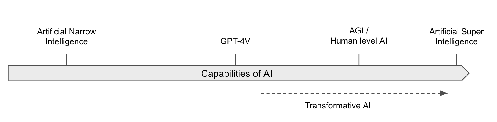

# Terminology

⌛ Estimated Reading Time: 10 minutes. (1941 words)

This section continues the discussion on the terminology necessary to discuss AI capabilities. It focuses in particular on certain thresholds that we might reach in the cognitive capabilities of these AI models.

## Capabilities vs. Intelligence

**The difficulty of defining and measuring intelligence**. Defining something is akin to establishing a standard unit of measurement, such as a gram for weight or a meter for distance. This foundational step is critical for assessment, understanding, and measurement. However, crafting a universally accepted definition of intelligence has proven to be a formidable challenge. Approaches tried in the past such as the Turing test, endeavored to test if AI systems think or act like humans. These criteria are outdated, and we need much more precise benchmarking not for systems that think or act purely rationally. ([source](https://www.ibm.com/topics/artificial-intelligence)) Since then there have been many attempts made at formalizing definitions of “intelligence”, “machine intelligence”([source](https://arxiv.org/abs/cs/0605024)), “human-like general intelligence” ([source](https://arxiv.org/abs/1911.01547)), and so on. The difficulty in finding a universally agreed-upon definition comes from several key factors:

- **Multidimensional Nature**: Intelligence is not a singular, linear attribute but a composite of various cognitive abilities including problem-solving, adaptability, learning capacity, and understanding complex concepts. It is multidimensional and context-dependent, which makes it challenging to condense into a single, universally agreed-upon definition.

- **Field-Specific Interpretations**: Different academic disciplines approach intelligence through diverse lenses. Psychologists may emphasize cognitive skills measurable by IQ tests. Computer scientists might view intelligence as the capability of machines to perform tasks requiring human-like cognitive processes. Neuroscientists approach intelligence from a biological standpoint, focusing on the brain's physical and functional properties, whereas anthropologists and sociologists might perceive intelligence as culturally relative, emphasizing social and emotional competencies. Philosophers' intelligence abstractly, its nature and components, including abstract thought, self-awareness, creativity, etc... Each perspective enriches the discussion but complicates the formation of a consensus.

- **Human-centric Bias**: Many existing definitions of intelligence are rooted in human cognition, posing limitations when considering AI systems or non-human intelligence. This bias suggests a need for broader criteria that can encompass intelligence in all its forms, not just those familiar to human cognition.

- **Implementation Independence**: Intelligence manifests across the natural world, making its measurement across species or entities particularly challenging. An effective definition should be impartial, recognizing intelligence even when it operates in unfamiliar or not fully understood ways.

- **Abstract and Ambiguous Nature**: Intelligence is an abstract concept and abstract concepts often carry inherent ambiguities. This ambiguity can lead to different interpretations and debates about what constitutes "real" or "true" intelligence.

Due to all these reasons, when discussing artificial intelligence, particularly in the context of risks and safety, it's often more effective and precise to focus on "capabilities" rather than "intelligence".

**Defining Capabilities**. The term "capabilities" encompasses the specific, measurable abilities of an AI system. These can range from pattern recognition across large datasets, learning and adapting from the environment to mastering complex tasks traditionally requiring human intelligence. Unlike the abstract qualities often associated with the notion of intelligence, such as consciousness or self-awareness, capabilities are directly observable and quantifiable aspects of AI performance.

**Advantages of Focusing on Capabilities**. Focusing on capabilities offers a clearer and more pragmatic framework for discussing AI systems, particularly when evaluating potential risks. This approach facilitates direct comparisons of AI abilities with human skills, sidestepping the ambiguities tied to the concept of intelligence. For instance, rather than debating an AI system's intelligence relative to humans, we can assess its proficiency in specific tasks, enabling a more straightforward understanding and management of AI-related risks. ([source](https://www.alignmentforum.org/posts/JtuTQgp9Wnd6R6F5s/when-discussing-ai-risks-talk-about-capabilities-not)) Talking about capabilities instead of intelligence gives us the following advantages:

- **Ambiguity of Intelligence & Measurement challenges**: The concept of intelligence is fraught with ambiguity and subjective interpretations, complicating discussions around AI and its implications. Capabilities allow us to talk about risks, despite the lack of a universally agreed-upon definition of intelligence, and a way to measure it.

- **Tangibility and specificity**: Capabilities refer to the specific skills or abilities of an AI system, which are often easier to measure and discuss than intelligence. For instance, we can evaluate an AI system's capability to recognize patterns in data, learn from its environment, or perform complex tasks. Discussing AI in terms of these specific capabilities can provide a clearer and more accurate picture of what AI systems can do and how they might pose risks.

- **Irrelevance of human-like qualities**: The discussion of AI risk is not contingent on “humanlike qualities” such as being conscious, being alive, or having human-like emotions. AI systems might have none of these qualities but still display advanced and dangerous capabilities. Focusing on “what they can do”, rather abstract qualities of “what they are” avoids these potentially confusing and irrelevant comparisons.

Despite the preference for capabilities, the discourse surrounding AI, both historically and in contemporary settings, frequently invokes "intelligence" in multiple contexts. To bridge this gap, the next few sections will present a comprehensive overview of the diverse definitions of intelligence in the field.

## Definitions of advanced AI Systems

This section explores various definitions of different AI capability thresholds. The following list encompasses some of the most frequently used terms:

**Intelligence**: As the previous section outlined, the term intelligence is very hard to define. This book does not depend on any specific definition. A commonly accepted definition is - “*Intelligence measures an agent's ability to achieve goals in a wide range of environments.*” - Legg, Shane; Hutter, Marcus; (Dec 2007) "[Universal Intelligence: A Definition of Machine ](https://arxiv.org/abs/0712.3329)[Intelligence](https://arxiv.org/abs/0712.3329)"

**Artificial intelligence**: An AI system is a machine-based system that, for explicit or implicit objectives, infers, from the input it receives, how to generate outputs such as predictions, content, recommendations, or decisions that can influence physical or virtual environments. Different AI systems vary in their levels of autonomy and adaptiveness after deployment ([OECD.AI](https://oecd.ai/en/wonk/ai-system-definition-update), 2023).

**Artificial Narrow Intelligence (ANI)**: “*Weak AI—also called Narrow AI or Artificial Narrow Intelligence (ANI)—is AI trained and focused to perform specific tasks. Weak AI drives most of the AI that surrounds us today. ‘Narrow’ might be a more accurate descriptor for this type of AI as it is anything but weak; it enables some very robust applications, such as Apple's Siri, Amazon's Alexa, IBM Watson, and autonomous vehicles.*” ([source IBM](https://www.ibm.com/topics/artificial-intelligence))

**Artificial General Intelligence (AGI)**: Also known as strong AI. AGI refers to systems that can apply their intelligence to a similarly extensive range of domains as humans. These AIs do not need to perform all tasks; they merely need to be capable enough to invent tools to facilitate the completion of tasks. Much like how humans are not perfectly capable in all domains but can invent tools to make problems in all domains easier to solve. AGI often gets described as “*the ability to achieve complex goals in complex environments using limited computational resources. This includes efficient cross-domain optimization and the ability to transfer learning from one domain to another.*” - Muehlhauser, Luke (Aug 2013) “[What is AGI?](https://intelligence.org/2013/08/11/what-is-agi/)”

**Human-Level AI (HLAI)**: This term is sometimes used interchangeably with AGI, and refers to an AI system that equals human intelligence in essentially all economically valuable work. However, the term is a bit controversial as 'human-level' is not well-defined ([source](https://intelligence.org/2013/06/19/what-is-intelligence-2/)). This concept contrasts with current AI, which is vastly superhuman at certain tasks while weaker at others.

**Transformative AI (TAI)**. One of the main things we seek to assess about any given cause is its importance: how many people are affected, and how deeply? All else equal, we’re more interested in AI developments that would affect more people and more deeply. The concept of “transformative AI” has some overlap with concepts such as “superintelligence” and “artificial general intelligence.” However, “transformative AI” is intended to be a more inclusive term, leaving open the possibility of AI systems that count as “transformative” despite lacking many abilities humans have. Succinctly, TAI is a “*potential future AI that triggers a transition equivalent to, or more significant than, the agricultural or industrial revolution.*”- Karnofsky, Holden; (May 2016) "[Some Background on Our Views Regarding Advanced Artificial Intelligence](https://www.openphilanthropy.org/research/some-background-on-our-views-regarding-advanced-artificial-intelligence/)"

**Artificial Super Intelligence (ASI)**: *“This is any intellect that greatly exceeds the cognitive performance of humans in virtually all domains of interest*". — Bostrom, Nick (2014) “Superintelligence” Unlike AGI, an ASI refers to a system that not only matches but greatly exceeds human capabilities in virtually all economically valuable work or domains of interest. ASI implies a level of intelligence where the AI system can outperform the best human brains in practically every field, including scientific creativity, general wisdom, and social skills. This would mean an ASI could potentially perform tasks that humans couldn't even comprehend.

Figure: For illustrative purposes. This graph could be criticized because it is not clear that the capabilities of those AIs can be reduced to a single dimension.

Often, these terms get used as discrete capability thresholds; that is, individuals tend to categorize an AI as potentially an AGI, an ASI, or neither. The next section will introduce a framework for viewing AI capabilities on a continuous scale, providing a more granular and insightful lens through which to assess AI development and its implications for humanity.

## (t,n)-AGI

**Defi****ning (t,n)-AGI**. A system receives the designation of "t-AGI" if it can surpass a human expert in a certain cognitive task within the timespan 't'. A system gets identified as (t,n)-AGI if it can outdo a group of 'n' human experts working collectively on a set of cognitive tasks for the duration 't'.

For instance, an AI that exceeds the capability of a human expert in one second on a given cognitive task would be classified as a "one-second AGI". This scalable measure extends to longer durations, such as one minute, one hour, or even one year, depending on the AI's efficiency compared to human expertise within those periods.

- **One-second AGI**: Beating humans at recognizing objects in images, basic physics intuitions (e.g. "What happens if I push a string?"), answering trivia questions, etc.

- **One-minute ****AGI**: Beating humans at answering questions about short text passages or videos, common-sense reasoning, looking up facts, justifying an opinion, etc.

- **One-hour ****AGI**: Beating humans at problem sets/exams, composing short articles or blog posts, executing most tasks in white-collar jobs (e.g., diagnosing patients, providing legal opinions), conducting therapy, etc.

- **One-day ****AGI**: Beating humans at negotiating business deals, developing new apps, running scientific experiments, reviewing scientific papers, summarizing books, etc.

- **One-month ****AGI**: Beating humans at carrying out medium-term plans coherently (e.g., founding a startup), supervising large projects, becoming proficient in new fields, writing large software applications (e.g., a new operating system), making novel scientific discoveries, etc.

- **One-year AGI**: These AIs would beat humans at basically everything. Mainly because most projects can be divided into sub-tasks that can be completed in shorter timeframes.

Although it is more formal than the definitions provided in the previous section, the (t,n)-AGI framework does not account for how many copies of the AI run simultaneously, or how much compute.

As of the third quarter of 2023, we can establish a rough equivalence “*from informal initial experiments, our guess is that humans need about three minutes per problem to be overall as useful as GPT-4 when playing the role of trusted high-quality labor.”*([source](https://arxiv.org/abs/2312.06942)) So existing systems can roughly be believed to qualify as one-second AGIs, and are considered to be nearing the level of one-minute AGIs.

They might be a few years away from becoming one-hour AGIs. Within this framework, Ngo anticipates that a superintelligence (ASI) could be something akin to a (one year, eight billion)-AGI, that is, an ASI could be seen as an AGI that outperforms all eight billion humans coordinating for one year on a given task.
