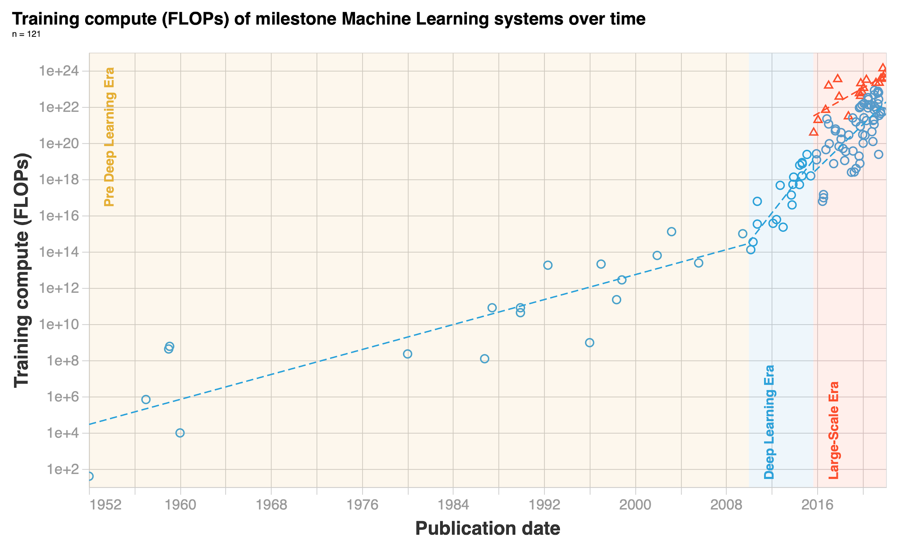
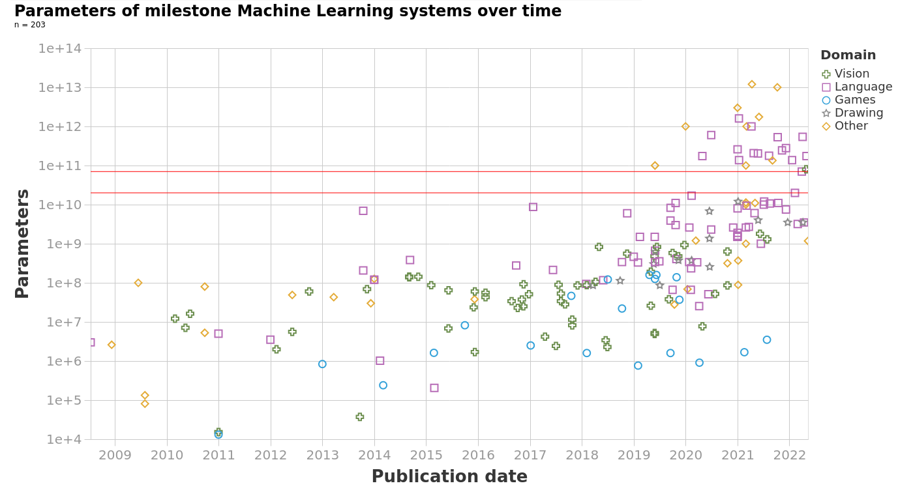

# Appendix 3: Trends

⌛ Estimated Reading Time: 8 minutes. (1444 words)

Generally, the three main components recognized as the main variables of advancement in deep learning are: computational power available, algorithmic improvements, and the availability of data. ([source](https://cset.georgetown.edu/publication/the-ai-triad-and-what-it-means-for-national-security-strategy/))

We can anticipate that models will continue to scale in the near future. Increased scale combined with the increasingly general-purpose nature of foundation models could potentially lead to a sustained growth in general-purpose AI capabilities.

***Figure****: Monitoring the trends in ML quantitatively. Epoch (2023), "Key trends and figures in Machine Learning". Published online at epochai.org. (**[source](https://epochai.org/trends)**)*

## Compute Trends

The first thing to look at is the trends in the overall amount of training compute required when we train our model. Training compute grew by 1.58 times/year up until the Deep Learning revolution around 2010, after which growth rates increased to 4.2 times/year. We also find a new trend of “large-scale” models that emerged in 2016, trained with 2-3 OOMs more compute than other systems in the same period.

Hardware advancements are paralleling these trends in training compute and data. GPUs are seeing a yearly 1.35 times increase in floating-point operations per second (FLOP/s). However, memory constraints are emerging as potential bottlenecks, with DRAM capacity and bandwidth improving at a slower rate. Investment trends reflect these technological advancements

In 2010, before the deep learning revolution, DeepMind co-founder Shane Legg predicted human-level AI by 2028 using compute-based estimates ([source](http://www.vetta.org/2010/12/goodbye-2010/)). OpenAI co-founder Ilya Sutskever, whose AlexNet paper sparked the deep learning revolution, was also an early proponent of the idea that scaling up deep learning would be transformative.

***Figure****: Epoch (2023), "**[Key trends and figures in Machine Learning](https://epochai.org/trends)**"*

## Model Size Trends

In this section, let's look at the trends in model parameters. The following graph shows how even though parameter counts have always been increasing, in the new 2018+ era, we have really entered a different phase of growth. Overall, between the 1950s and 2018, models have grown at a rate of 0.1 orders of magnitude per year (OOM/year). This means that in the 68 years between 1950 and 2018 models grew by a total of 7 orders of magnitude. However, post-2018, in just the last 5 years models have increased by yet another 4 orders of magnitude (not accounting for however many parameters GPT-4 has because we don't know).

The following table and graph illustrate the trend change in machine learning models' parameter growth. Note the increase to half a trillion parameters with constant training data.

| model | year | size (#parameters) | data (#training tokens) |
|---|---|---|---|
| LaMDA | 2021 | 137 billion | 168 billion |
| GPT-3 | 2020 | 174 billion | 300 billion |
| Jurassic | 2021 | 178 billion | 300 billion |
| Gopher | 2021 | 280 billion | 300 billion |
| MT-NLG 530B | 2022 | 530 billion | 270 billion |

***Figure****: Villalobos, Pablo et. al. (Jul 2022) “**[Machine Learning Model Sizes and the Parameter Gap](https://arxiv.org/abs/2207.02852)**”*

## Algorithmic Trends

**Algorithmic advancements** also play a role. For instance, between 2012 and 2021, the computational power required to match the performance of AlexNet has been reduced by a factor of 40, which corresponds to a threefold yearly reduction in the compute required for achieving the same performance on image classification tasks like ImageNet. Improving the architecture also counts as algorithmic advancement. A particularly influential architecture is that of Transformers, central to many recent innovations, especially in chatbots and autoregressive learning. Their ability to be trained in parallel over every token of the context window fully exploits the power of modern GPUs, and this is thought to be one of the main reasons why they work so well compared to their predecessor, even if this point is controversial.

??? question "Does architecture really matter?"

	
	This is a complicated question, but some evidence suggests that once an architecture is expressive and scalable enough, the architecture matters less than we might have thought:
	
	In a paper titled ‘[ConvNets Match Vision Transformers at Scale](https://arxiv.org/abs/2310.16764),' Google researchers found that Visual Transformers (ViT) can achieve the same results as CNNs simply by using more compute. They took a special CNN architecture and trained it on a massive dataset of four billion images. The resulting model matched the accuracy of existing ViT systems that used similar training compute.
	
	Variational Auto Encoders (long an also-ran to[GANs](https://en.wikipedia.org/wiki/Generative_adversarial_network) or autoregressive models in terms of image generation) catch up if you make them very deep ([source](https://arxiv.org/abs/2011.10650#openai), [source](https://arxiv.org/abs/2007.03898#nvidia)).
	
	Progress in late 2023, such as the mamba architecture ([source](https://arxiv.org/abs/2312.00752)), appears to be an improvement on the transformer. It can be seen as an algorithmic advancement that reduces the amount of training computation needed to achieve the same performance.
	
	The connections and normalizations in the transformer, which were thought to be important, can be taken out if the weights are set up correctly. This can also make the transformer design simpler (Note however that this architecture is slower to converge than the others). ([source](https://openreview.net/forum?id=NPrsUQgMjKK))
	
	On the other side of the argument, certain attention architectures are significantly more scalable when dealing with long context windows, and no feasible amount of training could compensate for this in more basic transformer models. Architectures specifically designed to handle long sequences, like Sparse Transformers ([source](https://arxiv.org/abs/1904.10509)) or Longformer ([source](https://arxiv.org/abs/2004.05150)), can outperform standard transformers by a considerable margin for this usage. In computer vision, architectures like CNNs are inherently structured to recognize spatial hierarchies in images, making them more efficient for these tasks than architectures not specialized in handling spatial data when the amount of data is limited, and the “prior” encoded in the architecture makes the model learn faster.
	

## Data Trends

The last trend we are going to look at is one of increasing data. Basically, we are using ever-increasing amounts of data to train our models. The paradigm of training foundation models to fine-tune later is accelerating this trend. If we want a generalist base model then we need to provide it with ‘general data’ which is code for all the data we can get our hands on. You have probably heard that models like ChatGPT and PaLM are trained on data from the internet. The internet is the biggest repository of data that humans have. Additionally, as we observed from the Chinchilla papers scaling laws, it is possible that data to train our models is the actual bottleneck, and not compute or parameter count. So the natural question is how much data is left on the internet for us to keep training our models? and how much more data do we humans generate every year?

**How much data do we generate?**

The total amount of data generated every single day is on the order of ~463EB (Source: [World Economic Forum](https://www.weforum.org/agenda/2019/04/how-much-data-is-generated-each-day-cf4bddf29f/)). But in this post, we will assume that models are not training on ‘all the data generated’ (yet), rather they will continue to only train on open-source internet text and image data. The available stock of text and image data grew by 0.14 OOM/year between 1990 and 2018 but has since slowed to 0.03 OOM/year.

**How much data is left?**

The median projection for when the training dataset of notable ML models exhausts the stock of professionally edited texts on the internet is 2024. The median projection for the year in which ML models use up all the text on the internet is 2040. Overall, projections by Epochai predict that we will have exhausted high-quality language data before 2026, low-quality language data somewhere between 2030 and 2050, and vision data between 2030 and 2060. This might be an indicator of slowing down ML progress after the next couple of decades. These conclusions from Epochai, like all the other conclusions in this entire leveraging computation section, rely on the unrealistic assumptions that current trends in ML data usage and production will continue and that there will be no major innovations in data efficiency, i.e. we are assuming that the amount of capabilities gained per training datapoint will not change from current standards.

***Figure****: ML data consumption and data production trends for low-quality text, high-quality text, and images. - Source: Epoch (2023), "**[Key trends and figures in Machine Learning](https://epochai.org/trends)**"*

Even if we run out of Data, many solutions are proposed, from using synthetic data, for example, filtering and preprocessing the data with GPT-3.5 to create a new cleaner dataset, an approach used in the paper "Textbooks are all you need" with models like Phi 1.5B that demonstrate excellent performance for their size through the use of high-quality filtered data, to the use of more efficient trainings, or being more efficient by training on more epochs.
