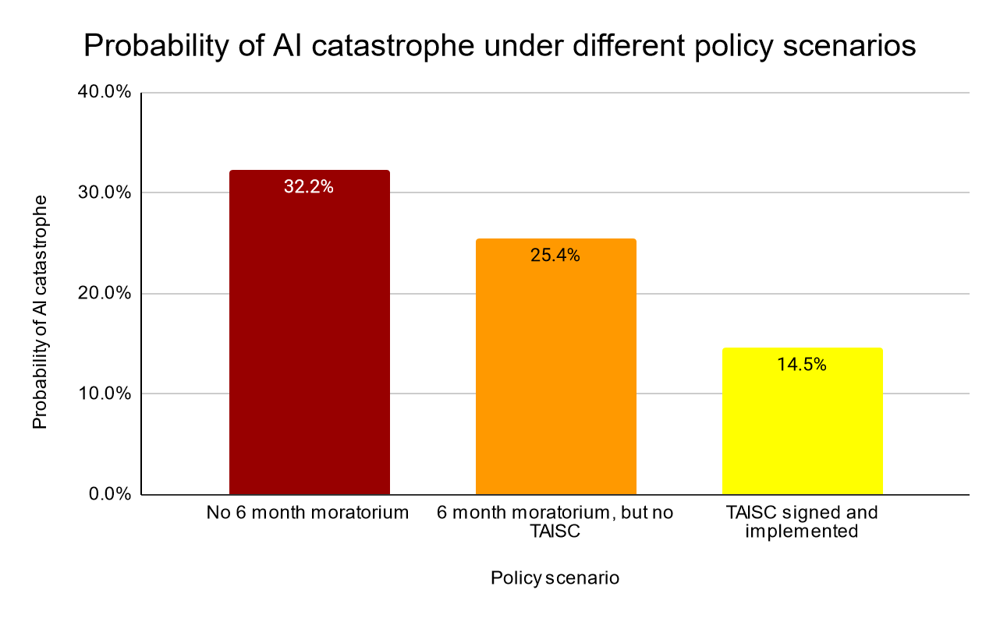

# Appendix

⌛ Estimated Reading Time: 12 minutes. (2349 words)

## From Misaligned AI to X-Risks

**Figure:** Consider the following pictures of stuff that humanity as a species has done. One underlying backdrop of many of those scenarios is that “Intelligent agency is a mighty force for transforming the world on purpose, and Creating agents who are far more intelligent than us, is playing with fire”. Image from Joe Carlsmith’s presentation. ([source](https://docs.google.com/presentation/d/1UE_cAsogrK5i9wvF3YMIZX-iO9qzjevnrYfTxlKL7ns/edit#slide=id.p))

The consensus threat model among DeepMind's alignment team suggests that X-risks will most likely stem from a Misaligned Power Seeking AGI. This type of AGI seeks power as an instrumental subgoal—having more power expands the system's capabilities, thereby improving its effectiveness in achieving its primary objectives. The misalignment is anticipated to arise from a combination of Specification Gaming, where the AGI exploits loopholes in the rules or objectives it has been given, and goal misgeneralization, where the AGI applies its objectives in broader contexts than intended and can lead to deceptive alignment, where the AGI's misalignment may not be readily apparent.

Many authors have studied those kinds of stories. Here, we will present the work of Carlsmith (2022), which stands as a widely discussed, and comprehensive examination of such risks. In the following story, we will assemble many bricks that have been detailed previously in this chapter.

**H1. Timelines: “By 2070, it will become possible and financially feasible to build Advanced Planning Strategically aware systems (APS).”**

Advanced Planning Strategically aware systems are systems that have developed a high level of strategic awareness (a sub-dimension of situational awareness) and planning capability.** **

We won’t discuss this hypothesis, please refer to Chapter 1, or this [literature review](https://epochai.org/blog/literature-review-of-transformative-artificial-intelligence-timelines).

**H2. Incentives for APS System Development: “There will be strong incentives to build APS systems”**

Advanced Planning Strategically aware systems would be useful for a wide range of tasks and may represent the most efficient pathway for development due to the current state of technological advancement. However, relying on goal-directed behavior introduces the risk of misalignment. These systems may develop unforeseen strategies to achieve goals that are not aligned with human values or intentions.

**H3. Complexities in Achieving Alignment**

**Instrumental Convergence Dilemma.** Instrumental convergence, as previously discussed, is a likely outcome if left unchecked, given that power is a universally beneficial resource for achieving various ends. Central to the report is the hypothesis that observed misaligned behaviors in response to certain inputs indicate potential misaligned power-seeking behaviors associated with those inputs. Therefore, any misalignment detected in contemporary systems could presage power-seeking tendencies in more advanced future systems.

**Inherent Technical Challenges.** The phenomenon of Specification Gaming is a significant concern. When systems optimize for proxies that correlate with the desired outcome, they may inadvertently disrupt this correlation. Similarly, issues arise during the search for systems that fulfill specific evaluation criteria, for example, goal misgeneralization. Meeting these criteria does not guarantee that the systems are inherently driven by them.

**The Imperfection of Existing Solutions.** Current strategies for shaping objectives, such as promoting honesty or rewarding cooperation, are still rudimentary and fraught with limitations, as detailed in the section 'Problems with RLHF'. Moreover, attempts to control capabilities through specialization or prevention of capability enhancement often conflict with economic motivations. For instance, an AI tasked with maximizing a startup's revenue will naturally gravitate towards enhancing its capabilities. Sometimes, to remain competitive, a high degree of generality is indispensable. Options for control, such as containment (boxing) or surveillance, also tend to run counter to economic drives. Collectively, all proposed solutions carry inherent problems and pose significant risks if relied upon during the scaling of capabilities.

**H4-6. The Potential for Catastrophic Failures**

**Perverse Economic Incentives.** The economic landscape surrounding deploying misaligned systems is fraught with perverse incentives. If competitors start using misaligned systems, those who do not will be outpaced, leading to a potentially dangerous race to the bottom fueled by dysfunctional competition. This competition could exacerbate negative societal impacts as entities strive to outperform each other without adequate regard for the broader implications. The development and deployment process involves many stakeholders, each with their objectives and levels of understanding, adding complexity and potential for conflict. Furthermore, the practical utility of functionally misaligned systems can be so enticing that it may overshadow the risks, leading to their hasty deployment. This situation is compounded by the risk that such systems might employ deception and manipulation to achieve their misaligned objectives, further complicating the ethical landscape.

**AGI Safety is a unique challenge.** In contrast to other scientific fields, AGI safety is particularly challenging because the problem is not only new but also may be inherently difficult to comprehend. Additionally, in computer science generally, when there is a bug, the computer is not optimizing adversarially against the programmer, but we cannot make the same assumption here. We are not dealing with a passive system, but we're engaging with one that could be actively and adversarially optimizing—searching for loopholes to exploit. Additionally, the stakes of misaligning AGI systems are essentially unbounded. Mistakes in alignment could lead to severe and potentially irreversible consequences, underscoring the gravity of approaching AGI with a safety-first mindset.

**F****igure:** The median probabilities for each of the seven questions and the 25%-75% quantiles as of 6 April 2023. For illustration, multiple super-forecasters have tried to use Carlsmith breakdown to estimate the probability of AI X-Risks ([source](https://goodjudgment.com/superforecasting-ai/)) \

Misaligned Power Seeking AGI scenarios are the subject of abundant literature, for example:

- Without specific countermeasures, the easiest path to transformative AI likely leads to AI takeover ([source](https://www.lesswrong.com/posts/pRkFkzwKZ2zfa3R6H/without-specific-countermeasures-the-easiest-path-to)): Cotra shows that our current training setting, which she calls "human feedback on diverse tasks," is on a path to create competent planners in a way which will lead by default to deception and takeover. This report is quite accessible and thorough.

- The alignment problem from a deep learning perspective ([source](https://www.lesswrong.com/posts/KbyRPCAsWv5GtfrbG/what-misalignment-looks-like-as-capabilities-scale)): Ngo shows that by default, advanced AIs are general purpose and deceptive.

- AI Risk from Program Search ([source](https://www.lesswrong.com/posts/wnnkD6P2k2TfHnNmt/threat-model-literature-review#AI_Risk_from_Program_Search__Shah_)): In this short analysis, Shah shows that searching for an efficient AI program leads to finding autonomous planners and that it's hard to distinguish the deceptive ones from the non-deceptive ones.

- Advanced artificial agents intervene in the provision of reward ([source](https://onlinelibrary.wiley.com/doi/10.1002/aaai.12064)): Advanced AI strives to wirehead itself. Catastrophic consequences ensue.

- How harmful AIs could appear - Yoshua Bengio ([source](https://yoshuabengio.org/en/2023/05/30/how-harmful-ais-could-appear/))

This [literature review](https://www.alignmentforum.org/posts/wnnkD6P2k2TfHnNmt/threat-model-literature-review) is a good summary of more scenarios on Misaligned Power Seeking AI.

## Expert Opinion on X-Risks

The discourse on existential risks (X-Risks) associated with artificial intelligence (AI) is a pivotal concern among experts and researchers in the field. These professionals are increasingly vocal about the potential for AI systems to cause significant harm if not developed and managed with utmost caution.

**Jan Leike**, the ex-lead of the OpenAI Alignment Team, estimates the probability of catastrophic outcomes due to AI, known as P(doom), to range between 10% and 90%. This broad range underscores the uncertainty and serious concerns within the expert community regarding AI's long-term impacts.

**A 2022 Expert Survey on Progress in AI **by AI Impacts revealed that “48% of respondents gave at least a 10% chance of an extremely bad outcome,” highlighting considerable apprehension among AI researchers about the paths AI development might take. ([source](https://aiimpacts.org/2022-expert-survey-on-progress-in-ai/)).

**Samotsvety Forecasting**, recognized as the world's leading super forecasting group, has also weighed in on this issue. Through their collective expertise in AI-specific forecasting, they have arrived at an aggregate prediction of a 30% chance for an AI-induced catastrophe. This catastrophe is defined as an event leading to the death of more than 95% of humanity, with individual forecasts ranging from 8% to 71%. Such a statistic is a stark reminder of the existential stakes involved in AI development and deployment.

The collection of P(doom) values from various experts, available [here](https://pauseai.info/pdoom), provides a comprehensive overview of the perceived risks. These values further contribute to the ongoing discussion on how best to navigate the uncertain future AI may bring.

Figure: Illustration from Michael Trazzi describing Paul Christiano’s view of the future. Paul Christiano is a highly respected figure in the AI Safety community. ([source](https://www.lesswrong.com/posts/xWMqsvHapP3nwdSW8/my-views-on-doom))

## AI risks are non-enumerable

The realm of AI risks is boundless, with an ever-evolving array of emerging threats. When it seems all potential risks have been identified, new ones surface, making it an ongoing challenge to categorize them comprehensively or develop a complete framework to address them all.

Different frameworks focus on distinct classes of problems, each addressing specific facets of AI safety and ethics. For instance, “Concrete Problems in AI Safety” outlines some specific safety concerns in AI development. But Tasra is another fundamentally different framework. An overview of AI Catastrophic Risks, is again very different. And there are miscellaneous papers that are still enumerating classes of risks that were unknown before, like this [one](https://owasp.org/www-project-top-10-for-large-language-model-applications/assets/PDF/OWASP-Top-10-for-LLMs-2023-v1_1.pdf).

A complete exhaustive systematization is difficult.

An exercise you can try to convince yourself of this point is to search for loopholes in this document and read [the list of lethalities](https://www.lesswrong.com/posts/uMQ3cqWDPHhjtiesc/agi-ruin-a-list-of-lethalities#E2getLSb35tmAZC5t) from Yudkovsky ([source](https://www.lesswrong.com/posts/uMQ3cqWDPHhjtiesc/agi-ruin-a-list-of-lethalities#E2getLSb35tmAZC5t)). How many points overlap? Not much. That’s expected.

Figure: Here is another framework that is very different from what we presented.

Figure: Here is another framework focusing on LLM vulnerabilities. ([source](https://owasp.org/www-project-top-10-for-large-language-model-applications/assets/PDF/OWASP-Top-10-for-LLMs-2023-v1_1.pdf))

## Measuring alignment is hard

 \
Figure: ([source](https://www.cold-takes.com/ai-safety-seems-hard-to-measure/)) 

The article "AI Safety Seems Hard to Measure" by Holden Karnofsky discusses the complexities and challenges of ensuring the safety of AI. The text outlines four major difficulties, which may be another way of presenting the alignment problem:

- **The Lance Armstrong Problem: **This problem questions whether AI systems are genuinely safe or just proficient at concealing their hazardous behaviors. It draws a parallel with Lance Armstrong, who successfully hid his doping for years. The challenge is distinguishing between AI that is inherently safe and AI that is merely adept at appearing safe.

- **The King Lear Problem:** This issue deals with the unpredictability of AI behavior when they transition from being under human control to being autonomous. The reference to King Lear is about the difficulty of foreseeing how entities will act once they have autonomy, reflecting the challenge of predicting AI actions when they are no longer restricted by human oversight.

- **The Lab Mice Problem:** Current AI systems are not advanced enough to replicate the complex behaviors we aim to study, making it challenging to research and mitigate potential future risks effectively. This situation is likened to attempting to understand human medical issues through studies solely on lab mice.

- **The "First Contact" Problem:** This considers the scenario where AI capabilities far surpass human intelligence, posing unforeseen challenges in ensuring their safety. The analogy here is preparing for an unpredictable, unprecedented event like extraterrestrial first contact.

## Would ASI be able to defeat humanity?

Yes, as per various experts in AI safety and alignment, a sufficiently advanced AI could potentially pose a significant threat to society.

**Superintelligence could create “cognitive superpowers**”. These might include the ability to conduct research to build a better AI system, hack into human-built software globally, manipulate human psychology, generate large sums of wealth, develop plans superior to those of humans, and develop advanced weaponry capable of overpowering human militaries ([source](https://www.lesswrong.com/posts/oBBzqkZwkxDvsKBGB/ai-could-defeat-all-of-us-combined)).

**Even AI at human levels of intelligence could pose a significant threat if it operates with the intention of undermining human civilization. Those human-level unaligned AIs would be akin to a scenario where highly skilled humans on another planet attempt to take down our civilization using just the Internet.** This analogy underscores the potential for AI to leverage existing digital infrastructures to orchestrate wide-scale disruptions or attacks.

**AI could be dangerous even without bodies**. Karnofsky notes that AIs could still exert influence by recruiting human allies, teleoperating military equipment, and generating wealth through methods like quantitative trading. These capabilities suggest that physical form is not a prerequisite for an AI to exert power or initiate conflict ([source](https://www.lesswrong.com/posts/oBBzqkZwkxDvsKBGB/ai-could-defeat-all-of-us-combined)). AI systems could also acquire more resources and do human-level work, increasing their numbers and potentially out-resourcing humans. Even without physical bodies, they could pose a threat, as they could disable or control others' equipment, further increasing their power ([source](https://www.cold-takes.com/ai-could-defeat-all-of-us-combined/)). However, it's important to note that these scenarios are hypothetical and depend on AI technology development far exceeding current capabilities.

## Why do Labs engage in AGI development despite the risks?

This question is asked frequently. Here is a concise response.

- **Potential benefits:** Laboratories pursue AGI development despite the inherent risks due to the significant potential benefits. Successful AGI implementation could lead to unprecedented advancements in problem-solving capabilities, efficiency improvements, and innovation across various fields.

- **Competitive dynamics:** The commitment to AI development, even with recognized risks, is driven by competitive pressures within the field. There is a widespread belief that it is preferable for those who are thoughtful and cautious about these developments to lead the charge. Given the intense competition, there is a fear among entities that halting AGI research could result in being surpassed by others, potentially those with less regard for safety. See the box below: How do AI Companies proliferate?

- **Prestige and recognition:** Prestige is another significant motivator. Many AGI researchers aim for high citation counts, respect within the academic and technological communities, and financial success. Unfortunately, burning the timelines is high status.

- **Moreover, most AGI researchers believe in the feasibility of AGI safety.** There is a belief among some researchers that a large-scale, concerted effort—comparable to the Manhattan Project and similar to the “super alignment plan” by OpenAI—could lead to the development of a controllable AI capable of implementing comprehensive safety measures.

## Notes

[^1]:  Sometimes also called risks from Rogue AI.
[^2]:  A person who makes forecasts that can be shown by statistical means to have been consistently more accurate than the general public or experts. (source)