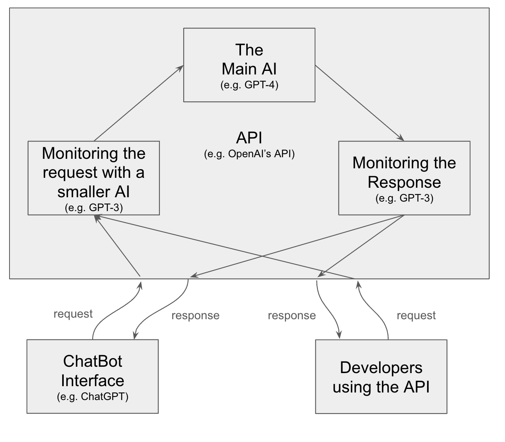
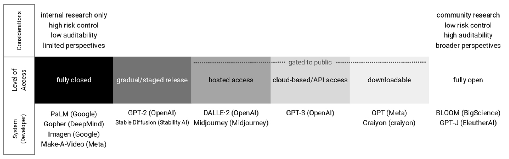
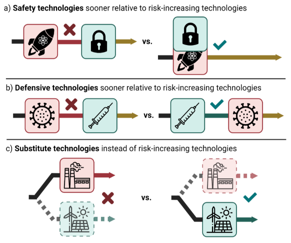

# Misuse

⌛ Estimated Reading Time: 11 minutes. (2187 words)

**Recap on the potential misuses of AI, from present threats to future ones:**

- **Misinformation campaigns:** Spreading false narratives or manipulating elections.

- **Deep fakes:** Misleading people using fake videos or calls that seem real

- **Loss of privacy:** Intercepting personal data or eavesdropping on people’s activities.

- **Destructive AI conflicts:** Using AI to create more lethal and autonomous weaponry.

- **Cyberattacks:** Targeting critical structures such as major financial institutions or nuclear facilities using an AI's superhuman abilities.

- **Engineered pandemics:** Designing and producing deadly pathogens.

In addressing the mitigation of ***future*** potential misuses of mighty AI, two distinct strategies emerge:

- **Strategy A: Limiting the proliferation of ****high-risk models**** - for example, via monitored APIs.** The Monitored APIs strategy focuses on controlling access to AI models that could pose extreme risks, such as those capable of enhancing **cyberattacks** or facilitating the creation of **engineered pandemics**. By placing high-risk models behind monitored APIs, we ensure only authorized users can access the technology. This approach is akin to digital containment, where the potential of AI to be weaponized or misused is curtailed by stringent access controls. This method also allows for detailed tracking of how the AI models are being used, enabling the early detection of misuse patterns.

- **Strategy B: “vaccinating” the society and “preparing vaccine factories” for many types of harm - a strategy called Defense Acceleration.** The Defense Acceleration (d/acc) strategy ([source](https://vitalik.eth.limo/general/2023/11/27/techno_optimism.html)) advocates for the rapid development and deployment of defensive technologies. This strategy is premised on the belief that bolstering our defensive capabilities can outpace and mitigate the threats posed by offensive AI uses, such as cyberattacks or engineered biological threats. The essence of d/acc is to create a technological environment where the cost and complexity of offensive actions are significantly increased, thereby reducing their feasibility and attractiveness.

To address the potential misuse of ***current*** types of systems:

- **Strategy C: When problematic models are already widely available, one of the few solutions is to make it illegal to use them for clearly bad purposes. **This may include things like non-consensual deepfake sexual content, since there is no easy technical defense against these threats.

## Strategy A: Monitored APIs

As AGI becomes more accessible, easier to build and potentially destructive, we need as much control and monitoring as possible over who can use dangerous AIs. A preventative measure against misuse involves **restricting access to powerful models** capable of causing harm. This means placing high-risk models behind application programming interfaces (APIs) and monitoring their activity.

***Figure: ****This schema**** ****illustrates how an API works. This diagram is very simplified and is for illustration purposes only. OpenAI's API does not work like this.*

**The necessity of model evaluation.** The first step in this strategy is to identify which models are considered dangerous and which are not via model evaluation. The paper Model Evaluation for Extreme Risks [[s](https://arxiv.org/abs/2305.15324)], which was partly presented during the last chapter, lists a few critical, dangerous capabilities that need to be assessed.

**Models classified as potentially dangerous should be monitored.** The most hazardous AIs should be subject to careful controls. AIs with capabilities in biological research, cyber threats, or autonomous replication and adaptation should have strict access controls to prevent misuse for terrorism, similar to firearm regulation. These capabilities should be excluded from AIs designed for general purposes, possibly through dataset filtering or, more speculatively, through model unlearning ([source](https://arxiv.org/abs/2310.10683)). Dangerous AI systems providers should only allow controlled interactions through cloud services ([source](https://arxiv.org/abs/2201.05159)). It's also crucial to consider alternatives to the binary approach of entirely open or closed model sharing. Strategies such as gradual and selective staged sharing, which allows time between model releases to conduct risk and benefit analyses as model sizes increase, could balance benefits against risks ([source](https://arxiv.org/abs/1908.09203)). Monitoring sensitive models behind APIs with anomaly detection algorithms could also be helpful.

**A key monitoring strategy is the Know Your Customer (KYC) standard.** This is a mandatory process adopted by companies and banks that involves verifying the identities of their clients or legal entities in line with current customer due diligence regulations. KYC concretely means requiring an identity card plus a background check before any services can be used. This is important for tracing malicious users.

**Red Teaming can help assess if ****these measures**** are sufficient. **During red teaming, internal teams try to exploit weaknesses in the system to improve its security. They should test whether a hypothetical malicious user can get a sufficient amount of bits of advice from the model without getting caught.

**The measures outlined above are the most straightforward to implement.** A more detailed description of simple measures for preventing misuse is available[here](https://www.lesswrong.com/posts/KENtuXySHJgxsH2Qk/managing-catastrophic-misuse-without-robust-ais), and they appear to be technically feasible. It requires the willingness to take precautions and to place models behind APIs.

**Dangerous models should not be hacked and exfiltrated.** Research labs developing cutting-edge models must implement rigorous cybersecurity measures to protect AI systems from theft by outside actors and use sufficient cybersecurity defenses to limit proliferation. This seems simple, but it's not, and protecting models from nation-state actors could require extraordinary effort ([source](https://www.lesswrong.com/posts/2oAxpRuadyjN2ERhe/information-security-considerations-for-ai-and-the-long-term)).

***Figure****: Gradient of system access (**[source](https://cdn.governance.ai/Open-Sourcing_Highly_Capable_Foundation_Models_2023_GovAI.pdf)**)**. *

**Why can't we simply instruction-tune powerful models and then release them as open source?** Once a model is freely accessible, even if it has been fine-tuned to include security filters, removing these filters is relatively straightforward. Moreover, recent studies have shown that a few hundred euros are sufficient to bypass all safety barriers currently in place on available open-source models simply by fine-tuning the model with a few toxic examples. ([source](https://arxiv.org/abs/2310.20624)) This is why placing models behind APIs makes sense, as it prevents unauthorized fine-tuning without the company's consent.

While promising to limit extreme risks like cyberattacks or biorisks, monitored APIs may not be as effective against the subtler threats of deep fakes and privacy erosion. Deep fakes, for instance, require less sophisticated AI models that are already widely available, and those models might not be classified as high-risk and, hence, not placed behind monitored APIs. More on this in strategy C.

!!! quote  "Anthropic ([source](https://www-cdn.anthropic.com/1adf000c8f675958c2ee23805d91aaade1cd4613/responsible-scaling-policy.pdf)))"

	
	*[...] safeguards such as Reinforcement Learning from Human Feedback (RLHF) or constitutional training can almost certainly be fine-tuned away within the specified 1% of training cost**.*
	

## Strategy B: Defense Acceleration

The above framework assumes that dangerous AIs are closed behind APIs and require a certain amount of centralization.

**However,**** centralization can also pose systemic risks** ([source](https://arxiv.org/abs/2403.07918)**)****.** There's a trade-off between securing models behind APIs to control misuse and the risks of over-centralization ([source](https://www.fhi.ox.ac.uk/wp-content/uploads/Should-Artificial-Intelligence-Governance.pdf)). For instance, if in 20 years, all companies worldwide rely on a single company's API, significant risks of value lock-in or fragility could arise because the whole world would be dependent on the political opinion of this model and its stability or instability of this API could be a single point of failure, without talking about power concentrations.

**Another possible paradigm is that AIs should be open and decentralized.** Yes, if models are open-sourced, we have to acknowledge that not all AIs will be used for good, just as we have to acknowledge that there are disturbed individuals who commit horrific acts of violence. Even if AIs are instruction-tuned before open-sourcing, it's possible to remove security barriers very easily ([source](https://arxiv.org/abs/2310.20624)), as we've seen earlier. This means that some people will use AI for misuse, and we need to prepare for that. For example, we would need to create more defenses in existing infrastructures. An example of defense would be to use models to iterate on all the world's open-source code to find security flaws so that good actors rather than malicious actors find security flaws. Another example would be to use the model to fund holes in the security of the bioweapons supply chain and correct those problems.

**Defense acceleration****. **Defense acceleration, or d/acc, is a framework popularized by Vitalik Buterin ([source](https://vitalik.eth.limo/general/2023/11/27/techno_optimism.html)). d/acc is a strategic approach focusing on promoting technologies and innovations that inherently favor defense over offense. This strategy emphasizes developing and accelerating technologies that protect individuals, societies, and ecosystems from various threats rather than technologies that could be used for aggressive or harmful purposes. It's like vaccinating society against the potential downsides of our advancements. d/acc would also be a plausible strategy for maintaining freedom and privacy. It's a bit like ensuring everyone has a strong enough lock on their doors; if breaking in is tough, there's less chaos and crime. This is crucial for ensuring that technological advancements don't lead to dystopian scenarios where surveillance and control are rampant.

**Figure**: Mechanisms by which differential technology development can reduce negative societal impacts. ([source](https://vitalik.eth.limo/general/2023/11/27/techno_optimism.html))

!!! note "Ensuring a positive offense-defense balance in an open-source world"

	
	**A key consideration for the feasibility of the d/acc framework is the offense-defense balance: how hard is it to defend against an attacker?** This concept is crucial to assess which models are more likely to be beneficial than detrimental if we open-source them. In traditional software development, open sourcing often shifts the offense-defense balance positively: the increased transparency allows a broader community of developers to identify and patch vulnerabilities, enhancing overall security ([source](https://arxiv.org/pdf/2311.09227.pdf)). However, this dynamic could change with the open-sourcing of frontier AI models because they introduce new emerging types of risks that could not simply be patched. This represents a significant shift from traditional software vulnerabilities to more complex and dangerous threats that cannot be easily countered with defensive measures.
	
	In the case of AI, sharing the most potent models may pose extreme risks that could outweigh the usual benefits of open-sourcing. For example, just as sharing the procedure for making a deadly virus seems extremely irresponsible, so too should freely distributing AI models that provide access to such knowledge.
	
	The current balance for sharing frontier models remains uncertain; it has been clearly positive so far, but deploying increasingly powerful models could tip this balance towards unacceptable levels of risk.[^1]
	
	[^1]: See, for example, "What does it take to defend the world against out-of-control AGIs?" ([source](https://www.lesswrong.com/posts/LFNXiQuGrar3duBzJ/what-does-it-take-to-defend-the-world-against-out-of-control)), an article that claims that the offense-defense balance is rather skewed toward offense, but this is still very uncertain.
	
	The dangers emerging from frontier AI are nascent, and the harms they pose are not yet extreme. That said, as we stand at the dawn of a new technological era with increasingly capable frontier AI, we are seeing signals of new dangerous capabilities. We must pay attention to these signals. Once more extreme harms start occurring, it might be too late to start thinking about standards and regulations to ensure safe model release. It is essential to exercise caution and discernment now.
	

The d/acc philosophy requires more research, as it's not clear that the offense-defense balance is positive before open-sourcing dangerous AIs, as open-sourcing is irreversible.

For a short review of different positions on open source, we recommend reading [[2308.14253] The Promise and Peril of Artificial Intelligence](https://arxiv.org/abs/2308.14253).

!!! quote  "Ajeya Cotra"

	
	*Most systems that are too dangerous to open source are probably too dangerous to be trained at all given the kind of practices that are common in labs today, where it’s very plausible they’ll leak, or very plausible they’ll be stolen, or very plausible if they’re [available] over an API they could cause harm.*
	

## Strategy C: Addressing Risks from Current AIs

The previous two strategies focus on reducing risks from future hazardous models that are not yet widely available, such as models capable of advanced cyberattacks or engineering pathogens. However, what about models that enable deep fakes, misinformation campaigns, or privacy violations? Many of these models are already widely accessible.

Unfortunately, it is already too easy to use open-source models to create sexualized images of people from a few photos of them. There is no purely technical solution to counter this. For example, adding defenses (like adversarial noise) to photos published online to make them unreadable by AI will probably not scale, and empirically, every type of defense has been bypassed by attacks in the literature of adversarial attacks.

The primary solution is to regulate and establish strict norms against this type of behavior. Some potential approaches ([source](https://controlai.com/deepfakes/deepfakes-policy)):

1. **Laws and penalties:** Enact and enforce laws making it illegal to create and share non-consensual deep fake pornography or use AI for stalking, harassment, privacy violations, intellectual property or misinformation. Impose significant penalties as a deterrent.

2. **Content moderation:** Require online platforms to proactively detect and remove AI-generated problematic content, misinformation, and privacy-violating material. Hold platforms accountable for failure to moderate.

3. **Watermarking:** Encourage or require "watermarking" AI-generated content. Develop standards for digital provenance and authentication.

4. **Education and awareness:** Launch public education campaigns about the risks of deep fakes, misinformation, and AI privacy threats. Teach people to be critical consumers of online content.

5. **Research:** Support research into technical methods of detecting AI-generated content, identifying manipulated media, and preserving privacy from AI systems. 

**Ultimately, a combination of legal frameworks, platform policies, social norms, and technological tools will be needed to mitigate the risks posed by widely available AI models. Regulation, accountability, and shifting cultural attitudes will be critical.**
