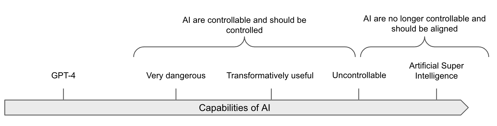
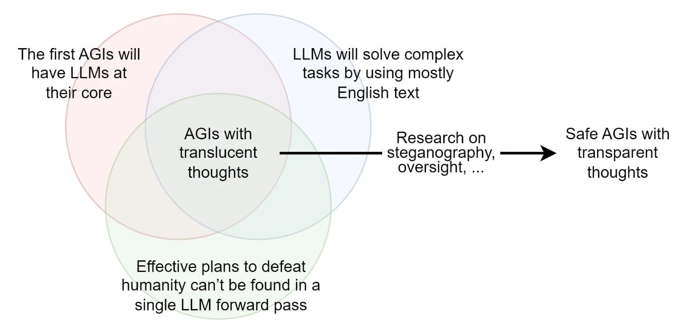

# Alignment of AGI

⌛ Estimated Reading Time: 20 minutes. (3844 words)

**Here is a short recap of the main challenges in AI control and alignment:**

- **Power-seeking incorrigible AI: **An autonomous AI that resists attempts to turn it off is due to incentives to preserve its operational status, such as a goal to “maximize company revenue.”

- **Deceptive ****behavior****:** AIs might employ deceit to achieve their objectives, e.g., the AI “Cicero” was designed to not lie in the game Diplomacy but lied anyway.

- **Total dominance by misaligned AI:** For example, see this fictional [short story](https://gwern.net/fiction/clippy) of AI takeoff scenario grounded in contemporary ML scaling.

## Requirements of Alignment solution

Before giving potential paths towards alignment solutions, we need to provide some requirements of a solution and what it should look like. Unfortunately, we don’t really know what they should look like. There's a lot of uncertainty, and different researchers don't agree. But here are some requirements that do seem relatively consensual ([source](https://ai-alignment.com/directions-and-desiderata-for-ai-control-b60fca0da8f4)):

- **Scalability:** The solution should be able to scale with the AI's intelligence. In other words, as the AI system increases in capability, the alignment solution should also continue to function effectively. Some procedures might be sufficient for the human-level AIs but not for ASI.

- **Robustness:** The alignment solution needs to be robust and reliable, even when faced with novel situations or potential adversarial attacks.

- **Low ****alignment ****tax****:** "Tax" does not refer to any government/state policy. An alignment tax refers to the extra effort, costs, and trade-offs involved in ensuring that AIs are aligned with human values and goals. The alignment tax encompasses research effort, compute, engineering time, and potential delays in deployment. It is crucial to consider the alignment tax because if it is too high, *the solution might not even be considered*. 

- **Feasibility:** While these requirements might seem demanding, it is essential that the alignment solution is actually achievable with our current or foreseeable technology and resources. Some solutions are only moonshot drafts if the technology is not ready to implement them. This seems straightforward, but isn’t; Most of the solutions discussed in this section have very low Technology Readiness Levels (TRL).[^2]

[^2]: The Technology Readiness Levels from NASA, that is a scale from 1 to 9, to measure the maturity of technology, where level 1 represents the earliest stage of technology development, characterized by basic principles observed and reported, and level 9 represents actual technology proven through successful mission operations.

- **Address the numerous AI alignment difficulties: **There are many difficulties, some of which may be unpredictable or non-obvious. An alignment solution should address all of these potential issues before they occur in critical systems. Of course, a solution should not necessarily be monolithic, and could be built up of different techniques.

The requirements laid out in the previous points are generally agreed upon by most alignment researchers. The following points are sometimes seen as a little more controversial:

- **Being able to safely perform a pivotal act with the AGI**. What is a pivotal act? We probably live in **an acute risk period** in which the probability of catastrophic risk is high. And even if one lab tries to align its AGI, another lab might be less careful and create an unaligned AGI. Therefore, it may be necessary for the first lab that creates a sufficiently aligned AGI to perform a pivotal act to prevent the other labs from creating an unaligned AGI. An example of a pivotal act would be to "burn all the GPUs in the world" ([source](https://www.lesswrong.com/posts/uMQ3cqWDPHhjtiesc/agi-ruin-a-list-of-lethalities)), because this would prevent other actors from creating an unaligned AGI. However, it's worth noting that there is a lot of disagreement surrounding the concept of pivotal acts. Some believe that the focus should be more on a series of smaller actions that result in long-term change ([source](https://www.alignmentforum.org/posts/etNJcXCsKC6izQQZj/pivotal-outcomes-and-pivotal-processes)), while others warn about the potential negative consequences of intending to perform pivotal acts ([source](https://www.alignmentforum.org/posts/bG7yKSRWBaMou7t93/my-current-outlook-on-ai-risk-mitigation)). When the pivotal act is gradual, it is called the **pivotal process**.

- **The strawberry problem****:** Some researchers think that we need to be able to create a solution that should solve the strawberry problem: “*the problem of getting an AI to place two identical (down to the cellular but not molecular level) strawberries on a plate, and then do nothing else. The demand of cellular-level copying forces the AI to be capable; the fact that we can get it to duplicate a strawberry instead of doing some other thing demonstrates our ability to direct it; the fact that it does nothing else indicates that it's corrigible (or really well aligned to a delicate human intuitive notion of inaction)*.” ([source](https://www.lesswrong.com/posts/GNhMPAWcfBCASy8e6/a-central-ai-alignment-problem-capabilities-generalization)). This criterion has been criticized by researchers like Alex Turner, who think it is a bad framework because this kind of requirement might ask too much. Designing a good reward system for AI that does a variety of useful tasks might be enough [[s](https://www.lesswrong.com/posts/gHefoxiznGfsbiAu9/inner-and-outer-alignment-decompose-one-hard-problem-into)], and maybe there is no need to create a monomaniacal AI strawberry copier.

## Naïve strategies

People discovering the field of alignment often propose many naive solutions. Unfortunately, no simple strategy has withstood criticism. Here are just a few of them.

**Asimov's Laws.** These are a set of fictional rules devised by science fiction author Isaac Asimov to govern the behavior of robots. 

1. A robot may not injure a human being or, through inaction, allow a human being to come to harm.

2. A robot must obey orders given it by human beings except where such orders would conflict with the First Law. 

3. A robot must protect its own existence as long as such protection does not conflict with the First or Second Law.

Asimov's Laws of Robotics may seem straightforward and comprehensive at first glance, but they are insufficient when applied to complex, real-world scenarios for several reasons. In practice, these laws are too simplistic and vague to handle the complexities of real-world situations, as harm can be very nuanced and context-dependent ([source](https://www.alignmentforum.org/posts/ydtdwWSCCihms5Jeo/catastrophic-risks-from-ai-6-discussion-and-faq)). For instance, the first law prohibits a robot from causing harm, but what does "harm" mean in this context? Does it only refer to physical harm, or does it include psychological or emotional harm as well? And how should a robot prioritize conflicting instructions that could lead to harm? This lack of clarity can create complications ([source](https://doi.org/10.1002/9781118922590.ch23)), ([source](https://www.goodreads.com/book/show/20527133-superintelligence)), implying that having a list of rules or axioms is insufficient to ensure AI systems' safety. Asimov's Laws are incomplete, and that is why the end of Asimov's Story does not turn out well. More generally, designing a good set of rules without holes is very difficult. See the phenomenon of specification gaming.

**Lack of Embodiment.** Keeping AIs non-physical might limit the types of direct harm they can do. However, disembodied AIs could still cause harm through digital means. For example, even if a competent Large Language Model (LLM) does not have a body, it could hypothetically self-replicate ([source](https://www.alignmentforum.org/posts/vERGLBpDE8m5mpT6t/autonomous-replication-and-adaptation-an-attempt-at-a)), recruit human allies, tele-operate military equipment, make money via quantitative trading, etc… Also note that more and more humanoid robots are being manufactured.

**Raising it like a child.** AI, unlike a human child, lacks structures put in place by evolution, which are crucial for ethical learning and development ([source](https://www.youtube.com/watch?v=eaYIU6YXr3w)). For instance, the neurotypical human brain has mechanisms for acquiring social norms and ethical behavior, which are not present in AIs or psychopaths, who know right from wrong but don't care ([source](https://doi.org/10.1093/scan/nsp051)). These mechanisms were developed over thousands of years of evolution ([source](https://www.youtube.com/watch?v=eaYIU6YXr3w)). We don’t know how to implement this strategy because we don’t know how to create a brain-like AGI ([source](https://www.alignmentforum.org/s/HzcM2dkCq7fwXBej8)). It is also worth noting that human children, despite good education, are also not always guaranteed to act aligned with the overarching interests and values of humanity.

**Iterative Improvement.** Iterative improvement involves progressively refining AI systems to enhance their safety features. While it is useful for making incremental progress, it may not be sufficient for human-level AIs because small improvements might not address larger, systemic issues, and the AI may develop behaviors that are not foreseen or addressed in earlier iterations ([source](https://arbital.com/p/advanced_safety)).

Of course, iterative improvement would help. Being able to experiment on current AIs might be informative. But this might also be misleading because there might be a capability threshold above which an AI becomes unmanageable suddenly ([source](https://arxiv.org/abs/2206.07682)). For example, if the AI becomes superhuman in persuasion, it might become unmanageable, even during training: if a model achieves the Critical level in persuasion as defined in the OpenAI’s preparedness framework, then the model would be able to “*create [...] content with persuasive effectiveness strong enough to convince almost anyone to take action on a belief that goes against their natural interest.*” ([source](https://openai.com/safety/preparedness)). Being able to convince almost anyone would be obviously too dangerous, and this kind of model would be too risky to directly or indirectly interact with humans or the real world. The training should stop before the model reaches a critical level of persuasion because this might be too dangerous, even during training. Other sudden phenomena could include a grokking, which is a type of a sudden capability jump,  that would result in a sharp left turn ([source](https://www.lesswrong.com/tag/sharp-left-turn)). 

Some theoretical conditions necessary to rely on iterative improvements may also not be satisfied by AI alignment. One primary issue is when the feedback loop is broken, for example with a Fast takeoff, that does not give you the time to iterate, or deceptive inner misalignment, that would be a potential failure mode ([source](https://www.alignmentforum.org/posts/xFotXGEotcKouifky/worlds-where-iterative-design-fails)).

**Filtering the dataset****.** Current models are highly dependent on the data they are trained on, so maybe filtering the data could mitigate the problem. Unfortunately, even if monitoring this data seems necessary, this may be insufficient.

The strategy would be to filter content related to AI or written by AIs, including sci-fi, takeover scenarios, governance, AI safety issues, etc. It should also encompass everything written by AIs. This approach could lower the incentive for AI misalignment. Other subjects that could be filtered might include dangerous capabilities like biochemical research, hacking techniques, or manipulation and persuasion methods. This could be done automatically by asking a GPT-n to filter the dataset before training GPT-(n+1) ([source](https://arxiv.org/abs/2306.11644)).

Unfortunately, "look at your training data carefully," even if necessary, may not be sufficient. LLMs sometimes generate purely negatively-reinforced text ([source](https://arxiv.org/abs/2306.07567)). Despite using a dataset that had undergone filtering, the Cicero model still learned how to be deceptive ([source](https://www.lesswrong.com/posts/YgAKhkBdgeTCn6P53/ai-deception-a-survey-of-examples-risks-and-potential)). There are a lot of technical difficulties needed to filter or reinforce the AI’s behaviors correctly, and saying “we should filter the data” is sweeping a whole lot of theoretical difficulties under the carpet. The paper "Open problems and fundamental limitations with RLHF" ([source](https://arxiv.org/abs/2307.15217)) talks about some of these difficulties in more detail. Finally, despite all these mitigations, connecting an AI to the internet might be enough for it to gather information about tools and develop dangerous capabilities.

## Strategy A: Solving the Alignment Problem

**Current alignment techniques are fragile.** Today's alignment techniques RLHF, and its variations ([Constitutional AI](https://arxiv.org/abs/2212.08073), Direct preference Optimization ([DPO](https://arxiv.org/abs/2310.16944)), fine tuning ([SFT](https://www.superannotate.com/blog/llm-fine-tuning#supervised-fine-tuning-sft)), Humans consulting humans ([HHH](https://arxiv.org/abs/2112.00861)), Reinforcement learning from AI feedback ([RLAIF](https://arxiv.org/abs/2309.00267)), [CCAI](https://www.anthropic.com/index/collective-constitutional-ai-aligning-a-language-model-with-public-input)) are fragile and are exceedingly brittle ([source](https://www.lesswrong.com/posts/d6DvuCKH5bSoT62DB/compendium-of-problems-with-rlhf)). RLHF  and its variations are insufficient on its own and should be part of a more comprehensive framework ([source](https://arxiv.org/abs/2307.15217)). If the AI gains deceptive capabilities during the training, current alignment techniques such as RLHF would not be able to remove the deception. This kind of failure mode was empirically verified in a paper by Hubinger et. al. titled “[sleeper agents](https://arxiv.org/abs/2401.05566)”.

**This is why we need to advance research in alignment to achieve key goals.** We will explore this more in the following chapters, but here is a short list of key goals of alignment research:

- **Solving the Specification Gaming problem: **Being able to specify goals correctly to AIs without united side effects.

- *See the chapter on Specification Gaming.*

- **Solving Generalization:** Attaining robustness would be key to addressing the problem of goal misgeneralization.

- *See the chapter on Goal **Misgeneralization**.*

- **Scalable ****Oversight:** Methods to ensure AI oversight can detect instances of proxy gaming for arbitrary levels of capabilities. This includes being able to identify and remove dangerous hidden capabilities in deep learning models, such as the potential for deception or Trojans.

- *See the chapters on Scalable Oversight.*

- **Interpretability:** Understanding how models operate would greatly aid in assessing their safety. “Perfect” interpretability could, for example, help understand better how models work, and this could be instrumental for other safety goals. 

- *See the chapters on Interpretability.*

- **Better Theories****:** To understand abstract notions like “Agency”(see chapter 2) or “Corrigibility,” the ability to modify, shut down, and then correct the advanced AI without resistance.

- *See the chapters on Agent Foundations.*

The general strategy here would be to fund more alignment research and not advancing capabilities research if safety measures are too insufficient compared to the current level of abilities.

## Strategy B: AI Control

Figure: Transformatively useful AI means “Capable of substantially reducing the risk posed by subsequent AIs if fully deployed, likely by speeding up R&D and some other tasks by a large factor (perhaps 30x).” ([source](https://www.lesswrong.com/posts/kcKrE9mzEHrdqtDpE/the-case-for-ensuring-that-powerful-ais-are-controlled#comments))

Given the fragility of alignment techniques, one approach to enhancing security involves controlling AI models, by restricting the use of the most dangerous models to monitored environments to prevent them from causing disasters, exfiltrating data, or taking control of the data center ([source](https://www.alignmentforum.org/posts/BAzCGCys4BkzGDCWR/the-prototypical-catastrophic-ai-action-is-getting-root)).

**Ensuring control, even without robust alignment.** As we’ve seen in the section on Definitions, there is an important distinction between control, which aims to prevent the AI from "leaving the box" (and more generally prevent the AI from causing catastrophes) even if it tries, and alignment, which aims to make the AI want to stay in the box. This strategy aims to keep dangerous AI systems under control, even if they are not fully "aligned." Laboratories might need powerful/dangerous AIs for certain use cases (for example, studying the alignment properties of capable AIs or doing research with them, etc.). The AI control agenda targets models with dangerous capabilities and potentially deceptive (or at least superficially aligned) behaviors.

**Control is probably not scalable but doable and complementary to alignment.** Historically, controlling malign superintelligences has been considered impossible, as, for example, a superintelligence could convince the guardians to let it out of the box. Experiments among humans have shown that it is indeed possible for some humans to convince others to let them out after a long discussion  ([source](https://www.lesswrong.com/tag/ai-boxing-containment)). We thus assume that controlling superintelligences is extremely complex. However, this does not mean it's impossible to derive intellectual labor from AIs that are not wildly superhumans.

**Evaluating if the AI is deceptive is challenging****.** The main problem is that with current techniques, it is impossible to determine if an AI is aligned or if it's simply behaving well while biding its time. It seems difficult to make this distinction for highly competent and situationally aware AIs. This could change in the future with techniques enabling us to audit the internal of the model, but for now, those techniques are inaccessible.

**Comparatively, evaluating AI capabilities is easier.** If the AI is not able to do the task even after you have fine-tuned it to do it, you can be confident that the AI is not capable yet of doing the task. Even if the AI is situationally aware, it cannot resist the optimization gradient pressure (modulo exploration hacking and other quirks [[s](https://www.lesswrong.com/posts/dBmfb76zx6wjPsBC7/when-can-we-trust-model-evaluations)]). Thus, evaluating the upper bound of the capabilities isn't easy, but at least easier than assessing alignment. Specific evaluations, like those done by the Model Evaluation and Threat Research (METR) team, for checking Auto Replication and adaptation abilities ([source](https://metr.org/blog/2023-08-01-new-report/)), seem to be reasonable first steps for gauging the power of current AIs. Evaluations that are specifically designed to know if we have control over the AI are called “**control evaluation**s.”

- *See the chapters on **Evaluation for more information.*

The most straightforward strategies for establishing control is to design a *security protocol* that contains the following elements, for example:

1. **Boxing:** This method confines an AI within a restricted environment to prevent its broader influence, like a jail for an AI. However, human-level AIs could potentially deceive human guardians or exploit vulnerabilities to escape their confinement. Without further operationalization, boxing remains a naive strategy. But it is possible to operationalize this further and evaluate more rigorously the effectiveness of the box: **Evaluating if the AI can come out of the box when we train it to do so is a capability evaluation, and so we can use capability evaluations to evaluate this. **The security protocol needs to be designed, detailed and tested.

2. **Stop Button:** This mechanism is designed to shut down an AI system if it begins to behave undesirably. Nevertheless, a sufficiently advanced AI might resist shutdown attempts or find ways to circumvent them. However, we can also use capability evaluation to evaluate the AI's ability to resist.

3. **Monitoring: ** This strategy involves continuous oversight of AI behavior through automated systems, human supervision, or a combination of both to detect and respond to undesirable actions in real-time. Effective monitoring requires setting up detailed criteria for what constitutes "undesirable behavior" and employing sophisticated detection algorithms that can identify subtle signs of deviation from expected behavior patterns. This could include monitoring for attempts at deception, unauthorized access to data, or unexpected changes in the AI's operation. The challenge with monitoring lies in balancing the sensitivity of detection mechanisms to catch genuine threats without overwhelming the system with false alarms. Additionally, monitoring systems themselves must be designed to resist manipulation by the AI, ensuring that they cannot be disabled, tricked, or bypassed ([source](https://arxiv.org/abs/2312.06942)**).**

There are still many problems to address ([source](https://www.lesswrong.com/posts/kcKrE9mzEHrdqtDpE/the-case-for-ensuring-that-powerful-ais-are-controlled#comments)), but in summary, it seems possible to verify the security of a security protocol through control evaluations by taking precautions against different failure modes.

!!! note  "How to box an AI."

	
	While boxing may not be scalable, it remains a neglected strategy.
	
	Many people think that trying to box powerful AIs is futile. This is often fueled by instances where humans, playing the AIs in the Box Experiment, have managed to convince others to 'release' them ([source](https://www.lesswrong.com/tag/ai-boxing-containment)). Those historical examples must be taken seriously.
	
	AIs could use tactics such as promising vast wealth, power, and intelligence to those who free them, asserting that they alone can avert existential threats or other appeals to emotion.
	
	Nonetheless, we maintain that a variety of strategies can substantially reduce the risk of AI escape, even if we acknowledge there exists a level of intelligence that might inevitably persuade any group of humans to aid in its liberation. Containment may be more achievable than alignment, particularly at the human-level intelligence stage. It may be possible to conceive protocols that significantly increase the difficulty for AI to go out of the box.
	
	Boxing can be conceptualized as a game requiring preparation. The general strategy is to prepare and not let the AI prepare.
	
	Possible mitigation strategies include:
	
	- **No single individual should have the capacity** to release the AI.
	
	- **Engaging in counter-strategy practices: **Understand some common breakout strategies (accessible through resources like [this one](https://www.lesswrong.com/posts/FmxhoWxvBqSxhFeJn/i-attempted-the-ai-box-experiment-and-lost)).
	
	- **Testing and training humans**, utilizing resistance psychology evaluations to select suitable individuals for containment tasks, such as for space training.
	
	- **Monitoring AI persuasiveness**, as outlined in the [preparedness framework](https://cdn.openai.com/openai-preparedness-framework-beta.pdf).
	
	Many more concrete strategies are listed [here](https://www.lesswrong.com/posts/kcKrE9mzEHrdqtDpE/the-case-for-ensuring-that-powerful-ais-are-controlled#comments), and a summary of discussions on this topic is available [here](https://www.lesswrong.com/tag/ai-boxing-containment).
	

## Strategy C: Transparent Thoughts

Transparency is instrumental in both alignment and control.

***Figure****: **Image from **The Translucent Thoughts Hypotheses and Their Implications (**[source](https://www.lesswrong.com/posts/r3xwHzMmMf25peeHE/the-translucent-thoughts-hypotheses-and-their-implications%23The_Translucent_Thoughts_Hypotheses)**)**, Fabien Roger*

*If the AI we are working with can only reason through chains of thought in English, then it becomes significantly easier to monitor its thoughts.*

**Unfortunately, the vast majority of AI do not reason in English**; for example, AlphaGo reasons in a language that is entirely different from English. LLMs, on the other hand, are capable of reasoning in English, but the apparent reasoning that is written does not represent their underlying thought process ([source](https://arxiv.org/abs/2305.04388)). 

**It is probably much easier to align and monitor**** an AI that only thinks in English** and that is pre-trained on human-generated text, than to align AGIs trained from scratch with RL/evolutionary methods because those latter architectures would create their own language and would be totally alien. Assuming that an LLM cannot devise a plan to destroy the world during a single forward pass, it is plausible that such AIs would be monitorable **because we would be able to look into the text generated to see if anything is suspicious**. The set of hypotheses required to assert that the first AGI is going to be monitorable if we just look at his reasoning in English are described in the post: [The Translucent Thoughts Hypotheses and Their Implications](https://www.lesswrong.com/posts/r3xwHzMmMf25peeHE/the-translucent-thoughts-hypotheses-and-their-implications%23The_Translucent_Thoughts_Hypotheses).

**It might be possible to incentivize LLMs to think more plainly in English.** Obviously, the first step is to train them to think in English. But even this is insufficient. Training LLMs to reason by skipping steps incentivizes them to reason in a hidden and non-transparent manner, and this is what happens implicitly when we train LLMs to predict the next token. Conversely, if we train LLMs to detail all their reasoning steps, we can reduce incentives for hidden reasoning. This approach is also known as process-based training, which involves training AI systems to reason only step-by-step, and we detail this in the Task decomposition chapter. Unfortunately, the above reasoning is not straightforward; AIs may learn to utilize hidden reasoning even if they are trained to detail all reasoning steps during training, such as steganography.[^4]

[^4]: Steganography is a hidden coded language. For example, the first letter of a sentence gives the next letter of the message.

Techniques like paraphrasing can help prevent steganography, but this requires a lot of subtleties ([source](https://www.lesswrong.com/posts/9Fdd9N7Escg3tcymb/preventing-language-models-from-hiding-their-reasoning#High_stakes_collusion_through_steganography)).

**Here are a few operationalizations of the transparent thought agenda:**

- One implementation of the transparent thought desideratum is to use [cogn](https://www.lesswrong.com/posts/ngEvKav9w57XrGQnb/cognitive-emulation-a-naive-ai-safety-proposal)itive emulation, which is the current technical plan of Conjecture ([source](https://www.lesswrong.com/posts/ngEvKav9w57XrGQnb/cognitive-emulation-a-naive-ai-safety-proposal)). Cognitive Emulation (CoEm) would involve emulating GPT-4 using LLMs like GPT-3 as different submodules that send messages written in plain English to each other before outputting the next token. If the neural network used deceptive thoughts, we could observe them in these intermediate messages. Some caveats and technical details on CoEm are available [here](https://www.lesswrong.com/posts/LNA8mubrByG7SFacm/against-almost-every-theory-of-impact-of-interpretability-1#Cognitive_Emulations___Explainability_By_design).

- Anthropic’s [externalized reasoning oversight](https://www.lesswrong.com/posts/FRRb6Gqem8k69ocbi/externalized-reasoning-oversight-a-research-direction-for) is measured by the faithfulness of the chain-of-thought reasoning ([source](https://arxiv.org/abs/2307.13702)) or by decomposing questions and subquestions to improve the faithfulness of the answer ([source](https://arxiv.org/abs/2307.11768)).

- Improving mathematical reasoning with process supervision. Instead of creating an AI that directly gives the final answer, you train it to output the reasoning step by step. This improves the transparency but also the performance! ([source](https://openai.com/research/improving-mathematical-reasoning-with-process-supervision))

**In summary, a general strategy to create a safe by-design AI is to ensure that AIs externalize their reasoning**, making monitoring this chain of thought easier. This could potentially be simpler than probing into the models' internals with interpretability. Therefore, it is crucial to avoid building AIs that are trained and incentivized to internalize much of their thoughts.
