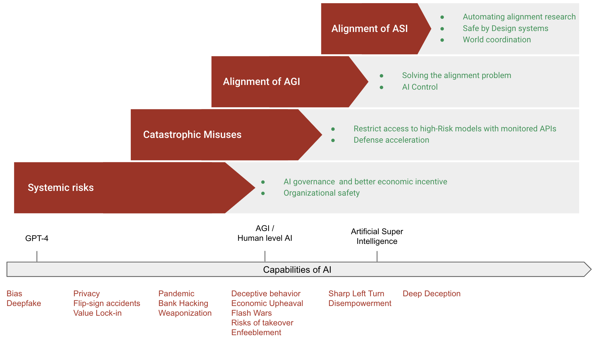

# Introduction

⌛ Estimated Reading Time: 1 minutes. (117 words)

Although the field of AI safety is still in its infancy, several measures have already been identified that can significantly improve the safety of AI systems. While it remains to be seen if these measures are sufficient to fully address the risks posed by AI, they represent essential considerations. The diagram below provides a high-level overview of the main approaches to ensuring the safe development of AI.

***Figure:**** Tentative diagram summarizing the main high-level approaches to make AI development safe.*

This document is far from exhaustive and only scratches the surface of the complex landscape of AI safety. Readers are encouraged to explore this [recent list of agendas](https://www.lesswrong.com/posts/zaaGsFBeDTpCsYHef/shallow-review-of-live-agendas-in-alignment-and-safety#Understand_learning) for a more comprehensive review.
