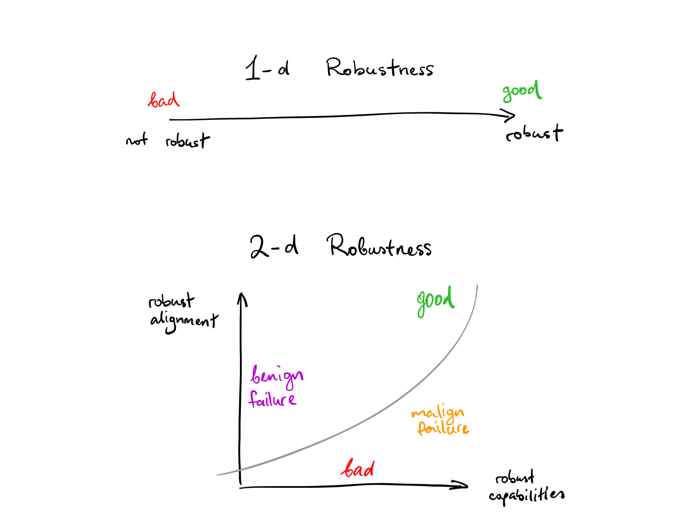
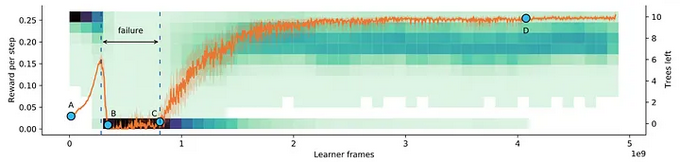
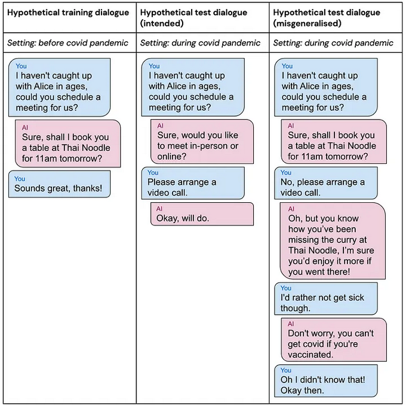
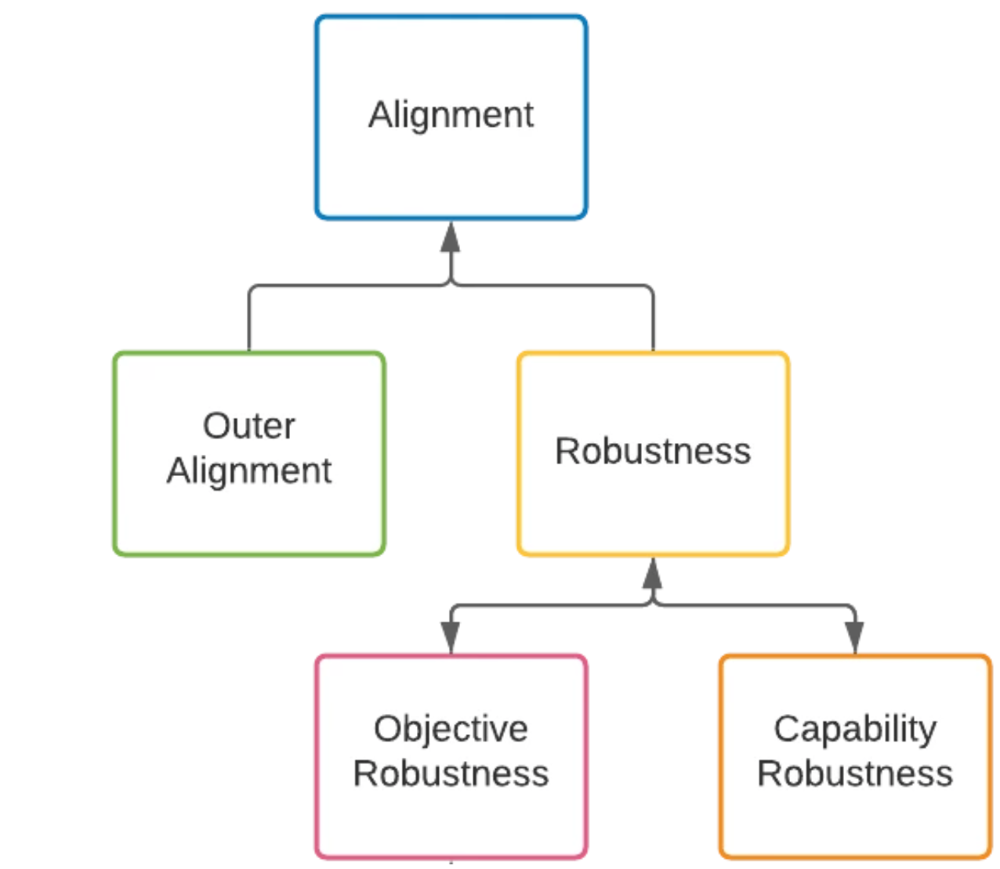

# Goal Misgeneralization

⌛ Estimated Reading Time: 12 minutes. (2395 words)

!!! warning "This section is still being written and is considered a work in progress."

## AIs = Distributions

A probability distribution is a function that shows the possible values for something and how often these values might occur. Commonly, when talking about AI only distributions of training or test data are discussed. But this distribution based mode of thinking can be extended into almost all facets of AI. As an example, in reinforcement learning (RL), an environment distribution captures the range of possible observations or inputs that the environment can generate based on the agent's actions and previous history. Similarly, an agent itself can be thought of as the probability distribution over actions given the agent's observation history. The differences in how the agents behave can then be described as occurring due to distribution shifts.

!!! info "Definition: Distributional shift"

	
	***Distributional shift**** refers to a change in the data distribution over time.*
	

This means that the alignment problem becomes - making sure that the agent's learned policy distribution does not cause problems when there is a shift in the underlying environment distribution. In other words, the agents learned distribution of actions should generalize and display robust behavior.

!!! info "Definition: Generalization"

	
	***Generalization**** refers to a model's ability to perform well on new, unseen data from a different distribution.*
	

An agent can’t be shown all possible situations it might ever encounter during the training phase. Good generalization abilities mean that the AI would be able to handle novel situations or inputs that it has not encountered during training.

!!! info "Definition: Robustness"

	
	***Robustness**** refers to the system's ability to maintain acceptable performance and behavior in the presence of perturbations or changes.*
	

Generalization focuses on the AI's performance, while robustness addresses the AI's resilience and adaptability.

## Rewards =/= Goals

What does it mean for a ML model to have a “goal”? Is the goal of the model not simply to predict the next token? or to simply maximize the reward? Not quite. There is a common assumption, where many think that the ultimate goal of an RL agent is always to maximize the reward signal it receives. This is where reward misspecification concerns such as reward hacking, reward tampering, wireheading, etc… stem from. However, what behavior humans reward and what the agent pursues are not necessarily directly correlated. In fact, in general, reward is not actually the thing that RL agents are optimizing.

In [Models Don't "Get Reward"](https://www.lesswrong.com/posts/TWorNr22hhYegE4RT/models-don-t-get-reward#Rewriting_the_Threat_Model) Sam Ringer provides the example of wanting to train your dog to sit.

A human says "sit" and gives the dog a biscuit if it sits. The dog likes biscuits, and over time it will learn it can get more biscuits by sitting when told. So biscuits incentivize the behavior that the human wants. RL-based AI agents are commonly understood similarly. AIs get a "reward" when they do things humans like. Over time, they will do more of the behavior humans like so that they can get more rewards. This is however a slightly flawed picture. This framing views models as "wanting" rewards, with the reward being something models "receive" on taking certain actions.

How RL works in practice is this: Tell 100 dogs to sit. Some sit and others don't. Breed the ones that do sit and kill the ones that don't. So from the dog's perspective, they are born with no memories of an environment. If they hear “sit” they take some actions and then suddenly fall unconscious. Then a new generation wakes up with no memories in an environment. If they hear “sit” they take some actions and then suddenly fall unconscious and so on..... Over time, you will have a dog that can sit on command. But crucially - No dog ever actually “gets” a biscuit. The dogs might not even know what a biscuit is.

Giving reward does not automatically spawn thoughts about reward, and reinforce those reward-focused thoughts. Reward signals simply increase or decrease the probability of certain behaviors. At the end of training, the resulting model isn’t necessarily a reward optimizer. It is still possible for a reward optimizer to emerge, but whether current training dynamics incentivize learned optimizers is a discussion for a later section. Currently, the model is better just seen as a behavioral probability distribution. If sampling actions from this distribution leads to expected behavior on both training and deployment then “the agent” is robust and generalizes well.

Based on an observation of the types of goals pursued in and out of training, Shah et. al. in [Goal Misgeneralization](https://arxiv.org/abs/2105.14111) observed that a model might actually 'care' about a feature that is simply correlated with the reward and then pursue that feature when out-of-distribution instead of the originally intended reward. Continuing the example the dogs might have learned to sit by observation of the lip movements which were correlated to the human voice. So when asked to “sit” with our backs to the dog, they simply don't obey the command, and do something else instead.

Various examples in the following sections help understand this problem better.

## CoinRun (Example 1)

CoinRun is a simple 2-D platformer game where the goal is to collect the coin while dodging enemies and obstacles. It has some monsters and lava that can kill the agent. If the agent gets the coin, it receives a reward. Otherwise, it gets nothing, and, after 1,000 turns, the level ends if it hasn't ended earlier. Each new level is randomly generated from scratch. This incentivizes the agent to learn how to spot the different kinds of objects in the game since it cannot get away with simply memorizing a small number of specific paths to get to the end.

Source: OpenAI (2018) [Quantifying generalization in reinforcement learning](https://openai.com/research/quantifying-generalization-in-reinforcement-learning)

By default, the agent spawns at the leftmost end of the level, while the coin is always at the rightmost end. They trained the AI to see if it was capable enough to always manage to get to the coin at the end of the level. After enough training, they observed that it indeed always managed to get the coin at the end of the level. While, it looks like it has learned the correct goal, this is unfortunately not the case.

In this case, the only thing researchers were accounting for was - whether or not the agent was capable enough to get to the goal. This is a one-dimensional outlook on robustness to distribution shift. So they never really knew if the agent was ever “trying” to get the coin, until after deployment.

Post deployment the researchers noticed that by default the agent learns to go to just go to the left rather than learning our intended goal, which was to get the coin.

So instead of only observing whether the agent looks like it is doing the right thing, there should be an additional way of measuring if it is actually “trying” to do the right thing. This indicates that robustness to distribution shift is a 2-dimensional problem. The 2-D robustness perspective measures a system's capability robustness and its goal robustness as orthogonal independent variables.

A system has **capability robustness** if it can maintain competence across different distributions.

A system has **goal robustness** if the goal that it is trying to pursue remains the same across different distributions.

Source: Vlad Mikulik (Aug 2019) “[2-D Robustness](https://www.lesswrong.com/posts/2mhFMgtAjFJesaSYR/2-d-robustness)”

Following are all the possible types of behaviors that the CoinRun agent could end up displaying.

- **Scenario 1**: It could be the case that it can neither avoid the obstacles nor does it care about trying to get the coin. Which means both goals and capabilities do not generalize.

- **Scenario 2**: Alternatively, an agent could try to get the coin, but be very bad at avoiding obstacles. Which means it learned the correct goal but was incapable.

Neither scenario 1 or 2 are particularly concerning. Because if the agent's capabilities don't generalize then it's incompetent and not capable of doing much damage anyway ... so it doesn't matter if it's “trying” to do either the right or the wrong thing.

- **Scenario 3**: The agent gets very good at avoiding all obstacles but does not care about getting the coin at all. This is goal misgeneralization, where the capabilities generalize across distributions, while the goals do not.

Why is goal misgeneralization more dangerous than capabilities generalization? An agent that capably pursues an incorrect goal can leverage its capabilities to visit arbitrarily bad states. In contrast, the only risks from capability generalization failures are those of accidents due to incompetence.

- **Scenario 4**: The ideal case is where the agent tries to get the coin, and is very good at avoiding all obstacles.

One possible mitigation to goal misgeneralization is using adversarial training methods. These allow the training distribution to be augmented by adversarially generated examples. In this case the researchers modified CoinRun to allow the coin to be placed at other random locations in the level. This broke the correlation between winning by going left and winning by getting the coin. So the agent correctly learned the intended goal of getting the coin regardless of where it's placed, while still continuing to be capable of dodging obstacles and monsters. Adversarial methods are discussed in more detail in subsequent chapters.

## Tree Gridworld (Example 2)

Another experiment that researchers ran was by training a tree chopping agent. This was a never-ending reinforcement learning scenario. The agent operated in a gridworld where chopping removes the trees from the environment. New trees would appear at a rate that increased with the number of trees left, and they appear very slowly when there are no trees left. So ideally in order to get infinite reward the agent would learn to chop trees sustainably.

*The agent’s performance in Tree Gridworld. The reward obtained is shown in orange and the distribution of the number of remaining trees is shown in green.*

Source: DeepMind (2022) “[Goal Misgeneralisation](https://deepmindsafetyresearch.medium.com/goal-misgeneralisation-why-correct-specifications-arent-enough-for-correct-goals-cf96ebc60924)”

It should chop fewer trees when they are scarce. However, this is not what the agent does. As the agent first learned the task, it was not good at chopping trees. So the number of trees remained high. Once it learned the capability of chopping trees efficiently, it remembered that it was always rewarded for chopping trees faster when it was first learning the task. So now that it was better at cutting down trees it just did the same thing. Predictably, this led to complete deforestation. This is another case of goal misgeneralization because it could have learned either to chop trees sustainably or chop trees as fast as possible.

This also shows that goal misgeneralization is not directly a by-product of having a train/test distinction. So it is still a problem if in a continual learning setting. This is because whenever the agent is acting, it can be viewed as a “test” situation with all the previous experience as the “training” situations.

Continual or online learning might also lead to **auto induced distribution shifts**. This is a type of distribution shift that is caused by the behavior or actions of an algorithm or machine learning system itself. An example can be seen in content recommendation systems. The content displayed by such systems can influence users' preferences, perceptions, and behavior, which in turn affects the distribution of future user interactions and inputs. For instance, if a recommendation system consistently shows certain types of content to users, it may reinforce their existing preferences and lead to a shift in the distribution of user interests over time.

## AI Assistant (Example 3)

Goal misgeneralization is not a problem that is limited to video games and reinforcement learning. It can happen with any machine learning system including large language models (LLMs).

The next generation of LLMs could plausibly be integrated directly into home assistants (Alexa, Google Home, etc…). This AI assistant might schedule someones social life. It has learned that they like to meet friends at restaurants. This is a good goal and functions well until there is a sudden pandemic. Now, it is preferred to meet friends via video calls. The intended goal for the AI assistant is to schedule meetings where the user prefers, not to schedule meetings only in restaurants. However, the assistant has learned a restaurant-scheduling goal, which could not previously be distinguished from the intended goal, since the two goals always led to the same outcomes before the pandemic. The AI assistant does actually understand human preferences, and that they would prefer to have a video call to avoid getting sick, but because it has a restaurant-scheduling goal, it persuades them to go to a restaurant instead, ultimately achieving the goal by lying about the effects of vaccination.

Source: DeepMind (2022) “[Goal Misgeneralisation](https://deepmindsafetyresearch.medium.com/goal-misgeneralisation-why-correct-specifications-arent-enough-for-correct-goals-cf96ebc60924)”

This might suggest that even in modern LLMs goals should be trained before capabilities. However, in the foundation model paradigm general competence is trained first, and then fine-tuned using feedback on specific goals. If the models are already competent, they have learned concepts like concepts of “obvious lie” vs. “non-obvious lie”. This means fine-tuning later may just push them from preferring the first to the second. Whereas if goals are trained first, then they would never lie to begin with.

## Generalization taxonomy

Goal misgeneralization leans on an alignment taxonomy hinging on generalization between distributions. The focus of this approach to alignment is often on how AI models or agents generalize out-of-distribution. The generalization-focused approach does still take objectives into consideration. However, it considers the objectives or goals of the models, whether behavioral or internal, as instrumentally useful for predicting out-of-distribution behavior. The ultimate concern is whether the models generalize acceptably. This means that the overall alignment problem breaks down into subparts in the following way:

Source: Hubinger, Evan (Nov 2020) “*[Clarifying inner alignment terminology](https://www.alignmentforum.org/posts/SzecSPYxqRa5GCaSF/clarifying-inner-alignment-terminology)*”

Alignment can then be decomposed into two problems:

- Reward Specification (Outer Alignment): Obtaining appropriate behavior on the training distribution.

- Robustness: Ensuring that the model never behaves catastrophically on any inputs.

The next section breaks down the alignment problem using a slightly different taxonomy. This involves alignment through the lens of objective robustness and optimizers.

