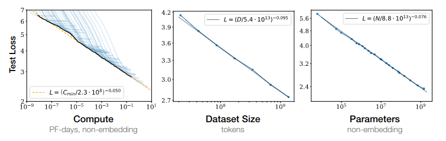

# 1.4 Leveraging Computation
!!! note "This section is approximately a 18 minute read." 

Leveraging computation refers to the strategic utilization of computational resources to maximize the performance of AI models. We learned in the previous section that foundation models have ushered in an era where scale—model size, data volume, and computational resources—has become a cornerstone of AI capabilities. This section aims to delve further into model scaling and its pivotal role in AI capabilities.

## 1.4.1 The Bitter Lesson

???+ note "Bitter Lesson - Video Introduction"

    
    
    <iframe style=" width: 100%; aspect-ratio: 16 / 9;" frameborder="0"  allowfullscreen src="https://www.youtube.com/embed/wEgq6sT1uq8">
    
    </iframe>
    
    !!! warning "This video is optional and not necessary to understand the text."
    
    

**What is the bitter lesson?** Traditionally, AI research has predominantly designed systems under the assumption that a fixed amount of computing power will be available to the designed agent. However, over time, computing power so far has been expanding in line with Moore's law (the number of transistors in an integrated circuit doubles every 1.5 years) ([source](https://en.wikipedia.org/wiki/Moore's_law)). So researchers could either leverage their human knowledge of the domain or exploit increases in general-purpose computational methods. Theoretically, the two were mutually compatible, but as time went on it was discovered that “*the biggest lesson that can be read from 70 years of AI research is that general methods that leverage computation are ultimately the most effective, and by a large margin. … [The bitter lesson teaches us] the great power of general purpose methods, of methods that continue to scale with increased computation even as the available computation becomes very great.*” - Sutton, Rich (March 2019) “[The Bitter Lesson](http://www.incompleteideas.net/IncIdeas/BitterLesson.html)”

**Why is it bitter?** The 'bitter' part of the lesson refers to a hard-learned truth: human ingenuity is not as important as we thought it was. The lesson outlines how general methods leveraging computation are ultimately more effective in achieving AI performance, often by a large margin. Despite the vast amount of human ingenuity put into crafting domain-specific knowledge and features for AI systems, computation often outperforms these human-crafted systems. It's essential to note that, while the Bitter Lesson suggests that leveraging computation is key to advancing AI, it does not completely negate the value of human knowledge. Rather, it underscores the need to find ways to effectively combine human knowledge with computational power to achieve better performance in AI systems.

**Historical evidence**. The Bitter Lesson has been evidenced by the success of AI in various domains like games, vision, and language modeling. For instance, Deep Blue's victory over chess world champion Garry Kasparov was achieved not through a detailed understanding of human chess strategies, but through leveraging a massive deep search of possible moves. Similarly, AlphaGo, which defeated Go world champion Lee Sedol, used deep learning and Monte Carlo tree search to find its moves, rather than relying on human-crafted Go strategies. Following this, AlphaZero, using self-play without any human-generated Go data, managed to beat AlphaGo. In each of these cases, the AI systems leveraged computation over human knowledge, demonstrating the Bitter Lesson in action. In 1970, the DARPA SUR (Speech Understanding Research) was held. One faction endeavored to leverage expert knowledge of words, phonemes, the human vocal tract, etc. In contrast, the other side employed newer, more statistical methods that necessitated considerably more computation, based on hidden Markov models (HMMs). This example shows yet again, that the statistical methods surpassed the human-knowledge-based methods. Since then, deep learning recurrent neural network-based or transformer-based methods have virtually dominated the field of sequence-based tasks. ([source](http://www.incompleteideas.net/IncIdeas/BitterLesson.html))

This subsection talked about why we started aggressively scaling out models. Due to repeated reminders of the bitter lesson, the field of AI has increasingly learned to favor general-purpose methods of search and learning. The next sections show empirical evidence for this claim delving into trends of scale in compute, dataset size, and parameter count.

## 1.4.2 Scaling Variables

This section explains the primary variables involved in scaling - compute, data, and parameters.

**Compute**. Compute refers to the total processing power and resources utilized for machine learning tasks measured in floating-point operations per second (FLOP/s). FLOP/s refers to a measure of computer performance and is used to quantify the number of arithmetic operations (like addition, subtraction, multiplication, and division) that a processor can perform per second. It dictates the speed and capacity of training runs. As the amount of training data increases, the model requires more information to analyze in each training run, hence increasing the total amount of processing power required. This aspect ties closely with the duration of the training process. For instance, extended training runs generally result in lower loss, and the total computational power needed partially depends on this training duration.

**Dataset size**. Dataset size refers to the amount of data used for training the machine learning model. The larger the dataset, the more information the model can read. Simultaneously, to read and learn from more data, the training runs also need to be generally longer, which in turn increases the total computational power needed before the model can be deemed "trained." The relation between model size and dataset size is typically one-to-one, meaning that as we scale up the model, we also need to scale up the dataset. The quality of the data is also crucial, and not just the quantity.

**Parameter Count**. Parameter count represents the number of tunable variables or weights in a machine learning model. The size of the model, meaning the number of parameters, affects the compute required: the more parameters a model has, the more compute-heavy the process of calculating loss and updating weights becomes. A larger parameter count allows the model to learn more complex representations but also increases the risk of overfitting, where the model becomes too tailored to the training data and performs poorly on unseen data.

The following example offers a tangible illustration of capabilities increasing with an increasing parameter count in image generation models. In the following images, the same model architecture Parti is used to generate an image using an identical prompt, with the sole difference between the models being the parameter size.

***Figure****: Images generated with the prompt, “a portrait photo of a kangaroo wearing an orange hoodie and blue sunglasses standing on the grass in front of the Sydney Opera House holding a sign on the chest that says Welcome Friends!”. Source: GoogleAI (2022) , "**[Parti (Pathways Autoregressive Text-to-Image model)](https://parti.research.google/)**"*

Increased numbers of parameters not only enhance image quality but also aid the network in generalizing in various ways. More parameters enable the model to generate accurate representations of complex elements, such as hands and text, which are notoriously challenging. There are noticeable leaps in quality, and somewhere between 3 billion and 20 billion parameters, the model acquires the ability to spell words correctly. Parti is the first model with the ability to spell correctly. Before Parti, it was uncertain if such an ability could be obtained merely through scaling, but it is now evident that spelling correctly is another capability gained simply by leveraging scale. ([source](https://www.lesswrong.com/posts/uKp6tBFStnsvrot5t/what-dall-e-2-can-and-cannot-do))

Below is a chart illustrating the impact of each of these three factors on model loss.

***Figure****: Kaplan, Jared et. al. (Jan 2020) “**[Scaling Laws for Neural Language Models](https://arxiv.org/abs/2001.08361)**”*

The current trends in various important variables to AI scaling are as below. Trends and bottlenecks for each of these are discussed in more detail in the appendix.

- **Compute** : The compute used to train AI models grew 4-5x yearly from 2010 to May 2024. Generally compute used to train has been growing at 4.1x per year since 2010 with a 90% confidence interval: 3.7x to 4.6x. ([source](https://epochai.org/trends))

- **Hardware** : The computational performance (FLOP/s) is growing by 1.35x per year. With a 90% confidence interval: 1.31x to 1.40x. ([source](https://epochai.org/trends))

- **Data** : Training dataset sizes for language models have grown by 3x per year since 2010. Given these trends, the median projected year in which most of the effective stock of publicly available human-generated text will be used in a training run is 2028, with a 90% confidence interval that we will use up all the text data between 2026 to 2033. ([source](https://epochai.org/trends))

- **Algorithms** : Due to algorithmic efficiency the physical compute required to achieve a given performance in language models is declining at a rate of 3 times per year. With a 95% confidence interval this is a rate of decline between 2 times to 6 times. It is also worth noting that the improvements to compute efficiency explain roughly 35% of performance improvements in language modeling since 2014, vs 65% explained by increases in model scale. ([source](https://epochai.org/trends))

- **Costs** : The cost in USD of training frontier ML models has grown by 2.4x per year since 2016, with a 90% confidence interval this is between 2x to 3.1x. This suggests that the largest frontier models will cost over a billion dollars by 2027. Today, the total amortized cost of developing Gemini Ultra, including hardware, electricity, and staff compensation, is estimated at $130 million USD, with a 90% confidence interval it is between $70 million to $290 million. ([source](https://epochai.org/trends))

## 1.4.3 Scaling Laws

???+ note "Scaling Laws - Video Introduction"

    
    
    <iframe style=" width: 100%; aspect-ratio: 16 / 9;" frameborder="0" allowfullscreen src="https://www.youtube.com/embed/ncCuJWJm8M8"></iframe>
    
    !!! warning "This video is optional and not necessary to understand the text."
    
    

**Why do we care about scaling laws?** Scaling laws are mathematical relationships that describe how the performance of a machine learning model changes as we vary different aspects of the model and its training process. Training large foundation models like GPT is expensive. When potentially millions of dollars are invested in training AI models, developers need to ensure that funds are efficiently allocated. Developers need to decide on an appropriate resource allocation between - model size, training time, and dataset size. Scaling laws can guide decisions between trade-offs, such as: Should a developer invest in a license to train on Stack Overflow's data, or should they invest in more GPUs? Would it be efficient if they continued to cover the extra costs incurred by longer model training? If access to compute increases tenfold, how many parameters should be added to the model for optimal use of GPUs? For sizable language models like GPT-3, these trade-offs might resemble choosing between training a 20-billion parameter model on 40% of an internet archive or a 200-billion parameter model on just 4% of the same archive. ([source](https://www.lesswrong.com/posts/midXmMb2Xg37F2Kgn/new-scaling-laws-for-large-language-models)) In short, scaling laws are important because they help us optimally allocate resources, and they allow us to make predictions about how changes in compute, model size, and data size will affect the performance of future models.

**What are the scaling equations?** The mathematical representation of scaling laws often takes the form of power-law relationships. For instance, one of the key findings of OpenAI's research was that model performance (measured as loss) scales as a power law with respect to model size, dataset size, and the amount of compute. The exact equations can vary depending on the specific scaling law, but a general form could be:

$$\text{Performance} = k \cdot (\text{Compute})^a \cdot (\text{Model size})^b \cdot (\text{Data size})^c$$

Where $k$ is a constant, and $a$, $b$, and $c$ are the exponents that describe how performance scales with compute, model size, and data size, respectively.

=== "**2020 OpenAI’s scaling laws**"

    
    
    OpenAI developed the first generation of formal neural scaling laws in their 2020 paper “[Scaling Laws for Neural Language Models](https://arxiv.org/abs/2001.08361)”, moving away from reliance on experience and intuition. To determine the relationships between different scaling variables, some elements were held fixed while others were varied. As an example, data can be kept constant, while parameter count and training time are varied, or parameter count is kept constant and data amounts are varied, etc… This allows a measurement of the relative contribution of each towards overall performance. Such experiments allowed the development of concrete relationships that OpenAI first introduced as scaling laws.
    
    The paper presented several scaling laws. One scaling law compares model shape and model size and found that performance correlates strongly with scale and weakly with architectural hyperparameters of model shape, such as depth vs. width. Another law compared the relative performance contribution of the different factors of scale - data, training steps, and parameter count. They found that larger language models tend to be more sample-efficient, meaning they can achieve better performance with less data. The following graph shows the relationship between the relative contributions of different factors in scaling models. The graph indicates that for optimally compute-efficient training “*most of the increase should go towards increased model size. A relatively small increase in data is needed to avoid reuse. Of the increase in data, most can be used to increase parallelism through larger batch sizes, with only a very small increase in serial training time required.*” ([source](https://arxiv.org/abs/2001.08361)) As an example, according to OpenAI's results, if you get 10x more compute, you increase your model size by about 5x and your data size by about 2x. Another 10x in compute, and model size is 25x bigger, and the data size is only 4x bigger. ([source](https://www.lesswrong.com/posts/midXmMb2Xg37F2Kgn/new-scaling-laws-for-large-language-models))
    
    
    
    ***Figure:**** Kaplan, Jared et. al. (Jan 2020) “**[Scaling Laws for Neural Language Models](https://arxiv.org/abs/2001.08361)**”*
    
    

=== "**2022 DeepMinds scaling laws (Chinchilla scaling laws)**"

    
    
    !!! warning "This is extra detail provided for those interested. It can be safely skipped."
    
    In 2022, DeepMind provided an update to OpenAIs scaling laws by publishing a paper called “Training Compute-Optimal Large Language Models” ([source](https://arxiv.org/abs/2203.15556)). They choose 9 different quantities of compute, ranging from about 10^18 FLOPs to 10^21 FLOPs. They hold the compute fixed at these amounts, and then for each quantity of compute, they train many different-sized models. Because the quantity of compute is constant for each level, the smaller models are trained for more time and the larger models for less. Based on their research DeepMind concluded that for every increase in compute, you should increase data size and model size by approximately the same amount. If you get a 100x increase in compute, you should make your model 10x bigger and your data 10x bigger. ([source](https://www.lesswrong.com/posts/midXmMb2Xg37F2Kgn/new-scaling-laws-for-large-language-models))
    
    To validate this law, DeepMind trained a 70-billion parameter model ("Chinchilla") using the same compute as had been used for the 280-billion parameter model Gopher. That is, the smaller Chinchilla was trained with 1.4 trillion tokens, whereas the larger Gopher was only trained with 300 billion tokens. As predicted by the new scaling laws, Chinchilla surpasses Gopher in almost every metric. When training runs use these scaling laws, they are sometimes referred to as chinchilla optimal.
    
    

=== "**2023 Broken Neural scaling laws**"

    
    
    [[2210.14891] Broken Neural Scaling Laws](https://arxiv.org/abs/2210.14891)
    
    !!! warning "This section is still being written and is considered a work in progress."
    
    

## 1.4.4 Scaling Hypotheses

We have explored and understood foundation models, as well as observed the increasing capabilities obtained through sheer scale. There are some researchers who believe that scale is overemphasized, while others think that scale alone is enough to lead us to AGI. Researchers are divided: some argue for new paradigms or algorithms, while others believe in scaling current models to achieve AGI. In this subsection, we explore two scaling hypotheses: from considering computation as a crucial but not exclusive factor to viewing it as the primary bottleneck.

**Weak Scaling Hypothesis**. The weak scaling hypothesis suggests that computation is a main bottleneck to AGI, but other factors, like architecture, might also be vital. It was originally coined by Gwern, and states that 

!!! quote "Gwern (2022) “[The Scaling Hypothesis](https://gwern.net/scaling-hypothesis#scaling-hypothesis)”."

    “*… **AGI will require us to “find the right algorithms” effectively replicating a mammalian brain module by module, and that while these modules will be extremely large & expensive by contemporary standards (which is why compute is important, to give us “a more powerful tool with which to hunt for the right algorithms”), they still need to be invented & finetuned piece by piece, with little risk or surprise until the final assembly.*“

LeCun's H-Jepa architecture ([source](https://openreview.net/pdf?id=BZ5a1r-kVsf)), or Richard Sutton’s Alberta Plan ([source](https://arxiv.org/abs/2208.11173)) are notable plans that might support the weak scaling hypothesis. Proponents of this hypothesis generally have a number of criticisms regarding current LLMs, which are discussed in the Appendix.

**Strong Scaling Hypothesis**. In the same post, Gwern also posited the strong scaling hypothesis, which states that:

!!! quote "Gwern (2022) “[The Scaling Hypothesis](https://gwern.net/scaling-hypothesis#scaling-hypothesis)”."

    “*... once we find a scalable architecture like self-attention or convolutions, which like the brain can be applied fairly uniformly, we can simply train ever larger NNs and ever more sophisticated behavior will emerge naturally as the easiest way to optimize for all the tasks & data. More powerful NNs are ‘just’ scaled-up weak NNs, in much the same way that human brains look much like scaled-up primate brains.*”

This hypothesis advocates that merely scaling up models on more data, modalities, and computation will resolve most current AI limitations. This strong scaling hypothesis is strongly coupled with the phenomenon that is called “The blessing of scale”, which is a general phenomenon in the literature: “*The blessings of scale are the observation that for deep learning, hard problems are easier to solve than easy problems—everything gets better as it gets larger (in contrast to the usual outcome in research, where small things are hard and large things impossible). The bigger the neural net/compute/data/problem, the faster it learns, the better it learns, the stabler it learns, and so on. A problem we can’t solve at all at small n may suddenly become straightforward with millions or billions of n. “NNs are lazy”: they can do far more than we make them do when we push them beyond easy answers & cheap shortcuts. The bitter lesson is the harder and bigger, the better.*” See a discussion in “[The Scaling Hypothesis](https://gwern.net/scaling-hypothesis#blessings-of-scale)” for other, many examples in the literature.

Proponents include OpenAI ([sou](https://openai.com/blog/planning-for-agi-and-beyond)[rce](https://openai.com/blog/planning-for-agi-and-beyond))[^3] , Anthropic’s head Dario Amodei ([source](https://www.youtube.com/watch?v=Nlkk3glap_U)), DeepMind’s safety team ([source](https://www.lesswrong.com/posts/GctJD5oCDRxCspEaZ/clarifying-ai-x-risk#Development_model__))[^4], Conjecture ([source](https://www.lesswrong.com/posts/PE22QJSww8mpwh7bt/agi-in-sight-our-look-at-the-game-board)) and others.

[^3]:The Superintelligence team at OpenAI announces their goal of creating AI capable of autonomous alignment research within 4 years (by 2027). ([source](https://openai.com/blog/introducing-superalignment))

[^4]:According to the DeepMind team, there are "not many more fundamental innovations needed for AGI. Scaled-up deep learning foundation models with RL from human feedback (RLHF) fine-tuning [should suffice]"; ([source](https://www.lesswrong.com/posts/GctJD5oCDRxCspEaZ/clarifying-ai-x-risk))

## 1.4.5 Questions & Exercises

??? question "What is the main idea behind Rich Sutton's Bitter Lesson?"

    
    
    Rich Sutton's "The Bitter Lesson" emphasizes that general methods leveraging computation and large-scale data tend to outperform specialized, human-designed solutions in AI development over time. It is considered 'bitter' because it reveals that human ingenuity and domain-specific knowledge are less critical than leveraging computation and general methods.
    
    When training large language models like GPT-3, leveraging computation involves using thousands of GPUs and TPUs over weeks or months to process vast datasets, enabling the model to generate coherent and contextually relevant text.
    
    *Example*: In AI game playing, general algorithms like deep reinforcement learning have outperformed systems relying on handcrafted strategies. AlphaGo's victory over Lee Sedol, achieved through a combination of deep learning and Monte Carlo tree search, exemplifies this lesson.
    
    

??? question "How does the bitter lesson impact considerations in AI Safety?"

    
    
    The bitter lesson has safety implications as it suggests that the most effective AI systems will likely be those that are less interpretable and predictable due to their scale and complexity.
    
    *Example*: Larger models, such as OpenAI's GPT-3 with 175 billion parameters, exhibit emergent behaviors that are not easily predictable. These behaviors arise because the interactions between a vast number of parameters can create new capabilities and failure modes that were not present or detectable in smaller models. This unpredictability necessitates robust safety measures, such as rigorous testing and monitoring, to mitigate potential risks.
    
    Additionally, as models scale, their internal workings become more opaque. The sheer number of parameters and the complexity of their interactions make it challenging to understand how specific inputs lead to particular outputs. This lack of interpretability hampers the ability to diagnose and rectify issues, increasing the risk of unintended behaviors. For instance, understanding why GPT-3 might generate a specific response requires deep analysis of its training data and parameter interactions, which is a non-trivial task.
    
    

??? question "What is a scaling law in the context of machine learning models?"

    
    
    The primary variables involved in scaling AI models are compute (processing power), data (dataset size), and parameters (the number of tunable variables in the model).
    
    Scaling laws are power law relationships that describe how the performance of machine learning models improves predictably as these input variables change. They help allocate computational resources efficiently to maximize model capabilities.
    
    *Example*: OpenAI's research found that doubling the compute typically reduces the error rate by a fixed percentage, guiding efficient resource allocation.
    
    

??? question "What is the scaling hypothesis in AI?"

    
    
    The scaling hypothesis in general claims that increasing the scale of models, data, and computational resources will continue to yield significant improvements in AI performance, potentially leading to more general and capable AI systems.
    
    - The strong scaling hypothesis suggests that only scaling up models, data, and computation will lead to increasingly sophisticated AI behavior, eventually resulting in AGI.
    
    - The weak scaling hypothesis suggests that while scaling models is important, achieving AGI will also require discovering the right algorithms.
    
    *Example*: The impressive performance of GPT-3 and GPT-4, achieved by scaling up parameters and data, supports the scaling hypothesis, suggesting that simply continuing further scaling would lead to even more advanced AI capabilities.
    
    

??? question "What are the safety implications of adhering to the weak and strong scaling hypotheses?"

    
    
    The weak scaling hypothesis, which assumes linear improvements with increased compute and data, suggests that safety measures can be incrementally scaled up as models grow. However, the strong scaling hypothesis, which posits exponential improvements, implies that small increases in compute and data could lead to disproportionately large performance gains and potential safety risks.
    
    In high-stakes applications, even modest changes in model design or training could result in significant, unpredictable behaviors. Therefore, adhering to the strong scaling hypothesis requires more comprehensive safety protocols put in place before training a model, including extensive testing, continuous monitoring, and adaptive risk management strategies to address potential emergent behaviors.