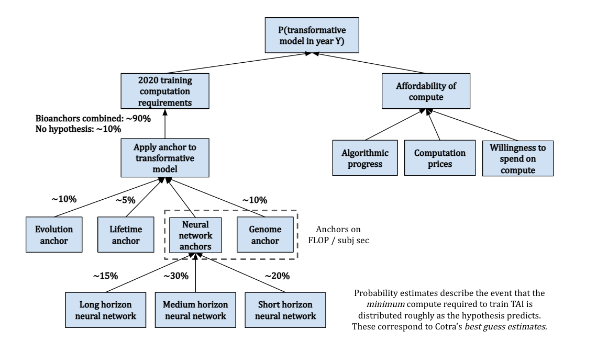
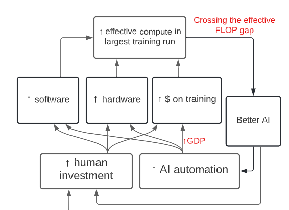

# 1.6 Forecasting

⌛ Estimated Reading Time: 38 minutes. (7499 words)

???+ note "Forecasting TAI - Video Introduction"

    
    
    <iframe style=" width: 100%; aspect-ratio: 16 / 9;" frameborder="0" allowfullscreen src="https://www.youtube.com/embed/3K25VPdbAjU"></iframe>
    
    !!! warning "This video is optional and not necessary to understand the text."
    
    

This section of the chapter investigates techniques used to forecast AI timelines and takeoff dynamics.

AI Forecasting refers to the practice of making predictions about the future progress and impacts of AI. The aim is to anticipate when certain milestones will be reached, how AI will evolve, and what implications this could have for society. Examples of milestones are passing benchmarks, achieving mouse-level intelligence, observation of qualities such as external tool use, and long-term planning. This anticipation helps us understand the potential trajectory and societal impact of AI technologies.

**Importance of forecasting**. Forecasting in AI is critical because it allows us to orient ourselves and prepare adequate safety measures and governance strategies according to both which capabilities are expected to emerge and when they are expected. Here are a couple of ways that timelines might affect the AI Risk case:

- **Resource Allocation and Urgency**: Belief in imminent AI advancements (short timelines) may prompt a swift allocation of resources toward AI safety, policymaking, and immediate practical measures. This is rooted in the concern that rapid transformative AI development might leave limited time to address safety and ethical considerations.

- **Research Focus**: The perceived timeline influences research priorities. A belief in Short timelines might steer efforts toward immediate safeguards for existing or soon-to-be-developed AI systems. In contrast, a belief in longer timelines allows for a deeper exploration of theoretical and foundational aspects of AI safety and alignment.

- **Career Choices**: Individual decisions on engaging in AI safety work are also timeline-dependent. A short timeline perspective may drive one to contribute directly and immediately to AI safety efforts. Conversely, a belief in longer timelines might encourage further skill and knowledge development before entering the field.

- **Governance and Policy-making**: Estimations of AI development timelines shape governance strategies, differentiating between short-term emergency measures and long-term institutional frameworks. This distinction is crucial in crafting effective policies that are responsive to the pace of AI evolution.

## 1.6.1 Zeroth-Order Forecasting

Zeroth-order forecasting, also known as reference class forecasting ([source](https://forecasting.quarto.pub/book/zeroth-first.html?ref=bounded-regret.ghost.io#first-order-approximation)), uses the outcomes of similar past situations to predict future events. This method assumes that the best predictor of future events is the average outcome of these past events. By comparing a current situation with a reference class of similar past instances, forecasters can make more accurate predictions without needing to delve into the details of the current case. This technique effectively bypasses the complexities of individual situations by focusing on historical averages, offering a straightforward way to estimate future outcomes based on past experiences.

**Understanding Reference Classes**. A reference class is a collection of similar situations from the past that serves as a benchmark for making predictions. Selecting an appropriate reference class is crucial; it must closely align with the current forecasting scenario to ensure accuracy. The process involves identifying past events that share key characteristics with the situation being predicted, allowing forecasters to draw on a wealth of historical data. The challenge lies in finding a truly analogous set of instances, which requires careful analysis and expert judgment. Reference classes ground predictions in reality, providing a statistical foundation by which we can gauge the likelihood of future occurrences.

**The Role of Anchors in Forecasting**. Anchors are initial estimates or known data points that act as a starting point for predictions, helping to set expectations and guide subsequent adjustments. They are crucial for establishing a baseline from which to refine forecasts, offering a concrete reference that aids in calibration and reducing speculation. While an anchor typically refers to a specific data point or benchmark, a reference class encompasses a broader set of data or experiences, making both concepts integral to informed forecasting. Anchors help in grounding the forecasting process, ensuring that predictions are not made in a vacuum but are instead based on observable and reliable data.

**Integrating Anchors and Reference Classes**. Together, anchors and reference classes form the backbone of effective forecasting. Anchors provide a solid starting point, while reference classes offer a comprehensive historical context, allowing forecasters to approach predictions with a balanced perspective. This combination enables a more systematic and data-driven approach to forecasting, minimizing biases and enhancing the reliability of predictions.

**What are some important anchors?** In the context of forecasting AI progress, some key anchors to consider include:

- **Current machine learning (ML) anchor**. The current state of machine learning systems serves as a starting point for forecasting future AI capabilities. By examining the strengths and limitations of existing ML systems, researchers can make educated guesses about the trajectory of AI development. This methodology can then be refined into the first-order forecasting methodology.

- **Biological anchor**. Comparisons to biological systems, like the human brain, serve as useful anchors. For instance, the 'computational capacity of the human brain' is often used as a benchmark to estimate when AI might achieve comparable capabilities.

- **Compute anchor**. This refers to the advancements in computing hardware that could potentially influence the speed and efficiency of AI development. It also covers the financial cost of training AI models, especially large-scale ones. Understanding this cost can provide insights into the resources required for further AI progress.

This is because both methods leverage the concept of 'reference classes' or 'anchors' to make predictions about future developments in AI.

## 1.6.2 First-Order Forecasting

First-order forecasting moves beyond the static approach of zeroth-order forecasting by considering the rate of change observed in historical data. The first-order approximation is like saying, "If the rate of change continues as it has in the past, then the future state will be this way." It projects future developments by extrapolating current trends, assuming that the observed pace of progress or change will continue. This dynamic method of prediction considers both the present state and its historical evolution, offering predictions that reflect ongoing trends. However, it's worth noting that such forecasts may not account for sudden shifts in progress rates, potentially leading to inaccuracies if trends dramatically change. ([source](https://forecasting.quarto.pub/book/zeroth-first.html?ref=bounded-regret.ghost.io#first-order-approximation))

**Contrast with Zeroth-Order Forecasting**. Unlike zeroth-order forecasting, which assumes the future will mirror the current state without considering the past rate of change, first-order forecasting integrates this rate into its predictions. This means, that instead of expecting the status quo to persist, first-order forecasting anticipates growth or decline based on past trends. This method acknowledges that developments, especially in fast-evolving fields like AI, often follow a trajectory that can inform future expectations. However, choosing between these forecasting methods depends on the specific context and the predictability of the trend in question.

**Implementing First-Order Forecasting in AI**. In practice, first-order forecasting for AI involves analyzing the historical progression of AI capabilities and technology improvements to forecast future advancements. For example, observing the development timeline and performance enhancements of AI models, such as the GPT series by OpenAI, provides a basis for predicting the release and capabilities of future iterations. Similarly, applying first-order forecasting to hardware advancements, guided by historical trends like Moore's Law, allows for projections about the future computational power available for AI development.

**Practical Examples and Methodology**. One example of a first-order forecasting framework in AI is trend extrapolation using performance curves. This involves plotting the performance of AI systems against time or resources (like data or compute), fitting a curve to the data, and then extrapolating this curve into the future. This approach has been used to forecast trends in areas like image recognition, chess playing, and natural language processing.

Another example is looking at how quickly new versions of models like OpenAI's GPT series are being developed and how much their performance is improving with each iteration. By extrapolating these trends, forecasters could make predictions about when we might see future versions of these models and how capable they are likely to be.

Yet another common approach in first-order forecasting is to analyze trends in hardware improvements, such as those predicted by Moore's Law. Moore's Law, which predicts that the number of transistors on a microchip doubles approximately every two years, has been a reliable trend in the computing industry for several decades. Forecasters might extrapolate this trend to make predictions about future developments in computing power, which are crucial for training increasingly powerful AI models.

**First-Order Forecasts**. Here are some forecasts for GPT-2030, by Jacob Steinhardt based on this first-order forecasting methodology. He used "*empirical scaling laws, projections of future compute and data availability, the velocity of improvement on specific benchmarks, empirical inference speed of current systems, and potential future enhancements in parallelism. […]*” ([source](https://bounded-regret.ghost.io/what-will-gpt-2030-look-like/)) to predict these capabilities.

- GPT-2030 will likely be superhuman at various specific tasks, including coding, hacking, and math […]

- GPT-2030 can be run in parallel. The organization that trains GPT-2030 would have enough compute to run many parallel copies: I estimate enough to perform 1.8 million years of work when adjusted to human working speeds […]

- GPT-2030’s copies can share knowledge due to having identical model weights, allowing for rapid parallel learning: I estimate 2,500 human-equivalent years of learning in 1 day.”

## 1.6.3 Biological Anchors Framework

**What are Biological anchors?** Biological anchors are a forecasting technique. To find a reference class, assume that the human brain is indicative of general intelligence. This means we can treat it as a proof of concept. Whatever “amount of compute” it takes to train a human being, might be roughly the same amount it should take to train a TAI. The biological anchors approach estimates the compute required for AI to reach a level of intelligence comparable to humans, outlined through several steps:

- First, assess how much computation the human brain performs, translating this into a quantifiable measure similar to computer operations in FLOP/s.

- Second, estimate the amount of computation needed to train a neural network to match the brain's inferential capacity, adjusting for future improvements in algorithmic efficiency.

- Third, examine when it would be feasible to afford such vast computational resources, taking into account the decreasing cost of compute, economic growth, and increasing investment in AI.

- Finally, by analyzing these factors, we can predict when it might be economically viable for AI companies to deploy the necessary resources for developing TAI.

Determining the exact computational equivalent for the human brain's training process is complex, leading to the proposal of six hypotheses, collectively referred to as "biological anchors" or "bioanchors." Each anchor has a different weighting contributing to the overall prediction.

Evolution Anchor: Total computational effort across all evolutionary history.

Lifetime Anchor: Brain's computational activity from birth to adulthood (0-32).

Neural Network and Genome Anchors: Various computational benchmarks based on the human brain and genome to gauge the scale of parameters needed for AI to achieve general intelligence.

**Forecasting with Biological Anchors**. By integrating these anchors with projections of future compute accessibility, we can outline a potential timeline for TAI. This method aims to provide a "soft upper bound" on TAI's arrival rather than pinpointing an exact year, acknowledging the complexity and unpredictability of AI development. ([source](https://forum.effectivealtruism.org/posts/ajBYeiggAzu6Cgb3o/biological-anchors-is-about-bounding-not-pinpointing-ai)) The following image gives an overview of the methodology.

***Figure****: The biological anchor model (**[source](https://epochai.org/blog/grokking-bioanchors)**)*

=== "**Evolution anchor**"

    
    
    !!! warning "This is extra detail provided for those interested. It can be safely skipped."
    
    This anchor quantifies the computational effort invested by evolution in shaping the human brain. It considers the vast amount of processing and learning that has taken place from the emergence of the first neurons to the development of the modern human brain. This method suggests that evolution has served as a form of "pre-training" for the human brain, enhancing its ability to adapt and survive. To estimate the computational power of this evolutionary "pre-training", the report considers the total amount of compute used by all animal brains over the course of evolution. This includes not just the brains of humans, but also those of our ancestors and other animals with nervous systems. The idea is that all of this brain activity represents a form of learning or adaptation that has contributed to the development of the modern human brain. While the exact calculations involved in this estimate are complex and subject to considerable uncertainty, the basic idea is to multiply the number of animals that have ever lived by the amount of compute each of their brains performed over their lifetimes. This gives an estimate of the total compute performed by all animal brains over the course of evolution.
    
    
    
    ***Figure****: The Evolution anchor (**[source](https://epochai.org/blog/grokking-bioanchors)**)*
    
    Cotra accounts for these considerations and assumes that the “average ancestor” performed as many FLOP/s as a nematode, and that there were on average ~1e21 ancestors at any time. This yields a **median of ~1e41 FLOP**, which seems extraordinarily high compared to modern machine learning. As an example, Google’s PaLM model was trained with ~2.5e24 FLOP (17 orders of magnitude smaller). She gives this anchor a **weight of 10%**. ([source](https://epochai.org/blog/grokking-bioanchors))
    
    

=== "**Lifetime anchor**"

    
    
    !!! warning "This is extra detail provided for those interested. It can be safely skipped."
    
    This refers to the total computational activity the human brain performs over a human lifetime. This anchor is essentially a measure of the "training" a human brain undergoes from birth to adulthood and incorporates factors such as the number of neurons in the human brain, the amount of computation each neuron performs per year, and the number of years it takes for a human to reach adulthood. The human brain has an estimated 86 billion neurons. Each of these neurons performs a certain number of computations per second, which can be calculated as a certain number of operations per second in FLOP/s. When calculating the total amount of compute over a lifetime, these factors are multiplied together, along with the number of years a human typically lives.
    
    For example, if we assume that a neuron is able to perform about 1000 operations per second, and there are about 31.5 million seconds in a year, then a single neuron would perform about 31.5 billion operations in a year. Now, if we multiply this by the estimated number of neurons in the human brain (86 billion), we get an estimate of the total brain-compute performed in one year. We can then multiply this by the number of years in a typical human lifespan to estimate the total brain-compute over a lifetime. Plugging in the numbers about brain FLOP/s seems to suggest that ~1e27 FLOP would be required to reach TAI. This seems low since examples from other technological domains suggest that the efficiency of things we build (on relevant metrics) is generally not great when compared to nature ([source](https://docs.google.com/document/d/1HUtUBpRbNnnWBxiO2bz3LumEsQcaZioAPZDNcsWPnos/edit)).
    
    
    
    ***Figure****: The Lifelong anchor (**[source](https://epochai.org/blog/grokking-bioanchors)**)*
    
    Cotra's report finds a median of ~1e28 FLOP and only gives the lifetime anchor a 5% weight, indicating that it's not the most influential factor in the overall model. The report acknowledges the inherent uncertainties and complexities involved in such a calculation and uses this anchor as one of several to provide a range of estimates for the compute required to achieve AI with human-level performance. ([source](https://epochai.org/blog/grokking-bioanchors))
    
    

=== "**Neural network Anchors**"

    
    
    !!! warning "This is extra detail provided for those interested. It can be safely skipped."
    
    Each of the neural network anchors serves to provide a different perspective on the amount of compute that might be required to train a TAI. There are three Neural Network Anchors presented in the report: long (~1e37 FLOP), medium (~1e34 FLOP), and short horizon (~1e32 FLOP). These anchors hypothesize that the ratio of parameters to compute used by a TAI should be similar to the ratio observed in today's neural networks. Additionally, a TAI should perform approximately as many FLOPs per subjective second as a human brain. A “subjective second” is the time it takes a model to process as much data as a human can in one second ([source](https://epochai.org/blog/grokking-bioanchors)). As an example a typical human reads about 3-4 words per second for non-technical material, so “one subjective second” for a language model would correspond to however much time that the model takes to process about ~3-4 words of data. ([source](https://www.alignmentforum.org/posts/KrJfoZzpSDpnrv9va/draft-report-on-ai-timelines)) Cotra determines the training data requirements based on a mix of machine learning theory and empirical considerations. She puts 15% weight on short horizons, 30% on medium horizons, and 20% on long horizons, for a total of 65% on the three anchors. ([source](https://epochai.org/blog/grokking-bioanchors))
    
    
    
    ***Figure****: **Neural network Anchors**(**[source](https://epochai.org/blog/grokking-bioanchors)**)*
    
    

=== "**Genome Anchor**"

    
    
    !!! warning "This is extra detail provided for those interested. It can be safely skipped."
    
    The genome anchor looks at the FLOP/subj sec of the human brain and expects TAI to require as many parameters as there are bytes in the human genome. This hypothesis implicitly assumes a training process that’s structurally analogous to evolution, and that TAI will have some critical cognitive ability that evolution optimized for. This differs from the evolution anchor in that it assumes we can search over possible architectures/algorithms a lot more efficiently than evolution, using gradients. Due to this structural similarity, and because feedback signals about the fitness of a particular genome configuration are generally sparse, this suggests that the anchor only really makes sense with long horizon lengths. ([source](https://epochai.org/blog/grokking-bioanchors))
    
    
    
    ***Figure****: The Genome Anchor (**[source](https://epochai.org/blog/grokking-bioanchors)**)*
    
    At least at the time of writing (May 2022), machine learning architectures don’t look very much like the human genome, and we are yet to develop TAI – thus Cotra updates against this hypothesis towards requiring more FLOP. Overall, she finds a median of ~1e33 FLOP and places 10% weight on this anchor. ([source](https://epochai.org/blog/grokking-bioanchors))
    
    

**Affordability of compute. **The costs related to bio anchors are calculated by considering three different factors: Algorithmic progress, compute price estimates, and willingness to spend on machine learning. The report considers a doubling in algorithmic efficiency every ~2-3 years. As for prices, Cotra assumes cost decreases over time, halving every ~2.5 years, and further expects this to level off after 6 orders of magnitude. Cotra assumes that the willingness to spend on machine learning training runs should be capped at 1% of the GDP of the largest country, referencing previous case studies with megaprojects (e.g. the Manhattan Project), and should follow a doubling time of 2 years after 2025. ([source](https://epochai.org/blog/grokking-bioanchors)) The main uncertainty is whether or not existing trends are going to persist more than several years into the future. For instance, Epoch found that OpenAI’s *AI and Compute* investigation ([source](https://openai.com/blog/ai-and-compute/)) was too aggressive in its findings for compute growth. ([source](https://epochai.org/blog/grokking-bioanchors)) This suggests taking caution when interpreting the forecasts made by the Bio Anchors report.

***Figure****: **Affordability of compute **(**[source](https://epochai.org/blog/grokking-bioanchors)**)*

The following graph gives an overview of the findings. Overall, the graph takes a weighted average of the different ways that the trajectory could flow. This gives us an estimate of a >10% chance of transformative AI by 2036, a ~50% chance by 2055, and an ~80% chance by 2100. In 2022 a two-year update on the author’s (Ajeya Cotra) timelines was published. The updated timelines for TAI are ~15% probability by 2030, ~35% probability by 2036, a median of ~2040, and a ~60% probability by 2050. ([source](https://www.alignmentforum.org/posts/AfH2oPHCApdKicM4m/two-year-update-on-my-personal-ai-timelines))

Figure: Results from the biological anchor model for different anchors ([source](https://forum.effectivealtruism.org/posts/vCaEnTbZ5KbypaGsm/forecasting-transformative-ai-the-biological-anchors-method))

**Criticisms. **The Biological Anchors framework provides a unique perspective but it's also crucial to recognize its limitations and the broader debates it sparks within the AI research community. It is not universally accepted as the primary predictive tool among all ML scientists or alignment researchers.

Platt's Law is a generalized observation named after Charles Platt. It is used to highlight a historical pattern where the estimated arrival of AGI (Artificial General Intelligence) consistently seems to be "just 30 years away". Vernor Vinge referenced it in the body of his famous 1993 NASA speech, whose abstract begins, “*Within thirty years, we will have the technological means to create superhuman intelligence. Shortly after, the human era will be ended.*” ([source](https://intelligence.org/2021/12/03/biology-inspired-agi-timelines-the-trick-that-never-works/)) Yudkowsky notes that this law seems to fit remarkably well with the prediction made by the Biological Anchors report in 2020. As the statistical aphorism goes: "All models are wrong, but some are useful".

So to get a complete picture of how biological anchors were received, here are some of the criticisms of the Biological Anchors report:

- **Challenges Beyond Compute**: While Biological Anchors highlight compute power as a critical factor for AI development, they may oversimplify the complexity of achieving transformative AI. Factors beyond sheer computing capacity, such as algorithm design, data availability, and the intricacies of learning environments, play pivotal roles. It’s overly simplistic to equate the future of AI solely with compute availability, as transformative AI development encompasses more nuanced challenges like algorithm innovation and data accessibility. ([source](https://www.cold-takes.com/biological-anchors-is-about-bounding-not-pinpointing-ai-timelines/))

- **Potential for Rapid Advancements**: Critics of the Biological Anchors method, such as Eliezer Yudkowsky, emphasize the unpredictability of AI progress and the potential for breakthroughs that could dramatically alter AI capabilities without adhering strictly to computational benchmarks derived from biology. These critiques highlight the importance of considering a range of factors and potential shifts in AI development paradigms that could accelerate progress beyond current forecasts. ([source](https://www.alignmentforum.org/posts/nNqXfnjiezYukiMJi/reply-to-eliezer-on-biological-anchors))

- **Purpose and Misinterpretation**: The Biological Anchors approach is intended to provide boundary estimates for AI development timelines rather than precise predictions. Misinterpretations may arise from expecting the method to offer specific year forecasts, whereas its goal is to outline possible upper and lower bounds, acknowledging the significant uncertainties in AI development. ([source](https://www.cold-takes.com/biological-anchors-is-about-bounding-not-pinpointing-ai-timelines/))

- **Contemplating Paradigm Shifts**: The AI field's history suggests that major paradigm shifts and technological breakthroughs could substantially impact development timelines. While deep learning currently dominates AI advances, the possibility of new, transformative methodologies emerging remains open, challenging the assumption that current trends will linearly continue into the future.

This is not an exhaustive list of all the criticisms but it serves to highlight the complexity of forecasting AI's future.

## 1.6.4 Takeoff

This section introduces the concept of AI takeoff. There is much debate about how AI development will play out in the future. The main questions to consider are:

- **Speed**: How quickly do AI systems become more powerful?

- **Continuity**: Does the speed progress in sudden jumps or is the speed gradual?

- **Homogeneity**: How similar are the AI systems to each other?

- **Polarity**: How many AI systems do we see vying for power in the world?

**Takeoff vs. Timelines**. The difference between these two concepts is subtle, and forecasts in one domain affect the outlooks in the other. However, both takeoff and timelines offer some distinct insights: timelines provide a countdown to AI breakthroughs, while takeoff dynamics forecast the speed and breadth of their societal impact. Understanding both perspectives is key to preparing for the future of AI, guiding safety measures, policy development, and strategic research investment.

### 1.6.4.1 Speed

**Takeoff Speeds**. Slow and fast takeoff scenarios offer contrasting views on AI's future trajectory, emphasizing different challenges and preparation strategies. While slow takeoff allows for iterative safety measures and societal adaptation, fast takeoff underscores the urgency of robust, pre-established safety frameworks. Understanding both dynamics is crucial for informed AI governance, safety research, and policy development, ensuring readiness for a range of possible futures.

**Slow takeoff**. This refers to a scenario where AI capabilities improve in a gradual and measured manner over a relatively longer temporal interval, which could be years or even decades. Note that the "speed" of the takeoff is not just about the raw increase in AI capabilities, but also about the societal and economic impact of those capabilities. Slow takeoff's advantage lies in the preparation time it affords, potentially allowing us to adapt, respond, and correct course if things go wrong. However, on the other hand, more time being exposed to a certain growth trajectory might also breed complacency. It might also be the case that most preparations undertaken before the onset of a slow takeoff would be rendered obsolete as better solutions gradually become visible which utilize new AI capabilities. In a slow takeoff scenario, humanity’s fate essentially depends on preparations put in place during the times when such growth is apparent. The terms "slow takeoff" and "soft takeoff" are often used interchangeably. 

**Fast takeoff**. A "fast takeoff" envisages AI's leap to superintelligence in a short timeframe, such as hours or days, limiting human capacity for response or control. This speed leaves little to no room for humans to react, adapt, or manage the situation. Fast takeoff scenarios highlight the critical importance of preemptive safety and alignment efforts, as the window for post-emergence intervention could be minimal. Given such a short time to react, local dynamics of the takeoff become relevant. The primary mechanism behind a fast takeoff is often considered to be 'recursive self-improvement' through an “intelligence explosion”, where the AI system continually improves its own intelligence and capabilities. We talk about an intelligence explosion, and discontinuity in the next subsection. Terms like “fast takeoff”, “hard takeoff” and “FOOM” are often used interchangeably.

**Speed vs. Continuity.** We observe that AI systems are created in discrete "events", sometimes many months or years apart. As an example GPT-3 was released in June 2020, and GPT-4 was released in March 2023. Is there a sudden, extremely large jump between such releases? or could the capabilities have been predicted by extrapolating trends? Where speed might be a measure of how quickly the AI becomes superintelligent, continuity can be thought of as a measure of "surprise". Continuity measures the predictability and pattern of AI advancements, focusing on whether these advancements occur through gradual, steady improvements or unexpected breaks in previous technological trends. Even though we are presenting speed and continuity separately, the distinction between them is extremely nuanced. They are very related concepts, so much so that oftentimes most researchers use slow takeoff as analogous to continuous takeoff, and fast takeoff as analogous to discontinuous takeoff, making no distinction whatsoever.

**Continuous takeoff**. Continuous takeoff depicts AI's progression as an extension of existing trends, where advancements are made incrementally. An example is the steady advancement of technology witnessed during the Industrial Revolution, where each decade produced slightly better tools and machinery. The term 'continuous' in this context borrows from mathematical terminology, where a function is considered continuous if it doesn't have any abrupt changes or discontinuities. Some people prefer the term 'gradual' or 'incremental' over 'continuous' as they find it more descriptive and mathematically accurate. 

**Discontinuous Takeoff**. The term 'discontinuous' in this context suggests that there are sudden jumps in capabilities, rather than being a smooth, gradual increase. This means that the AI system makes leaps that significantly exceed what would be expected based on past progress. In a discontinuous takeoff scenario, the AI's capabilities quickly surpass human control and understanding. The terms 'fast takeoff' and 'discontinuous takeoff' are often used interchangeably. However, the images below displaying different takeoff trajectories might help in clarifying the subtle differences between the concepts.

***Figure****: A comparative illustration of combinations of slow and fast takeoff, alongside continuity. Source: Samuel Dylan Martin, Daniel_Eth (Sep 2021) “**[Takeoff Speeds and Discontinuities](https://www.alignmentforum.org/posts/pGXR2ynhe5bBCCNqn/takeoff-speeds-and-discontinuities)**”*

### 1.6.4.2 Similarity

**Homogenous takeoff. **This refers to the similarity among different AI systems in play during the development and deployment of advanced AI. ([source](https://www.lesswrong.com/posts/mKBfa8v4S9pNKSyKK/homogeneity-vs-heterogeneity-in-ai-takeoff-scenarios)) Future AI systems might share significant similarities in their design, capabilities, and alignment. This could be due to shared underlying foundation models, common APIs, or similar training methods. The uniformity of AI systems under a homogenous takeoff scenario might imply the potential for easy cooperation between AI entities. Additionally, if homogeneity arises due to fine-tuning prevailing as the paradigm; the alignment of the initial AI system becomes the crucial factor for the alignment of all subsequent AI systems. A single misaligned system could, therefore, have widespread consequences, underscoring the importance of rigorous alignment and safety measures in early AI development stages. Homogeneity could either mitigate risks or exacerbate them, depending on the alignment and governance frameworks established during the initial phases of AI development.

**Heterogeneity**. A heterogeneous takeoff scenario represents diversity and variation in the development, safety levels, and deployment of AI systems. Several factors contribute to the heterogeneity in AI takeoff. First is the diversity in AI development approaches. Organizations and researchers might adopt different strategies and technologies, leading to varied outcomes in terms of AI capabilities and alignment. Moreover, competitive dynamics among AI projects could exacerbate this diversity, as teams race to achieve breakthroughs without necessarily aligning on methodologies or sharing crucial information. As an example, we might have a future where AI becomes a strategic national asset, and AI development is closely guarded. In this environment, the pursuit of AI capabilities becomes siloed, each company or country would then employ different development methodologies, potentially leading to a wide range of behaviors, functionalities, and safety levels.

### 1.6.4.3 Polarity

Takeoff polarity in the context of AI development explores how power and control might be distributed during the critical phase when AI systems transition to higher levels of intelligence and capability. It measures whether we will see power centralized in the hands of a single entity or dispersed among various actors.

**Unipolar Takeoff**. In a unipolar takeoff scenario, the landscape is characterized by the emergence of a single AI system or entity that achieves a significant lead over all others. This lead could be due to a breakthrough that allows for a sudden leap in capabilities, enabling this entity to outpace competitors rapidly, or due to something like an intelligence explosion. The concept hinges on the idea that early advantages in AI development—be it through technological breakthroughs, resource accumulation, or strategic positioning—could allow one project to dominate the field. This dominance could then be used to consolidate power, leveraging economic gains and network effects to maintain a hold over AI advancements and their applications.

**Multipolar Takeoff**. Conversely, a multipolar takeoff scenario envisions a more balanced distribution of advanced AI systems across multiple entities. This diversity could stem from slower, more incremental progress in AI capabilities, allowing various projects to evolve in tandem without any single entity pulling decisively ahead. Factors contributing to a multipolar landscape include widespread sharing of technological advancements, collaborative efforts to ensure safety and alignment, and regulatory environments that promote competition and mitigate monopolistic outcomes. A unipolar scenario raises concerns about the concentration of power and the potential for misuse of advanced AI capabilities, while a multipolar world presents challenges in coordination among diverse entities or AI systems.

Factors Influencing Polarity. Several key elements influence whether takeoff polarity leans towards a unipolar or multipolar outcome:

- Speed of AI Development: A rapid takeoff might favor a unipolar outcome by giving a significant advantage to the fastest developer. In contrast, a slower takeoff could lead to a multipolar world where many entities reach advanced capabilities more or less simultaneously.

- Collaboration vs. Competition: The degree of collaboration and openness in the AI research community can significantly affect takeoff polarity. High levels of collaboration and information sharing could support a multipolar outcome, while secretive or highly competitive environments might push towards unipolarity.

- Regulatory and Economic Dynamics: Regulatory frameworks and economic incentives also play a crucial role. Policies that encourage diversity in AI development and mitigate against the accumulation of too much power in any single entity's hands could foster a multipolar takeoff.

### 1.6.4.4 Takeoff Arguments

**The Overhang Argument**. There might be situations where there are substantial advancements or availability in one aspect of the AI system, such as hardware or data, but the corresponding software or algorithms to fully utilize these resources haven't been developed yet. The term 'overhang' is used because these situations imply a kind of 'stored’ or ‘latent’ potential. Once the software or algorithms catch up to the hardware or data, there could be a sudden unleashing of this potential, leading to a rapid leap in AI capabilities. Overhangs provide one possible argument for why we might favor discontinuous or fast takeoffs. There are two types of overhangs commonly discussed:

- **Hardware Overhang**: This refers to a situation where there is enough computing hardware to run many powerful AI systems, but the software to run such systems hasn't been developed yet. If such hardware could be repurposed for AI, this would mean that as soon as one powerful AI system exists, probably a large number of them would exist, which might amplify the impact of the arrival of human-level AI.

- **Data Overhang**: This would be a situation where there is an abundance of data available that could be used for training AI systems, but the AI algorithms capable of utilizing all that data effectively haven't been developed or deployed yet.

Overhangs are also used as a counter argument to why AI pauses do not affect takeoff. One counter argument to the overhang argument is that it relies on the assumption that during the time that we are pausing AI development, the rate of production of chips will remain constant. It could be argued that the companies manufacturing these chips will not make as many chips if data centers aren't buying them. However, this argument only works if the pause is for any appreciable length of time, otherwise the data centers might just stockpile the chips. It is also possible to make progress on improved chip design, without having to manufacture as many during the pause period. However, during the same pause period we could also make progress on AI Safety techniques. ([source](https://www.youtube.com/watch?v=Q3eRy4t2oPQ))

**The Economic Growth Argument**. Historical patterns of economic growth, driven by human population increases, suggest a potential for slow and continuous AI takeoff. This argument says that as AIs augment the effective economic population, we might witness a gradual increase in economic growth, mirroring past expansions but at a potentially accelerated rate due to AI-enabled automation. Limitations in AI's ability to automate certain tasks, alongside societal and regulatory constraints (e.g. that medical or legal services can only be rendered by humans), could lead to a slower expansion of AI capabilities. Alternatively, growth might far exceed historical rates. Using a similar argument for a fast takeoff hinges on AI's potential to quickly automate human labor on a massive scale, leading to unprecedented economic acceleration.

**Compute Centric Takeoff Argument**. This argument, similar to the Bio Anchors report, assumes that compute will be sufficient for transformative AI. Based on this assumption, Tom Davidson's 2023 report on compute-centric AI takeoff discusses feedback loops that may contribute to takeoff dynamics.

- **Investment feedback loop**: There might be increasing investment in AI, as AIs play a larger and larger role in the economy. This increases the amount of compute available to train models, as well as potentially leading to the discovery of novel algorithms. All of this increases capabilities, which drives economic progress, and further incentivizes investment.

- **Automation feedback loop**: As AIs get more capable, they will be able to automate larger parts of the work of coming up with better AI algorithms, or helping in the design of better GPUs. Both of these will increase the capability of the AIs, which in turn allow them to automate more labor.

Depending on the strength and interplay of these feedback loops, they can create a self-fulfilling prophecy leading to either an accelerating fast takeoff if regulations don't curtail various aspects of such loops, or a slow takeoff if the loops are weaker or counterbalanced by other factors. The entire model is shown in the diagram below:

Figure: A summary of What a Compute-Centric Framework Says About Takeoff Speeds ([source](https://www.openphilanthropy.org/research/what-a-compute-centric-framework-says-about-takeoff-speeds/))

**Automating Research Argument. **Researchers could potentially design the next generation of ML models more quickly by delegating some work to existing models, creating a feedback loop of ever-accelerating progress. The following argument is put forth by Ajeya Cotra:

Currently, human researchers collectively are responsible for almost all of the progress in AI research, but are starting to delegate a small fraction of the work to large language models. This makes it somewhat easier to design and train the next generation of models.

The next generation is able to handle harder tasks and more different types of tasks, so human researchers delegate more of their work to them. This makes it significantly easier to train the generation after that. Using models gives a much bigger boost than it did the last time around.

Each round of this process makes the whole field move faster and faster. In each round, human researchers delegate everything they can productively delegate to the current generation of models — and the more powerful those models are, the more they contribute to research and thus the faster AI capabilities can improve. ([source](https://www.planned-obsolescence.org/ais-accelerating-ai-research/))

So before we see a recursive explosion of intelligence, we see a steadily increasing amount of the full RnD process being delegated to AIs. At some point, instead of a significant majority of the research and design being done by AI assistants at superhuman speeds, it will become that - all of the research and design for AIs is done by AI assistants at superhuman speeds.

At this point there is a possibility that this might eventually lead to a full automated recursive intelligence explosion.

**The Intelligence Explosion Argument**. This concept of the 'intelligence explosion' is also central to the conversation around discontinuous takeoff. It originates from I.J. Good's thesis, which posits that sufficiently advanced machine intelligence could build a smarter version of itself. This smarter version could in turn build an even smarter version of itself, and so on, creating a cycle that could lead to intelligence vastly exceeding human capability ([source](https://intelligence.org/files/IEM.pdf)).

In their 2012 report on the evidence for Intelligence Explosions, Muehlhauser and Salamon delve into the numerous advantages that machine intelligence holds over human intelligence, which facilitate rapid intelligence augmentation. ([source](https://intelligence.org/files/IE-EI.pdf)) These include:

- **Computational Resources**: Human computational ability remains somewhat stationary, whereas machine computation possesses scalability.

- **Speed**: Humans communicate at a rate of two words per second, while GPT-4 can process 32k words in an instant. Once LLMs can write "better" than humans, their speed will most probably surpass us entirely.

- **Duplicability**: Machines exhibit effortless duplicability. Unlike humans, they do not need birth, education, or training. While humans predominantly improve individually, machines have the potential to grow collectively. Humans take 20 years to become competent from birth, whereas once we have one capable AI, we can duplicate it immediately. Once AIs reach the level of the best programmer, we can just duplicate this AI. The same goes for other jobs.

- **Editability**: Machines potentially allow more regulated variations. They exemplify the equivalent of direct brain enhancements via neurosurgery in opposition to laborious education or training requirements. Humans can also improve and learn new skills, but they don't have root access to their hardware: we are just starting to be able to understand the genome's "spaghetti code," while AI could use code versioning tools to improve itself, being able to attempt risky experiments with backup options in case of failure. This allows for much more controlled variation.

- **Goal coordination**: Copied AIs possess the capability to share goals effortlessly, a feat challenging for humans.

## 1.6.5 Questions & Exercises

??? question "What is AI Forecasting, and why is it important?"

    
    
    AI Forecasting refers to the practice of predicting future progress and impacts of AI, aiming to anticipate when certain milestones will be reached, how AI will evolve, and its implications for society. This is important because it helps in preparing adequate safety measures and governance strategies, ensuring that we are ready for the capabilities expected to emerge and when they are expected.
    
    Example: If we forecast that AI will achieve human-level intelligence within 10 years, we can start developing policies, safety protocols, and ethical guidelines now, rather than scrambling to respond once the milestone is reached.
    
    

??? question "What is zeroth-order forecasting, and how does it utilize reference classes?"

    
    
    Zeroth-order forecasting, also known as reference class forecasting, uses outcomes of similar past situations to predict future events. It assumes that the best predictor of future events is the average outcome of these past events. Reference classes are collections of past events that share key characteristics with the current forecasting scenario, providing a statistical foundation for predictions.
    
    Example: Predicting the success of a new AI language model by comparing it to the launch and adoption rates of previous models like BERT or GPT-3.
    
    

??? question "How do anchors assist in forecasting AI progress, and what are some key anchors in AI forecasting?"

    
    
    Anchors are initial estimates or known data points that act as a starting point for predictions, helping to set expectations and guide subsequent adjustments. Key anchors in AI forecasting include:
    
    Current machine learning anchor: Examines strengths and limitations of existing ML systems.
    
    Biological anchor: Compares AI development to biological systems, like the computational capacity of the human brain.
    
    Compute anchor: Focuses on advancements in computing hardware and the financial cost of training AI models.
    
    Example: Using the computational power of the human brain as an anchor to estimate when AI might achieve similar capabilities, we can predict AI progress based on current advancements in computing power and algorithm efficiency.
    
    

??? question "What distinguishes first-order forecasting from zeroth-order forecasting in AI?"

    
    
    First-order forecasting considers the rate of change observed in historical data, projecting future developments by extrapolating current trends. In contrast, zeroth-order forecasting uses the average outcomes of past events without considering the rate of change.
    
    Example: Using the historical improvement rates of AI performance on language tasks to predict future capabilities, such as how quickly models like GPT have improved in understanding and generating text over the past decade.
    
    

??? question "What are biological anchors, and how do they help forecast AI development?"

    
    
    Biological anchors use the human brain as a benchmark to estimate the compute required for AI to achieve human-like intelligence. This involves assessing the brain's computational capacity, translating it into a measure similar to computer operations (FLOP/s), and estimating when such computational resources will be economically viable.
    
    Example: Estimating that reaching human-level AI might require computational resources equivalent to those used by the human brain over a lifetime, we can forecast when AI will achieve this based on current trends in computing power and algorithm efficiency.
    
    

??? question "Explain the concepts of slow and fast takeoff in AI development."

    
    
    Slow takeoff refers to a gradual improvement in AI capabilities over years or decades, allowing time for societal and regulatory adaptation. Fast takeoff envisions a rapid leap to superintelligence in a short timeframe, such as hours or days, leaving little time for human response.
    
    Example: A slow takeoff might resemble the gradual improvement of personal computers from the 1980s to now, whereas a fast takeoff could be akin to a sudden, massive breakthrough in AI, similar to how smartphones rapidly changed society within a few years.
    
    

??? question "How do homogeneity and heterogeneity affect AI takeoff dynamics?"

    
    
    Homogeneity in AI takeoff implies that AI systems are similar in design and capabilities, potentially allowing for easier cooperation but also posing risks if a single misaligned system influences many others. Heterogeneity represents diversity in AI systems, with varied development approaches leading to different levels of safety and functionality.
    
    Example: In a homogenous takeoff, a breakthrough in one AI system could quickly propagate across all systems, while in a heterogeneous takeoff, different AI systems might evolve at different rates, requiring varied safety measures.
    
    

??? question "What is the Overhang Argument in AI takeoff scenarios?"

    
    
    The Overhang Argument suggests that substantial advancements in one aspect (e.g., hardware or data) but not the corresponding software or algorithms can lead to a rapid leap in AI capabilities once the software catches up. This overhang creates a 'stored' potential that can be unleashed suddenly. Such arguments suggest that pausing AI does not constitute a solution to AI Safety, as capabilities will be able to very quickly catch up on the pause is removed.
    
    Example: If we already have powerful hardware capable of supporting advanced AI but lack the necessary algorithms, a sudden breakthrough in software development could lead to a quick and dramatic improvement in AI capabilities.
    
    

??? question "Describe the Intelligence Explosion Argument."

    
    
    The Intelligence Explosion Argument posits that an advanced machine intelligence could create a smarter version of itself, which in turn could create an even smarter version, leading to a rapid cycle of self-improvement and vastly exceeding human intelligence.
    
    Example: If an AI system develops the ability to enhance its own code and hardware, it could quickly surpass human intelligence by iteratively improving itself at an accelerating rate.
    
    

??? question "How do economic growth arguments relate to AI takeoff scenarios?"

    
    
    Economic growth arguments suggest that as AI systems augment the GDP, we might see a gradual increase in economic growth, similar to historical expansions but at a potentially accelerated rate due to AI-enabled automation. We might notice such an economic acceleration taking place allowing us to prepare accordingly.
    
    Example: AI automation in industries like manufacturing and services could lead to increased productivity and economic growth, paralleling historical periods of technological advancement like the Industrial Revolution.