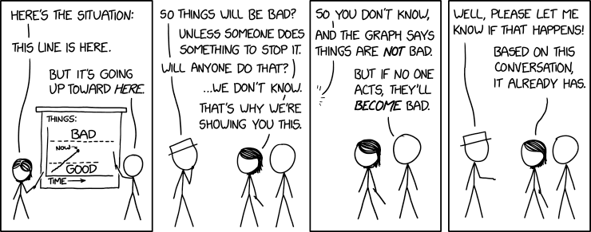

# 2.7 Conclusion
!!! note "Reading Time: 1 minutes" 

There are many types of risks and a lot of uncertainty.

**AI risks are complex.** In this chapter, we have traversed the complex and multifaceted landscape of AI risks, highlighting the myriad ways in which the burgeoning capabilities of artificial intelligence might pose significant threats to human well-being and even survival. From the misuse of AI technologies in cyberwarfare and bioterrorism to the intrinsic dangers of misalignment and systemic risks, the potential for catastrophic outcomes. Moreover, the competitive pressures of the AI development landscape and the inadequacy of current regulatory and oversight mechanisms exacerbate our challenges.

**There remains a lack of consensus.** Despite extensive research and debate, there remains a lack of consensus regarding the specific parameters that influence the likelihood of misalignment, deception, and other forms of risk. This uncertainty underscores the challenges in predicting AI behavior and ensuring alignment with human values and safety standards.

**However, this chapter also serves as a call to action.** As we stand on the precipice of potentially transformative advancements in AI. We think it is necessary to develop a global, multidisciplinary approach to AI safety that encompasses technical safeguards, robust ethical frameworks, and international cooperation. The development of AI technologies cannot be left solely in the hands of technologists; it requires the involvement of policymakers, ethicists, social scientists, and the broader public to navigate the moral and societal implications of AI.

***Figure****: from XKCD (**[source](https://xkcd.com/)**)*