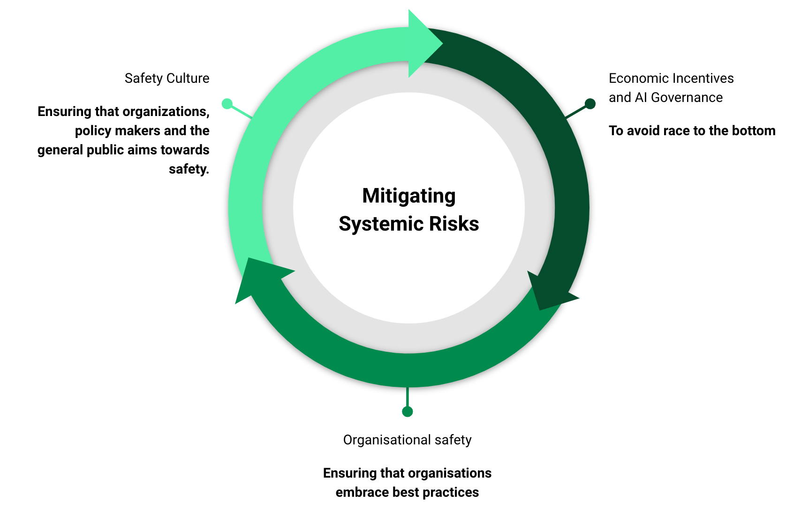
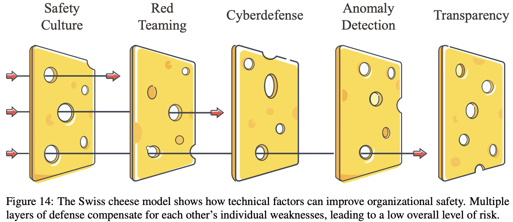
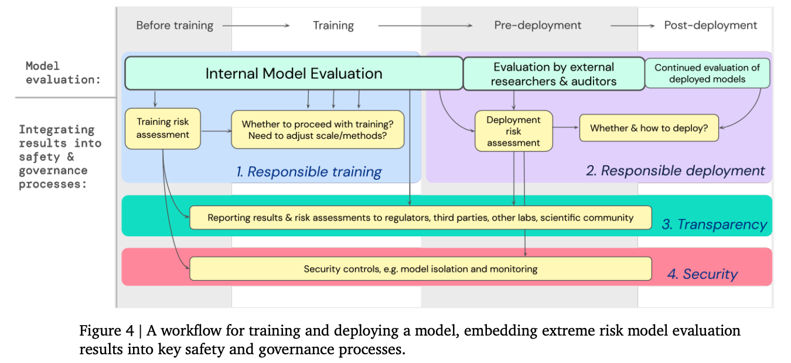

# Transversal Solutions

**Figure****: **An illustration of a framework that we think is robustly good to manage risks.

**AI Risks are too numerous and too heterogeneous. **To address these risks, we need an adaptive framework that can be robust and evolve as AI advances.

## Strategy A: AI Governance

The pursuit of AI advancement, much like the nuclear arms race of the Cold War era, represents a trade-off between safety and the competitive edge nations and corporations seek for power and influence. This competitive dynamic increases global risk, underscoring the need for deliberate governance and the redesign of economic incentives to prioritize long-term safety over short-term gains.

Effective AI governance aims to achieve two main objectives: a) **time and resources for solution development**, and Ensuring sufficient time and resources are allocated for identifying and implementing safety measures and b) **enhanced coordination**: Increasing the likelihood of widespread adoption of safety measures through global cooperation. AI risks are multifaceted, necessitating regulations that encourage cautious behavior among stakeholders and timely responses to emerging threats.

**Designing better incentives**

- **Windfall clauses**: Implementing agreements to share the profits between the different labs generated from AGI would mitigate the race to AI supremacy by ensuring collective benefit from individual successes. [Footnote: For example, in the pharmaceutical industry for drug development, companies sometimes enter into co-development and profit-sharing agreements to share the risks and rewards of bringing a new drug to market. For example, in 2014, Pfizer and Merck entered into a global alliance to co-develop and co-commercialize an anti-PD-L1 antibody for the treatment of multiple cancer types.]

- **Rethinking AGI labs governance**: It is important to examine the governance structures of AGI labs. For example, being non-profit and having a mission statement that makes it clear that the goal is not to make the most money, but to ensure that the development of AI benefits all of humanity, is an important first step.

- **Centralized development of high-risk AI:** For example, Yoshua Bengio et al. propose creating a secure facility akin to CERN for physics, where the development of potentially dangerous AI technologies can be tightly controlled [[s](https://yoshuabengio.org/2023/06/24/faq-on-catastrophic-ai-risks/)]. This measure is highly non consensual. 

- **Legal liability for AI developers**: Establishing clear legal responsibilities for AI developers regarding misuse or failures can foster safer development practices.

**Preventing the development of dangerous AI**

- **Moratoriums and regulations**: Implementing temporary halts on the development of high-risk AI systems and enforcing legal frameworks, like the EU AI Act, to regulate or prohibit certain AI capabilities.

- **Controlling Access and Replication**: Limiting the distribution and replication of powerful AI systems to prevent widespread misuse.

**Maintaining human control**

- **Meaningful human oversight**: Ensuring AI systems, especially those involved in critical decision-making processes, operate under human supervision to prevent irreversible consequences.

In conclusion, mitigating AI's risks requires a multifaceted approach combining governance, public engagement, economic incentives, legal measures, and promoting a global safety culture. By fostering international cooperation and prioritizing safety and ethical considerations in AI development, humanity can navigate the challenges posed by advanced AI technologies and harness their potential for the greater good.

- *For more information, s**ee the chapters on **AI Governance.*

## Strategy B: Organizational safety

**Accidents Are Hard to Avoid, even when the incentive structure and governance try to ensure that there will be no problems**. For example, even today, there are still accidents in the aerospace industry. 

 \
**Figure:** Swiss cheese model. ([source](https://www.safe.ai/ai-risk))

**To solve those problems, we advocate for a Swiss cheese model** — no single solution will suffice, but a layered approach can significantly reduce risks. The Swiss cheese model is a concept from risk management, widely used in industries like healthcare and aviation. Each layer represents a safety measure, and while individually they might have weaknesses, collectively they form a strong barrier against threats. Organizations should also follow [safe design principles](https://arxiv.org/pdf/2206.05862.pdf), such as defense in depth and redundancy, to ensure backup for every safety measure, among others.

Many solutions can be imagined to reduce those risks, even if none is perfect. The first step could be commissioning external red teams to identify hazards and improve system safety. This is what OpenAI did with METR to evaluate GPT-4. However AGI labs also need an internal audit team for risk management. Just like banks have risk management teams, this team needs to be involved in the decision processes, and key decisions should involve a chief risk officer to ensure executive accountability. One of the missions of the risk management team could be, for example, designing pre-set plans for managing security and safety incidents.

**Accidents could also arise during training before the deployment. **Sporadically, this can also be an error sign or a bug [[s](https://arxiv.org/pdf/1909.08593.pdf#page=12)]. To avoid accidents during training, **the training should also be ****responsible****.** [Model evaluation for extreme risks](https://arxiv.org/abs/2305.15324), which was written by researchers from OpenAI, Anthropic, and DeepMind, lays out a good baseline strategy for what needs to be done before training, during training, before deployment, and after deployment.

**Figure **from [[s](https://arxiv.org/abs/2305.15324)], a workflow for training and deploying a model responsibly.

## Strategy C: Safety Culture

**AI safety is a socio-technical problem that requires a socio-technical solution**.  As such, the resolution to these challenges cannot be purely technical. Safety culture is crucial for numerous reasons. At the most basic level, it ensures that safety measures are at least taken seriously. This is important because a disregard for safety can lead to the circumvention or rendering useless of regulations, as is often seen when companies that don't care about safety face audits [[4]](https://www.lesswrong.com/posts/iFLNKgZceYyTdwsGz/safety-culture-for-ai-is-important-but-isn-t-going-to-be).

**The challenge of industry-wide adoption of technical solutions.** Proposing a technical solution is only the initial step toward addressing safety. A technical solution or set of procedures needs to be internalized by all members of an organization. When safety is viewed as a key objective rather than a constraint, organizations often exhibit leadership commitment to safety, personal accountability for safety, and open communication about potential risks and issues [[1]](https://arxiv.org/abs/2306.12001).

**Reaching the standards of the aerospace industry.**** **In aerospace, stringent regulations govern the development and deployment of technology. For instance, an individual cannot simply build an airplane in their garage and fly passengers without undergoing rigorous audits and obtaining the necessary authorizations. In contrast, the AI industry operates with significantly fewer constraints, adopting an extremely permissive approach to development and deployment, allowing developers to create and deploy almost any model. These models are then integrated into widely used libraries, such as Hugging Face, and those models can then proliferate with minimal auditing. This disparity underscores the need for a more structured and safety-conscious framework in AI. By adopting such a framework, the AI community can work towards ensuring that AI technologies are developed and deployed responsibly, with a focus on safety and alignment with societal values.

**Safety culture can transform industries.** Norms about trying to be safe can be a powerful way to notice and discourage bad actors. In the absence of a strong safety culture, companies and individuals may be tempted to cut corners, potentially leading to catastrophic outcomes [[4]](https://www.lesswrong.com/posts/iFLNKgZceYyTdwsGz/safety-culture-for-ai-is-important-but-isn-t-going-to-be). Capabilities often trade off with safety. The adoption of safety culture in the aerospace sector has transformed the industry, making it more attractive and generating more sales. Similarly, an ambitious AI safety culture would require the establishment of a large AI security industry (a neologism inspired by the cybersecurity industry).

**If achieved, safety culture would be a systemic factor that prevents AI risks.** Rather than focusing solely on the technical implementation of a particular AI system, attention must also be given to social pressures, regulations, and safety culture. This is why engaging the broader ML community that is not yet familiar with AI Safety is critical [[6]](https://www.alignmentforum.org/posts/bffA9WC9nEJhtagQi/introduction-to-pragmatic-ai-safety-pragmatic-ai-safety-1).

**How to *****concretely *****increase public awareness and safety culture?**

- **Open letters**: Initiatives like open letters, similar to the one from the Future of Humanity Institute [[s](https://futureoflife.org/open-letter/pause-giant-ai-experiments/)], can spark public debate on AI risks. 

- **Safety culture promotion**: Advocating for a culture of safety among AI developers and researchers to preemptively address potential risks, for example by organizing internal training on safety. For example, internal training for cybersecurity is already common for some companies. Opening AI safety courses in universities and training future ML practitioners is also important.

- **Building consensus**: Create a global AI risk assessment body, similar to the IPCC for climate change, to standardize and disseminate AI safety findings.
