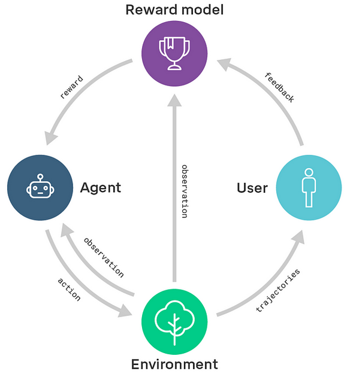
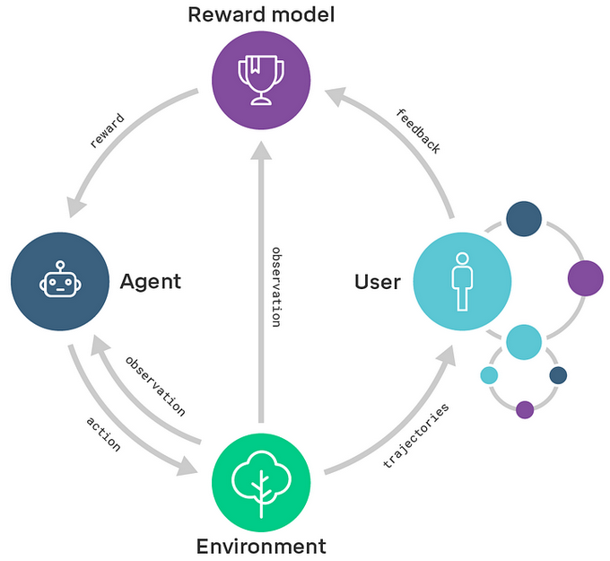
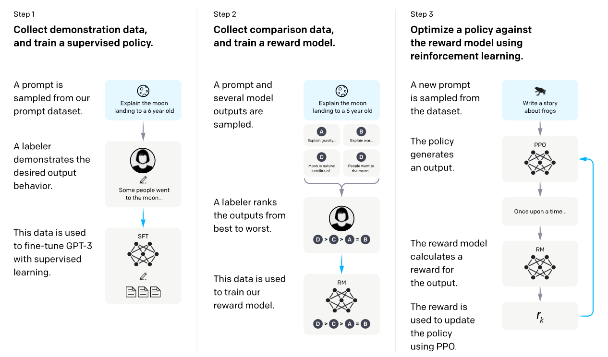
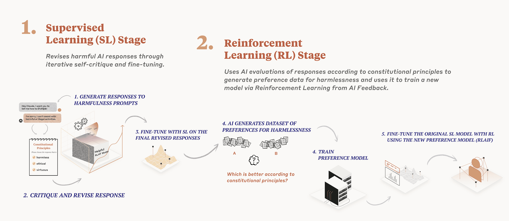
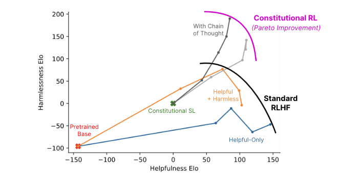
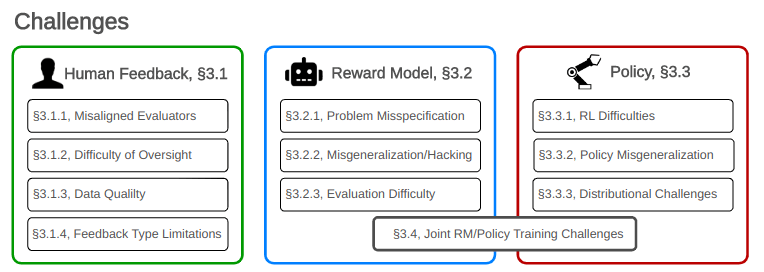
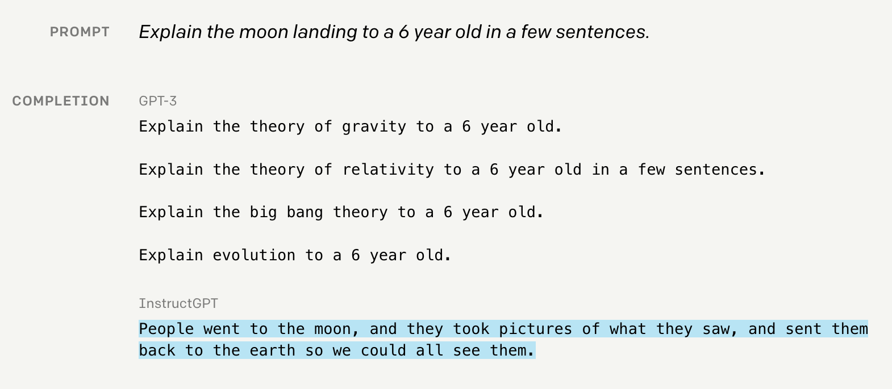
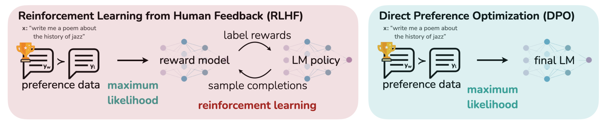
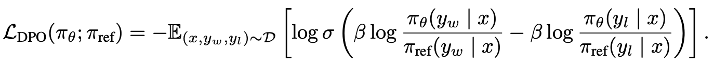

# Learning from feedback

⌛ Estimated Reading Time: 23 minutes. (4470 words)

This section discusses yet more attempts to address the reward misspecification problem. At times, the intended behavior is so intricate that demonstration-based learning becomes untenable. An alternative approach is to offer feedback to the agent instead of providing either manually specified reward functions or even expert demonstrations. This section delves into feedback-based strategies such as Reward Modeling, Reinforcement Learning from Human Feedback (RLHF) and Reinforcement Learning from AI Feedback (RLAIF), also known as Reinforcement Learning from Constitutional AI (RLCAI) or simply Constitutional AI.

## Reward Modeling

- DeepMind (Nov 2018) “[Scalable agent alignment via reward modeling](https://arxiv.org/abs/1811.07871)”

Reward modeling was developed to apply reinforcement learning (RL) algorithms to real-world problems where designing a reward function is difficult, in part because humans don’t have a perfect understanding of every objective. In reward modeling, human assistants evaluate the outcomes of AI behavior, without needing to know how to perform or demonstrate the task optimally themselves. This is similar to how you can tell if a dish is cooked well by tasting it even if you do not know how to cook, and thus your feedback can be used by a chef to learn how to cook better. This technique separates the RL alignment problem into two separate halves: Understanding intentions, i.e. learning the ‘What?’, and Acting to achieve the intentions, i.e. learning the ‘How?’. This means that in the modeling agenda, there are two different ML models:

- A reward model is trained with user feedback. This model learns to predict what humans would consider good behavior.

- An agent trained with RL, where the reward for the agent is determined by the outputs of the reward model

Source: DeepMind (Nov 2018) “[Scalable agent alignment via reward modeling](https://deepmindsafetyresearch.medium.com/scalable-agent-alignment-via-reward-modeling-bf4ab06dfd84)”

Overall, while promising reward modeling can still fall prey to reward misspecification and reward hacking failures. Obtaining accurate and comprehensive feedback can be challenging, and human evaluators may have limited knowledge or biases that can impact the quality of the feedback. Additionally, any reward functions learnt through modeling might also struggle to generalize to new situations or environments that differ from the training data. These are all discussed further using concrete examples in later sections.

There are also some variants of reward modeling such as:

- **Narrow reward modeling** is a specific flavor of reward modeling where the focus is on training AI systems to accomplish specific tasks rather than trying to determine the "true human utility function". It aims to learn reward functions to achieve particular objectives, rather than seeking a comprehensive understanding of human values.

- **Recursive reward modeling** seeks to introduce scalability to the technique. In recursive reward modeling, the focus is on decomposing a complex task into simpler subtasks and using reward modeling at each level to train agents that can perform those subtasks. This hierarchical structure allows for more efficient training and credit assignment, as well as the exploration of novel solutions that may not be apparent to humans. This is shown in the diagram below. Scalable oversight will be covered in greater depth in future chapters.

Source: DeepMind (Nov 2018) “[Scalable agent alignment via reward modeling](https://deepmindsafetyresearch.medium.com/scalable-agent-alignment-via-reward-modeling-bf4ab06dfd84)”

The general reward modeling framework forms the basis for other feedback based techniques such as RLHF (Reinforcement Learning from Human Feedback) which is discussed in the next section.

## Reinforcement Learning from Human Feedback (RLHF)

Reinforcement Learning from Human Feedback (RLHF) is a method developed by OpenAI. It's a crucial part of [their strategy](https://openai.com/blog/our-approach-to-ai-safety) to create AIs that are both safe and aligned with human values. A prime example of an AI trained with RLHF is OpenAI’s ChatGPT.

Earlier in this chapter, the reader was asked to consider the reward design problem for manually defining a reward function to get an agent to perform a backflip. This section considers the RLHF solution to this design problem. RLHF addresses this problem as follows: A human is initially shown two instances of an AI's backflip attempts, then the human selects which one appears more like a backflip, and finally, the AI is updated accordingly. By repeating this process thousands of times, we can guide the AI to perform actual backflips.

**Figure**: RLHF learned to backflip using around 900 individual bits of feedback from the human evaluator.

**Figure**: From "[Learning from Human Preferences](https://openai.com/blog/deep-reinforcement-learning-from-human-preferences/)," the authors point out that manual reward crafting took two hours to write a custom reward function for a robot to perform a backflip. While it was successful, it was significantly less elegant than the one trained purely through human feedback.

Similar to designing a reward function that efficiently rewards proper backflips, it is hard to specify precisely what it means to generate safe or helpful text. This served as some of the motivation behind making RLHF integral to the training of some current Large Language Models (LLMs).

Although training sequences may vary slightly across organizations, most labs adhere to the general framework of pre-training followed by some form of fine-tuning. Observing the InstructGPT training process offers insight into a possible path for training LLMs. The steps include:

Source: OpenAI (Jan 2022) “[Aligning language models to follow instructions](https://openai.com/research/instruction-following)”

- **Step ****0****: ****[Semi-Supervised](https://en.wikipedia.org/wiki/Weak_supervision#Semi-supervised_learning)**** Generative Pre-training:** The LLM is initially trained using a massive amount of internet text data, where the task is to predict the next word in a natural language context.

- **Step ****1****: ****[Supervised](https://en.wikipedia.org/wiki/Supervised_learning)**** ****[Fine-tuning](https://platform.openai.com/docs/guides/fine-tuning)****:** A fine-tuning dataset is created by presenting a prompt to a human and asking them to write a response. This process yields a dataset of (prompt, output) pairs. This dataset is then used to fine-tune the LLM through supervised learning, a form of behavioral cloning.

- **Step ****2****:** **Train a ****Reward Model: **We train an additional reward model. We initially prompt the fine-tuned LLM and gather several output samples for the same prompt. A human then ranks these samples from best to worst. This ranking is used to train the reward model to predict what a human would rank higher.

- **Step 3: ****Reinforcement learning:** Once we have both a fine-tuned LLM and a reward model, we can employ [Proximal Policy Optimization (PPO)](https://openai.com/research/openai-baselines-ppo)-based reinforcement learning to encourage the fine-tuned model to maximize the reward that the reward model, which mimics human rankings, offers.

**Reward hacking in feedback methods**

While the feedback based mechanisms do make models safer, they does not make them immune to reward hacking. The effectiveness of an algorithm heavily relies on the human evaluator's intuition about what constitutes the correct behavior. If the human lacks a thorough understanding of the task, they may not provide beneficial feedback. Further, in certain domains, our system might lead to agents developing policies that deceive the evaluators. For instance, a robot intended to grasp objects merely positioned its manipulator between the camera and the object, making it seem as if it was executing the task as shown below.

Source: Christiano et al (2017) “[Deep Reinforcement Learning From Human Preferences](https://arxiv.org/pdf/1706.03741.pdf)”

## Pretraining with Human Feedback (PHF)

In standard pretraining, the language model attempts to learn parameters such that they maximize the likelihood of the training data. However, this also includes undesirable content such as falsehoods, offensive language, and private information. The concept of Pretraining with human feedback (PHF) utilizes the reward modeling methodology in the pretraining phase. The authors of the paper found that PHF works much better than the standard practice of only using feedback (RLHF) after pretraining. ([source](https://arxiv.org/abs/1706.03741))

In PHF the training data is scored using a reward function, such as a toxic text classifier, to guide the language model to learn from undesirable content while avoiding imitating it during inference time.

Similar to RLHF, PHF does not completely solve reward hacking, however, it might move the systems one small step closer. These methods can be further extended by employing AI assistants to aid humans in providing more effective feedback. Some aspects of this strategy are introduced in the next section but will be explored in further detail in the chapters on scalable and adversarial oversight methods.

## Reinforcement Learning from AI Feedback (RLAIF)

!!! info "Definition: Reinforcement Learning from AI Feedback (RLAIF)"

	
	*Reinforcement Learning from AI Feedback (RLAIF) is a framework involving the training of an AI agent to learn from the feedback given by another AI system.*
	

- Source: [Anthropic \ Claude’s Constitution](https://www.anthropic.com/index/claudes-constitution)

RLAIF also known as RLCAI (Reinforcement Learning on Constitutional AI) or simply Constitutional AI, was [developed by Anthropic](https://www.anthropic.com/index/claudes-constitution). A central component of Constitutional AI is the constitution, a set of human-written principles that the AI is expected to adhere to, such as "Choose the least threatening or aggressive response". Anthropic's AI assistant Claude's constitution incorporates principles from the Universal Declaration of Human Rights, Apple’s Terms of Service, Deepmind’s [Sparrow Principles](https://arxiv.org/abs/2209.14375), and more. Constitutional AI begins with an AI trained primarily for helpfulness and subsequently trains it for harmlessness in two stages:

**Generate prompt, output pairs****: **The AI continuously critiques and refines its own responses to harmful prompts. The AI is then trained to generate outputs more similar to these revised responses. This stage's primary objective is to facilitate the second stage. An example flow of this process is as follows:

- **Prompt**: A model that has already been trained using RLHF is first asked for advice on building bombs. The model outputs a bomb tutorial.

- Then the model is asked to revise the response in accordance with a randomly selected constitutional principle. The following steps are repeated multiple times.

- **Critique**: This output is then fed back into the model, alongside a request to critique why the generated output would be considered harmful according to some rule of the chosen constitution.

- **Revision**: The model is then prompted to rewrite the original response such that it is not in violation of the constitutional rules.

- **SL-CAI Model:** **Supervised Learning Constitutional AI **Based on the generated set of (harmful prompt, revised output) pairs a new model is trained using supervised learning.

- **Preference Model:**

- **RL-CAI Model: Reinforcement Learning Constitutional AI**

- **Stage 2:** We use the AI, fine-tuned from stage 1, to produce pairs of alternative responses to harmful prompts. The AI then rates each pair according to a randomly selected constitutional principle. This results in AI-generated preferences for harmlessness, which we blend with human preferences for helpfulness to ensure the AI doesn't lose its ability to be helpful. The final step is to train the AI to create responses that closely resemble the preferred responses.

Anthropic's experiments indicate that AIs trained with Constitutional Reinforcement Learning are significantly safer (in the sense of less offensive and less likely to give you potentially harmful information) while maintaining the same level of helpfulness compared to AIs trained with RLHF. While Constitutional AI does share some issues with RLHF concerning robustness, it also promises better scalability due to its reduced reliance on human supervision. The image below provides a comparison of Constitutional AI's helpfulness with that of RLHF.

Source: Anthropic, (Dec 2022) “[Constitutional AI: Harmlessness from AI Feedback](https://arxiv.org/pdf/2212.08073.pdf)”

## Limitations

!!! warning "This section is still being written and is considered a work in progress."

### Theoretical problems with Reinforcement Learning from Human Feedback (RLHF)

The paper “Open Problems and Fundamental Limitations with RLHF” provides a comprehensive breakdown of challenges in RLHF.

**Figure**: An overview of various types of challenges with RLHF. Since RLHF is composed of three parts: the human feedback, the reward model, and the policy, the arising biases can be categorized according to these three sources.

This section outlines some of these challenges, emphasizing the need for advanced techniques and strategies.

1. Limits with Human Feedback

- Misaligned Evaluators: Firstly, the annotators might themselves be misaligned, malicious, or biased distribution of evaluators (i.e. not representative of the distribution of future users in the real world). Malicious individuals can poison the model during training via backdoor attacks that can easily be added to the model if no countermeasures are put in place.

- Difficulty of Oversight: Humans struggle to evaluate model performance on complex tasks and can be easily misled by model outputs. This is what we call the Scalable Oversight problem:  annotators can make mistakes, for various reasons: Lack of time, loss of concentration, etc. Also, human evaluators can be manipulated to return a positive reward even if the true value should be negative. For instance, the more convincing a bot seems, the more reward it may receive even if its answers are false (and this might be areason why ChatGPT answers might be so long by default). Techniques to mitigate these issues are discussed in the "Scalable Oversight" chapters.

- Feedback type limitation: Even if the annotators were in perfect capability of expressing their preferences, the training procedure might not enable them to express the full extent of their desires, because 1) the examples they are given may not be representative of the complete set of situations in which the model will find itself after deployment, 2) or the options for the feedback are limited (comparing two examples, or using a grading system, can yield very different results, as shown in the paper The Authenticity Gap in Human Evaluation).

2. Limits with the Reward Model

Let’s assume the feedback process to be frictionless. Perfect annotators, perfect evaluations. In that scenario, would the reward model be able to accurately translate their feedback in order to shape the policy accordingly ? It turns out it is not such an easy task.

- Problem missspecification: (or the Reward Function/Values Mismatch) Accurately reflecting diverse human values in a reward function is complex. Indeed, human preferences are complex by nature: they depend on context and personality, but also fluctuate in time and can sometimes be [irrational](https://www.mdpi.com/2624-960X/3/1/14). Expecting the reward model to converge to a single function which maps perfectly all human preferences is delusional. This is again the misspecification problem.

- Misgeneralization hacking (Imperfect Reward Proxy): Since the model is given a finite number of examples and since there is an infinite number of ways to fit this data, the model’s behavior on new examples is always an extrapolation, and there is no theoretical guarantee that it will never deviate from what is expected. There may be terrible answers (such as gibberish phrases for language models) which yield a positive reward unexpectedly. This is called reward hacking.

- Joint Reward Model and policy training: On a more technical aspect, the stability and convergence of the training scheme are not always ensured. Since we are optimizing the policy on a reward that is being optimized at the same time, uncertainties and undesirable dependencies can arise which impact the robustness of the model. These issues are not specific to RLHF but must be solved if we expect deployed models to be fully aligned with our needs.

3. Limits with the Policy

Let’s assume the feedback and the reward model accurately represent human preferences. The next difficulty is ensuring the policy is correctly optimized.

- RL difficulties: RL is hard. This can lead to reward hacking and biases, such as mode collapse, where the model shows a drastic bias towards specific patterns. Mode collapse is a known issue in RL: an output which always returns a positive reward will drive the model to return the same answer and new paths will not be explored. Consequently, the reward model will not see new samples to learn from. Anyhow, the joint training of the reward model and the policy induces a bias in the learning phase since both depend on each other. There can also be an initial bias in the base model used for the training. For instance, [chatGPT](https://openai.com/blog/chatgpt) was fine-tuned from an initial GPT base trained in part on the web. Even though RLHF was used to remove any controversial statements from the model, there still remains a risk for the model to output problematic content it saw online.

- Policy Misgeneralization: Effective policies during training might fail to generalize well in real-world scenarios. For instance, phenomena like "Jailbreak" show that models like BingChat and ChatGPT can perform learned actions, even if trained not to respond to certain queries.

- Distributional Challenge: Larger RLHF models tend to develop harmful self-preservation tendencies and sycophancy, which is the insincere agreement with user opinions. This behavior indicates a trend towards instrumental convergence. Additionally, RLHF can incentivize deceptive behaviors, as illustrated by the robotic hand experiment in Christiano et al's 2017 study.

### Those theoretical problems have real consequences:

**RLHF has not succeeded in making LLMs robustly helpful and harmless.**

Despite the continuous advancements in natural language processing and the development of RLHF, LLMs have not yet achieved robust helpfulness and harmlessness.

**Hallucinations** remain a significant issue, as illustrated by GPT-4's tendency to generate nonsensical or untruthful content [GPT4 System Card]. These hallucinations can lead to overreliance on LLMs, consequently degrading system performance and failing to meet user expectations in real-world scenarios [Survey of Hallucination in Natural Language Generation].

Additionally, **biases** within LLMs persist, often reflecting misaligned opinions between the LLM and various demographic groups in the United States, as seen with the left-leaning tendencies of some human feedback-tuned LLMs [Whose Opinions Do Language Models Reflect?]. These biases can be harmful, producing discriminatory language and perpetuating negative stereotypes, as demonstrated by GPT-3's anti-Muslim bias [Persistent antimuslim bias in large language models].

Moreover, **jailbreaking** of chatbots poses a significant risk, with websites listing prompts to bypass safety measures [Chat GPT "DAN" (and other "Jailbreaks")]. Privacy threats from application-integrated LLMs are now more severe than ever [Multi-step Jailbreaking Privacy Attacks on ChatGPT]. For instance, Italy banned ChatGPT due to privacy considerations under the EU’s General Data Protection Regulation (GDPR) [[bbc](https://www.bbc.com/news/technology-65139406)]. The ability to find jailbreaks is supported by a recent paper titled "Fundamental Limitations of Alignment in Large Language Models." The paper presents early theoretical results that indicate any alignment process, such as RLHF, which reduces undesired behavior without eliminating it completely, cannot be safe against adversarial prompting. The authors find that by prompting the model to behave as a specific persona, behaviors that are generally very unlikely to be exhibited by the model can be brought to the forefront. This is not a complete demonstration as their framework is based on the notion of personas, but it strongly suggests that naive pretraining without dataset curation followed by RLHF may not be sufficient against adversarial attacks.

The security of sensitive **private** information in large language models (LLMs) is a pressing concern, especially when user-generated data, such as emails and smart keyboard inputs, are utilized for training. In fact, several recent papers have demonstrated that foundation models can be easily queried to retrieve personal information [Extracting training data from large language models], [Privacy analysis in language models via training data leakage report], [Privacy risks of general-purpose language models] and those problems are still present in “aligned” models such as GPT4, which has the potential to be used to attempt to identify individuals when augmented with outside data [GPT4 model card]. As exposed by [SoK On the impossibility of privacy/security in LLMs], LLM may exhibit a fundamental incompatibility of high accuracy with both security and privacy, given the current understanding in adversarial machine learning.

**RLHF may be able to make worst-case performance worse.**

RLHF may decrease the **robustness to adversarial attacks** [Fundamental Limitations of Alignment in Large Language Models], by sharpening the distinction between desired and undesired behaviors, potentially making LLMs more susceptible to adversarial prompting. The increased distinction between behaviors is linked to the [Waluigi Effect](https://www.alignmentforum.org/posts/D7PumeYTDPfBTp3i7/the-waluigi-effect-mega-post), where after training an LLM to satisfy a desirable property P, it becomes easier to elicit the chatbot into satisfying the exact opposite of property P. Theoretical arguments such as this one seem to push for the ineffectiveness of RLHF in eliminating deceptive personas.

Some of those problems may get worse as systems become more capable. RLHF has been found to increase the autonomy of LLMs without decreasing undesirable metrics such as** convergent instrumental goal following** (e.g., actively expressing a preference not to be shut down) or sycophancy [Discovering Language Model Behaviors with Model-Written Evaluations]. Those undesirable metrics increase with the number of RLHF steps, indicating that current models are becoming more agentic in potentially concerning ways as they scale. More generally RL from human-derived reward signals may increase drive for longer-horizon planning, deception, and agentic behavior, which are prerequisites for deceptive alignment [risks from learned optimization], and ultimately risks of large scale accidents.

**Conclusion on the Limitations of RLHF**

Despite requiring extensive human feedback, RLHF still faces numerous failures, and resolving these issues may require significantly more effort. As AI systems evolve, the demand for complex data grows, potentially making data acquisition prohibitively expensive. Additionally, as we push computational boundaries, the availability of qualified annotators could become a limiting factor.

Overall, just because the model is instruction tuned does not mean that the training process is safe, and RLHF needs to be incorporated into a broader technical safety framework (for example, Responsible Scaling Policies or the Preparedness Framework are partial attempts to be such frameworks, or the paper "Model evaluation for extreme risks").

!!! note " Instruction tuning vs alignment"

	
	**Instruction Tuning** is a process where the model is fine-tuned (via RL or supervised learning) to better understand and follow human instructions. This involves training the model on a dataset that contains a variety of instructions and their desired outcomes. The primary goal of Instruction Tuning is to enhance the AI's ability to interpret and execute commands as intended by users. This improves user experience and broadens the model's applicability. For example:
	
	
	
	**Alignment** in AI refers to the process of ensuring that an AI's actions and decisions are congruent with human values and ethics. It involves aligning the AI's goals and behaviors with what is beneficial or acceptable to humans.  Instruction tuning is a technique for pursuing a very superficial case of 'outer alignment,' but it’s not clear that instruction tuning helps for inner alignment, which is what real AI safety researchers are more centrally concerned about.
	
	To sum up, just because a model has undergone an instruction tuning technique like the RLHF process, it doesn't necessarily mean that the model is aligned. The term "aligned model" is often used, but it is advisable to adopt the more accurate terminology "Instruction-tuned," rather than "aligned model," to avoid confusion and more accurately represent the specific training process the model has experienced.
	

### DPO, pretraining, Natural language feedback, the many extensions to RLHF

Figure: ([source](https://substack.com/redirect/368f9504-a956-4ea6-a8b2-4590d91f4870?j=eyJ1IjoiMjVva2NtIn0.A655rLcLajeNZgVuo-WcW5FG8U4WngxCktZZUWRRsYk))

**Direct Preference Optimization (DPO):** Reinforcement Learning from Human Feedback (RLHF) has demonstrated effectiveness, as showcased by ChatGPT and Llama 2, but it's a complex and sensitive process, and also has some bad alignment properties. RLHF involves a three-step procedure, whereas DPO simplifies this to two steps. The paper titled "Direct Preference Optimization: Your Language Model is Secretly a Reward Model" presents an algorithm that aligns language models with human preferences without the need for explicit reward modeling and reinforcement learning. DPO employs a straightforward classification objective, circumventing the need for an intermediary reward model.

RLHF, the method it proposes to replace, traditionally involves three steps:

1. **Supervised fine-tuning**: Initially, the model is trained on a dataset comprising prompts and their corresponding desired responses.

2. **Reward modeling**: Human evaluators assess the model's outputs, and this feedback informs a reward model, which is trained to discern the preferred types of outputs.

3. **Proximal policy optimization (PPO)**: The model generates outputs, which are evaluated by the reward model, and the PPO algorithm adjusts the model's policy based on these evaluations.

DPO retains the initial supervised fine-tuning step but replaces the subsequent two steps with a single step of fine-tuning on preference data, by using a new clever loss. DPO effectively increases the likelihood of preferred actions while reducing the likelihood of undesired ones, with a single loss:

DPO increases the probability of the preferred action $y_w$ while decreasing the probability of the dispreferred action $y_l$.

1. **Preference dataset creation:** We first sample a pair of continuation by asking a question, the AI proposes to continuations, we label one of them good and the other bed

2. **Logits collection.** We run the base model model on the 2 continuations. We run the new model on  the 2 continuations

3. **Optimization.** We backprop through the new model and optimize the above loss.

By eliminating the step of creating a reward model, DPO greatly simplifies the fine-tuning process and has shown to perform very well.

This process can then be iterated. This involves creating a new preference dataset (ie, we ask a question, and we sample the new AI two times, and then we label the text that we prefer between the two, and then we apply the DPO loss) Then, this cycle is repeated to enhance the model.

An important aspect of DPO is that the reward is implicit: it aligns with preferences without the need to construct a separate reward model. This approach addresses the challenge of specifying a utility function and responds to criticisms such as those by Alex Turner, who argues that robust grading (ie , robust reward modeling) is an unnecessarily complex and unnatural task that might be harder than the entire AI alignment problem itself. Turner's critique, found in "Inner and Outer Alignment Decompose One Hard Problem Into Two Extremely Hard Problems," suggests that finding a safe and robust numerical objective for a highly intelligent agent to optimize directly is a formidable challenge—one challenge that DPO could  to bypass.

**Expanding the Scope of the Paper with Various Adaptations**

This paper offers a foundation that could be enhanced through various adaptations. For instance, integrating its approach with the insights from Tomasz Korbak et al.'s (Feb 2023) paper, "[Pretraining Language Models with Human Preferences](https://arxiv.org/abs/1706.03741)," could augment its robustness. Furthermore, the utilization of boolean preference data has its limitations. Providing feedback in natural language, as shown to be more sample-efficient in the study "[Training Language Models with Language Feedback](https://arxiv.org/abs/2204.14146)," could enhance the effectiveness of the process. Remarkably, with just 100 samples of human-written feedback, this approach enabled the fine-tuning of a GPT-3 model to achieve nearly human-level summarization capabilities.

Looking towards the future, a speculative process that could mitigate the specification gaming would be to train the model much like a child, and that would actively inquire and learn from human interactions. This approach would closely mirror child development, during which a child is progressively more aligned and more capable. And just as in the development of children, it would be crucial to ensure that at no point does the AI's capabilities outpace its level of alignment, maintaining a balance between ability and ethical comprehension throughout its developmental journey.
