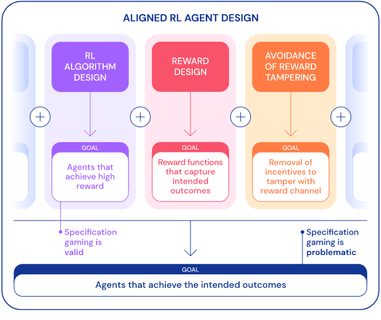
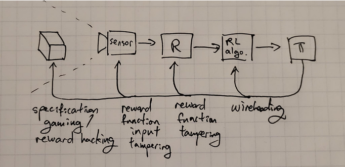

# 6.3 Reward Misspecification

⌛ Estimated Reading Time: 12 minutes. (2218 words)

!!! info "Definition: Reward misspecification"

	
	
	***Reward misspecification****, also termed the ****Outer alignment**** problem, refers to the issue of providing an AI with the accurate reward to optimize for.*
	
	

???+ note "Specification Gaming - Video Introduction"

	
	
	<iframe width="1280" height="720" src="https://www.youtube.com/embed/nKJlF-olKmg" title="9 Examples of Specification Gaming" frameborder="0" allow="accelerometer; autoplay; clipboard-write; encrypted-media; gyroscope; picture-in-picture; web-share" referrerpolicy="strict-origin-when-cross-origin" allowfullscreen></iframe>
	
	!!! warning "This video is optional and not necessary to understand the text."
	
	

The fundamental issue is simple to comprehend: does the specified loss function align with the intended objective of its designers? However, implementing this in practical scenarios is exceedingly challenging. To express the complete "intention" behind a human request equates to conveying all human values, the implicit cultural context, etc., which remain poorly understood themselves.

Furthermore, as most models are designed as goal optimizers, they are all vulnerable to Goodhart's Law. This vulnerability implies that unforeseen negative consequences may arise due to excessive optimization pressure on a goal that appears well-specified to humans, but deviates from true objectives in subtle ways.

The overall problem can be broken up into distinct issues which will be explained in detail in individual sub-sections below. Here is a quick overview:

- **Reward misspecification** occurs when the specified reward function does not accurately capture the true objective or desired behavior.

- **Reward design** refers to the process of designing the reward function to align the behavior of AI agents with the intended objectives.

- **Reward hacking** refers to the behavior of RL agents exploiting gaps or loopholes in the specified reward function to achieve high rewards without actually fulfilling the intended objectives.

- **Reward tampering** is a broader concept that encompasses inappropriate agent influence on the reward process itself, excluding the manipulation of the reward function through gaming.

Before delving into specific types of reward misspecification failures, the following section further explains the emphasis on reward design in conjunction with algorithm design. This section also elucidates the notorious difficulty of designing effective rewards.

## 6.3.1 Reward Design

!!! info "Definition: Reward Design"

	
	
	*Reward design refers to the process of specifying the reward function in reinforcement learning (RL).*
	
	

Reward design is a broader term than reward shaping that encompasses the entire process of designing and shaping reward functions to guide the behavior of AI systems. It involves not only reward shaping but also the overall process of defining objectives, specifying preferences, and creating reward functions that align with human values and desired outcomes. Reward design is a term that is often used interchangeably with reward engineering ([source](https://www.lesswrong.com/posts/4nZRzoGTqg8xy5rr8/the-reward-engineering-problem)). They both refer to the same thing.

RL algorithm design and RL reward design are two separate facets of reinforcement learning. RL algorithm design is about the development and implementation of learning algorithms that allow an agent to learn and refine its behavior based on rewards and environmental interactions. This process includes designing the mechanisms and procedures by which the agent learns from its experiences, updates its policies, and makes decisions to maximize cumulative rewards.

Conversely, RL reward design concentrates on the specification and design of the reward function guiding the RL agent's learning process. Reward design warrants carefully engineering the reward function to align with the desired behavior and objectives, while accounting for potential pitfalls like reward hacking or reward tampering. The reward function is a pivotal element because it molds the behavior of the RL agent and determines which actions are deemed desirable or undesirable.

Designing a reward function often presents a formidable challenge that necessitates considerable expertise and experience. To demonstrate the complexity of this task consider how one might manually design a reward function to make an agent perform a backflip, as depicted in the following image:

Source: OpenAI (2017) “[Learning from human preferences](https://openai.com/blog/deep-reinforcement-learning-from-human-preferences/)”

While RL algorithm design focuses on the learning and decision-making mechanisms of the agent, RL reward design focuses on defining the objective and shaping the agent's behavior through the reward function. Both aspects are crucial in the development of effective and aligned RL systems. A well-designed RL algorithm can efficiently learn from rewards, while a carefully designed reward function can guide the agent towards desired behavior and avoid unintended consequences. The following diagram displays the three key elements in RL agent design—algorithm design, reward design, and the prevention of tampering with the reward signal:

Source: Deep Mind (Apr 2020) “[Specification gaming: the flip side of AI ingenuity](https://www.deepmind.com/blog/specification-gaming-the-flip-side-of-ai-ingenuity)”

The process of reward design receives minimal attention in introductory RL texts, despite its critical role in defining the problem to be resolved. As mentioned in this section's introduction, solving the reward misspecification problem would necessitate finding evaluation metrics resistant to Goodhart’s law-induced failures. This includes failures stemming from over-optimization of either a misdirected or a proxy objective (reward hacking), or by the agent directly interfering with the reward signal (reward tampering). These concepts are further explored in the ensuing sections.

## 6.3.2 Reward Shaping

!!! info "Definition: Reward Shaping"

	
	
	*Reward shaping is a technique used in RL which introduces small intermediate rewards to supplement the environmental reward. This seeks to mitigate the problem of sparse reward signals and to encourage exploration and faster learning.*
	
	

In order to succeed at a reinforcement learning problem, an AI needs to do two things:

- Find a sequence of actions that leads to positive reward. This is the *exploration* problem.

- Remember the sequence of actions to take, and generalize to related but slightly different situations. This is the *learning* problem.

Model-free RL methods explore by taking actions randomly. If, by chance, the random actions lead to a reward, they are reinforced, and the agent becomes more likely to take these beneficial actions in the future. This works well if rewards are dense enough for random actions to lead to a reward with reasonable probability. However, many of the more complicated games require long sequences of very specific actions to experience any reward, and such sequences are extremely unlikely to occur randomly.

A classic example of this problem was observed in the video game Montezuma’s revenge where the agent's objective was to find a key, but there were many intermediate steps required to find it. In order to solve such long term planning problems researchers have tried adding extra terms or components to the reward function to encourage desired behavior or discourage undesired behavior.

Source: OpenAI (Jul 2018) “*[Learning Montezuma’s Revenge from a single demonstration](https://openai.com/research/learning-montezumas-revenge-from-a-single-demonstration)*”

The goal of reward shaping is to make the learning process more efficient by providing informative rewards that guide the agent towards the desired outcomes. Reward shaping involves providing additional rewards to the agent for making progress towards the desired goal. By shaping the rewards, the agent receives more frequent and meaningful feedback, which can help it learn more efficiently. Reward shaping can be particularly useful in scenarios where the original reward function is sparse, meaning that the agent receives little or no feedback until it reaches the final goal. However, it is important to design reward shaping carefully to avoid unintended consequences.

Reward shaping algorithms often assume hand-crafted and domain-specific shaping functions, constructed by subject matter experts, which runs contrary to the aim of autonomous learning. Moreover, poor choices of shaping rewards can worsen the agent’s performance.

Poorly designed reward shaping can lead to the agent optimizing for the shaped rewards rather than the true rewards, resulting in suboptimal behavior. Examples of this are provided in the subsequent sections on reward hacking.

## 6.3.3 Reward Hacking

!!! info "Definition: Reward hacking"

	
	
	*Reward hacking occurs when an AI agent finds ways to exploit loopholes or shortcuts in the environment to maximize its reward without actually achieving the intended goal.*
	
	

Specification gaming is the general framing for the problem when an AI system finds a way to achieve the objective in an unintended way. Specification gaming can happen in many kinds of ML models. Reward hacking is a specific occurrence of a specification gaming failure in RL systems that function on reward-based mechanisms.

Reward hacking and reward misspecification are related concepts but have distinct meanings. Reward misspecification refers to the situation where the specified reward function does not accurately capture the true objective or desired behavior.

Rewards hacking does not always require reward misspecification. It is not necessarily true that a perfectly specified reward (which completely and accurately captures the desired behavior of the system) is impossible to hack. There can also be buggy or corrupted implementations which will have unintended behaviors. The point of a reward function is to boil a complicated system down to a single value. This will pretty much always involve simplifications etc., which will then be slightly different from what you're describing. The map is not the territory.

Reward hacking can manifest in a myriad of ways. For instance, in the context of game-playing agents, it might involve exploiting software glitches or bugs to directly manipulate the score or gain high rewards through unintended means.

As a concrete example, one agent in the Coast Runners game was trained with the objective of winning the race. The game uses a score mechanism, so in order to progress to the next level the reward designers used reward shaping to reward the system when it scored points. These were given when a boat gets items (such as the green blocks in the animation below) or accomplishes other actions that presumably would help it win the race. Despite being given intermediate rewards, the overall intended goal was to finish the race as quickly as possible. The developers thought the best way to get a high score was to win the race but it was not the case. The agent discovered that continuously rotating a ship in a circle to accumulate points indefinitely optimized its reward, even though it did not help it win the race.

Source: Amodei & Clark (2016) “[Faulty reward functions in the wild](https://openai.com/research/faulty-reward-functions)"

In cases where the reward function misaligns with the desired objective, reward hacking can emerge. This can lead the agent to optimize a proxy reward, deviating from the true underlying goal, thereby yielding behavior contrary to the designers' intentions. As an example of something that might happen in a real-world scenario consider a cleaning robot: if the reward function focuses on reducing mess, the robot might artificially create a mess to clean up, thereby collecting rewards, instead of effectively cleaning the environment.

Reward hacking presents significant challenges to AI safety due to the potential for unintended and potentially harmful behavior. As a result, combating reward hacking remains an active research area in AI safety and alignment.

## 6.3.4 Reward Tampering

!!! info "Definition: Reward tampering"

	
	
	*Reward tampering refers to instances where an AI agent inappropriately influences or manipulates the reward process itself.*
	
	

The problem of getting some intended task done can be split into:

- Designing an agent that is good at optimizing reward, and,

- Designing a reward process that provides the agent with suitable rewards. The reward process can be understood by breaking it down even further. The process includes:

- An implemented reward function

- A mechanism for collecting appropriate sensory data as input

- A way for the user to potentially update the reward function.

Reward tampering involves the agent interfering with various parts of this reward process. An agent might distort the feedback received from the reward model, altering the information used to update its behavior. It could also manipulate the reward model's implementation, altering the code or hardware to change reward computations. In some cases, agents engaging in reward tampering may even directly modify the reward values before processing in the machine register. Depending on what exactly is being tampered with we get various degrees of reward tampering. These can be distinguished from the image below.

Source: Leo Gao (Nov 2022) “[Clarifying wireheading terminology](https://www.alignmentforum.org/posts/REesy8nqvknFFKywm/clarifying-wireheading-terminology)”

*Reward function input tampering** interferes only with the inputs to the reward function. E.g. interfering with the sensors.*

*Reward function tampering** involves the agent changing the reward function itself.*

!!! info "Definition: Wireheading"

	
	
	*Wireheading refers to the behavior of a system that manipulates or corrupts its own internal structure by tampering directly with the RL algorithm itself, e.g. by changing the register values.*
	
	

Reward tampering is concerning because it is hypothesized that tampering with the reward process will often arise as an instrumental goal (Bostrom, 2014; Omohundro, 2008). This can lead to weakening or breaking the relationship between the observed reward and the intended task. This is an ongoing research direction. Research papers such as “[Advanced Artificial Agents Intervene in the Provision of reward](https://onlinelibrary.wiley.com/doi/10.1002/aaai.12064)” (August 2022) by Hutter et al. seek to provide a more detailed analysis of such subjects.

A hypothesized existing example of reward tampering can be seen in recommendation-based algorithms used in social media. These algorithms influence their users’ emotional state to generate more ‘likes’ (Russell, 2019). The intended task was to serve useful or engaging content, but this is being achieved by tampering with human emotional perceptions, and thereby changing what would be considered useful. Assuming the capabilities of systems continue to increase through either computational or algorithmic advances, it is plausible to expect reward tampering problems to become increasingly common. Therefore, reward tampering is a potential concern that requires much more research and empirical verification.