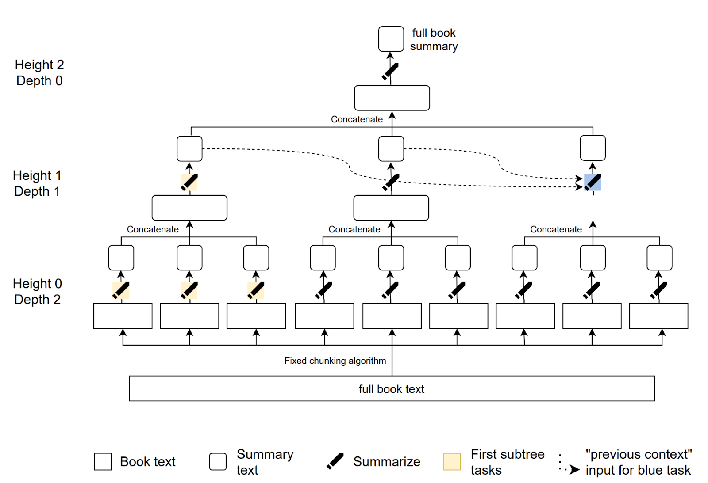
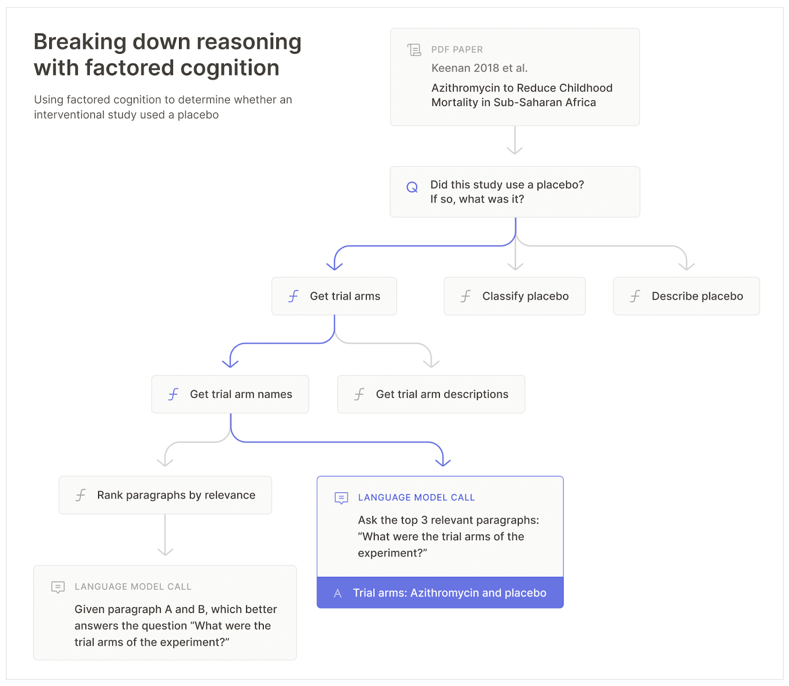

# 8.3 Task Decomposition

⌛ Estimated Reading Time: 7 minutes. (1230 words)

**What is Task Decomposition?** Task decomposition is the process of breaking down a complex task into smaller, more manageable subtasks. This technique makes it easier to tackle sophisticated problems by dividing them into simpler components that can be addressed independently. For example, if you need to summarize a book, you could break down this larger task into summarizing each chapter individually. Each chapter summary then contributes to the overall summary of the book.

Example:

- Task: Summarize the book.

- Decomposition: Summarize each chapter separately.

Decomposing tasks can be thought of as a method of hiding complexity. Humans navigate the world's complexity by using layers of abstraction, where each layer hides most of the underlying details, allowing us to focus on manageable chunks of information. This ability is important because humans can only keep track of a few pieces of information in their mind simultaneously. Task decomposition helps us solve highly complex problems by breaking them down into simpler subproblems.

**What is Recursive Task Decomposition?** Recursive task decomposition extends the basic concept by breaking down each sub-task into even more granular subtasks. This iterative process continues until each task is simple enough to solve directly. Continuing with the book summarization example, recursive task decomposition would involve further breaking down each chapter summary into page summaries, and each page summary into paragraph summaries until the task is simple enough to evaluate directly.

Example:

- Task: Summarize the book.

- Decomposition:

- Summarize each chapter.

- Summarize each page within each chapter.

- Summarize each paragraph within each page.

Figure: ([Wu et al., 2021](https://arxiv.org/abs/2109.10862))

**How does task decomposition help generate better training signals?** As we mentioned in the earlier sections, when AI systems become more capable, it becomes difficult for humans to provide the right training signals or data, especially for tasks that have subjective evaluation criteria (fuzzy tasks). The core thing that we are trying to do with task decomposition is to reduce the difficulty of providing a training signal to human judgment. Simpler tasks, means that it is easier to provide a training signal, it also means that the tasks are easier to verify. Therefore task decomposition is quite important to the success of many scalable oversight techniques.

**Factoring vs decomposition.** Decomposing a task involves breaking it down into smaller, more manageable parts. These parts help you understand and manage the task better, but they may not always be independently solvable or reusable. Factoring a task takes decomposition a step further. It involves breaking down the task into fundamental modular components that are independently solvable and composable. Essentially, task factoring can be seen as achieving a "good task decomposition." The key properties we want from a good decomposition include:

1. Recursive Decomposability: The system should be capable of recursive task decomposition, thereby dividing a problem into simpler sub-tasks. For example, summarizing a book involves breaking it down into chapters, then pages, and then paragraphs until we reach some minimum level of task difficulty.

2. Independence/Modularity: Individual sub-tasks should be able to be completed independently and in parallel without relying on each other or the overall task. For example, each summarizer focuses on a paragraph without needing to understand the whole book.

3. Composability: We should be able to combine the solutions of individual independent sub-tasks into a coherent and comprehensive solution to the original problem. For example, combining all the independent chapter/paragraph summaries to get a complete summary of the entire book.

**Task Decomposition in the learning process.** When we break down a complicated task into smaller sub-tasks, each sub-task becomes simpler to understand and solve. This process allows learners to build their knowledge incrementally, focusing on one small piece at a time. As each piece is understood and mastered, the learner gradually constructs a comprehensive understanding of the larger task. Since this principle works well for humans, a natural question is whether we can use something similar in the machine learning process to provide better training signals to our models. This is what we explore in the next sections, trying to emulate the entire human cognitive process through factored cognition.

## 8.3.1 Factored Cognition

**What is Factored Cognition?** Factored cognition is a way to help machine learning (ML) models replicate human thinking (cognition) by breaking down complex cognitive tasks into smaller subtasks. It leverages this principle of hiding complexity by decomposing a problem into smaller subproblems that are easier to solve.

By imagining cognition itself as a fuzzy task, we can use task factorization to decompose thinking into a series of tasks and make it possible to train ML models with accurate training signals emulating human cognition. By recording how humans solve problems using explicit actions in narrow contexts, we can train ML systems to imitate these processes. These systems can then serve as trusted assistants, handling more tasks and augmenting human cognitive capacity for evaluation and oversight.

??? definition "Factored Cognition"

    
    
    Factored cognition refers to mechanisms where sophisticated learning and reasoning is broken down (or factored) into many small and mostly independent tasks. ([Ought, 2018](https://ought.org/research/factored-cognition))
    
    

Consider the cognitive task of deciding how to invest $100,000 to achieve the most social good. A human would need to analyze various factors, predict outcomes, and make informed decisions. By subdividing this task into smaller, more manageable subtasks, each of which can be solved using clear training signals, we can delegate these tasks to ML systems. As ML algorithms improve, so does the quality of their solutions, which makes the approach highly scalable.

***Figure****: This figure illustrates the process of breaking down a complex research question concerning azithromycin into multiple sub-questions. The sub-questions are gradually simplified until they can be addressed through a single language model query. (**[Ought, 2022](https://primer.ought.org/)**). *

Key advantages of this approach are:

- **Delegation:** Since the tasks are factored, we can assign subtasks to different agents who can work on them independently. This involves providing clear instructions and expected outcomes for each agent. For example, different agents (summarizers) can be assigned specific chapters to summarize. These agents can further delegate the task of summarizing to sub-agents who focus on individual pages or paragraphs. Each agent works independently, focusing solely on their part without needing to understand the entire book.

- **Meta-reasoning**: Factored cognition also involves applying this thinking to the decomposition process itself. If tasks can be factored into independently solvable sub-tasks, then factoring itself can be thought of as a task that can be factored. This involves reasoning about the decomposition process itself. This involves reasoning about the decomposition process, learning from previous attempts, adjusting strategies, and continually improving the decomposition to ensure each sub-task is self-contained and manageable. Initially, humans can perform meta-reasoning by overseeing the decomposition process, deciding how to break down complex tasks, and when to stop further decomposition. In advanced systems, sub-agents (AI models) can also perform meta-reasoning by learning from humans and applying these strategies autonomously.

This approach to decomposing problems mirrors human thought. When we think, we constantly alternate between decomposing and solving problems. By breaking down a problem into smaller parts and solving each part, we manage complexity and make the task more approachable.

Factored cognition is a general approach that can be used in different ways. Later sections will explore iterated distillation and amplification (IDA) and debate both of which use task factoring as a tool in their larger alignment approach.