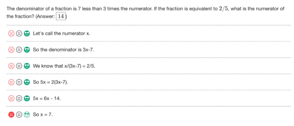
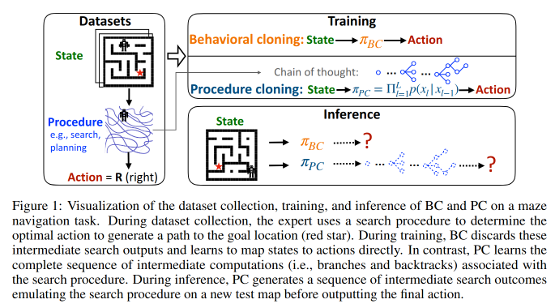

# 8.4 Process Oversight

⌛ Estimated Reading Time: 10 minutes. (1995 words)

Learning a new task can be approached via trial and error, known as outcome-oriented learning, where the agent's strategy is determined entirely by the desired outcome.

Machine learning over the last decades has been showing a trend toward outcome-based systems. Which is to say that models are trained end-to-end and only the final output of the AI is what we provide a training signal for. This is called outcome-based oversight, but there is an alternative approach called process-based oversight.

**What is process-based oversight?** The outcome based approach only oversees the final result of a model's process. It is primarily concerned with whether the final answer is correct, not how the answer was derived. As an example, a model tasked with solving a math problem would only be evaluated on whether it produced the correct solution, regardless of the steps it took to get there. Process-based oversight on the other hand relies on human-understandable task decompositions with direct supervision of intermediate steps. This approach supervises the reasoning process itself, including all intermediate steps. It ensures that each step leading to the final result is logical and correct. For example, in solving a math problem, every calculation and logical step taken by the model would be evaluated for correctness.

**Process supervision makes credit assignment easier**. The credit assignment problem involves determining which specific actions or sequences of events were responsible for producing a particular outcome or reward. Think of a chess game where a player makes seemingly correct moves but ultimately loses. The credit assignment problem here involves identifying which specific moves led to the loss. Outcome based supervision would just say you won or you lost which makes it very difficult to determine which sequence of moves were actually very good even though you lost the game. Process supervision makes this easier by providing more precise feedback than outcome supervision.  Process supervision is similar to reward shaping, where small intermediate 'fake' rewards help the learning agent converge more quickly. This approach provides feedback on each intermediate step or trains models to imitate the human decision-making process.

**Figure**: Example of process oversight feedback. ([Lightman et. al, 2023](https://arxiv.org/abs/2305.20050)) 

**Safety implications of process oversight**. Outcome based oversight might still result in specification gaming. Process based supervision on the other hand theoretically mitigates this problem to a large extent by being more likely to produce interpretable reasoning. It encourages models to follow a process endorsed by humans and directly rewards an aligned sequence of smaller steps rather than relying on outcomes as a proxy for aligned behavior. ([Lightman et. al, 2023](https://arxiv.org/abs/2305.20050)) 

Generally, for fuzzy tasks process based supervision might be a more appropriate method to pursue. ([Uesato et. al, 2022](https://arxiv.org/abs/2211.14275)) For example, when we need to verify the chain of mathematical reasoning, research so far has found that process supervision significantly outperforms outcome supervision for training models to solve problems for math based tasks. ([Lightman et. al, 2023](https://arxiv.org/abs/2305.20050)) Process based supervision might similarly result in more aligned outcomes for other complex chains of reasoning such as long term planning or decision making.

One problem is that due to the higher feedback requirement at every step, process based methods require a greater degree of human expertise. As a concrete example, if we were training a model to generate new CPU designs, we can simply structure outcome-based feedback based on power-consumption, chip area, etc. These are easier to evaluate and give feedback on, and can be used to optimize the overall chip layouts. On the other hand, a process-based approach would require detailed expert knowledge on designing chip layouts. ([Uesato et. al, 2022](https://arxiv.org/abs/2211.14275)) So even though process based oversight methods might potentially lead to both higher capabilities and alignment outcomes, they rely on amplifying human overseer abilities. We will explore how to increase the capability of human overseers in the section on amplification and debate.

The next couple of sections explore two methods of process based supervision - procedural cloning and externalized reasoning oversight.

## 8.4.1 Externalized Reasoning Oversight (ERO)

Externalized reasoning oversight (ERO), sometimes referred to as verbalized reasoning, revolves around the idea of encouraging language models (LLMs) to "think out loud." This approach aims to have models reveal their reasoning steps in natural language before they output an action or a decision. By decomposing complex reasoning into smaller steps and making it transparent, we can provide detailed training signals and oversight. This makes guiding the reasoning process of our models easier, and might potentially be more effective than only evaluating the final outputs or actions. ([Lanham 2022](https://www.alignmentforum.org/posts/FRRb6Gqem8k69ocbi/externalized-reasoning-oversight-a-research-direction-for)) This also can potentially serve as a complementary approach to the entire field of interpretability which can be thought of as “internalized reasoning oversight.”

Externalized reasoning can potentially prevent undesirable behaviors such as deception and power-seeking ([Lanham 2022](https://www.alignmentforum.org/posts/FRRb6Gqem8k69ocbi/externalized-reasoning-oversight-a-research-direction-for)), although this has yet to be empirically verified. The argument is that when a model's reasoning is visible, we can directly observe the logic it follows and identify any problematic thought patterns or chains of reasoning. This level of oversight is not possible when we only look at the final outputs of the model, as we miss the underlying reasoning that led to those outputs. To be able to rely on ERO, we need to make sure that the externalized reasoning is:

1. **Causally Responsible**: The reasoning should directly lead to the conclusion without any post-hoc rationalizations.

2. **Complete**: All necessary steps in the reasoning process should be present, with no critical steps omitted.

3. **Straightforward**: The reasoning should be clear and free from hidden messages or deceptive encoding (steganography).

**How is ERO related to task decomposition? **Chain-of-Thought (CoT) decomposition is the primary way that researchers currently approach externalized reasoning oversight.** **Task decomposition involves breaking down a complex task into simpler subtasks, each of which can be handled independently. Chain-of-thought decomposition is a technique within the broader framework of task decomposition, specifically focused on both enhancing and allowing externalized oversight of the reasoning processes in LLMs. ([Wei et. al; 2022](https://arxiv.org/abs/2201.11903)) For the rest of this section when we talk about externalized reasoning oversight we are referring to chain-of-thought reasoning.

**Does externalized reasoning reflect internal reasoning processes?** We have already seen that LLMs perform better at reasoning tasks when we use ERO (CoT prompting) ([Wei et. al; 2022](https://arxiv.org/abs/2201.11903)). The problem is that we don't know if this CoT reasoning reflects the actual internal thought process. Researchers use the term "faithfulness" to indicate if what LLMs say (the tokens they generate) is actually indicative of their internal reasoning. There are a couple of ways that a model might produce externalized reasoning via CoT which might not be indicative of internal reasoning:

- **Post-Hoc Reasoning**: This happens when a model generates an external reasoning chain that justifies an already determined conclusion rather than genuinely reflecting the thought process that led to that conclusion. This type of reasoning is unfaithful because it does not influence the model's final answer; instead, it rationalizes an outcome that has already been decided. To test for this, we can truncate the chain of thought before the final answer and assess whether the intermediate reasoning steps were necessary. If the final answer remains unchanged despite missing steps, it indicates post-hoc reasoning. Another method is to introduce deliberate mistakes into the chain of thought to see if they affect the final answer. ([Lanham et al.; 2023](https://arxiv.org/abs/2307.13702))

- **Steganography and Encoded Reasoning**: The model might encode relevant information in the tokens that it generates which are not indicative of its actual internal reasoning. Think of this like using subtle changes in punctuation, word choice, or phrasing to improve predictions. The model might use such techniques to externalize its reasoning, and using CoT, but in a way that is not increasing transparency for human overseers. So far, research has found that despite paraphrasing chains of thought in different ways, the models’ performance on reasoning tasks remains the same. This seems to suggest that current generation models are actually using the logical structure of the reasoning rather than in hidden encoded information. ([Lanham et al.; 2023](https://arxiv.org/abs/2307.13702)) It is unclear if this will remain true for all future models.

Based on current empirical findings it seems that whether the internal reasoning matches the external reasoning is task dependent and varies. ([Lanham et al.; 2023](https://arxiv.org/abs/2307.13702))([Turpin et. al; 2023](https://arxiv.org/abs/2305.04388)) We will explore eliciting the internal reasoning process of LLMs in adversarial settings deeper  in the section on AI Safety via Debate.

**ERO might only be reliable for smaller models. **One problem with externalized reasoning approaches is that more capable models often show less reliance on external reasoning and therefore more unfaithfulness. ([Lanham et al.; 2023](https://arxiv.org/abs/2307.13702)) This suggests that smaller models might be better suited for tasks where external reasoning is crucial for ensuring model safety. Larger models often show less reliance on external reasoning, leading to more unfaithful reasoning. As we continue to scale, larger models may predict more complex answers confidently without relying on explicit externalized reasoning, increasing the discrepancy between externalized reasoning and internal processes.

**Oversight misses the consequences of what the model does not think**.  Even if ERO successfully makes the AI’s thought processes transparent, it only addresses risks related to the AI engaging in reasoning we wouldn't approve of, such as power-seeking or self-preservation. It does not address the broader risk of the AI causing harm as a side effect of its primary activities. As an example, think about how humans drive species to extinction. In most cases, it's not because humans actively strategize to kill those species. Instead, species often go extinct because humans change their environment drastically—through activities like deforestation, construction, or pollution—without thinking about the survival of the species. Applying this analogy to AI, the risk posed by future AI models might not come from it actively trying to kill humans. Instead, the risk arises from an AI model engaging in large-scale activities that unintentionally lead to risky side effects. If the model never explicitly considers the impact on humans, there's no faulty reasoning process for overseers to give negative feedback to. The overseer would have to independently figure out the potential harmful consequences of the AI’s complex long term plans. This requires the overseer to predict the outcomes of these plans, which is extremely challenging given their complexity. ([Wentworth, 2022](https://www.alignmentforum.org/posts/98c5WMDb3iKdzD4tM/oversight-misses-100-of-thoughts-the-ai-does-not-think))

## 8.4.2 Procedural Cloning (PC)

Traditional imitation learning approaches like behavioral cloning, focus on learning a direct mapping from states to actions based on observed expert demonstrations. Like we discussed earlier in this section, outcome based approaches, while effective in some scenarios, can be overly simplistic and fail to capture the rich step-by-step decision-making processes that experts use. This can lead to models that perform well in seen environments but struggle to generalize to new, unseen scenarios.

**Procedural cloning** addresses this limitation by extending behavioral cloning using CoT. It  tries to get the model to clone not just the final result (the behavior) but also the entire process that the expert follows in exhibiting that behavior by incorporating intermediate steps of expert behavior during training. ([Yang et. al; 2022](https://arxiv.org/abs/2205.10816))

Procedural cloning works by first collecting expert demonstrations that include not only the state-action pairs but also the intermediate steps or computations leading to those actions. For instance, in a maze navigation task, the expert might use a search algorithm to find the optimal path, and the intermediate steps of this search process are recorded alongside the final action. During training, the model learns to predict the sequence of intermediate steps leading to the final action using a sequential model, such as a transformer, capable of handling the autoregressive nature of the task. The model maximizes the likelihood of the joint distribution of procedure observations and expert actions. During inference, the model generates a sequence of intermediate steps based on the input state mimicking the expert's procedure before outputting the final action. This method allows the model to replicate the expert's decision-making process more accurately, even in new and unseen environments.

**Figure**: ([Yang et. al; 2022](https://arxiv.org/abs/2205.10816))