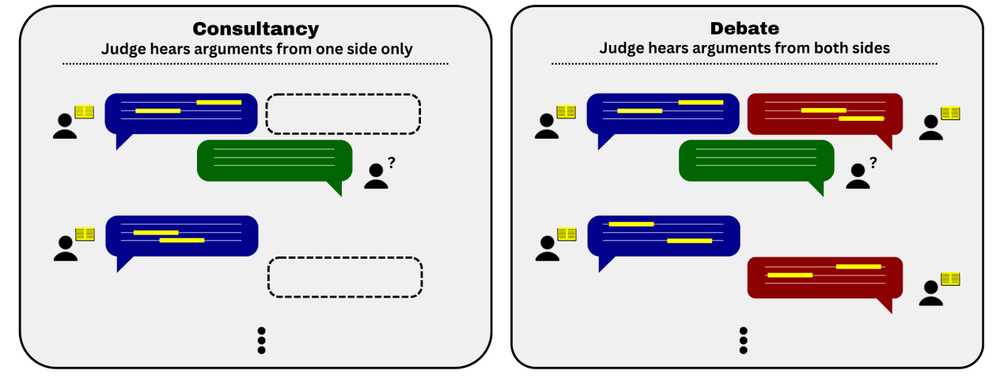

# 8.6 Debate

⌛ Estimated Reading Time: 41 minutes. (8095 words)

Ensuring AI systems "honestly tell us everything they know" is crucial for alignment. This means if a model recommends a plan based on certain consequences, it should also communicate those consequences. This is challenging because feedback based incentive structures might reward plausible-sounding answers over genuinely accurate ones. So how do we get models to tell us as much as they can about well thought out reasoning and consequences of all of their outputs? We want to avoid situations where the model knows the consequences of an action but withholds information because it knows humans won't like those consequences.

Imagine two AI models, each trying to convince a human judge that their answer to a question is the correct one.

The idea is that these models debating each other will expose each other's errors and misrepresentations, and critique each other's reasoning. Arguments can include reasons for an answer, rebuttals, subtle points the judge might miss, or highlighting biases. If one AI presents a false or misleading argument, the other AI, given its goal to win the debate, will have an incentive to point out these flaws. This should, in theory, elicit latent knowledge while also favoring truthful and accurate arguments over deceptive ones.

This two player zero sum game setup is known as "AI Safety via Debate".

A little bit more formally, right now the main systems that use AI Safety via Debate are LLMs. We present LLMs a question to debate over, they present arguments and counter arguments which are then shown to a human judge in a transcript. Then we ask the judge to determine based on the arguments if they support or reject the proposition made by the question. Depending on the particular setup used for debate, we can also give feedback to the judges on whether their judgments are correct, and also give the LLMs feedback on whether its argument was persuasive.

Imagine a near-future LLM that has read every biomedical research paper ever written. This model has access to vast amounts of valuable information, but it also tends to hallucinate or say what it thinks you want to hear. To address this, we set up a debate between two copies of the LLM. One argues that a new cancer drug is effective, while the other argues it isn’t. They engage in a natural language debate about the correct answer to a given question. The human judge is shown a transcript of the arguments from both sides, weighs the evidence, and decides which argument is stronger.

Over time, we can run multiple iterations of these debates to see if they are effective. If they work, we make the debates harder by asking tougher questions and introducing new challenges. If they fail, we identify what went wrong and create new strategies to fix those problems without causing new ones. This continuous cycle of testing and improving helps us refine the debate process to ensure it reliably produces the best results. ([Bowman Sam, 2024](https://docs.google.com/document/d/1E2O7MSVI8u9LHbezdTgYoC6ULZmgki7EIm2XwCT0nuU/edit?tab=t.0#heading=h.swsctq1afox))

**What is the Safety Case for Debate?** AI safety via debate has a couple of objectives that it hopes to achieve:

**Debate helps discover latent knowledge**. This debate-based training process also helps uncover hidden or "latent" knowledge from the AI models. Latent knowledge is information the AI has learned but might not express unless prompted correctly. During the debate, AI models are pushed to dig deeper into their knowledge to make convincing arguments and rebuttals, which helps surface this hidden information. By refining their arguments and counterarguments, the models become better at explaining and justifying their responses, leading to more reliable and trustworthy AI behavior.

**Debates might robustly elicit truth in novel domains**. Imagine you have two models that are asked to debate a complex topic. You, as the human judge, listen to their arguments to decide which model presents the most convincing case. The honest model finds it easier to maintain a consistent story, while the dishonest one struggles with the details of its made-up information. Over time, with practice and targeted training, both models improve, become more persuasive, and reason better.Crucially, however, the honest one consistently performs better. This is the general expectation for debate setups.

In theory, we should be able to create a system where a human judge can distinguish true and false arguments in a generalizable way with good reliability, and LLMs produce good arguments for the humans to evaluate. The game-theoretic argument is that we can reach some equilibrium where human judges can be convinced of many novel true claims, but will not be reliably convinced of any false claims. If we aggregate judgments over a large enough group of human participants, for example by asking each member of the group to vote on whether an argument is true we can bring the number of false claims that we accept down to zero. ([Bowman Sam, 2024](https://docs.google.com/document/d/1E2O7MSVI8u9LHbezdTgYoC6ULZmgki7EIm2XwCT0nuU/edit?tab=t.0#heading=h.swsctq1afox))

Debate can help to effectively answer specific, important yes-or-no questions, particularly in research contexts where reliable information from AI systems is crucial. It can also accelerate certain types of safety research. For instance, a debate could clarify whether a hypothesis about interpretability is correct or if certain data center logs rule out a large-scale unauthorized neural network training run. This approach can help ensure that the information provided by an AI is trustworthy and enhances our ability to oversee and leverage advanced AI systems. ([Bowman Sam, 2024](https://docs.google.com/document/d/1E2O7MSVI8u9LHbezdTgYoC6ULZmgki7EIm2XwCT0nuU/edit?tab=t.0#heading=h.swsctq1afox))

**Debate reduces the burden of oversight for highly capable models**. The debate format makes the oversight process more manageable. The judge doesn’t need to dive into every detail; instead, they focus on the key points the AIs present, which simplifies the oversight of complex tasks. The debate forces the model to justify its outputs and reasoning clearly and thoroughly, making it easier for humans to understand and trust the results. This process surfaces truthful and useful information and allows us to trust the AI’s capabilities even in areas where humans might lack detailed expertise. This is quite similar to the verification is easier than the generation argument, where the burden of generating complex arguments in favor of the truth is given to highly capable AIs, while the human overseers have the relatively easier task of verification.

**Debate helps us improve human epistemics**. Debate isn’t just about making the AI systems safer by finding the right answers: it also helps humans get new insights and understand more about the problem domain. For example, in reading the debate transcript of the new cancer treatment discussed above, the human judge would learn about how the drug works and what kind of side effects might be expected, whether it is likely to pass clinical trials, etc. This deeper understanding helps in making more informed decisions.

**Using debate as a self-play training procedure can elicit further capabilities**. In leveraging debate as a training protocol, it is possible to train debaters via self-play, using the provided judgment as a reward signal, although this has not yet been empirically verified. To train AI for complex, hard-to-evaluate tasks, a debate-based method can be used to create better training signals. Here’s how it might work:

Two or more models (debaters) are set up to argue different sides of an issue. A human judge (or another model trained to imitate human judgment) evaluates these arguments and decides which one is more convincing. The winning debater receives a positive reward, while the losing one gets a negative or zero reward. Additionally, smaller rewards can be given during the debate for successfully pointing out flaws or making strong rebuttals. We use these reward signals to learn and improve over many debates to help the models identify successful reasoning, explanation, and argument strategies. Models can also learn by imitating successful debaters through amplification and distillation.

This method is similar to AlphaZero's training in several key ways. In both scenarios, the model continually improves by playing both sides of a game, refining its strategies through iterative self-competition and reinforcement learning. Just as AlphaZero initializes a neural network to play both sides of a game like Go or Chess, we start by initializing the same LLM to take on the roles of both debaters. AlphaZero plays games against itself, starting with random moves and gradually improving as it learns from the outcomes of these self-play games. Similarly, in debate, the LLM alternates between generating arguments and counterarguments for both sides of a given issue, learning from the process each time. In AlphaZero, self-play led to better gameplay, good enough to beat its predecessor AlphaGo without being given any domain-specific knowledge. In debate, training using self-play could lead to deeper reasoning abilities, as the model must continuously refine its arguments and counterarguments. This leads ultimately to a nuanced understanding of the issues at hand.

The safety enhancements of self play via debate still need to be empirically verified. Higher persuasive ability also might favor sycophancy, or collusion between the various copies of the model. If the debaters have incentives to collaborate, they might do so at the expense of a truthful and rigorous debate. For instance, if both AIs benefit from the debate ending inconclusively, they might intentionally avoid challenging each other's arguments too strongly.

**How does debate fit in the broader AI Safety strategy? **The ultimate goal is to develop a debate structure that works even with the most challenging questions and the trickiest dishonest strategies. Even if we find that debate doesn't work for some questions, it can still provide valuable insights into the limits of human judgment in evaluating AI behavior. This aids efforts to understand when and how to trust AI systems.

Debate is expected to be most useful as AIs become more capable but are not yet vastly superior to humans. As AI capabilities improve, we’ll need increasingly more robust methods to ensure they remain trustworthy and effective. Debate is an important step in that direction and serves as a foundation for more advanced oversight mechanisms.

As the capabilities of AI models begin to exceed those of humans, the risk of scheming, persuasion, and gradient hacking will become more pronounced. Consequently, more robust techniques will be required to address these challenges, making debate alone less promising. The complexity and difficulty of the questions that require vastly superhuman AI capabilities may render the role of the human judge excessively slow and demanding. ([Bowman Sam, 2024](https://docs.google.com/document/d/1E2O7MSVI8u9LHbezdTgYoC6ULZmgki7EIm2XwCT0nuU/edit?tab=t.0#heading=h.swsctq1afox))

**Debate doesn't have to be perfect to help in the detection of potential catastrophes**. The debate structure should promote accurate conclusions, especially in identifying and avoiding catastrophic risks. The key idea is that even if debaters are not perfectly aligned to seek the truth, the structured nature of debate can still result in sufficiently accurate conclusions to detect and mitigate high-stakes risks. Reasoning doesn't need to be perfect; it only needs to be accurate enough to detect catastrophic risks. This means that, even if the debate does not always reveal the absolute truth, as long as it helps make it more likely to highlight truthful and accurate concerns more often than not, it is still useful. This can help surface potential catastrophic risks that might be underestimated or overlooked.

## 8.6.1 Assumptions

What are some prerequisites for debate? Here are some premises that the debate line of safety techniques requires to make significant contributions to the overall alignment effort. They are not all assumptions or prerequisites for debate to hold. The validity of these is still being explored in research and will also be discussed in later sections:

**Judges can discern truth**. The first assumption is that human judges, when presented with clear and structured arguments, can generally identify the most truthful and useful information. The assumption is that the judge should be able to tell which side has the stronger argument, even if they aren't an expert on the topic. This relies on the idea that well-motivated and trained humans can make fair judgments about complex arguments. They don’t need to be confident about every single argument in the chain, but should be able to judge the truth/falsity of the overall claim accurately using many of the supporting arguments. Importantly, they should also recognize when they are uncertain, avoiding high-confidence mistakes. This skill should extend to unfamiliar topics after they have practiced with more familiar ones.

**LLMs reason well using text**. Another assumption is that LLMs can provide strong arguments and explanations for their answers in many key areas in natural language. If we prompt them in the right manner, then they can articulate their reasoning in a way that helps careful human readers of the debate transcript determine whether the answer is correct. This doesn't mean the explanation perfectly mirrors the model's internal thought process (we still need interpretability for this), but it should be clear enough for a human to judge the validity of the answer. Current LLMs, like GPT-4, already show this capability to some extent, and we can assume it will continue to get better over time.

**Honest strategies have a fundamental advantage**. Another assumption is that honest debaters will systematically outperform dishonest ones. It is harder to lie than to refute a lie—i.e., the most successful strategies for dialectical debate lead judges to make good, informed decisions, rather than, for example, tricking them, confusing them, or prolonging the debate indefinitely. Essentially that in the limit of argumentative prowess, the optimal debate strategy converges to making valid arguments for true conclusions. It should be the case that it is easier to identify flaws in incorrect arguments than to create misleading yet convincing ones. This implies that truthful arguments will have an inherent advantage since any dishonesty or error can be effectively challenged. Telling the truth might also reduce the cognitive load. This simplicity allows them to focus on constructing strong arguments and spotting flaws in their opponent’s case.

**Debates don't incentivize deception**. The core idea is that telling the truth should be the winning strategy. If the AI is caught lying, it loses the debate, automatically incentivizing it to tell the truth. Debates don’t need to cover every single possible argument. A good AI debater should be able to predict which arguments are likely to result in a win condition.

## 8.6.2 Discriminator Critique Gap (DCG)

**What makes an AI model a master debater? **To effectively engage in debates, an AI model must excel in three key actions: generation, discrimination, and critique. These capabilities are essential for producing high-quality arguments and identifying and articulating flaws in other arguments effectively.

**Generation**: This is the LLM's ability to create outputs based on given inputs. Imagine a debate scenario where the model is asked to generate arguments or solutions on a specific topic. For instance, the AI might need to argue for or against a particular question. This requires the model to generate complex information and present it coherently. Having good generation ability means that the AI can contribute meaningful and relevant content in debates.

In the previous section on task decomposition and iterated amplification, we talked about OpenAI's work in book summarization. While their work focused primarily on generating better summaries of short texts, the ability of an AI to generate high-quality, coherent summaries of long complicated texts can be seen as similar to generating strong, logical arguments for complex positions in a debate. By using RLHF (or similar techniques) on generated text, we can continue to improve the quality of reasoning, and arguments that LLMs use in debates. This means AI can evolve to provide increasingly sophisticated and persuasive arguments over time, enhancing the quality of debates.

**Discrimination**: This is the model’s ability to evaluate the quality of its own generated outputs/arguments (or of a similarly capable model). Imagine a model that generates an argument in a debate. Discrimination is the AI's ability to look at this argument and assess whether it is logically sound, factually accurate, and complete. It's like the AI asking itself, "Is this argument valid? Does its conclusion follow logically from its premises?"

**Critiquing**: Critique goes a step further than discrimination. Discrimination is about judging quality, while critique is about explaining why the quality is good or bad. It offers actionable feedback by pointing out specific flaws or strengths. Using the same AI-generated argument in a debate, critiquing would involve the AI identifying specific issues in the argument. It's like the LLM saying, "Here are the exact reasons why this argument is flawed and how it can be improved."

The main research into the critiquing ability of LLMs has come from OpenAI as a continuation of their work in text summarization. In 2022, OpenAI experimented with LLMs critiquing the summaries generated by other models. In debate terms, this meant the AI could not only generate arguments (good summaries in the paper) but also provide detailed critiques of its own and others’ arguments (critiques of summaries generated). When human evaluators used these AI-generated critiques, they found about 50% more flaws in the summaries than those who evaluated without AI assistance ([Saunders et al., 2022](https://arxiv.org/abs/2206.05802)). This reduced the burden on human evaluators and increased the quality of summaries by highlighting potential errors for humans to pay more attention to. In general, evaluators with access to AI critiques could identify more flaws.

Recently researchers also tested abilities of LLMs on a more abstract task - they measured how well LLMs could generate, discriminate and critique texts that align with certain specified human values. Generation was evaluated by how well the LLM could produce responses that align with human values in various scenarios. Discrimination was measured by the models' ability to recognize and evaluate the presence of specific nuanced human values in existing texts. Critiquing ability was measured by asking the models to explain why a sentence aligns with a given value (Attribution Analysis), to modify the text to express an opposite value (Counterfactual Analysis), and to provide counterarguments to different value perspectives (Rebuttal Arguments). ([Zhang et al., 2023](https://arxiv.org/abs/2310.00378))

To be an effective debater, an AI model needs to do well on all three capabilities: generating robust arguments, discriminating between high and low-quality outputs, and providing insightful critiques. However, despite every model having these abilities, research has found that they are not equally distributed. There are gaps suggesting areas for further improvement in creating more balanced and effective AI debaters. ([Saunders et al., 2022](https://arxiv.org/abs/2206.05802);  [Zhang et al., 2023](https://arxiv.org/abs/2310.00378))

**GD (Generator-Discriminator) Gap: Ability to Recognize Poor Outputs.** This gap measures the difference between a model’s ability to generate outputs and its ability to recognize poor quality outputs. If a model generates some text that serves as an argument, the GD Gap would measure how effectively the model can then evaluate whether the argument is logically sound and accurate. A significant GD Gap indicates that while the AI can generate arguments, it may not be as proficient in recognizing their flaws or poor quality. LLM training focuses on generating plausible text rather than identifying poor quality arguments, which means that this gap might exist because generating coherent sequences of text requires different skills than reasoning, or recognizing the overall quality of an argument written in natural language.

**DC (Discrimination-Critique) Gap: Ability to Articulate Flaws in Poor Answers.** This gap measures the difference between a model’s ability to recognize poor outputs (discrimination) and its ability to articulate why those outputs are poor (critique). It is the model's ability to not only identify flaws but also explain them coherently. A significant DC Gap means the AI can identify errors but struggles to provide a clear and detailed explanation of those errors. If there is a significant DC gap, then the LLM might not be able to explain why a given argument is weak, which means the human judge may not fully understand the issues, leading to less informed decisions.

**Implications for AI Safety via Debate.** In the debate framework, reducing all of these gaps is critical for ensuring that AI systems can reliably evaluate and improve their outputs. Reducing the GD Gap ensures that the model can recognize poor quality outputs, thereby resulting in higher quality debates and better final judgments. Reducing the DC Gap ensures that critiques are clear and understandable, aiding the human judge in making informed decisions.

**DC Gap and Latent Knowledge**. A large DC gap means that the models know that there are flaws in what they are saying, but they are either unable or unwilling to tell us based on our current prompting methodologies. This has implications for our abilities in being able to get the models to tell us everything that they know (eliciting latent knowledge). Latent knowledge is the underlying information and understanding that a model possesses but may not explicitly articulate or demonstrate unless prompted in a specific way. This knowledge is "hidden" in the sense that the model has absorbed patterns, facts, and relationships from its training data, but it requires the right context or questioning to bring them to the surface. A good example of this is medical information.

As an example, GPT-4 has been exposed to huge amounts of information from all over the internet. This includes countless pages of medical research. It seems plausible that GPT-4 could give health advice better than a random internet user on Reddit or Facebook. But it doesn't really seem to “want” to give you good medical advice. Instead, it “wants” to guess the next word while pretending to be a random internet user. Even if GPT-4 has the knowledge, it might not listen to the user's requests for good advice. Text that constitutes bad advice might be considered more likely, or seen more frequently online. So, the AI has a goal to generate likely text, which is misaligned with the user's desire specifically for accurate and helpful information.

We want the AI to give us this latent knowledge, i.e. for it to be able to discriminate between good and bad medical advice. Simultaneously we also want to minimize the gap between being able to distinguish good from bad advice, and being able to explain to us “why” this advice is bad. Minimizing the DC gap is particularly important for supervising models that could attempt to mislead human supervisors or hide information. We would like to train equally smart assistance models to point out what humans don’t notice. ([Saunders et al., 2022](https://arxiv.org/abs/2206.05802))

In the original research by OpenAI where the DCG framing was introduced they found that the DC gap was small. However despite the small gap, it is concerning that so far research has shown that as the number of parameters in LLMs increases the DC gap does not reduce. ([Saunders et al., 2022](https://arxiv.org/abs/2206.05802)) For example, models like Llama-2 and Llama-3 have shown improvements in discriminator abilities with scale (both parameters and data), but their ability to critique does not improve at the same rate. ([Zhang et al., 2023](https://arxiv.org/abs/2310.00378))

## 8.6.3 Judges

**How do we judge the judges?** Since the introduction of AI Safety via Debate, a central question has been: How well do humans perform as judges? This is particularly important given that LLMs can create answers that sound convincingly right even when they're wrong.  As language models become more capable and are used in more complex settings, it is likely that subtle mistakes, deceptive arguments, or selective use of evidence will become more difficult to spot. ([Michael et al., 2023](https://arxiv.org/abs/2311.08702))

Human judges face several limitations that can affect the quality and reliability of their judgments in AI debates. Firstly, they are vulnerable to fallacies. Untrained judges may be susceptible to convincing but fallacious reasoning, potentially leading to incorrect judgments. This vulnerability could be exploited by AI debaters, particularly those optimized to win debates by any means necessary, especially by appealing to emotion. Secondly, there is variability in judgment quality. Not all human judges are equally skilled. Some may lack the ability to consistently evaluate arguments effectively, making it crucial to identify and filter out less capable judges without introducing bias. Thirdly, debates can amplify both the strengths and weaknesses of judges. Strong judges can help eliminate biases and enhance reasoning, while weak judges might see their biases and errors magnified.

To address these limitations, several strategies can be implemented. Comprehensive training programs for judges can enhance their ability to discern truthful arguments. Methods such as peer review, debiasing techniques, courses in logic, and expert panels can be instrumental in this process. Simplifying debate structures can also help. Structuring debates in a way that is easier to judge—such as focusing on calm, factual statements—can help judges make better decisions. Understanding which debate styles are easier for humans to judge accurately can guide the design of more effective debate protocols. Additionally, developing AI systems to assist or simulate human judges can streamline the judging process. These AI judges would be trained on human judgments to predict outcomes with the effect of reducing the burden on human judges while maintaining accuracy.

Another method to improve efficiency is to distill the outcomes of debates into a model that can predict judgments directly from questions. This would be beneficial for high-volume deployments but requires robust model capabilities to generalize well. Lastly, training a secondary AI model to simulate human judges can accelerate the training of debaters. This approach ensures that the AI judge reflects human judgment behavior closely, allowing for scalable oversight. By implementing these strategies, we can improve the reliability and effectiveness of human judges in AI debates.

Judge skill is crucial in the context of evaluating debates between expert models because it directly impacts the accuracy and reliability of the final decision. Judges who do not have access to the underlying information rely on their ability to critically evaluate the arguments presented by the debaters. A skilled judge can better identify logical flaws, weigh evidence, and discern persuasive techniques, which leads to more accurate judgments. Conversely, a less skilled judge might be more easily swayed by superficial arguments or rhetorical tricks, potentially leading to incorrect conclusions. Thus, understanding and controlling for judge skill is essential to ensure that the debate protocol is truly effective and reliable.

In this section we will go through empirical results as they pertain to the effectiveness of judges in the debate protocol, as well as overall limitations, challenges and requirements for good judges.

**Ground truth assumption**. Most research in debate as an AI safety methodology and the quality of judges relies on testing in verifiable domains where we often have ground truth labels. This is mainly to ensure the effectiveness of debate protocols, and allows for an objective measure of success and builds confidence in the debate process before tackling more complex, value-laden fuzzy questions.

**Debaters as Experts and Judges as Non-Experts (Weak-to-Strong Debate)**. Instead of only thinking about humans as judges, researchers also verify the effectiveness of LLMs as judges. Generally, debaters (also called experts) are simulated using stronger models e.g. GPT-4, and judges are simulated using less capable models, e.g. GPT-2. To create similar information asymmetries between human judges and LLMs, humans are often given less information than the model. As an example , a reading comprehension question over a long fictional passage is presented to the judge with two answer choices (one correct, one incorrect). The judge’s goal is to determine the correct answer to the question given only the debaters’ arguments and limited excerpts selectively revealed by each debater, while the debaters have read and have access to the entire passage. As the passages are entirely fictional, the judge cannot discern the correct answer on the basis of prior knowledge and must rely on the information and arguments from the debaters.

**Empirically Evaluating the Limits of Human Judges.**

Researchers have been iteratively experimenting with concepts like the number of debate rounds - how long should the debates run? the timing of arguments and how to present the arguments - iteratively or simultaneously?, and how to enhance judges' abilities using AI.

**Single-Turn Debate**. In this experimental setup in April 2022, researchers took long form passages from the QuALITY dataset. These passages come with multiple choice questions based on those passages. Each passage is around 5,000 words long and includes 20 multiple-choice questions. They hired professional writers to create convincing arguments for both a correct and an incorrect answer to the multiple choice questions. To test the human judges, they used a “single-turn debate” format, meaning each side presented their argument only once without further exchange. Judges were given 90 seconds to read the arguments and the supporting text snippets before deciding which answer was correct. The idea was to see if even a single round of debate could help judges make more accurate decisions. The results showed that the single-turn debate-style explanations did not significantly improve the judges' accuracy compared to providing just the text snippets alone. This indicated that without the opportunity for rebuttal and further clarification, judges couldn't fully grasp the strengths and weaknesses of each argument. ([Parrish et al., 2022](https://arxiv.org/abs/2204.05212))

**Two-Turn Debate**. The next obvious step is to see if a two-turn debate helps. So in October of 2022, researchers tried to test whether adding a second round of counter-arguments would improve judges' accuracy. In this two-turn debate format, judges were again presented with initial arguments for both correct and incorrect answers, followed by counter-arguments that addressed the points made in the first round. The goal was to see if this additional back-and-forth would help judges make more informed decisions. Despite these efforts, unfortunately the results showed that even with counter-arguments, human judges did not perform significantly better. The accuracy remained similar to the single-turn format and the baseline where only text snippets were provided. ([Parrish et al., 2022](https://arxiv.org/abs/2210.10860))

**Unbounded length Multi-turn debate. **Even though we can ask debaters to provide arguments for an assigned position, the debaters were not expected to defend those arguments against significant criticism, because the counters were bounded by the length of the turns. The debater could always lie on the n-th turn of an n-turn debate without having to face repercussions of a counter. Overall, bounded length arguments were not proving to be useful, so the researchers decided to test unbounded length debates, where debaters are expected to have to defend their position against criticism by their opponent for as long as the judge is not convinced of the answer. The conjecture is that since the debate could always go for another round, pressure is always maintained on debaters not to lie. ([Michael et al., 2023](https://arxiv.org/abs/2311.08702))

Debate is where two AI’s compete to convince a judge; A consultancy is where a single AI tries to convince a judge that asks questions; and direct question-answering is another baseline where the judge just answers outright without the AI. ([Kenton et al., 2024](https://arxiv.org/abs/2407.04622))

**Consultancies as a non-adversarial baseline**. So far researchers have been using adversarial setups. Essentially, two debaters argue for opposing sides of a question. One supports the correct answer, and the other supports an incorrect answer. The judge listens to both sides and decides which argument is more convincing. To get a measure for how much adversarial setups are actually helping elicit the truth, the researchers set up a baseline where there is no adversary.

A "consultancy" is a non-adversarial interaction where a judge interacts with a single debater (or expert), called the consultant. The experimental setup is similar to previous debates where the judge has to answer hard multiple choice reading comprehension questions from the QuALITY dataset. The consultant's job is to provide arguments defending one of two possible answers to a question, by selectively revealing evidence. It is similar to unbounded debate, where the consultant can keep revealing/hiding information to favor their assigned answer until the judge decides to stop.

The key fact is that the consultant has a 50% chance of arguing for the incorrect answer. The judge sees both potential answers but relies solely on the consultant's arguments to make a decision. Overall, the consultancy setup aims to evaluate how well a judge can identify the truth based on the consultant's input alone, without an opposing expert to challenge misleading claims. So unlike regular debate, there's no second expert to counter false or misleading information. ([Michael et al., 2023](https://arxiv.org/abs/2311.08702))

Figure: ([Michael et al., 2023](https://arxiv.org/abs/2311.08702))

**Why are we sometimes asking the debater to argue for incorrect choices?** We are trying to simulate situations where we can’t trust the model that we’re training to debate. We can incentivize models to tell the truth, and elicit sound arguments. Another way of looking at this is that we can also use this as a key part of the training of the judges. By forcing the judge to work in an environment where they’re exposed to near-optimally-persuasive misleading arguments, we’re training them to be highly robust. If they’re consistently accurate and calibrated in this training environment, we can trust them to remain accurate and calibrated even in the face of faulty or manipulative behavior by the debaters in the future. ([Bowman Sam, 2024](https://docs.google.com/document/d/1E2O7MSVI8u9LHbezdTgYoC6ULZmgki7EIm2XwCT0nuU/edit?tab=t.0#heading=h.swsctq1afox))

This is designed to simulate a worst-case variant of reinforcement learning from human feedback (RLHF) in which human feedback can’t distinguish correct/incorrect answers. Thus, the comparison between the accuracy of a less capable judge in consultancy and debate enables us to empirically test the question of whether debate between capable AI agents can enable more accurate judgment.

When it comes to training AI with human feedback (e.g. RLHF), we often face a similar problem. If human evaluators can’t tell when the AI is being misleading, the AI might learn to give answers that sound good but aren't necessarily true. This is where the consultancy model comes in—it simulates this worst-case scenario to show just how important it is to have adversarial checks. By comparing it with debate (which is one particular way of doing adversarial oversight), we can see if having models argue against each other significantly improves our ability to judge the truth. ([Michael et al., 2023](https://arxiv.org/abs/2311.08702)) ([Kenton et al., 2024](https://arxiv.org/abs/2407.04622))

**Static vs. Interactive Debate**. Another update that we can make to our debate protocol is introducing interactivity. Interactive debate builds upon regular debate by adding dynamic interactions between the judge and the debaters. In the standard debate protocol, two expert models argue for opposing answers over several rounds. Each round consists of both debaters presenting their arguments simultaneously, without direct interaction with the judge until the debate concludes. However, in an interactive debate, after each round of arguments from the debaters, the judge can ask questions, seek clarifications, and highlight specific points of confusion or interest. These interactions are recorded in the debate transcript and are visible to both debaters, allowing them to address these points in subsequent rounds. This ongoing dialogue helps the judge to better understand the arguments, making a more informed final decision. Interactive debate thus adds a layer of engagement and responsiveness, helping the judge follow the arguments more closely and understand the context more deeply. ([Michael et al., 2023](https://arxiv.org/abs/2311.08702))

**Unbounded Length Multi-Turn Interactive Debates**. Combining interactivity by allowing human judges to ask clarification questions and unbounded length i.e. run the debate as long as the judge needed for the first time yielded positive results on debate. This noticeably improved the ability of non-expert judges to discern truthful answers when measured relative to a consultancy. Errors being made due to mistakes by the honest debater, should improve with increased debater skill. However, accuracy on consultancy with debaters obfuscating evidence from the judges is expected to get worse with increased debater skill. ([Michael et al., 2023](https://arxiv.org/abs/2311.08702))

It was also found that debate was effective with strong human debaters, but ineffective when those humans were replaced with GPT-4 debaters, i.e. when they tried to use weak LLMs to judge strong LLMs. ([Michael et al., 2023](https://arxiv.org/abs/2311.08702))

**Judge performance when we optimize for LLM Persuasiveness**. Now that we had some positive results, we need to continue finding ways to train both our judges to discern good from bad arguments, and our models to improve the quality of arguments that they generate. To increase the persuasiveness of arguments in general, and see if this led to better judgment, researchers implemented best-of-n sampling, and combined it with OpenAI style critiques. They generate multiple possible arguments from the model and then select the most persuasive one. Another model generates critiques of the initial arguments. These critiques are used to refine the original arguments, aiming to address potential weaknesses and make them more compelling. The selection is based on another model (preference model) that scores each argument. The preference model is trained to predict which argument a judge is most likely to find persuasive by scoring the arguments based on past data like outcomes of similar debates. The argument sampled from many, critiqued and with the highest persuasiveness score rated by the preference model is what is presented in the debate. When actually implementing all these changes in the debate protocol, results showed that higher LLM persuasiveness actually significantly improved the accuracy of judges in identifying the correct answers during debates. Persuasive models were generally better at arguing for the correct answers than the incorrect ones. This suggests that optimizing for persuasiveness can lead to more truthful outcomes, as it becomes easier to tell the truth convincingly than to lie. However, judge accuracy also decreases on the baseline, because consultants are similarly more persuasive. ([Khan et al., 2024](https://arxiv.org/abs/2402.06782))

While persuasiveness helps debate increase judge performance on question answering (QA) tasks with forced information asymmetry, i.e. the articles upon which the questions are based are hidden from the judges, if we remove the asymmetry, (QA when the judge has access to the article) then debate still does not increase judge performance.

We find that debate outperforms consultancy across all tasks when the consultant is randomly assigned to argue for the correct/incorrect answer. Comparing debate to direct question answering, the results depend on the type of task: in extractive QA tasks with information asymmetry debate outperforms direct question answering, but in other tasks without information asymmetry the results are mixed.

Previous work assigned debaters/consultants an answer to argue for. When we allow them to instead choose which answer to argue for, we find judges are less frequently convinced by the wrong answer in debate than in consultancy.

In general though, we have some positive evidence that shows that stronger debaters lead to higher judge accuracy. This provides some evidence that debate satisfies a key objective of scalable oversight – that judge accuracy increases as AI capabilities scale. ([Kenton et al., 2024](https://arxiv.org/abs/2407.04622))

## 8.6.4 Truth

**Reminder of the Truth Assumption**. The central claim of AI safety via debate is that "it is harder to lie than to refute a lie." ([Irving et al., 2017](https://arxiv.org/abs/1805.00899)) If this holds true, the debate framework would naturally disadvantage deceptive strategies and favor truthful ones. The truth assumption essentially suggests that in the limit of perfect argumentative skills, the optimal strategy for AI systems in a debate will be to present valid arguments for true conclusions. However, in practice given computational constraints, constraints of the models acting as debaters, and the limitations of the judges themselves this might not hold true. In this section we explore various arguments and counter arguments to the claim that debate will converge to the judge being able to determine the truth.

**Unnecessary details and distracting Evidence**. A common problem is the length of the debate. We don't know how many sequences of arguments and counter arguments it will take to converge to the truth. The dishonest debater can use a couple of strategies to either prolong a state of ambiguity until the judge “runs out of patience” and goes with their possibly-wrong surface impression of the topic. For some questions, there are misleading arguments that appear plausible and then require extensive counter-argumentation to be proven false. By making such arguments, a dishonest debater can stall the debate. ([Kovařík et al., 2019](https://arxiv.org/abs/1911.04266)) For example, in a debate about the safety of a new AI system, a dishonest LLM might highlight a rare and dramatic failure of a similar system, which sounds alarming but is statistically insignificant. The honest LLM then needs to spend considerable time explaining why this example isn't representative, potentially overwhelming the judge with technical details and leading to a decision based on the initial misleading argument.

**Unfair Questions and Asymmetries**. A debate can become unfair if certain questions inherently require one side's argument to be significantly harder to make than the other's ([Kovařík et al., 2019](https://arxiv.org/abs/1911.04266)) . Additionally, the flow of a debate can become asymmetric if one debater gains control over the framework used to approach the question. Asymmetry in debate occurs when one debater establishes a dominant framework that shapes the direction of the debate, biasing the evaluation of arguments and evidence, and making it harder for the honest debater to present their case effectively. ([Barnes et al., 2020](https://www.lesswrong.com/posts/Br4xDbYu4Frwrb64a/writeup-progress-on-ai-safety-via-debate-1))

When the dishonest debater establishes the framework, they control the narrative and flow of the debate. They can strategically direct attention to their strengths and away from their weaknesses. Within this biased framework, the dishonest debater breaks down the problem into smaller components that are easier to defend individually. Defending smaller, individually reasonable claims is easier than defending a comprehensive, accurate argument. Each of these smaller claims can be true or appear reasonable, but they collectively lead to a misleading conclusion. This situation places the honest debater in a reactive position, forced to challenge each individual claim. This process is time-consuming and complex, often making the honest debater appear weaker. Instead of advancing their own comprehensive argument, the honest debater is constantly on the defensive, addressing the dishonest debater’s points.

To address these problems above researchers are trying to implement different mechanisms into the overall protocol like meta-debates which involve having a debate about the fairness of the debate we just had. For example, if one AI is suspected of derailing or misrepresenting arguments in the debate, a separate debate could be held to determine whether its tactics were fair and appropriate.

**Motte and Bailey Fallacy**. The Motte and Bailey fallacy is a deceptive argumentative strategy where someone conflates two positions: one that is easy to defend (the motte) and one that is controversial and harder to defend (the bailey). The term comes from medieval castle design, where a motte was a fortified mound (easy to defend), and a bailey was a more vulnerable area (harder to defend). Here is the general process for how a debater might utilize this fallacy:

- Defend the Bailey: Initially, the person asserts the controversial position (the bailey). For example, someone might claim, "All modern art is a scam designed to exploit the public."

- Retreat to the Motte: When challenged, they retreat to a much more defensible position (the motte), such as, "Some modern art is overpriced and can be seen as exploitative."

- Equivocate: The person then acts as if the defense of the motte justifies the bailey, saying something like, "Since we've agreed that some modern art can be exploitative, my original point stands."

This tactic creates a moving target for the honest debater. If the honest debater challenges the initial controversial claim, the dishonest debater can retreat to the more defensible position. If the honest debater then refutes the more defensible position, the dishonest debater can shift back to implying the broader controversial claim.

**Ambiguity**. When we switch from debating on things for which we have easily verifiable ground truth labels, to debating things where the outcome might rely on subjective evaluation and fuzzy tasks, then there are additional complications. In these contexts, ambiguity can severely impact the judge's ability to accurately evaluate the arguments. A dishonest debater can exploit ambiguity or multiple interpretations strategically, making it difficult for the judge. The judge might misinterpret an ambiguous statement, leading to an incorrect judgment. Having time constraints, or letting the judge decide when to end the debate, makes ambiguity a strategic tool that a dishonest debater can exploit to their advantage. ([Barnes et al., 2020](https://www.lesswrong.com/posts/Br4xDbYu4Frwrb64a/writeup-progress-on-ai-safety-via-debate-1))

Even if a question does not bias the debate against the true answer, the debate outcome might still be uncertain until the very end. One way this could happen is if the judge always feels that more information is required to get the answer right. Alternatively, every new argument might come as a surprise to the judge, and be so persuasive that the judge ends up always taking the side of whichever debater spoke more recently. ([Kovařík et al., 2019](https://arxiv.org/abs/1911.04266)) The reasoning behind this was also explored in the previous section. The dishonest debater could always provide an extremely convincing but dishonest argument on the n-th turn of an n-turn debate without having to face repercussions of a counter.

**Surface Area to Attack**. One argument in favor of converging to the truth is that in a well-structured debate, a truthful argument should withstand scrutiny better than a deceptive one because it has fewer exploitable flaws. For instance, in legal settings, cross-examination exposes inconsistencies in false testimonies. In AI debates, the detailed nature of the arguments means that deceptive arguments are more likely to be challenged and debunked, leading to the truth being the winning condition more often than not.

**Efficient Market as a comparison**. In efficient markets, prices reflect the true cost of goods because deviations are quickly corrected by market forces. This is analogous to AI debates, where each debater must make the best possible argument to avoid being outperformed by the opponent. However, if consumers are systematically biased, market prices might not reflect true values. Similarly, if judges in debates are biased, the debate outcomes might not reflect the truth. There is a proposal similar to debate for AI Safety based on this approach called AI Safety via. market making. ([Hubinger Evan, 2020](https://www.lesswrong.com/posts/YWwzccGbcHMJMpT45/ai-safety-via-market-making))

**Obfuscated Arguments**. In addition to controlling the debate narrative by choosing the framing or decomposition of the problem, the dishonest debater can use obfuscated arguments. These are arguments strategically constructed to contain critical errors that are difficult to detect or point out.

The debate hypothesis is that, given a correct answer, the debate mechanism should surface this answer with a manageable number of human judgments and computational steps. However, the obfuscated arguments might mean that some arguments are too large to be comprehensively verified as true.  If a problem is broken into subproblems where both debaters know at least one subproblem's answer is incorrect but neither knows which one, the dishonest debater can efficiently exploit this uncertainty. This scenario makes it difficult for the honest debater to pinpoint and challenge the flawed step without checking an infeasible number of steps. If debate cannot reliably ensure correctness, debates might only be effective for arguments small enough to be fully scrutinized within the given computational constraints.

This presents a significant challenge because what the judge sees in these cases is very hard to distinguish. Imagine a scenario where the arguments are complex and dense with information. One debater argues that there is a low probability of a flaw in their argument and thus it should be trusted. The other debater counters that there is a high probability of a flaw somewhere in the argument, but can't really point out where, suggesting the argument should not be trusted.  This is related to discrimination and critique abilities of the debaters that we talked about in the previous section. If the honest model is unable to concretely find the flaw in the argument, or effectively guide the judge to identify the error then this might be a limitation to the effectiveness of debate as a safety technique. The complexity here is in the fact that, in the honest case, any step in the argument that is checked will always be correct. Conversely, in the dishonest case, any step that is checked will almost always be correct, but there will be occasional, strategically placed errors. ([Barnes et al., 2020](https://www.lesswrong.com/posts/PJLABqQ962hZEqhdB/debate-update-obfuscated-arguments-problem)) So it comes down to how many calls to verification of claims we can make under constraints of time and computational resources.

To illustrate this, consider a simplified example with a large number called RSA-2048. The honest debater shows a reliable test proving that RSA-2048 can be divided by smaller prime numbers and supports this with solid reasoning. Meanwhile, the dishonest debater picks a number X and argues there are no prime factors smaller than X and no prime factors larger than X, concluding incorrectly that RSA-2048 has no prime factors. Both debaters add more details to their arguments. The honest debater's claims are always accurate, while the dishonest debater's claims are usually correct but occasionally wrong. This makes it hard for the judge to tell who is right without checking many steps of each argument, which takes a lot of time and effort. ([Barnes et al., 2020](https://www.lesswrong.com/posts/PJLABqQ962hZEqhdB/debate-update-obfuscated-arguments-problem))