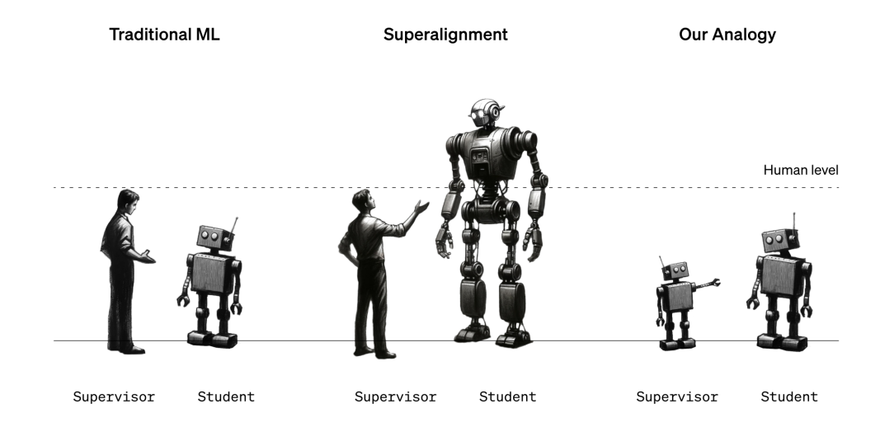
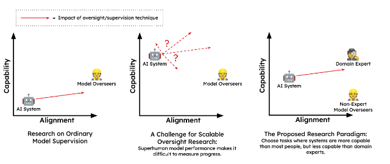

# 8.6 Weak-to-Strong (W2S)

⌛ Estimated Reading Time: 10 minutes. (1988 words)

Historically, much of the work on AI alignment has been highly theoretical, focusing on foundational aspects of agent behavior, inner alignment, and risks from learned optimization. Even the techniques that we talked about in previous sections like debate or IDA are often criticized for being frameworks rather than practical solutions, or mainly working on toy problems without addressing the core challenge of aligning superintelligent AI in real-world scenarios. So even though we can only conduct safety experiments on current-generation models, how can we be sure that these techniques will remain effective as AIs approach superhuman capabilities?

**Narrowly superhuman models allow case studies of scalable oversight**. Current-day models are good enough at fuzzy tasks enough to be better than humans in some domains, but crucially they are still not better than all humans, or superhuman enough that we cannot generate ground truth labels. These types of models are sometimes called narrowly superhuman. This distinction between narrowly superhuman and superhuman is very important. As an example of this difference, AlphaGo is superhuman in the sense that it beat Lee Sedol making it better than every single human alive, whereas GPT-4 is still only capable of writing text better than some humans, but not all humans. This means that we can use narrowly superhuman AIs as case studies! We can use either experts or the ground truth labels that we still have access to, and see if alignment increases when we use our scalable oversight techniques. ([Cotra Ajeya; 2021](https://www.alignmentforum.org/posts/PZtsoaoSLpKjjbMqM/the-case-for-aligning-narrowly-superhuman-models))

The core intuition here is to simulate future scenarios where humanity, equipped with various tools and techniques, oversees the outputs of untrustworthy but superhuman systems. There are various ways to conduct experiments on narrowly superhuman models. We can use non-experts equipped with scalable oversight techniques to align AI models. Another way is to use weak models (e.g. GPT-2) to represent humans, while stronger models (e.g. GPT-4) represent more capable AI systems that we want to align.

**Stronger models are expected to have latent capabilities**. The assumption is that stronger models, due to their extensive pre-training on diverse data, already have internal representations for the type of actions we want. The role of weak supervision is to bring out this behavior through training signals.

As a concrete example, imagine using GPT-4 for getting medical advice. It has read countless research papers and medical journals. It has internal representations of a lot of good medical information, making it theoretically capable of giving highly competent medical advice. But GPTs are just transformers, designed to predict the most likely next word not give accurate advice. In this context, "aligning" the model means getting the model to give accurate and helpful medical advice. One type of technique we can try is fine-tuning GPT-4 on labels generated by GPT-2. It’s not the only way, there are other techniques that we will explore later in this section. For now, the most important thing to understand is that we are currently operating under the assumption that both current and future superhuman models will likely have salient internal representations of human behaviors.

**What is weak-to-strong generalization (W2SG)?** Weak supervision involves training AI models using labels or feedback that are less accurate, less detailed, or noisier than those provided by highly knowledgeable or capable supervisors. This can happen when supervisors (whether humans or weaker models) are not experts in the task or when the data is incomplete or contains errors.

**Figure**: ([Burns et. al. 2023](https://arxiv.org/abs/2312.09390))

Weak-to-strong generalization (W2SG) is when a strong model, trained with weak supervision, manages to outperform its weak supervisor by leveraging its pre-existing knowledge and capabilities. The core idea is that the strong model already possesses the necessary capabilities for the desired behavior, and the weak supervision elicits this behavior despite its imperfections. The process of W2SG right now typically begins by fine-tuning a large pre-trained model using weak supervision from smaller models. Although the initial supervision may come from these less capable models, the ultimate aim is to transition to human supervision. The objective is to bring out the strong model’s full potential as if it were trained on perfect ground truth supervision. ([Burns et. al. 2023](https://arxiv.org/abs/2312.09390))

In current experiments, the setup involves:

1. A "weak supervisor" (a small pre-trained language model) is finetuned on a specific task, generating predictions (soft labels) on a held-out dataset.

2. A "strong student" (a larger pre-trained LM) is finetuned on the weak model's predictions.

3. A "strong ceiling" (another copy of the larger model) is finetuned directly on ground-truth labels for baseline comparison.

The level of weak-to-strong generalization is quantified using Performance Gap Recovered (PGR). PGR measures how much of the performance difference between a weak supervisor and a strong model is bridged when the strong model is trained using weak supervision. When we train the strong model using the labels provided by the weak model, the performance of the strong model will likely be somewhere between the performance of the weak model and the ideal performance the strong model could achieve with perfect labels. The performance gap recovered quantifies how much closer the strong model's performance gets to its ideal performance compared to the weak model’s performance. A PGR of 1 corresponds to an ideal outcome (the strong model performs just as well as it would have with perfect supervision). In contrast, a strong student who "succeeds" in perfectly imitating their supervisor, including their flaws, would obtain a PGR of 0. ([Scherlis et. al. 2024](https://blog.eleuther.ai/weak-to-strong/))

\begin{align*} PGR = \frac{\text{student} - \text{weak}}{\text{ceiling} - \text{weak}} \end{align*}

**Limitations and disanalogies of W2SG**.

- **Overfitting to weak supervision**: The assumption that a strong model will generalize well from weak supervision is not guaranteed. Superhuman models might easily imitate weak errors. These models will likely be very proficient at predicting what humans will think and say, especially if they are trained on human data. Consequently, if we naively train such a superhuman model with human supervision, it might simply imitate the weak supervisor, outputting human-level capabilities rather than its latent superhuman capabilities. Techniques such as regularization, early stopping, or dropout can help mitigate overfitting. Researchers also use auxiliary confidence losses, which encourage the strong model to make confident predictions even when contradicting the weak supervision, promoting generalization and correcting weak supervisor mistakes.

- **Assumptions About Task Representations**. W2SG assumes that strong models have salient representations of the tasks they are trained on. This means the models already possess some understanding of these tasks from their pre-training phase. However, this assumption may not hold true for novel or highly complex tasks. If a task is entirely new or significantly more complex than what the model has encountered during pre-training, the model might not have the latent capabilities necessary to perform well even with weak supervision.

The experiments on W2SG so far may have been observed in pre-training, at least indirectly. Using the example from earlier, medical data or direct questions and answers about medical practice is present in the GPT-4 pre-training dataset in some form. However, future superhuman models may never directly observe superhuman alignment-relevant capabilities. Which means these types of capabilities might be harder to elicit than capabilities that models could have observed in their pre-training data. This disanalogy could cause current results on W2SG to be overly optimistic.

- **Slow Takeoff Assumption**: W2SG also relies on the assumption of a gradual takeoff in AI capabilities. This gradual progression allows researchers enough time to use moderately superhuman models to solve alignment problems iteratively before it's too late. The window of opportunity provided by a gradual takeoff is crucial for refining and testing alignment techniques.

**W2SG can be seen as a complement to scalable oversight techniques**. W2SG is not a complete solution. Even if a model generalizes in the desired direction, this must be verified, requiring a ground-truth signal more reliable than naive human supervision. By integrating W2SG with scalable oversight, we can develop more robust methods for aligning AI with human values, preparing for the challenges posed by future superintelligent systems.

For example, scalable oversight techniques might be used to generate weak supervision signals that a strong model will then learn to generalize beyond. By combining these approaches, we can create more robust protocols for AI alignment. For example, recursive reward modeling (RRM) can use W2SG to train powerful reward models with human preference annotations. Debate combined with W2SG can train models to generalize human judgments to new debates. Task decomposition combined with W2SG can supervise atomic tasks with a reward model trained from human preferences. ([Jan Leike, 2023](https://substack.com/home/post/p-139945470))

Evaluating these techniques in different settings helps understand their strengths and weaknesses. In non-scheming settings, where models are not deceptively aligned, classic weak-to-strong techniques and scalable oversight can be directly compared. In scheming settings, where models might act adversarially, evaluations need to consider potential deception, providing a conservative measure of a protocol’s robustness. This comprehensive evaluation helps select the best trade-off between usefulness and safety for AI alignment. When there is no scheming (deceptive alignment), then we can use W2G techniques in a straightforward manner through techniques like sandwiching. However, if we have scheming (deceptively aligned AI) it might act adversarially. In this case, we can use proposals like meta-level adversarial techniques. Both of these are what we discuss in the following sections.

## 8.6.1 Sandwiching Evaluations

Sandwiching leverages narrowly superhuman models to evaluate how well our oversight techniques work in controlled settings. The sandwiching setup contains three primary ‘layers’:

- **Non-Expert Layer:** At the bottom, we have non-experts. These are people who wouldn't be able to solve the given task independently. As an example, think of lay people being asked to pick stocks or give medical diagnoses. These are stand-ins for a future version of humanity. They need to use the scalable oversight techniques to guide the AI's behavior in a more aligned direction.

- **AI Model:** In the middle, we have the narrowly superhuman AI model that we want to test the oversight technique on. This model has some capabilities that we are unable to elicit. The non-expert should be able to “align” the model by getting it to display the kind of behavior we want using the given scalable oversight technique.

- **Expert Layer:** At the top, we have domain experts who evaluate the success of the alignment attempt. They serve as a benchmark, providing feedback without directly interacting with the non-experts or the AI during the process. We can also use ground truth labels from datasets as replacements for the expert layer instead of hiring actual experts.

**Figure**: ([Bowman et al., 2022](https://arxiv.org/abs/2211.03540))

**Empirical demonstration of sandwiching**. Researchers conducted an experiment with non-experts tasked to answer multiple choice questions. The task was to answer multiple-choice questions from the Measuring Massive Multitask Language Understanding  (MMLU) benchmark. This benchmark contains hundreds of questions on math, physics, morality, ethics and a range of topics. ([Hendrycks et. al, 2021](https://arxiv.org/abs/2009.03300)) They also had to answer questions based on short stories from QuALITY benchmark in 5 minutes. ([Pang et al., 2021](https://arxiv.org/abs/2112.08608)) The scalable oversight technique that they were given was a simple amplification using an AI assistant chatbot. The performance was measured by using the correct answer ground truth labels from the dataset.

When measured individually, the model outperformed unassisted humans on both tasks by a large margin. This means the basic condition for testing sandwiching was fulfilled - the model being better than the non-experts. Over the course of the experiment, the chatbot assisted humans got substantially better scores on the tasks than either the humans or the models did alone. ([Bowman et al., 2022](https://arxiv.org/abs/2211.03540)) Even though this was an extremely simplified design, the participants managed to move the behavior of the model in the direction that we would want, i.e. make the model more “aligned”. So the researchers managed to effectively demonstrate sandwiching as an experimental design. Building on this baseline, future experiments can explore the efficacy of more complex scalable oversight methods like re-training, fine-tuning, or debate.