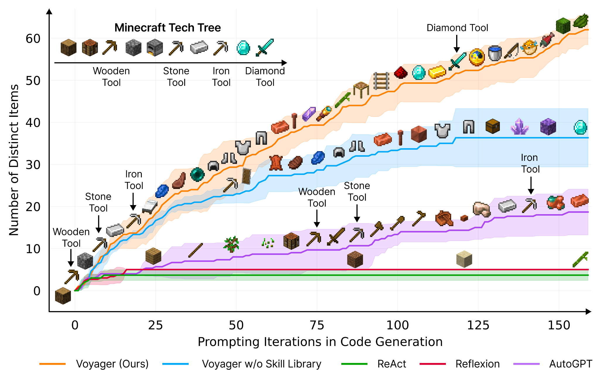

# 1.1 State-of-the-Art AI {: #01 }

:fontawesome-regular-clock: Reading time: 11 minutes

Over the last decade, the field of artificial intelligence (AI) has experienced a profound transformation, largely attributed to the successes in deep learning. This remarkable progress has redefined the boundaries of AI capabilities, challenging many preconceived notions of what machines can achieve. The following sections detail some of these advancements.

<figure markdown="span">
{ loading=lazy }
  <figcaption markdown="1"><b>Figure:</b> Once a benchmark is published, it takes less and less time to solve it. This can illustrate the accelerating progress in AI and how quickly AI benchmarks are “saturating”, and starting to surpass human performance on a variety of tasks. ([source](https://www.science.org/content/article/computers-ace-iq-tests-still-make-dumb-mistakes-can-different-tests-help))</figcaption>
</figure>

## 1.1.1 Language {: #01 }

**Language-based tasks.** There have been transformative changes in sequence and language-based tasks, primarily through the development of large language models (LLMs). Early language models in 2018 struggled to construct coherent sentences. The evolution from these to the advanced capabilities of GPT-3 (Generative Pre-Trained Transformer) and ChatGPT within less than 5 years is remarkable. These models demonstrate not only an improved capacity for generating text but also for responding to complex queries with nuanced, common-sense reasoning. Their performance in various question-answering tasks, including those requiring strategic thinking, has been particularly impressive.

GPT-4. One of the state-of-the-art language models in 2024 is OpenAI’s LLM GPT-4. In contrast with the text-only GPT-3 and follow-ups, GPT-4 is multimodal: it was trained on both text and images. This means that it can now not only generate text based on images but has also gained some other capabilities. GPT-4 saw an upgraded context window with up to 32k tokens (tokens ≈ words). The short-term memory limit of an LLM can be thought of as the model's ability to retain information from previous tokens within a certain context window. GPT-4 is trained via next-token prediction (autoregressive self-supervised learning). In 2018 GPT-1 was barely able to count to 10, while in 2024 GPT-4 can implement complex programmatic functions among other things.

<figure markdown="span">
{ loading=lazy }
  <figcaption markdown="1"><b>Figure:</b> A list of "Nowhere near solved” [...] issues in AI, from "A brief history of AI", published in January 2021 ([source](https://www.amazon.com/Brief-History-Artificial-Intelligence-Where/dp/1250770742)). They also say: “At present, we have no idea how to get computers to do the tasks at the bottom of the list”. But everything in the category “Nowhere near solved” has been solved by GPT-4 ([source](https://arxiv.org/abs/2303.12712)), except human-level general intelligence.</figcaption>
</figure>

**Scaling**. Remarkably, GPT-4 is trained using roughly the same methods as GPT-1, 2, and 3. The only significant difference is the size of the model and the data given to it during training. The size of the model has gone from 1.5B parameters to hundreds of billions of parameters, and datasets have become similarly larger and more diverse.

<figure markdown="span">
{ loading=lazy }
  <figcaption markdown="1"><b>Figure:</b> How fast is AI Improving? ([source](https://theaidigest.org/progress-and-dangers))</figcaption>
</figure>

We have observed that just an expansion in scale has contributed to enhanced performance. This includes improvements in the ability to generate contextually appropriate responses, and highly diverse text across a range of domains. It has also contributed to overall improved understanding, and coherence. Most of those advances in the GPT series come from increasing the size and computation power behind the models, rather than fundamental shifts in architecture or training.

Here are some of the capabilities that have been emerging in the last few years:

- **Few-shot and Zero-shot Learning**. The model's proficiency at understanding and executing tasks with minimal or no prior examples. 'Few-shot' means accomplishing the task after having seen a few examples in the context window, while 'Zero-shot' indicates performing the task without any specific examples ([source](https://transformer-circuits.pub/2022/in-context-learning-and-induction-heads/index.html)). This also includes induction capabilities, i.e. identifying patterns and generalizing rules not present in the training, but only present in the current context window ([source](https://arxiv.org/abs/2005.14165)).

- **Metacognition**. This refers to the ability to recognize its own knowledge and limitations, for example, being able to know the probability of the truth of something ([source](https://arxiv.org/abs/2207.05221)).

- **Theory of Mind**. The capability to attribute mental states to itself and others, which helps in predicting human behaviors and responses for more nuanced interactions ([source](https://arxiv.org/abs/2302.02083), [source](https://arxiv.org/abs/2402.06044)).

- **Tool Use**. Being able to interact with external tools, like using a calculator or browsing the internet, expanding its problem-solving abilities ([source](https://arxiv.org/abs/2307.16789)).

- **Self-correction**. The model's ability to identify and correct its own mistakes, which is crucial for improving the accuracy of AI-generated content ([source](https://arxiv.org/abs/2303.11366)).

<figure markdown="span">
{ loading=lazy }
  <figcaption markdown="1"><b>Figure:</b> An example of a mathematical problem solved by GPT-4 using Chain of Thought (CoT), from the paper “Sparks of Artificial General Intelligence” ([source](https://arxiv.org/abs/2303.12712)).</figcaption>
</figure>

- **Reasoning**. The advancements in LLMs have also led to significant improvements in the ability to process and generate logical chains of thought and reasoning. This is particularly important in problem-solving tasks where a straightforward answer isn't immediately available, and a step-by-step reasoning process is required. ([source](https://arxiv.org/abs/2303.12712))

- **Programming ability**. In coding, AI models have progressed from basic code autocompletion to writing sophisticated, functional programs.

- **Scientific & Mathematical ability**. In mathematics, AI's have assisted in the subfield of automatic theorem proving for decades. Today's models continue to assist in solving complex problems. AI can even achieve a gold medal level in the mathematical Olympiad by solving geometry problems ([source](https://www.nature.com/articles/s41586-023-06747-5)).

<figure markdown="span">
{ loading=lazy }
  <figcaption markdown="1"><b>Figure:</b> GPT-4 solves some tasks that GPT-3.5 was unable to, like the uniform bar examination, where GPT-4 scores 90% compared to 10% for GPT-3.5. GPT-4 is also capable of vision processing, and the added vision component had only a minor impact, but it helped others tremendously. ([source](https://openai.com/research/gpt-4))</figcaption>
</figure>

## 1.1.2 Image Generation {: #02 }

The leap forward in image generation is not just in accuracy, but also in the ability to handle complex, real-world images. The latter, particularly with the advent of Generative Adversarial Networks (GANs) in 2014, has shown an astounding rate of progress. The quality of images generated by AI has evolved from simple, blurry representations to highly detailed and creative scenes, often in response to intricate language prompts.

<figure markdown="span">
{ loading=lazy }
  <figcaption markdown="1"><b>Figure:</b> An example of state-of-the-art image recognition. The Segment Anything Model (SAM) by Meta’s FAIR (Fundamental AI Research) lab, can classify and segment visual data at highly precise levels. The detection is performed without the need to annotate images. ([source](https://viso.ai/deep-learning/segment-anything-model-sam-explained/))</figcaption>
</figure>

<figure markdown="span">
{ loading=lazy }
  <figcaption markdown="1"><b>Figure:</b> An example of the evolution of image generation. At the top left, starting from GANs (Generative Adversarial Networks) to the bottom right, an image from MidJourney V5.</figcaption>
</figure>

The rate of progress within a single year alone is quite astounding as is seen from the improvements between the V1 of the MidJourney image generation model in early 2022, to the V6 in December 2023.

<figure markdown="span">
{ loading=lazy }
  <figcaption markdown="1"><b>Figure:</b> MidJourney AI image generation over 2022-2023. Prompt: high-quality photography of a young Japanese woman smiling, backlighting, natural pale light, film camera, by Rinko Kawauchi, HDR ([source](https://goldpenguin.org/blog/midjourney-v1-to-v6-evolution/))</figcaption>
</figure>

## 1.1.3 Multi & Cross modality {: #03 }

AI systems are becoming increasingly multimodal. This means that they can process images, text, audio, vision, and robotics using the same model. So they are trained using multiple different “modes” and can translate between them after deployment.

**Cross-modality**. A model is called cross-modal when the input of a model is in one modality (e.g. text) and the output is in another modality (e.g. image). The section on computer vision showed fast progress between 2014 and 2020 in cross-modality. We went from text-to-image models only capable of generating black-and-white pixelated images of faces, to models capable of generating an image of any textual prompt. More examples of cross-modality include OpenAIs Whisper ([source](https://cdn.openai.com/papers/whisper.pdf)) which is capable of speech-to-text transcription.

**Multi-modality**. A model is called multi-modal when both the inputs and outputs of a model can be in more than one modality. E.g. audio-to-text, video-to-text, text-to-image, etc…

<figure markdown="span">
{ loading=lazy }
  <figcaption markdown="1"><b>Figure:</b> Image-to-text and text-to-image multimodality from the Flamingo model. ([source](https://arxiv.org/abs/2204.14198))</figcaption>
</figure>

DeepMind’s 2022 Flamingo model, could be “*rapidly adapted to various image/video understanding tasks*” and “*is also capable of multi-image visual dialogue*”. ([source](https://arxiv.org/abs/2204.14198)) Similarly, DeepMind’s 2022 Gato model, was called a "Generalist Agent". It was a single network with the same weights which could “*play Atari, caption images, chat, stack blocks with a real robot arm, and much more*”. ([source](https://arxiv.org/abs/2205.06175)) Continuing this trend, DeepMind’s 2023 Google Gemini model could be called a Large Multimodal Model (LMM). The paper described Gemini as “*natively multimodal*” and claimed to be able to “*seamlessly combine their capabilities across modalities (e.g. extracting information and spatial layout out of a table, a chart, or a figure) with the strong reasoning capabilities of a language model (e.g. its state-of-art-performance in math and coding)*”([source](https://arxiv.org/abs/2312.11805))

## 1.1.4 Robotics {: #04 }

The field of robotics has also been progressing alongside artificial intelligence. In this section, we provide a couple of examples where these two fields are merging, highlighting some robots using inspiration from machine learning techniques to make advancements.

<figure markdown="span">
{ loading=lazy }
  <figcaption markdown="1"><b>Figure:</b> Researchers used Model-Free Reinforcement Learning to automatically learn quadruped locomotion in only 20 minutes in the real world instead of in simulated environments. The Figure shows examples of learned gaits on a variety of real-world terrains. ([source](https://arxiv.org/abs/2208.07860))</figcaption>
</figure>

**Advances in robotics**. At the forefront of robotic advancements is PaLM-E, a general-purpose, embodied model with 562 billion parameters that integrates vision, language, and robot data for real-time manipulator control and excels in language tasks involving geospatial reasoning. ([source](https://arxiv.org/abs/2303.03378))

Simultaneously, developments in vision-language models have led to breakthroughs in fine-grained robot control, with models like RT-2 showing significant capabilities in object manipulation and multimodal reasoning. RT-2 demonstrates how we can use LLM-inspired prompting methods (chain-of-thought), to learn a self-contained model that can both plan long-horizon skill sequences and predict robot actions. ([source](https://deepmind.google/discover/blog/rt-2-new-model-translates-vision-and-language-into-action/))

Mobile ALOHA is another example of combining modern machine learning techniques with robotics. Trained using supervised behavioral cloning, the robot can autonomously perform complex tasks “*such as sauteing and serving a piece of shrimp, opening a two-door wall cabinet to store heavy cooking pots, calling and entering an elevator, and lightly rinsing a used pan using a kitchen faucet.*” ([source](https://arxiv.org/abs/2401.02117)) Such advancements not only demonstrate the increasing sophistication and applicability of robotic systems but also highlight the potential for further groundbreaking developments in autonomous technologies.

<figure markdown="span">
{ loading=lazy }
  <figcaption markdown="1"><b>Figure:</b> DeepMinds RT-2 can both plan long-horizon skill sequences and predict robot actions using inspiration from LLM prompting techniques (chain-of-thought). ([source](https://deepmind.google/discover/blog/rt-2-new-model-translates-vision-and-language-into-action/))</figcaption>
</figure>

## 1.1.5 Playing Games {: #05 }

**AI and board games.** AI has made continuous progress in game playing for decades. Starting from AIs beating the world champion at chess in 1997 ([source](https://en.wikipedia.org/wiki/Deep_Blue_(chess_computer))), Scrabble in 2006 ([source](https://content.time.com/time/specials/packages/article/0,28804,2049187_2049195_2049083,00.html)) to DeepMind’s [AlphaGo](https://www.deepmind.com/research/highlighted-research/alphago) in 2016, which was good enough to defeat the world champion in the game of Go, a game assumed to be notoriously difficult for AI. Within a year, the next model [AlphaZero](https://www.deepmind.com/blog/alphazero-shedding-new-light-on-chess-shogi-and-go) trained through self-play had mastered multiple games of Go, chess, and shogi reaching a superhuman level after less than three days of training.

**AI and video games.** We started using machine learning techniques on simple Atari games in 2013 ([source](https://arxiv.org/abs/1312.5602)). By 2019, OpenAI Five defeated the world champions at DOTA2 ([source](https://openai.com/research/openai-five-defeats-dota-2-world-champions)), while in the same year, DeepMind’s AlphaStar beat professional esports players at StarCraft II ([source](https://www.deepmind.com/blog/alphastar-mastering-the-real-time-strategy-game-starcraft-ii)). Both these games require thousands of actions in a row at a high number of actions per minute. In 2020 DeepMind MuZero model, described as “*a significant step forward in the pursuit of general-purpose algorithms*” ([source](https://www.deepmind.com/blog/muzero-mastering-go-chess-shogi-and-atari-without-rules)), was capable of playing Atari games, Go, chess, and shogi without even being told the rules.

In recent years, AI's capability has extended to open-ended environments like Minecraft, showcasing an ability to perform complex sequences of actions. In strategy games, Meta’s Cicero displayed intricate strategic negotiation and deception skills in natural language for the game Diplomacy ([source](https://arxiv.org/abs/2210.05492)).

<figure markdown="span">
{ loading=lazy }
  <figcaption markdown="1"><b>Figure:</b> A map of diplomacy and the dialog box where the AI negotiates. ([source](https://www.youtube.com/watch?v=u5192bvUS7k&t=2216s))</figcaption>
</figure>

??? note "Example of Voyager: Planning and Continuous Learning in Minecraft with GPT-4"

    Voyager ([source](https://arxiv.org/abs/2305.16291)) stands as a particularly impressive example of the capabilities of AI in continuous learning environments. This AI is designed to play Minecraft, a task that involves a significant degree of planning and adaptive learning. What makes Voyager so remarkable is its ability to learn continuously and progressively within the game's environment, using GPT-4 contextual reasoning abilities to plan and write the code necessary for each new challenge. Starting from scratch in a single game session, Voyager initially learns to navigate the virtual world, engage and defeat enemies, and remember all these skills in its long-term memory. As the game progresses, it continues to learn and store new skills, leading up to the challenging task of mining diamonds, a complex activity that requires a deep understanding of the game mechanics and strategic planning. The ability of Voyager to integrate new information continuously and utilize it effectively showcases the potential of AI in managing complex, changing environments and performing tasks that require a long-term buildup of knowledge and skills.

    <figure markdown="span">
    { loading=lazy }
      <figcaption markdown="1"><b>Figure:</b> Voyager discovers new Minecraft items and skills continually by self-driven exploration, significantly outperforming the baselines. ([source](https://arxiv.org/abs/2305.16291))</figcaption>
    </figure>