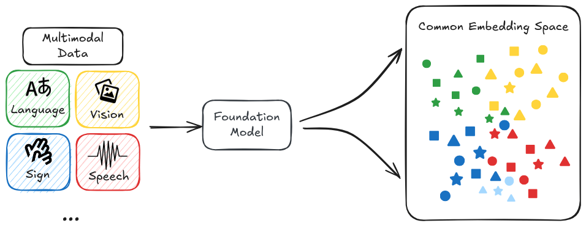

# 1.2 Foundation Models

    

        
            <i class="fas fa-clock"></i>
        
        

            
Reading Time

            
13 min

        

    

**What are foundation models?** Foundation models represent a fundamental shift in how we develop AI. Rather than building specialized models for many small specific tasks, we can now train large-scale models that serve as a "foundation" for many different applications. These models are then specialized later by a process called fine-tuned to perform specific tasks. Think of this as similar to how we can build many different types of buildings using the same base structure ([Bommasani et al., 2022](https://arxiv.org/abs/2108.07258)). We can build banks, restaurants, or housing but the underlying foundation remains largely the same. This is just a very quick intuitive definition. We will get more into the details in the next few subsections on training, properties and risks.

<figure class="video-figure" markdown="span">
<iframe style="width: 100%; aspect-ratio: 16 / 9;" frameborder="0" allowfullscreen src="https://www.youtube.com/embed/kK3NmQT241w"></iframe>
  <figcaption markdown="1"><b>Video 1.2:</b> Optional video to understand foundation models.</figcaption>
</figure>

**Why did the paradigm of foundation models come about?** The traditional approach of training specialized AI models for every task often proved inefficient and limiting. Progress was bottlenecked by the need for human-labeled data and the inability to transfer knowledge between tasks effectively. Foundation models overcame these limitations through a process called self-supervised learning on massive unlabeled datasets. This breakthrough happened because of many different reasons - advances in specialized hardware like GPUs, new machine learning architectures like transformers, and increased access to huge amounts of online data ([Kaplan et al., 2020](https://arxiv.org/abs/2001.08361)) are some of the more prominent reasons for this shift.

**What are examples of foundation models?** In language processing, models like GPT-4 and Claude are examples of foundation models. Both of these have demonstrated the ability to generate human language, have complex conversations and perform simple reasoning tasks ([OpenAI, 2023](https://arxiv.org/abs/2303.08774)). Examples in computer vision include models like DALL-E 3 and Stable Diffusion. ([Betker et al., 2023](https://cdn.openai.com/papers/dall-e-3.pdf)) These are domain specific examples, but we are also seeing a trend toward multimodal foundation models (LMMs). This includes things like GPT-4V and Gemini that can work across different types of data - processing and generating text, images, code, audio and probably more in the future ([Google, 2023](https://arxiv.org/abs/2312.11805)). Even in reinforcement learning, where models were traditionally trained for specific tasks, we're seeing foundation models like Gato demonstrate the ability to learn general-purpose behaviors that can be adapted to various different downstream tasks. ([Reed et al., 2022](https://arxiv.org/abs/2205.06175))

<figure class="iframe-figure" markdown="span">
<iframe src="https://ourworldindata.org/grapher/number-of-large-scale-ai-systems-released-per-year?tab=chart" loading="lazy" style="width: 100%; height: 600px; border: 0px none;" allow="web-share; clipboard-write"></iframe>
  <figcaption markdown="1"><b>Interactive Figure 1.6:</b> The number of foundation models is growing every year. ([Giattino et al., 2023](https://ourworldindata.org/artificial-intelligence))</figcaption>
</figure>

**What makes foundation models important for AI safety?** The reason we start this entire book by talking about foundation models is because they mark a shift towards general-purpose systems, rather than narrow specialized ones. This paradigm shift introduces many new risks which didn't exist previously. These include misuse risks from centralization, homogenization, and dual-use capabilities just to name a few. The ability of foundation models to learn broad, transferable capabilities has also led to increasingly sophisticated behaviors emerging from relatively simple training objectives ([Wei et al., 2022](https://arxiv.org/abs/2206.07682)). Complex capabilities, combined generality and scale, means we need to seriously consider safety risks beyond just misuse that previously seemed theoretical or distant. Beyond just misuse risk, things like misalignment are becoming an increasing concern with each new capability that these foundation models exhibit. We dedicate an entire chapter to the discussion of these risks. But we will also give you a small taste on the kinds of possible risks in the next few subsections, as it warrants some repetition.

<figure class="iframe-figure" markdown="span">
<iframe src="https://ourworldindata.org/grapher/cumulative-number-of-large-scale-ai-models-by-domain?tab=chart" loading="lazy" style="width: 100%; height: 600px; border: 0px none;" allow="web-share; clipboard-write"></iframe>
  <figcaption markdown="1"><b>Interactive Figure 1.7:</b> Number of large scale models (by domain) ([Giattino et al., 2023](https://ourworldindata.org/artificial-intelligence))</figcaption>
</figure>

**Wh at is the difference between foundation models and frontier models?** Frontier models represent the cutting edge of AI capabilities - they are the most advanced models in their respective domains. While many frontier models are also foundation models (like Claude 3.5 Sonnet), this isn't always the case. For example, AlphaFold, while being a frontier model in protein structure prediction, isn't typically considered a foundation model because it's specialized for a single task rather than serving as a general foundation for multiple applications ([Jumper et al., 2021](https://pubmed.ncbi.nlm.nih.gov/34265844/)). This distinction is worth keeping in mind, because most AI safety research and regulation frameworks focus on frontier models due to their advanced capabilities. When discussions about AI safety reference "foundation models," they're typically referring specifically to frontier foundation models - those foundation models that also represent the current state-of-the-art in capabilities. Understanding this distinction helps us better target and implement safety measures where they're most critically needed.

## 1.2.1 Training {: #01}

**How are foundation models trained differently from traditional AI systems?** One key innovation of foundation models is their training paradigm. Generally, foundation models use a two-stage training process. First, they go through what we call a pre-training, and then second, they can be adapted through various mechanisms like fine-tuning or scaffolding to perform specific tasks. Rather than learning from human-labeled examples for specific tasks, these models learn by finding patterns in huge amounts of unlabeled data. This shift toward self-supervised learning on massive datasets fundamentally changes not just how models learn, but also what kinds of capabilities and risks might emerge ([Bommasani et al., 2022](https://arxiv.org/abs/2108.07258)). From a safety perspective, this means we need to understand both how these training methods work and how they might lead to unexpected behaviors.

<figure markdown="span">
{ loading=lazy }
  <figcaption markdown="1"><b>Figure 1.14:</b> On the Opportunities and Risks of Foundation Models ([Bommasani et al., 2022](https://arxiv.org/abs/2108.07258))</figcaption>
</figure>

**What is pre-training?** Pre-training is the initial phase where the model learns general patterns and knowledge from massive datasets of millions or billions of examples. During this phase, the model isn't trained for any specific task - instead, it develops broad capabilities that can later be specialized. This generality is both powerful and concerning from a safety perspective. While it enables the model to adapt to many different tasks, it also means we can't easily predict or constrain what the model might learn to do ([Hendrycks et al., 2022](https://arxiv.org/abs/2109.13916)).

<figure markdown="span">
{ loading=lazy }
  <figcaption markdown="1"><b>Figure 1.15:</b> On the Opportunities and Risks of Foundation Models ([Bommasani et al., 2022](https://arxiv.org/abs/2108.07258))</figcaption>
</figure>

**How does self-supervised learning enable pre-training?** Self-supervised learning (SSL) is the key technical innovation that makes foundation models possible. This is how we actually implement the pre-training phase. Unlike traditional supervised learning, which requires human-labeled data, SSL leverages the inherent structure of the data itself to create training signals. For example, instead of manually labeling images, we might just hide part of a full image we already have and ask a model to predict what the rest should be. So it might predict the bottom half of an image given the top half, learning about which objects often appear together. As an example, it might learn that images with trees and grass at the top often have more grass, or maybe a path, at the bottom. It learns about objects and their context - trees and grass often appear in parks, dogs are often found in these environments, paths are usually horizontal, and so on. These learned representations can then be used for a wide variety of tasks that the model was not explicitly trained for, like identifying dogs in images, or recognizing parks - all without any human-provided labels! The same concept applies in language, a model might predict the next word in a sentence, such as "The cat sat on the … ," learning grammar, syntax, and context as long as we repeat this over huge amounts of text.

**What is fine-tuning ?** After pre-training, foundation models can be adapted through two main approaches: fine-tuning and prompting. Fine-tuning involves additional training on a specific task or dataset to specialize the model's capabilities. For example, we might use Reinforcement Learning from Human Feedback (RLHF) to make language models better at following instructions or being more helpful. Prompting, on the other hand, involves providing the model with carefully crafted inputs that guide it toward desired behaviors without additional training. We'll discuss these adaptation methods in more detail in Chapter 8 when we explore scalable oversight.

**Why does this training process matter for AI safety?** The training process of foundation models creates several unique safety challenges. First, the self-supervised nature of pre-training means we have limited control over what the model learns - it might develop unintended capabilities or behaviors. Second, the adaptation process needs to reliably preserve any safety properties we've established during pre-training. Finally, the massive scale of training data and compute makes it difficult to thoroughly understand or audit what the model has learned. Many of the safety challenges we'll discuss throughout this book - from goal misgeneralization to scalable oversight - are deeply connected to how these models are trained and adapted.

## 1.2.2 Properties {: #02}

**Why do we need to understand the properties of foundation models?** Besides just understanding the training process, we also need to understand the key defining characteristics or the abilities of these models. These properties often determine both the capabilities and potential risks of these systems. They help explain why foundation models pose unique safety challenges compared to traditional AI systems. Their ability to transfer knowledge, generalize across many different domains, and develop emergent capabilities means we can't rely on traditional safety approaches that assume narrow, predictable behavior.

**What is transfer learning?** Transfer learning is one of the most fundamental properties of foundation models - their ability to transfer knowledge learned during pre-training to new tasks and domains. Rather than starting from scratch for each task, we can leverage the general knowledge these models have already acquired ([Bommasani et al., 2022](https://arxiv.org/abs/2108.07258)). This property enables rapid adaptation and deployment, it also means that both capabilities and safety risks can transfer in unexpected ways. For example, a model might transfer not just useful knowledge but also harmful biases or undesired behaviors to new applications.

**What are zero-shot and few-shot learning?** The ability to perform new tasks with very few examples, or even no examples at all. For example, GPT-4 can solve novel reasoning problems just from a natural language description of the task ([OpenAI, 2023](https://arxiv.org/abs/2303.08774)). This emergent ability to generalize to new situations is powerful but concerning from a safety perspective. If models can adapt to novel situations in unexpected ways, it becomes harder to predict and control their behavior in deployment.

**Why is generality?** Generalization in foundation models works differently from traditional AI systems. Rather than just generalizing within a narrow domain, these models can generalize capabilities across domains in surprising ways. However, this generalization of capabilities often happens without a corresponding generalization of goals or constraints - a critical safety concern we'll explore in detail in our chapter on goal misgeneralization. For example, a model might generalize its ability to manipulate text in unexpected ways without maintaining the safety constraints we intended ([Hendrycks et al., 2022](https://arxiv.org/abs/2109.13916)).

<figure markdown="span">
{ loading=lazy }
  <figcaption markdown="1"><b>Figure 1.16:</b> On the Opportunities and Risks of Foundation Models ([Bommasani et al., 2022](https://arxiv.org/abs/2108.07258))</figcaption>
</figure>

**Why is multi-modality?** Models can work with multiple types of data (text, images, audio, video) simultaneously. This isn't just about handling different types of data. A better description is that they can make connections across modalities in sophisticated ways ([Google, 2023](https://arxiv.org/abs/2312.11805)). From a safety perspective, multi-modality introduces new challenges because it expands the ways models can interact with and influence the world. A safety failure in one modality might manifest through another in unexpected ways.

!!! quote "Sam Altman (CEO of OpenAI) ([Cronshaw, 2024](https://www.linkedin.com/pulse/altman-multimodality-important-david-cronshaw-5fz0c))"

    Multimodality will definitely be important. Speech in, speech out, images, eventually video. Clearly, people really want that. Customizability and personalization will also be very important.

## 1.2.3 Risks {: #03}

**What makes foundation models hard to control?** The difficulty of controlling these models stems from three interconnected challenges. First, once trained, their internal representations and behaviors are extremely difficult to modify in targeted ways. Unlike traditional software where we can directly edit specific functions, changing one behavior in a foundation model risks unpredictable effects on other capabilities. Second, when these models are deployed across many applications, maintaining control becomes a distributed systems problem. Safety failures can propagate through multiple systems before they're detected. Third, their black-box nature makes it extremely difficult to understand why they make specific decisions or how they might behave in novel situations - a challenge we'll explore deeply in our chapter on interpretability.

**How do resource requirements limit development and access?** Training foundation models require massive computational resources, creating a delicate balance between cost and accessibility. While adapting an existing model might be relatively affordable, the substantial initial training costs risk centralizing power among a few well-resourced entities. This concentration of power raises important questions about oversight and responsible development, that we'll address in our chapter on governance. For example, a single training run of GPT-4 sized models can cost tens or hundreds of millions of dollars, effectively limiting who can participate in their development. Continued scaling has also brought up many concerns around the environmental impact of AI training runs. ([Patterson et al., 2023](https://arxiv.org/abs/2104.10350)).

<figure markdown="span">
{ loading=lazy }
  <figcaption markdown="1"><b>Figure 1.17:</b> The rising costs of training frontier AI models ([Cottier et al., 2024](https://arxiv.org/abs/2405.21015))</figcaption>
</figure>

**What risks come from homogenization?** Homogenization occurs when many AI systems are derived from the same foundation models. This creates a systemic risk - if a foundation model has biases or failure modes, these could propagate to all models fine-tuned from it ([Bommasani et al., 2022](https://arxiv.org/abs/2108.07258)). For example, if a widely-used foundation model has encoded harmful biases or unsafe behaviors, these might manifest across numerous applications, from content generation to automated decision-making. They also have fixed knowledge cutoffs based on their training data, creating potential safety issues when deployed in rapidly changing environments. This risk of correlated failures becomes particularly concerning when foundation models are deployed in critical systems. ([Hendrycks et al., 2022](https://arxiv.org/abs/2109.13916)).

**What is emergence, and why does it matter?** Foundation models can effectively leverage increases in data, computation, and model size to improve their capabilities. The models become qualitatively different as they scale, often developing new capabilities entirely absent in smaller versions ([Kaplan et al., 2020](https://arxiv.org/abs/2001.08361)). This property is called emergence - the development of capabilities that weren't explicitly trained for. This can be both a good thing and a bad thing.

We might encounter new, unexpected behaviors and risks that weren't present in smaller models. This emergence often happens discontinuously as models scale up, making it difficult to predict what capabilities might suddenly appear. Which means it also makes it difficult to predict which risks will emerge when. When combined with homogenization, this unpredictability becomes especially concerning - a single foundation model integrated into multiple critical systems could lead to correlated failures that span multiple safeguards or backup systems ([Hendrycks et al., 2022](https://arxiv.org/abs/2109.13916)). Therefore, this points to a need for a proactive approach to AI safety. Having safety measures in place before we begin scaling and training bigger models.

How do these limitations inform our approach to safety? We just briefly touched on some of the risks in this subsection to give you a basic intuition for why it is important to work on AI safety. The entire next chapter is dedicated to a deep dive on different risks from AI models, and how they might come about.