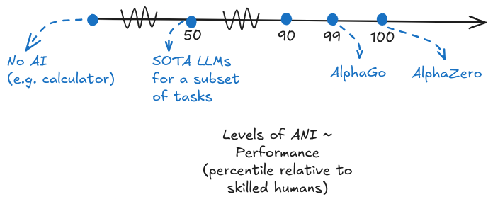

# 1.3 Intelligence {: #03 }

    

        <i class="fas fa-clock"></i>
        12 min read
    

    

        <i class="fas fa-file-alt"></i> 
        2482 words
    

## 1.3.1 Case Studies {: #01 }

!!! warning "The bulk of this subsection will deal with the theory and historical aspects of defining intelligence. If you are more interested in just the core practical aspects of how we measure artificial general intelligence (AGI), then you can safely skip to the next subsection - measurement."

**Why do we need to define intelligence?** In our previous section on foundation models, we explored how modern AI systems are becoming increasingly powerful. But before we can meaningfully discuss the risks and safety implications of these systems, we need to agree on what we mean when we talk about AGI. Some believe that "sparks" of AGI are already present in the latest language models ([Bubeck et al., 2023](https://arxiv.org/abs/2303.12712)), while others predict human-level AI within a decade ([Bengio et al., 2024](https://arxiv.org/abs/2310.17688)). Without a clear definition, how are we supposed to assess such claims or plan appropriate safety measures?

The core point is that if you can't define something, you can't measure it. If you can't measure it, you can't reliably track progress or identify potential risks. Think about an example from physics - saying something like "it moved 5" makes no sense without specifying the unit of measurement. Did it move 5 meters, 5 feet, or 5 royal cubits? Nobody knows. If we don't know how far or fast it moved, then can we enforce speed limits? Also, no. The same applies to intelligence, and subsequent risks and safety techniques. Just as physics needed standardized units like meters and watts to advance beyond qualitative descriptions, AI safety research needs rigorous definitions to move beyond vague analogies and anthropomorphisms.

**What makes defining intelligence so challenging? **If everyone agrees that we need a definition to measure progress and design safety measures, then why don’t we have a universally agreed upon definition? The problem is that the word intelligence is a term we use to describe multiple overlapping abilities - from problem-solving and learning to adaptation and abstract reasoning. Besides this, different academic disciplines view intelligence through different lenses. Psychologists emphasize measurable cognitive skills, computer scientists focus on task performance, and philosophers debate qualities like the relationship of intelligence to consciousness and self-awareness. So which approach is the most relevant to understanding and planning for AI Safety?

**Case Study: Imitation based approach to intelligence.** The Turing Test (or the imitation game) suggested that intelligence could be measured through a machine's ability to imitate human conversation ([Turing, 1950](https://academic.oup.com/mind/article/LIX/236/433/986238?login=false)). However, this behaviorist approach proved inadequate - modern language models can often pass Turing-style tests while lacking fundamental reasoning capabilities ([Rapaport, 2020](https://sciendo.com/issue/JAGI/11/2)). This is also still a process based approach, and was meant mainly as a philosophical thought experiment rather than a concrete operationalizable measure of intelligence.

**Case Study: Consciousness based approaches to intelligence.** One early view focused on machines that could truly understand and have cognitive states similar to humans ([Searle, 1980](https://psycnet.apa.org/record/1981-27235-001)). However, this definition proves problematic on multiple levels. First, consciousness remains poorly understood and difficult to measure. Second, we are unsure if intelligence and consciousness are necessarily linked - a system could potentially be highly intelligent without being conscious, or conscious without being particularly intelligent. A system doesn't need to be conscious to cause harm. Whether an AI system is conscious or not has no bearing on its ability to make high-impact decisions or take potentially dangerous actions.

**Case Study: Brain analogy based approaches to intelligence.** Another early approach defined AGI in terms of systems that rival or surpass the human brain in complexity and speed. This brain-centric definition is problematic for several reasons. While our brains may be the only example of general intelligence we have, modern AI has shown that matching human neural architecture isn't necessary for achieving intelligent behavior. From a safety perspective, focusing on brain-like architecture tells us little about what risks a system might pose - a system could be very unlike a brain in structure but still be capable of dangerous actions.

**Case study: Process/Adaptability based approaches to intelligence.** The process-based view sees intelligence as the efficiency of learning and adaptation, rather than accumulated capabilities. A few researchers adopt this view of intelligence. Under this view, intelligence is "*the capacity of a system to adapt to its environment while operating with insufficient knowledge and resources*" ([Wang, 2020](https://sciendo.com/issue/JAGI/11/2)). Alternatively, it is described as "*the efficiency with which a system can turn experience and priors into skills*" ([Chollet, 2019](https://arxiv.org/abs/1911.01547)). While this focus on meta-learning and adaptation captures something fundamental about intelligence, but from a safety perspective, what ultimately matters is what these systems can actually do - their concrete capabilities - rather than how they achieve these capabilities. This leads us to the final approach.

**Case study 5: The capabilities approach to intelligence**. The motivating question behind this view is - If an AI system can perform dangerous tasks at human-level or beyond, does it really matter whether it achieved this through sophisticated learning processes, efficient memorization, with/without consciousness? If an AI system has capabilities that could pose risks - like sophisticated planning, manipulation, or deception - these risks exist regardless of whether the system acquired these capabilities through "true intelligence", "real understanding" or sophisticated pattern matching. The capabilities-based approach cuts through philosophical debates by asking concrete questions: What can the system actually do? How well can it do it? What range of tasks can it handle? This framework provides clear standards for progress and, crucially for safety work, clear ways to identify potential risks. The majority of AI labs use this capabilities-focused approach in how they frame their AGI goals. For example, AGI has been defined as "*highly autonomous systems that outperform humans at most economically valuable work*" ([OpenAI, 2014](https://openai.com/charter/)). Safety considerations are framed similarly in saying that the mission is to ensure "*transformative AI helps people and society*" ([Anthropic, 2024](https://www.anthropic.com/company)).

!!! quote "Capabilities vs Intelligence ([Krakovna, 2023](https://www.alignmentforum.org/posts/JtuTQgp9Wnd6R6F5s/when-discussing-ai-risks-talk-about-capabilities-not))"

    When discussing AI risks, talk about capabilities, not intelligence... People often have different definitions of intelligence, or associate it with concepts like consciousness that are not relevant to AI risks, or dismiss the risks because intelligence is not well-defined.

Given these considerations, for the vast majority of this book, our primary focus will remain on the practical framework of capabilities for evaluation and safety assessment. This capabilities-focused approach is most relevant for immediate safety work, regulation, and deployment decisions. We acknowledge that research into consciousness, sentience, ethics surrounding digital minds and the fundamental nature of intelligence continues to be valuable but is less actionable for immediate safety work.

In our next subsection, we will explore how we can concretely define and measure capabilities within this framework. We'll see how moving beyond simple binary thresholds of "narrow" versus "general" AI helps us better understand the progression of AI capabilities and their associated risks.

## 1.3.2 Measuring {: #02 }

**Why do traditional definitions of AGI fall short?** In the previous section, we explored how foundation models are becoming increasingly powerful and versatile. But before we can meaningfully discuss risks and safety implications, or make predictions about future progress, we need clear ways to measure and track AI capabilities. This section introduces frameworks for measuring progress toward artificial general intelligence (AGI) and understanding the relationship between capabilities, autonomy, and risk. For example, OpenAI's definition of AGI as "*systems that outperform humans at most economically valuable work*" ([OpenAI, 2014](https://openai.com/charter/)), or the commonly used definition "*Intelligence measures an agent’s ability to achieve goals in a wide range of environments.*" ([Legg and Hutter, 2007](https://arxiv.org/abs/0706.3639)) and many others are not specific enough to be operationalizable. Which humans? Which goals? Which tasks are economically valuable? What about systems that exceed human performance on some tasks but only for short durations?

**Why do we need better measurement frameworks?** Historically, discussions about AGI have often relied on binary thresholds - systems were categorized as either "narrow" or "general", "weak" or "strong", "sub-human" or "human-level." While these distinctions helped frame early discussions about AI, they become increasingly inadequate as AI systems grow more sophisticated. Just like we sidestepped debates around whether AIs display "true intelligence" or "real understanding" in favor of a more practical framework that focuses on capabilities, similarly we want to avoid debates around things like whether a system is "human-level" or not. It is much more pragmatic to be able to make statements like - it outperforms 75% of skilled adults on 30% of cognitive tasks.

<figure markdown="span">
{ loading=lazy }
  <figcaption markdown="1"><b>Figure 1.19:</b> This is the continuous outlook of AI measuring performance. All points on this axis can be called ANI (except for the origin).</figcaption>
</figure>

!!! info "Definition: Artificial Narrow Intelligence (ANI) ([IBM, 2023](https://www.ibm.com/topics/artificial-intelligence))"

    Weak AI—also called Narrow AI or Artificial Narrow Intelligence (ANI)—is AI trained and focused to perform specific tasks. Weak AI drives most of the AI that surrounds us today. ‘Narrow’ might be a more accurate descriptor for this type of AI as it is anything but weak; it enables some very robust applications, such as Apple's Siri, Amazon's Alexa, IBM Watson, and autonomous vehicles.

**Levels of artificial narrow intelligence (ANI)**. We should think about the performance of AI systems on a continuous spectrum. Traditional definitions of ANI correspond to high performance on a very small percentage of tasks. For example, chess engines like AlphaZero outperform 100% of humans, but only on roughly 0.01% of cognitive tasks. Similarly, specialized image recognition systems might outperform 95% of humans, but again only on a tiny fraction of possible tasks. According to the definition above, all these systems would be defined as ANI, but if we think about them in a continuous range of what percentage of skilled humans they can outperform we get a much more specific and granular picture.

**How can we build a better measurement framework for AGI?** We need to track AI progress along both - performance (how well can it do things?) and generality (how many different things can it do?). Just like we can describe a point on a map using latitude and longitude, we can characterize AGI systems by their combined level of performance and degree of generality, as measured by benchmarks and evaluations. This framework gives us a much more granular way to track progress. This precision helps us better understand both current capabilities and likely development trajectories.

<figure markdown="span">
{ loading=lazy }
  <figcaption markdown="1"><b>Figure 1.20:</b> Table of performance x generality showing both levels of ANI, and levels of AGI.</figcaption>
</figure>

**Where do current AI systems fit in this framework?** Large language models like GPT-4 show an interesting pattern - they outperform roughly 50% of skilled adults on perhaps 15-20% of cognitive tasks (like basic writing and coding), while matching or slightly exceeding unskilled human performance on a broader range of tasks. This gives us a more precise way to track progress than simply debating whether such systems qualify as "AGI." LLMs like  GPT-4 are early forms of AGI ([Bubeck, 2023](https://arxiv.org/abs/2303.12712)), and over time we will achieve stronger AGI as both generality and performance increase. To understand how this continuous framework relates to traditional definitions, let's examine how key historical concepts map onto our performance-generality space.

<figure markdown="span">
{ loading=lazy }
  <figcaption markdown="1"><b>Figure 1.21:</b> The two-dimensional view of performance x generality. The different curves are meant to represent the different paths we can take to ASI. Every single point on the path corresponds to a different level of AGI. The specific development trajectory is hard to forecast. This will be discussed in the section on forecasting and takeoff.</figcaption>
</figure>

!!! info "Definition: Transformative AI (TAI) ([Karnofsky, 2016](https://www.openphilanthropy.org/research/some-background-on-our-views-regarding-advanced-artificial-intelligence/))"

    Potential future AI that triggers a transition equivalent to, or more significant than, the agricultural or industrial revolution.

**Transformative AI (TAI)**. Transformative AI represents a particularly interesting point in our framework because it isn't tied to specific performance or generality thresholds. Instead, it focuses on a range of impacts. For example, a system could be transformative by achieving moderate performance (outperforming 60% of humans) across a wide range of economically important tasks (50% of cognitive tasks), or by achieving exceptional performance (outperforming 99% of humans) on a smaller but critical set of tasks (20% of cognitive tasks).

!!! info "Definition: Human Level AI (TAI) ([Karnofsky, 2016](https://www.openphilanthropy.org/research/some-background-on-our-views-regarding-advanced-artificial-intelligence/))"

    Potential future AI that triggers a transition equivalent to, or more significant than, the agricultural or industrial revolution.

**Human Level AI (HLAI)**. This term is sometimes used interchangeably with AGI, and refers to an AI system that equals human intelligence in essentially all economically valuable work. However, we only explain it here for reasons of completeness. Human-level is not well-defined which makes this definitions difficult to operationalize. If we map this onto the levels of AGI framework, then it roughly would correspond to outperforming 99% of skilled adults at most cognitve non physical tasks.

!!! info "Definition: Artificial Superintelligence (ASI) ([Bostrom, 2014](https://psycnet.apa.org/record/2014-48585-000))"

    Any intellect that greatly exceeds the cognitive performance of humans in virtually all domains of interest.

**Artificial Superintelligence (ASI)**. If systems achieve superhuman performance at all cognitive tasks, then this would be the strongest form of AGI, also called superintelligence.  In our framework, ASI represents the upper-right corner - systems that outperform 100% of humans on nearly 100% of cognitive tasks.

**What is the relationship between levels of AGI and risk?** Understanding AI systems through continuous performance and generality measures helps us better assess risk. Rather than waiting for systems to cross some "AGI threshold," we can identify specific combinations of performance and generality that warrant increased safety measures. For example:

- A system achieving 90% performance on 30% of tasks might require different safety protocols than one achieving 60% performance on 70% of tasks

- Certain capability combinations might enable dangerous emergent behaviors even before reaching "human-level" on most tasks

- The rate of improvement along either axis provides important signals about how quickly additional safety measures need to be developed

There are various other variables that we can add to make this picture even more precise. For example, just like we have levels of performance and generality, we can also have levels of autonomy with which these systems operate. As an example, at a low level of autonomy a human fully controls a task and uses AI to automate mundane sub-tasks, whereas at a higher level of autonomy we might see the AI take on a substantive role,or even co-equal work division. ([Morris et al., 2024](https://arxiv.org/abs/2311.02462v4)) Similarly, we have the variable of propensities which would measure what the AI model tends to do by default ([Shevlane et al., 2023](https://arxiv.org/abs/2305.15324)), and the variable of controllability which measures what percent of the time the AI model is able to subvert our current safety measures ([Roger et al., 2023](https://arxiv.org/abs/2312.06942)). Combining our definition of levels of AGI with variables like this gives us an extremely accurate picture of what the model is able to, and allows actionable technical safety and regulatory proposals.

    ❧

