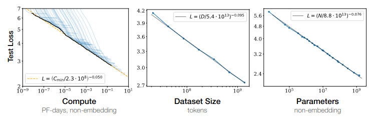

# 1.4 Scaling {: #04 }

    

        <i class="fas fa-clock"></i>
        19 min read
    

    

        <i class="fas fa-file-alt"></i> 
        3752 words
    

In the previous section, we explored how we can measure AI capabilities along continuous dimensions of performance and generality. Now we'll examine one of the most important drivers behind improvements in these capabilities: scale.

## 1.4.1 The Bitter Lesson {: #01 }

We assume that most of you probably went to university in an era where machine learning and AI roughly mean the same thing, or rather deep learning and AI mean the same thing. This hasn't always been true. Early in the history of artificial intelligence, researchers took very different approaches to creating intelligent systems. They believed that the key to artificial intelligence was carefully encoding human knowledge and expertise into computer programs. This led to things like expert systems filled with hand-crafted rules and chess engines programmed with sophisticated strategic principles. However, time and time again, researchers learned what we now call the bitter lesson.

!!! quote "The Bitter Lesson ([Sutton, 2019](http://www.incompleteideas.net/IncIdeas/BitterLesson.html))"

    The biggest lesson that can be read from 70 years of AI research is that general methods that leverage computation are ultimately the most effective, and by a large margin. [...] The bitter lesson is based on the historical observations that 1) AI researchers have often tried to build knowledge into their agents, 2) this always helps in the short term, and is personally satisfying to the researcher, but 3) in the long run it plateaus and even inhibits further progress, and 4) breakthrough progress eventually arrives by an opposing approach based on scaling computation by search and learning.

**What makes this lesson bitter?** The bitterness comes from discovering that decades of careful human engineering and insight were ultimately less important than simple algorithms plus computation. In chess, researchers who had spent years encoding grandmaster knowledge watched as "brute force" search-based approaches like Deep Blue defeated world champion Garry Kasparov. In computer vision, hand-crafted feature detectors were outperformed by convolutional neural networks that learned their own features from data. In speech recognition, systems based on human understanding of phonetics were surpassed by statistical approaches using hidden Markov models ([Sutton, 2019](http://www.incompleteideas.net/IncIdeas/BitterLesson.html)).

**Does the bitter lesson mean we don't need any human engineering?** Human ingenuity playing a smaller role in improving AI is a subtle point that can be easily misunderstood. The transformer architecture for example might seem to contradict the bitter lesson because they rely on sophisticated architectural innovations. Human ingenuity is important, but the subtlety is in recognizing that there's a difference between two types of human engineering:

- **Algorithm-level improvements:** These make better use of existing compute, like: better optimizers (Adam), architecture innovations (transformers, attention mechanisms) or training approaches (better learning rate schedules).

- **Domain-specific engineering improvements:** These try to encode human knowledge, like: special architectures designed for specific problems, hand-crafted features or rules or task-specific inductive biases.

The bitter lesson isn't arguing against all human engineering - it's specifically cautioning against the second type. The transformer architecture exemplifies this pattern - it doesn't encode any specific knowledge about language, but rather provides a general mechanism for learning patterns that becomes increasingly powerful as we scale up compute and data.

**What does the bitter lesson mean for AI Safety?** In the previous section, we discussed measuring AI capabilities along continuous dimensions of performance and generality. If it is the case that these continue to advance primarily through scaling, then we may have more predictable trajectories. This creates both opportunities and risks because performance and generality will continue to rise as long as scale is all that we need, but it also means that forecasting AI development trajectories and preparing appropriate safety measures for predictable capability levels is possible.

## 1.4.2 Scaling Laws {: #02 }

**Why do AI labs care about scaling laws?** Training large AI models is extremely expensive - potentially hundreds of millions of dollars for frontier models. Scaling laws help labs make crucial decisions about resource allocation: Should they spend more on GPUs or on acquiring training data? Should they train a larger model for less time or a smaller model for longer? For example, with a fixed compute budget, they might need to choose between training a 20-billion parameter model on 40% of their data or a 200-billion parameter model on just 4%. Getting these tradeoffs wrong can waste enormous resources. So it is important to be able to have a predictable relationship between how you invest your money and what level of capabilities you get at the end.

<figure markdown="span">
{ loading=lazy }
  <figcaption markdown="1"><b>Figure 1.21:</b> Example of capabilities increasing with an increase with one of variables in the scaling laws - parameter count. The same model architecture (Parti) was used to generate an image using an identical prompt, with the only difference between the models being the parameter size. There are noticeable leaps in quality, and somewhere between 3 billion and 20 billion parameters, the model acquires the ability to spell words correctly. ([Yu et al., 2022](https://arxiv.org/abs/2206.10789))</figcaption>
</figure>

**What are scaling laws?** Scaling laws are mathematical relationships that describe how an AI system's performance changes as we vary key inputs like model size, dataset size, and computing power. These are empirical power-law relationships that have been observed to hold across many orders of magnitude. The key variables involved are:

**Compute (C)**: This represents the total processing power used during training, measured in floating-point operations (FLOPs). Think of this as the training "budget" - more compute means either training for longer, using more powerful hardware, or both. While having more GPUs helps increase compute capacity, compute ultimately refers to the total number of operations performed, not just hardware.

**Parameters (N)**: These are the tunable numbers in the model that get adjusted during training - like knobs that the model can adjust to better fit the data. More parameters allow the model to learn more complex patterns but require more compute per training step. Current frontier models have hundreds of billions of parameters.

**Dataset size (D)**: This measures how many examples the model trains on (typically measured in tokens for language models). The larger the dataset, the more information the model can read. Simultaneously, to read and learn from more data, the training runs also need to be generally longer, which in turn increases the total compute needed before the model can be considered “trained”.

**Loss (L)**: This measures how well the model performs on its training objective. This is what we are trying to minimize, and it tends to improve as we scale up these variables.

<figure markdown="span">
{ loading=lazy }
  <figcaption markdown="1"><b>Figure 1.22:</b> Language modeling performance improves smoothly as we increase the model size, datasetset

size, and amount of compute used for training. For optimal performance all three factors must be scaled up in tandem. Empirical performance has a power-law relationship with each individual factor when not bottlenecked by the other two. ([Kaplan et al., 2020](https://arxiv.org/abs/2001.08361))</figcaption>
</figure>

**OpenAI's initial scaling laws in 2020**. To determine the relationships between different variables that might contribute to scale, OpenAI conducted a series of experiments. For an intuitive idea of how they came up with the scaling laws, you can imagine that while training a model you can hold some variables fixed while varying others and see how loss changes. Eventually this allows you to see some patterns. As an example, dataset size can be kept constant, while parameter count and training time are varied, or parameter count is kept constant and data amounts are varied, etc… So we can get a measurement of the relative contribution of each towards overall performance. If these relationships hold true across many different model architectures and tasks, then this suggests they capture something fundamental about deep learning systems. This is how the first generation of scaling laws came about from OpenAI. For example, by these laws if you have a 10x more compute, you should increase model size by about 5x and data size by only 2x.  ([Kaplan et al., 2020](https://arxiv.org/abs/2001.08361))

<figure markdown="span">
{ loading=lazy }
  <figcaption markdown="1"><b>Figure 1.23:</b> OpenAIs initial paper on scaling laws stated that for optimally compute-efficient training, most of the increase should go towards increased model size. A relatively small increase in data is needed to avoid reuse. ([Kaplan et al., 2020](https://arxiv.org/abs/2001.08361))</figcaption>
</figure>

<figure class="iframe-figure" markdown="span">
<iframe src="https://ourworldindata.org/grapher/exponential-growth-of-parameters-in-notable-ai-systems?tab=chart" loading="lazy" style="width: 100%; height: 600px; border: 0px none;" allow="web-share; clipboard-write"></iframe>
  <figcaption markdown="1"><b>Interactive Figure 1.8:</b> Growth of parameters ([Giattino et al., 2023](https://ourworldindata.org/artificial-intelligence))</figcaption>
</figure>

<figure class="iframe-figure" markdown="span">
<iframe src="https://ourworldindata.org/grapher/exponential-growth-of-datapoints-used-to-train-notable-ai-systems?tab=chart" loading="lazy" style="width: 100%; height: 600px; border: 0px none;" allow="web-share; clipboard-write"></iframe>
  <figcaption markdown="1"><b>Interactive Figure 1.9:</b> Growth of Data ([Giattino et al., 2023](https://ourworldindata.org/artificial-intelligence))</figcaption>
</figure>

<figure class="iframe-figure" markdown="span">
<iframe src="https://ourworldindata.org/grapher/exponential-growth-of-computation-in-the-training-of-notable-ai-systems?tab=chart" loading="lazy" style="width: 100%; height: 600px; border: 0px none;" allow="web-share; clipboard-write"></iframe>
  <figcaption markdown="1"><b>Interactive Figure 1.10:</b> Growth of Compute ([Giattino et al., 2023](https://ourworldindata.org/artificial-intelligence))</figcaption>
</figure>

<figure class="iframe-figure" markdown="span">
<iframe src="https://ourworldindata.org/grapher/artificial-intelligence-training-computation?tab=chart" loading="lazy" style="width: 100%; height: 600px; border: 0px none;" allow="web-share; clipboard-write"></iframe>
  <figcaption markdown="1"><b>Interactive Figure 1.11:</b> Compute used to train AI ([Giattino et al., 2023](https://ourworldindata.org/artificial-intelligence))</figcaption>
</figure>

**DeepMind's scaling law update in 2022**. DeepMind found that most large language models were actually significantly overparameterized for the amount of data they were trained on. The Chinchilla scaling laws showed that for optimal performance, models should be trained on approximately 20 times more data tokens than they have parameters. This meant that many leading models could have achieved better performance with smaller sizes, but with more data. They were called chinchilla scaling laws because the laws were demonstrated using a model called Chinchilla. This was a 70B parameter model trained on more data, which outperformed much larger models like Gopher (280B parameters) despite using the same amount of compute. So by these laws, for optimal performance, you should increase model size and dataset size in roughly equal proportions - if you get 10x more compute, you should make your model ~3.1x bigger and your data ~3.1x bigger. ([Hoffmann et al., 2022](https://arxiv.org/abs/2203.15556))

**The Broken Neural Scaling Laws (BNSL) update in 2023**. Ongoing research showed that performance doesn't always improve smoothly - there can be sharp transitions, temporary plateaus, or even periods where performance gets worse before getting better. Examples of this include things like "Grokking", where models suddenly achieve strong generalization after many training steps, or deep double descent, where increasing model size initially hurts then helps performance. Rather than simple power laws, BNSL uses a more flexible functional form that can capture these complex behaviors. This allows for more accurate predictions of scaling behavior, particularly around discontinuities and transitions. Scaling laws are a good baseline, but discontinuous jumps in capabilities and abrupt step changes are still possible. ([Caballero et al., 2023](https://arxiv.org/abs/2210.14891))

<figure markdown="span">
{ loading=lazy }
  <figcaption markdown="1"><b>Figure 1.24:</b> A Broken Neural Scaling Law example (dark black solid line) (with 3 breaks where purple dotted lines intersect with dark black solid line) that contains 4 individual power law segments (where the dashed lines that are yellow, blue, red, and green overlap with the dark black solid line). The 1st and 2nd break are very smooth; the 3rd break is very sharp. ([Caballero et al., 2023](https://arxiv.org/abs/2210.14891))</figcaption>
</figure>

**How do training and inference scaling differ?** Training scaling involves using more compute during initial model training by using larger models, training for longer, or using bigger datasets. Another way that we might not be accounting for using scaling laws, is called inference time scaling. This instead uses more compute at runtime through techniques like chain-of-thought prompting, repeated sampling, or tree search. For example, you can either train a very large model that generates high-quality outputs directly, or train a smaller model that achieves similar performance by using more computation to think through problems step by step at inference time.

<!--

To add: limits of predictability of scaling behavior

-->

## 1.4.3 Scaling Hypothesis {: #03 }

!!! info "Strong Scaling Hypothesis ([Branwen, 2020](https://gwern.net/scaling-hypothesis))"

    The strong scaling hypothesis proposes that simply scaling up current foundation model architectures with more compute and data will be sufficient to reach transformative AI capabilities and potentially even ASI.

<figure class="iframe-figure" markdown="span">
<iframe src="https://ourworldindata.org/grapher/ai-performance-knowledge-tests-vs-training-computation?tab=chart" loading="lazy" style="width: 100%; height: 600px; border: 0px none;" allow="web-share; clipboard-write"></iframe>
  <figcaption markdown="1"><b>Interactive Figure 1.12:</b> Knowledge Tests vs Compute used in training ([Giattino et al., 2023](https://ourworldindata.org/artificial-intelligence))</figcaption>
</figure>

**What is the strong scaling hypothesis?** This view suggests we already have all the fundamental components needed - it's just a matter of making them bigger, following established scaling laws. ([Branwen, 2020](https://gwern.net/scaling-hypothesis)) There is heated debate around this hypothesis and we can't possibly cover every argument. We can give you a slight overview in the next few paragraphs.

Proponents include OpenAI ([OpenAI, 2023](https://openai.com/blog/planning-for-agi-and-beyond)), Anthropic’s CEO Dario Amodei ([Amodei, 2023](https://www.dwarkeshpatel.com/p/dario-amodei)), Conjecture ([Conjecture, 2023](https://www.lesswrong.com/posts/PE22QJSww8mpwh7bt/agi-in-sight-our-look-at-the-game-board)), DeepMind’s safety team ([DeepMind, 2022](https://www.lesswrong.com/posts/GctJD5oCDRxCspEaZ/clarifying-ai-x-risk)), and others. According to the DeepMind team, there are "*not many more fundamental innovations needed for AGI. Scaled-up deep learning foundation models with RL from human feedback (RLHF) fine-tuning [should suffice]*" ([DeepMind, 2022](https://www.lesswrong.com/posts/GctJD5oCDRxCspEaZ/clarifying-ai-x-risk)).

**What are the key arguments supporting the strong scaling hypothesis?** The most compelling evidence for this view comes from empirical observations of progress in recent years. Researchers have been developing algorithms that follow the bitter lesson's principle for many years (focusing on general methods that leverage compute effectively). But even when researchers have developed sophisticated algorithms following the bitter lesson's principles, these improvements still only account for 35% of performance gains in language models in 2024, with the remaining 65% coming purely from increased scale in compute and data ([Ho et al., 2024](https://arxiv.org/abs/2403.05812)). Basically, even when our algorithmic improvements align perfectly with the bitter lesson, they're still far less important than raw scaling.

The emergence of unexpected capabilities provides another powerful argument for strong scaling. We've seen previous generations of foundation models demonstrate remarkable abilities that weren't explicitly trained for, like programming for example. This emergent behavior hints that it is not impossible for higher-order metacognitive abilities like causal reasoning to similarly emerge simply as a function of scale. We see that bigger models become increasingly sample efficient - they require fewer examples to learn new tasks. This improved efficiency with scale suggests that scaling up further could eventually lead to human-like few-shot learning capabilities, which is a precursor for TAI and ASI. Finally,  these models also appear to be capable of learning any task that can be expressed through their training modalities. Right now this is text for LLMs but there is a clear path forward to multimodal LMMs. Since text can express virtually any human-comprehensible task, scaling up language understanding might be sufficient for general intelligence.

**What are the key arguments against the strong scaling hypothesis? **Recent research has also identified several challenges to the strong scaling hypothesis. The most immediate is data availability - language models will likely exhaust high-quality public text data between 2026 and 2032 ([Villalobos et al., 2024](https://arxiv.org/abs/2211.04325)). While synthetic data might help address this limitation, it's unclear whether it can provide the same quality of learning signal as organic human-generated content. Alternatively, we still have a lot of multi-modal data left to train on (like YouTube videos) despite running out of text data.

A more fundamental challenge comes from the way these models work. LLMs are fundamentally "interpolative databases" (or stochastic parrots , or a variety of other similar terms). The point being that they just build up a vast collection of vector transformations through pre-training. While these transformations become increasingly sophisticated with scale, critics argue there's a fundamental difference between recombining existing ideas and true synthesis - deriving novel solutions from first principles. However, this is not an airtight case against strong scaling. This could simply be a limitation of current scale - a larger model trained on multimodal data might learn to handle any new novel situation simply as a recombination of previously memorized patterns. So, it is unclear if template recombination actually does have an upper bound.

!!! info "Weak Scaling Hypothesis ([Branwen, 2020](https://gwern.net/scaling-hypothesis))"

    The weak scaling hypothesis proposes that even though scale will continue to be the primary driver of progress, we will also need targeted architectural and algorithmic improvements to overcome specific bottlenecks.

**What is the weak scaling hypothesis?** Given these challenges, a weaker version of the scaling hypothesis has also been proposed. According to the weak scaling hypothesis even though scale will continue to be the primary driver of progress, we will also need targeted architectural and algorithmic improvements to overcome specific bottlenecks. These improvements wouldn't require fundamental breakthroughs, but rather incremental enhancements to better leverage scale. ([Branwen, 2020](https://gwern.net/scaling-hypothesis)) Similar to the strong scaling hypothesis, the weak one is also contentious and debated. We can provide a few of the results arguing both for and against this outlook.

LeCun's H-Jepa architecture ([LeCun, 2022](https://openreview.net/pdf?id=BZ5a1r-kVsf)), or Richard Sutton’s Alberta Plan ([Sutton, 2022](https://arxiv.org/abs/2208.11173)) are notable plans that might support the weak scaling hypothesis.

**What are the key arguments supporting the weak scaling hypothesis? **The arguments for strong scaling, like algorithmic improvements only contributing 35% of performance gains in language models can also double count for weak scaling. Since one third is still a non-trivial role to play in capabilities improvement. Some more empirical observations also support weak scaling. Like hardware support for lower-precision calculations, which provided order-of-magnitude performance improvements for machine learning workloads (Hobbhahn et al., 2023, "Trends in Machine Learning Hardware"). These kinds of targeted improvements don't change the fundamental scaling story but rather help us better leverage available resources. Similarly, the Chinchilla results showed that many models were poorly optimized along the different variables that contribute to capabilities. This suggests that there is still room for improvement through better scaling strategies rather than fundamental breakthroughs. ([Hoffmann et al., 2022](https://arxiv.org/abs/2203.15556))

<figure markdown="span">
{ loading=lazy }
  <figcaption markdown="1"><b>Figure 1.25:</b> Augmentation/Scaffolding stays constant, but if the scaling hypothesis, weak or strong, is true, then capabilities will keep improving just by scaling.</figcaption>
</figure>

**What if neither the weak nor the strong scaling hypothesis is true?** Essentially, both the scaling laws (which only predict foundation model capabilities) and most debates around "scale is all you need" often miss other aspects of AI development that happen outside the scope of what scaling laws can predict. They don't account for improvements in AI "scaffolding" (like chain-of-thought prompting, tool use, or retrieval), or combinations of multiple models working together in novel ways. Debates around the scaling laws only tell us about the capabilities of a single foundation model trained in a standard way. For example, by the strong scaling hypothesis we can reach TAI by simply scaling up the same foundation model until meta cognitive abilities emerge. But even if scaling stops, halting capabilities progress on the core foundation model (in either a weak or a strong way), the external techniques that leverage the existing model can still continue advancing.

Think of foundation models like LLMs or LMMs as simply one transistor. Alone they might not be able to do much, but if we combine enough transistors we end up with all the capabilities of a supercomputer. Many researchers think that this is a core element where future capabilities will come from. It is also referred to as "unhobbling" ([Aschenbrenner, 2024](https://situational-awareness.ai/from-gpt-4-to-agi/#Unhobbling)), "schlep" ([Cotra, 2023](https://www.planned-obsolescence.org/scale-schlep-and-systems/)) and various other terms, but all of them point to the same underlying principle - raw scaling of single model performance is only one part of overall AI capability advancement.

<figure markdown="span">
{ loading=lazy }
  <figcaption markdown="1"><b>Figure 1.26:</b> Even if we see no improvements in model scale, other elicitation techniques and scaffolding can keep improving. So overall capabilities keep growing. Realistically, the future is probably going to see both improvement due to scaffolding and scale. So for now, there does not seem to be an upper limit on improving capabilities as long as either one of the two holds.</figcaption>
</figure>

We go deeper into the arguments and counterarguments for all views on scaling foundation models in the appendix.

??? note "Argument: Against scaling - Memorization vs Synthesis"

    !!! warning "This is a slightly deeper dive into trying to understand the argument of both sides if you are interested. It is slightly more technical, and can be safely skipped."

    When we talk about LLMs as "interpolative databases", we're referring to how they store and manipulate vector programs - these shouldn’t be confused with traditional computer programs like python or C++. These templates, or vector programs are transformations in the model's embedding space. Early work on embeddings showed simple transformations (like king - man + woman = queen), but modern LLMs can store millions of much more complex transformations. But due to a function of scale, LLMs can now store arbitrarily complex vector functions — so complex, in fact, that researchers found it more accurate to refer to them as vector programs rather than functions.

    So what's happening in LLMs is that they build up a vast database of these vector programs through pre-training. When we say they're doing "template matching" or "memorization", what we really mean is that they're storing millions of these vector transformations that they can retrieve and combine with each prompt.

    So the deciding question for/against strong (and even weak scaling) becomes - Is this type of template program combination enough to reach general intelligence. In other words can program synthesis be approximated using recombinations of enough templates (also called abstractions and many other words but the key idea is the same)?

    People who argue against this say that no matter how numerous or sophisticated, are fundamentally different from true program synthesis. True program synthesis would mean deriving a new solution from first principles - not just recombining existing transformations. There are some empirical observations to support this view. Like the Caesar cipher example: "LLMs can solve a Caesar cipher with key size 3 or 5, but fail with key size 13, because they've memorized specific solutions rather than understanding the general algorithm" ([Chollet, 2024](https://www.youtube.com/watch?v=nL9jEy99Nh0)). Or alternatively, the "reversal curse" which shows that even SOTA language models in 2024 cannot do reverse causal inference - if they are trained on "A is B" they fail to learn "B is A" ([Berglund et al., 2023](https://arxiv.org/abs/2309.12288))

    But this does still not seem to completely invalidate scaling as of yet. If we scale up the size of the program database and cram more knowledge and patterns into it, we are going to be increasing its performance. ([Chollet, 2024](https://www.dwarkeshpatel.com/p/francois-chollet)) Both sides of the debate agree on this. So this suggests the real issue isn't whether template recombination has an obvious absolute upper bound, but whether it's the most efficient path to general intelligence. Program synthesis might achieve the same capabilities with far less compute and data by learning to derive solutions rather than memorizing patterns.

    ❧

