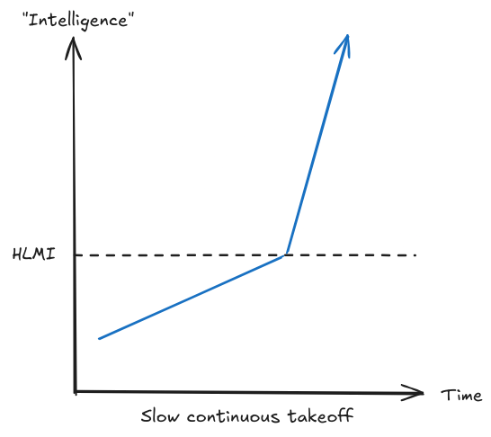
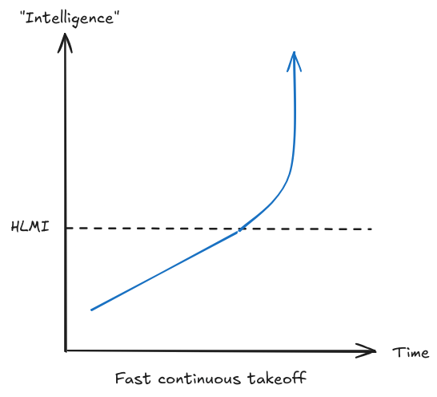
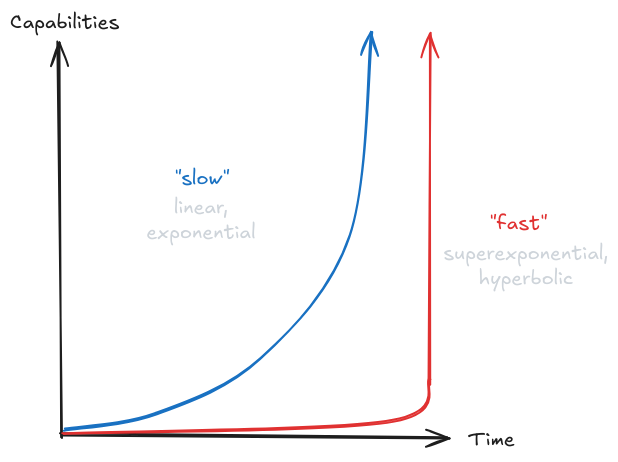
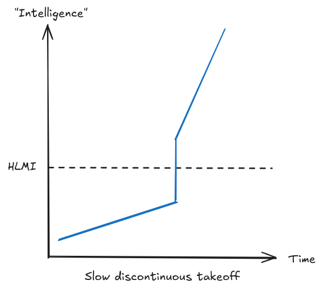
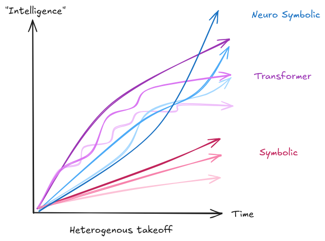
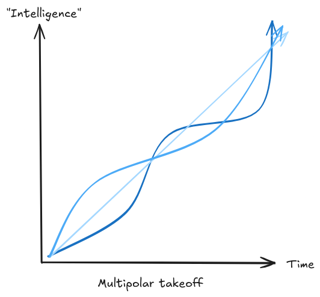
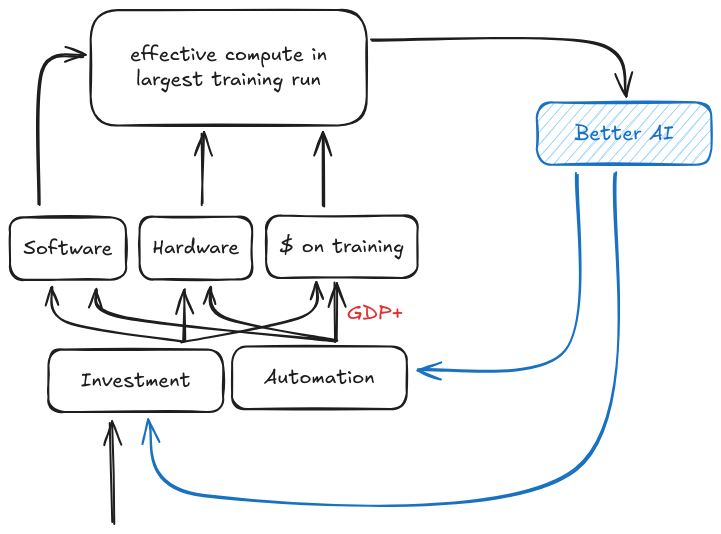

# 1.6 Takeoff {: #06 }

    

        <i class="fas fa-clock"></i>
        22 min read
    

    

        <i class="fas fa-file-alt"></i> 
        4317 words
    

**What are takeoff speeds?** Before we can talk about different types of AI takeoff, we need to understand what takeoff speed even means. Takeoff speed refers to how quickly AI systems become dramatically more powerful than they are today and cause major societal changes. This is related to, but distinct from, AI timelines (how long until we develop advanced AI). While timelines tell us when transformative AI might arrive, takeoff speeds tell us what happens after it arrives - does AI capability and impact increase gradually over years, or explosively over days or weeks?

**How can we think about different takeoff speeds?** When analyzing different takeoff scenarios, we can look at several key factors:

- **Speed**: How quickly do AI capabilities improve?

- **Continuity**: Do capabilities improve smoothly or in sudden jumps?

- **Homogeneity**: How similar are different AI systems to each other?

- **Polarity**: How concentrated is power among different AI systems?

Let's discuss each of these factors and what they tell us about potential takeoff scenarios. This will help us better understand the ongoing debate about how transformative AI might develop.

## 1.6.1 Speed {: #01 }

**What is a slow takeoff?** In a slow takeoff scenario, AI capabilities improve gradually over months or years. We can see this pattern in recent history - the transition from GPT-3 to GPT-4 brought significant improvements in reasoning, coding, and general knowledge, but these advances happened over several years through incremental progress. Paul Christiano describes slow takeoff as similar to the Industrial Revolution but "10x-100x faster" ([Davidson, 2023](https://www.alignmentforum.org/posts/Nsmabb9fhpLuLdtLE/takeoff-speeds-presentation-at-anthropic)). Terms like "slow takeoff" and "soft takeoff" are often used interchangeably.

In mathematical terms, slow takeoff scenarios typically show linear or exponential growth patterns. With linear growth, capabilities increase by the same absolute amount each year - imagine an AI system that gains a fixed number of new skills annually. More commonly, we might see exponential growth, where capabilities increase by a constant percentage, similar to how we discussed scaling laws in earlier sections. Just as model performance improves predictably with compute and data, slow takeoff suggests capabilities would grow at a steady but manageable rate. This might manifest as GDP growing at 10-30% annually before accelerating further.

The key advantage of slow takeoff is that it provides time to adapt and respond. If we discover problems with our current safety approaches, we can adjust them before AI becomes significantly more powerful. This connects directly to what we'll discuss in later chapters about governance and oversight - slow takeoff allows for iterative refinement of safety measures and gives time for coordination between different actors and institutions.

<figure markdown="span">
{ loading=lazy }
  <figcaption markdown="1"><b>Figure 1.31:</b> An illustration of slow continuous takeoff. ([Martin & Eth, 2021](https://www.alignmentforum.org/posts/pGXR2ynhe5bBCCNqn/takeoff-speeds-and-discontinuities))</figcaption>
</figure>

**What is a fast takeoff?** Fast takeoff describes scenarios where AI capabilities increase dramatically over very short periods - perhaps days or even hours. Instead of the gradual improvement we saw from GPT-3 to GPT-4, imagine an AI system making that much progress every day. This could happen through recursive self-improvement, where an AI system becomes better at improving itself, creating an accelerating feedback loop.

Mathematically, fast takeoff involves superexponential or hyperbolic growth, where the growth rate itself increases over time. Rather than capabilities doubling every year as in exponential growth, they might double every month, then every week, then every day. This relates to what we discussed in the scaling section about potential feedback loops in AI development - if AI systems can improve the efficiency of AI research itself, we might see this kind of accelerating progress.

The dramatic speed of fast takeoff creates unique challenges for safety. As we'll explore in the chapter on strategies, many current safety approaches rely on testing systems, finding problems, and making improvements. But in a fast takeoff scenario, we might only get one chance to get things right. If an AI system starts rapidly self-improving, we need safety measures that work robustly from the start, because we won't have time to fix problems once they emerge.

Terms like "fast takeoff", "hard takeoff" and "FOOM" are often used interchangeably.

<figure markdown="span">
{ loading=lazy }
  <figcaption markdown="1"><b>Figure 1.32:</b> An illustration of fast continuous takeoff, which is usually taken to mean superexponential or hyperbolic growth. The growth rate itself increases. ([Martin & Eth, 2021](https://www.alignmentforum.org/posts/pGXR2ynhe5bBCCNqn/takeoff-speeds-and-discontinuities))</figcaption>
</figure>

**Why does takeoff speed matter for AI risk?** The speed of AI takeoff fundamentally shapes the challenge of making AI safe. This connects directly to what we discussed about scaling laws and trends - if progress follows predictable patterns as our current understanding suggests, we might have more warning and time to prepare. But if new mechanisms like recursive self-improvement create faster feedback loops, we need different strategies.

A concrete example helps illustrate this: Today, when we discover that language models can be jailbroken in certain ways, we can patch these vulnerabilities in the next iteration. In a slow takeoff, this pattern could continue - we'd have time to discover and fix safety issues as they arise. But in a fast takeoff, we might need to solve all potential jailbreaking vulnerabilities before deployment, because a system could become too powerful to safely modify before we can implement fixes.

<figure markdown="span">
{ loading=lazy }
  <figcaption markdown="1"><b>Figure 1.33:</b> Comparison of "slow" vs "fast" takeoff. Showcasing that while described as linguistically slower than fast, it is by no means "slow". ([Christiano, 2018](https://sideways-view.com/2018/02/24/takeoff-speeds/))</figcaption>
</figure>

## 1.6.2 Continuity {: #02 }

**What is takeoff continuity?** Continuity describes whether AI capabilities improve smoothly and predictably or through sudden, unexpected jumps. This is different from speed - even a fast takeoff could be continuous if the rapid progress follows predictable patterns, and a slow takeoff could be discontinuous if it involves surprising breakthroughs. Understanding continuity helps us predict whether we can extrapolate from current trends, like the scaling laws we discussed earlier, or if we should expect sudden departures from these patterns. So if you think of speed as a measure of how quickly the AI becomes superintelligent, continuity can be thought of as a measure of "surprise".

**What is a continuous takeoff?** In a continuous takeoff, AI capabilities follow smooth, predictable trends. The improvements we've seen in language models provide a good example - each new model tends to be somewhat better than the last at tasks like coding or math, following patterns we can roughly predict from scaling laws and algorithmic improvements. As we saw in the forecasting section, many aspects of AI progress have shown this kind of predictable behavior.

Continuous progress doesn't mean linear or simple progress. It might still involve exponential or even superexponential growth, but the key is that this growth follows patterns we can anticipate. Think of how GPT-4 is better than GPT-3, which was better than GPT-2 - each improvement was significant but not completely surprising given the increase in scale and improved training techniques.

A continuous takeoff suggests that current trends in scaling laws and algorithmic progress might extend even to transformative AI systems. This would give us more warning about upcoming capabilities and more ability to prepare appropriate safety measures. As we'll discuss in the governance chapter, even though progress is fast, this kind of predictability makes it comparatively easier to develop and implement regulation before AI systems become extremely powerful or uncontrollable. Keeping in mind of course that comparatively easier does not mean "easy".

**What is a discontinuous takeoff?** A discontinuous takeoff involves sudden jumps in capability that break from previous patterns. Instead of steady improvements in performance as we add compute or data, we might see the emergence of entirely new capabilities that weren't predicted by existing trends. One hypothetical example would be if an AI system suddenly developed robust general reasoning capabilities after appearing to only handle narrow tasks - this would represent a discontinuity in the pattern of AI development.

Discontinuities could arise through various mechanisms. We might discover fundamentally new training approaches that are dramatically more efficient than current methods. Or, as we discussed in the scaling section, we might hit tipping points where quantitative improvements in scale lead to qualitative changes in capability. An AI system might even discover such improvements about itself, leading to unexpected jumps in capability.

The historical record provides some precedent for both continuous and discontinuous scientific progress. The development of nuclear weapons represented a discontinuous jump in explosive power, while improvements in computer processing power have followed more continuous trends. However, as we saw in the forecasting section, technological discontinuities have historically been rare, which some researchers cite as evidence favoring continuous takeoff scenarios.

The terms 'fast takeoff' and 'discontinuous takeoff' are often used interchangeably. However, the images below displaying different takeoff trajectories might help in clarifying the subtle differences between the concepts.

**Why does continuity matter for AI safety?** The continuity of AI progress has crucial implications for how we approach safety. In a continuous takeoff, we can more reliably test safety measures on less capable systems and be more confident they'll work on more advanced ones. We can also better predict when we'll need different safety measures and plan accordingly.

<figure markdown="span">
{ loading=lazy }
  <figcaption markdown="1"><b>Figure 1.34:</b> One example illustration of slow discontinuous takeoff, where even though progress keeps increasing we might see sudden "jumps" in progress. ([Martin & Eth, 2021](https://www.alignmentforum.org/posts/pGXR2ynhe5bBCCNqn/takeoff-speeds-and-discontinuities))</figcaption>
</figure>

<figure markdown="span">
{ loading=lazy }
  <figcaption markdown="1"><b>Figure 1.35:</b> One example illustration of fast discontinuous takeoff. Even though progress keeps accelerating, in addition to that we might also see sudden "jumps" in progress. ([Martin & Eth, 2021](https://www.alignmentforum.org/posts/pGXR2ynhe5bBCCNqn/takeoff-speeds-and-discontinuities))</figcaption>
</figure>

## 1.6.3 Similarity {: #03 }

**What is takeoff homogeneity?** Homogeneity describes how similar or different AI systems are to each other during the takeoff period. Will we see many diverse AI systems with different architectures and capabilities, or will most advanced AI systems be variations of the same basic design? This isn't just about technical diversity - it's about whether advanced AI systems will share similar behaviors, limitations, and safety properties. ([Hubinger, 2020](https://www.alignmentforum.org/posts/mKBfa8v4S9pNKSyKK/homogeneity-vs-heterogeneity-in-ai-takeoff-scenarios))

**What is a homogeneous takeoff?** In a homogeneous takeoff, most advanced AI systems would be fundamentally similar. We can see hints of this pattern today - many current language models are based on the transformer architecture and trained on similar data, leading to similar capabilities and limitations. In a homogeneous takeoff, this pattern would continue. Perhaps most AI systems would be fine-tuned versions of a few base models, or different implementations of the same core breakthrough in AI design.

A key factor that could drive homogeneity is the sheer scale required to train advanced AI systems. If training transformative AI requires massive compute resources, as scaling laws suggest, then only a few organizations might be capable of training base models from scratch. Other organizations would build on these base models rather than developing entirely new architectures, leading to more homogeneous systems.

Homogeneous takeoff could be safer in some ways but riskier in others. If we solve alignment for one AI system, that solution might work for other similar systems. However, if there's a fundamental flaw in the common architecture or training approach, it could affect all systems simultaneously. It's like having a monoculture in agriculture - while easier to manage, it's also more vulnerable to shared weaknesses.

<figure markdown="span">
{ loading=lazy }
  <figcaption markdown="1"><b>Figure 1.36:</b> An illustration of homogeneous takeoff. We can see multiple different overarching model architectures. The figure shows three in different colors. Within each architecture the takeoff is roughly the same due to similarity in design, regulations, and safety mitigations. **NOTE**: The curves here with architectures are purely illustrative, and are not meant to indicate predicted growth trajectories and comparisons between different architectures.</figcaption>
</figure>

**What is a heterogeneous takeoff?** In a heterogeneous takeoff, we'd see significant diversity among advanced AI systems. Different organizations might develop fundamentally different approaches to AI, leading to systems with distinct strengths, weaknesses, and behaviors. Some might be specialized for specific domains while others are more general, some might be more transparent while others are more opaque, some might be more aligned with human values while others might not be. Competitive dynamics among AI projects could exacerbate diversity, as teams race to achieve breakthroughs without necessarily aligning on methodologies or sharing crucial information. As an example, we might have a future where AI becomes a strategic national asset, and AI development is closely guarded. In this environment, the pursuit of AI capabilities becomes siloed, each company or country would then employ different development methodologies, potentially leading to a wide range of behaviors, functionalities, and safety levels.

Heterogeneous takeoff creates different challenges for safety. We'd need to develop safety measures that work across diverse systems, and we couldn't necessarily apply lessons learned from one system to others. However, diversity might provide some protection against systemic risks - if one approach proves dangerous, alternatives would still exist.

**How does takeoff homogeneity affect the broader picture?** The degree of homogeneity during takeoff has significant implications for how transformative AI might develop. In a homogeneous scenario, progress might be more predictable but also more prone to winner-take-all dynamics. A heterogeneous scenario might be more robust against single points of failure but harder to monitor and control.

<figure markdown="span">
{ loading=lazy }
  <figcaption markdown="1"><b>Figure 1.37:</b> One example of heterogeneous takeoff. We can see multiple different overarching model architectures. The figure shows three in different colors. Within each architecture the takeoff is different due to differences in design, regulations, and safety mitigations. **NOTE**: The curves here with architectures are purely illustrative, and are not meant to indicate predicted growth trajectories and comparisons between different architectures.</figcaption>
</figure>

## 1.6.4 Polarity {: #04 }

**What is takeoff polarity?** Polarity describes whether power and capability becomes concentrated in a single AI system or organization, or remains distributed among multiple actors. In other words, will one AI system or group pull dramatically ahead of all others, or will multiple AI systems advance in parallel with comparable capabilities?

**What is a unipolar takeoff?** In a unipolar takeoff, one AI system or organization gains a decisive lead over all others. This could happen through a single breakthrough, exceptional scaling advantages, or recursive self-improvement. For example, if one AI system becomes capable enough to substantially accelerate its own development, it might rapidly outpace all other systems. The mathematics of training compute provide one path to a unipolar outcome. If a doubling of compute leads to reliable improvements in capability, then an organization that gets far enough ahead in acquiring compute could maintain or extend their lead. Their improved systems could then help them develop even better training methods, hardware, and attract investment creating a positive feedback loop that others can't match. But compute isn't the only path to unipolarity. A single organization might discover a fundamentally better training approach, or develop an AI system that's better at improving itself than at helping humans build alternatives. Once any actor gets far enough ahead, it might become practically impossible for others to catch up.

<figure markdown="span">
{ loading=lazy }
  <figcaption markdown="1"><b>Figure 1.38:</b> An illustration of unipolar takeoff. One model (dark blue here) significantly outperforms all others.</figcaption>
</figure>

**What is a multipolar takeoff?** In a multipolar takeoff, multiple AI systems or organizations develop advanced capabilities in parallel. This could look like several large labs developing different but comparably powerful AI systems, or like many actors having access to similar AI capabilities through open source models or AI services. Today's AI landscape shows elements of multipolarity - multiple organizations can train large language models, and techniques developed by one lab are often quickly adopted by others. A multipolar takeoff might continue this pattern, with multiple groups maintaining similar capabilities even as those capabilities become transformative. A unipolar scenario raises concerns about the concentration of power, while a multipolar world presents challenges in coordination among diverse entities or AI systems. Both unipolar and multipolar worlds have the potential for misuse of advanced AI capabilities by human actors.

<figure markdown="span">
{ loading=lazy }
  <figcaption markdown="1"><b>Figure 1.39:</b> An illustration of multipolar takeoff. No model significantly outperforms all others, and they all takeoff at a roughly competitive rate relative to each other.</figcaption>
</figure>

**Why does polarity matter?** The polarity of takeoff has major implications for both safety risks and potential solutions. In a unipolar scenario, the actions and alignment of a single system or organization become crucial - they might gain the ability to shape the long-term future unilaterally. This concentrates risk in a single point of failure, but might also make coordination easier since fewer actors need to agree. A multipolar scenario creates different challenges. Multiple advanced systems might act in conflicting ways or compete for resources. This could create pressure to deploy systems quickly or cut corners on safety. There's also an important interaction between polarity and the other aspects of takeoff we've discussed. A fast takeoff might be more likely to become unipolar, as the first system to make rapid progress could quickly outpace all others. A slow takeoff might tend toward multipolarity, giving more actors time to catch up to any initial leads.

**Factors Influencing Polarity**. Several key elements influence whether takeoff polarity leans towards a unipolar or multipolar outcome:

- Speed of AI Development: A rapid takeoff might favor a unipolar outcome by giving a significant advantage to the fastest developer. In contrast, a slower takeoff could lead to a multipolar world where many entities reach advanced capabilities more or less simultaneously.

- Collaboration vs. Competition: The degree of collaboration and openness in the AI research community can significantly affect takeoff polarity. High levels of collaboration and information sharing could support a multipolar outcome, while secretive or highly competitive environments might push towards unipolarity.

- Regulatory and Economic Dynamics: Regulatory frameworks and economic incentives also play a crucial role. Policies that encourage diversity in AI development and mitigate against the accumulation of too much power in any single entity's hands could foster a multipolar takeoff.

## 1.6.5 Takeoff Arguments {: #05 }

**The Overhang Argument**. There might be situations where there are substantial advancements or availability in one aspect of the AI system, such as hardware or data, but the corresponding software or algorithms to fully utilize these resources haven't been developed yet. The term 'overhang' is used because these situations imply a kind of 'stored’ or ‘latent’ potential. Once the software or algorithms catch up to the hardware or data, there could be a sudden unleashing of this potential, leading to a rapid leap in AI capabilities. Overhangs provide one possible argument for why we might favor discontinuous or fast takeoffs. There are two types of overhangs commonly discussed:

- **Hardware Overhang**: This refers to a situation where there is enough computing hardware to run many powerful AI systems, but the software to run such systems hasn't been developed yet. If such hardware could be repurposed for AI, this would mean that as soon as one powerful AI system exists, probably a large number of them would exist, which might amplify the impact of the arrival of human-level AI.

- **Data Overhang**: This would be a situation where there is an abundance of data available that could be used for training AI systems, but the AI algorithms capable of utilizing all that data effectively haven't been developed or deployed yet.

Overhangs are also used as a counter argument to why AI pauses do not affect takeoff. One counter argument to the overhang argument is that it relies on the assumption that during the time that we are pausing AI development, the rate of production of chips will remain constant. It could be argued that the companies manufacturing these chips will not make as many chips if data centers aren't buying them. However, this argument only works if the pause is for any appreciable length of time, otherwise the data centers might just stockpile the chips. It is also possible to make progress on improved chip design, without having to manufacture as many during the pause period. However, during the same pause period we could also make progress on AI safety techniques. ([Elmore, 2024](https://www.youtube.com/watch?v=Q3eRy4t2oPQ))

**The Economic Growth Argument**. Historical patterns of economic growth, driven by human population increases, suggest a potential for slow and continuous AI takeoff. This argument says that as AIs augment the effective economic population, we might witness a gradual increase in economic growth, mirroring past expansions but at a potentially accelerated rate due to AI-enabled automation. Limitations in AI's ability to automate certain tasks, alongside societal and regulatory constraints (e.g. that medical or legal services can only be rendered by humans), could lead to a slower expansion of AI capabilities. Alternatively, growth might far exceed historical rates. Using a similar argument for a fast takeoff hinges on AI's potential to quickly automate human labor on a massive scale, leading to unprecedented economic acceleration.

**Compute Centric Takeoff Argument**. This argument, similar to the Bio Anchors report, assumes that compute will be sufficient for transformative AI. Based on this assumption, Tom Davidson's 2023 report on compute-centric AI takeoff discusses feedback loops that may contribute to takeoff dynamics.

- **Investment feedback loop**: There might be increasing investment in AI, as AIs play a larger and larger role in the economy. This increases the amount of compute available to train models, as well as potentially leading to the discovery of novel algorithms. All of this increases capabilities, which drives economic progress, and further incentivizes investment.

- **Automation feedback loop**: As AIs get more capable, they will be able to automate larger parts of the work of coming up with better AI algorithms, or helping in the design of better GPUs. Both of these will increase the capability of the AIs, which in turn allow them to automate more labor.

Depending on the strength and interplay of these feedback loops, they can create a self-fulfilling prophecy leading to either an accelerating fast takeoff if regulations don't curtail various aspects of such loops, or a slow takeoff if the loops are weaker or counterbalanced by other factors. The entire model is shown in the diagram below:

<figure markdown="span">
{ loading=lazy }
  <figcaption markdown="1"><b>Figure 1.40:</b> A summary of What a Compute-Centric Framework Says About Takeoff Speeds ([Davidson, 2024](https://www.openphilanthropy.org/research/what-a-compute-centric-framework-says-about-takeoff-speeds/))</figcaption>
</figure>

**Automating Research Argument. **Researchers could potentially design the next generation of ML models more quickly by delegating some work to existing models, creating a feedback loop of ever-accelerating progress. The following argument is put forth by Ajeya Cotra:

Currently, human researchers collectively are responsible for almost all of the progress in AI research, but are starting to delegate a small fraction of the work to large language models. This makes it somewhat easier to design and train the next generation of models.

The next generation is able to handle harder tasks and more different types of tasks, so human researchers delegate more of their work to them. This makes it significantly easier to train the generation after that. Using models gives a much bigger boost than it did the last time around.

Each round of this process makes the whole field move faster and faster. In each round, human researchers delegate everything they can productively delegate to the current generation of models — and the more powerful those models are, the more they contribute to research and thus the faster AI capabilities can improve. ([Cotra, 2023](https://www.planned-obsolescence.org/ais-accelerating-ai-research/))

So before we see a recursive explosion of intelligence, we see a steadily increasing amount of the full RnD process being delegated to AIs. At some point, instead of a significant majority of the research and design being done by AI assistants at superhuman speeds, it will become that - all of the research and design for AIs is done by AI assistants at superhuman speeds.

At this point there is a possibility that this might eventually lead to a full automated recursive intelligence explosion.

**The Intelligence Explosion Argument**. This concept of the 'intelligence explosion' is also central to the conversation around discontinuous takeoff. It originates from I.J. Good's thesis, which posits that sufficiently advanced machine intelligence could build a smarter version of itself. This smarter version could in turn build an even smarter version of itself, and so on, creating a cycle that could lead to intelligence vastly exceeding human capability ([Yudkowsky, 2013](https://intelligence.org/files/IEM.pdf)).

In their 2012 report on the evidence for Intelligence Explosions, Muehlhauser and Salamon delve into the numerous advantages that machine intelligence holds over human intelligence, which facilitate rapid intelligence augmentation. ([Muehlhauser, 2012](https://intelligence.org/files/IE-EI.pdf)) These include:

- **Computational Resources**: Human computational ability remains somewhat stationary, whereas machine computation possesses scalability.

- **Speed**: Humans communicate at a rate of two words per second, while GPT-4 can process 32k words in an instant. Once LLMs can write "better" than humans, their speed will most probably surpass us entirely.

- **Duplicability**: Machines exhibit effortless duplicability. Unlike humans, they do not need birth, education, or training. While humans predominantly improve individually, machines have the potential to grow collectively. Humans take 20 years to become competent from birth, whereas once we have one capable AI, we can duplicate it immediately. Once AIs reach the level of the best programmer, we can just duplicate this AI. The same goes for other jobs.

- **Editability**: Machines potentially allow more regulated variations. They exemplify the equivalent of direct brain enhancements via neurosurgery in opposition to laborious education or training requirements. Humans can also improve and learn new skills, but they don't have root access to their hardware: we are just starting to be able to understand the genome's "spaghetti code," while AI could use code versioning tools to improve itself, being able to attempt risky experiments with backup options in case of failure. This allows for much more controlled variation.

- **Goal coordination**: Copied AIs possess the capability to share goals effortlessly, a feat challenging for humans.

    ❧

