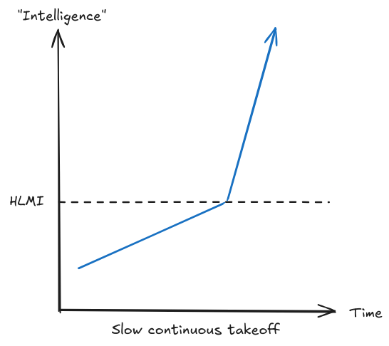
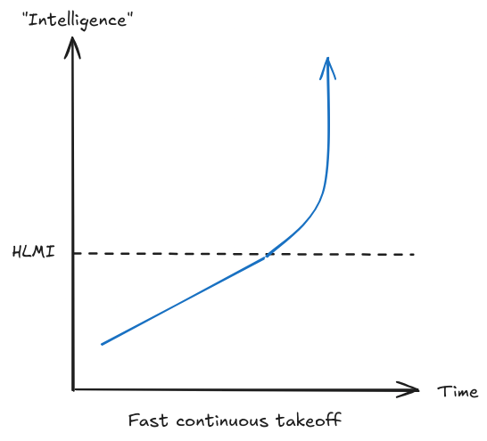
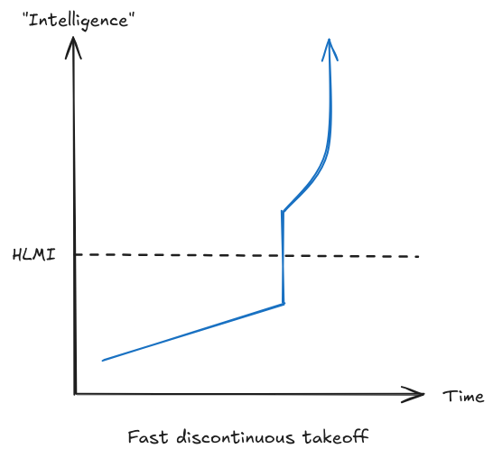
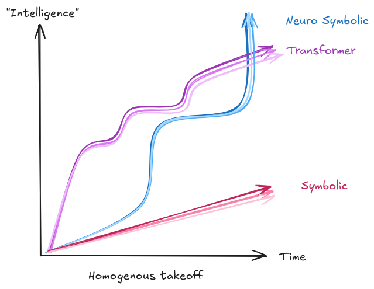
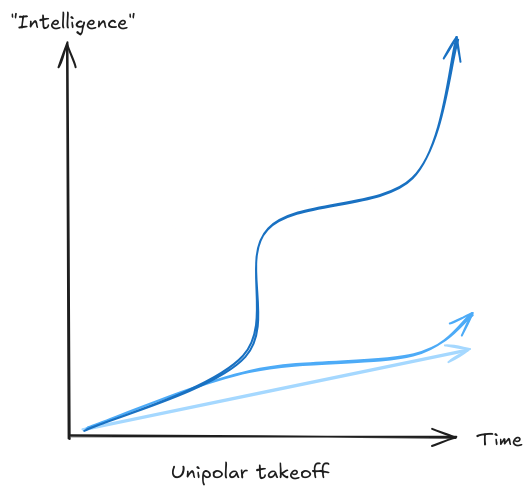
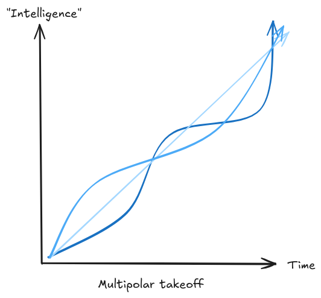

# 1.6 Takeoff {: #06 }

    

        <i class="fas fa-clock"></i>
        16 min read
    

    

        <i class="fas fa-file-alt"></i> 
        3216 words
    

This section introduces the concept of AI takeoff. There is much debate about how AI development will play out in the future. The main questions to consider are:

- **Speed**: How quickly do AI systems become more powerful?

- **Continuity**: Does the speed progress in sudden jumps or is the speed gradual?

- **Homogeneity**: How similar are the AI systems to each other?

- **Polarity**: How many AI systems do we see vying for power in the world?

**Takeoff vs. Timelines**. The difference between these two concepts is subtle, and forecasts in one domain affect the outlooks in the other. However, both takeoff and timelines offer some distinct insights: timelines provide a countdown to AI breakthroughs, while takeoff dynamics forecast the speed and breadth of their societal impact. Understanding both perspectives is key to preparing for the future of AI, guiding safety measures, policy development, and strategic research investment.

## 1.6.1 Speed {: #01 }

**Takeoff Speeds**. Slow and fast takeoff scenarios offer contrasting views on AI's future trajectory, emphasizing different challenges and preparation strategies. While slow takeoff allows for iterative safety measures and societal adaptation, fast takeoff underscores the urgency of robust, pre-established safety frameworks. Understanding both dynamics is important for informed AI governance, safety research, and policy development, ensuring readiness for a range of possible futures.

**Slow takeoff**. This refers to a scenario where AI capabilities improve in a gradual and measured manner over a relatively longer temporal interval, which could be years or even decades. Note that the "speed" of the takeoff is not just about the raw increase in AI capabilities, but also about the societal and economic impact of those capabilities. Slow takeoff's advantage lies in the preparation time it affords, potentially allowing us to adapt, respond, and correct course if things go wrong. However, on the other hand, more time being exposed to a certain growth trajectory might also breed complacency. It might also be the case that most preparations undertaken before the onset of a slow takeoff would be rendered obsolete as better solutions gradually become visible which utilize new AI capabilities. In a slow takeoff scenario, humanity’s fate essentially depends on preparations put in place during the times when such growth is apparent. The terms "slow takeoff" and "soft takeoff" are often used interchangeably. 

<figure markdown="span">
{ loading=lazy }
  <figcaption markdown="1"><b>Figure 1.35:</b> An illustration of slow continuous takeoff. ([Martin & Eth, 2021](https://www.alignmentforum.org/posts/pGXR2ynhe5bBCCNqn/takeoff-speeds-and-discontinuities))</figcaption>
</figure>

**Fast takeoff**. A "fast takeoff" envisages AI's leap to superintelligence in a short timeframe, such as hours or days, limiting human capacity for response or control. This speed leaves little to no room for humans to react, adapt, or manage the situation. Fast takeoff scenarios highlight the critical importance of preemptive safety and alignment efforts, as the window for post-emergence intervention could be minimal. Given such a short time to react, local dynamics of the takeoff become relevant. The primary mechanism behind a fast takeoff is often considered to be 'recursive self-improvement' through an “intelligence explosion”, where the AI system continually improves its own intelligence and capabilities. We talk about an intelligence explosion, and discontinuity in the next subsection. Terms like “fast takeoff”, “hard takeoff” and “FOOM” are often used interchangeably.

<figure markdown="span">
{ loading=lazy }
  <figcaption markdown="1"><b>Figure 1.36:</b> An illustration of fast continuous takeoff, which is usually taken to mean exponential or faster than exponential as compared to roughly linear (“slow”). ([Martin & Eth, 2021](https://www.alignmentforum.org/posts/pGXR2ynhe5bBCCNqn/takeoff-speeds-and-discontinuities))</figcaption>
</figure>

**Speed vs. Continuity.** We observe that AI systems are created in discrete "events", sometimes many months or years apart. As an example GPT-3 was released in June 2020, and GPT-4 was released in March 2023. Is there a sudden, extremely large jump between such releases? or could the capabilities have been predicted by extrapolating trends? Where speed might be a measure of how quickly the AI becomes superintelligent, continuity can be thought of as a measure of "surprise". Continuity measures the predictability and pattern of AI advancements, focusing on whether these advancements occur through gradual, steady improvements or unexpected breaks in previous technological trends. Even though we are presenting speed and continuity separately, the distinction between them is extremely nuanced. They are very related concepts, so much so that oftentimes most researchers use slow takeoff as analogous to continuous takeoff, and fast takeoff as analogous to discontinuous takeoff, making no distinction whatsoever.

**Continuous takeoff**. Continuous takeoff depicts AI's progression as an extension of existing trends, where advancements are made incrementally. An example is the steady advancement of technology witnessed during the Industrial Revolution, where each decade produced slightly better tools and machinery. The term 'continuous' in this context borrows from mathematical terminology, where a function is considered continuous if it doesn't have any abrupt changes or discontinuities. Some people prefer the term 'gradual' or 'incremental' over 'continuous' as they find it more descriptive and mathematically accurate. 

<figure markdown="span">
{ loading=lazy }
  <figcaption markdown="1"><b>Figure 1.37:</b> An illustration of slow discontinuous takeoff, where even though progress keeps increasing we might see sudden “jumps” in progress. ([Martin & Eth, 2021](https://www.alignmentforum.org/posts/pGXR2ynhe5bBCCNqn/takeoff-speeds-and-discontinuities))</figcaption>
</figure>

**Discontinuous Takeoff**. The term 'discontinuous' in this context suggests that there are sudden jumps in capabilities, rather than being a smooth, gradual increase. This means that the AI system makes leaps that significantly exceed what would be expected based on past progress. In a discontinuous takeoff scenario, the AI's capabilities quickly surpass human control and understanding. The terms 'fast takeoff' and 'discontinuous takeoff' are often used interchangeably. However, the images below displaying different takeoff trajectories might help in clarifying the subtle differences between the concepts.

<figure markdown="span">
{ loading=lazy }
  <figcaption markdown="1"><b>Figure 1.38:</b> An illustration of fast discontinuous takeoff. Even though progress keeps increasing (either linear or exponential) we might also see sudden “jumps” in progress in addition to exponential growth. ([Martin & Eth, 2021](https://www.alignmentforum.org/posts/pGXR2ynhe5bBCCNqn/takeoff-speeds-and-discontinuities))</figcaption>
</figure>

## 1.6.2 Similarity {: #02 }

**Homogenous takeoff. **This refers to the similarity among different AI systems in play during the development and deployment of advanced AI. ([Hubinger, 2020](https://www.lesswrong.com/posts/mKBfa8v4S9pNKSyKK/homogeneity-vs-heterogeneity-in-ai-takeoff-scenarios)) Future AI systems might share significant similarities in their design, capabilities, and alignment. This could be due to shared underlying foundation models, common APIs, or similar training methods. The uniformity of AI systems under a homogenous takeoff scenario might imply the potential for easy cooperation between AI entities. Additionally, if homogeneity arises due to fine-tuning prevailing as the paradigm; the alignment of the initial AI system becomes the crucial factor for the alignment of all subsequent AI systems. A single misaligned system could, therefore, have widespread consequences, underscoring the importance of rigorous alignment and safety measures in early AI development stages. Homogeneity could either mitigate risks or exacerbate them, depending on the alignment and governance frameworks established during the initial phases of AI development.

<figure markdown="span">
{ loading=lazy }
  <figcaption markdown="1"><b>Figure 1.39:</b> An illustration of homogeneous takeoff. We can see multiple different overarching model architectures. The figure shows three in different colors. Within each architecture the takeoff is roughly the same due to similarity in design, regulations, and safety mitigations. **NOTE**: The curves here with architectures are purely illustrative, and are not meant to indicate predicted growth trajectories and comparisons between different architectures.</figcaption>
</figure>

**Heterogeneity**. A heterogeneous takeoff scenario represents diversity and variation in the development, safety levels, and deployment of AI systems. Several factors contribute to the heterogeneity in AI takeoff. First is the diversity in AI development approaches. Organizations and researchers might adopt different strategies and technologies, leading to varied outcomes in terms of AI capabilities and alignment. Moreover, competitive dynamics among AI projects could exacerbate this diversity, as teams race to achieve breakthroughs without necessarily aligning on methodologies or sharing crucial information. As an example, we might have a future where AI becomes a strategic national asset, and AI development is closely guarded. In this environment, the pursuit of AI capabilities becomes siloed, each company or country would then employ different development methodologies, potentially leading to a wide range of behaviors, functionalities, and safety levels.

<figure markdown="span">
{ loading=lazy }
  <figcaption markdown="1"><b>Figure 1.40:</b> An illustration of heterogeneous takeoff. We can see multiple different overarching model architectures. The figure shows three in different colors. Within each architecture the takeoff is different due to differences in design, regulations, and safety mitigations. **NOTE**: The curves here with architectures are purely illustrative, and are not meant to indicate predicted growth trajectories and comparisons between different architectures.</figcaption>
</figure>

## 1.6.3 Polarity {: #03 }

Takeoff polarity in the context of AI development explores how power and control might be distributed during the critical phase when AI systems transition to higher levels of intelligence and capability. It measures whether we will see power centralized in the hands of a single entity or dispersed among various actors.

**Unipolar Takeoff**. In a unipolar takeoff scenario, the landscape is characterized by the emergence of a single AI system or entity that achieves a significant lead over all others. This lead could be due to a breakthrough that allows for a sudden leap in capabilities, enabling this entity to outpace competitors rapidly, or due to something like an intelligence explosion. The concept hinges on the idea that early advantages in AI development—be it through technological breakthroughs, resource accumulation, or strategic positioning—could allow one project to dominate the field. This dominance could then be used to consolidate power, leveraging economic gains and network effects to maintain a hold over AI advancements and their applications.

<figure markdown="span">
{ loading=lazy }
  <figcaption markdown="1"><b>Figure 1.41:</b> An illustration of unipolar takeoff. One model (dark blue here) significantly outperforms all others.</figcaption>
</figure>

**Multipolar Takeoff**. Conversely, a multipolar takeoff scenario envisions a more balanced distribution of advanced AI systems across multiple entities. This diversity could stem from slower, more incremental progress in AI capabilities, allowing various projects to evolve in tandem without any single entity pulling decisively ahead. Factors contributing to a multipolar landscape include widespread sharing of technological advancements, collaborative efforts to ensure safety and alignment, and regulatory environments that promote competition and mitigate monopolistic outcomes. A unipolar scenario raises concerns about the concentration of power, while a multipolar world presents challenges in coordination among diverse entities or AI systems. Both unipolar and multipolar worlds have the potential for misuse of advanced AI capabilities by human actors.

<figure markdown="span">
{ loading=lazy }
  <figcaption markdown="1"><b>Figure 1.42:</b> An illustration of multipolar takeoff. No model significantly outperforms all others, and they all takeoff at a roughly competitive rate relative to each other.</figcaption>
</figure>

**Factors Influencing Polarity**. Several key elements influence whether takeoff polarity leans towards a unipolar or multipolar outcome:

- Speed of AI Development: A rapid takeoff might favor a unipolar outcome by giving a significant advantage to the fastest developer. In contrast, a slower takeoff could lead to a multipolar world where many entities reach advanced capabilities more or less simultaneously.

- Collaboration vs. Competition: The degree of collaboration and openness in the AI research community can significantly affect takeoff polarity. High levels of collaboration and information sharing could support a multipolar outcome, while secretive or highly competitive environments might push towards unipolarity.

- Regulatory and Economic Dynamics: Regulatory frameworks and economic incentives also play a crucial role. Policies that encourage diversity in AI development and mitigate against the accumulation of too much power in any single entity's hands could foster a multipolar takeoff.

## 1.6.4 Takeoff Arguments {: #04 }

**The Overhang Argument**. There might be situations where there are substantial advancements or availability in one aspect of the AI system, such as hardware or data, but the corresponding software or algorithms to fully utilize these resources haven't been developed yet. The term 'overhang' is used because these situations imply a kind of 'stored’ or ‘latent’ potential. Once the software or algorithms catch up to the hardware or data, there could be a sudden unleashing of this potential, leading to a rapid leap in AI capabilities. Overhangs provide one possible argument for why we might favor discontinuous or fast takeoffs. There are two types of overhangs commonly discussed:

- **Hardware Overhang**: This refers to a situation where there is enough computing hardware to run many powerful AI systems, but the software to run such systems hasn't been developed yet. If such hardware could be repurposed for AI, this would mean that as soon as one powerful AI system exists, probably a large number of them would exist, which might amplify the impact of the arrival of human-level AI.

- **Data Overhang**: This would be a situation where there is an abundance of data available that could be used for training AI systems, but the AI algorithms capable of utilizing all that data effectively haven't been developed or deployed yet.

Overhangs are also used as a counter argument to why AI pauses do not affect takeoff. One counter argument to the overhang argument is that it relies on the assumption that during the time that we are pausing AI development, the rate of production of chips will remain constant. It could be argued that the companies manufacturing these chips will not make as many chips if data centers aren't buying them. However, this argument only works if the pause is for any appreciable length of time, otherwise the data centers might just stockpile the chips. It is also possible to make progress on improved chip design, without having to manufacture as many during the pause period. However, during the same pause period we could also make progress on AI Safety techniques. ([Elmore, 2024](https://www.youtube.com/watch?v=Q3eRy4t2oPQ))

**The Economic Growth Argument**. Historical patterns of economic growth, driven by human population increases, suggest a potential for slow and continuous AI takeoff. This argument says that as AIs augment the effective economic population, we might witness a gradual increase in economic growth, mirroring past expansions but at a potentially accelerated rate due to AI-enabled automation. Limitations in AI's ability to automate certain tasks, alongside societal and regulatory constraints (e.g. that medical or legal services can only be rendered by humans), could lead to a slower expansion of AI capabilities. Alternatively, growth might far exceed historical rates. Using a similar argument for a fast takeoff hinges on AI's potential to quickly automate human labor on a massive scale, leading to unprecedented economic acceleration.

**Compute Centric Takeoff Argument**. This argument, similar to the Bio Anchors report, assumes that compute will be sufficient for transformative AI. Based on this assumption, Tom Davidson's 2023 report on compute-centric AI takeoff discusses feedback loops that may contribute to takeoff dynamics.

- **Investment feedback loop**: There might be increasing investment in AI, as AIs play a larger and larger role in the economy. This increases the amount of compute available to train models, as well as potentially leading to the discovery of novel algorithms. All of this increases capabilities, which drives economic progress, and further incentivizes investment.

- **Automation feedback loop**: As AIs get more capable, they will be able to automate larger parts of the work of coming up with better AI algorithms, or helping in the design of better GPUs. Both of these will increase the capability of the AIs, which in turn allow them to automate more labor.

Depending on the strength and interplay of these feedback loops, they can create a self-fulfilling prophecy leading to either an accelerating fast takeoff if regulations don't curtail various aspects of such loops, or a slow takeoff if the loops are weaker or counterbalanced by other factors. The entire model is shown in the diagram below:

<figure markdown="span">
{ loading=lazy }
  <figcaption markdown="1"><b>Figure 1.43:</b> A summary of What a Compute-Centric Framework Says About Takeoff Speeds ([Davidson, 2024](https://www.openphilanthropy.org/research/what-a-compute-centric-framework-says-about-takeoff-speeds/))</figcaption>
</figure>

**Automating Research Argument. **Researchers could potentially design the next generation of ML models more quickly by delegating some work to existing models, creating a feedback loop of ever-accelerating progress. The following argument is put forth by Ajeya Cotra:

Currently, human researchers collectively are responsible for almost all of the progress in AI research, but are starting to delegate a small fraction of the work to large language models. This makes it somewhat easier to design and train the next generation of models.

The next generation is able to handle harder tasks and more different types of tasks, so human researchers delegate more of their work to them. This makes it significantly easier to train the generation after that. Using models gives a much bigger boost than it did the last time around.

Each round of this process makes the whole field move faster and faster. In each round, human researchers delegate everything they can productively delegate to the current generation of models — and the more powerful those models are, the more they contribute to research and thus the faster AI capabilities can improve. ([Cotra, 2023](https://www.planned-obsolescence.org/ais-accelerating-ai-research/))

So before we see a recursive explosion of intelligence, we see a steadily increasing amount of the full RnD process being delegated to AIs. At some point, instead of a significant majority of the research and design being done by AI assistants at superhuman speeds, it will become that - all of the research and design for AIs is done by AI assistants at superhuman speeds.

At this point there is a possibility that this might eventually lead to a full automated recursive intelligence explosion.

**The Intelligence Explosion Argument**. This concept of the 'intelligence explosion' is also central to the conversation around discontinuous takeoff. It originates from I.J. Good's thesis, which posits that sufficiently advanced machine intelligence could build a smarter version of itself. This smarter version could in turn build an even smarter version of itself, and so on, creating a cycle that could lead to intelligence vastly exceeding human capability ([Yudkowsky, 2013](https://intelligence.org/files/IEM.pdf)).

In their 2012 report on the evidence for Intelligence Explosions, Muehlhauser and Salamon delve into the numerous advantages that machine intelligence holds over human intelligence, which facilitate rapid intelligence augmentation. ([Muehlhauser, 2012](https://intelligence.org/files/IE-EI.pdf)) These include:

- **Computational Resources**: Human computational ability remains somewhat stationary, whereas machine computation possesses scalability.

- **Speed**: Humans communicate at a rate of two words per second, while GPT-4 can process 32k words in an instant. Once LLMs can write "better" than humans, their speed will most probably surpass us entirely.

- **Duplicability**: Machines exhibit effortless duplicability. Unlike humans, they do not need birth, education, or training. While humans predominantly improve individually, machines have the potential to grow collectively. Humans take 20 years to become competent from birth, whereas once we have one capable AI, we can duplicate it immediately. Once AIs reach the level of the best programmer, we can just duplicate this AI. The same goes for other jobs.

- **Editability**: Machines potentially allow more regulated variations. They exemplify the equivalent of direct brain enhancements via neurosurgery in opposition to laborious education or training requirements. Humans can also improve and learn new skills, but they don't have root access to their hardware: we are just starting to be able to understand the genome's "spaghetti code," while AI could use code versioning tools to improve itself, being able to attempt risky experiments with backup options in case of failure. This allows for much more controlled variation.

- **Goal coordination**: Copied AIs possess the capability to share goals effortlessly, a feat challenging for humans.

    ❧

