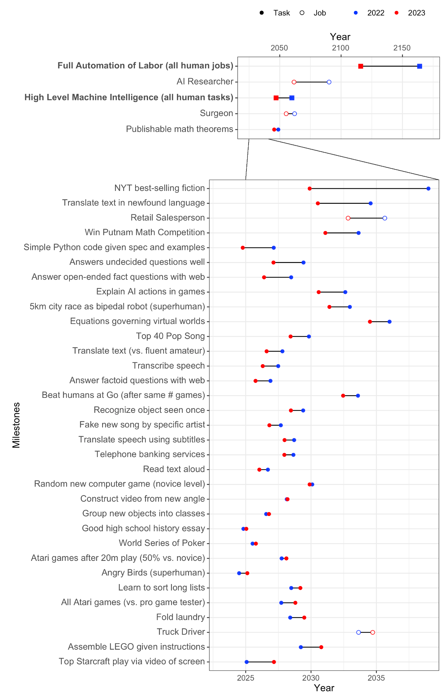

# 1.7 Appendix: Expert Opinions {: #07 }

    

        <i class="fas fa-clock"></i>
        15 min read
    

    

        <i class="fas fa-file-alt"></i> 
        2908 words
    

!!! warning "Everything in the appendices is optional, and is meant as additional knowledge and context. You do not need to read this to understand the core points made in either this chapter or future chapters."

<figure class="video-figure" markdown="span">
<iframe style="width: 100%; aspect-ratio: 16 / 9;" frameborder="0" allowfullscreen src="https://www.youtube.com/embed/NqmUBZQhOYw"></iframe>
  <figcaption markdown="1"><b>Video 1.2:</b> Optional video outlining some views that AI experts have on safety and risk.</figcaption>
</figure>

<figure class="iframe-figure" markdown="span">
<iframe src="https://ourworldindata.org/grapher/views-ai-impact-society-next-20-years?tab=chart" loading="lazy" style="width: 100%; height: 600px; border: 0px none;" allow="web-share; clipboard-write"></iframe>
  <figcaption markdown="1"><b>Interactive Figure 1.13:</b> Public opinions about AIs impacts on society ([Giattino et al., 2023](https://ourworldindata.org/artificial-intelligence))</figcaption>
</figure>

<figure class="iframe-figure" markdown="span">
<iframe src="https://ourworldindata.org/grapher/views-of-americans-robot-vs-human-intelligence?tab=chart" loading="lazy" style="width: 100%; height: 600px; border: 0px none;" allow="web-share; clipboard-write"></iframe>
  <figcaption markdown="1"><b>Interactive Figure 1.14:</b> Public opinions on machine vs human intelligence. ([Giattino et al., 2023](https://ourworldindata.org/artificial-intelligence))</figcaption>
</figure>

## 1.7.1 Surveys {: #01 }

According to a recent survey conducted by AI Impact ([AI Impacts, 2022](https://aiimpacts.org/wp-content/uploads/2023/04/Thousands_of_AI_authors_on_the_future_of_AI.pdf)): *"****Expected time to human-level performance dropped 1–5 decades since the 2022 survey****. As always, our questions about ‘high-level machine intelligence’ (HLMI) and ‘full automation of labor’ (FAOL) got very different answers, and individuals disagreed a lot (shown as thin lines below), but the aggregate forecasts for both sets of questions dropped sharply. For context, between 2016 and 2022 surveys, the forecast for HLMI had only shifted about a year.**"*

<figure markdown="span">
{ loading=lazy }
  <figcaption markdown="1"><b>Figure 1.41:</b> 2024 Survey of AI Experts ([AI Impacts, 2022](https://blog.aiimpacts.org/p/2023-ai-survey-of-2778-six-things))</figcaption>
</figure>

It is also possible to compare the predictions of the same study in 2022 to the current results. It is interesting to note that the community has generally underestimated the speed of progress over the year 2023 and has adjusted its predictions downward. Some predictions are quite surprising. For example, tasks like "Write High School Essay" and "Transcribe Speech" are arguably already automated with ChatGPT and Whisper, respectively. However, it appears that researchers are not aware of these results. Additionally, it is surprising that the forecast for when we are able to build an "AI researcher" has longer timelines than when we are able to build "High-level machine intelligence (all human tasks)".

The median of the 2024 expert survey predicts human-level machine intelligence (HLMI) in 2049.

## 1.7.2 Quotes {: #02 }

Here are many quotes from people regarding transformative AI.

### 1.7.2.1 AI Experts {: #01 }

Note that Hinton, Bengio, and Sutskever are some of the most cited researchers in the field of AI. And that Hinton, Bengio, and LeCun are the recipients of the Turing Award in Deep Learning. Some users on reddit have put together a comprehensive list of publicly stated AI timelines forecasts from famous researchers and industry leaders.

!!! quote "Geoffrey Hinton (Godfather of modern AI, Turing Award Recipient)"

    "The research question is: how do you prevent them from ever wanting to take control? And nobody knows the answer [...] The alarm bell I'm ringing has to do with the existential threat of them taking control [...] If you take the existential risk seriously, as I now do, it might be quite sensible to just stop developing these things any further [...] it's as if aliens had landed and people haven't realized because they speak very good English"

!!! quote "Yoshua Bengio (One of most cited scientists ever, Godfather of modern AI, Turing Award Recipient)"

    "It's very hard, in terms of your ego and feeling good about what you do, to accept the idea that the thing you've been working on for decades might actually be very dangerous to humanity... I think that I didn't want to think too much about it, and that's probably the case for others [...] Rogue AI may be dangerous for the whole of humanity. Banning powerful AI systems (say beyond the abilities of GPT-4) that are given autonomy and agency would be a good start."

!!! quote "Yann LeCun (Godfather of modern AI, Turing Award Recipient, Chief AI Scientist at Meta)"

    "There is no question that machines will become smarter than humans—in all domains in which humans are smart—in the future. It's a question of when and how, not a question of if."

!!! quote "Stuart Russell (Co-Author of leading AI textbook, Co-Founder of Center for Human-Compatible AI)"

    "If we pursue [our current approach], then we will eventually lose control over the machines."

!!! quote "Demis Hassabis (Co-Founder and CEO of DeepMind)"

    "We must take the risks of AI as seriously as other major global challenges, like climate change. It took the international community too long to coordinate an effective global response to this, and we're living with the consequences of that now. We can't afford the same delay with AI [...] then maybe there's some kind of equivalent one day of the IAEA, which actually audits these things."

!!! quote "Dario Amodei (Co-Founder and CEO of Anthropic, Former Head of AI Safety at OpenAI)"

    "When I think of why am I scared [...] I think the thing that's really hard to argue with is like, there will be powerful models; they will be agentic; we're getting towards them. If such a model wanted to wreak havoc and destroy humanity or whatever, I think we have basically no ability to stop it."

!!! quote "Mustafa Suleyman (CEO of Microsoft AI, Co-Founder of DeepMind)"

    "[About a Pause] I don't rule it out. And I think that at some point over the next five years or so, we're going to have to consider that question very seriously."

!!! quote "Ilya Sutskever (One of the most cited scientists ever, Co-Founder and Former Chief Scientist at OpenAI)"

    "The future is going to be good for the AIs regardless; it would be nice if it would be good for humans as well [...] It's not that it's going to actively hate humans and want to harm them, but it's just going to be too powerful, and I think a good analogy would be the way humans treat animals [...] And I think by default that's the kind of relationship that's going to be between us and AGIs which are truly autonomous and operating on their own behalf."

!!! quote "Shane Legg (Co-Founder and Chief AGI Scientist at DeepMind)"

    "Do possible risks from AI outweigh other possible existential risks…? It's my number 1 risk for this century [...] A lack of concrete AGI projects is not what worries me, it's the lack of concrete plans on how to keep these safe that worries me."

!!! quote "Jan Leike (Former co-lead of the Superalignment project at OpenAI)"

    "[After resigning at OpenAI, talking about sources of risks] These problems are quite hard to get right, and I am concerned we aren't on a trajectory to get there [...] OpenAI is shouldering an enormous responsibility on behalf of all of humanity. But over the past years, safety culture and processes have taken a backseat to shiny products. We are long overdue in getting incredibly serious about the implications of AGI."

!!! quote "Sam Altman (Co-Founder and CEO of OpenAI)"

    "[Suggesting about how to ask for a global regulatory body:] "any compute cluster above a certain extremely high-power threshold – and given the cost here, we're talking maybe five in the world, something like that – any cluster like that has to submit to the equivalent of international weapons inspectors" […] I did a big trip around the world this year, and talked to heads of state in many of the countries that would need to participate in this, and there was almost universal support for it."

!!! quote "Greg Brockman (Co-Founder and Former CTO of OpenAI)"

    "The exact way the post-AGI world will look is hard to predict — that world will likely be more different from today's world than today's is from the 1500s [...] We do not yet know how hard it will be to make sure AGIs act according to the values of their operators. Some people believe it will be easy; some people believe it'll be unimaginably difficult; but no one knows for sure"

!!! quote "John Schulman (Co-Founder of OpenAI)"

    "[Talking about times near the creation of the first AGI] you have the race dynamics where everyone's trying to stay ahead, and that might require compromising on safety. So I think you would probably need some coordination among the larger entities that are doing this kind of training [...] Pause either further training, or pause deployment, or avoiding certain types of training that we think might be riskier."

!!! quote "Jaan Tallinn (Co-Founder of Skype, Future of Life Institute)"

    "I've not met anyone in AI labs who says the risk [from training a next-gen model] is less than 1% of blowing up the planet. It's important that people know lives are being risked [...] One thing that a pause achieves is that we will not push the Frontier, in terms of risky pre-training experiments."

### 1.7.2.2 Politicians {: #02 }

!!! quote "Rishi Sunak (Former UK Prime Minister)"

    "Get this wrong, and AI could make it easier to build chemical or biological weapons. Terrorist groups could use AI to spread fear and destruction on an even greater scale. Criminals could exploit AI for cyber-attacks, disinformation, fraud, or even child sexual abuse. And in the most unlikely but extreme cases, there is even the risk that humanity could lose control of AI completely through the kind of AI sometimes referred to as 'super intelligence'."

!!! quote "Kamala Harris (Former US Vice President)"

    "[...] just as AI has the potential to do profound good, it also has the potential to cause profound harm. From AI-enabled cyberattacks at a scale beyond anything we have seen before to AI-formulated bio-weapons that could endanger the lives of millions, these threats are often referred to as the "existential threats of AI" because, of course, they could endanger the very existence of humanity. These threats, without question, are profound, and they demand global action."

!!! quote "Zhang Jun (China's UN Ambassador)"

    "The potential impact of AI might exceed human cognitive boundaries. To ensure that this technology always benefits humanity, we must regulate the development of AI and prevent this technology from turning into a runaway wild horse [...] We need to strengthen the detection and evaluation of the entire lifecycle of AI, ensuring that mankind has the ability to press the pause button at critical moments."

!!! quote "Donald Trump (Former US President)"

    "[...] the other thing that I think is maybe the most dangerous thing out there of anything, because there's no real solution — the AI, as they call it."

!!! quote "Joe Biden (US President)"

    "Artificial Intelligence is one of the most powerful tools of our time, but to seize its opportunities, we must first mitigate its risks. [...] Social media has shown us the harm that powerful technology can do without the right safeguards in place [...] we must be clear-eyed and vigilant about the threats emerging — of emerging technologies that can pose — don't have to, but can pose — to our democracy and our values."

!!! quote "Vladimir Putin (President of Russia)"

    "Artificial intelligence is the future, not only for Russia, but for all humankind. It comes with colossal opportunities, but also threats that are difficult to predict. Whoever becomes the leader in this sphere will become the ruler of the world [...] If we become leaders in this area, we will share this know-how with [the] entire world, the same way we share our nuclear technologies today."

!!! quote "Li Qiang (China's Head of Government)"

    "AI must be guided in a direction that is conducive to the progress of humanity. So there should be a red line in AI development, a red line that must not be crossed [...] It should not just benefit only a small group of people, but benefit the overwhelming majority of mankind [...] It is essential that we work together and coordinate with each other."

!!! quote "Ursula von der Leyen (Head of EU Executive Branch)"

    "[We] should not underestimate the real threats coming from AI [...] It is moving faster than even its developers anticipated [...] We have a narrowing window of opportunity to guide this technology responsibly."

!!! quote "António Guterres (UN Secretary-General)"

    "AI poses a long-term global risk. Even its own designers have no idea where their breakthrough may lead. I urge [the UN Security Council] to approach this technology with a sense of urgency [...] Its creators themselves have warned that much bigger, potentially catastrophic and existential risks lie ahead."

### 1.7.2.3 Academics {: #03 }

!!! quote "Eliezer Yudkowsky (Co-Founder of Machine Intelligence Research Institute)"

    "I do not expect something actually smart to attack us with marching robot armies with glowing red eyes where there could be a fun movie about us fighting them. I expect an actually smarter and uncaring entity will figure out strategies and technologies that can kill us quickly and reliably and then kill us."

!!! quote "Stephen Hawking (Theoretical Physicist)"

    "The development of full artificial intelligence could spell the end of the human race [...] It would take off on its own, and re-design itself at an ever increasing rate."

!!! quote "Alan Turing (Father of Computer Science and AI)"

    "It seems probable that once the machine thinking method had started, it would not take long to outstrip our feeble powers… They would be able to converse with each other to sharpen their wits. At some stage therefore, we should have to expect the machines to take control."

!!! quote "I. J. Good (Cryptologist at Bletchley Park)"

    "An ultraintelligent machine could design even better machines; there would then unquestionably be an 'intelligence explosion', and the intelligence of man would be left far behind. Thus the first ultraintelligent machine is the last invention that man need ever make, provided that the machine is docile enough to tell us how to keep it under control."

### 1.7.2.4 Tech Entrepreneurs {: #04 }

!!! quote "Elon Musk (Founder/Co-Founder of OpenAI, Neuralink, SpaceX, xAI, PayPal, CEO of Tesla, CTO of X/Twitter)"

    "AI is a rare case where I think we need to be proactive in regulation than be reactive [...] I think that [digital super intelligence] is the single biggest existential crisis that we face and the most pressing one. It needs to be a public body that has insight and then oversight to confirm that everyone is developing AI safely [...] And mark my words, AI is far more dangerous than nukes. Far. So why do we have no regulatory oversight? This is insane."

!!! quote "Bill Gates (Co-Founder of Microsoft)"

    "Superintelligent AIs are in our future. [...] There's the possibility that AIs will run out of control. [Possibly,] a machine could decide that humans are a threat, conclude that its interests are different from ours, or simply stop caring about us."

### 1.7.2.5 Join Declarations {: #05 }

!!! quote "The Bletchley Declaration (Multiple Nations & EU, 2023)"

    "Substantial risks may arise from potential intentional misuse or unintended issues of control relating to alignment with human intent. These issues are in part because those capabilities are not fully understood [...] There is potential for serious, even catastrophic, harm, either deliberate or unintentional, stemming from the most significant capabilities of these AI models."

!!! quote "AI Risk Statement (Multiple AI Experts, 2023)"

    "Mitigating the risk of extinction from AI should be a global priority alongside other societal-scale risks such as pandemics and nuclear war."

## 1.7.3 Prediction Markets {: #03 }

Prediction markets are like betting systems where people can buy and sell shares based on their predictions of future events. For example, if there’s a prediction market for a presidential election, you can buy shares for the candidate you think will win. If many people believe Candidate A will win, the price of shares for Candidate A goes up, indicating a higher probability of winning.

These markets are helpful because they gather the knowledge and opinions of many people, often leading to accurate predictions. For example, a company might use a prediction market to forecast whether a new product will succeed. Employees can buy shares if they believe the product will do well. If the majority think it will succeed, the share price goes up, giving the company a good indication of the product’s potential success.

By allowing participants to profit from accurate predictions, these markets encourage the sharing of valuable information and provide real-time updates on the likelihood of various outcomes. The argument is that either prediction markets are more accurate than experts, or experts should be able to make a lot of money from these markets and, in doing so, correct the markets. So the incentive for profit leads to the most accurate predictions. Examples of prediction markets include [manifold](https://manifold.markets/home), or [metaculus](https://www.metaculus.com/).

When using prediction markets to estimate the reproducibility of scientific research it was found that they outperformed expert surveys ([Dreber et al., 2015](https://www.pnas.org/doi/10.1073/pnas.1516179112)). So if a lot of experts participate, prediction markets might be one of our best probabilistic forecasting tools, better even than surveys or experts.

The live charts below show the results of the prediction markets from Metaculus for - "When will the first weakly general AI system be devised, tested, and publicly announced?" At the time of writing, weakly general systems are expected in 2027, and general systems in 2032.

<iframe src="https://www.metaculus.com/questions/question_embed/3479/?theme=light"  style=" width: 100%; aspect-ratio: 16 / 9;" frameborder="0">

</iframe>

<iframe src="https://www.metaculus.com/questions/question_embed/5121/?theme=light"  style=" width: 100%; aspect-ratio: 16 / 9;" frameborder="0">

</iframe>

    ❧

