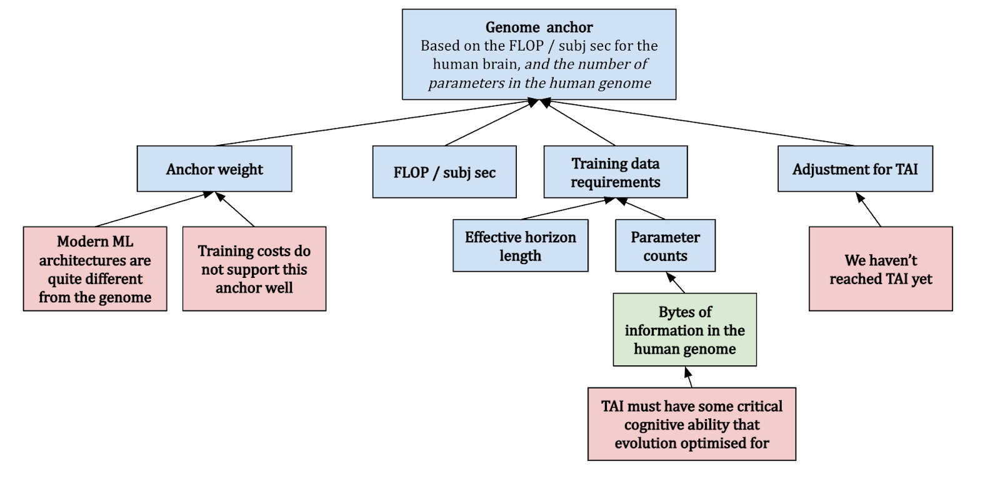

# 1.A4 Forecasting - Bio Anchors

    

        
            <i class="fas fa-clock"></i>
        
        

            
Reading Time

            
6 min

        

    

!!! warning "Everything in the appendices is optional, and is meant as additional knowledge and context. You do not need to read this to understand the core points made in either this chapter or future chapters."

## 1.A4.1 Evolution Anchor {: #01}

This anchor quantifies the computational effort invested by evolution in shaping the human brain. It considers the vast amount of processing and learning that has taken place from the emergence of the first neurons to the development of the modern human brain. This method suggests that evolution has served as a form of "pre-training" for the human brain, enhancing its ability to adapt and survive. To estimate the computational power of this evolutionary "pre-training", the report considers the total amount of compute used by all animal brains over the course of evolution. This includes not just the brains of humans, but also those of our ancestors and other animals with nervous systems. The idea is that all of this brain activity represents a form of learning or adaptation that has contributed to the development of the modern human brain. While the exact calculations involved in this estimate are complex and subject to considerable uncertainty, the basic idea is to multiply the number of animals that have ever lived by the amount of compute each of their brains performed over their lifetimes. This gives an estimate of the total compute performed by all animal brains over the course of evolution.

<figure markdown="span">
{ loading=lazy }
  <figcaption markdown="1"><b>Figure 1.48:</b> The Evolution anchor ([Ho, 2022](https://epochai.org/blog/grokking-bioanchors))</figcaption>
</figure>

Cotra accounts for these considerations and assumes that the "average ancestor" performed as many FLOP/s as a nematode, and that there were on average ~1e21 ancestors at any time. This yields a **median of ~1e41 FLOP** , which seems extraordinarily high compared to modern machine learning. As an example, Google’s PaLM model was trained with ~2.5e24 FLOP (17 orders of magnitude smaller). She gives this anchor a **weight of 10%**. ([Ho, 2022](https://epochai.org/blog/grokking-bioanchors))

</tab>

## 1.A4.2 Lifetime Anchor {: #02}

This refers to the total computational activity the human brain performs over a human lifetime. This anchor is essentially a measure of the "training" a human brain undergoes from birth to adulthood and incorporates factors such as the number of neurons in the human brain, the amount of computation each neuron performs per year, and the number of years it takes for a human to reach adulthood. The human brain has an estimated 86 billion neurons. Each of these neurons performs a certain number of computations per second, which can be calculated as a certain number of operations per second in FLOP/s. When calculating the total amount of compute over a lifetime, these factors are multiplied together, along with the number of years a human typically lives.

For example, if we assume that a neuron is able to perform about 1000 operations per second, and there are about 31.5 million seconds in a year, then a single neuron would perform about 31.5 billion operations in a year. Now, if we multiply this by the estimated number of neurons in the human brain (86 billion), we get an estimate of the total brain-compute performed in one year. We can then multiply this by the number of years in a typical human lifespan to estimate the total brain-compute over a lifetime. Plugging in the numbers about brain FLOP/s seems to suggest that ~1e27 FLOP would be required to reach TAI. This seems low since examples from other technological domains suggest that the efficiency of things we build (on relevant metrics) is generally not great when compared to nature.

<figure markdown="span">
{ loading=lazy }
  <figcaption markdown="1"><b>Figure 1.49:</b> The Lifelong anchor ([Ho, 2022](https://epochai.org/blog/grokking-bioanchors))</figcaption>
</figure>

Cotra's report finds a median of ~1e28 FLOP and only gives the lifetime anchor a 5% weight, indicating that it's not the most influential factor in the overall model. The report acknowledges the inherent uncertainties and complexities involved in such a calculation and uses this anchor as one of several to provide a range of estimates for the compute required to achieve AI with human-level performance. ([Ho, 2022](https://epochai.org/blog/grokking-bioanchors))

</tab>

## 1.A4.3 Neural Network Anchors {: #03}

Each of the neural network anchors serves to provide a different perspective on the amount of compute that might be required to train a TAI. There are three Neural Network Anchors presented in the report: long (~1e37 FLOP), medium (~1e34 FLOP), and short horizon (~1e32 FLOP). These anchors hypothesize that the ratio of parameters to compute used by a TAI should be similar to the ratio observed in today's neural networks. Additionally, a TAI should perform approximately as many FLOPs per subjective second as a human brain. A "subjective second" is the time it takes a model to process as much data as a human can in one second ([Ho, 2022](https://epochai.org/blog/grokking-bioanchors)). As an example a typical human reads about 3-4 words per second for non-technical material, so "one subjective second" for a language model would correspond to however much time that the model takes to process about ~3-4 words of data. ([Cotra, 2020](https://www.alignmentforum.org/posts/KrJfoZzpSDpnrv9va/draft-report-on-ai-timelines)) Cotra determines the training data requirements based on a mix of machine learning theory and empirical considerations. She puts 15% weight on short horizons, 30% on medium horizons, and 20% on long horizons, for a total of 65% on the three anchors. ([Ho, 2022](https://epochai.org/blog/grokking-bioanchors))

<figure markdown="span">
{ loading=lazy }
  <figcaption markdown="1"><b>Figure 1.50:</b> Neural network Anchors ([Ho, 2022](https://epochai.org/blog/grokking-bioanchors))</figcaption>
</figure>

## 1.A4.4 Genome Anchor {: #04}

The genome anchor looks at the FLOP/subj sec of the human brain and expects TAI to require as many parameters as there are bytes in the human genome. This hypothesis implicitly assumes a training process that’s structurally analogous to evolution, and that TAI will have some critical cognitive ability that evolution optimized for. This differs from the evolution anchor in that it assumes we can search over possible architectures/algorithms a lot more efficiently than evolution, using gradients. Due to this structural similarity, and because feedback signals about the fitness of a particular genome configuration are generally sparse, this suggests that the anchor only really makes sense with long horizon lengths. ([Ho, 2022](https://epochai.org/blog/grokking-bioanchors))

<figure markdown="span">
{ loading=lazy }
  <figcaption markdown="1"><b>Figure 1.51:</b> The Genome Anchor ([Ho, 2022](https://epochai.org/blog/grokking-bioanchors))</figcaption>
</figure>

At least at the time of writing (May 2022), machine learning architectures don’t look very much like the human genome, and we are yet to develop TAI – thus Cotra updates against this hypothesis towards requiring more FLOP. Overall, she finds a median of ~1e33 FLOP and places 10% weight on this anchor. ([Ho, 2022](https://epochai.org/blog/grokking-bioanchors))

<!--

LLM counters:

[[2310.16028] What Algorithms can Transformers Learn? A Study in Length Generalization](https://arxiv.org/abs/2310.16028)

[[1911.01547] On the Measure of Intelligence](https://arxiv.org/abs/1911.01547)

[[2210.01240] Language Models Are Greedy Reasoners: A Systematic Formal Analysis of Chain-of-Thought](https://arxiv.org/abs/2210.01240)

[[2305.18654] Faith and Fate: Limits of Transformers on Compositionality](https://arxiv.org/abs/2305.18654)

[[2404.09932] Foundational Challenges in Assuring Alignment and Safety of Large Language Models](https://arxiv.org/abs/2404.09932)

[[2406.04520] NATURAL PLAN: Benchmarking LLMs on Natural Language Planning](https://arxiv.org/abs/2406.04520)

[[2405.04776] Chain of Thoughtlessness? An Analysis of CoT in Planning](https://arxiv.org/abs/2405.04776)

[[2305.15771] On the Planning Abilities of Large Language Models : A Critical Investigation](https://arxiv.org/abs/2305.15771)

[[2310.01798] Large Language Models Cannot Self-Correct Reasoning Yet](https://arxiv.org/abs/2310.01798)

[[2312.11562] A Survey of Reasoning with Foundation Models](https://arxiv.org/abs/2312.11562)

Moravec Paradox is absent - [https://epoch.ai/gradient-updates/movarec-s-paradox](https://epoch.ai/gradient-updates/movarec-s-paradox) 

→