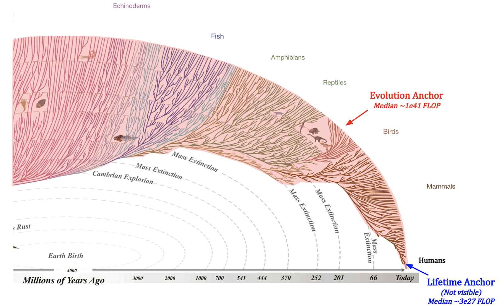
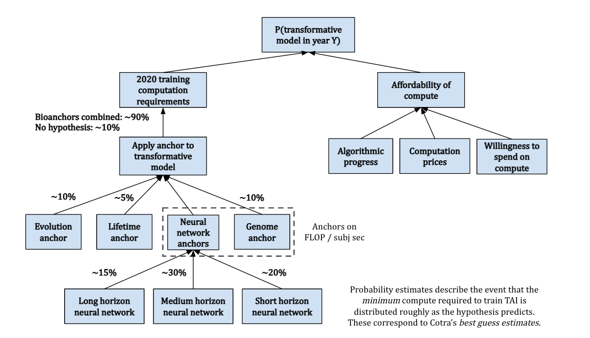
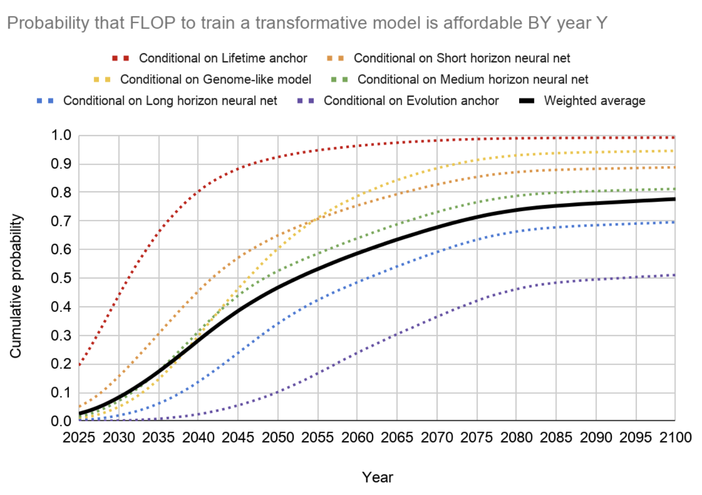

# 1.5 Forecasting {: #05 }

    

        <i class="fas fa-clock"></i>
        18 min read
    

    

        <i class="fas fa-file-alt"></i> 
        3631 words
    

In previous sections, we explored how foundation models leverage computation through scaling laws and the bitter lesson. But how can we actually predict where AI capabilities are headed? This section introduces key forecasting methodologies that help us anticipate AI progress and prepare appropriate safety measures.

**Why should we care about forecasting?** Forecasting AI progress is critical for AI safety work. The timeline to transformative AI shapes everything from research priorities to governance frameworks – if we expect transformative AI within 5 years versus 50 years, this dramatically changes which safety approaches are viable. For example, if we expect rapid progress, we might need to focus on safety measures that can be implemented quickly rather than long-term theoretical research. Additionally, understanding likely development trajectories helps us anticipate specific capabilities and prepare targeted safety measures before they emerge. This is especially critical given the potential for sudden capability jumps, especially in dangerous capabilities like malware generation or deception.

!!! question "Initial Forecast: Before we explore more sophisticated methods, make an initial prediction: When do you think we'll see transformative AI? Keep this forecast in mind as we examine different forecasting approaches."

## 1.5.1 Methodology {: #01 }

**How do we convert beliefs into probabilities and forecasts?** We need some ways to actually convert beliefs like "I think AGI is likely this decade" into precise probability estimates. One way we can do this is by decomposition - breaking down complex beliefs into smaller, measurable components and analyzing relevant data. Rather than directly estimating the year in which transformative AI emerges, we can start by separately forecasting things like compute growth, algorithmic progress, and hardware limitations, and then combine these estimates ([Zhang, 2024](https://forecasting-sp24.quarto.pub/forecasting-sp24/estimation.html)). This decomposition approach helps us ground predictions in observable trends rather than relying purely on intuitions. So, using this approach there are two main techniques we need to discuss - zeroth-order forecasting for establishing baselines, and first-order forecasting for understanding trajectories of change.

**What are reference classes and why do they matter?** When analyzing each component of our decomposed forecast, we need relevant historical examples to inform our predictions. This is where reference classes come in - they are categories of similar historical situations we can use to make predictions. For AI development, relevant reference classes might include things like previous technological revolutions (like the industrial or computer revolution), other optimization systems (like biological evolution or economies), or the impact of rapid scientific advances (like CRISPR or mRNA vaccines). The basic point is that they should be meaningfully analogous to what you're trying to predict, but they don't have to be from the same exact category.

**What is zeroth-order forecasting?** The simplest forecasting approach starts with recognizing that tomorrow often looks pretty close to today. Zeroth-order forecasting uses reference classes - looking at 3-5 similar historical examples and using their average as a baseline prediction. Rather than trying to identify trends or make complex projections, it assumes recent patterns will continue. ([Steinhardt, 2024](https://forecasting-sp24.quarto.pub/forecasting-sp24/zeroth-first.html)) These examples can be from different reference classes. For a concrete example of using multiple reference classes in AI safety forecasting: Suppose we want to predict how quickly advanced AI systems might transition from "safe" to "potentially dangerous" capabilities. We could look at:

- How long it took language models to go from generating basic text to being able to plan multi-step deception (an AI-specific reference point)

- How quickly nuclear technology transitioned from peaceful to military applications (a dual-use technology reference point)

- How rapidly biological techniques like CRISPR went from lab discovery to widespread use requiring safety protocols (a biosafety reference point)

Looking at these examples collectively might suggest that dangerous capabilities often emerge within 2-5 years of the underlying technical breakthroughs, which could inform how urgently we need to develop safety measures. Major shifts in development patterns tend to be rare, making recent history a decent baseline predictor of the near future. This doesn't mean changes never happen – but it does mean that deviating from recent patterns requires strong evidence.

**What is first-order forecasting?** While zeroth-order forecasting uses historical examples from various reference classes as direct predictors, first-order forecasting attempts to identify and project forward patterns in the direct historical data of AI development. In AI, we see some pretty consistent exponential growth patterns. The compute used in frontier models has grown by 4.2x annually since 2010, training datasets have expanded by approximately 2.9x per year, and hardware performance improves by roughly 1.35x every year through architectural advances ([Epoch AI, 2023](https://epoch.ai/trends)). First-order forecasting tries to identify these kinds of patterns and project them forward. This is the approach taken by most systematic AI forecasting work today, including Epoch AI's compute-centric framework and Ajeya Cotra's biological anchors. However, it's worth keeping in mind that even though these trends have been remarkably consistent, they can't continue indefinitely. Physical, thermodynamic, or economic constraints will eventually limit growth. The key question is: when do these limits become relevant? We will explore this in the next section on the compute centric framework.

**How do we combine different forecasts?** Multiple forecasting approaches often give us different predictions – zeroth-order might suggest one timeline while trend extrapolation indicates another. Just like we can average out over the opinions of many experts, we can integrate these predictions to get a hopefully more accurate picture. One approach is to model each forecast as a probability distribution and combine them using mixture models ([Steinhardt, 2024](https://forecasting-sp24.quarto.pub/forecasting-sp24/combining-forecasts-new.html)). For example, if zeroth-order forecasting suggests 3-4 years between major breakthroughs based on recent history, while trend extrapolation points to 1.5-2 years based on compute growth, a combined model might predict 2-3 years but with wider confidence intervals to account for uncertainty in both approaches.

**What about situations with limited data or limited reference classes? **While decomposition, reference classes and trend analysis form the backbone of AI forecasting, we sometimes face questions where direct data is limited or no clear reference classes exist. For instance, predicting the societal impact of advanced AI systems or forecasting novel capabilities that haven't been demonstrated before. In these cases, we often turn to expert judgment and superforecasters. An advantage of expert forecasting is the ability to integrate qualitative insights that might be missed by pure trend analysis. For example, experts might notice early warning signs of diminishing returns or identify emerging technical approaches that could accelerate progress. This balanced use of both data-driven methods and expert judgment is especially important for AI safety work. While we should ground our predictions in empirical trends whenever possible, we also need frameworks for reasoning about unprecedented developments and potential discontinuities in progress.

**How far do empirical findings generalize?** There's an ongoing debate about how much we can trust current trends to predict future AI development. Some researchers argue that empirical findings in AI generalize surprisingly far - that patterns we observe today will continue to hold even as systems become more capable ([Steinhardt, 2022](https://www.lesswrong.com/posts/ekFMGpsfhfWQzMW2h/empirical-findings-generalize-surprisingly-far)). However, our track record with forecasting suggests we should be cautious. When superforecasters predicted MATH dataset accuracy would improve from 44% to 57% by June 2022, actual performance reached 68% - a level they had rated extremely unlikely. Shortly after, GPT-4 achieved 86.4% accuracy. There are a couple of more examples of LLMs surprising most forecasters and experts on certain benchmarks. ([Cotra, 2023](https://www.planned-obsolescence.org/language-models-surprised-us/)).

This pattern of underestimating progress suggests that while empirical trends provide valuable guidance, they may not capture all the dynamics of AI development. Prior to GPT-3, many experts believed tasks like complex reasoning would require specialized architectures. The emergence of these capabilities from scaling alone shows how systems can develop unexpected abilities simply through quantitative improvements. This has critical implications for both forecasting and governance - we need frameworks that can adapt to capabilities emerging faster or differently than current trends suggest.

**How does this help us predict transformative AI? **These forecasting fundamentals help us critically evaluate claims about AI timelines and takeoff scenarios. When we encounter predictions about discontinuous progress or smooth scaling, we can ask: What trends support this view? What reference classes are relevant? How have similar forecasts performed historically? This systematic approach helps us move beyond intuition to make more rigorous predictions about AI development trajectories.

<!--

Trend Based Forecasting

This is an entire new subsection that will go here. It is still to be written.

-->

## 1.5.2 Biology Inspired Forecasting {: #02 }

**What are Biological anchors?** Biological anchors are a forecasting technique. To find a reference class, assume that the human brain is indicative of general intelligence. This means we can treat it as a proof of concept. Whatever “amount of compute” it takes to train a human being, might be roughly the same amount it should take to train a TAI. The biological anchors approach estimates the compute required for AI to reach a level of intelligence comparable to humans, outlined through several steps:

- First, assess how much computation the human brain performs, translating this into a quantifiable measure similar to computer operations in FLOP/s.

- Second, estimate the amount of computation needed to train a neural network to match the brain's inferential capacity, adjusting for future improvements in algorithmic efficiency.

- Third, examine when it would be feasible to afford such vast computational resources, taking into account the decreasing cost of compute, economic growth, and increasing investment in AI.

- Finally, by analyzing these factors, we can predict when it might be economically viable for AI companies to deploy the necessary resources for developing TAI.

Determining the exact computational equivalent for the human brain's training process is complex, leading to the proposal of six hypotheses, collectively referred to as "biological anchors" or "bioanchors." Each anchor has a different weighting contributing to the overall prediction.

Evolution Anchor: Total computational effort across all evolutionary history.

Lifetime Anchor: Brain's computational activity from birth to adulthood (0-32).

Neural Network and Genome Anchors: Various computational benchmarks based on the human brain and genome to gauge the scale of parameters needed for AI to achieve general intelligence.

<figure markdown="span">
{ loading=lazy }
  <figcaption markdown="1"><b>Figure 27:</b> A diagram showing the different starting points that we could use within the Bio anchors report to calculate the amount of effective compute required for human level transformative AI. ([Ho, 2022](https://epochai.org/blog/grokking-bioanchors))</figcaption>
</figure>

**Forecasting with Biological Anchors**. By integrating these anchors with projections of future compute accessibility, we can outline a potential timeline for TAI. This method aims to provide a "soft upper bound" on TAI's arrival rather than pinpointing an exact year, acknowledging the complexity and unpredictability of AI development. ([Karnofsky, 2021](https://forum.effectivealtruism.org/posts/ajBYeiggAzu6Cgb3o/biological-anchors-is-about-bounding-not-pinpointing-ai)) The following image gives an overview of the methodology.

<figure markdown="span">
{ loading=lazy }
  <figcaption markdown="1"><b>Figure 28:</b> The biological anchor model ([Ho, 2022](https://epochai.org/blog/grokking-bioanchors))</figcaption>
</figure>

=== "**Evolution anchor**"

    !!! warning "This is extra detail provided for those interested. It can be safely skipped."

    This anchor quantifies the computational effort invested by evolution in shaping the human brain. It considers the vast amount of processing and learning that has taken place from the emergence of the first neurons to the development of the modern human brain. This method suggests that evolution has served as a form of "pre-training" for the human brain, enhancing its ability to adapt and survive. To estimate the computational power of this evolutionary "pre-training", the report considers the total amount of compute used by all animal brains over the course of evolution. This includes not just the brains of humans, but also those of our ancestors and other animals with nervous systems. The idea is that all of this brain activity represents a form of learning or adaptation that has contributed to the development of the modern human brain. While the exact calculations involved in this estimate are complex and subject to considerable uncertainty, the basic idea is to multiply the number of animals that have ever lived by the amount of compute each of their brains performed over their lifetimes. This gives an estimate of the total compute performed by all animal brains over the course of evolution.

    <figure markdown="span">
    { loading=lazy }
      <figcaption markdown="1"><b>Figure 29:</b> The Evolution anchor ([Ho, 2022](https://epochai.org/blog/grokking-bioanchors))</figcaption>
    </figure>

    Cotra accounts for these considerations and assumes that the “average ancestor” performed as many FLOP/s as a nematode, and that there were on average ~1e21 ancestors at any time. This yields a **median of ~1e41 FLOP**, which seems extraordinarily high compared to modern machine learning. As an example, Google’s PaLM model was trained with ~2.5e24 FLOP (17 orders of magnitude smaller). She gives this anchor a **weight of 10%**. ([Ho, 2022](https://epochai.org/blog/grokking-bioanchors))

=== "**Lifetime anchor**"

    !!! warning "This is extra detail provided for those interested. It can be safely skipped."

    This refers to the total computational activity the human brain performs over a human lifetime. This anchor is essentially a measure of the "training" a human brain undergoes from birth to adulthood and incorporates factors such as the number of neurons in the human brain, the amount of computation each neuron performs per year, and the number of years it takes for a human to reach adulthood. The human brain has an estimated 86 billion neurons. Each of these neurons performs a certain number of computations per second, which can be calculated as a certain number of operations per second in FLOP/s. When calculating the total amount of compute over a lifetime, these factors are multiplied together, along with the number of years a human typically lives.

    For example, if we assume that a neuron is able to perform about 1000 operations per second, and there are about 31.5 million seconds in a year, then a single neuron would perform about 31.5 billion operations in a year. Now, if we multiply this by the estimated number of neurons in the human brain (86 billion), we get an estimate of the total brain-compute performed in one year. We can then multiply this by the number of years in a typical human lifespan to estimate the total brain-compute over a lifetime. Plugging in the numbers about brain FLOP/s seems to suggest that ~1e27 FLOP would be required to reach TAI. This seems low since examples from other technological domains suggest that the efficiency of things we build (on relevant metrics) is generally not great when compared to nature.

    <figure markdown="span">
    { loading=lazy }
      <figcaption markdown="1"><b>Figure 30:</b> The Lifelong anchor ([Ho, 2022](https://epochai.org/blog/grokking-bioanchors))</figcaption>
    </figure>

    Cotra's report finds a median of ~1e28 FLOP and only gives the lifetime anchor a 5% weight, indicating that it's not the most influential factor in the overall model. The report acknowledges the inherent uncertainties and complexities involved in such a calculation and uses this anchor as one of several to provide a range of estimates for the compute required to achieve AI with human-level performance. ([Ho, 2022](https://epochai.org/blog/grokking-bioanchors))

=== "**Neural network Anchors**"

    !!! warning "This is extra detail provided for those interested. It can be safely skipped."

    Each of the neural network anchors serves to provide a different perspective on the amount of compute that might be required to train a TAI. There are three Neural Network Anchors presented in the report: long (~1e37 FLOP), medium (~1e34 FLOP), and short horizon (~1e32 FLOP). These anchors hypothesize that the ratio of parameters to compute used by a TAI should be similar to the ratio observed in today's neural networks. Additionally, a TAI should perform approximately as many FLOPs per subjective second as a human brain. A “subjective second” is the time it takes a model to process as much data as a human can in one second ([Ho, 2022](https://epochai.org/blog/grokking-bioanchors)). As an example a typical human reads about 3-4 words per second for non-technical material, so “one subjective second” for a language model would correspond to however much time that the model takes to process about ~3-4 words of data. ([Cotra, 2020](https://www.alignmentforum.org/posts/KrJfoZzpSDpnrv9va/draft-report-on-ai-timelines)) Cotra determines the training data requirements based on a mix of machine learning theory and empirical considerations. She puts 15% weight on short horizons, 30% on medium horizons, and 20% on long horizons, for a total of 65% on the three anchors. ([Ho, 2022](https://epochai.org/blog/grokking-bioanchors))

    <figure markdown="span">
    { loading=lazy }
      <figcaption markdown="1"><b>Figure 31:</b> Neural network Anchors ([Ho, 2022](https://epochai.org/blog/grokking-bioanchors))</figcaption>
    </figure>

=== "**Genome Anchor**"

    !!! warning "This is extra detail provided for those interested. It can be safely skipped."

    The genome anchor looks at the FLOP/subj sec of the human brain and expects TAI to require as many parameters as there are bytes in the human genome. This hypothesis implicitly assumes a training process that’s structurally analogous to evolution, and that TAI will have some critical cognitive ability that evolution optimized for. This differs from the evolution anchor in that it assumes we can search over possible architectures/algorithms a lot more efficiently than evolution, using gradients. Due to this structural similarity, and because feedback signals about the fitness of a particular genome configuration are generally sparse, this suggests that the anchor only really makes sense with long horizon lengths. ([Ho, 2022](https://epochai.org/blog/grokking-bioanchors))

    <figure markdown="span">
    { loading=lazy }
      <figcaption markdown="1"><b>Figure 32:</b> The Genome Anchor ([Ho, 2022](https://epochai.org/blog/grokking-bioanchors))</figcaption>
    </figure>

    At least at the time of writing (May 2022), machine learning architectures don’t look very much like the human genome, and we are yet to develop TAI – thus Cotra updates against this hypothesis towards requiring more FLOP. Overall, she finds a median of ~1e33 FLOP and places 10% weight on this anchor. ([Ho, 2022](https://epochai.org/blog/grokking-bioanchors))

**Affordability of compute. **The costs related to bio anchors are calculated by considering three different factors: Algorithmic progress, compute price estimates, and willingness to spend on machine learning. The report considers a doubling in algorithmic efficiency every ~2-3 years. As for prices, Cotra assumes cost decreases over time, halving every ~2.5 years, and further expects this to level off after 6 orders of magnitude. Cotra assumes that the willingness to spend on machine learning training runs should be capped at 1% of the GDP of the largest country, referencing previous case studies with megaprojects (e.g. the Manhattan Project), and should follow a doubling time of 2 years after 2025. The main uncertainty is whether or not existing trends are going to persist more than several years into the future. For example, Epoch found that OpenAI’s AI and Compute investigation ([OpenAI, 2018](https://openai.com/blog/ai-and-compute/)) was too aggressive in its findings for compute growth. ([Ho et al., 2022](https://epochai.org/blog/grokking-bioanchors)) This suggests taking caution when interpreting the forecasts made by the Bio Anchors report.

<figure markdown="span">
{ loading=lazy }
  <figcaption markdown="1"><b>Figure 33:</b> Affordability of compute ([Ho et al., 2022](https://epochai.org/blog/grokking-bioanchors))</figcaption>
</figure>

The following graph gives an overview of the findings. Overall, the graph takes a weighted average of the different ways that the trajectory could flow. This gives us an estimate of a >10% chance of transformative AI by 2036, a ~50% chance by 2055, and an ~80% chance by 2100. In 2022 a two-year update on the author’s (Ajeya Cotra) timelines was published. The updated timelines for TAI are ~15% probability by 2030, ~35% probability by 2036, a median of ~2040, and a ~60% probability by 2050. ([Cotra, 2022](https://www.alignmentforum.org/posts/AfH2oPHCApdKicM4m/two-year-update-on-my-personal-ai-timelines))

<figure markdown="span">
{ loading=lazy }
  <figcaption markdown="1"><b>Figure 34:</b> Results from the biological anchor model for different anchors ([Karnofsky, 2021](https://forum.effectivealtruism.org/posts/vCaEnTbZ5KbypaGsm/forecasting-transformative-ai-the-biological-anchors-method))</figcaption>
</figure>

**Criticisms. **The Biological Anchors framework provides a unique perspective but it's also crucial to recognize its limitations and the broader debates it sparks within the AI research community. It is not universally accepted as the primary predictive tool among all ML scientists or alignment researchers.

Platt's Law is a generalized observation named after Charles Platt. It is used to highlight a historical pattern where the estimated arrival of AGI (Artificial General Intelligence) consistently seems to be "just 30 years away".

!!! quote "Vernor Vinge at  1993 NASA speech. ([Yudkowsky, 2021](https://intelligence.org/2021/12/03/biology-inspired-agi-timelines-the-trick-that-never-works/))"

    *Within thirty years, we will have the technological means to create superhuman intelligence. Shortly after, the human era will be ended.*

Yudkowsky notes that Platt’s law seems to fit remarkably well with the prediction made by the Biological Anchors report in 2020. As the statistical aphorism goes: "All models are wrong, but some are useful".

So to get a complete picture of how biological anchors were received, here are some of the criticisms of the Biological Anchors report:

- **Challenges Beyond Compute**: While Biological Anchors highlight compute power as a critical factor for AI development, they may oversimplify the complexity of achieving transformative AI. Factors beyond sheer computing capacity, such as algorithm design, data availability, and the intricacies of learning environments, play pivotal roles. It’s overly simplistic to equate the future of AI solely with compute availability, as transformative AI development encompasses more nuanced challenges like algorithm innovation and data accessibility. ([Karnofsky, 2021](https://www.cold-takes.com/biological-anchors-is-about-bounding-not-pinpointing-ai-timelines/))

- **Potential for Rapid Advancements**: Critics of the Biological Anchors method, such as Eliezer Yudkowsky, emphasize the unpredictability of AI progress and the potential for breakthroughs that could dramatically alter AI capabilities without adhering strictly to computational benchmarks derived from biology. These critiques highlight the importance of considering a range of factors and potential shifts in AI development paradigms that could accelerate progress beyond current forecasts. ([Karnofsky, 2021](https://www.alignmentforum.org/posts/nNqXfnjiezYukiMJi/reply-to-eliezer-on-biological-anchors))

- **Purpose and Misinterpretation**: The Biological Anchors approach is intended to provide boundary estimates for AI development timelines rather than precise predictions. Misinterpretations may arise from expecting the method to offer specific year forecasts, whereas its goal is to outline possible upper and lower bounds, acknowledging the significant uncertainties in AI development. ([Karnofsky, 2021](https://www.cold-takes.com/biological-anchors-is-about-bounding-not-pinpointing-ai-timelines/))

- **Contemplating Paradigm Shifts**: The AI field's history suggests that major paradigm shifts and technological breakthroughs could substantially impact development timelines. While deep learning currently dominates AI advances, the possibility of new, transformative methodologies emerging remains open, challenging the assumption that current trends will linearly continue into the future.

This is not an exhaustive list of all the criticisms but it serves to highlight the complexity of forecasting AI's future.