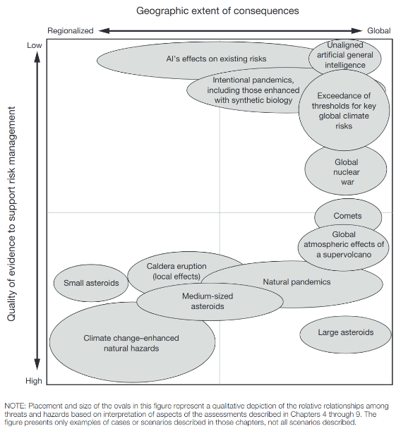
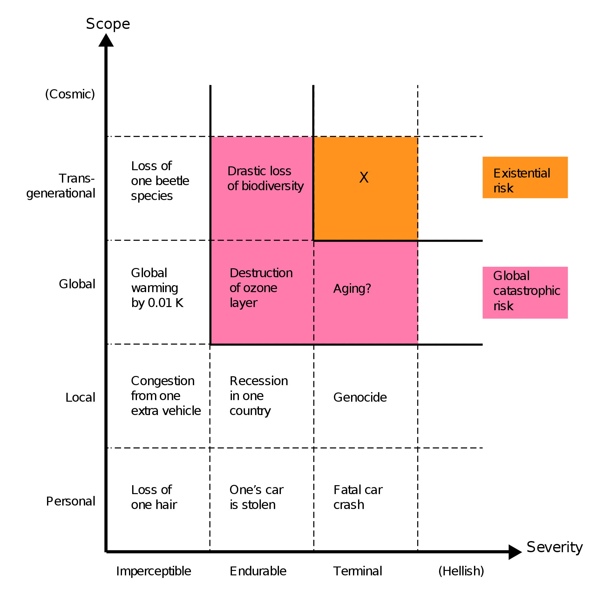

# 2.1 Risk Decomposition {: #01 }

    

        <i class="fas fa-clock"></i>
        8 min read
    

    

        <i class="fas fa-file-alt"></i> 
        1560 words
    

Even though AI continues to improve at a rapid pace, our current understanding of AI and potential long-term implications is still incomplete, posing significant challenges in accurately assessing and managing the associated risks.

<figure class="iframe-figure" markdown="span">
<iframe src="https://ourworldindata.org/grapher/annual-reported-ai-incidents-controversies?tab=chart" loading="lazy" style="width: 100%; height: 600px; border: 0px none;" allow="web-share; clipboard-write"></iframe>
  <figcaption markdown="1"><b>Interactive Figure 2.1:</b> Number of reported AI incidents and Controversies ([Giattino et al., 2023](https://ourworldindata.org/artificial-intelligence))</figcaption>
</figure>

## 2.1.1 Causes of Risk {: #01 }

To be able to properly understand and set up defenses against the potential risks that AI causes, we need to first categorize them. In this section, we present a taxonomy of AI risk classification based on casual models, i.e. a categorization based on who is responsible for the risk. The main risks we will focus on are the following:

- **Misuse risk****:** This includes cases in which the AI system is just a tool, but the goals of the humans augmented by AI cause harm. This includes malicious actors, nation states, corporations, or individuals who are able to leverage advanced capabilities to accelerate risks. Essentially these risks are caused due to the responsibility of some human or groups of humans.

- **Misalignment risk:** These risks are caused due inherent problems in the machine learning process or other technical difficulties in AI design. This category also includes risks from multiple AIs interacting and cooperating with each other. These are risks due to unintended behavior caused by AIs independent of human intentions.

- **Systemic risk:** These risks deal with disruptions, or feedback loops arising from integrating AI with other complex systems in the world. In this case upstream causes are difficult to pin down since the responsibility for risk is diffuse amongst many actors and interconnected systems. Examples could include AI (or groups of AIs) having an influence on economic, logistic, or political systems. This causes various types of risk as the entire global system of human civilization moves in an unintended direction, despite individual AIs being potentially aligned and responsibly used.

While most AI risks likely fall into one of these three categories, there may be some gray areas that don't neatly fit this taxonomy. For example, an advanced AI system causing harm due to a complex interaction of misaligned objectives (misalignment risk) and integration with global systems in unintended ways (systemic risk). The categories may blur together in some scenarios.

Despite this, we think that this general breakdown is a good foundation that captures many key AI risks as currently understood by experts in the field. The next subsections provide more detail into each one of these risk categories individually.

## 2.1.2 Severity of Risk {: #02 }

The previous subsection focused on asking the question - What causes the risk?, but we still have not categorized - How bad are the risks that were caused? In this subsection, we will walk through the potential categorizations of severity of risk posed.

**Destructive AI risks. **In general these refer to scenarios where AI systems cause damage that, while severe, is confined to a specific area or sector and does not spread globally. So these types of risks involve significant but localized harm. Examples include economic disruption, where an AI system manipulates financial markets leading to localized economic crises. Or, scenarios such as an infrastructure attack where we see AI-driven cyber attacks on power grids, transportation systems, or other critical infrastructure in a specific country or region.

Risks can be categorized both in terms of the number of people they affect and their spatiotemporal extent. In this subsection  - the severity of risk - we try to focus on risks that affect people not just locally, but across the entire globe, and over many generations. These are called - global catastrophic, and existential risks.

Global catastrophic and existential threats can be caused due to misuse, misalignment, or systemic factors. That is to say, we can have many combinations like global catastrophic risk caused by misalignment failures, or existential risk caused by systemic failures.

### 2.1.2.1 Catastrophic {: #01 }

**What are catastrophic risks?** Catastrophic risks (or global catastrophic risks) are threats that could bring about severe damage to humanity on a global scale. They are characterized by their potential to affect a significant portion of the world's population, with the rough threshold often considered to be risks that threaten the survival of at least 10% of the global population. These risks are significant not only because of the immediate harm they might cause but also due to their possible long-term repercussions.

<figure markdown="span">
{ loading=lazy }
  <figcaption markdown="1"><b>Figure 2.2:</b> RAND Global Catastrophic Risk Assessment ([Willis et al., 2024](https://www.rand.org/pubs/research_reports/RRA2981-1.html))</figcaption>
</figure>

**Trans-Generational AI Risk**. These are risks that might affect future generations. These risks involve scenarios where the actions of AI systems today have long-term consequences that will impact people far into the future. ([Kilian et al., 2022](https://arxiv.org/abs/2211.03157)) Examples include things like environmental destruction, where AI systems that exploit natural resources unsustainably bring about long-term ecological damage. It could also entail genetic manipulation, where AI technologies alter human genetics in ways that could have unknown and potentially harmful effects on future generations.

**What are examples of catastrophic risks? **There have been many instances in history of global catastrophic risks being caused by natural causes. One example is the Black Death, which may have resulted in the deaths of a third of Europe's population, corresponding to 10% of the global population at the time. 

But as technologies advance there is an increasing threat that we may discover technologies that allow us to cause similar amounts of harm as natural disasters, except due to man-made causes. ([Wikipedia](https://en.wikipedia.org/wiki/Global_catastrophe_scenarios)) For example, nuclear war was the first man-made global catastrophic risk, as a global war could kill a large percentage of the human population. ([Conn, 2015](https://futureoflife.org/background/the-risk-of-nuclear-weapons/))

Similar to biotechnology, AI can be used to greatly improve the lives of people, but if the technology is not developed safely, there is also the chance that someone could accidentally or intentionally unleash an AI system that ultimately causes global risks. ([Conn, 2015](https://futureoflife.org/background/benefits-risks-of-artificial-intelligence/))

The impact of these scenarios can vary widely, depending on the cause and the severity of the event, ranging from temporary economic disruption to the death of millions. We will go into specific scenarios that result in such risks later in the text.

### 2.1.2.2 Existential {: #02 }

**What are existential risks?** Most global catastrophic risks would not be so intense as to kill the majority of life on Earth, but even if one did, the ecosystem and humanity would eventually recover. An existential risk, on the other hand, is one in which humanity would be unable to ever recover its full potential. Existential risks are seen as the most severe class of global catastrophic risk and are often also called x-risks.

!!! info "Definition: Existential Risks (x-risks) ([Conn, 2015](https://futureoflife.org/existential-risk/existential-risk/))"

    An existential risk is any risk that has the potential to eliminate all of humanity or, at the very least, kill large swaths of the global population, leaving the survivors without sufficient means to rebuild society to current standards of living.

<figure markdown="span">
{ loading=lazy }
  <figcaption markdown="1"><b>Figure 2.3:</b> Qualitative risk categories. The scope of risk can be personal (affecting only one person), local (affecting some geographical region or a distinct group), global (affecting the entire human population or a large part thereof), trans-generational (affecting humanity for numerous generations, or pan-generational (affecting humanity overall, or almost all, future generations). The severity of risk can be classified as imperceptible (barely noticeable), endurable (causing significant harm but not completely ruining the quality of life), or crushing (causing death or a permanent and drastic reduction of quality of life). ([Bostrom, 2012](https://existential-risk.com/concept))</figcaption>
</figure>

In his book “The Precipice” published in 2020, philosopher Toby Ord provided a breakdown of existential risks. He recognized AI as one of the foremost existential risks facing humanity today, noting that there is a non-negligible probability that the development of advanced AI, or Artificial General Intelligence (AGI), could lead to an existential catastrophe if not properly aligned with human interests and values ([Ord, 2020](https://www.goodreads.com/book/show/48570420-the-precipice)).

<figure markdown="span">
{ loading=lazy }
  <figcaption markdown="1"><b>Figure 2.4:</b> According to Ord, most risks today are anthropogenic. “[Those numbers] are not in any way the final word, but are a concise summary of all I know about the risk landscape.” ([Toby Ord, 2020](https://www.goodreads.com/book/show/48570420-the-precipice)).</figcaption>
</figure>

If we face an existential-level catastrophe, we cannot learn or recover from the event, as it would either result in the complete end of humanity or a permanent setback to civilizational progress ([Bostom, 2008](https://www.goodreads.com/book/show/2659696-global-catastrophic-risks)). This is why x-risks merit a great deal of caution and calls for preventative rather than reactive strategies. These can include scenarios such as superintelligent AI, where AI systems surpass human intelligence and capabilities, potentially leading to scenarios where humans lose control over AI, resulting in our extinction ([Hendrycks et al., 2023](https://arxiv.org/abs/2306.12001)). It can also include scenarios where we end up in a permanent dystopia, where AI enables a global totalitarian regime where future generations are perpetually oppressed ([Hendrycks et al., 2023](https://arxiv.org/abs/2306.12001)). 

We will talk about solutions and risk mitigation strategies in future chapters. For the rest of this chapter, we will dive into the arguments that cause many to think that AI is a technology that can cause such risks.

    ❧

