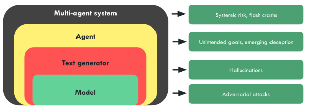

# 2.2 Risk Amplifiers

    

        
            <i class="fas fa-clock"></i>
        
        

            
Reading Time

            
18 min

        

    

This section covers some underlying common factors of both AI systems, as well as the development space surrounding these that serve as accelerating factors to increase risk.

## 2.2.1 Accidents {: #01}

Often, the whole point of producing a new technology is to produce a positive impact on society. Despite these noble intentions, there is a major category of risk that arises from large well-intentioned projects that unintentionally go wrong. ([Critch & Russel, 2023](https://arxiv.org/abs/2306.06924))

**Flaws are hard to discover** . It often takes time to observe all the downstream effects of releasing a technology. There are many examples throughout history of technologies that we built and released into the world only to later discover that they were causing harm. Some historical examples include the use of leaded paints and gasoline causing large populations to suffer from lead poisoning ([Kovarik, 2012](https://environmentalhistory.org/about/ethyl-leaded-gasoline/lead-history-timeline/)), the use of CFCs causing a hole in the ozone layer ([NASA, 2004](https://earthobservatory.nasa.gov/features/RemoteSensingAtmosphere/remote_sensing5.php)), our use of asbestos which is linked to serious health issues, the use of tobacco products, and more recently the widespread use of social media, the excessive use of which is linked to depression and anxiety. ([Hendrycks, 2024](https://www.aisafetybook.com/textbook/organizational-risks))

Some of these risks are diffuse and emerge only at the societal level, but others are perhaps easier to compare to software-based AI risks:

**Undetected hole in the ozone layer** . The example of the hole in the ozone layer might have occurred due to diffuse responsibility, but it was made worse because it remained undetected for a long period ([NASA, 2004](https://earthobservatory.nasa.gov/features/RemoteSensingAtmosphere/remote_sensing5.php)). This is because the data analysis software used by NASA in its project to map the ozone layer had been designed to ignore values that deviated greatly from expected measurements.

**The Mariner 1 Spacecraft** . In 1962 the Mariner 1 space probe barely made it out of Cape Canaveral before the rocket veered dangerously off course. Worried that the rocket was heading towards a crash-landing on Earth, NASA engineers issued a self-destruct command and the craft was obliterated about 290 seconds after launch. An investigation revealed the cause to be a very simple software error. A hyphen was omitted in a line of code, which meant that incorrect guidance signals were sent to the spacecraft. ([Martin, 2023](https://raygun.com/blog/costly-software-errors-history/))

There are countless other similar examples. Just like the one missing hyphen in the software for the Mariner spacecraft, we have also seen similar bugs due to one single character being altered in AI systems. OpenAI accidentally inverted the sign on the reward function while training GPT-2. The result was a model which optimized for negative sentiment while still regularizing toward natural language. Over time this caused the model to generate increasingly sexually explicit text, regardless of the starting prompt. In the author's own words “*This bug was remarkable since the result was not gibberish but maximally bad output. The authors were asleep during the training process, so the problem was noticed only once training had finished.*” ([Ziegler et al., 2020](https://arxiv.org/abs/1909.08593))

While this example didn't really cause much harm, except to perhaps the human evaluators who had to spend an entire night reading increasingly reprehensible text, we can easily imagine that extremely small bugs like a single flipped sign on a reward function can cause really bad outcomes if they were to occur in more capable models.

The rapid improvement, combined with a lack of understanding and predictability makes it more likely that despite the best intentions we might not be able to prevent accidents. This supports the case for heavily tested slow rollouts of AI systems, as opposed to the “Move fast and break things” ethos that some tech companies might hold.

**Harmful malfunctions** ([Jones, 2024](https://aisafetyfundamentals.com/blog/ai-risks/)). AI systems can make mistakes if applied inappropriately. For example:

- A self-driving car in San Francisco collided with a pedestrian that was thrown into its path by a human driver. This was arguably not its fault - however, after initially stopping it then started moving again, dragging the injured pedestrian a further six meters along the road. ([The Guardian, 2023](https://www.theguardian.com/technology/2023/nov/08/cruise-recall-self-driving-cars-gm)) Government investigators alleged that the company initially hid the severity of the collision from them. ([The Guardian, 2023](https://www.theguardian.com/business/2023/dec/04/california-cruise-robotaxi-san-francisco-accident-severity))

- A healthcare chatbot deployed in the UK was heavily criticized when it advised users potentially experiencing a heart attack not to get treatment. When these concerns were raised by a doctor, the company released a statement calling them a "Twitter troll". ([Lomas, 2020](https://techcrunch.com/2020/02/25/first-do-no-harm/))

Furthermore, use of AI systems can make it harder to detect and address process issues. Outputs of computer systems are likely to be overly trusted. ([Wikipedia](https://en.wikipedia.org/wiki/Automation_bias)) Additionally, because most AI models are used as black boxes and AI systems are much more likely to be protected from court scrutiny than human processes, it can be hard to prove mistakes. ([Marshall, 2021](https://www.postofficetrial.com/2021/06/marshall-spells-it-out-speech-to.html))

## 2.2.2 Indifference {: #02}

Risks arising from indifference can be caused when the creators of AI models discover certain problems, but they don't take the moral consequences that might arise on release of the system seriously.

Some employees of a company might conduct a risk analysis and conclude that there is a risk that’s bigger than expected or worse than expected. However, if the company stands to profit greatly from its strategy, or other factors such as safety gaming, or race dynamics, the model might be released anyway. It may be very difficult in such situations to motivate a change unless there is outside intervention or a chance of exposure to the companies lack of concern about the moral consequences arising from the release of such a system. ([Critch et al., 2023](https://arxiv.org/abs/2306.06924))

A potential comparison for such indifference risks, can be seen from the lawsuit that alleges that facebook violated consumer protection law.

According to the lawsuit - “*They purposefully designed their applications to addict young users, and actively and repeatedly deceiving the public about the danger posed to young people by overuse of their products. The lawsuit alleges that based on its own internal research, Meta knew of the significant harm these practices caused to teenage users and chose to hide its knowledge and mislead the public to make a profit. This misconduct affects hundreds of thousands of teenagers in Massachusetts who actively use Instagram.*” ([Office of the Attorney General, 2023](https://www.mass.gov/news/ag-campbell-files-lawsuit-against-meta-instagram-for-unfair-and-deceptive-practices-that-harm-young-people))

If similar attitudes of indifference continue as more powerful AI systems are developed then the risk of harm affecting larger portions of society, and in worse ways rises accordingly.

Risks from corporate indifference highlight why merely having the technological solution to mitigating risks is not enough. We need to also establish regulations, and worldwide industry standards and norms that cannot be ignored such as professional codes of conduct, regulatory bodies, political pressures, and laws. For instance, technology companies with large numbers of users could be expected to maintain accounts of how they are affecting their users’ well-being. ([Critch et al., 2023](https://arxiv.org/abs/2306.06924)) We will talk more about possible technical interventions in the chapters on the Solutions, and regulatory interventions in the chapter on AI Governance.

## 2.2.3 Unpredictability {: #03}

**AI surprised even the experts.** The first thing to keep in mind is that the rate of capabilities progress has shocked almost everyone, including the experts. We have seen many examples in history where scientists, and experts significantly underestimate the time it takes for a groundbreaking technological advancement to become a reality.

For a long time, famous cognitive scientist Douglas Hofstadter was among those predicting slow progress. “*I felt it would be hundreds of years before anything even remotely like a human mind*”, he said in an interview. ([Hofstadter, 2023](https://www.youtube.com/watch?v=lfXxzAVtdpU&t=1763s&ref=planned-obsolescence.org))

!!! quote "Douglas Hofstadter ([Hofstadter, 2023](https://www.youtube.com/watch?v=lfXxzAVtdpU&t=1763s&ref=planned-obsolescence.org))"

    This started happening at an accelerating pace, where unreachable goals and things that computers shouldn't be able to do started toppling [...] systems got better and better at translation between languages, and then at producing intelligible responses to difficult questions in natural language, and even writing poetry [...] The accelerating progress has been so unexpected, so completely caught me off guard, not only myself but many, many people, that there is a certain kind of terror of an oncoming tsunami that is going to catch all humanity off guard.

ML researchers, superforecasters[^footnote_2], and most others were all surprised by the progress in large language models in 2022 and 2023.

[^footnote_2]: A person who makes forecasts that can be shown by statistical means to have been consistently more accurate than the general public or experts. ([Wikipedia](https://en.wikipedia.org/wiki/Superforecaster))

In mid-2021, ML professor Jacob Steinhardt ran a contest to predict progress on MATH and MMLU, two famous benchmarks.

<figure markdown="span">
{ loading=lazy }
  <figcaption markdown="1"><b>Figure 2.5:</b> Experts have been consistently underestimating the pace of AI progress.</figcaption>
</figure>

Superforecasters massively undershot reality:

- In 2021, they predicted that performance on MMLU would improve moderately from 44% in 2021 to 57% by June 2022. The actual performance was 68%, which superforecasters had rated incredibly unlikely. ([Cotra, 2023](https://www.planned-obsolescence.org/language-models-surprised-us/)). 

- Shortly after that, models got even better — GPT-4 achieved 86.4% on this benchmark, close to the 89.8% that would be “expert-level” within each domain, corresponding to 95th percentile among human test takers within a given subtest. ([Cotra, 2023](https://www.planned-obsolescence.org/language-models-surprised-us/))

This is even more visible for the MATH dataset, that consists of free-response questions taken from math contests aimed at the best high school math students in the country. Most college-educated adults would get well under half of these problems right. At the time of its introduction in January 2021, the best model achieved only about ~7% accuracy on MATH. ([Cotra, 2023](https://www.planned-obsolescence.org/language-models-surprised-us/)). And here is what happened:

<figure markdown="span">
{ loading=lazy }
  <figcaption markdown="1"><b>Figure 2.6:</b> Another prediction distribution by experts in 2022, that way undershot expected capabilities.</figcaption>
</figure>

Not all forms of progress can be easily captured in quantifiable benchmarks. Often we care more about when AI systems will achieve more qualitative *milestones*: when will they translate as well as a fluent human? When will they beat the best humans at Starcraft? When will they prove novel mathematical theorems?

Katja Grace of AI Impacts asked ML experts to predict a wide variety of AI milestones in 2022. This was a few months before ChatGPT was released. This time accuracy was lower — experts failed to anticipate the progress that ChatGPT and GPT-4 would soon bring. These models achieved milestones like “Write an essay for a high school history class” or “Answer easily Googleable factual but open-ended questions better than an expert” just a few months after the survey was conducted, whereas the experts expected them to take years. ([Cotra, 2023](https://www.planned-obsolescence.org/language-models-surprised-us/))

That means that even after the big 2022 benchmark surprises, experts were still in some cases strikingly conservative about anticipated progress, and undershooting the real situation.

## 2.2.4 Black-boxes {: #04}

These risks are made more acute by the black-box nature of advanced ML systems. Our understanding of how AI systems behave, what goals they pursue, and our understanding of their internal behaviors lags far behind the capabilities they exhibit. The field of interpretability aims to progress on this front but remains very limited.

**AI models are trained, not built** . This is very different from how a plane is assembled from pieces that are all tested and approved, to create a modular, robust, and understood system. AI models learn the heuristics needed to perform tasks by themselves, and we have relatively little control or understanding of what these heuristics are. Gradient descent is a powerful optimization strategy, but we have little control and understanding of the structure it discovers. To give an analogy, this is the difference between a codebase that is documented function by function and a codebase that is more like spaghetti code, with leaky and non-robust abstractions and poor modularity.

AI systems are a series of emergent phenomena we steer but don't understand. We can give a general direction, for example by designing the dataset or through prompt engineering, but this is far from the precision of software engineers or when designing a system like in the aerospace industry. There are no formal guarantees that the system will behave as expected. AI systems are like Russian dolls, with each technological layer surrounded by emergent problems and blind spots unforeseen at previous steps.

- **The Model** : Making a prediction on the next word or action, but it can be jailbroken through adversarial attacks.

- **Text generator** : The model that predicts the next token must be put into a system that constructs sentences, to create, for example, the APIs that allow getting a paragraph response to a question. But at this scale, the sentences can contain false information and hallucinations.

- **Agent** : The text generator can be put in a loop to create an agent: We give an objective to an agent, and the agent will decompose the objective into sub-objectives and sub-actions until accomplishing the goal. But goal-directed systems are subject once again to problems of unintended goals or emerging deception, as exhibited by the agent Cicero.

- **Multi-agent system** : The agent can dialogue with other agents or humans, resulting in a complex system that is subject to new phenomena, such as flash crashes in the financial world.

<figure markdown="span">
{ loading=lazy }
  <figcaption markdown="1"><b>Figure 2.7:</b> For illustrative purposes. Figure from the French Center for AI Safety’s agenda.</figcaption>
</figure>

## 2.2.5 Deployment Scale {: #05}

Another aggravating factor is that many AIs are already deployed at massive scales, significantly affecting various sectors and aspects of daily life. They are getting increasingly enmeshed into society. Chatbots are a leading example as a showcase of AIs already deployed for millions globally. But there are many other examples.

**Autonomous drones** . There are increasingly more autonomous drones being deployed around the world, which marks a significant step towards an arms race in autonomous technologies. An example of this is the autonomous military drone called Kargu-2. These drones fly in swarms and, once launched, are capable of autonomously targeting and eliminating their targets. They were used by the Turkish army in 2020. ([Nasu, 2021](https://lieber.westpoint.edu/kargu-2-autonomous-attack-drone-legal-ethical/))

<figure markdown="span">
{ loading=lazy }
  <figcaption markdown="1"><b>Figure 2.8:</b> Kargu-2 ([Nasu, 2021](https://lieber.westpoint.edu/wp-content/uploads/2021/06/STM_Kargu.png))</figcaption>
</figure>

**AI Relationships.** There has been an explosion of chatbot powered AI friends, therapists and lovers from services like Replika. One popular example is [Xiachoice](https://en.wikipedia.org/wiki/Xiaoice) which is an AI system designed to create emotional bonds like friendships or romance with humans. It is reminiscent of the AI depicted in the movie “Her”, and was used by 600 million Chinese citizens. ([Euro News, 2021](https://www.euronews.com/next/2021/08/26/meet-xiaoice-the-ai-chatbot-lover-dispelling-the-loneliness-of-china-s-city-dwellers))**Google's Pathways** aims to revolutionize AI's capabilities, enabling a single model to perform thousands or millions of tasks. This ambition towards centralizing the global information flow could significantly influence the control and dissemination of information. ([Dean, 2021](https://blog.google/technology/ai/introducing-pathways-next-generation-ai-architecture/)) YouTube's recommendation algorithm has surpassed Google searches in terms of directing user engagement and influence. All these AIs already have massive consequences.

## 2.2.6 Race Dynamics {: #06}

The “race to the bottom” refers to a problematic scenario where competitive pressures in the development of AI lead to compromised safety standards. Safe development is costly for companies caught up in an innovation race. Under certain conditions, the twin effects of widespread risk and costly safety measures may cause a “race to the bottom” in the level of safety investment. In a race to the bottom, each competitor skimps on safety to accelerate their rate of development progress.

**The Collingridge Dilemma.** This dilemma essentially highlights the challenge of predicting and controlling the impact of new technologies. It posits that during the early stages of a new technology, its effects are not fully understood and its development is still malleable. Attempting to control - or direct it - is challenging due to the lack of information about its consequences and potential impact. Conversely, when these effects are clear and the need for control becomes apparent, the technology is often so deeply embedded in society that any attempt to govern or alter it becomes extremely difficult, costly, and socially disruptive.

**Competitive pressures can lead to compromise on safety** . A high-stakes race (for advanced AI) can dramatically worsen outcomes by making all parties more willing to cut corners in safety. Just as a safety-performance tradeoff in the presence of intense competition pushes decision-makers to cut corners on safety, so can a tradeoff between any human value and competitive performance incentivize decision makers to sacrifice that value. Contemporary examples of values being eroded by global economic competition could include non-monopolistic markets, privacy, and relative equality. In the long run, competitive dynamics could lead to the proliferation of forms of life (countries, companies, autonomous AIs) which lock-in bad values. ([Dafoe, 2020](https://www.allandafoe.com/opportunity))

Allan Dafoe the founding director and former president of the Centre for the Governance of AI (GovAI), and is considered by some as the founder of the field of AI Governance. In the document he links, Dafoe addresses several objections to this argument. ([Dafoe, 2021](https://www.allandafoe.com/ai-talks)) Here are summaries of some objections and responses: If competition creates terrible competitive pressures, wouldn't actors find a way out of this situation by using cooperation or coercion to put constraints on their competition? Maybe. However it may be very difficult in practice to create a politically stable arrangement for constraining competition. This could be especially difficult in a highly multipolar world. Political leaders do not always act rationally. Even if AI makes political leaders more rational, perhaps it would only do so after leaders have accepted terrible, lasting sacrifices for the sake of competition.

**Why is this risk particularly important now?** AI may greatly expand how much can be sacrificed for a competitive edge. For example, there is currently a limit to how much workers' well-being can be sacrificed for a competitive advantage; miserable workers are often less productive. However, advances in automation may mean that the most efficient workers will be joyless ones.

## 2.2.7 Coordination Challenges {: #07}

!!! quote "Max Tegmark (Professor at MIT, Life 3.0 Author, AI Safety Researcher)([Tegmark, 2023](https://time.com/6273743/thinking-that-could-doom-us-with-ai/))"

    Since we have such a long history of thinking about this threat and what to do about it, from scientific conferences to Hollywood blockbusters, you might expect that humanity would shift into high gear with a mission to steer AI in a safer direction than out-of-control superintelligence. Think again.

The report “Coordination challenges for preventing AI conflict” ([Torges, 2021](https://longtermrisk.org/coordination-challenges-for-preventing-ai-conflict/)) raises another class of potential coordination failures. When people task powerful AI systems with high-stakes activities that involve strategically interacting with other AI systems, bargaining failures between AI systems could be catastrophic:

As an example, consider a standoff between AI systems similar to the Cold War between the U.S. and the Soviet Union. If they failed to handle such a scenario well, they might cause nuclear war in the best case and far worse if technology has further advanced at that point.

Some might be optimistic that AIs will be so skilled at bargaining that they will avoid these failures. However, even perfectly skilled negotiators can end up with catastrophic negotiating outcomes ([Fearon, 2013](https://web.stanford.edu/group/fearon-research/cgi-bin/wordpress/wp-content/uploads/2013/10/Rationalist-Explanations-for-War.pdf)). One problem is that negotiators often have incentives to lie. This can cause rational negotiators to disbelieve information or threats from other parties even when the information is true and the threats are sincere. Another problem is that negotiators may be unable to commit to following through on mutually beneficial deals. These problems may be addressed through verification of private information and mechanisms for making commitments. However, these mechanisms can be limited. For example, verification of private information may expose vulnerabilities, and commitment mechanisms may enable commitments to mutually harmful threats.

As of 2024 there is a clear lack of adequate preparation for the potential risks posed by AI despite its significant advancements. This lack of readiness stems largely from the issue's complexity, a significant gap in public understanding, and a divide in expert opinions on the level of risks that AI poses.

Many AI researchers have issued warnings, but their impact has been limited due to the abstract and complex nature of the problem. The AI safety issue is not readily tangible to most people, making it challenging to grasp the potential risks and envision how things could go wrong. Similarly, the field of AI safety suffers from an “awareness problem” that climate change, for instance, does not.

Moreover, there's a notable divide among experts. While some, like Yann LeCun, believe that AI safety is not an immediate concern, others argue that AI development has outstripped our ability to ensure its safety ([Yudkowsky, 2023](https://time.com/6266923/ai-eliezer-yudkowsky-open-letter-not-enough/)). This lack of consensus leads to mixed messages about the urgency of the issue, contributing to public confusion and complacency.

Furthermore, the discourse on AI safety has been clouded by politics and misconceptions. Misinterpretations of what AI safety entails, as well as how it's communicated, can lead to alarmism or dismissive attitudes ([Angelou, 2022](https://www.lesswrong.com/posts/tP75xLX7pddtMsT8v/alignment-is-hard-communicating-that-might-be-harder)). Efforts to raise awareness about AI safety can inadvertently result in backlash or be co-opted into broader political and cultural debates.

Finally, the allure of AI advancements can overshadow their potential risks. For instance, the SORA text-to-video model's impressive capabilities may elicit excitement and optimism, but this can also distract from the substantial safety concerns the development of AGI could raise.

In conclusion, despite warnings and advancements, the world remains inadequately prepared for the potential risks posed by AI. Addressing this issue will require greater public education about AI safety, a more unified message from experts, and careful navigation of the political and social implications of the AI safety discourse.