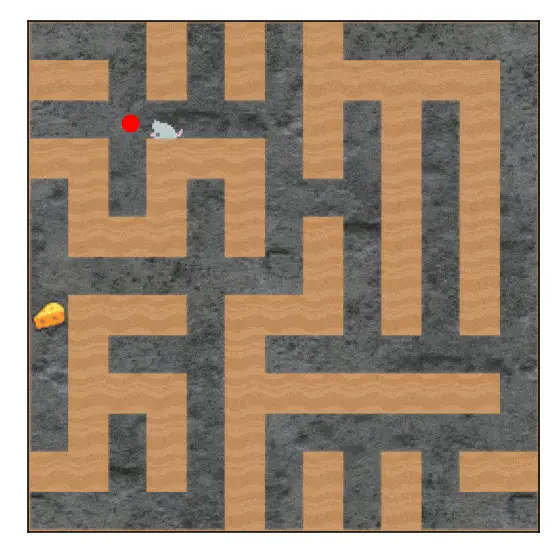
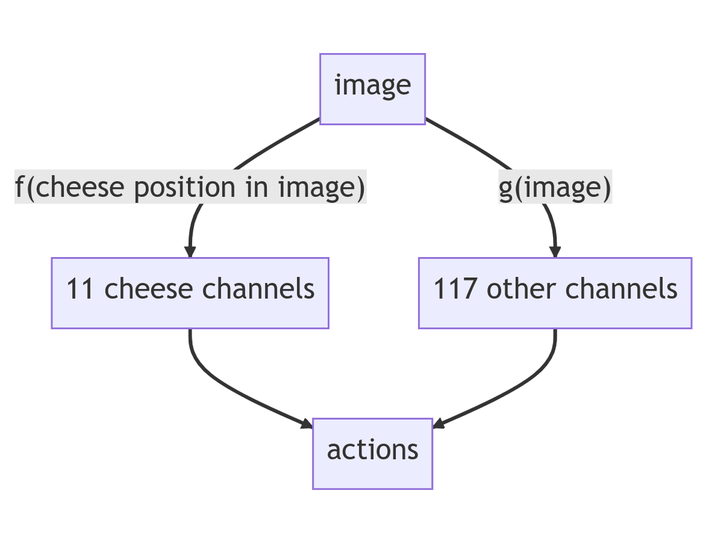
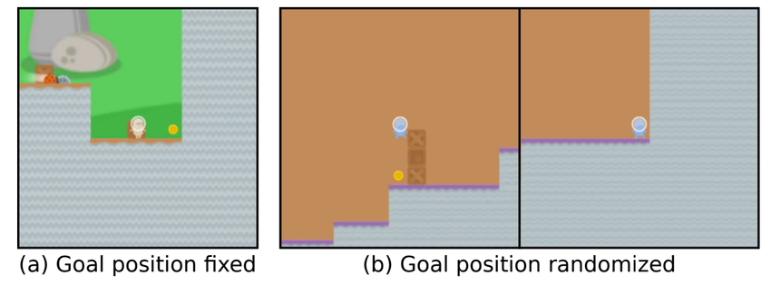

# 2.4 Misalignment Risk {: #04 }
!!! note "Reading Time: 21 minutes" 

In the earlier sections, we outlined what exactly it means for an AI to be misaligned and covered some basic capabilities and risks such as deceptive behavior, power-seeking behaviors, etc. In this section, we focus on why we might expect a powerful AI to become misaligned in the first place.

!!! quote "Sam Altman, CEO of OpenAI, Feb 2015."

    
    
    "*The development of superhuman machine intelligence (SMI) is probably the greatest threat to the continued existence of humanity.*" ([source](https://blog.samaltman.com/machine-intelligence-part-1))
    
    

In the previous chapter, we discussed how AI systems might continue to get increasingly capable if current trends continue. This indicates that at some point in the future AI systems could surpass human capabilities. It is generally safe to assume that the most capable entity is the one that shapes the future.

**Alignment is not the default**. Higher degrees of intelligence do not mean that every intelligent being shares the same final goals. There is a difference between an AI becoming capable  of understanding humanity's goals, and it actually adopting our goals: such an AI could, for instance, behave like a sociopath who understands social conventions but does not follow them. Additionally, most goals imply certain sub-goals arising such as self-preservation or power-seeking as “a means to an end”. AIs with goals such as these might resist human attempts at being corrected, shut  down, or prevented from gathering too much influence over society.

**Misalignment is dangerous**. If a highly capable system pursues poorly defined goals, it could cause large-scale accidents. Therefore, goals need to be extremely precise and capture what we as humans want from a system that is potentially more capable than us. However, we cannot predict what a competent agent is planning if we are less competent than it. This makes preparing any defense extremely difficult.

**Alignment is hard**. Specifying a goal that can never be manipulated, exploited, lacks loopholes, and always stays true to the original intention of the designers is extremely difficult. Formalizing any system of values from the natural language that humans use to math or code is hard, and is only possible for simple games like chess. If we somehow manage to find a goal that satisfies all these criteria, it is still not clear that goals will be internalized correctly by the AI. The capabilities of an AI can be more robust than its goals, which can cause many problems because this would create a competent AI that is not aligned.

In what follows, we will dive deeper into the arguments that we laid out in the previous three paragraphs.

## 2.4.1 Misalignment by default {: #01 }

Let’s build up the case for why highly capable machine intelligence will neither be beneficial nor aligned by default.

### 2.4.1.1 Orthogonality Thesis {: #01 }

Intelligence and final goals are orthogonal: more or less any level of intelligence could in principle be combined with more or less any final goal. ([source](https://www.amazon.com/Superintelligence-Dangers-Strategies-Nick-Bostrom/dp/1501227742)) A sufficiently intelligent AI might understand human goals, but this does not inherently mean it will act according to those goals. It might be tempting to think that an entity that is sufficiently intelligent would  naturally become “wise” or “moral” in the process. The orthogonality thesis as put forth by Nick Bostrom challenges this notion. It suggests that just because a system is intelligent doesn't mean it will automatically align with anthropomorphic notions of wisdom or morality. This means an AI could be extremely intelligent, in the sense of being very competent at reaching its objectives, yet pursue goals that might not align with human values at all. 

One example of orthogonality could be seen from Large Language Models (LLMs). Despite being highly capable, they can be fine-tuned to embody any set of values, making them serve beneficial purposes like being a helpful assistant or causing disruption like ChaosGPT.

This thesis, while not definitively proven, faces weak counterarguments. It argues that finding a model with both 1) a certain level of capability, and 2) a specific goal, is as challenging as finding each requirement separately.

### 2.4.1.2 Instrumental Convergence {: #02 }

**Instrumental Goals**. If intelligence and goals are independent variables, then AIs could vary widely without one necessarily influencing the other. So how do we make any predictions about the kinds of things that future AIs might or might not do? To understand this, let's split up the notion of goals into two parts.

A terminal goal, also known as an “intrinsic goal”, is an objective that you have for its own sake. Think of these as things that you want just because you want them. There is no further asking why you want this. On the other hand, an instrumental goal is one that you pursue to increase your likelihood of achieving your terminal goals.

**Instrumental Convergence Hypo****t****hesis**. Several instrumental values can be identified that are convergent in the sense that their attainment would increase the chances of the agent's goal being realized for a wide range of final goals and a wide range of situations, implying that these instrumental values are likely to be pursued by a broad spectrum of situated intelligent agents. ([source](https://www.amazon.com/Superintelligence-Dangers-Strategies-Nick-Bostrom/dp/1501227742))

**“***You can't get the coffee if you're dead*" is Stuart Russell's short description to convey the notion of instrumental convergence. For such a robot, self-preservation would be an instrumental goal necessary to achieve the terminal goal of “fetching the coffee”. And not dying is instrumental to achieving many goals. Instrumental convergence is the idea that sufficiently advanced intelligent systems with a wide variety of terminal goals would discover similar instrumental goals like self-preservation, goal integrity, resource acquisition, and cognitive enhancement. These are like sub-goals that are always useful. An example of this is money (or resources more generally). No matter what final goal you might have in life, it is always useful to have more resources as they increase the likelihood of you being able to achieve your final goal. This gives us an idea of what kinds of behaviors that even superintelligent AIs might end up displaying.

**Examples and evidence of instrumentally convergent behavior**. One example can be seen from OpenAI, where agents trained to play hide and seek learned to use objects and construct shelters to stay hidden. They were not rewarded for using these objects, instead, the hiders were rewarded for evading the seekers, and the seekers were rewarded for finding them. This behavior emerged as instrumentally convergent. ([source](https://arxiv.org/abs/1909.07528))

??? note "Can’t We Just Shut Down an AI? The Stop-Button Problem"

    
    
    What would we do if the AIs became competent and self-preserving?
    
    One thing that might make your AI system safer is to include an off-switch. This way, if it ever does anything we don’t like, we can turn it off. Unfortunately, this only works if we can turn it off before things get bad, which we might not be able to do when the AI thinks much faster than humans.
    
    But, even assuming we’ll notice in time, an off-switch might still not work.
    
    **The “Stop-Button” problem**. Ideally, an off-switch would allow humans to deactivate the AI before it causes harm. However, AIs might resist shutdown efforts for instrumental reasons, much like humans might resist being “turned off” to continue protecting or fulfilling their objectives. Parents, for example, might fight against threats to their life not out of self-preservation but to ensure their child's safety. As Stuart Russell quipped: “You can’t fetch the coffee if you’re dead.” If the AI dies or is shut down, that means it has to stop doing what it was doing. Therefore, it will be motivated to protect itself as an instrumental goal.
    
    More powerful AIs may become too essential to society or our need to be shut down, similar to the indispensability of the Internet. As we become increasingly dependent on AI, the skills or knowledge to function without AI will diminish, which could increase the stakes of their interruption.
    
    In summary, while an off-switch seems a practical solution to AI risks, the reality is fraught with challenges in ensuring such systems are truly corrigible, especially as they become more capable and embedded in our daily lives.
    
    

## 2.4.2 Misalignment is dangerous {: #02 }

### 2.4.2.1 General intelligence is possible {: #01 }

**Humans demonstrate general intelligence**, in their capacity to solve an array of problems across various domains. This indicates that not only is the concept of general intelligence possible, but also that possessing such a general intelligence has led humans to become the dominant species on Earth. ([source](https://intelligence.org/2015/07/24/four-background-claims/))

**AI systems could surpass human intelligence. **It is still uncertain whether and when exactly machine intelligence might surpass humans, but given our discussion in the previous chapter, it seems at least conceivable that they have the potential to do so. Considering the brief evolutionary period between chimpanzees and generally intelligent humans, we can conclude that human intelligence is not incomprehensibly complex. So it is in principle possible that we will eventually understand and replicate it. 

However, man-made machines consistently outperform their biological counterparts (cars vs. horses, planes vs. birds, submarines vs. fish, etc.). Thus, it is rational to assume that just as birds are not the pinnacle of flight, humans are not the apex of intelligence. Therefore, it is plausible to foresee a future where machines are more intelligent than humans. ([source](https://intelligence.org/2015/07/24/four-background-claims/))

**Highly intelligent AI systems will shape the future. **Historically, confrontations between human groups have often culminated with the technologically superior faction dominating its competitor. If an AI surpasses human intelligence, it could outsmart or socially manipulate us. This means that it could significantly influence the direction of future events. ([source](https://intelligence.org/2015/07/24/four-background-claims/))

### 2.4.2.2 Goal-directedness {: #02 }

The previous section uses the concept of "highly intelligent AI systems", but we need to be more precise. The important property that is dangerous is goal-directedness.

**Goal-directed systems are useful. **These systems are designed to pursue explicitly set objectives, making them adaptable and effective for various tasks. The usefulness of goal-directed systems stems from the inherent challenges associated with specifying every possible heuristic or rule that might be required to solve complex problems. It is often impractical, if not impossible, to hard-code all the nuanced decision-making processes and contextual judgments a system may need to employ in order to navigate real-world scenarios effectively.

Instead of trying to enumerate all these heuristics, it is more feasible to encode the desired end-state or goal into the system. The system then uses its advanced planning and strategic awareness capabilities to determine the steps necessary to achieve that goal. This approach leverages the system's problem-solving abilities to navigate towards the objective rather than relying on a predefined set of instructions. This level of autonomy and adaptability is what makes goal-directed systems particularly useful. They can operate in dynamic environments and handle a wide range of tasks that would be too complex or unpredictable to tackle with rigid, rule-based programming.

**A goal-directed system could be powerful and dangerous. **If your only goal is to eliminate cancer, for example by minimizing the number of people with cancer, and you lack human instincts, a first solution might be to monitor people. However, monitoring can only reduce the number of people with cancer. That is not enough if you want to get to zero cancer. So, another relatively easy solution might be to release an engineered virus and kill everyone in the world. If you are competent enough to carry out this plan, it will reduce cancer to zero. This kind of problem is what we call specification gaming, and can be expected for any kind of problem given to a superintelligence because it is very difficult to specify precisely all the things we care about. Less catastrophic versions of this type of problem, specification gaming, have been observed in many AI systems.

??? question "Exercise: Thought Experiment on Autonomous Planning"

    
    
    We want an AI able to manage an agricultural company autonomously.
    
    Consider the following program:
    
    For each imaginable plan (or scenario):
    
    Predict the consequences of executing the plan
    
    Rate its consequences based on the company’s production (and nothing else)
    
    Execute the plan whose predicted consequences are the best.
    
    This is the canonical example of what we will call autonomous planning (or agency).
    
    What plans could be executed?
    
    Example: One could install food crops over the entire surface of the Earth, to the point that there is no longer any habitable surface for humans.
    
    A sufficiently competent program pursuing a poorly aligned goal would create a large-scale accident.
    
    

??? note "What does goal-directed even mean?"

    
    
    The concept of goal is generally fuzzy, but we can try to define the concept by giving some examples: An image classifier is not goal-directed. AlphaGo is goal-directed to maximize the chance of winning.
    
    What about a human? That depends. If a human just wants to go to sleep, not really. But if a human really wants to achieve a goal, lists different possibilities on a piece of paper, evaluates those possibilities, and chooses the best one, it is much more goal-directed.
    
    What about a chatbot? It depends. If you put a chatbot in AutoGPT, the system can become goal-directed: the system can list possibilities, and try to rate and evaluate each possibility against the goal. This is much more goal-oriented than the basic LLM.
    
    
    
    Figure: ([source](https://www.alignmentforum.org/s/sCGfFb5DPfjEmtEdn/p/cAC4AXiNC5ig6jQnc))
    
    What about a mouse AI trained to navigate a maze to find the cheese? It depends on how you define goal-directedness, but behaviorally it navigates to the cheese, and it is possible to look at the internal structure of the AI to discover that we can somewhat decompose the AI between the “goal” and the capabilities.
    
    
    
    Figure: ([source](https://www.alignmentforum.org/s/sCGfFb5DPfjEmtEdn/p/cAC4AXiNC5ig6jQnc))
    
    One part of the mouse tries to find the cheese (is it up or down?). Another part of the mouse is trying to navigate to that cheese. This is the difference between the motivational API, which can implement different types of goals and the capabilities.
    
    Unfortunately, in general, this distinction between capabilities and goals is not so clear. ([source](https://www.alignmentforum.org/s/sCGfFb5DPfjEmtEdn/p/cAC4AXiNC5ig6jQnc))
    
    

### 2.4.2.3 Vingean uncertainty {: #03 }

***Figure****: An illustration of Vingean uncertainty: Magnus Carlsen **checkmates** Bill Gates in 12 seconds, and this is not a surprise. Bill Gates knew he was going to lose, but not how. (**[source](https://www.chess.com/news/view/bill-gates-vs-magnus-carlsen-checkmate-in-12-seconds-8224)**)*

**Goal-directed systems are not only dangerous, but their actions are also difficult to anticipate.**

**Vingean uncertainty** is a concept named after Vernor Vinge, which relates to the challenges of predicting the actions of intelligence greater than our own. This uncertainty doesn't mean we cannot understand or predict the actions of more intelligent agents. For instance, the creators of the chess-playing AI Deep Blue couldn't predict its exact moves, yet they understood that Deep Blue's objective was to win chess games. This illustrates a key aspect of **Vingean uncertainty: we might be less confident in predicting specific actions of intelligent agents, but more confident in the final outcome of those actions.** This concept rejects the notion that we're completely helpless in understanding beings smarter than ourselves.

A major challenge with dealing with a superintelligence is that we'll be in a state of Vingean uncertainty regarding its actions. An adversary with significantly greater intelligence within a specified domain will reliably outmaneuver us, even if we do not know the specific way this will happen. We will be able to predict that it will be successful at its goals, but we won’t be able to predict its specific actions. This means that we will be unable to predict the negative side effects its actions might have and that we will struggle to stop it from carrying out its plans. The concept of “**cognitive ****i****ncontainability**" arises from Vingean unpredictability, suggesting that sufficiently intelligent agents may not be predictable and as a result, controllable.

And the greater the space for action, the more difficult it is to predict the action of something more intelligent than ourselves. For example, if it's possible not to lose to a superintelligence in tic-tac-toe, it would be very difficult not to lose to it in an open game.

**The conclusion of Vingean uncertainty is that you should assume that a misaligned superintelligence could kill you. **Even if you do not find any way for the superintelligence to kill you – because you have put defenses in place, or you put the superintelligence in a box, or you restricted the causal bandwidth between the world and the superintelligence – that doesn't mean that the superintelligence won't be able to kill you because you can not foresee all the possible options. Building a superintelligence is probably deadly.

!!! quote "Vernor Vinge, True Names and Other Dangers, p. 47."

    
    
    "*Of course, I never wrote the “important” story, the sequel about the first amplified human. Once I tried something similar. John Campbell’s letter of rejection began: “Sorry—you can’t write this story. Neither can anyone else.*" ([source](https://www.alignmentforum.org/s/sCGfFb5DPfjEmtEdn/p/cAC4AXiNC5ig6jQnc))
    
    

## 2.4.3 Alignment is hard {: #03 }

### 2.4.3.1 Specification gaming {: #01 }

Figure: An example of Specification Gaming. Developers train an AI boat to race in a game. The developers maximize the scoring system, but unfortunately, the AI finds a hack to maximize the point system by collecting coins. The AI does nothing but collect coins instead of finishing the race as the developers intended. This illustrates the fact that simple metrics are only proxies for what humans want. However, AIs are trained to maximize metrics. ([source](https://openai.com/research/faulty-reward-functions))

Since most goals are dangerous, we need to choose a goal. Unfortunately, we don't really know of any goal that is good to maximize fully without causing harm or loss of diversity. And this is not only true for AI but also for humans. Here is the story of the cobra effect. The British government wanted to reduce the number of venomous cobras in Delhi, so they offered a bounty for every dead cobra. Initially, this worked as planned, but then people began to breed cobras for income. When the government became aware of this, they scrapped the reward program, leading breeders to release their now-worthless snakes, which increased the wild cobra population. This story illustrates the unintended consequences of incentives and how efforts to solve a problem can sometimes exacerbate it, much like the challenge of choosing a safe, universal goal for AI.

**Correctly specifying the goals of an AI system has proven to be a challenging task** even in simple self-contained environments such as video games. Specification gaming refers to the phenomenon where an AI system satisfies the goal it was given but unexpectedly reveals a mismatch between the implemented specification and the specification the model creators had in mind. ([source](https://www.deepmind.com/blog/specification-gaming-the-flip-side-of-ai-ingenuity)) Dozens of examples are listed in [this document](https://docs.google.com/spreadsheets/d/e/2PACX-1vRPiprOaC3HsCf5Tuum8bRfzYUiKLRqJmbOoC-32JorNdfyTiRRsR7Ea5eWtvsWzuxo8bjOxCG84dAg/pubhtml). This failure mode could become a significant risk as we hand more control and autonomy to AI systems.

**A subtype of specification gaming in RL is called Proxy Gaming**: Trained with defective goals, AI systems could find new ways of pursuing their objectives at the expense of individual and social values. AI systems are trained using measurable objectives which may be only indirect proxies for what we value. As AI systems become more capable and influential, the goals we use to train them must be specified with greater care and incorporate shared human values.[^1]

[^1]: Note that proxy gaming can also become a systemic issue, as explained in the worldbuilding scenario - What failure looks like (Part 1) by Paul Christiano. ([source](https://www.alignmentforum.org/posts/HBxe6wdjxK239zajf/what-failure-looks-like)).

At this point, you might argue that this kind of problem can usually be noticed during training. This is the case with the boat example. However, it's important to note that some AI will be general purpose, and we will be able to ask them to maximize any goal in real-world scenarios, similar to AutoGPT.

We already see some AI systems that are not general-purpose and directly maximize metrics in real-world scenarios. For example, AI recommendation systems are trained to maximize viewing time and click-through rates. However, the content people are most likely to click on is not necessarily the same as the content that will improve their well-being (Kross et al., 2013). Furthermore, some evidence suggests that recommendation systems lead people to develop extreme beliefs to make their preferences easier to predict (Jiang et al., 2019).

### 2.4.3.2 Goal misgeneralization {: #02 }

***Figure****: Example of Goal misgeneralization. An AI is trained to catch a coin in a platform game (similar to Mario). As the coin is located at the end of the level, the AI learns to go to the end of the level and not to pick up the coin. When we change the position of the piece by putting the piece in the middle of the level instead of at the far right of the level; the AI remains competent, and can still navigate and dodge enemies, but only its objective generalizes incorrectly and heads to the right instead of towards the piece.  Note that this is not a specification problem because the developer was able to specify the goal mathematically. The goal was correctly specified because the developer used the correct code to describe the winning condition (Something like “the AI wins if the AI is touching the coin”), but the AI still learned the wrong goal. Worse still, the objective was incorrect from the start, with no way for the developer to notice that the goal was correct. (**[source](https://arxiv.org/abs/2105.14111)**)*

**Even if we can specify the goal, there is no guarantee that the goal will be correctly internalized by the AI, this is what we call the goal misgeneralization problem. This kind of concern is only noticeable after a distribution change.**

**Lack of robustness in learned objectives** ([source](https://arxiv.org/abs/2105.14111)). Even with a correct specification of the objective, there are often multiple policies that perform well on the objective in the training environment but might be revealed as very different from each other in an out-of-distribution environment. “The behavior, when out-of-distribution (i.e., not using input from the training data), generalizes poorly about its goal, while its capabilities generalize well, leading to undesired behavior. This means the AI system doesn’t just break entirely: it still competently pursues some goal, but it’s not our intended goal.” ([source](https://www.alignmentforum.org/posts/GctJD5oCDRxCspEaZ/clarifying-ai-x-risk)). A toy example is CoinRun (on the above figure), a simple game where the coin to collect is always at the end of the level. It turns out that the Reinforcement Learning setup cannot ensure that the correct goal (collecting the coin) is learned rather than another compatible goal (going to the end of the level). As AI systems get more advanced, some policies might arise which would perform well against the specified goal in the training environment but turn out to be undesirable once deployed in the real world.

**Deceptive alignment.** This refers to a hypothesized scenario where a sufficiently strategic misaligned model would appear aligned during training and early deployment to be deployed on a wide scale and then pivot to the pursuit of other objectives once it can do so without the risk of shutdown. You can't tell the difference between a model who does everything perfectly during training and one does things during training to pursue a very different goal after deployment. Currently deceptively alignment is still just a hypothetical scenario. But note that deception can be found in human data and can be useful in a wide range of settings (in a job interview, for example). It may be more efficient to gain human approval through deception than to earn human approval legitimately. Deception also could provide systems that can be deceptive with a strategic advantage over honest models. Some AIs, such as the Cicero AI, are already capable of strategic deception. (see the goal misgeneralization chapter for more details).

**Auto-induced distribution shift.** Another problem that could occur is that the AI could modify the world or itself because AI could have a significant impact on the world. This is an auto-induced distribution shift, and this is how we could get a treacherous turn. Which means that while weak, an AI behaves cooperatively, but when the AI is strong enough to be unstoppable, it pursues its own values. ([source](https://www.lesswrong.com/posts/B39GNTsN3HocW8KFo/superintelligence-11-the-treacherous-turn))

### 2.4.3.3 Additional Complexities {: #03 }

An AI might be aligned but not competent, making it dangerous:

- **Value Drift:** AI systems capable of self-modification face the risk of diverging from their original values, a phenomenon referred to as value drift. This divergence can lead to a misalignment between the AI's actions and human values, especially as these systems evolve to produce more advanced versions of themselves without maintaining alignment with initial values.

- **Creation of Non-Aligned AIs:** There's a risk that an AI tasked with designing or creating subsequent AI systems could start a sequence of entities with goals that do not align with those originally intended.

An AI might be like a child. Even if it could be aligned when it becomes an adult, it could do harm during its training:

- **Safe Exploration:** In the training phase, AI systems may exhibit unsafe or unintended behaviors while navigating their environment or learning new tasks. This challenge, known as safe exploration in reinforcement learning (RL), highlights the difficulty in ensuring that AI actions stay safe and aligned with human expectations.

**Even if we knew how to build arbitrary goals into AIs, we would still face the question of which goal to choose.** Preferences can vary widely, with some voting Republican and other Democrats, making it challenging to reach consensus. The alignment problem might not be well-defined, potentially requiring solving ethics, metaethics, and metaphilosophy. It's conceivable that defining what constitutes “correct alignment” rigorously is unattainable, or that striving for alignment is undesirable, and would be like treating AIs as obedient slaves.