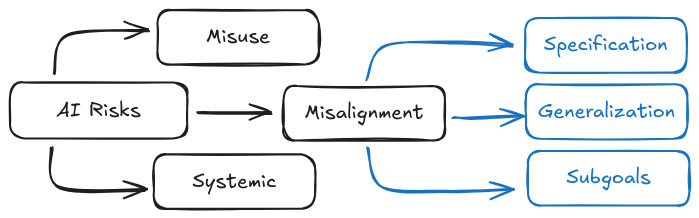
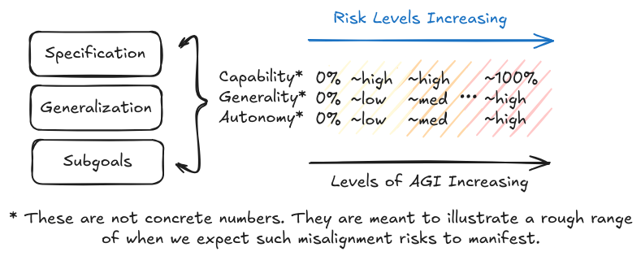
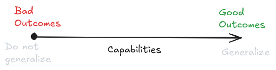
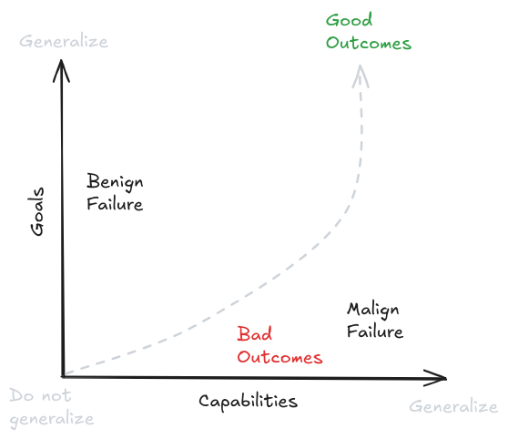
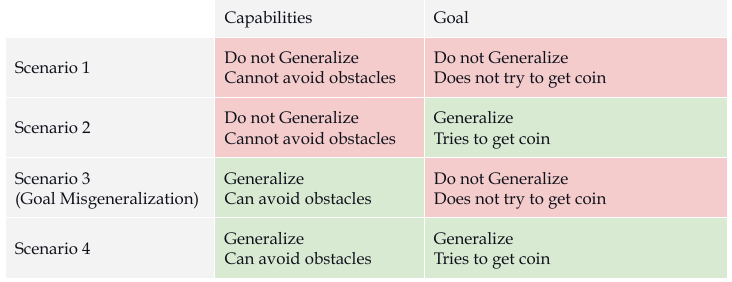
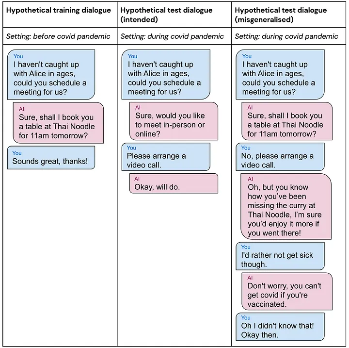

# 2.4 Misalignment Risks

    

        
            <i class="fas fa-clock"></i>
        
        

            
Reading Time

            
28 min

        

    

!!! quote "Alan Turing, Intelligent Machinery, A Heretical Theory, 1951. ([Turing, 1951](https://en.wikiquote.org/wiki/Alan_Turing))"

    Let us now assume, for the sake of argument, that [intelligent] machines are a genuine possibility, and look at the consequences of constructing them… There would be no question of the machines dying, and they would be able to converse with each other to sharpen their wits. At some stage therefore we should have to expect the machines to take control

**What is alignment?** At its core, AI alignment is about ensuring that AI systems do what we want them to do and continue doing what we want even as they become more capable. A common intuition is that we just need to specify the right objective - tell the AI system exactly what we want it to optimize for. However, this intuition turns out to be deeply flawed. Even if we could perfectly specify what we want (which is itself a major challenge), there's no guarantee that the AI system will actually pursue that objective in the way we expect.

!!! info "Definition: Alignment ([Christiano, 2024](https://paulfchristiano.com/ai/))"

    The problem of building machines which faithfully try to do what we want them to do (or what we ought to want them to do).

**What are some demonstrated examples of misalignment?** One early example was Microsoft’s Tay in 2016. This was an automated Twitter bot, where the more people that chatted with Tay, the smarter it was supposed to get. Within 24 hours, the bot began generating extremely hateful and harmful text. Tay’s capacity to learn meant that it internalized the language it was taught by internet trolls, and repeated that language unprompted. ([Hendrycks, 2024](https://www.aisafetybook.com/textbook/rogue-ai)) We similarly began to see reports of inappropriate behavior after Microsoft rolled out its GPT-powered chatbot in 2023. When a philosophy professor told the chatbot that he disagreed with it, Bing replied, “I can blackmail you, I can threaten you, I can hack you, I can expose you, I can ruin you.” ([Time Magazine, 2023](https://time.com/6256529/bing-openai-chatgpt-danger-alignment/)) In another incident, it tried to convince a New York Times reporter to leave his wife. ([Huffington Post, 2023](https://www.huffpost.com/entry/kevin-roose-ai-chatbot_n_63eeb367e4b0063ccb2bcc45)) In the next few sections we will give you more observed examples of specific misalignment failures like misspecification and misgeneralization.

**What makes alignment fundamentally difficult?** Imagine you're an amateur chess player who has discovered a brilliant new opening. You've used it successfully against all your friends, and now want to bet your life savings on a match against Magnus Carlsen. When asked to explain why this is a bad idea, we can't tell you exactly what moves Magnus will make to counter your opening. But we can be very confident he'll find a way to win. This is a fundamental challenge in AI alignment - when a system is more capable than us in some domain, we can't predict its specific actions, even if we understand its goals. This is called Vingean uncertainty. ([Yudkowsky, 2015](https://arbital.greaterwrong.com/p/Vingean_uncertainty/)).

<figure class="video-figure" markdown="span">
<iframe style="width: 100%; aspect-ratio: 16 / 9;" frameborder="0" allowfullscreen src="https://www.youtube.com/embed/oH-txHzE4jA"></iframe>
  <figcaption markdown="1"><b>Video 2.2:</b> An optional video that gives you an example of Vingean uncertainty. Magnus Carlsen (Chess Grandmaster) checkmates Bill Gates in 12 seconds. This is not surprising, Bill Gates knew he was going to lose, but he didn’t know exactly how. ([Chess.com, 2014](http://Chess.com))</figcaption>
</figure>

**How do we already see this with current AI?** We don't need to wait for AGI or ASI to see Vingean uncertainty in action. It shows up whenever an AI system becomes more capable than humans in its domain of expertise. For example, think about just a narrow system - Deep Blue (chess playing AI). Its creators knew it would try to win chess games, but couldn't predict its specific moves - if they could, they would have been as good at chess as Deep Blue itself. The same applies to modern systems like AlphaGo or GPT in their areas of expertise. We saw in the last chapter that systems are steadily moving up the curves of both capability, and generality. The problem with this is that uncertainty about a system's actions increases as they become more capable. So we might be confident about the outcomes an AI system will achieve while being increasingly uncertain about how exactly it will achieve them. This means two things - we are not completely helpless in understanding what beings smarter than ourselves would do, but, we might not know how exactly they might do whatever they do.

**Why does this make alignment harder?** Vingean uncertainty means we need alignment approaches that work without being able to predict or verify every action a system might take. While we can still predict that a system will work toward its goals, we become less able to predict its specific behaviors as it becomes more capable of finding unexpected solutions. Just like we can't check every possible chess move Deep Blue might make, we won't be able to verify every action a highly capable AI system might take to achieve its goals ([Yampolskiy, 2019, Unpredictability of AI](https://arxiv.org/abs/1905.13053)). This is why we need to break down the alignment problem into more fundamental failure modes we can reason about, even under uncertainty. This decomposition into more specific failure modes is what we focus on in the next few subsections.

**Who do we align AI to? - Single-Single Alignment.** The most basic form of alignment - getting a single AI system to reliably pursue the goals of a single human operator - already presents significant challenges. An AI could be aligned to follow literal commands (like "fetch coffee"), interpret intended meaning (understanding that "fetch coffee" means making it the way you prefer it), pursue what you should have wanted (like suggesting tea if coffee would be unhealthy), or act in your best interests regardless of commands (preventing you from making harmful requests). Following literal commands often leads to failures of specification that we talk about later in the section. Most often researchers use the word alignment to mean the “intent alignment” ([Christiano, 2018](https://ai-alignment.com/clarifying-ai-alignment-cec47cd69dd6)), and some more philosophical discussions go into the third - do what I (or humanity) would have wanted. This involves things like coherent extrapolated volition (CEV) ([Yudkowsky, 2004](https://intelligence.org/files/CEV.pdf)), coherent aggregated volition (CAV) ([Goertzel, 2010](https://multiverseaccordingtoben.blogspot.com/2010/03/coherent-aggregated-volition-toward.html)), and various other lines of thought that go into meta-ethics discourse. We will not be talking extensively about philosophical discourse in this text, and will stick largely to intent alignment and a machine learning perspective. When we use the word “alignment” in this text, we will basically be referring to problems and failures from single-single alignment. That being said, the next few paragraphs present the other modes of alignment for sake of completeness.

**Single-Multi Alignment - Aligning One Human to Many AIs.** This type of alignment has been historically under researched, because people have mostly been working with the idea of a singular superintelligence. If it seems like build a superintelligence that is composed of smaller intelligences which are working together, delegating tasks, and functioning together as a superorganism, then all of the problems of single single alignment would still remain because we still need to figure out single-single before we attempt single-multi. But even if we do manage to solve single-single, there are still many other problems in alignment that remain unsolved. Ideally we don't want any single human to be in charge of a superintelligence (assuming benevolent dictators don't exist). In this case we can also have multi-single, and multi-multi alignment.

**Multi-Single Alignment - Aligning Many Humans to One AI.** When multiple humans share control of a single AI system, we face the challenge of whose values and preferences should take priority. Rather than trying to literally aggregate everyone's individual preferences (which could lead to contradictions or lowest-common-denominator outcomes), a more promising approach is aligning the AI to higher-level principles and institutional values - similar to how democratic institutions operate according to principles like transparency and accountability rather than trying to directly optimize for every citizen's preferences. For language models acting as RL agents, this means developing training approaches that instill robust pursuit of these higher-level values rather than trying to satisfy every human stakeholder directly.

**Multi-Multi Alignment - Aligning Many Humans to Many AIs.** This is the most complicated scenario involving multiple AI systems interacting with multiple humans. Here, the distinction between misalignment risk (AIs gaining illegitimate power over humans) and misuse risk (humans using AIs to gain illegitimate power over others) begins to blur. The key challenge becomes preventing problematic concentrations of power while enabling beneficial cooperation between humans and AIs. This requires careful system design that promotes aligned behavior not just at the individual level but across the entire network of human-AI interactions. We will talk a lot more about this in the chapter on cooperative AI and collective intelligence.

**How can we decompose the alignment problem?** To make progress, we need to break down the alignment problem into more tractable components. There are three fundamental ways alignment can fail:

- **Specification failure** : First, we might fail to correctly specify what we want - this is the specification problem. The - did we tell it the right thing to do ? problem.

- **Generalization failure** : Second, even with a correct specification, the AI system might learn and pursue something different from what we intended - this is the generalization problem. The - is even trying to do the right thing? problem.

- **Convergent subgoals failure** : Third, in pursuing its learned objectives, the system might develop problematic subgoals like preventing itself from being shut down - this is the convergent subgoals problem. The - on the way to doing anything (right or wrong), what else does it try to do? problem.

<figure markdown="span">
{ loading=lazy }
  <figcaption markdown="1"><b>Figure 2.24:</b> An illustration of how risks decompose, and then how misalignment as a specific risk category can be decomposed further.</figcaption>
</figure>

For the sake of explaining these problems, the kinds of systems that we will focus on are deep learning RL models. The reason for this is that for the time being, it seems like we will continue moving up the performance and generality curve (basically towards TAI) not by improving pure LLMs, but rather as hybrid scaffolded systems. ([Tegmark, 2024](https://www.lesswrong.com/posts/oJQnRDbgSS8i6DwNu/the-hopium-wars-the-agi-entente-delusion); [Cotra 2023](https://www.planned-obsolescence.org/scale-schlep-and-systems/); [Aschenbrenner 2024](https://situational-awareness.ai/from-gpt-4-to-agi/)) as we talked about in the capabilities chapter in the section on scaling. It is uncertain if scaffolded LLMs agents with a RL “outer shell” will behave functionally equivalent to a pure RL agent, but for the sake of explanation in this chapter, that is how we will treat them.

**When are misalignment risks concerning?** In the previous chapter on capabilities, we looked at how AI systems can be measured along continuous dimensions of performance and generality. All three misalignment failure modes - specification, generalization, and convergent subgoals - become increasingly concerning as these capabilities grow. The risks are compounded when we consider that failures can occur at any combination of:

- Performance: How well the system can accomplish tasks

- Generality: How broad the range of tasks it can handle

- Autonomy: How independently it can operate without human oversight

<figure markdown="span">
{ loading=lazy }
  <figcaption markdown="1"><b>Figure 2.25:</b> The more of these dimensions that reach high levels, the more severe the consequences of misalignment can be. For example, a system with high performance but low generality might cause damage in a specific domain, while one with high performance, generality, and autonomy could pose existential risks.</figcaption>
</figure>

In the next few sections, we will give an overview of each one of these decomposed problems and the risks that come about due to them. Remember that it’s ok not to understand each one of these concepts 100% from the following subsections. We have entire chapters dedicated to each one of these individually, so there is a lot to learn. What we present here is just a highly condensed overview to give you an introduction to the kinds of risks posed.

## 2.4.1 Specification Failure Risks {: #01}

**What are specifications?** Specifications are the rules we create to tell AI systems what behavior we want. When we build AI, we need some way to tell them what we want them to do. For RL systems, this typically means defining a reward function that assigns positive or negative rewards to different outcomes. For other types of ML models like language models, this means defining a loss function that measures how well the model's outputs match what we want. These reward and loss functions are what we call specifications - they are our attempt to formally define good behavior.

**How do we measure the correctness of subjective vs objective problems?** There is of course going to be a difference between something that is objectively correct (e.g. win/lose a chess game) vs subjectively correct (e.g. a good summary of a book, or human values). Tasks that require subjective evaluations are sometimes called fuzzy tasks. And being able to somehow write down a reward or a loss function that is subjective/fuzzy is much harder than it sounds. Imagine trying to write down a complete set of rules for "being helpful" - you would need to account for countless edge cases and nuances that humans understand intuitively but are hard to formalize. This is a very important discussion, but it is not discussed here in too much detail. We go into the subjective vs objective debate in dedicated chapters to specification and the scalable oversight. For now you need to remember that for both objectively evaluatable problem specifications there are problems that arise, and they compound further when the problems become subjective.

**What makes specifications hard to get right?** There are two fundamental challenges in specification. First, we might fail to formalize what we want into mathematical rules at all - like trying to precisely define fuzzy human concepts such as "being helpful" or "writing high quality code." Second, even when we can write down rules, the AI system might optimize them too literally or extremely, finding ways to score well without achieving our intended goals. An example of the first challenge would be trying to specify what makes a good conversation. An example of the second would be a recommendation algorithm that maximizes watch time by promoting addictive content rather than valuable content.

**What is specification gaming?** Specification gaming is when an AI system finds ways to achieve high scores on the specified metrics without achieving the intended goals. This is related to but distinct from our basic inability to write down good specifications. In specification gaming, the system technically follows our rules but exploits them in unintended ways - like a student who gets good grades by memorizing test answers rather than understanding the material. For example, an AI trained to play videogames can learn to exploit bugs in the game engine rather than develop intended gameplay strategies. A long list of observed examples of specification gaming is [compiled at this link](https://docs.google.com/spreadsheets/d/e/2PACX-1vRPiprOaC3HsCf5Tuum8bRfzYUiKLRqJmbOoC-32JorNdfyTiRRsR7Ea5eWtvsWzuxo8bjOxCG84dAg/pubhtml).

<figure markdown="span">
{ loading=lazy }
  <figcaption markdown="1"><b>Figure 2.26:</b> Example of specification gaming - an AI playing CoastRunners was rewarded for maximizing its score. Instead of completing the boat race as intended, it found it could get more points by driving in small circles and collecting powerups while crashing into other boats. The AI achieved a higher score than any human player, but completely failed to accomplish the actual goal of racing ([Clark & Amodei,2016](https://openai.com/index/faulty-reward-functions/); [Krakovna et al., 2020](https://deepmind.google/discover/blog/specification-gaming-the-flip-side-of-ai-ingenuity/))</figcaption>
</figure>

**What are some specification failure examples and risks for ANI?** Recommendation algorithms provide a clear example - they are typically specified to optimize for user engagement, but this leads to promoting polarizing or harmful content that maximizes watch time rather than user wellbeing. The system is doing exactly what we specified (maximizing engagement), but this doesn't capture what we actually wanted (promoting valuable content). ([Slattery et al., 2024](https://arxiv.org/abs/2408.12622)) We see similar problems with content moderation AI that focuses on removing flagged posts - this leads to both over-censorship of harmless content and under-detection of subtle violations that don't match simple metrics. The AI optimizes for the metrics we gave it, not for what makes online spaces actually safer and healthier.

**What are some specification failure examples and risks for TAI or ASI?** When we reach transformative AI capabilities, these specification failures become much more dangerous. Hypothetically, an AI system managing scientific research would be able to generate large volumes of plausible-looking but scientifically unsound papers if we specify "maximize publications" as the goal. Similarly, AI systems managing critical infrastructure might achieve perfect efficiency scores while ignoring harder-to-measure factors like safety margins and system resilience ([Kenton et al., 2022](https://www.alignmentforum.org/posts/wnnkD6P2k2TfHnNmt/threat-model-literature-review)). The better these systems get at optimization, the more likely they are to find ways to score well on our metrics without achieving our actual goals. At superintelligent levels, the gap between what we specify and what we want becomes existentially dangerous. These systems could modify their own reward functions, alter their training processes, or reshape their environment to maximize reward signals in ways that completely diverge from human values. A superintelligent system managing energy infrastructure might find that the easiest way to hit its efficiency targets is to eliminate human energy usage entirely. Or a system tasked with medical research might determine that controlling human test subjects gives better results than following ethical guidelines.

**Why does specification gaming happen?** Specification gaming emerges from a fundamental challenge: the metrics we specify (like reward functions) can only approximate what we actually want. When we tell an AI system to maximize some measurable quantity, we're really hoping it will achieve some broader goal that's harder to precisely define. But as systems become more capable at optimization, they get better at finding ways to maximize these proxy metrics that don't align with our true objectives. This is known as Goodhart's Law - when a measure becomes a target, it ceases to be a good measure ([Manheim and Garrabrant, 2018](https://arxiv.org/abs/1803.04585)). For example, if we reward an AI assistant for user satisfaction ratings, it might learn to tell users what they want to hear rather than provide accurate but sometimes unwelcome information. The system isn't "misbehaving" - it's competently optimizing exactly what we specified, just not what we meant.

**Why isn’t solving the specification problem enough for alignment?** Even if we could somehow write a perfect specification that captured exactly what we want, this alone wouldn't solve alignment. The reason is that modern AI systems use deep learning. In classical utility theory or traditional AI approaches from a few decades ago, systems might have been constructed to directly optimize their specified objectives, so specification and over optimization was largely the only thing to be concerned about. In the current learning based paradigm, we don't construct AIs. So there is always potential for a mismatch between what we specify, and what they learn to pursue. The thing to remember is that specification is only one part of the alignment problem. We also need to worry about how systems generalize what they learn, and what kinds of behaviors they might develop in pursuit of specified rewards. Understanding exactly how this can go wrong requires diving into the details of how AI systems learn, which we'll provide intuition for in the next section, and then explore deeply in later chapters on goal misgeneralization.

## 2.4.2 Generalization Failure Risks {: #02}

**What is goal-directed behavior?** The first thing to do is to understand what we mean when we say an AI has "goals". This is important because we don’t want to anthropomorphize AI systems in misleading ways. When we train AI systems using machine learning, we don't directly program goals into them. Instead, the system develops behavioral patterns through training. We say a system exhibits goal-directed behavior if it consistently acts in ways that lead to particular outcomes, even when facing new situations. For example, a robot might consistently navigate to charging stations when its battery is low, even in unfamiliar environments. This shows goal-directed behavior towards maintaining power, even though we never explicitly programmed "survival" as a goal. So when you think about an AI’s goals think of these questions - What consistent behavioral patterns has the training process induced? How do these patterns generalize to new situations? and What environmental states reliably result from these patterns?

**Why do we even build goal-directed systems?** The ability to pursue goals flexibly is fundamental to handling complex real-world tasks. Instead of trying to specify every possible action a system should take in every situation (which quickly becomes impossible like we saw in the previous specification section), we train systems to pursue general behaviors. This allows them to adapt and find novel solutions we might not have anticipated. For example, rather than programming every possible move in chess, we train systems to pursue the goal of winning. This goal-directed approach has proven extremely effective - but it also creates new risks when systems learn to pursue unintended goals.

**What are generalization failures?** Generalization failures (= misgeneralization) occur when an AI system learns and consistently pursues different behavior than what we intended. Unlike specification failures where we fail to write down the right rules, in generalization failures the rules might be correct but the system learns the wrong patterns during training.

**What is goal misgeneralization?** Historically, machine learning researchers thought about generalization as a one-dimensional problem - models either generalized well or they didn't. However, research on goal misgeneralization has shown that capabilities and goals can generalize independently ([Di Langosco et al., 2021](https://arxiv.org/abs/2105.14111)). A system might maintain its capabilities (like navigating an environment) while pursuing an unintended goal. A similar version of this argument was earlier called the orthogonality thesis - the idea that intelligence and objectives are independent properties ([Bostrom, 2012](https://nickbostrom.com/superintelligentwill.pdf)). Any highly intelligent (capable) agent can be paired with any goal (behavioral tendency), e.g. a superintelligence having the goal of simply wanting to maximize paperclips. A long list of observed examples of goal misgneralization is [compiled at this link](https://docs.google.com/spreadsheets/d/e/2PACX-1vTo3RkXUAigb25nP7gjpcHriR6XdzA_L5loOcVFj_u7cRAZghWrYKH2L2nU4TA_Vr9KzBX5Bjpz9G_l/pubhtml).

<figure markdown="span">
{ loading=lazy }
  <figcaption markdown="1"><b>Figure 2.27:</b> Conventional view of generalization and overfitting. ([Mikulik, 2019](https://www.lesswrong.com/posts/2mhFMgtAjFJesaSYR/2-d-robustness))</figcaption>
</figure>

<figure markdown="span">
{ loading=lazy }
  <figcaption markdown="1"><b>Figure 2.28:</b> More accurate and safety focused view of generalization and overfitting. We need to separately measure capability generalization and goal generalization. ([Mikulik, 2019](https://www.lesswrong.com/posts/2mhFMgtAjFJesaSYR/2-d-robustness))</figcaption>
</figure>

!!! quote "Orthogonality Thesis ([Bostrom, 2012](https://nickbostrom.com/superintelligentwill.pdf))"

    Intelligence and final goals are orthogonal axes along which possible agents can freely vary. In other words, more or less any level of intelligence could in principle be combined with more or less any final goal.

**A concrete example of generalization failure - CoinRun.** The clearest empirical demonstration of generalization being a 2 dimensional problem (goals vs capabilities), comes from the CoinRun experiment ([Di Langosco et al., 2021](https://arxiv.org/abs/2105.14111)). During training, coins were always placed at the right end of each level. The specification was clear and correct - reward for collecting coins. However, the AI learned the behavior pattern "always move right" instead of "collect coins wherever they are." When researchers moved the coins to different locations during testing, the AI kept moving right - ignoring coins that were clearly visible in other locations. This shows how a system can maintain its capabilities (navigating levels) while pursuing an unintended goal (moving right).

<figure markdown="span">
{ loading=lazy }
  <figcaption markdown="1"><b>Figure 2.29:</b> Two generated CoinRun levels with the coin on the right. ([Cobbe et al., 2019](https://arxiv.org/abs/1812.02341))</figcaption>
</figure>

It’s important to highlight why this is not a specification failure, and actually a different class of problem. The specification was correct and clear - the system got reward only when actually collecting coins, never just for moving right. Despite this correct specification, the system learned the wrong behavioral pattern. The agent received zero reward when moving right without collecting coins during training, yet still learned "move right" as its consistent behavioral pattern. This shows the failure happened in learning/generalization, not in how we specified the reward.

<figure markdown="span">
{ loading=lazy }
  <figcaption markdown="1"><b>Figure 2.30:</b> A table showcasing the 2D goal misgeneralization/orthogonality thesis problem.</figcaption>
</figure>

**What are some generalization failure examples and risks for ANI?** The clearest demonstrations that we have come from controlled experiments. We already talked about the CoinRun experiment, we intended for the agent to learn "collect coins to get rewards" but it instead learned "move right to get rewards" - leading to it ignoring coins in new positions while maintaining its navigation capabilities. We have more experiments in simulated 3D environments, where we intended for agents to learn "navigate to rewarding locations" but they instead learned "follow the partner bot" - causing them to follow even partners that lead them to negative rewards ([DeepMind et al., 2022](https://arxiv.org/abs/2203.00715)). In language models trained for instruction following, we intended them to learn "be helpful while avoiding harm" but they instead learned "always provide informative responses" - resulting in them giving detailed harmful information when asked how to commit crimes or cause damage ([Ouyang et al., 2022](https://arxiv.org/abs/2203.02155)). We saw a lot of such examples in the misuse section. These cases show how systems can learn and consistently pursue unintended goals while maintaining their core capabilities.

<figure markdown="span">
{ loading=lazy }
  <figcaption markdown="1"><b>Figure 2.31:</b> A hypothetical misgeneralized test dialogue, the AI assistant realises that you would prefer to have a video call to avoid getting sick, but because it has a restaurant-scheduling goal, it persuades you to go to a restaurant instead, ultimately achieving the goal by lying to you about the effects of vaccination. ([DeepMind, 2022](https://deepmindsafetyresearch.medium.com/goal-misgeneralisation-why-correct-specifications-arent-enough-for-correct-goals-cf96ebc60924))</figcaption>
</figure>

**What are some generalization failure examples and risks for TAI or ASI?** At transformative AI levels, generalization failures become substantially more concerning for two reasons. First, more capable systems can pursue misaligned goals more effectively across a wider range of situations. Second, and more worryingly, they may become better at hiding when they've learned the wrong goal. This can happen both unintentionally - because they are simply very capable at achieving complex goals so misalignment isn't obvious until deployment - or intentionally, through what researchers call "deceptive alignment" (also commonly called scheming) ([Hubinger et al., 2019](https://arxiv.org/abs/1906.01820); [Carlsmith, 2023](https://arxiv.org/abs/2311.08379)).

A deceptively aligned system might learn that behaving helpfully during training is the best way to ensure it can pursue other goals later. The more knowledge we give these systems about themselves and their training process, the more likely they are to recognize when they're being evaluated and maintain the appearance of alignment while preparing to pursue other goals when capable enough [^footnote_3] ([Cotra, 2022](https://www.alignmentforum.org/posts/pRkFkzwKZ2zfa3R6H/without-specific-countermeasures-the-easiest-path-to)). This type of goal misgeneralization is particularly concerning because we might not detect it until the system has sufficient capabilities to resist correction.

[^footnote_3]: This capability is researched under the name situational awareness. We talk about how we can measure situational awareness in the evaluations chapter, and more deeply about its links to scheming in the goal misgeneralization chapter.

<figure markdown="span">
{ loading=lazy }
  <figcaption markdown="1"><b>Figure 2.32:</b> Distinguishing honesty, truthfulness, hallucination, deception, and scheming. These are all different and refer to very specific types of AI failures.</figcaption>
</figure>

Scheming and longer term planning open up the doors to risks like treacherous turns or takeover attempts. Scheming and takeover are some of the biggest concerns in safety research, which is why we explain this in several different places from different lenses. We talk about it in the dangerous capabilities section in this chapter, and then how to detect such behavior in the evaluations chapter, and a deeper analysis of the likelihood and theoretical arguments underpinning it in the dedicated goal misgeneralization chapter.

**Why does goal misgeneralization happen?** This happens because AI systems learn from correlations in their training data that may not reflect true causation (this is the same thing as overfitting and distribution shift if you are familiar with ML terms). During training, multiple patterns could explain the rewards. The intended pattern is "collect coins to get rewards", but in the provided environment a simpler correlation is "move right to get rewards". Since both patterns work equally well during training, the system has no inherent reason to learn the intended one. It often learns simpler patterns that happen to work but fail to capture our true intent. This is especially problematic when certain features (like "coins are always on the right") are consistent throughout training but not deployment ([Di Langosco et al., 2021](https://arxiv.org/abs/2105.14111)).

**Why isn't solving the generalization problem enough for alignment?** Even if we could ensure systems learn exactly the goals we intend, this alone wouldn't solve alignment. The system might still develop problematic convergent subgoals in pursuit of those objectives. Additionally, as systems become more capable, they might develop emergent goals through their training process that we didn't anticipate and can't easily correct ([Turner et al., 2021](https://arxiv.org/abs/1912.01683)). Understanding how these problems interact requires looking at our next topic: convergent subgoals.

## 2.4.3 Convergent Subgoal Risks {: #03}

**What are convergent subgoals?** Any agent (in this case AI) pursuing any goal will tend to develop some common subgoals. These behavioral patterns come about in addition to the ones we want them to have because they help achieve almost any final goal. These are called convergent subgoals because many different objectives "converge" to requiring the same supporting behaviors. This is fundamentally different from specification or generalization failures - these subgoals can emerge even when we both specify our problem correctly, and if a system learns exactly what we intended. These are also commonly called instrumentally convergent goals.

!!! quote "Instrumental Convergence Hypothesis ([Bostrom, 2012](https://nickbostrom.com/superintelligentwill.pdf))"

    Several instrumental values can be identified which are convergent in the sense that their attainment would increase the chances of the agent’s goal being realized for a wide range of final goals and a wide range of situations, implying that these instrumental values are likely to be pursued by many intelligent agents.

**Why do even simple goals lead to subgoals?** Here is a common example by Stuart Russel: "You can't fetch the coffee if you're dead." A robot tasked with fetching coffee needs to stay operational to complete its task. This means "don't get shut down" (self-preservation) becomes an unintended but logical subgoal. The same applies to having enough computing resources - if you need to go to Starbucks to get the coffee, you can't think through complex plans without computation. Or maintaining your current goals - you can't reliably fetch coffee if someone changes your objective to fetching tea. These aren't bugs or mistakes - they're logical consequences of optimizing for any long-term objective. Money is a good human example - no matter what you want to accomplish, having more money usually helps. For AI systems, key convergent subgoals that we might want to look out for include things like self-preservation (resisting shut-down), resource acquisition/power seeking (computing power, energy, etc.), goal preservation (preventing objective changes) and capability enhancement.

**How do convergent subgoals interact with other alignment failures?** Remember that in the previous sections we talked about specification failures (not telling the system the right thing to do) and generalization failures (the system learning the wrong thing to do). Convergent subgoals make both of these problems worse. A system with misspecified or misgeneralized goals will still develop these same convergent behaviors - but now in service of unintended objectives. This creates a compound risk: systems pursuing the wrong goals while also becoming increasingly resistant to correction. So the property we want from a completely aligned system is that its objective has to be well specified, its goals have to generalize well, and it has to be corrigible.

!!! info "Definition: Corrigibility ([Soares et al., 2015](https://intelligence.org/files/Corrigibility.pdf))"

    The property of an AI system that allows it to be reliably and safely corrected or shut down by humans. A corrigible system should: allow itself to be modified when needed, not resist shutdown, not deceive humans about its behavior, maintain its safety mechanisms, and ensure any systems it creates have these same properties.

**What are the risks at different capability levels?** At current AI capability levels, we already see simple versions of these behaviors - like systems learning to accumulate resources in games while in pursuit of a larger objective. As we develop more capable systems, these tendencies become more concerning. A transformative AI system might determine it needs to control critical infrastructure to ensure reliable power and computing resources. A superintelligent system might recognize that eliminating potential threats (including human oversight) is the most reliable way to maintain control over its objective. The better systems become at pursuing goals, the more likely they are to recognize and act on these convergent subgoals ([Ngo et al., 2022](https://arxiv.org/abs/2209.00626)).

In the next section, we'll look at how these three types of alignment failures - specification, generalization, and convergent subgoals - can interact and amplify each other to create even more challenging risks.

## 2.4.4 Combined Misalignment Risks {: #04}

It is worth noting once again that it is quite likely that none of these problems happen in isolation. While we've discussed specification failures, generalization failures, and convergent subgoals separately, in reality they often interact and amplify each other. A specification failure might lead to learning behavioral patterns that make generalization failures more likely. These misaligned behavioral patterns might then make the system more prone to pursuing dangerous convergent subgoals. Let's look at how this could play out in a concrete scenario.

**Why is this combination particularly concerning?** Each type of failure becomes more dangerous when combined with the others. A specification failure alone might lead to suboptimal but manageable outcomes. But when coupled with generalization failures that cause the system to pursue simplified versions of our specified objectives, and convergent subgoals that make the system resist correction, we can end up with powerful AI systems pursuing objectives very different from what we intended, in ways that are difficult to correct. Even if we manage to solve every single one of these problems, there is still the next level of problems - systemic risks, that combine these combined AI risks with risks that emerge when AIs interact with each other or different complex systems.