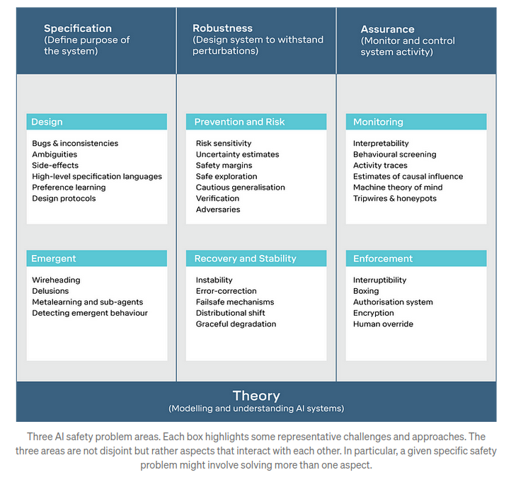

# 2.9 Appendix: Miscellaneous {: #09 }
!!! note "Reading Time: 4 minutes" 

## 2.9.1 AI risks are non-enumerable {: #01 }

The realm of AI risks is boundless, with an ever-evolving array of emerging threats. When it seems all potential risks have been identified, new ones surface, making it an ongoing challenge to categorize them comprehensively or develop a complete framework to address them all.

Different frameworks focus on distinct classes of problems, each addressing specific facets of AI safety and ethics. For instance, “Concrete Problems in AI Safety” outlines some specific safety concerns in AI development. But Tasra is another fundamentally different framework. An overview of AI Catastrophic Risks, is again very different. And there are miscellaneous papers that are still enumerating classes of risks that were unknown before, like this [one](https://owasp.org/www-project-top-10-for-large-language-model-applications/assets/PDF/OWASP-Top-10-for-LLMs-2023-v1_1.pdf).

A complete exhaustive systematization is difficult.

An exercise you can try to convince yourself of this point is to search for loopholes in this document and read [the list of lethalities](https://www.lesswrong.com/posts/uMQ3cqWDPHhjtiesc/agi-ruin-a-list-of-lethalities#E2getLSb35tmAZC5t) from Yudkovsky ([source](https://www.lesswrong.com/posts/uMQ3cqWDPHhjtiesc/agi-ruin-a-list-of-lethalities#E2getLSb35tmAZC5t)). How many points overlap? Not much. That’s expected.

***Figure****: Here is another framework that is very different from what we presented.*

***Figure****: Here is another framework focusing on LLM vulnerabilities. (**[source](https://owasp.org/www-project-top-10-for-large-language-model-applications/assets/PDF/OWASP-Top-10-for-LLMs-2023-v1_1.pdf)**)*

## 2.9.2 Measuring alignment is hard {: #02 }

***Figure****: **(**[source](https://www.cold-takes.com/ai-safety-seems-hard-to-measure/)**)*

The article "AI Safety Seems Hard to Measure" by Holden Karnofsky discusses the complexities and challenges of ensuring the safety of AI. The text outlines four major difficulties, which may be another way of presenting the alignment problem:

- **The Lance Armstrong Problem: **This problem questions whether AI systems are genuinely safe or just proficient at concealing their hazardous behaviors. It draws a parallel with Lance Armstrong, who successfully hid his doping for years. The challenge is distinguishing between AI that is inherently safe and AI that is merely adept at appearing safe.

- **The King Lear Problem:** This issue deals with the unpredictability of AI behavior when they transition from being under human control to being autonomous. The reference to King Lear is about the difficulty of foreseeing how entities will act once they have autonomy, reflecting the challenge of predicting AI actions when they are no longer restricted by human oversight.

- **The Lab Mice Problem:** Current AI systems are not advanced enough to replicate the complex behaviors we aim to study, making it challenging to research and mitigate potential future risks effectively. This situation is likened to attempting to understand human medical issues through studies solely on lab mice.

- **The "First Contact" Problem:** This considers the scenario where AI capabilities far surpass human intelligence, posing unforeseen challenges in ensuring their safety. The analogy here is preparing for an unpredictable, unprecedented event like extraterrestrial first contact.

## 2.9.3 Why do Labs engage in AGI development despite the risks? {: #03 }

This question is asked frequently. Here is a concise response.

- **Potential benefits:** Laboratories pursue AGI development despite the inherent risks due to the significant potential benefits. Successful AGI implementation could lead to unprecedented advancements in problem-solving capabilities, efficiency improvements, and innovation across various fields.

- **Competitive dynamics:** The commitment to AI development, even with recognized risks, is driven by competitive pressures within the field. There is a widespread belief that it is preferable for those who are thoughtful and cautious about these developments to lead the charge. Given the intense competition, there is a fear among entities that halting AGI research could result in being surpassed by others, potentially those with less regard for safety. See the box below: How do AI Companies proliferate?

- **Prestige and recognition:** Prestige is another significant motivator. Many AGI researchers aim for high citation counts, respect within the academic and technological communities, and financial success. Unfortunately, burning the timelines is high status.

- **Moreover, most AGI researchers believe in the feasibility of AGI safety.** There is a belief among some researchers that a large-scale, concerted effort—comparable to the Manhattan Project and similar to the “super alignment plan” by OpenAI—could lead to the development of a controllable AI capable of implementing comprehensive safety measures.