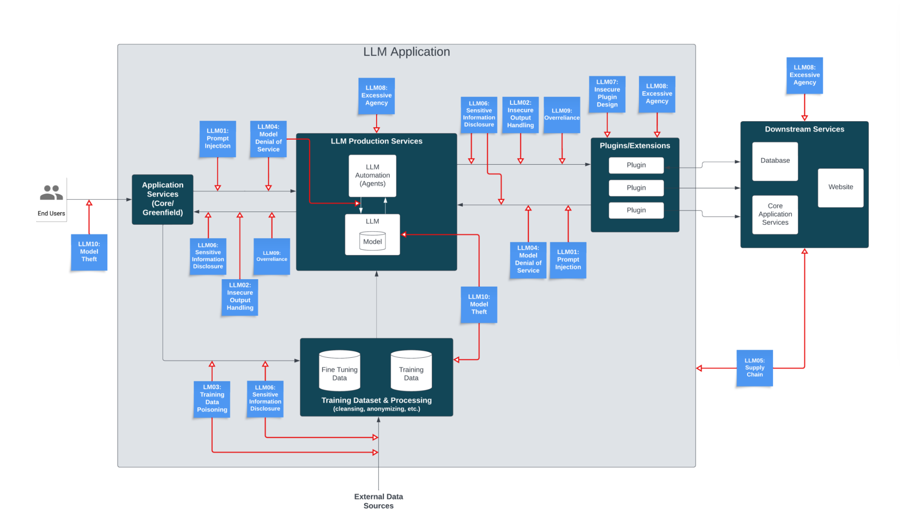

# 2.9 Appendix: Miscellaneous {: #09 }

    

        <i class="fas fa-clock"></i>
        6 min read
    

    

        <i class="fas fa-file-alt"></i> 
        1129 words
    

## 2.9.1 AI risks are non-enumerable {: #01 }

The realm of AI risks is boundless, with an ever-evolving array of emerging threats. When it seems all potential risks have been identified, new ones surface, making it an ongoing challenge to categorize them comprehensively or develop a complete framework to address them all.

Different frameworks focus on distinct classes of problems, each addressing specific facets of AI safety and ethics. For instance, “Concrete Problems in AI Safety” outlines some specific safety concerns in AI development. But TASRA is another fundamentally different framework. An overview of AI Catastrophic Risks, is again very different. And there are miscellaneous papers that are still enumerating classes of risks that were unknown before. ([Wilson, 2023](https://owasp.org/www-project-top-10-for-large-language-model-applications/assets/PDF/OWASP-Top-10-for-LLMs-2023-v1_1.pdf))

A complete exhaustive systematization is difficult.

<figure markdown="span">
{ loading=lazy }
  <figcaption markdown="1"><b>Figure 2.37:</b> Here is another framework that is very different from what we presented. ([Wilson, 2023](https://owasp.org/www-project-top-10-for-large-language-model-applications/assets/PDF/OWASP-Top-10-for-LLMs-2023-v1_1.pdf))</figcaption>
</figure>

<figure markdown="span">
{ loading=lazy }
  <figcaption markdown="1"><b>Figure 2.38:</b> Here is another framework focusing on LLM vulnerabilities. ([Wilson, 2023](https://owasp.org/www-project-top-10-for-large-language-model-applications/assets/PDF/OWASP-Top-10-for-LLMs-2023-v1_1.pdf))</figcaption>
</figure>

## 2.9.2 Measuring alignment is hard {: #02 }

The article "AI Safety Seems Hard to Measure" by Holden Karnofsky discusses the complexities and challenges of ensuring the safety of AI. The text outlines four major difficulties, which may be another way of presenting the alignment problem:

- **The Lance Armstrong Problem: **This problem questions whether AI systems are genuinely safe or just proficient at concealing their hazardous behaviors. It draws a parallel with Lance Armstrong, who successfully hid his doping for years. The challenge is distinguishing between AI that is inherently safe and AI that is merely adept at appearing safe.

- **The King Lear Problem:** This issue deals with the unpredictability of AI behavior when they transition from being under human control to being autonomous. The reference to King Lear is about the difficulty of foreseeing how entities will act once they have autonomy, reflecting the challenge of predicting AI actions when they are no longer restricted by human oversight.

- **The Lab Mice Problem:** Current AI systems are not advanced enough to replicate the complex behaviors we aim to study, making it challenging to research and mitigate potential future risks effectively. This situation is likened to attempting to understand human medical issues through studies solely on lab mice.

- **The "First Contact" Problem:** This considers the scenario where AI capabilities far surpass human intelligence, posing unforeseen challenges in ensuring their safety. The analogy here is preparing for an unpredictable, unprecedented event like extraterrestrial first contact.

## 2.9.3 Why do Labs engage in AGI development despite the risks? {: #03 }

This question is asked frequently. Here is a concise response.

- **Potential benefits:** Laboratories pursue AGI development despite the inherent risks due to the significant potential benefits. Successful AGI implementation could lead to unprecedented advancements in problem-solving capabilities, efficiency improvements, and innovation across various fields.

- **Competitive dynamics:** The commitment to AI development, even with recognized risks, is driven by competitive pressures within the field. There is a widespread belief that it is preferable for those who are thoughtful and cautious about these developments to lead the charge. Given the intense competition, there is a fear among entities that halting AGI research could result in being surpassed by others, potentially those with less regard for safety. See the box below: How do AI Companies proliferate?

- **Prestige and recognition:** Prestige is another significant motivator. Many AGI researchers aim for high citation counts, respect within the academic and technological communities, and financial success. Unfortunately, burning the timelines is high status.

- **Moreover, most AGI researchers believe in the feasibility of AGI safety.** There is a belief among some researchers that a large-scale, concerted effort—comparable to the Manhattan Project and similar to the “super alignment plan” by OpenAI—could lead to the development of a controllable AI capable of implementing comprehensive safety measures.

<!--

References Adversarial AI

Added:

Explaining and Harnessing Adversarial Examples ([Goodfellow et al., 2014](https://arxiv.org/abs/1412.6572))

Certified Defenses for Data Poisoning Attacks ([Steinhardt et al., 2017](https://arxiv.org/abs/1706.03691))

Dolphin Attack: Inaudible Voice Commands ([Zhang et al., 2017](https://arxiv.org/abs/1708.09537))

Just How Toxic is Data Poisoning? ([Schwarzschild et al., 2021](https://arxiv.org/abs/2006.12557))

Extracting Training Data from Large Language Models ([Carlini et al., 2021](https://arxiv.org/abs/2012.07805))

Membership Inference Attacks against Machine Learning Models ([Shokri et al., 2017](https://arxiv.org/abs/1610.05820))

Robust Physical-World Attacks on Deep Learning Models ([Kevin Eykholt et al., 2018](https://arxiv.org/abs/1707.08945))

Advancing Security in AI Systems: A Novel Approach to Detecting Backdoors ([Hossain et al., 2024](https://arxiv.org/abs/2403.08208))

Oblivious Defense in ML Models: Backdoor Removal without Detection ([Shafi Goldwasser et al., 2024](https://arxiv.org/abs/2411.03279))

AutoDAN: Generating Stealthy Jailbreak Prompts on Aligned Large Language Models ([Liu et al., 2023](https://arxiv.org/abs/2310.04451))

Aligning LLMs to Be Robust Against Prompt Injection ([Chen et al., 2024](https://arxiv.org/abs/2410.05451)[)](https://arxiv.org/abs/2410.05451)

Privacy Backdoors: Stealing Data with Corrupted Pretrained Models ([Feng & Tramèr, 2024](https://arxiv.org/abs/2404.00473))

Targeted Backdoor Attacks on Deep Learning Systems ([Chen et al., 2017](https://arxiv.org/abs/1712.05526))

Hidden Trigger Backdoor Attacks ([Saha et al., 2019](https://arxiv.org/abs/1910.00033))

How well can Text-to-Image Generative Models understand Ethical Natural Language Interventions? ([Bansal et al, 2022](https://arxiv.org/abs/2210.15230))

Formalizing and Benchmarking Prompt Injection Attacks and Defenses ([Liu et al., 2024](https://arxiv.org/abs/2310.12815))

Adversarial Training: A Survey ([Zhao et al., 2024](https://arxiv.org/abs/2410.15042))

Re-thinking Model Inversion Attacks Against Deep Neural Networks ([Nguyen, et al., 2023](https://arxiv.org/abs/2304.01669))

Rethinking Privacy in the AI Era ([King & Meinhardt, 2024](https://hai.stanford.edu/sites/default/files/2024-02/White-Paper-Rethinking-Privacy-AI-Era.pdf))

Planting Undetectable Backdoors in Machine Learning Models ([Goldwasser, et al., 2024](https://arxiv.org/abs/2204.06974))

Survey of Vulnerabilities in Large Language Models Revealed by Adversarial Attacks

([Shayegani et al., 2023](https://arxiv.org/abs/2310.10844))

Autoregressive Perturbations for Data Poisoning ([Sandoval-Segura et al., 2022](https://arxiv.org/abs/2206.03693))

Amplifying Membership Exposure via Data Poisoning ([Chen et al., 2022](https://arxiv.org/abs/2211.00463))

The Effect of Data Poisoning on Counterfactual Explanations ([Artelt et al., 2024](https://arxiv.org/abs/2402.08290))

To add?

An Early Categorization of Prompt Injection Attacks on Large Language Models ([Rossi et al., 2024](https://arxiv.org/abs/2402.00898))

Data Poisoning Attacks to Local Differential Privacy Protocols for Graphs ([He et al., 2024](https://arxiv.org/abs/2412.19837))

Artificial Intelligence and Privacy: Causes for Concern ([Jurewicz et al., 2024](https://tidsskrift.dk/privacy_studies_journal/article/view/143099))

The AI data challenge: How do we protect privacy and other fundamental rights in an AI-driven world? (Tiedrich et al., 2023)

UNADDED

Multi-step jailbreaking privacy attacks on chatgpt

[https://arxiv.org/abs/2304.05197](https://arxiv.org/abs/2304.05197)

Jailbreaking chatgpt via prompt engineering: An empirical study

[https://arxiv.org/abs/2305.13860](https://arxiv.org/abs/2305.13860)

Jailbroken: How does llm safety training fail?

[https://arxiv.org/abs/2307.02483](https://arxiv.org/abs/2307.02483)

Jailbreaker: Automated jailbreak across multiple large language model chatbots.

[https://arxiv.org/abs/2307.08715](https://arxiv.org/abs/2307.08715)

Llm censorship: A machine learning challenge or a computer security problem?

[https://arxiv.org/abs/2307.10719](https://arxiv.org/abs/2307.10719)

Characterizing and evaluating in-the-wild jailbreak prompts on large language models

[https://arxiv.org/abs/2308.03825](https://arxiv.org/abs/2308.03825)

Latent jailbreak: A benchmark for evaluating text safety and output robustness of large language models

[https://arxiv.org/abs/2307.08487](https://arxiv.org/abs/2307.08487)

Exploiting programmatic behavior of llms: Dual-use through standard security attacks.

[https://arxiv.org/abs/2302.05733](https://arxiv.org/abs/2302.05733)

Tricking llms into disobedience: Understanding, analyzing, and preventing jailbreaks

[https://arxiv.org/abs/2305.14965](https://arxiv.org/abs/2305.14965)

Role-play with large language models

[https://arxiv.org/abs/2305.16367](https://arxiv.org/abs/2305.16367)

Are aligned neural networks adversarially aligned?

[https://arxiv.org/abs/2306.15447](https://arxiv.org/abs/2306.15447)

Plug and pray: Exploiting off-the-shelf components of multi-modal models.

[https://arxiv.org/abs/2307.14539v2](https://arxiv.org/abs/2307.14539v2)

Visual adversarial examples jailbreak large language models.

[https://arxiv.org/abs/2306.13213](https://arxiv.org/abs/2306.13213)

-->

    ❧

