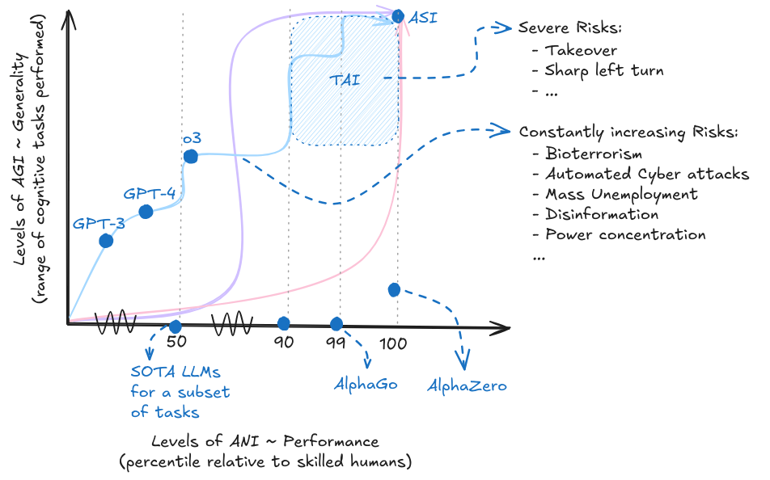

# Chapter 02 - Risks

    <!-- Left Column -->
    

        <!-- Authors -->
        

            
                <i class="fas fa-users"></i>
            
            

                
Authors

                

                    Markov Grey & Charbel-Raphael Segerie
                

            

        

        
        <!-- Affiliations -->
        

            
                <i class="fas fa-building"></i>
            
            

                
Affiliations

                

                    

French Center for AI Safety (CeSIA)

                

            

        

<!-- Acknowledgements section -->

    
        <i class="fas fa-heart"></i>
    
    

        
Acknowledgements

        

            Jeanne Salle, Charles Martinet, Vincent Corruble, Sebastian Gil, Alejandro Acelas, Evander Hammer, Mo Munem, Mateo Rendon, Kieron Kretschmar, Camille Berger
        

    

    

    <!-- Right Column -->
    

        <!-- Date -->
        

            
                <i class="fas fa-calendar"></i>
            
            

                
Last Updated

                
2024-11-20

            

        

        
        <!-- Reading Time -->
		

			
				<i class="fas fa-clock"></i>
			
			

				
Reading Time

				
122 min (core), 11 min (appendix)

			

		

        
        <!-- Links -->
        

            
                <i class="fas fa-link"></i>
            
            

                
Also available on

                

                    <a href="https://docs.google.com/document/d/1ifYc49Wq-9HuqCXCa8jIr5n6ZOYjZ3FvxE9vHPMcu58/edit?usp=sharing" class="meta-link">Google Docs</a>
                

            

        

    

   <a href="https://www.youtube.com/watch?v=dhr4u-w75aQ" class="action-button">
       <i class="fas fa-video"></i>
       Watch
   </a>
   

       <i class="fas fa-headphones"></i>
       Listen
   

   <a href="https://raw.githubusercontent.com/CentreSecuriteIA/textbook/main/latex/AI%20Safety%20Atlas%20-%20Risks.pdf" class="action-button" download>
       <i class="fas fa-file-pdf"></i>
       Download
   </a>
   <a href="https://forms.gle/ZsA4hEWUx1ZrtQLL9" class="action-button">
       <i class="fas fa-comment"></i>
       Feedback
   </a>
   <a href="https://docs.google.com/document/d/1evE1rG91DKBuKlWnqPw45QtPxKBz0GlD_ZYrurNdvN4/edit?usp=sharing" class="action-button">
       <i class="fas fa-users"></i>
       Facilitate
   </a>

# Introduction

<figure class="video-figure" markdown="span">
<iframe style="width: 100%; aspect-ratio: 16 / 9;" frameborder="0" allowfullscreen src="https://www.youtube.com/embed/dhr4u-w75aQ"></iframe>
  <figcaption markdown="1"><b>Video 2.1:</b> Optional video to get an overview of Risks.</figcaption>
</figure>

The previous chapter explored trends like access to compute, availability of data, scaffolding existing models and improving efficiency of algorithms. According to these trends we can assume that AI capabilities will continue to make progress in the upcoming years. But this still leaves open the question - why are increasing capabilities a problem?

Increasing capabilities are a problem, because as AI models get more capable, the scale of the potential risks also rise.

The first step is to get an understanding of - What exactly are the concerning scenarios? What are the likelihoods of certain harmful outcomes occurring over others?, and what aspects of current AI development accelerate these risks? In this chapter we aim to tackle these fundamental questions and provide a concrete overview of the various risks in the AI landscape.

<figure markdown="span">
{ loading=lazy }
  <figcaption markdown="1"><b>Figure 2.1:</b> The two-dimensional view of performance x generality. With increasing capabilities, and increasing generality, we also see increasing risks. Depending on the development trajectory and takeoff we might see longer periods with potential catastrophic risks, or suddenly emerging severe existential risks. The curves and colors in this diagram are meant to be illustrative and do not represent any specific forecasted development trajectory.</figcaption>
</figure>

We already have identifiable pathways through which AI can be misused. This misuse can lead to catastrophic outcomes that could profoundly impact society. In addition to misuse, there is the risk that we are approaching a critical threshold where the development of dangerously advanced capabilities, such as uncontrolled self-proliferation and self-replicating AI agents, becomes a tangible reality. These capabilities could lead to scenarios where AI systems rapidly expand and evolve beyond human control, potentially causing widespread disruption and harm. This proximity to such advanced capabilities underscores the immediate need for vigilance and proactive measures. Additionally, the current regulatory landscape is beset by significant gaps, lacking comprehensive regulations governing AI development and deployment. This absence of adequate regulatory frameworks further exacerbates the risks associated with AI.

**Risk Decomposition** . The first section begins by categorizing risks into three main groups: Misuse, Misalignment, and Systemic risks. Misuse risks refer to situations where an individual or group intentionally uses AI for harmful purposes. Misalignment risks arise due to the AI systems themselves, due to inherent problems in AI design such as systems pursuing goals that are not aligned with human values. Systemic risks encompass broader issues that emerge when we consider not just an AI system in isolation but rather as just one variable in a global interaction between incentives in various complex systems such as politics, society, and economics where no single entity is liable. In addition to categorizing what causes the risk, we also distinguish between different scales of risk that an AI system could pose: catastrophic, where harm is caused to a large portion of humanity, and existential, where harm is so severe that it might be impossible for human civilization to recover.

The next few sections focus on answering the following questions: What exactly are the risks? What happens and what are we worried about?

**Risky Capabilities** . We begin by exploring specific AI capabilities that pose significant risks. These include the potential of using AI to develop bioweapons and committing cyber offenses, as well as its capacity for deception and manipulation. We also consider the risks associated with AI systems that exhibit agency, autonomous replication, and advanced situational awareness. Understanding these capabilities is crucial for developing targeted risk mitigation strategies.

By understanding the nature and scope of these risks, we can develop more effective strategies for mitigating them and ensuring that the development of AI remains beneficial to humanity. The following chapters will build upon this foundation, exploring specific risk, technical solutions, and policy considerations in greater depth.