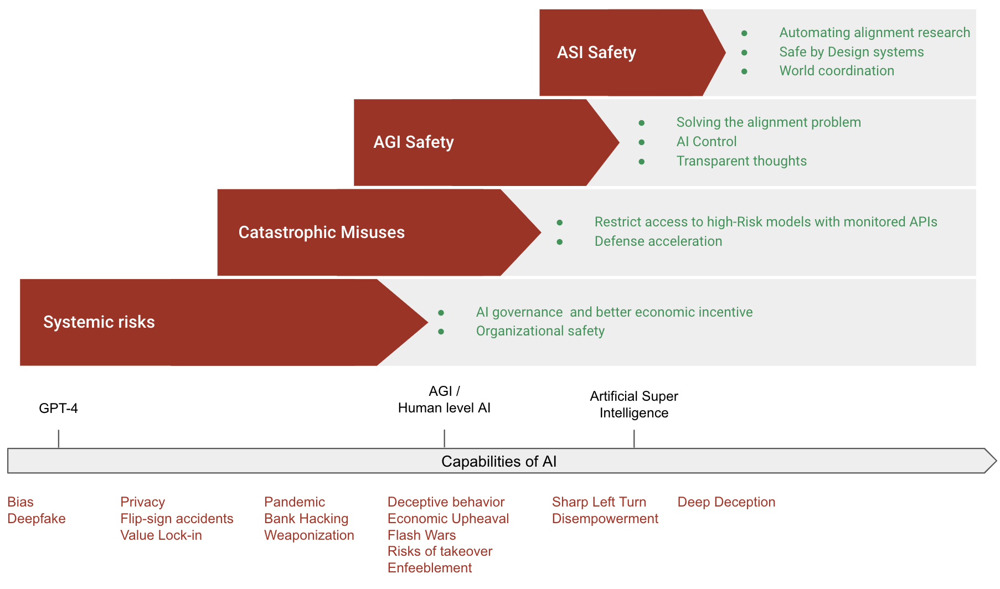

# Solutions

    <!-- Left Column -->
    

        <!-- Authors -->
        

            
                <i class="fas fa-users"></i>
            
            

                
Authors

                

                    

Charbel-Raphael Segerie

                

            

        

        
        <!-- Affiliations -->
        

            
                <i class="fas fa-building"></i>
            
            

                
Affiliations

                

                    

French Center for AI Safety (CeSIA)

                

            

        

<!-- Acknowledgements section -->

    
        <i class="fas fa-heart"></i>
    
    

        
Acknowledgements

        

            Markov Grey, Jeanne Salle, Charles Martinet, Lukas Gebhard, Amaury Lorin, Alejandro Acelas, Flawn, Emily Fan, Kieron Kretschmar, Sebastian Gil, Evander Hammer, Sophia Wesenberg, Jessica Wen, Niharika Chaubey, Angélina Gentaz, Jonathan Claybrough, Camille Berger, Josh Thorsteinson
        

    

    

    <!-- Right Column -->
    

        <!-- Date -->
        

            
                <i class="fas fa-calendar"></i>
            
            

                
Last Updated

                
2024-05-01

            

        

        
        <!-- Reading Time -->
        

            
                <i class="fas fa-book-open"></i>
            
            

                
Reading Time

                
64 minutes

            

        

        
        <!-- Links -->
        

            
                <i class="fas fa-link"></i>
            
            

                
Also available on

                

                    <a href="https://www.lesswrong.com/s/3ni2P2GZzBvNebWYZ/p/RzsXRbk2ETNqjhsma" class="meta-link">Alignment Forum</a> · <a href="https://docs.google.com/document/d/1WTyLHyaJ_NEDEu49U_hh7oz0-AOQfp7uOJKLck-7A78/edit?usp=sharing" class="meta-link">Google Docs</a>
                

            

        

    

[Feedback](https://forms.gle/ZsA4hEWUx1ZrtQLL9){ .md-button }
[Watch](https://www.youtube.com/watch?v=iO7Jl4xders){ .md-button }
[Facilitate](https://docs.google.com/document/d/1cv0gzwSouDjckYHzV7gYbHPKhJZR6bwbJWgHzEJ604Q/edit?usp=sharing){ .md-button }

# Introduction

Although the field of AI safety is still in its infancy, several measures have already been identified that can significantly improve the safety of AI systems. While it remains to be seen if these measures are sufficient to fully address the risks posed by AI, they represent essential considerations. The diagram below provides a high-level overview of the main approaches to ensuring the safe development of AI.

<figure markdown="span">
{ loading=lazy }
  <figcaption markdown="1"><b>Figure 1:</b> Tentative diagram summarizing the main high-level approaches to make AI development safe.</figcaption>
</figure>

The information in this chapter is far from exhaustive and only scratches the surface of the complex landscape of AI safety. Readers are encouraged to explore this [recent list of agendas](https://www.lesswrong.com/posts/zaaGsFBeDTpCsYHef/shallow-review-of-live-agendas-in-alignment-and-safety#Understand_learning) for a more comprehensive review.
