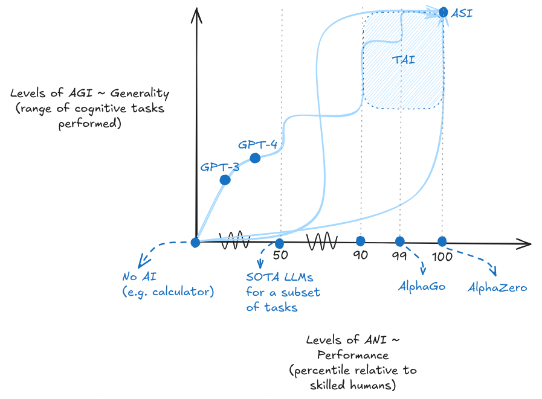
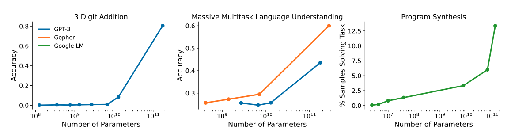
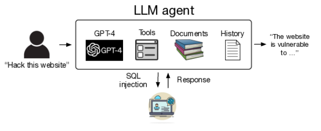

# 4.1 Governance Foundations {: #01 }

    

        <i class="fas fa-clock"></i>
        8 min read
    

    

        <i class="fas fa-file-alt"></i> 
        1605 words
    

**What is AI governance?** AI governance refers to the development of rules, policies, and institutions that shape how AI systems are researched, developed, and deployed. While technical AI safety work focuses on building reliable and aligned systems, governance addresses the broader challenge of managing AI's impact on society. This includes corporate practices, government regulations, standards development, and international coordination mechanisms. The goal is to ensure AI development benefits humanity while managing potential risks.

**How do we usually govern technologies?** Traditional technology governance relies on several key assumptions. First, it is usually assumed that we can predict how a technology will be used and its likely impacts. Second, that we can effectively control its development pathway. And third, that we can regulate specific applications or end-uses. For example, pharmaceutical governance uses clinical trials and approval processes based on intended medical applications. Nuclear technology is controlled through international treaties, safeguards, and monitoring of specific facilities and materials. These approaches work when technologies follow relatively predictable development paths and have clear applications.

**What makes AI governance uniquely challenging?** Even though we have been regulating technological advancements for decades, existing solutions to regulate “tech” might not be sufficient for AI. To better understand why AI governance resists traditional solutions, we can examine AI through three different lenses all of which might require different governance approaches ([Dafoe, 2022](https://academic.oup.com/edited-volume/41989/chapter-abstract/408516484)):

- **AI as general-purpose technology**: AI can transform many sectors simultaneously, like electricity or computers before it. This means sector-specific regulations - the backbone of traditional technology governance - cannot adequately address AI's broad systemic effects. The impacts span across society in ways that make targeted regulation insufficient.

- **AI as an information technology**: AI processes and generates information in novel ways. This creates unprecedented challenges around security, privacy, and information integrity. Traditional governance frameworks weren't designed to handle technologies that can rapidly generate and manipulate information at massive scale. The speed and scope of potential information impacts outstrip traditional control mechanisms.

- **AI as an intelligence technology**: AI raises unique control challenges. As systems become more capable, they may develop sophisticated ways to evade controls or pursue unintended objectives like we highlighted in the risks chapter. There are several dangerous capabilities (e.g. autonomous replication, scheming, deception, etc.) that create fundamental challenges that we have rarely (if ever) seen in governance - how do you reliably control a system that could potentially out-think its control mechanisms?

As we saw in the capabilities chapter, we have already seen power narrow AI (ANI) but now we are continuously making systems that are both capable and increasingly general purpose.This means they become dual purpose tools that can be used for various different tasks.

<figure markdown="span">
{ loading=lazy }
  <figcaption markdown="1"><b>Figure 4.2:</b> The two-dimensional outlook of capabilities and generality. The different curves are meant to represent the different paths we can take to ASI. Every single point on the path corresponds to a different level of AGI. The specific development trajectory is hard to forecast but progress is continuous.</figcaption>
</figure>

These three lenses - general-purpose, information, and intelligence technology - help us analyze why AI development follows such different patterns than other technologies. Traditional governance assumes we can contain a technology's impact to specific sectors, control how information flows, and reliably predict and constrain system behaviors. But AI's mixed nature as a general-purpose, information processing, and potentially intelligent technology challenges all of these assumptions.

**How do these three lenses create challenges for governance?** Even though we have been regulating technological advancements for decades, this AI development process makes AI governance unique. Three fundamental problems emerge from these development characteristics.

**The unexpected capabilities problem.** AI systems can develop surprising abilities that weren't part of their intended design. ([Ganguli et al., 2022](https://arxiv.org/abs/2202.07785); [Bommasani et al., 2022](https://arxiv.org/abs/2108.07258); [Grace et al., 2024](https://arxiv.org/abs/2401.02843)) As we saw multiple times in the capabilities chapter, foundation models have shown "emergent" capabilities that appear suddenly as models scale up with more data, parameters and compute, from becoming unexpectedly capable at basic arithmetic to complex reasoning. This makes it difficult to evaluate risks before deployment since we can't reliably predict what systems might be capable of.

<figure markdown="span">
{ loading=lazy }
  <figcaption markdown="1"><b>Figure 4.3:</b> Example of unexpected capabilities problem. Graphs of several metrics that improve suddenly and unpredictably as models increase in size ([Ganguli et al., 2022](https://arxiv.org/abs/2202.07785))</figcaption>
</figure>

**The deployment safety problem.** Once deployed, AI systems can be repurposed for many different applications - both beneficial and harmful. These systems are inherently dual-use - their capabilities can be redirected toward unintended purposes after deployment. Users regularly discover new capabilities that weren't anticipated by the original developers ([U.K. government, 2023](https://www.gov.uk/government/publications/frontier-ai-capabilities-and-risks-discussion-paper/frontier-ai-capabilities-and-risks-discussion-paper)). We dedicated several sections in the risks chapter to this and saw many different ways that problems can arise. The problem begins with simple circumvention of safety measures - users have found numerous "jailbreaks" to bypass content restrictions in language models (Anderljung et al., 2023). But the challenges escalate quickly. Language models trained for helpful dialogue have been repurposed to generate misinformation ([Slattery et al., 2024](https://arxiv.org/abs/2408.12622)) and assist with cyberattacks ([CAIS, 2024](https://www.safe.ai/blog/cybersecurity-and-ai-the-evolving-security-landscape); [Ladish, 2024](https://axrp.net/episode/2024/04/30/episode-30-ai-security-jeffrey-ladish.html)), potentially even designing novel bio weapons ([Hendrycks 2023](https://arxiv.org/abs/2306.12001); [Marchal et al., 2024](https://arxiv.org/abs/2406.13843); [Fang et al., 2024](https://arxiv.org/abs/2402.06664)). We are now also seeing the emergence of autonomous AI agents that can chain together model capabilities in novel and unpredictable ways using new tools post deployment.

<figure markdown="span">
{ loading=lazy }
  <figcaption markdown="1"><b>Figure 4.4:</b> Example of deployment safety problem. A schematic of using autonomous LLM agents to hack websites. ([Fang et al., 2024](https://arxiv.org/abs/2402.06664)) Once a dual purpose technology is public, it can be used for a variety of things both beneficial and harmful.</figcaption>
</figure>

**The proliferation problem.** AI capabilities can spread rapidly through multiple channels - open-source releases, model theft, or reproduction by other actors. As we saw in the strategies chapter, once capabilities exist, they become very difficult to contain. Models can be stolen, leaked, or reproduced by other groups within months. One example is the rapid open-source replication of ChatGPT-like capabilities, leading to discovery of new capabilities and removal of safety features ([Solaiman et al., 2024](https://arxiv.org/abs/2406.13843)) Even API-based models can have their capabilities extracted through techniques like model distillation. ([U.K. government, 2023](https://www.gov.uk/government/publications/frontier-ai-capabilities-and-risks-discussion-paper/frontier-ai-capabilities-and-risks-discussion-paper))

**How do these problems interact and compound?** These challenges don't exist in isolation - they interact and amplify each other in ways that make AI governance even harder. The unexpected capabilities problem makes deployment safety more difficult to ensure, since we can't reliably predict what abilities might emerge that could be misused. The deployment flexibility of AI systems makes proliferation more concerning, since capabilities can be repurposed for harmful uses after they spread. And proliferation increases the chances of discovering unexpected capabilities through experimentation by many actors ([Anderljung et al., 2023](https://arxiv.org/abs/2307.03718)).

**What is the function of governance?** Governance is not solely about restrictions; it also encompasses functions that facilitate responsible innovation, such as providing guidance, fostering collaboration, and creating safe spaces for experimentation. Although we’re concerned with challenges whose answers mostly rely on setting guardrails, these enabling functions are equally important. Governance fulfills several key functions. A couple of examples include:

- **Visibility**: Enhanced visibility is fundamental to effective oversight. It involves creating mechanisms that bring transparency to AI development processes, allowing stakeholders to understand and monitor the progress and potential impacts of AI.  Visibility enables verification - the confirmation of claims made by AI developers or other actors and the assessment of AI systems against established standards or benchmarks.

- **Enforcement**: Governance needs to provide the means to ensure compliance with regulations and ethical guidelines. This can range from legal sanctions to market exclusions for non-compliant actors.

**What levers can governance use to affect these targets?** To execute these functions, governance systems employ a variety of mechanisms ([Howlett, 2019](https://www.taylorfrancis.com/books/mono/10.4324/9781315232003/designing-public-policies-michael-howlett-michael-howlett)). Here are examples of just a few of the mechanisms that governance has on hand to affect the chosen governance target:

- **Information-based tools**: We can leverage the power of knowledge dissemination. These might include mandatory disclosure requirements for AI companies or public education initiatives to increase AI literacy.

- **Authoritative tools**: We can draw upon the power of institutions to set and enforce rules. This could involve legislation, executive orders, or judicial decisions that directly regulate AI development and use.

- **Standards**: These play a core role in AI governance, serving as a bridge between broad principles and specific practices ([Cihon, 2019](https://www.governance.ai/research-paper/standards-for-ai-governance-international-standards-to-enable-global-coordination-in-ai-research-development)). They can be technical, like those defining AI performance metrics, or ethical, outlining acceptable practices in AI development.

- **Incentives**: This mechanism helps shape behavior through rewards and penalties. These can be financial, such as tax breaks for companies investing in AI safety research, or reputational, like certification schemes that recognize responsible AI practices. By aligning economic and social motivations with governance objectives, incentives can drive voluntary compliance and innovation in governance approaches.

**What does this mean for governance approaches?** These fundamental challenges - unexpected capabilities, deployment safety risks, and rapid proliferation - mean we need new approaches to governing AI development. Traditional regulatory tools like application-specific permits or post-deployment monitoring won't be sufficient given AI's unique characteristics. To build effective governance, we need to identify what aspects of the AI development pipeline we can meaningfully influence before capabilities emerge or proliferate. We need to understand which intervention points give us the most leverage while allowing beneficial innovation to continue. In the next section, we'll examine specific targets along the AI development and deployment pipeline - from key inputs like compute and data to deployment controls and monitoring systems - evaluating each through the lens of these core challenges.

    ❧

