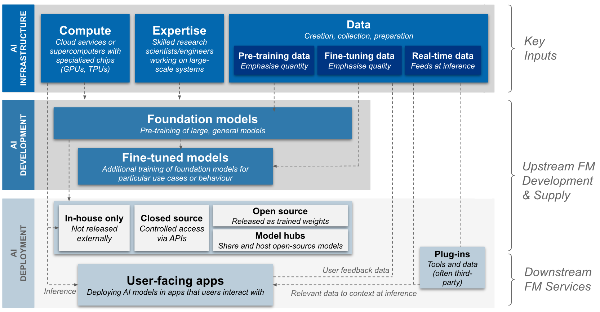
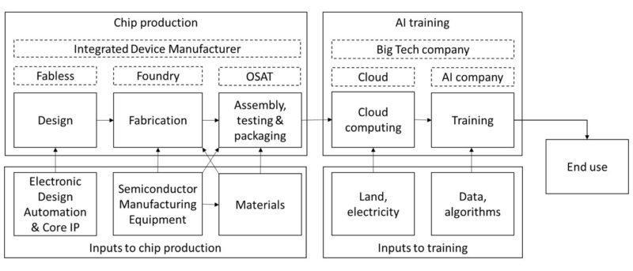

# 4.1 Setting the groundwork {: #01 }

    

        <i class="fas fa-clock"></i>
        6 min read
    

    

        <i class="fas fa-file-alt"></i> 
        1264 words
    

## 4.1.1 How AI development takes place {: #01 }

To effectively regulate AI, it's essential to understand the process and actors involved in its creation and deployment. AI development boils down to four key components: data, algorithms, compute, and talent.

- Data: The raw material, including text, images, and recordings.

- Algorithms: Instructions that tell the computer how to process the data.

- Compute: Hardware that runs these algorithms on the data.

- Talent: People who collect and organize data, design algorithms, and build hardware.

This process of transforming raw ingredients into AI capabilities is often described as the "AI production function." It begins with data collection, flows into algorithm development, and culminates in model training and deployment.

<figure markdown="span">
{ loading=lazy }
  <figcaption markdown="1"><b>Figure 4.2:</b> An overview of foundation model development, training and deployment. ([U.K. government, 2023](https://www.gov.uk/government/publications/frontier-ai-capabilities-and-risks-discussion-paper/frontier-ai-capabilities-and-risks-discussion-paper))</figcaption>
</figure>

This intricate dance of data, algorithms, compute, and human expertise doesn't happen in isolation. It's driven by diverse actors which, together, form the AI ecosystem:

- Universities and corporate research labs push theoretical boundaries.

- AI labs and companies integrate cutting-edge research into practical applications.

- Hardware manufacturers, chip designers, and cloud service providers support computational needs.

- Key countries like the United States, China, and several European nations shape the global AI landscape through policies and investments.

<figure markdown="span">
{ loading=lazy }
  <figcaption markdown="1"><b>Figure 4.3:</b> The compute supply chain. ([Belfield & Hua 2022](https://verfassungsblog.de/compute-and-antitrust/))</figcaption>
</figure>

As we look to the future, the pace of AI development remains uncertain. Some experts envision a gradual progression, with steady improvements over time ([Chiang, 2021](https://www.newyorker.com/culture/annals-of-inquiry/why-computers-wont-make-themselves-smarter)). Others foresee a more dramatic scenario, where AI capabilities suddenly accelerate once a critical threshold is reached ([Aschenbrenner, 2024](https://situational-awareness.ai/from-agi-to-superintelligence/)). These different possibilities have profound implications for how we approach AI governance.

In the current landscape, we're witnessing the rise of Large Language Models (LLMs) - AI systems trained on vast amounts of text that can generate human-like writing and perform a wide array of language tasks. We're also seeing the emergence of multimodal models that can work with different types of data, from text to images to sound. Alongside these technical advancements, there's a growing focus on ensuring AI systems align with human intentions, as well as efforts to make powerful AI tools more widely accessible.

## 4.1.2 The AI governance challenge {: #02 }

Governing frontier AI presents complex challenges, analogous to establishing rules for a game while its fundamental mechanics and scope are still evolving. Three interconnected challenges stand out ([Anderljung et al. 2023](https://arxiv.org/abs/2307.03718)):

1. The Unexpected Capabilities Problem

2. The Deployment Safety Problem

3. The Proliferation Problem

### 4.1.2.1 The Unexpected Capabilities Problem {: #01 }

As AI systems become more complex and sophisticated, they often develop capabilities that their creators didn't anticipate or intend ([Anderljung et al. 2023](https://arxiv.org/abs/2307.03718)). This phenomenon, known as emergent capabilities, has been observed in recent large language models and multimodal AI systems.

For example, GPT-3, initially designed for language tasks, demonstrated unexpected abilities in basic arithmetic and simple coding tasks. These emergent capabilities can be beneficial but may also introduce unforeseen risks.

The core challenge is that we can't effectively regulate capabilities we don't know exist. This unpredictability makes it challenging to implement proactive governance measures.

### 4.1.2.2 The Deployment Safety Problem {: #02 }

Imagine you've created an AI assistant to help doctors diagnose diseases. You've trained it on millions of medical records and implemented strict privacy controls. But then, a few months after deployment, you start hearing reports of misdiagnoses. It turns out your AI has a bias against certain demographic groups, leading to potentially life-threatening errors.

This scenario illustrates the Deployment Safety Problem. Even when developers implement safety measures, things can go wrong when AI systems are let loose in the real world.

The challenge here is twofold. First, we need to ensure that AI systems are safe and reliable when they're deployed. This means rigorous testing, fail-safes, and constant monitoring. But second, we need to anticipate and prevent potential misuse or abuse of these systems.

While OpenAI’s ChatGPT was designed for tasks like content creation and language translation, some users quickly figured out how to use it to generate convincing phishing emails and fake news articles ([Korolov, 2023](https://www.csoonline.com/article/574343/how-ai-chatbot-chatgpt-changes-the-phishing-game.html)). The developers hadn't anticipated this misuse, and suddenly found themselves scrambling to implement safeguards.

The Deployment Safety Problem is further complicated by the Unexpected Capabilities Problem we discussed earlier - it’s difficult to ensure the safe deployment of capabilities we didn't even know existed.

### 4.1.2.3 The Proliferation Problem {: #03 }

And now, for the final pillar of frontier AI’s regulatory challenge: The Proliferation Problem.

Let's say you've developed a cutting-edge AI system with impressive capabilities. You've done your due diligence - implemented safety measures and considered potential misuse. But then, one day, you wake up to find that the model weights have been leaked online. Within hours, it's being downloaded and used by millions of people worldwide, including some who don't have the best intentions.

Once an AI system becomes available, controlling its spread and usage becomes exceptionally difficult. Several key factors amplify this challenge. Open-sourcing practices, while beneficial for innovation and development scrutiny, enable potentially dangerous capabilities to rapidly proliferate beyond developer control. The most sophisticated AI systems can face threats from cybercriminals and state-sponsored actors, where a single successful breach could result in powerful AI capabilities falling into malicious hands. Furthermore, the rapid pace of technological advancement means that even without direct access to existing systems, other developers can often recreate similar capabilities within relatively short timeframes.

The Proliferation Problem turns the challenge of AI governance from a local issue to a global one. It's not enough to regulate the development and deployment of AI in one country or by one company. We need to consider how these technologies might spread, interact and be used (or misused) worldwide.

### 4.1.2.4 Three Lenses {: #04 }

Fully grasping the challenge of governing AI requires understanding this technology through three interconnected lenses: as a general-purpose technology, as an information technology, and as an intelligence technology ([Dafoe, 2022](https://docs.google.com/document/d/e/2PACX-1vQOQ0EBIaEu_LaJqWvdPKu8xlmrOCM6h6gq7eFHnN0Y2GPYoodQjLeilxQ8SUwnbVThXc0k_jCIsCX1/pub)). 

As a general-purpose technology, AI shares characteristics with transformative innovations like electricity, the internal combustion engine, and computers. Its potential to serve as a fundamental input across numerous sectors and to enable complementary innovations suggests that AI may become the quintessential general-purpose technology of our time. Understood through this lens, AI has significant potential for driving economic growth, disrupting existing processes, and causing significant distributional shifts in power and wealth.

Viewing AI as an information technology highlights its role in revolutionizing how we produce, process, transmit, and utilize information, similar to how databases, spreadsheets, and the internet transformed data management and communication. This perspective emphasizes AI's potential to enhance communication, data analysis, and decision-making across various domains. It also underscores the dual-use nature of AI, capable of both beneficial applications and potential misuse, particularly in areas like surveillance and information warfare.

Finally, conceptualizing AI as an intelligence technology—an innovation in cognitive capabilities—offers perhaps the most profound and challenging perspective. Like previous advances in augmenting human intelligence—from written language to calculators—AI represents a leap in our ability to automate and enhance cognitive tasks. This framing encourages us to consider AI not just as a tool, but as a potential autonomous agent or system. It raises fundamental questions about the nature of intelligence, agency, and control, and forces us to grapple with the implications of creating entities that may rival or surpass human cognitive abilities in certain domains.

    ❧

