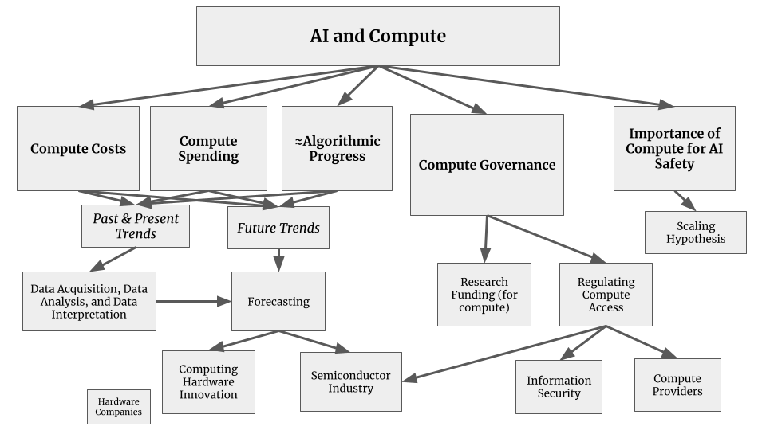
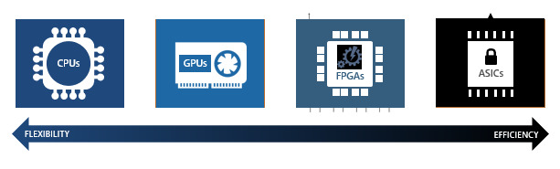
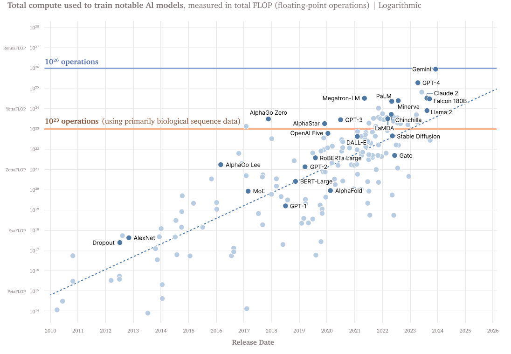
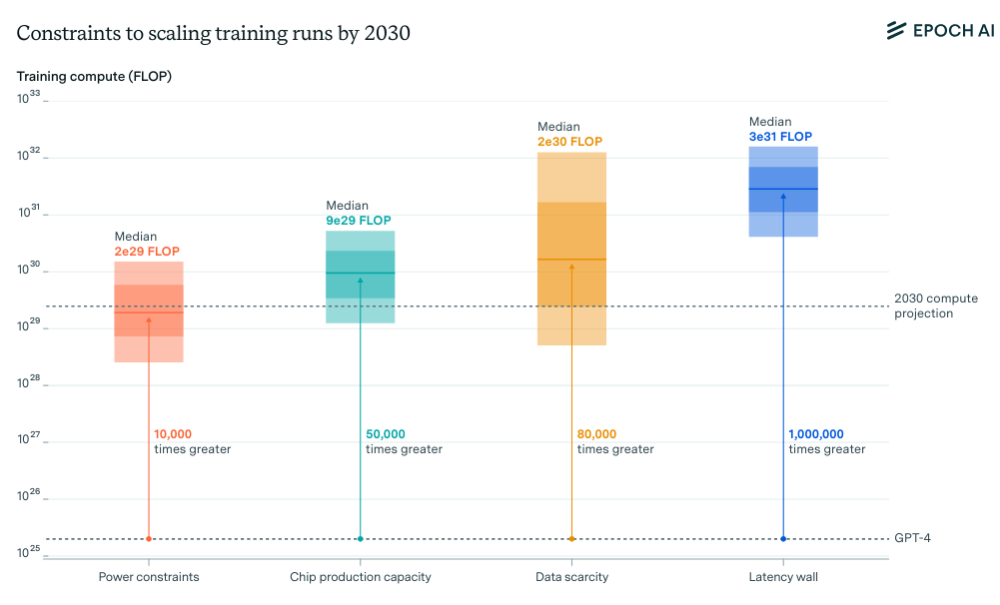

# 4.2 Governance Targets {: #02 }

    

        <i class="fas fa-clock"></i>
        17 min read
    

    

        <i class="fas fa-file-alt"></i> 
        3308 words
    

**Why do we need specific governance targets?** The challenges we explored in the previous section - unexpected capabilities, deployment safety risks, and rapid proliferation - mean we need to carefully choose where and how to intervene in AI development ([Anderljung et al., 2023](https://arxiv.org/abs/2307.03718)). This requires identifying both what to govern (targets) and how to govern it (mechanisms).

**What makes a good governance target?** Before we get into what specifically we can and do target in AI governance, we need to understand what makes a good governance target in general. Effective points of intervention for good governance need to have a combination of properties. They should be concretely measurable, meaningful, and practical:

- **Measurability**: We should be able to track and verify what's happening. The semiconductor industry provides a good example - chip production can be measured in precise units, making it possible to track and regulate manufacturing.

- **Controllability**: There must be concrete ways to influence the chosen targets. Think about how export controls on advanced semiconductors work because the supply chain has clear chokepoints that can be regulated ([Sastry et al., 2024](https://arxiv.org/abs/2402.08797)).

- **Meaningful**: Finally, targets should address fundamental aspects of development. In the case of AI this means addressing the core things that shape capabilities and risks. While regulating end applications is important, targeting core inputs like data and compute can help shape development before risks materialize.

**Which targets matter most?** So if we want to apply these targets concretely to the AI development process, then we have several potential intervention points. Early in development, we can target key inputs: the data used to train models, the compute infrastructure required to run training, and the model development process itself. Once systems are built, deployment offers additional targets: controlling who has access to what capabilities, monitoring how systems are used, and assessing their impacts on society ([Heim et al., 2024](https://arxiv.org/abs/2403.08501)). Each of these targets presents different opportunities and challenges for governance.

## 4.2.1 Compute Governance {: #01 }

**What makes compute a good target for governance?** Out of the things that drive AI performance - data, compute, and algorithms - compute holds a unique position. If someone has a copy of some algorithm/data, this doesn't prevent others from having the same. When it comes to GPUs on the other hand, they can't just be downloaded or copy-pasted into existence. It is a concrete, tangible physical constraint on AI development. Let's look at the variables we had for a good governance target and see how compute fares:

- **Measurability:** Unlike data or algorithms, compute leaves clear physical footprints. Training frontier models requires massive data centers housing thousands of specialized chips ([Pilz & Heim, 2023](https://arxiv.org/abs/2311.02651)). We can track computational capacity through well-defined metrics like floating point operations (FLOPS), allowing us to identify potentially risky training runs before they begin ([Heim & Koessler, 2024](https://arxiv.org/abs/2405.10799)).

- **Controllability:** The supply chain for advanced AI chips has clear chokepoints - just a handful of companies control critical steps like chip design and manufacturing ([Grunewald, 2023](https://www.iaps.ai/research/ai-chip-making-china)). These chokepoints enable governance through mechanisms like export controls or licensing requirements ([Sastry et al., 2024](https://arxiv.org/abs/2402.08797)).

- **Meaningfulness:** As we discussed in the risks chapter, the most dangerous capabilities are likely to emerge from highly capable models, which require massive amounts of specialized computing infrastructure to train and run ([Anderljung et al., 2023](https://arxiv.org/abs/2307.03718); [Sastry et al., 2024](https://arxiv.org/abs/2402.08797)). Compute requirements directly constrain what AI systems can be built - even with cutting-edge algorithms and vast datasets, organizations cannot train frontier models without sufficient computing power ([Besiroglu et al., 2024](https://arxiv.org/abs/2401.02452)). This makes compute a particularly meaningful point of intervention, as it allows us to shape AI development before potentially dangerous systems emerge rather than trying to control them after the fact ([Heim et al., 2024](https://arxiv.org/abs/2403.08501)).

<figure class="iframe-figure" markdown="span">
<iframe src="https://ourworldindata.org/grapher/ai-performance-knowledge-tests-vs-training-computation?tab=chart" loading="lazy" style="width: 100%; height: 600px; border: 0px none;" allow="web-share; clipboard-write"></iframe>
  <figcaption markdown="1"><b>Interactive Figure 4.1:</b> Showcasing how capabilities seem directly proportional to increases in compute. ([Giattino et al., 2023](https://ourworldindata.org/artificial-intelligence))</figcaption>
</figure>

The discussion in the next few subsections will focus on the elements of actually implementing compute governance. We explain how concentrated supply chains enable tracking and monitoring of compute, we also give a brief discussion of hardware based on-chip compute governance mechanisms, and finally discuss some limitations based around limitations to governance based on compute thresholds, and how distributed training and open source might challenge compute governance.

<figure markdown="span">
{ loading=lazy }
  <figcaption markdown="1"><b>Figure 4.5:</b> A graphical depiction of the relationship of AI to various aspects of compute.</figcaption>
</figure>

### 4.2.1.1 Tracking {: #01 }

How is the AI chip supply chain structured? AI-specialized chips emerge from a complex global process. It starts with mining and refining raw materials like silicon and rare earth elements. These materials become silicon wafers, which are transformed into chips through hundreds of precise manufacturing steps. The process requires specialized equipment - particularly photolithography machines from ASML - along with various chemicals, gases, and tools from other suppliers ([Grunewald, 2023](https://www.iaps.ai/research/ai-chip-making-china)).

<figure markdown="span">
{ loading=lazy }
  <figcaption markdown="1"><b>Figure 4.6:</b> The compute supply chain. ([Belfield & Hua 2022](https://verfassungsblog.de/compute-and-antitrust/))</figcaption>
</figure>

**Where are the chokepoints in design and manufacturing?** The supply chain is dominated by a handful of companies at critical steps. NVIDIA designs most AI-specialized chips, TSMC manufactures the most advanced chips, and ASML produces the machines needed by TSMC to manufacture the chips ([Grunewald, 2023](https://www.iaps.ai/research/ai-chip-making-china); [Pilz et al., 2023](https://arxiv.org/abs/2311.02651)). It is estimated that NVIDIA controls around 80% of the market for AI training GPUs ([Jagielski, 2024](https://www.nasdaq.com/articles/nvidia-dominating-artificial-intelligence-chip-market-apple-has-been-securing-supply)). Similarly both TSMC, and ASML maintain strong leads in their respective domains. ([Pilz et al., 2023](https://arxiv.org/abs/2311.02651)).

<figure class="iframe-figure" markdown="span">
<iframe src="https://ourworldindata.org/grapher/market-share-logic-chip-production-manufacturing-stage?tab=chart" loading="lazy" style="width: 100%; height: 600px; border: 0px none;" allow="web-share; clipboard-write"></iframe>
  <figcaption markdown="1"><b>Interactive Figure 4.2:</b> Market share for logic chip production, by manufacturing stage ([Giattino et al., 2023](https://ourworldindata.org/grapher/market-share-logic-chip-production-manufacturing-stage?tab=chart))</figcaption>
</figure>

**Where are the chokepoints in usage and infrastructure?** Besides building the chips, the purchase and operation of them at the scale needed for frontier AI models requires massive upfront investment. Just three providers - Amazon, Microsoft, and Google - control about 65% of cloud computing services ([Jagielski, 2024](https://www.nasdaq.com/articles/nvidia-dominating-artificial-intelligence-chip-market-apple-has-been-securing-supply)). A small number of AI companies like OpenAI, Anthropic, and DeepMind operate their own massive GPU clusters, but even these require specialized hardware subject to supply chain controls ([Pilz & Heim, 2023](https://arxiv.org/abs/2311.02651)).

**What do these chokepoints mean for governance?** This concentration creates natural intervention points. Authorities only need to work with a small number of key players to implement controls, as demonstrated by U.S. export restrictions on advanced chips ([Heim et al., 2024](https://arxiv.org/abs/2403.08501)). It is worth keeping in mind though that this heavy concentration is also concerning. We're seeing a growing "compute divide" - while major tech companies can spend hundreds of millions on AI training, academic researchers struggle to access even basic resources ([Besiroglu et al., 2024](https://arxiv.org/abs/2401.02452)). This impacts who can participate in AI development and reduces independent oversight of frontier models. It also raises concerns around potential power concentration.

<figure markdown="span">
{ loading=lazy }
  <figcaption markdown="1"><b>Figure 4.7:</b> The spectrum of chip architectures with trade-offs in regards to efficiency and flexibility.</figcaption>
</figure>

**How can we target controls effectively?** Rather than trying to control all computing infrastructure, governance can focus specifically on specialized AI chips. These are distinct from general-purpose hardware in both capabilities and supply chains. By targeting only the most advanced AI-specific chips, we can address catastrophic risks while leaving the broader computing ecosystem largely untouched ([Heim et al., 2024](https://arxiv.org/abs/2403.08501)). For example, U.S. export controls specifically target high-end data center GPUs while excluding consumer gaming hardware.

### 4.2.1.2 Monitoring {: #02 }

**How can we ****detect concerning AI**** training runs?** Training frontier AI models leaves multiple observable footprints. The most reliable is energy consumption - training runs that might produce dangerous systems require massive power usage, often hundreds of megawatts, creating distinctive patterns ([Wasil et al., 2024](https://arxiv.org/abs/2408.16074) ; [Shavit, 2023](https://arxiv.org/abs/2303.11341)) Besides energy, other technical indicators include network traffic patterns characteristic of model training, hardware procurement and shipping records, cooling system requirements and thermal signatures, infrastructure buildout like power substation construction. ([Sastry et al., 2024](https://arxiv.org/abs/2402.08797); [Shavit, 2023](https://arxiv.org/abs/2303.11341); [Heim et al., 2024](https://arxiv.org/abs/2403.08501)). These signals become particularly powerful when combined - sudden spikes in both energy usage and network traffic at a facility containing known AI hardware strongly suggest active model training.

**What role do compute thresholds play?** Regulations have already begun using compute thresholds to trigger oversight mechanisms. The U.S. Executive Order on AI requires companies to notify the government about training runs exceeding 10^26 operations - a threshold designed to capture the development of the most capable systems. The EU AI Act sets an even lower threshold of 10^25 operations, requiring not just notification but also risk assessments and safety measures. ([Heim & Koessler, 2024](https://arxiv.org/abs/2405.10799)). These thresholds help identify potentially risky development activities before they complete, enabling preventive rather than reactive governance.

<figure markdown="span">
{ loading=lazy }
  <figcaption markdown="1"><b>Figure 4.8:</b> Compute Thresholds as Specified in the US Executive Order 14110 ([Sastry et al., 2024](https://arxiv.org/pdf/2402.08797))</figcaption>
</figure>

**What governance roles can cloud providers play?**  Most frontier AI development happens through cloud computing platforms rather than self-owned hardware. This creates natural control points for oversight, since most organizations developing advanced AI must work through these providers (Heim et al., 2024, Governing Through the Cloud). Cloud providers' position between hardware and developers allows them to implement controls that would be difficult to enforce through hardware regulation alone. They maintain the physical infrastructure ,track compute usage patterns and maintain development records. They can also monitor compliance with safety requirements, can implement access controls and respond to violations ([Heim et al., 2024](https://arxiv.org/abs/2403.08501); [Chan et al., 2024](https://arxiv.org/abs/2406.12137)).

**How can cloud providers help implement oversight?** One promising approach is "know-your-customer" (KYC) requirements similar to financial services. Providers would verify the identity and intentions of clients requesting large-scale compute resources, maintain records of significant compute usage, and report suspicious patterns ([Egan & Heim, 2023](https://arxiv.org/abs/2310.13625)). This can be done while protecting privacy - basic workload characteristics can be monitored without accessing sensitive details like model architecture or training data ([Shavit, 2023](https://arxiv.org/abs/2303.11341)). Similar KYC laws can be applied to the supply chain on purchases of state of the art AI compute hardware.

### 4.2.1.3 On-Chip Controls {: #03 }

**How does on-chip compute governance work?** Beyond monitoring and detection, compute infrastructure can include active control mechanisms built directly into the processor hardware. Similar to how modern smartphones and computers include secure elements for privacy and security, AI chips can incorporate features that verify and control how they're used ([Aarne et al., 2024](https://www.iaps.ai/research/secure-governable-chips)). These features could prevent unauthorized training runs or ensure chips are only used in approved facilities ([Aarne et al., 2024](https://www.iaps.ai/research/secure-governable-chips)). The verification happens at the hardware level, making it much harder to bypass than software-based controls.

**What specific controls could be implemented?** Several approaches show promise. Usage limits could cap the amount of compute used for certain types of AI workloads without special authorization. Secure logging systems could create tamper-resistant records of how chips are used. Location verification could ensure chips are only used in approved facilities ([Brass & Aarne, 2024](https://www.iaps.ai/research/location-verification-for-ai-chips)). Hardware could even include "safety interlocks" that automatically pause training if certain conditions aren't met. Ideas like this are also called on-chip governance. ([Aarne et al., 2024](https://www.iaps.ai/research/secure-governable-chips)).

**How does this compare to existing security features?** We already see similar concepts in cybersecurity, with features like Intel's Software Guard Extensions, or trusted platform modules (TPM) ([Intel, 2024](https://www.intel.com/content/www/us/en/business/enterprise-computers/resources/trusted-platform-module.html)) providing hardware-level security guarantees. While we're still far from equivalent safeguards for AI compute, early research shows promising directions (Shavit, 2023, What does it take to catch a Chinchilla?). Some chips already include basic monitoring capabilities that could be expanded for governance purposes ([Petrie et al., 2024](https://arxiv.org/abs/2404.18308)).

### 4.2.1.4 Limitations {: #04 }

**What fundamental challenges does compute governance face?** While compute offers many advantages as a governance target, several trends could reduce its effectiveness. While the trend over the last decade has involved more compute this might not last forever. Even though research suggests continued model scaling is still possible through 2030 ([Sevilla et al., 2024](https://epoch.ai/blog/can-ai-scaling-continue-through-2030)) algorithmic improvements continuously enhance efficiency, meaning the same compute achieves more capability over time. Smaller models could begin to show comparable capabilities and risks. For example, Falcon 180B is outperformed by far smaller models like Llama-3 8B. This makes static compute thresholds less reliable as capability indicators without regular updates. ([Hooker, 2024](https://arxiv.org/abs/2407.05694)). Moreover, 'inference-time compute' improvements like best-of-n sampling, chain-of-thought reasoning, and model distillation can dramatically improve model capabilities without changing training compute. Current governance frameworks do not account for these post-training enhancements. ([Shavit, 2023](https://arxiv.org/abs/2303.11341))

<figure markdown="span">
{ loading=lazy }
  <figcaption markdown="1"><b>Figure 4.9:</b> Estimates of the scale constraints imposed by the most important bottlenecks to scale. Each estimate is based on historical projections. The dark shaded box corresponds to an interquartile range and light shaded region to an 80% confidence interval. The four boxes showcase four constraints that might slow down growth in the future: power, chips (compute), data and latency. ([Sevilla et al., 2024](https://epoch.ai/blog/can-ai-scaling-continue-through-2030))</figcaption>
</figure>

**Smaller more specialized models might still cause risks.** Different domains have very different compute requirements. For example, while language models often demand extensive compute, biology and code models typically require far less. Highly specialized models trained on specific datasets might develop dangerous capabilities while using relatively modest compute. For example, models focused on biological or cybersecurity domains could pose serious risks even with compute usage below typical regulatory thresholds ([Mouton et al., 2024](https://www.rand.org/pubs/research_reports/RRA2977-1.html); [Heim & Koessler, 2024](https://arxiv.org/abs/2405.10799)).

**How do we balance control with access?** While compute governance can help manage AI risks, overly restrictive controls could have negative consequences. Right now, only a handful of organizations can afford the compute needed for frontier AI development. ([Purtova et al., 2022](https://arxiv.org/abs/2212.10244); [Pilz et al., 2023](https://arxiv.org/abs/2311.02651)) Adding more barriers could worsen this disparity, concentrating power in a few large tech companies and reducing independent oversight ([Besiroglu et al., 2024](https://arxiv.org/abs/2401.02452)).

**How do we balance safety with research and innovation?** Academic researchers already struggle to access the compute they need for meaningful AI research. As models get larger and more compute-intensive, this gap between industry and academia grows wider. ([Besiroglu et al., 2024](https://arxiv.org/abs/2401.02452); [Zhang et al., 2021](https://arxiv.org/abs/2104.07237)) Large compute clusters have many legitimate uses beyond AI development - from scientific research to business applications. Overly broad restrictions could hinder beneficial innovation. Additionally, once models are trained, they can often be run for inference using much less compute than training required. This makes it challenging to control how existing models are used without imposing overly restrictive controls on general computing infrastructure ([Sastry et al., 2024](https://arxiv.org/abs/2402.08797)). Without specific provisions for research access - like subsidized compute grants or academic partnerships - governance measures could unintentionally slow the development of AI safety research and external evaluation capabilities.

**Could distributed training approaches bypass compute governance controls?** Currently, training frontier models requires concentrating massive compute resources in single locations due to communication requirements between chips. Decentralized or distributed training methods have not really caught up to centralized methods. ([Douillard et al., 2023](https://arxiv.org/abs/2311.08105); [Jaghouar et al., 2024](https://arxiv.org/abs/2407.07852)). However, if we see fundamental advances in distributed training algorithms this could eventually allow training to be split across multiple smaller facilities. While this remains technically challenging and inefficient, it could make detection and control of dangerous training runs more difficult ([Anderljung et al., 2023](https://arxiv.org/abs/2307.03718)).

Given these limitations, compute monitoring and thresholds should primarily operate as an initial screening mechanism to identify models warranting further scrutiny, rather than as the sole determinant of specific regulatory requirements. They are most effective when used to trigger oversight mechanisms such as notification requirements and risk assessments, whose results can then inform appropriate mitigation measures.

## 4.2.2 Data Governance {: #02 }

!!! warning "This section can be considered extra detail and safely skipped."

**What role does data play in AI risks?** Data fundamentally shapes what AI systems can do and how they behave. For frontier foundation models, training data influences both capabilities and alignment - what systems can do and how they do it. Low quality or harmful training data could lead to misaligned or dangerous models ("garbage in, garbage out"), while carefully curated datasets might help promote safer and more reliable behavior ([Longpre et al., 2024](https://arxiv.org/abs/2407.14933); [Marcucci et al., 2023](https://arxiv.org/abs/2302.13731)).

**How well does data meet our governance target criteria?** Data as a governance target presents a mixed picture when evaluated against our key criteria. Let's look at each:

- **Measurability**: While we can measure raw quantities of data, assessing its quality, content, and potential implications is far more difficult. Unlike physical goods like semiconductors, data can be copied, modified, and transmitted in ways that are hard to track. This makes comprehensive measurement of data flows extremely challenging.

- **Controllability**: Data's non-rival nature means it can be copied and shared widely - once data exists, controlling its spread is very difficult. Even when data appears to be restricted, techniques like model distillation can extract information from trained models ([Anderljung et al., 2023](https://arxiv.org/abs/2307.03718)). However, there might still be some promising control points, particularly around original data collection and the initial training of foundation models.

- **Meaningfulness**: Data is particularly meaningful when it comes to AI development. The data used to train models directly shapes their capabilities and behaviors. Changes in training data can significantly impact model performance and safety. This makes data governance potentially powerful, but only if we can overcome the challenges of measurement and control.

**What are the key data governance concerns?** Several aspects of data require careful governance to promote safe AI development:

- **Training data quality and safety is fundamental - low quality or harmful data can create unreliable or dangerous models**. For instance, technical data about biological weapons in training sets could enable models to assist in their development ([Anderljung et al., 2023](https://arxiv.org/abs/2307.03718)).

- **Data poisoning and security pose increasingly serious threats**. Malicious actors could deliberately manipulate training data to create models that behave dangerously in specific situations while appearing safe during testing. This might involve injecting subtle patterns that only become apparent under certain conditions ([Longpre et al., 2024](https://arxiv.org/abs/2407.14933)).

- **Data provenance and accountability help ensure we can trace where model behaviors come from**. Without clear tracking of training data sources and their characteristics, it becomes extremely difficult to diagnose and fix problems when models exhibit concerning behaviors ([Longpre et al., 2023](https://arxiv.org/abs/2310.16787)).

- **Consent and rights frameworks protect both data creators and users**. Many current AI training practices operate in legal and ethical grey areas regarding data usage rights. Clear frameworks could help prevent unauthorized use while enabling legitimate innovation ([Longpre et al., 2024](https://arxiv.org/abs/2407.14933)).

- **Bias and representation in training data directly impact model behavior**. Skewed or unrepresentative datasets can lead to models that perform poorly or make harmful decisions for certain groups, potentially amplifying societal inequities at a massive scale ([Reuel et al., 2024](https://arxiv.org/abs/2407.14981)).

- **Data access and sharing protocols shape who can develop powerful AI systems**. Without governance around data access, we risk either overly concentrated power in a few actors with large datasets, or conversely, uncontrolled proliferation of potentially dangerous capabilities ([Heim et al., 2024](https://arxiv.org/abs/2403.08501)).

**How does data governance fit into overall AI governance?** Even with strong governance frameworks, alternative data sources or synthetic data generation could potentially circumvent restrictions. Additionally, many concerning capabilities might emerge from seemingly innocuous training data through unexpected interactions or emergent behaviors. While data governance remains important and worthy of deeper exploration (see appendix), other governance targets may offer more direct leverage over frontier AI development in the near term. This is why we focus primarily on compute governance, which provides more concrete control points through its physical and concentrated nature.

<!--

Model Governance [TBD]

!!! warning "This section can be considered extra detail and safely skipped."

-->

    ❧

