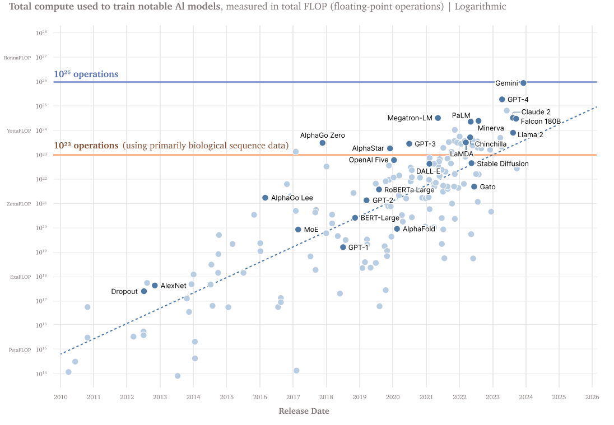

# 4.2 AI governance parameters {: #02 }

    

        <i class="fas fa-clock"></i>
        11 min read
    

    

        <i class="fas fa-file-alt"></i> 
        2202 words
    

## 4.2.1 Functions and Levers {: #01 }

AI governance encompasses a landscape of functions and mechanisms designed to shape the development and deployment of frontier AI systems. These governance structures serve multiple purposes and operate through various channels.

### 4.2.1.1 Functions {: #01 }

Governance fulfills several key functions. Visibility, for instance, is fundamental to effective oversight. It involves creating mechanisms that bring transparency to AI development processes, allowing stakeholders to understand and monitor the progress and potential impacts of AI.

Visibility enables verification - the confirmation of claims made by AI developers or other actors and the assessment of AI systems against established standards or benchmarks.

Enforcement represents another critical function, providing the means to ensure compliance with regulations and ethical guidelines. This can range from legal sanctions to market exclusions for non-compliant actors.

Governance is not solely about restrictions; it also encompasses functions that facilitate responsible innovation, such as providing guidance, fostering collaboration, and creating safe spaces for experimentation. Although we’re concerned in this chapter with challenges whose answers mostly rely on setting guardrails, these enabling functions are equally important.

### 4.2.1.2 Levers {: #02 }

To execute these functions, governance systems employ a variety of levers ([Howlett, 2019](https://www.taylorfrancis.com/books/mono/10.4324/9781315232003/designing-public-policies-michael-howlett-michael-howlett)). Information-based tools, for example, leverage the power of knowledge dissemination. These might include mandatory disclosure requirements for AI companies or public education initiatives to increase AI literacy. Authoritative tools, on the other hand, draw upon the power of institutions to set and enforce rules. This could involve legislation, executive orders, or judicial decisions that directly regulate AI development and use.

Standards play a pivotal role in AI governance, serving as a bridge between broad principles and specific practices ([Cihon, 2019](https://www.governance.ai/research-paper/standards-for-ai-governance-international-standards-to-enable-global-coordination-in-ai-research-development)). They can be technical, like those defining AI performance metrics, or ethical, outlining acceptable practices in AI development.

Incentives form another crucial lever, shaping behavior through rewards and penalties. These can be financial, such as tax breaks for companies investing in AI safety research, or reputational, like certification schemes that recognize responsible AI practices. By aligning economic and social motivations with governance objectives, incentives can drive voluntary compliance and innovation in governance approaches.

## 4.2.2 The role of compute {: #02 }

One potential answer to governing AI lies in the tangible, physical world of compute power.

### 4.2.2.1 Why compute governance is attractive {: #01 }

While the abstract nature of algorithms and the sheer volume of data make them difficult to control, compute power presents us with a unique opportunity. It is, in essence, the bottleneck through which all current frontier AI models must pass, and as such, it offers us a concrete point of intervention.

Why is compute so uniquely suited to this task?

- **Detectability**

Tracking model weights or code is akin to chasing shadows – they can be easily transferred, copied, and hidden. Data, while vast, is often intangible and dispersed. But compute leaves footprints that are hard to conceal. Take GPUs, for instance – their supply chains provide a traceable path, offering concrete insights into who's acquiring the computational power needed for AI development.

Moreover, the physical infrastructure required for cutting-edge AI is difficult to hide. Companies like Google, Microsoft, and Amazon have built massive, warehouse-sized facilities to house their AI operations. These are visible, tangible assets that can be detected.

- **Excludability**

Now, let's consider another unique aspect of compute: its physical nature. You can't simply download more processing power or wish new GPUs into existence. Compute resources are tangible, finite, and most importantly, excludable - when one person or organization uses these resources, it prevents others from using them simultaneously.

This characteristic sets compute apart from other inputs to AI development. Algorithms or model architectures, once created, can be shared and replicated with ease. Data, in many cases, can be scraped from public sources or synthetically generated; in most cases it can be easily copy-pasted. That’s not the case for high-performance computing hardware.

Unlike trying to control the spread of algorithms or data, regulating access to physical compute resources is a much more manageable task. And it is already happening in the real-world - in 2022, the United States imposed restrictions on the export of advanced semiconductors to China, specifically targeting chips used for AI applications ([Shivakumar et al., 2022](https://www.csis.org/analysis/seismic-shift-new-us-semiconductor-export-controls-and-implications-us-firms-allies-and)), demonstrating the feasibility of using compute as a point of control in AI governance.

- **Quantifiability**

Another crucial advantage of focusing on compute: its quantifiability. In a field often characterized by abstract concepts and nebulous metrics, compute offers us something concrete to measure.

Picture a regulatory body tasked with assessing the capabilities of various AI systems. They could try to evaluate the complexity of algorithms or the quality of training data - but this is a Herculean task, fraught with subjectivity and technical challenges. Measuring compute is much more manageable (although still difficult to do reliably - [FMF, 2024](https://www.frontiermodelforum.org/updates/issue-brief-measuring-training-compute/)).

Compute currently serves as a proxy for model capabilities. While not a perfect correlation, there's a general trend that more compute often leads to more capable AI models ([Heim et al., 2024](https://www.governance.ai/post/computing-power-and-the-governance-of-ai)). This relationship provides policymakers and regulators with a rough but useful gauge of AI capabilities, allowing them to set meaningful thresholds and benchmarks.

The most common metric used in this context is FLOP (Floating Point Operations), which provides a standardized measure of computational performance. This allows us to make meaningful comparisons between different AI systems and track progress over time. For example, regulators can mandate or incentivize the adoption of standards for developers of models that used a certain amount of training compute.

However, some experts are raising concerns about the long-term viability of compute as a regulatory lever ([Hooker, 2024](https://arxiv.org/abs/2407.05694)). The mere act of using compute as a governance metric creates optimization pressure for developing models that achieve higher capabilities with lower compute requirements—an example of Goodhart's Law, where a measure stops being a good measure once it becomes a target. As researchers optimize for compute efficiency, the same amount of compute might yield vastly better capabilities, making it necessary to update compute-based requirements to take into account algorithmic progress ([Heim & Koessler, 2024](https://arxiv.org/abs/2405.10799)).

- **The Chokepoint: Concentrated Supply Chains**

The compute ecosystem is concentrated, with a few key players dominating critical parts of the supply chain.

Consider the field of AI-specialized chips, which emerge from a complex global supply chain. The journey begins with mining raw materials like silicon, rare earth elements, and various metals. These materials undergo extensive refinement and purification before being transformed into silicon wafers and other crucial components. Specialized companies then use photolithography machines (dominated by the Netherlands’ ASML) to etch microscopic circuits onto these wafers through hundreds of precise steps, while other firms provide essential chemicals, gasses, and tools for this process. Finally, the chips are assembled, packaged, and tested, often in different facilities across multiple countries.

In this intricate chain, NVIDIA plays a crucial role as a "fabless" semiconductor company - they design the chips and their architecture but outsource the actual manufacturing to companies like TSMC. As of 2024, NVIDIA's chip designs dominated the market for GPUs used in AI training, with some estimates putting their market share as high as 80% ([Jagielski, 2024](https://www.nasdaq.com/articles/nvidia-dominating-artificial-intelligence-chip-market-apple-has-been-securing-supply)). In the realm of chip manufacturing itself, companies like TSMC and Samsung lead the pack in producing the most advanced semiconductors. This concentration creates natural chokepoints where governance - through facilitating or restricting access to compute - can be applied effectively, as the US have done with their export controls.

### 4.2.2.2 Harnessing Compute for Governance {: #02 }

Now that we've explored why compute is uniquely suited for AI governance, let's delve into how it can be practically applied. We'll focus on two main approaches: tracking and monitoring, and implementing hardware-based controls.

**Tracking and Monitoring**

By focusing on compute, governments can gain valuable visibility into AI development and use without needing access to proprietary algorithms or sensitive data.

Compute-based monitoring provides governments with crucial visibility into AI development without requiring access to proprietary algorithms or sensitive data. Several monitoring approaches offer valuable insights into AI development activities. Energy consumption monitoring at known AI research facilities can reveal usage patterns indicative of large-scale model training ([Wasil et al., 2024](https://arxiv.org/pdf/2408.16074)). Hardware acquisition tracking provides early warning signs of entities expanding their AI capabilities ([Cheng, 2024](https://www.convergenceanalysis.org/research/evaluating-an-ai-chip-registration-policy)). Through collaboration with cloud computing providers and major hardware manufacturers, governments can gather anonymized data on global AI compute utilization patterns ([Heim et al., 2024](https://www.oxfordmartin.ox.ac.uk/publications/governing-through-the-cloud-the-intermediary-role-of-compute-providers-in-ai-regulation)). Advanced location verification techniques could enable tracking of chip movements and usage patterns, providing additional oversight capabilities (Aarne et al., 2024[IAPS, 2024](https://www.iaps.ai/research/secure-governable-chips)).

!!! note "Training Compute as a Regulatory Metric"

    Training compute has emerged as a key metric in regulatory frameworks for frontier AI systems, particularly in identifying models that warrant oversight. This approach, adopted by both the US Executive Order on AI and the EU AI Act, uses the total number of computational operations required for the training process as a threshold for regulatory scrutiny.

    Training compute serves as an effective initial regulatory filter due to the characteristics outlined above: it correlates strongly with model capabilities and potential risks; it can be quantified, including early in the development process, even before model training begins, allowing for proactive governance; and it is challenging to bypass - reducing compute usage generally results in reduced model capabilities, making it a useful metric for regulatory purposes.

    **Current Regulatory Approaches**

    Major regulatory frameworks have adopted specific compute thresholds. The US AI Executive Order sets a threshold of 10^26 FLOP, requiring companies to disclose development activities that exceed this level to the federal government. Companies must also report on security measures for model weights and share results of safety testing. The EU AI Act establishes a lower threshold of 10^25 operations, requiring notification to the European Commission, model evaluations, incident reporting, systemic risk assessments, and cybersecurity measures.

    <figure markdown="span">
    { loading=lazy }
      <figcaption markdown="1"><b>Figure 4.4:</b> Compute Thresholds as Specified in the US Executive Order 14110 ([Sastry et al., 2024](https://arxiv.org/pdf/2402.08797))</figcaption>
    </figure>

    **Limitations and Appropriate Use**

    Training compute, while useful, remains an imperfect proxy for risk. Some computationally intensive models may carry limited risks, while models using modest compute power could carry major risks. Additionally, ongoing improvements in algorithmic efficiency gradually reduce the compute needed for a specific capability threshold, possibly reducing the correlation between compute thresholds and risk levels over time.

    Given these limitations, compute thresholds should primarily operate as an initial screening mechanism to identify models warranting further scrutiny, rather than as the sole determinant of specific regulatory requirements. They are most effective when used to trigger oversight mechanisms such as notification requirements and risk assessments, whose results can then inform appropriate mitigation measures.

**Hardware-based Controls**

Beyond passive monitoring, compute also offers opportunities for more active forms of governance through hardware-based controls. Think of these as "guardrails" built directly into the chip infrastructure, ensuring that AI systems operate within predefined boundaries.

Here are a few ways this could be implemented:

- **Usage limits**: Hardware could be designed with built-in limits on how much compute can be used for certain types of AI workloads. For example, chips might have a cap on the amount of computation they can perform for training large language models without special authorization ([Petrie et al., 2024](https://yoshuabengio.org/wp-content/uploads/2024/09/FlexHEG-Interim-Report_2024.pdf)). Similarly, through “location verification” techniques, regulators can detect where chips are used and act accordingly ([Brass & Aarne, 2024](https://www.iaps.ai/research/location-verification-for-ai-chips)).

- **Auditing capabilities**: Processors can include special protected areas that keep track of how AI systems are being used. This creates a secure record that can't be altered, allowing reviewers to later check what the AI did ([Petrie et al., 2024](https://yoshuabengio.org/wp-content/uploads/2024/09/FlexHEG-Interim-Report_2024.pdf)). 

- **Safety interlocks**: Hardware could incorporate features that automatically pause or shut down AI training if certain safety conditions are not met ([IAPS & CNAS, 2024](https://www.iaps.ai/research/secure-governable-chips)).

In the realm of cybersecurity, we already see hardware-based security features like Intel's Software Guard Extensions (SGX) or ARM's TrustZone ([Demigha](https://www.sciencedirect.com/science/article/abs/pii/S0167404820303904)[ & Larguet, 2020](https://www.sciencedirect.com/science/article/abs/pii/S0167404820303904)). Although we’re far from leveraging similar technologies to build guardrails into AI compute, early work has been promising ([Shavit, 2023](https://arxiv.org/abs/2303.11341); [Arne et al., 2024](https://www.cnas.org/publications/reports/secure-governable-chips)).

### 4.2.2.3 Challenges and Limitations {: #03 }

While compute offers many advantages as a focus for AI governance, it's not without its challenges and limitations. Algorithmic improvements continuously enhance efficiency, potentially weakening compute's reliability as a capability proxy over time ([Heim & Koessler, 2024](https://arxiv.org/abs/2405.10799)). Regulatory frameworks must carefully balance safety considerations against the risk of impeding beneficial AI research and innovation. The potential shift toward decentralized computing architectures could complicate traditional governance approaches. While distributed training algorithms exist, their current effectiveness remains limited compared to centralized approaches due to technical constraints ([Douillard et al., 2023](https://arxiv.org/abs/2311.08105)). The regulatory landscape also faces ongoing adaptation challenges, as demonstrated by Nvidia's strategic chip redesigns in response to U.S. export controls targeting China (Iyengar, 2024[Foreign Policy, 2024](https://foreignpolicy.com/2024/08/16/gina-raimondo-us-china-tech-competition-chips-ai/)).

By focusing on compute, we can gain visibility into AI development, implement hardware-based safety measures, and create a governance framework that is both effective and adaptable. However, it's important to remember that compute-based governance is not a silver bullet. It should be seen as one crucial component of a broader, multifaceted approach to ensuring the safe and beneficial development of artificial intelligence.

    ❧

