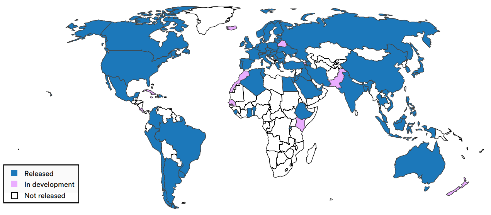

# 4.3 Key issues {: #03 }

    

        <i class="fas fa-clock"></i>
        16 min read
    

    

        <i class="fas fa-file-alt"></i> 
        3210 words
    

## 4.3.1 Competition {: #01 }

AI development firms are in competition with each other. Each breakthrough, each new capability demonstrated, raises the bar for the entire field. In this environment, taking time to thoroughly consider safety implications or ethical concerns can seem like a luxury these companies can ill afford. The mantra becomes "move fast and break things," even when the "things" at stake may include core societal values or human well-being.

This dynamic isn't limited to the private sector. Nation-states, too, have recognized AI as a cornerstone of future economic and military power. Russian President Vladimir Putin's 2017 statement that "whoever becomes the leader in this sphere will become the ruler of the world" encapsulates the high-stakes nature of this competition. This perspective has sparked a flurry of government activity, with over 50 countries announcing national AI strategies and pouring massive public investments into the field ([Stanford, 2024](https://aiindex.stanford.edu/report/)). A testament to the perceived strategic importance of AI for governments, or at least government officials, the former head of the U.S. National Security Agency is now on the board of OpenAI ([Peters, 2024](https://www.theverge.com/2024/6/13/24178079/openai-board-paul-nakasone-nsa-safety)). 

<figure markdown="span">
{ loading=lazy }
  <figcaption markdown="1"><b>Figure 4.5:</b> Countries with a national strategy on AI, 2023 ([2024 AI Index report](https://aiindex.stanford.edu/report/))</figcaption>
</figure>

The consequences of this competitive dynamic are problematic. Even if some actors recognize the need for caution and safety measures, unilateral action risks ceding advantage to less scrupulous competitors. This prisoner's dilemma writ large makes it exceedingly difficult for any single entity, be it a company or a country, to prioritize safety over speed ([Askell et al., 2019](https://arxiv.org/abs/1907.04534)). This also extends to government regulation: countries are tempted to prioritized their competitiveness in AI over ensuring safety and fundamental rights, because they may perceive the regulations to protect the latter as damaging innovation. Thus, the emphasis on national strategic interests often comes at the expense of domestic and international action on AI safety. Countries may be hesitant to support governance frameworks that could potentially constrain their AI ambitions or give competitors an edge. 

**Policies**

Addressing these challenges requires multiple approaches. At the national level, policymakers must work to align the incentives of AI developers with broader societal interests. This could involve regulatory frameworks that mandate safety considerations, coupled with incentives for responsible AI development. Internationally, there's an urgent need for forums and agreements that can help manage the AI race, perhaps drawing lessons from arms control regimes or climate change negotiations.

Moreover, fostering a shared understanding of AI risks among key stakeholders - from tech executives to national security officials - is crucial. This awareness-building must go hand in hand with efforts to reframe the AI race not as a zero-sum game, but as a collective endeavor to manage AI development.

## 4.3.2 Proliferation {: #02 }

Imagine a cutting-edge AI model, capable of generating hyper-realistic deepfakes or designing novel bioweapons, is developed by a well-intentioned research lab. The lab, adhering to principles of open science, publishes their findings and releases the model's code as open-source. Within hours, the model is downloaded thousands of times across the globe. Within days, modified versions start appearing on code-sharing platforms. Within weeks, the capabilities that were once confined to a single lab have proliferated across the internet, accessible to anyone with a decent computer and an internet connection.

This scenario, while hypothetical, isn't far from reality. The AI community has a strong culture of openness, with many researchers and companies releasing their models and findings to the public. This openness has undoubtedly accelerated progress in the field, but it also presents a significant governance challenge.

The proliferation problem in AI governance stems from three main factors:

1. Open-source culture: Many AI researchers and organizations believe in the principles of open science, freely sharing their code and findings.

2. General openness of the AI industry: Even when code isn't openly shared, the AI industry is characterized by a high degree of knowledge sharing through academic papers, conferences, and informal networks.

3. Potential for theft: As AI becomes increasingly valuable, the risk of intellectual property theft, including through cyberattacks or insider threats, grows.

These factors combine to create an environment where potentially dangerous AI capabilities can spread rapidly and widely, outpacing our ability to govern their use effectively.

The proliferation challenge extends beyond the spread of AI models or algorithms. It also encompasses the dissemination of key components in the AI supply chain, such as advanced semiconductors used in AI computing. Recent efforts by the U.S. to restrict the export of cutting-edge chips highlight the dual-use nature of these technologies and the difficulties in controlling their spread ([Masi, 2024](https://medium.com/@nicholas_masi/gpu-export-controls-dont-work-a754c953f04d)).

Another crucial aspect of the proliferation problem is the offense-defense balance in AI capabilities ([Tang et al., 2024](https://securityandtechnology.org/virtual-library/reports/the-implications-of-artificial-intelligence-in-cybersecurity/)). In many areas of AI development, offensive capabilities (such as developing and carrying out cyberattacks or crafting persuasive misinformation) can be easier to develop and deploy than defensive measures (such as using defensive cyber capabilities or filtering out misinformation).

!!! note "Verification Challenges"

    This ease of proliferation creates significant hurdles for international governance efforts. Unlike some nuclear non-proliferation treaties, where satellite imagery and other remote sensing technologies can be used to monitor compliance ([U.S. Congressional Research Service, 2011](https://crsreports.congress.gov/product/pdf/R/R41201)), verifying adherence to AI governance agreements would likely require deep access to an organization's or country's AI systems and development processes. And that may require access to highly sensitive or strategically valuable corporate or national secrets. Many countries will be reluctant to agree to inspections or information sharing that could compromise their strategic advantages or reveal the full extent of their AI capabilities.

    Imagine, for instance, an international agreement that prohibits the development of AI systems capable of autonomously launching cyber attacks. Verifying compliance with such an agreement would be incredibly difficult. It might require access to source code, training data, and testing environments - all of which could be considered state or corporate secrets.

    This verification challenge creates a trust deficit in international AI governance efforts. Countries may be reluctant to enter into agreements they can't verify, while those that do might constantly suspect others of cheating.

    Moreover, the ease of AI proliferation means that even if major powers agree to certain restrictions, smaller countries or non-state actors could potentially develop or acquire advanced AI capabilities. This dynamic further complicates international governance efforts.

**Policies**

How do we ensure responsible use of AI when potentially harmful capabilities are widely accessible? The key challenge for AI governance becomes finding the right balance between openness and control. Several potential solutions have been proposed to find the right balance:

- **Targeted Openness**: Instead of a binary open/closed approach, AI developers could adopt a more nuanced stance. For instance, foundational research and non-sensitive applications could remain open, while potentially dangerous capabilities are subject to stricter controls.

- **Staged releases**: Rather than immediately making a lab’s most advanced model publicly available, it could gradually release increasingly capable models ([Solaiman, 2023](https://arxiv.org/abs/2302.04844)). This allows developers to assess potential risks and misuse scenarios at each stage, informing decisions about subsequent releases. Developers can identify unforeseen issues or concerns; researchers, policymakers, and the public can reflect about the implications of more advanced AI systems; and society and relevant stakeholders have time to adapt to each level of capability before more powerful versions are released.

- **Enhanced Information Security**: As AI systems become more powerful, protecting them from theft or unauthorized access becomes crucial. This might involve developing new cybersecurity protocols specifically designed for AI systems.

- **Export Controls and Access Restrictions**: Governments might implement export controls on advanced AI systems or components, similar to those used for other sensitive technologies. Additionally, access to large-scale computing resources necessary for training frontier AI models could be restricted ([Heim et al., 2024](https://www.oxfordmartin.ox.ac.uk/publications/governing-through-the-cloud-the-intermediary-role-of-compute-providers-in-ai-regulation)).

- **Responsible Disclosure Practices**: The AI community could develop norms around responsible disclosure of potentially dangerous capabilities, similar to those in the cybersecurity field ([O’Brien et al., 2024](https://www.iaps.ai/research/coordinated-disclosure)).

- **Technical Measures**: Researchers could explore technical solutions to limit the misuse of AI models, such as built-in use restrictions ([Dong et al., 2024](https://arxiv.org/abs/2406.02622)).

- **International cooperation**: This could involve creating new institutions or frameworks specifically designed to monitor and manage the spread of advanced AI capabilities. 

## 4.3.3 Uncertainty {: #03 }

The governance of frontier AI is profoundly complicated by the pervasive uncertainty that shrouds the field. This uncertainty manifests in multiple dimensions.

At the most fundamental level, there is deep uncertainty about the future trajectory of AI capabilities - although experts and forecasters have generally been surprised by the rapid pace of AI development ([Cotra & Piper 2024](https://www.planned-obsolescence.org/language-models-surprised-us/)). Predicting the pace and direction of future advancements is challenging. This uncertainty is compounded by the potential for unexpected breakthroughs or emergent capabilities that could rapidly shift the risk landscape, making it difficult for governance frameworks to anticipate and prepare for all possible scenarios.

Another critical area of uncertainty lies in understanding the relative importance of different factors in AI development. The interplay between computational power, data availability, and algorithmic innovations in driving AI progress is not fully understood. What is sometimes called the "scaling debate" has significant implications for governance approaches ([Hooker & Sandoval, 2024](https://cohere.com/blog/scaling-laws-of-ai)). If compute is the primary bottleneck, then regulations focusing on hardware access might be most effective. Conversely, if data or algorithmic breakthroughs are key, different governance levers would need to be prioritized.

The nature and magnitude of potential risks posed by advanced AI systems are also subjects of considerable uncertainty. While there is largely a consensus on some current or near-term risks, such as AI-enabled disinformation or privacy violations, the long-term and more extreme risks are more contentious and difficult to quantify. The challenge for governance is to address these potential risks without overreacting or stifling beneficial innovation.

This uncertainty extends to the efficacy of proposed technical solutions for AI safety and alignment. While research in these areas is progressing, it's unclear whether current approaches will scale to more advanced AI systems or if fundamentally new paradigms will be required. This creates a moving target for governance efforts, as the mechanisms needed to ensure AI safety may evolve rapidly alongside AI capabilities.

The "pacing problem" further complicates matters. AI technology is advancing at a rate that often outstrips the ability of governance structures to adapt. Traditional regulatory processes, designed for slower-moving technologies, may struggle to keep up with the rapid evolution of AI capabilities. This creates a risk of governance frameworks becoming obsolete almost as soon as they are implemented.

Compounding these challenges is the relative lack of expertise within many government bodies regarding cutting-edge AI technologies. This knowledge gap can lead to misguided policies or an inability to effectively oversee AI development and deployment. Bridging this expertise gap is crucial but challenging, given the competitive landscape for AI talent.

Despite these uncertainties, the potential consequences of advanced AI systems are too significant to allow for inaction. This creates a paradoxical situation where decisions must be made and governance structures established in the face of deep uncertainty - as has occasionally been the case in other fields that grapple with decision-making under uncertainty, such as pandemic preparedness.

**Policies**

One approach to addressing this uncertainty is to increase visibility into AI development processes. This could involve implementing more robust reporting requirements for AI companies, including "know-your-customer" policies for providers of AI services or compute.

Enhancing state and regulatory capacity is another crucial step. This involves not only increasing the technical expertise within government bodies but also developing more agile regulatory frameworks that can adapt quickly to new developments. Regulatory sandboxes, where new AI technologies can be tested under controlled conditions, offer one potential model for more responsive governance.

Scenario planning and red-teaming exercises can also play a valuable role in preparing for uncertain futures. By systematically exploring a range of possible AI development trajectories and their implications, governance bodies can develop more robust and adaptable strategies.

Importantly, governance approaches should be designed with flexibility and adaptability in mind. This could involve building in regular review periods, establishing clear triggers for policy adjustments based on predefined milestones in AI capabilities, and maintaining open channels of communication between policymakers, researchers, and industry leaders.

## 4.3.4 Accountability {: #04 }

Companies like OpenAI, Google DeepMind, and Anthropic are pushing the boundaries of what's possible, often moving faster than regulators can keep up. Their decisions about what to develop, how to develop it, and when to release it to the public have far-reaching consequences. Yet, there is currently little external oversight or even visibility into these processes.

Take the release of GPT-3, for instance. The decision to release it first as a limited API, then more broadly, was made primarily by OpenAI's leadership. No regulatory body reviewed the model's capabilities and potential risks before its release. No standardized safety tests were required.

Companies developing frontier AI technologies wield enormous power, with the potential to reshape societies, economies, and power structures globally. Yet they operate with a degree of autonomy that would be unthinkable in other high-stakes industries. For example, pharmaceutical companies can’t release new drugs without regulatory approval, and nuclear power plants can’t be built without impact assessments.

The consequences of this lack of accountability are already becoming apparent. We've seen AI-generated deepfakes used to spread political misinformation ([Swenson & Chan, 2024](https://apnews.com/article/artificial-intelligence-elections-disinformation-chatgpt-bc283e7426402f0b4baa7df280a4c3fd)). Language models have been used to create convincing phishing emails and other scams ([Stacey, 2025](https://www.ft.com/content/d60fb4fb-cb85-4df7-b246-ec3d08260e6f)). And there are growing concerns about AI systems perpetuating and amplifying societal biases.

Finally, this is not just about preventing harm. Lack of accountability also erodes public trust in AI technologies ([Afroogh et al., 2024](https://www.nature.com/articles/s41599-024-04044-8)). When people feel that these powerful systems are being developed behind closed doors, with little external oversight, it's natural to be skeptical or even fearful.

**Policies**

How do we make AI development more accountable without stifling innovation? There is no simple answer, but there are several promising approaches to consider (more information about such solutions in section 5, Layers of Responsibility). 

A robust accountability framework for AI development requires interlocking mechanisms operating at different timescales and levels of governance. At the foundational level, pre-deployment approval systems could establish clear capability-based thresholds for AI development accompanied by regulatory requirements, similar to regulations in other high-risk industries. Deployment could be mode contingent on developers meeting safety and transparency requirements, creating a baseline for responsible development practices.

Building on this foundation, ongoing oversight could be maintained through a combination of external audits and ethical review boards. Independent experts would evaluate AI systems' capabilities, training data, and potential impacts, while diverse stakeholders would assess broader ethical implications. This dual-track review process, modeled after successful frameworks in medical research, would help identify and address both technical and societal concerns throughout the development cycle.

To ensure these oversight mechanisms have real impact, they must be backed by clear enforcement capabilities. A well-defined liability framework could establish legal responsibility for AI-related harms, creating strong incentives for careful development practices. This would be complemented by emergency intervention mechanisms, enabling regulatory bodies to respond swiftly to imminent risks from AI deployments – for instance, by halting the release of potentially dangerous systems.

The effectiveness of these measures ultimately depends on transparency and international coordination. Regular public disclosures about AI capabilities, limitations, and risks would enable informed public discourse while protecting legitimate proprietary interests. Given the global nature of AI development, these national frameworks must be harmonized through international agreements to prevent regulatory arbitrage and establish consistent global standards (see [section 5.3](https://docs.google.com/document/d/11Kx1yfdDESGSIa-KUSxMwc_FErX4U4gZFaqKtlca0y4/edit?tab=t.0#heading=h.4dkjd3j1yiin)). This coordinated approach would help ensure that accountability measures remain robust even as AI technology continues to advance.

## 4.3.5 Allocation {: #05 }

AI has the potential to reshape the distribution of power, wealth, and opportunities across society. The issue of allocation or distributive consequences revolves around several questions associated with the consequences of developing and deploying increasingly advanced AI systems: who controls these systems? Who reaps their benefits? And what happens to those left behind?

The distributive consequences of AI span two interrelated dimensions: power and wealth. On the power front, we're seeing a gradual but significant shift in who holds the reins of influence and control in society. Those who develop and control advanced AI systems are gaining unprecedented leverage over economic, political, and social spheres.

Large language models like GPT-3 or Claude are developed and controlled by a handful of tech companies and research institutions. This concentration of power raises serious questions about accountability, transparency, and systemic influence.

On the wealth front, AI is driving a new wave of automation and productivity gains, but the benefits aren't being distributed evenly. We're seeing a widening gap between those who own and control AI technologies and those whose jobs and livelihoods are being disrupted by them.

Previous technological revolutions have often led to increased inequality, at least in the short to medium term. And with AI, the stakes are even higher, because AI has the potential to be a truly general-purpose technology, one that could theoretically replace human cognitive labor across almost all domains. If (or when) AGI becomes a reality, the distributive consequences could be staggering. Whoever controls an entity capable of outperforming humans in virtually every cognitive task - from scientific research to strategic planning to creative endeavors - would wield considerable power and wealth.

The prospect of AGI amplifies all the distributive concerns discussed so far. It could lead to extreme concentrations of power, potentially even enabling new forms of authoritarian control or technocratic governance.

**Policies**

How can we address the distributive consequences of AI development and deployment? There is no simple solution, but several approaches are being explored and debated. Redistributive policies could help spread the wealth generated by advanced AI systems. This could take the form of taxes on AI-driven profits, universal basic income programs, investment in education and retraining initiatives, or a ‘Windfall Clause’ ([O’Keefe et al., 2019](https://arxiv.org/abs/1912.11595)). These direct redistributive measures can be complemented by longer-term structural changes in how AI development occurs. Democratizing AI development through open-source projects and targeted public funding can help spread access to these transformative technologies beyond a small group of well-resourced organizations. This democratization effort could gain teeth through carefully crafted regulatory frameworks that prevent monopolistic consolidation.

These solutions must grapple with the differential impacts of AI across various segments of society and the global economy. It's not just a matter of the haves versus the have-nots. We're seeing complex dynamics play out between:

- Capital and labor: As AI automates more tasks, the returns to capital (those who own AI systems and the data they run on) may increase relative to returns to labor.

- Frontier AI countries and laggards: Nations at the forefront of AI development may gain significant economic and strategic advantages over others.

- Tech-savvy individuals and the less digitally literate: As AI becomes more integrated into daily life, those who can effectively use and understand these technologies may have significant advantages.

- Large corporations and small businesses: Big tech companies with vast data resources and AI capabilities may gain even more market power, potentially squeezing out smaller competitors.

These differential impacts add layers of complexity to the governance challenge. They underscore the need for nuanced, adaptable policies that can address the specific needs and vulnerabilities of different groups.

    ❧

