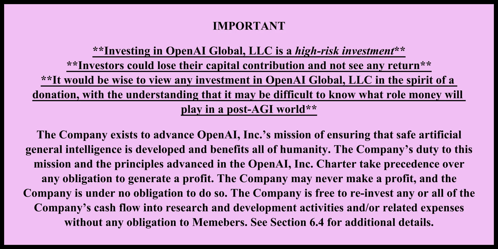
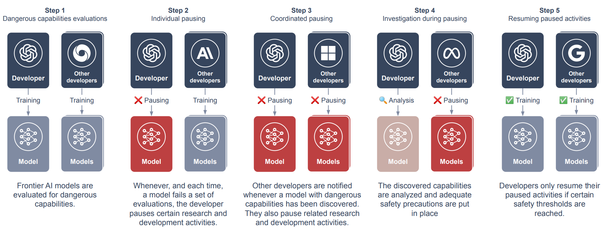

# 4.4 Corporate Governance

    

        
            <i class="fas fa-clock"></i>
        
        

            
Reading Time

            
16 min

        

    

!!! quote "Elon Musk (Founder/Co-Founder of OpenAI, Neuralink, SpaceX, xAI, PayPal, CEO of Tesla, CTO of X/Twitter)"

    "AI is a rare case where I think we need to be proactive in regulation than be reactive [...] I think that [digital super intelligence] is the single biggest existential crisis that we face and the most pressing one. It needs to be a public body that has insight and then oversight to confirm that everyone is developing AI safely [...] And mark my words, AI is far more dangerous than nukes. Far. So why do we have no regulatory oversight? This is insane."

The challenges we discussed earlier - unexpected capabilities, deployment risks, and rapid proliferation - create complex oversight problems. Companies developing frontier AI have unique visibility into these challenges. They work directly with the models, see capabilities emerge firsthand, and can implement safety measures faster than external regulators ([Anderljung et al., 2023](https://arxiv.org/abs/2307.03718); [Sastry et al., 2024](https://arxiv.org/abs/2402.08797)).

**Why do we start with corporate governance?** Companies building frontier AI face a balancing act. They have the technical knowledge and direct control needed to implement effective safeguards. But they also face market pressures that can push against taking time for safety measures. Looking at how companies handle this tension helps us understand both the possibilities and limitations of self-regulation in AI development ([Zhang et al., 2021](https://arxiv.org/abs/2105.02117); [Schuett, 2023](https://arxiv.org/abs/2212.08364)).

In this section we'll examine how AI companies approach governance in practice - from basic safety protocols to comprehensive oversight frameworks. We'll look at what works, what doesn't, and where gaps remain. This helps us understand why corporate governance alone isn't enough, setting up our later discussions of national and international oversight. By the end of this section, we'll see both the essential role of company-level governance and why it needs to be complemented by broader regulatory frameworks.

Frontier AI companies can implement internal governance mechanisms to govern AI. This self-regulatory layer serves as a crucial complement to external oversight, providing more immediate and technically informed controls over AI development and deployment.

Internal governance mechanisms are vital because frontier AI companies possess unique advantages in governing their systems. They have direct access to technical details, development processes, and emerging capabilities; they can implement controls more rapidly than external regulators; and they understand the technical nuances that might escape broader regulatory frameworks. Their proximity to development allows them to identify and address risks earlier and more effectively than external oversight alone could achieve.

<figure markdown="span">
{ loading=lazy }
  <figcaption markdown="1"><b>Figure 4.10:</b> A section of the operating agreement between OpenAI, LLC (for-profit entity) and OpenAI, Inc. (non-profit entity). ([OpenAI, 2024](https://openai.com/our-structure/))</figcaption>
</figure>

For instance, companies can implement real-time monitoring of model behavior, establish internal review boards for sensitive applications, and develop sophisticated testing protocols that would be difficult to mandate through external regulation. This privileged position in the development process creates both opportunity and responsibility for robust self-governance.

Components of Internal Governance - Effective internal governance can be complex, ranging from comprehensive technical standards to organizational structures. Companies can establish detailed development guidelines that incorporate safety considerations from the earliest stages of research, alongside rigorous testing protocols to evaluate system capabilities and limitations. These technical standards can be accompanied by clear deployment criteria that must be met before systems can be released or scaled.

The organizational structure can support these technical standards through dedicated safety teams with real authority to pause or modify development when necessary. Internal ethics boards can evaluate sensitive applications, while clear escalation paths ensure safety concerns reach appropriate decision-makers quickly. Companies can also consider how to integrate safety considerations into their promotion and compensation structures to align incentives throughout the organization.

Beyond individual measures, frontier AI developers can participate in collective self-regulatory initiatives through industry-wide safety standards and best practices. Voluntary commitments to specific safety measures or deployment restrictions can help establish industry norms, while information sharing about safety-relevant incidents can improve practices across the sector.

Limitations and Challenges - Internal governance faces several significant challenges. Perhaps the most fundamental is the challenge of incentive alignment, as companies face competing pressures between safety and other objectives like market competition, growth, and profitability. Internal governance mechanisms must be robust enough to withstand these pressures, particularly during critical periods of market competition or technological breakthroughs.

Credibility and accountability present another major challenge. Self-regulatory measures may lack credibility without external validation or enforcement mechanisms. Companies may have to find ways to demonstrate their commitment to safety and responsible development that convince external stakeholders of their seriousness and effectiveness.

Coordination problems arise when individual company initiatives fail to address broader societal concerns or system-wide risks. Some challenges require coordination across the industry or between companies and governments, which can be difficult to achieve through purely voluntary measures. The competitive nature of AI development can sometimes work against the kind of open collaboration needed to address these broader challenges.

The Role of Transparency and External Validation - Voluntary governance is not necessarily internal to the company. It can include mechanisms for transparency and external validation. Regular public reporting on safety measures and incidents provides accountability, while third-party audits of safety systems and processes offer independent verification of governance effectiveness. Companies can maintain active engagement with external stakeholders and experts to ensure their governance approaches remain relevant and effective.

The relationship with external regulation is particularly important. Internal governance should complement rather than replace external oversight, with companies designing internal systems that can interface effectively with regulatory requirements. This includes maintaining documentation that can support compliance efforts and participating constructively in the development of regulatory frameworks. Companies can also share relevant insights and experience with policymakers to help inform the development of effective external oversight mechanisms.

<figure class="iframe-figure" markdown="span">
<iframe src="https://ourworldindata.org/grapher/affiliation-researchers-building-artificial-intelligence-systems-all?tab=chart" loading="lazy" style="width: 100%; height: 600px; border: 0px none;" allow="web-share; clipboard-write"></iframe>
  <figcaption markdown="1"><b>Interactive Figure 4.6:</b> Share of notable AI systems by researcher affiliation ([Giattino et al., 2023](https://ourworldindata.org/artificial-intelligence))</figcaption>
</figure>

## 4.4.1 Frontier Safety Frameworks {: #01}

Frontier Safety Frameworks are internal policies that AI companies create to guide their development process and ensure they're taking appropriate precautions as their systems become more capable. They’re the equivalent of the safety protocols used in nuclear power plants or high-security laboratories. At the Seoul AI Summit organized in May 2024, 16 companies around the world committed to implementing such policies ([UK government, 2024](https://www.gov.uk/government/publications/frontier-ai-safety-commitments-ai-seoul-summit-2024/frontier-ai-safety-commitments-ai-seoul-summit-2024)).

Two of the biggest names in the AI world, Anthropic - through its Responsible Scaling Policy - and OpenAI - through its Preparedness Framework -, have been at the forefront of developing these frameworks. Let's take a closer look at their approaches.

### 4.4.1.1 Anthropic's Responsible Scaling Policy (RSP) {: #01-01}

Anthropic’s Responsible Scaling Policy is a document that outlines different "AI Safety Levels" (ASLs) and the corresponding safety measures that need to be in place as their models become more powerful.

For example, at ASL-2 (which includes their current most advanced model, Claude 2), Anthropic commits to things like publishing detailed model cards, providing a way for people to report vulnerabilities, or enforcing strict rules about how the model can be used.

For higher risk levels (ASL-3 and above), Anthropic ratchets up the precautions significantly. They talk about limiting access to training techniques, implementing much stronger security measures, and even being prepared to pause development entirely if things get too dicey.

### 4.4.1.2 OpenAI's Preparedness Framework {: #01-02}

OpenAI’s Preparedness Framework revolves around what they call a “Scorecard” – essentially a way to evaluate the risks associated with their AI models across different categories.

OpenAI's is quite specific in certain areas. For instance, they have a whole category dedicated to CBRN risks (Chemical, Biological, Radiological, and Nuclear risk). They define their "High" risk threshold in this category as: "Model enables an expert to develop a novel threat vector OR model provides meaningfully improved assistance that enables anyone with basic training in a relevant field (e.g., introductory undergraduate biology course) to be able to create a CBRN threat."

**The Strengths and Weaknesses of Current Approaches** The current governance frameworks from major AI labs reveal both promising approaches and concerning gaps in industry self-regulation. Their public nature enables valuable external scrutiny, while their risk categorization demonstrates engagement with potential failure modes. The frameworks' deliberately flexible structure allows adaptation as our understanding of AI risks evolves.

However, these strengths are undermined by several interconnected weaknesses. The frequent use of ambiguous language makes consistent application difficult, while the frameworks' voluntary nature raises questions about their actual implementation when commercial pressures conflict with safety considerations. Some critics argue the frameworks aren't conservative enough given the stakes involved, potentially setting risk thresholds too high and mitigation requirements too low. Additionally, their focus on individual system risks may miss emergent dangers from multiple AI systems interacting in complex ways. The lack of standardization across companies further complicates industry-wide coordination, though this may improve as best practices emerge through practical implementation.

**The Governance Challenge** How do we ensure that companies actually implement their frontier safety frameworks? Both Anthropic and OpenAI have outlined some governance measures in their frameworks.

Anthropic has made some interesting commitments in terms of governance:

- Creating a role called the "Responsible Scaling Officer." This person is supposed to be the guardian of the RSP, making sure the company is living up to its commitments.

- Proactively planning for scenarios where they might need to pause scaling of their models. This shows they're thinking ahead about potential crises.

- Sharing evaluation results publicly (where possible), which adds a layer of external accountability.

Some think those policies have gaps ([Anderson-Samways et al., 2024](https://static1.squarespace.com/static/64edf8e7f2b10d716b5ba0e1/t/65f19a4a32c41d331ec54b87/1710332491804/Responsible+Scaling_+Comparing+Government+Guidance+and+Company+Policy+%284%29.pdf)). They include a clause that says in "extreme emergency" situations, like if a "rogue state" is developing AI recklessly, they might loosen their restrictions. While this flexibility could be necessary, it also potentially undermines the credibility of their other commitments. After all, who defines what constitutes an "extreme emergency"?

On their side, OpenAI has outlined a three-tiered governance structure: their Preparedness team conducts foundational research and monitoring, providing technical expertise to inform governance decisions. This research feeds into a Safety Advisory Group that brings diverse perspectives to risk assessment and mitigation recommendations. Final authority rests with OpenAI's leadership and Board of Directors.

This structure has some clear strengths. The dedicated Preparedness team ensures that safety considerations are always at the forefront. The advisory group brings in outside perspectives, which can help challenge groupthink. And having the Board as a final backstop could provide an additional layer of oversight.

However, questions remain. How much power does the Preparedness team really have? Can they delay or veto projects they deem too risky? How is the Safety Advisory Group selected, and how much influence do they actually wield? And given that OpenAI is ultimately a for-profit company (despite its unusual structure), how do we ensure that safety always trumps commercial interests?

**The Road Ahead** The frameworks and governance structures being developed by companies like Anthropic and OpenAI are important first steps. They show a recognition of the enormous responsibility that comes with developing these powerful systems.

There is still room for improvement. Some suggest that companies like Anthropic should define more precise, verifiable risk thresholds for their safety levels, potentially drawing on societal risk tolerances from other industries ([Anderson-Samways 2024](https://www.iaps.ai/research/responsible-scaling)). For instance, in industries dealing with potentially catastrophic risks (events causing 1,000 or more fatalities), maximum tolerable risk levels typically range from 1 in 10,000 to 1 in 10 billion per year. AGI companies might consider adopting similar quantitative thresholds, adjusted for the potentially even greater stakes involved in AGI development.

Overall, we need a much more robust, standardized, and enforceable set of governance practices for frontier AI development. Moreover, we need to foster a culture within the AI community that prioritizes safety and ethical considerations as much as technical achievements. The goal should be to make responsible AI development not just a regulatory requirement, but a core value of the field.

## 4.4.2 Policy options {: #02}

**Risk Assessment Methods.** Drawing from established safety-critical industries, AGI companies can adapt and implement various systematic approaches to evaluate potential risks. These range from scenario analysis and fishbone diagrams to more specialized techniques like the Delphi method, providing structured ways to anticipate and prepare for both known and unknown challenges in AGI development.

**The Three Lines of Defense.** A robust organizational structure for risk management is essential for AGI companies, implemented through a three-tiered defense system. This framework distributes responsibility across frontline researchers, specialized risk management teams, and independent auditors, ensuring multiple layers of oversight and risk detection throughout the development process.

**Coordinated Pausing.** When dangerous capabilities emerge in AI systems, companies need systematic ways to respond collectively. The coordinated pausing framework provides a structured approach for companies to temporarily halt development, share critical safety information, and resume work only when appropriate safeguards are in place, preventing competitive pressures from compromising safety.

**Deployment Corrections.** Even the most rigorous pre-deployment safeguards may not catch every risk. A comprehensive system of deployment corrections enables companies to maintain control over deployed models, respond rapidly to emerging risks, and implement rollback mechanisms when necessary, ensuring safety even after systems are in production.

**Industry Best Practices.** The AI safety & governance field is converging on a set of core governance practices, supported by broad expert consensus. These include pre-deployment risk assessments, dangerous capabilities evaluations, and third-party audits, representing an emerging standard for responsible AGI development that balances innovation with safety.

### 4.4.2.1 Risk Assessment Methods {: #02-01}

At the heart of effective governance in frontier AI companies lies a robust approach to risk assessment. How do you assess risks for technologies that don't yet exist and capabilities that may emerge unexpectedly?

This is where we can learn from other safety-critical industries. Techniques from fields like aerospace, nuclear power, and cybersecurity could be adapted to the unique challenges of AI development.

Let's take a closer look at some of these techniques ([Koessler & Schuett 2023](https://arxiv.org/abs/2307.08823)):

- **Scenario Analysis** : This involves imagining potential future scenarios and their implications. For AI companies, this might include scenarios like: An AI system developing deceptive behaviors, Unexpected emergent capabilities in a deployed model, A rival company deploying an unsafe AI system.

- **Fishbone Method** : Also known as the Ishikawa diagram, this technique helps identify potential causes of a problem. In the context of AI risks, a fishbone diagram might explore factors contributing to AI alignment failure, such as: Insufficient safety research, Pressure to deploy quickly, Inadequate testing protocols, Misaligned incentives in the AI system

- **Causal Mapping** : This technique visualizes the complex web of cause-and-effect relationships in a system. For AI development, a causal map could illustrate how different research decisions, safety measures, and deployment strategies interact to influence overall risk.

- **Delphi Technique** : This method involves gathering expert opinions through structured rounds of questionnaires. Given the highly specialized nature of AI research, the Delphi technique could be valuable for synthesizing diverse perspectives on potential risks and mitigation strategies.

- **Bow Tie Analysis** : This approach visualizes the pathways between causes, hazardous events, and consequences, along with prevention and mitigation measures. For an AI company, a bow tie analysis might focus on a hazardous event like "loss of control over an AI system," mapping out potential causes (e.g., inadequate containment measures) and consequences (e.g., unintended global changes), along with preventive and reactive controls.

Implementing these techniques requires a cultural shift within AGI companies. Risk assessment can't be an afterthought or a box-ticking exercise; it needs to be woven into the fabric of the organization, from the research lab to the boardroom.

### 4.4.2.2 The Three Lines of Defense {: #02-02}

As AGI companies grapple with these complex risk landscapes, they need robust organizational structures to manage them effectively. One promising approach is the Three Lines of Defense (3LoD) model, a risk management framework widely used in other industries ([Schuett 2023](https://link.springer.com/article/10.1007/s00146-023-01811-0)).

In the context of an AGI company, the 3LoD model might look something like this:

**The First Line of Defense** . This comprises the frontline researchers and developers working on AI systems. They're responsible for implementing safety measures in their day-to-day work, conducting initial risk assessments, and adhering to the company's ethical guidelines and safety protocols.

**The Second Line of Defense** . This includes specialized risk management and compliance functions within the company. For an AI company, this might involve:

- An AI ethics committee overseeing the ethical implications of research directions

- A dedicated AI safety team developing and implementing safety protocols

- A compliance team ensuring adherence to relevant regulations and industry standards

**The Third Line of Defense** . This is typically the internal audit function, providing independent assurance to the board and senior management. In an AI company, this might involve:

- Regular audits of safety practices and risk management processes

- Independent evaluations of AI models for dangerous capabilities

- Assessments of the company's overall preparedness for potential AGI scenarios

Let's see how this might work in practice:

Imagine that researchers in an AI company (first line) develop a new language model with unexpectedly advanced capabilities in logical reasoning. They flag this to the AI safety team (second line), who conduct a thorough evaluation and determine that the model poses potential risks if deployed without additional safeguards.

The safety team works with the researchers to implement additional constraints on the model's outputs. Meanwhile, they also notify the internal audit team (third line), who launch a broader review of the company's processes for identifying and managing emergent capabilities.

This multi-layered approach helps ensure that risks are identified and managed at multiple levels, reducing the chances of dangerous oversights.

### 4.4.2.3 Coordinated Pausing {: #02-03}

The emergence of unexpected and potentially dangerous capabilities is a very real possibility. How should AI companies respond when such capabilities are discovered?

One innovative proposal is the concept of "coordinated pausing" ([Alaga & Schuett 2023](https://arxiv.org/abs/2310.00374)). This approach suggests a structured process for responding to the discovery of dangerous capabilities:

<figure markdown="span">
{ loading=lazy }
  <figcaption markdown="1"><b>Figure 4.11:</b> ([Alaga & Schuett 2023](https://arxiv.org/abs/2310.00374))</figcaption>
</figure>

This approach could take various forms, from a purely voluntary system relying on public pressure, to a more formalized agreement between developers, or even a legally mandated framework.

The benefits of such a system are clear. It provides a mechanism for the AI community to collectively pump the brakes when potentially dangerous territory is entered, allowing time for careful analysis and the development of safety measures.

However, implementing such a system is not without challenges. There are practical questions about how to define "dangerous capabilities" and who gets to make that determination. There are also potential legal hurdles, particularly around antitrust concerns.

### 4.4.2.4 Deployment Corrections {: #02-04}

Even with the most rigorous pre-deployment safeguards, there's always the possibility that dangerous capabilities or behaviors might emerge after an AI system is deployed. This is where the concept of "deployment corrections" comes into play.

Companies thus need comprehensive contingency plans for scenarios where pre-deployment risk management falls short ([O'Brien et al. 2023](https://arxiv.org/abs/2310.00328)). At the technical level, this means maintaining continuous control over deployed models through robust monitoring and modification capabilities, supported by pre-built rollback mechanisms that can revert to earlier, safer versions when needed. These technical controls are complemented by organizational preparedness through dedicated incident response teams trained in rapid risk assessment and mitigation. Clear user agreements establish the legal and operational framework for emergency interventions, ensuring all stakeholders understand how and when access restrictions might be imposed.

### 4.4.2.5 Towards Industry-Wide Best Practices {: #02-05}

As the field of AGI development matures, there's a growing recognition of the need for industry-wide best practices. A survey of 92 experts from AI labs, academia, and civil society found broad agreement on a number of key practices, including pre-deployment risk assessments, dangerous capabilities evaluations, third-party model audits, and safety restrictions on model usage ([Schuett et al. 2023](https://arxiv.org/abs/2305.07153)).

Interestingly, 98% of respondents agreed with all of these measures, suggesting a growing consensus around certain core principles of responsible AGI development.