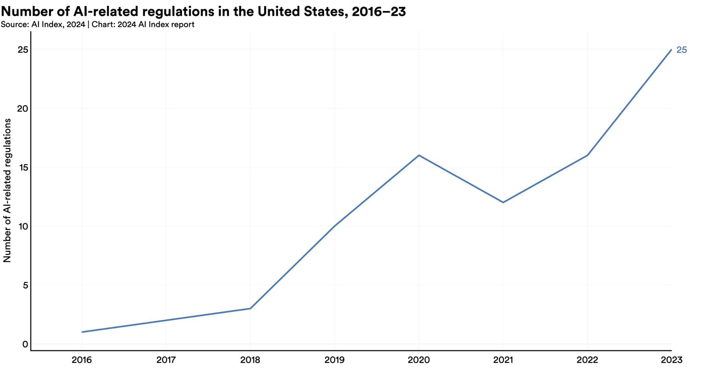
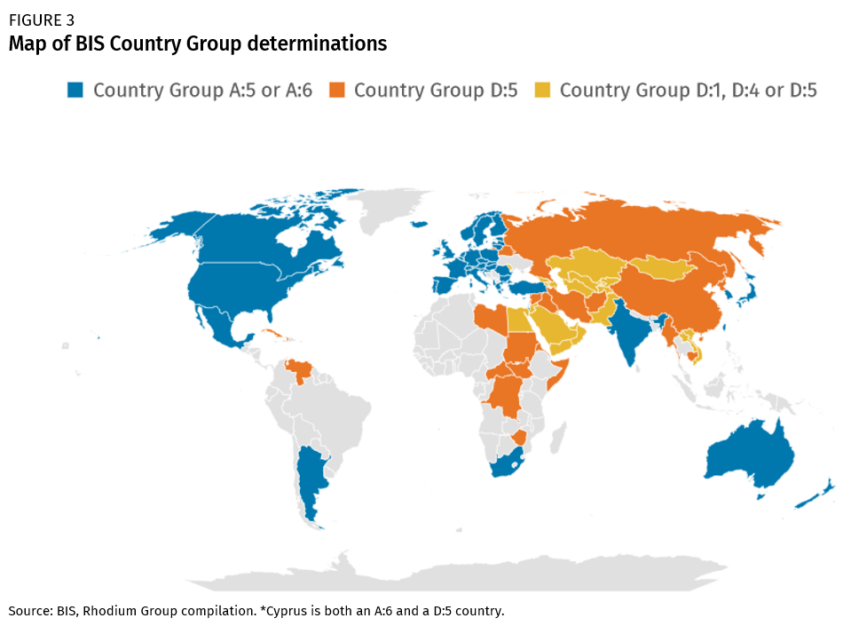

# 4.4 Layers of Responsibility {: #04 }

    

        <i class="fas fa-clock"></i>
        72 min read
    

    

        <i class="fas fa-file-alt"></i> 
        14469 words
    

Effective oversight doesn't happen at just one level. Instead, it involves a web of interconnected initiatives spanning corporate boardrooms, national legislatures, and international forums. Each layer plays a unique role in shaping how AI is developed, deployed, and regulated.

In this section, we'll explore three key levels of AI governance: corporate, national, and international. We'll examine how each level approaches the challenge of responsible AI development and use, and how these approaches complement or sometimes conflict with each other.

At the corporate level, we'll look at how AI developers and tech companies are trying to implement responsible practices. We'll then move to the national stage, where governments are wielding regulatory tools to guide AI development within their borders. Finally, we'll zoom out to the international arena, where countries are both competing against each other and beginning to collaborate on shared principles and frameworks for AI governance.

By understanding these different layers, we can better appreciate the full scope of the AI governance challenge. We'll see how decisions made in one sphere can ripple outwards, affecting policies and practices at other levels.

Let's start by examining how companies at the forefront of AI development are approaching the responsibility that comes with their technological power.

## 4.4.1 Corporate governance initiatives {: #01 }

Frontier AI companies can implement internal governance mechanisms to govern AI. This self-regulatory layer serves as a crucial complement to external oversight, providing more immediate and technically informed controls over AI development and deployment.

Internal governance mechanisms are vital because frontier AI companies possess unique advantages in governing their systems. They have direct access to technical details, development processes, and emerging capabilities; they can implement controls more rapidly than external regulators; and they understand the technical nuances that might escape broader regulatory frameworks. Their proximity to development allows them to identify and address risks earlier and more effectively than external oversight alone could achieve.

<figure markdown="span">
{ loading=lazy }
  <figcaption markdown="1"><b>Figure 4.6:</b> A section of the operating agreement between OpenAI, LLC (for-profit entity) and OpenAI, Inc. (non-profit entity). (source: [OpenAI](https://openai.com/our-structure/))</figcaption>
</figure>

For instance, companies can implement real-time monitoring of model behavior, establish internal review boards for sensitive applications, and develop sophisticated testing protocols that would be difficult to mandate through external regulation. This privileged position in the development process creates both opportunity and responsibility for robust self-governance.

Components of Internal Governance - Effective internal governance can be complex, ranging from comprehensive technical standards to organizational structures. Companies can establish detailed development guidelines that incorporate safety considerations from the earliest stages of research, alongside rigorous testing protocols to evaluate system capabilities and limitations. These technical standards can be accompanied by clear deployment criteria that must be met before systems can be released or scaled.

The organizational structure can support these technical standards through dedicated safety teams with real authority to pause or modify development when necessary. Internal ethics boards can evaluate sensitive applications, while clear escalation paths ensure safety concerns reach appropriate decision-makers quickly. Companies can also consider how to integrate safety considerations into their promotion and compensation structures to align incentives throughout the organization.

Beyond individual measures, frontier AI developers can participate in collective self-regulatory initiatives through industry-wide safety standards and best practices. Voluntary commitments to specific safety measures or deployment restrictions can help establish industry norms, while information sharing about safety-relevant incidents can improve practices across the sector.

Limitations and Challenges - Internal governance faces several significant challenges. Perhaps the most fundamental is the challenge of incentive alignment, as companies face competing pressures between safety and other objectives like market competition, growth, and profitability. Internal governance mechanisms must be robust enough to withstand these pressures, particularly during critical periods of market competition or technological breakthroughs.

Credibility and accountability present another major challenge. Self-regulatory measures may lack credibility without external validation or enforcement mechanisms. Companies may have to find ways to demonstrate their commitment to safety and responsible development that convince external stakeholders of their seriousness and effectiveness.

Coordination problems arise when individual company initiatives fail to address broader societal concerns or system-wide risks. Some challenges require coordination across the industry or between companies and governments, which can be difficult to achieve through purely voluntary measures. The competitive nature of AI development can sometimes work against the kind of open collaboration needed to address these broader challenges.

The Role of Transparency and External Validation - Voluntary governance is not necessarily internal to the company. It can include mechanisms for transparency and external validation. Regular public reporting on safety measures and incidents provides accountability, while third-party audits of safety systems and processes offer independent verification of governance effectiveness. Companies can maintain active engagement with external stakeholders and experts to ensure their governance approaches remain relevant and effective.

The relationship with external regulation is particularly important. Internal governance should complement rather than replace external oversight, with companies designing internal systems that can interface effectively with regulatory requirements. This includes maintaining documentation that can support compliance efforts and participating constructively in the development of regulatory frameworks. Companies can also share relevant insights and experience with policymakers to help inform the development of effective external oversight mechanisms.

### 4.4.1.1 Current initiatives: Frontier Safety Frameworks {: #01 }

Frontier Safety Frameworks are internal policies that AI companies create to guide their development process and ensure they're taking appropriate precautions as their systems become more capable. They’re the equivalent of the safety protocols used in nuclear power plants or high-security laboratories. At the Seoul AI Summit organized in May 2024, 16 companies around the world committed to implementing such policies ([UK government, 2024](https://www.gov.uk/government/publications/frontier-ai-safety-commitments-ai-seoul-summit-2024/frontier-ai-safety-commitments-ai-seoul-summit-2024)).

Two of the biggest names in the AI world, Anthropic - through its Responsible Scaling Policy - and OpenAI - through its Preparedness Framework -, have been at the forefront of developing these frameworks. Let's take a closer look at their approaches.

**Anthropic's Responsible Scaling Policy (RSP)**

Anthropic’s Responsible Scaling Policy is a document that outlines different "AI Safety Levels" (ASLs) and the corresponding safety measures that need to be in place as their models become more powerful.

For example, at ASL-2 (which includes their current most advanced model, Claude 2), Anthropic commits to things like publishing detailed model cards, providing a way for people to report vulnerabilities, or enforcing strict rules about how the model can be used.

For higher risk levels (ASL-3 and above), Anthropic ratchets up the precautions significantly. They talk about limiting access to training techniques, implementing much stronger security measures, and even being prepared to pause development entirely if things get too dicey.

**OpenAI's Preparedness Framework**

OpenAI’s Preparedness Framework revolves around what they call a “Scorecard” – essentially a way to evaluate the risks associated with their AI models across different categories.

OpenAI's is quite specific in certain areas. For instance, they have a whole category dedicated to CBRN risks (Chemical, Biological, Radiological, and Nuclear risk). They define their "High" risk threshold in this category as: "Model enables an expert to develop a novel threat vector OR model provides meaningfully improved assistance that enables anyone with basic training in a relevant field (e.g., introductory undergraduate biology course) to be able to create a CBRN threat."

**The Strengths and Weaknesses of Current Approaches**

The current governance frameworks from major AI labs reveal both promising approaches and concerning gaps in industry self-regulation. Their public nature enables valuable external scrutiny, while their risk categorization demonstrates engagement with potential failure modes. The frameworks' deliberately flexible structure allows adaptation as our understanding of AI risks evolves.

However, these strengths are undermined by several interconnected weaknesses. The frequent use of ambiguous language makes consistent application difficult, while the frameworks' voluntary nature raises questions about their actual implementation when commercial pressures conflict with safety considerations. Some critics argue the frameworks aren't conservative enough given the stakes involved, potentially setting risk thresholds too high and mitigation requirements too low. Additionally, their focus on individual system risks may miss emergent dangers from multiple AI systems interacting in complex ways. The lack of standardization across companies further complicates industry-wide coordination, though this may improve as best practices emerge through practical implementation.

**The Governance Challenge**

How do we ensure that companies actually implement their frontier safety frameworks? Both Anthropic and OpenAI have outlined some governance measures in their frameworks.

Anthropic has made some interesting commitments in terms of governance:

- Creating a role called the "Responsible Scaling Officer." This person is supposed to be the guardian of the RSP, making sure the company is living up to its commitments.

- Proactively planning for scenarios where they might need to pause scaling of their models. This shows they're thinking ahead about potential crises.

- Sharing evaluation results publicly (where possible), which adds a layer of external accountability.

Some think those policies have gaps ([Anderson-Samways et al., 2024](https://static1.squarespace.com/static/64edf8e7f2b10d716b5ba0e1/t/65f19a4a32c41d331ec54b87/1710332491804/Responsible+Scaling_+Comparing+Government+Guidance+and+Company+Policy+%284%29.pdf)). They include a clause that says in "extreme emergency" situations, like if a "rogue state" is developing AI recklessly, they might loosen their restrictions. While this flexibility could be necessary, it also potentially undermines the credibility of their other commitments. After all, who defines what constitutes an "extreme emergency"?

On their side, OpenAI has outlined a three-tiered governance structure: their Preparedness team conducts foundational research and monitoring, providing technical expertise to inform governance decisions. This research feeds into a Safety Advisory Group that brings diverse perspectives to risk assessment and mitigation recommendations. Final authority rests with OpenAI's leadership and Board of Directors.

This structure has some clear strengths. The dedicated Preparedness team ensures that safety considerations are always at the forefront. The advisory group brings in outside perspectives, which can help challenge groupthink. And having the Board as a final backstop could provide an additional layer of oversight.

However, questions remain. How much power does the Preparedness team really have? Can they delay or veto projects they deem too risky? How is the Safety Advisory Group selected, and how much influence do they actually wield? And given that OpenAI is ultimately a for-profit company (despite its unusual structure), how do we ensure that safety always trumps commercial interests?

**The Road Ahead**

The frameworks and governance structures being developed by companies like Anthropic and OpenAI are important first steps. They show a recognition of the enormous responsibility that comes with developing these powerful systems.

There is still room for improvement. Some suggest that companies like Anthropic should define more precise, verifiable risk thresholds for their safety levels, potentially drawing on societal risk tolerances from other industries ([Anderson-Samways 2024](https://www.iaps.ai/research/responsible-scaling)). For instance, in industries dealing with potentially catastrophic risks (events causing 1,000 or more fatalities), maximum tolerable risk levels typically range from 1 in 10,000 to 1 in 10 billion per year. AGI companies might consider adopting similar quantitative thresholds, adjusted for the potentially even greater stakes involved in AGI development.

Overall, we need a much more robust, standardized, and enforceable set of governance practices for frontier AI development. Moreover, we need to foster a culture within the AI community that prioritizes safety and ethical considerations as much as technical achievements. The goal should be to make responsible AI development not just a regulatory requirement, but a core value of the field.

### 4.4.1.2 Policy options {: #02 }

**Risk Assessment Methods.** Drawing from established safety-critical industries, AGI companies can adapt and implement various systematic approaches to evaluate potential risks. These range from scenario analysis and fishbone diagrams to more specialized techniques like the Delphi method, providing structured ways to anticipate and prepare for both known and unknown challenges in AGI development.

**The Three Lines of Defense.** A robust organizational structure for risk management is essential for AGI companies, implemented through a three-tiered defense system. This framework distributes responsibility across frontline researchers, specialized risk management teams, and independent auditors, ensuring multiple layers of oversight and risk detection throughout the development process.

**Coordinated Pausing.** When dangerous capabilities emerge in AI systems, companies need systematic ways to respond collectively. The coordinated pausing framework provides a structured approach for companies to temporarily halt development, share critical safety information, and resume work only when appropriate safeguards are in place, preventing competitive pressures from compromising safety.

**Deployment Corrections.** Even the most rigorous pre-deployment safeguards may not catch every risk. A comprehensive system of deployment corrections enables companies to maintain control over deployed models, respond rapidly to emerging risks, and implement rollback mechanisms when necessary, ensuring safety even after systems are in production.

**Industry Best Practices.** The AI safety & governance field is converging on a set of core governance practices, supported by broad expert consensus. These include pre-deployment risk assessments, dangerous capabilities evaluations, and third-party audits, representing an emerging standard for responsible AGI development that balances innovation with safety.

#### Risk Assessment Methods

At the heart of effective governance in frontier AI companies lies a robust approach to risk assessment. How do you assess risks for technologies that don't yet exist and capabilities that may emerge unexpectedly?

This is where we can learn from other safety-critical industries. Techniques from fields like aerospace, nuclear power, and cybersecurity could be adapted to the unique challenges of AI development.

Let's take a closer look at some of these techniques ([Koessler & Schuett 2023](https://arxiv.org/abs/2307.08823)):

- **Scenario Analysis**: This involves imagining potential future scenarios and their implications. For AI companies, this might include scenarios like: An AI system developing deceptive behaviors, Unexpected emergent capabilities in a deployed model, A rival company deploying an unsafe AI system.

- **Fishbone Method**: Also known as the Ishikawa diagram, this technique helps identify potential causes of a problem. In the context of AI risks, a fishbone diagram might explore factors contributing to AI alignment failure, such as: Insufficient safety research, Pressure to deploy quickly, Inadequate testing protocols, Misaligned incentives in the AI system

- **Causal Mapping**: This technique visualizes the complex web of cause-and-effect relationships in a system. For AI development, a causal map could illustrate how different research decisions, safety measures, and deployment strategies interact to influence overall risk.

- **Delphi Technique**: This method involves gathering expert opinions through structured rounds of questionnaires. Given the highly specialized nature of AI research, the Delphi technique could be valuable for synthesizing diverse perspectives on potential risks and mitigation strategies.

- **Bow Tie Analysis**: This approach visualizes the pathways between causes, hazardous events, and consequences, along with prevention and mitigation measures. For an AI company, a bow tie analysis might focus on a hazardous event like "loss of control over an AI system," mapping out potential causes (e.g., inadequate containment measures) and consequences (e.g., unintended global changes), along with preventive and reactive controls.

Implementing these techniques requires a cultural shift within AGI companies. Risk assessment can't be an afterthought or a box-ticking exercise; it needs to be woven into the fabric of the organization, from the research lab to the boardroom.

#### The Three Lines of Defense

As AGI companies grapple with these complex risk landscapes, they need robust organizational structures to manage them effectively. One promising approach is the Three Lines of Defense (3LoD) model, a risk management framework widely used in other industries ([Schuett 2023](https://link.springer.com/article/10.1007/s00146-023-01811-0)).

In the context of an AGI company, the 3LoD model might look something like this:

**The First Line of Defense**. This comprises the frontline researchers and developers working on AI systems. They're responsible for implementing safety measures in their day-to-day work, conducting initial risk assessments, and adhering to the company's ethical guidelines and safety protocols.

**The Second Line of Defense**. This includes specialized risk management and compliance functions within the company. For an AI company, this might involve:

- An AI ethics committee overseeing the ethical implications of research directions

- A dedicated AI safety team developing and implementing safety protocols

- A compliance team ensuring adherence to relevant regulations and industry standards

**The Third Line of Defense**. This is typically the internal audit function, providing independent assurance to the board and senior management. In an AI company, this might involve:

- Regular audits of safety practices and risk management processes

- Independent evaluations of AI models for dangerous capabilities

- Assessments of the company's overall preparedness for potential AGI scenarios

Let's see how this might work in practice:

Imagine that researchers in an AI company (first line) develop a new language model with unexpectedly advanced capabilities in logical reasoning. They flag this to the AI safety team (second line), who conduct a thorough evaluation and determine that the model poses potential risks if deployed without additional safeguards.

The safety team works with the researchers to implement additional constraints on the model's outputs. Meanwhile, they also notify the internal audit team (third line), who launch a broader review of the company's processes for identifying and managing emergent capabilities.

This multi-layered approach helps ensure that risks are identified and managed at multiple levels, reducing the chances of dangerous oversights.

#### Coordinated Pausing

The emergence of unexpected and potentially dangerous capabilities is a very real possibility. How should AI companies respond when such capabilities are discovered?

One innovative proposal is the concept of "coordinated pausing" ([Alaga & Schuett 2023](https://www.governance.ai/research-paper/coordinated-pausing-evaluation-based-scheme)). This approach suggests a structured process for responding to the discovery of dangerous capabilities:

<figure markdown="span">
{ loading=lazy }
  <figcaption markdown="1"><b>Figure 4.7:</b> ([Alaga & Schuett 2023](https://arxiv.org/abs/2310.00374))</figcaption>
</figure>

This approach could take various forms, from a purely voluntary system relying on public pressure, to a more formalized agreement between developers, or even a legally mandated framework.

The benefits of such a system are clear. It provides a mechanism for the AI community to collectively pump the brakes when potentially dangerous territory is entered, allowing time for careful analysis and the development of safety measures.

However, implementing such a system is not without challenges. There are practical questions about how to define "dangerous capabilities" and who gets to make that determination. There are also potential legal hurdles, particularly around antitrust concerns.

#### Deployment Corrections

Even with the most rigorous pre-deployment safeguards, there's always the possibility that dangerous capabilities or behaviors might emerge after an AI system is deployed. This is where the concept of "deployment corrections" comes into play.

Companies thus need comprehensive contingency plans for scenarios where pre-deployment risk management falls short ([O'Brien et al. 2023](https://arxiv.org/abs/2310.00328)). At the technical level, this means maintaining continuous control over deployed models through robust monitoring and modification capabilities, supported by pre-built rollback mechanisms that can revert to earlier, safer versions when needed. These technical controls are complemented by organizational preparedness through dedicated incident response teams trained in rapid risk assessment and mitigation. Clear user agreements establish the legal and operational framework for emergency interventions, ensuring all stakeholders understand how and when access restrictions might be imposed.

#### Towards Industry-Wide Best Practices

As the field of AGI development matures, there's a growing recognition of the need for industry-wide best practices. A survey of 92 experts from AI labs, academia, and civil society found broad agreement on a number of key practices, including pre-deployment risk assessments, dangerous capabilities evaluations, third-party model audits, and safety restrictions on model usage ([Schuett et al. 2023](https://arxiv.org/abs/2305.07153)).

Interestingly, 98% of respondents agreed with all of these measures, suggesting a growing consensus around certain core principles of responsible AGI development.

## 4.4.2 National governance initiatives {: #02 }

### 4.4.2.1 The need for national governance {: #01 }

While leading AI companies have implemented various self-regulatory measures to ensure the safe development of frontier AI systems, relying solely on corporate self-regulation is insufficient to protect national interests and public welfare. While such voluntary measures allow for rapid response to emerging issues and can often move faster than government regulation, companies may lack incentives to fully account for broader societal impacts, may face competitive pressures that compromise safety considerations, and may not have the legitimacy to make decisions that affect entire populations. National governance frameworks are therefore essential to ensure comprehensive oversight and accountability. A robust national regulatory framework needs to build on and complement these self-regulatory efforts. It should provide a baseline of standards that all companies must meet, while still allowing room for companies to go above and beyond in their internal practices.

Institutional Fit and the Challenge of Frontier AI - The concept of institutional fit—the degree to which governance institutions match the scale, scope, and characteristics of the problems they aim to address—is crucial for understanding why national governance of frontier AI is both necessary and challenging. Institutional fit helps us analyze whether existing regulatory bodies and frameworks are adequately equipped to handle the unique challenges posed by frontier AI systems, or whether new institutional arrangements are needed.

The governance of frontier AI systems presents a particular challenge for institutional fit. Unlike traditional technological governance challenges, frontier AI systems generate externalities that span multiple domains - from national security to economic stability, from social equity to democratic functioning. Traditional regulatory bodies, designed for narrower technological domains, may lack the necessary spatial remit, technical competence, or institutional authority to effectively govern these systems ([Dafoe, 2023](https://academic.oup.com/edited-volume/41989/chapter-abstract/408516484?redirectedFrom=fulltext&login=false)).

Consider the contrast with self-driving vehicles, where the primary externalities are relatively well-defined (safety of road users) and fall within existing regulatory frameworks (traffic safety agencies) ([Dafoe, 2023](https://academic.oup.com/edited-volume/41989/chapter-abstract/408516484?redirectedFrom=fulltext&login=false)). Frontier AI systems, by contrast, generate externalities that cross traditional regulatory boundaries and jurisdictions, requiring new institutional approaches.

Addressing Institutional Gaps - The governance of frontier AI reveals several institutional gaps in current regulatory frameworks ([Dafoe, 2023](https://academic.oup.com/edited-volume/41989/chapter-abstract/408516484?redirectedFrom=fulltext&login=false)). The expertise gap manifests in traditional regulatory bodies' frequent lack of technical expertise to evaluate advanced AI systems. This necessitates either the development of new technical capabilities within existing institutions, the creation of new specialized regulatory bodies, or novel partnerships between government and technical experts.

A coordination gap exists due to the cross-cutting nature of frontier AI externalities. New mechanisms are needed for coordination between different regulatory agencies, federal and state/local authorities, public and private sector entities, and domestic and international governance bodies.

The temporal gap emerges from the rapid pace of AI development, creating a mismatch with traditional regulatory processes. Governance frameworks must be adaptable to technological change, capable of anticipating future developments, and able to respond quickly to emerging risks.

Implementation Challenges - Several factors complicate the implementation of effective domestic governance. Political polarization can impede the development of consensus on governance approaches, particularly regarding the appropriate level of state oversight, balance between innovation and regulation, distribution of benefits and risks, and protection of civil liberties.

Technical complexity creates challenges for effective oversight and monitoring, development of appropriate standards, assessment of compliance, and risk evaluation and management.

The governance of frontier AI systems requires significant institutional innovation at the national level. While existing regulatory frameworks provide some foundation, the unique characteristics of frontier AI - its broad externalities, rapid development, and deep political implications - necessitate new approaches to governance. Success will require careful attention to institutional fit, stakeholder representation, and the balance between competing interests and values ([Dafoe, 2023](https://academic.oup.com/edited-volume/41989/chapter-abstract/408516484?redirectedFrom=fulltext&login=false)).

National governance is also more complex to create and maintain than self-regulatory efforts by companies because laws and regulations result from a sometimes long and complex policy-making process, which unfolds in distinct phases, each offering opportunities for governance interventions. During the agenda-setting phase, governance actors work to elevate specific AI-related issues to the forefront of public and political discourse. The formulation phase involves crafting detailed policy proposals, while implementation transforms these proposals into actionable measures. Throughout this cycle, evaluation and adaptation remain crucial, allowing governance approaches to evolve in response to the rapidly changing AI landscape.

The development of effective domestic governance frameworks for frontier AI is not merely a technical challenge but a fundamental political and institutional one. It requires building new capabilities while maintaining democratic legitimacy and balancing multiple competing interests. As AI capabilities continue to advance, the ability to develop and implement such frameworks will become increasingly crucial for national welfare and security.

### 4.4.2.2 Current initiatives {: #02 }

#### AI Safety Institutes

Governments worldwide have recognized an urgent need to understand and manage the capabilities and risks of advanced artificial intelligence systems. This has led to the formation of AI Safety Institutes (AISIs), specialized government bodies designed to evaluate, research, and coordinate efforts to ensure AI development proceeds safely and beneficially.

The Global Movement Toward AI Safety - In recent months, we've witnessed a remarkable surge in the establishment of AISIs across major technological powers. The United States, United Kingdom, Japan, Canada, and Singapore have all launched their own institutes, while the European Union has integrated these responsibilities into its AI Office through a dedicated AI Safety Unit.

<figure markdown="span">
{ loading=lazy }
  <figcaption markdown="1"><b>Figure 4.8:</b> Announced AI Safety Institutes ([Martinet & Variengien, 2024](https://oecd.ai/en/wonk/ai-safety-institutes-challenge))</figcaption>
</figure>

Core Functions of AI Safety Institutes - We can think of AISIs as serving three fundamental purposes, each building upon the others to create a comprehensive approach to AI safety. First, they evaluate AI systems through testing and assessment protocols. This involves developing new methodologies to understand these systems' capabilities, limitations, and potential impacts on society. Second, they can help conduct foundational research in AI safety, bringing together experts from various disciplines to advance our understanding of how to build and deploy AI systems safely. Finally, they serve as information exchange hubs, creating channels for sharing crucial insights among stakeholders, from policymakers to private companies.

International Coordination and Collaboration - AI Safety Institutes have been designed from the ground up to work together across borders. The culmination of this international vision was realized at the May 2024 Seoul AI Summit, where ten countries and the European Union established a network for AI safety.

Practical Challenges and Solutions - While the promise of international collaboration through AISIs is compelling, several practical challenges must be addressed. First, there's the delicate balance of sharing sensitive information about AI systems' capabilities while protecting commercial secrets and national security interests. Then there's the challenge of varying technical capacities between nations – not every country has equal resources to attract top AI talent or conduct sophisticated evaluations. Some institutes, like the UK's AISI, have taken innovative approaches to this challenge, such as opening offices in AI talent hubs like San Francisco.

Looking to the Future - As these institutes mature, they will likely play an increasingly important role in developing international standards, conducting evaluations, and ensuring that AI development proceeds in a way that benefits humanity while minimizing potential risks. Their success will depend not only on technical expertise but also on their ability to facilitate meaningful collaboration across borders and between different stakeholders in the AI ecosystem.

#### The EU AI Act

The European Union's AI Act addresses General Purpose Artificial Intelligence (GPAI) models, and we’ll focus here on what the AI Act calls GPAI models with systemic risks - the equivalent of frontier AI models.

The Act takes a dual approach to identifying GPAI models that present systemic risk. First, there's a computational threshold: any model using more than 10^25 floating point operations (FLOPs) in its training is automatically classified as presenting systemic risk. To put this in perspective, training such a model currently requires an investment of tens of millions of Euros. However, computational power isn't the only consideration. The Commission can also designate models as systemic based on their potential impact, considering factors such as user base size, scalability potential, and the possibility of causing large-scale harm. This flexible approach ensures that regulation can adapt to emerging risks, even when they come from models that don't meet the computational threshold.

<figure markdown="span">
{ loading=lazy }
  <figcaption markdown="1"><b>Figure 4.9:</b> The EU AI Act: Classification of general-purpose AI models with systemic risks (source: [Observatorio de Riesgos Catastróficos Globales](https://www.orcg.info/articulos/infografas-ley-de-inteligencia-artificial-de-la-unin-europea))</figcaption>
</figure>

Provider Obligations and Compliance - Starting August 2, 2025, providers of GPAI models must meet various obligations, with additional requirements for those models deemed to present systemic risk. All GPAI providers must maintain detailed technical documentation and provide comprehensive information to downstream providers who integrate their models. They must also implement copyright compliance policies and publish summaries of their training data. For models with systemic risk, the requirements intensify. These providers must conduct thorough evaluations, including adversarial testing to identify potential vulnerabilities. They must also track and report serious incidents, implement robust cybersecurity protections, and actively work to assess and mitigate systemic risks.

<figure markdown="span">
{ loading=lazy }
  <figcaption markdown="1"><b>Figure 4.10:</b> The EU AI Act: Obligations for providers of general-purpose AI models ([Observatorio de Riesgos Catastróficos Globales](https://www.orcg.info/articulos/infografas-ley-de-inteligencia-artificial-de-la-unin-europea))</figcaption>
</figure>

Enforcement and the AI Office - The EU AI Act establishes the AI Office - who also acts as the EU’s AI Safety Institute - as a powerful enforcement authority. This office can request information, conduct model evaluations, and mandate corrective measures when necessary. The penalties for non-compliance are substantial – providers can face fines of up to 3% of their global annual turnover or €15 million, whichever is higher. This robust enforcement mechanism reflects the EU's commitment to ensuring that powerful AI systems are developed and deployed responsibly.

The Role of the Code of Practice - The Act introduces an innovative approach to compliance through its Code of Practice. While not mandatory, this code provides a practical pathway for providers to demonstrate their compliance with the Act's requirements.

#### The US Executive Order on AI

The United States has seen a flurry of legislative activity in recent years. The Executive Order on AI, signed by president Joe Biden on October 30 in 2023 stands out. Its Section 4 represents one of the most wide-ranging extensions of regulatory visibility into AI development in the United States. It introduces safety and security measures that will shape the future of AI development in the United States.

<figure markdown="span">
{ loading=lazy }
  <figcaption markdown="1"><b>Figure 4.11:</b> Number of AI-related regulations in the United States, 2016-2023 ([2024 AI Index report](https://aiindex.stanford.edu/report/))</figcaption>
</figure>

New Reporting Requirements for AI Companies - The order establishes reporting requirements for companies involved in AI development. Companies developing dual-use foundation models - sophisticated AI models trained on broad datasets using self-supervision and containing tens of billions of parameters - must provide detailed reports about their activities. These reports must cover their training processes, security measures, model weights protection strategies, and results from red-team testing. Similarly, entities operating large-scale computing clusters must disclose their locations and total available computing power.

Infrastructure and Foreign Entity Regulations - A particularly interesting aspect of Section 4 involves new regulations for Infrastructure as a Service (IaaS) providers. These companies must now report when foreign entities use their services for AI training that could enable concerning activities. This requirement extends to foreign resellers of U.S. IaaS services, creating a comprehensive monitoring system for AI development infrastructure. The secretary of commerce must draft regulations requiring these providers to verify the identities of foreign persons obtaining IaaS accounts and establish minimum standards for verification and recordkeeping - essentially, a Know-Your-Customer framework.

### 4.4.2.3 Policy options {: #03 }

A comprehensive domestic governance regime for AI safety requires three interconnected mechanisms: development of safety standards, regulatory visibility, and compliance enforcement ([Anderljung et al. 2023](https://arxiv.org/abs/2307.03718)). These components can work together to create a framework that can effectively manage the risks associated with AI development and deployment.

Mechanisms for developing safety standards - First and foremost, we need to establish processes for identifying appropriate requirements for frontier AI developers that can evolve with the technology.  Safety standards form the foundation of AI governance by establishing clear, measurable criteria for the development, testing, and deployment of AI systems. These standards must be technically precise while remaining flexible enough to accommodate rapid technological advancement.

The development of AI safety standards typically involves multiple stakeholders, including technical experts, industry representatives, civil society organizations, and government agencies. Standards development organizations (SDOs) often serve as central coordinating bodies for this process. For example, the National Institute of Standards and Technology (NIST) in the United States has developed AI risk management frameworks that serve as voluntary standards.

Mechanisms for ensuring regulatory visibility - The second building block involves creating mechanisms for regulators to gain visibility into frontier AI development processes. This is crucial for staying ahead of potential risks and ensuring compliance with established standards. Regulatory visibility mechanisms enable oversight bodies to monitor AI development and deployment effectively. These mechanisms provide regulators with the information and access needed to assess compliance with safety standards and identify emerging risks.

Mechanisms for ensuring compliance - The third building block involves creating mechanisms to ensure compliance with safety standards for the development and deployment of frontier AI models. This is where the rubber meets the road in terms of enforcement. Compliance mechanisms transform safety standards from theoretical frameworks into practical requirements with real consequences. These mechanisms must balance the need for effective enforcement with the importance of not stifling innovation.

#### Mechanisms for developing safety standards

Various approaches to developing safety standards exist, from traditional standardization bodies to more dynamic multi-stakeholder processes like the EU GPAI Code of Practice. This Code, currently under development, demonstrates the vital importance of the standardization process. While not a traditional standardization mechanism, it serves to specify the high-level obligations outlined in the EU AI Act for GPAI models.

The Act mandates that providers of GPAI models with systemic risks must "ensure an adequate level of cybersecurity protection for the general-purpose AI model with systemic risk and the physical infrastructure of the model." However, this broad requirement raises numerous critical questions: What constitutes an "adequate level" of protection? What exactly comprises the "physical infrastructure" and the "model"? What evidence sufficiently demonstrates their protection? Through what specific measures should this protection be implemented?

These questions highlight why standardization is essential - organizations need guidance to comply with their legal obligations effectively. Legal ambiguity, while it can sometimes be exploited by companies to their advantage, can also create significant operational challenges and risks for companies developing and deploying AI systems.

What needs to be standardized - the example of cybersecurity protection - Protection of key AI assets requires a layered security architecture that addresses distinct but interconnected vulnerabilities. Four critical components demand protection: model weights, source code, training data, and user data. Each represents a unique security challenge while forming part of an integrated system where a breach in one area could compromise the whole.

**Model Weights**

Model weights are the result of extensive training processes, often requiring massive computational resources and proprietary datasets. For companies like OpenAI, Anthropic, or Google, these weights represent a large part of their competitive edge. If leaked, it could allow competitors or malicious actors to replicate their models, potentially removing safety measures or misusing them.

Protection starts with robust encryption of stored weights, complemented by strict access controls limiting internal visibility. Advanced security can also involve segmenting weights across multiple secure locations, making unauthorized access more difficult. Continuous monitoring watches for suspicious access patterns or unusual data transfers, enabling rapid response to potential breaches.

**Source Code**

The source code defines how the model processes information, makes decisions, and generates outputs. For AI companies, this code represents years of research and development, often containing proprietary algorithms and architectures.

Protecting source code isn't a new challenge – software companies have been doing it for decades. However, the stakes are higher with frontier AI. A leak could not only benefit competitors but also potentially allow malicious actors to identify and exploit vulnerabilities in the AI system.

Comprehensive protection requires secure, access-controlled version control systems managing all code changes. Advanced techniques include code obfuscation to impede understanding if breached, combined with rigorous security audits and coding standards. Critical development could also occur on air-gapped systems, physically isolated from external networks to prevent unauthorized access.

**Training Data**

The training data can include everything from public web pages to proprietary information and even personal data. The challenge here is twofold: protecting the data itself and ensuring it's used ethically. A breach could expose sensitive information, while misuse could lead to biased or harmful AI models.

Protection begins with thorough data anonymization, removing identifiable information without compromising training utility. Encrypted databases with strict access controls secure stored data, while comprehensive lineage tracking maintains clear records of data sources and usage patterns. This allows organizations to maintain both security and ethical compliance throughout the training process.

**User Data**

This is perhaps the most regulated aspect of AI cybersecurity, falling under laws like GDPR in Europe or the Personal Information Protection Law in China. User data in AI systems can be particularly sensitive – people might share personal details, medical information, or business secrets when interacting with an AI assistant.

Protection can include end-to-end encryption securing data both in transit and storage, combined with strict data minimization principles to collect only essential information. User controls can provide transparent options for data management, including deletion rights and usage limitations.

**The Human Element: People as the Strongest (and Weakest) Link**

People can be both the strongest defense and the biggest vulnerability. Human error remains one of the biggest risks in cybersecurity. A single misplaced click, a carelessly shared password, or a fall for a phishing scam can potentially compromise even the most sophisticated security system.

This is why leading AI labs invest heavily in security training for all employees, not just their tech teams. It's about creating a culture of security awareness, where everyone understands their role in protecting these valuable assets.

#### Mechanisms for ensuring regulatory visibility

The Importance of External Scrutiny - As frontier AI systems become increasingly integrated into society and the economy, decisions about their training, deployment, and use will have far-reaching implications. It's crucial that these decisions are not left solely in the hands of AI developers.

External scrutiny – involving outside actors in the evaluation of AI systems through red-teaming, auditing, and external researcher access – offers a powerful tool for enhancing the safety and accountability of frontier AI.

To be effective, external scrutiny should adhere to the ASPIRE framework ([Anderljung et al. 2023](https://arxiv.org/abs/2311.14711)):

- Access: External scrutineers need appropriate access to the AI systems and relevant information.

- Searching attitude: Scrutineers should actively seek out potential issues and vulnerabilities.

- Proportionality to the risks: The level of scrutiny should be commensurate with the potential risks posed by the system.

- Independence: Scrutineers should be free from undue influence from the AI developers.

- Resources: Adequate resources must be allocated to support thorough scrutiny.

- Expertise: Scrutineers must possess the necessary technical and domain-specific expertise.

External scrutiny of AI systems can be structured in several ways, drawing from established practices in other regulated industries. One approach mirrors financial auditing, where certified professionals conduct standardized evaluations according to established protocols. This system can incorporate different levels of disclosure requirements, from basic safety testing to in-depth capability assessments. Some frameworks include external ethics boards within AI companies, though their authority and influence varies significantly. The effectiveness of these approaches often depends on how well they balance thorough oversight with the practical constraints of AI development timelines and resource limitations.

Responsible Reporting - One crucial aspect of both self-regulation and government oversight is the implementation of responsible reporting mechanisms. Organizations developing and deploying frontier AI systems have unique access to information about these systems' capabilities and potential risks. By sharing this information responsibly, they can significantly improve our collective ability to manage AI risks ([Kolt et al. 2024](https://arxiv.org/abs/2404.02675)).

Let's break down what responsible reporting might look like in practice:

**What to Report**

- Unexpected or potentially dangerous emergent capabilities

- Near-misses or safety incidents during development or deployment

- Significant breakthroughs in model performance or capabilities

- Observed misuse or attempted misuse of deployed models

**Who to Report To**

- Relevant regulatory bodies

- Industry consortiums focused on AI safety

- Academic researchers working on AI alignment and safety

- The wider public

**How to Report**

- Through secure, standardized reporting channels

- With appropriate protections for intellectual property and sensitive information

- In a timely manner, especially for urgent safety concerns

Different information sharing systems address the inherent tension between transparency needs and business interests in varying ways. Some approaches use tiered architectures that adapt disclosure levels to different stakeholder needs - regulators might receive detailed technical information while public disclosures remain more general. Other systems emphasize anonymization mechanisms that allow sharing of aggregate data while protecting individual company details. Legal frameworks sometimes include provisions to encourage honest reporting, such as liability protections for good faith disclosures.

Model registries - At its core, a model registry is a centralized database where information about AI models is recorded and tracked. It works like a birth certificate – when a model is deployed, its creators file some paperwork.

But what exactly goes into this paperwork? Different jurisdictions are taking different approaches, but model documentation typically encompasses several layers of information. Basic documentation often includes model identification and intended use cases, while technical specifications detail architecture, parameters, and computational requirements. Performance documentation can range from standard benchmark results to specialized evaluations of specific capabilities or risks. Impact assessments might examine potential societal effects, safety implications, and ethical considerations. Deployment documentation usually covers implementation strategies and monitoring plans.

The idea is that by collecting this information, regulators can keep tabs on the AI landscape, identify potential risks before they become problems, and have a foundation for more targeted governance down the line.

**Why Model Registries Matter**

Model registries can serve multiple roles in AI governance systems. As transparency mechanisms, they enable various degrees of independent scrutiny and public visibility and trust into AI development. Some registries function as early warning systems for emerging capabilities or risks, allowing for preemptive response to potential concerns - if a model is registered with capabilities that raise red flags, regulators can step in before it's widely deployed. The accumulated data can inform policy development by providing empirical evidence about AI system characteristics and trends. Instead of broad, one-size-fits-all rules, they can tailor their approach based on the specific capabilities and risks of different models. Finally, in contexts where AI capabilities have strategic significance, registries can help governments keep track of who's developing what, potentially informing export controls or other national security measures.

Governments around the world have already started to implement model registries. The U.S., for example, has taken a relatively light-touch approach so far, focusing primarily on the most advanced AI models. In October 2023, President Biden signed an Executive Order on AI that included provisions for a model registry. The United States has adopted an initially targeted approach to model registration, focusing oversight on the most advanced AI systems while maintaining flexibility for future expansion. This strategy, formalized in the October 2023 Executive Order, establishes clear compute-based thresholds for registration requirements. Systems exceeding 10^26 floating point operations in training must provide comprehensive documentation of their capabilities and limitations. They also need to disclose measures taken to protect their models from unauthorized access or theft.

China has taken yet another approach, focusing on algorithmic recommendation systems rather than AI models per se. Their Internet Information Service Algorithmic Recommendation Management Provisions, which came into effect in 2022, target systems based on their potential influence on public discourse and social behavior. This framework requires detailed registration of algorithms used across various digital platforms, with particular emphasis on algorithms with "public opinion properties" or "social mobilization capabilities.". Companies must disclose not just technical details but also the underlying principles and intended purposes of their algorithms, creating transparency around both capabilities and intentions.

**Challenges**

As you might imagine, the implementation of model registries hasn't been without its challenges:

1. Defining the Scope: One of the biggest challenges is determining which models should be subject to registration requirements. Set the bar too low, and you risk stifling innovation with excessive bureaucracy. Set it too high, and you might miss potentially risky systems.

2. Protecting Intellectual Property: AI companies invest enormous resources in developing their models and are understandably reluctant to share too much detail about their inner workings. Striking a balance between transparency and IP protection is a delicate act.

3. Enforcement and Compliance: How do you ensure companies actually comply with registration requirements? And what are the consequences for non-compliance?

A Know Your Customer regime for AI - In the financial sector, banks are required to implement Know Your Customer (KYC) schemes to identify and verify client identities. This helps prevent money laundering and other financial crimes. Similarly, we could implement a KYC scheme for frontier AI ([Egan & Heim 2023](https://www.governance.ai/research-paper/oversight-for-frontier-ai-through-kyc-scheme-for-compute-providers)). Under this scheme, compute providers would be required to implement KYC-like processes for their clients developing frontier AI models. If a company suddenly starts using an unusually large amount of compute power, this could trigger a reporting requirement. The compute provider would need to gather information about the nature of the project and report it to the relevant regulatory body.

This approach provides early warning of potentially problematic or sudden advancements in AI capabilities. It allows for nuanced and targeted export controls. It also offers more precise control over compute quantities and the flexibility to suspend access if necessary.

Implementing this regime would involve establishing a dynamic threshold of compute that effectively captures high-risk frontier model development, setting clear requirements for compute providers to keep records and report high-risk entities, and creating a government capacity to co-design, implement, administer, and enforce the scheme.

Incident reporting - AI incident reporting is a process where developers, companies, and sometimes even users report significant issues, near-misses, or incidents related to AI systems. These could range from privacy breaches and security vulnerabilities to unexpected biases in decision-making or large-scale material or human harms.

Incident reporting frameworks foster information-sharing about what went wrong (or almost went wrong), and thus creates a feedback loop that helps companies improve their systems and prevent similar issues in the future.

<figure markdown="span">
{ loading=lazy }
  <figcaption markdown="1"><b>Figure 4.12:</b> Number of AI Incidents and Controversies, 2012-2021 ([2023 AI Index Report](https://aiindex.stanford.edu/ai-index-report-2023/))</figcaption>
</figure>

**Learning from Other Industries: Aviation Safety**

The Aviation Safety Reporting System (ASRS) in the United States is often held up as a gold standard for incident reporting ([Cheng 2024](https://www.convergenceanalysis.org/ai-regulatory-landscape/ai-incident-reporting)). It's confidential, voluntary, and – crucially – non-punitive. This means that pilots, air traffic controllers, and other aviation professionals can report near-misses or safety concerns without fear of repercussions. The results speak for themselves: since the ASRS was implemented, aviation fatalities have plummeted. 

This approach has fostered a culture of openness that enables continuous improvement through comprehensive data collection on near-misses and potential risks. The system's success stems from its focus on identifying systemic issues rather than assigning individual blame, creating a model that could be adapted for AI safety.

AI presents unique challenges that make incident reporting particularly tricky ([Farrell 2024](https://www.pourdemain.ngo/fr/post/learning-from-history-gpai-serious-incident-reporting-2)):

1. Defining an "incident": In aviation, it is clear what constitutes an incident or near-miss. But with AI, the lines can be blurry. Is an AI chatbot giving misleading information an incident? What about subtle algorithmic bias? Clear, agreed-upon definitions are needed to ensure the viability of incident reporting systems ([OECD 2024](https://www.oecd.org/en/publications/2024/05/defining-ai-incidents-and-related-terms_88d089ec.html)).

2. Attribution and responsibility: AI systems often involve multiple stakeholders – developers, data providers, platform operators, and end-users. Determining who's responsible for reporting an incident (and potentially facing consequences) is not always straightforward.

3. Proprietary concerns: Companies invest millions in developing cutting-edge AI. They're understandably wary of sharing too much information about their systems.

**Towards a Comprehensive AI Incident Reporting Framework**

Implementing such a framework requires careful design to balance multiple competing needs ([Farrell 2024](https://www.pourdemain.ngo/fr/post/learning-from-history-gpai-serious-incident-reporting-2)). The foundation must be built on precise, tiered definitions of incidents ranging from minor technical issues to catastrophic failures. This classification system would support a dual-channel reporting structure: mandatory reporting for severe incidents causing significant harm, and confidential channels for near-misses and minor incidents, providing a way for AI professionals to report concerns and minor incidents without fear of repercussions, potentially managed by a neutral third party to ensure confidentiality. The framework's effectiveness depends on standardized reporting formats that facilitate analysis while enabling rapid dissemination of critical information. This might include fields for system specifications, incident description, root cause analysis, and mitigation steps taken. Throughout the system, careful balance must be maintained between public transparency and commercial sensitivity to ensure both broad learning and continued industry participation.

#### Mechanisms for ensuring compliance

Licensing regime - One approach to compliance enforcement could be to implement a licensing regime for frontier AI models, similar to how nuclear power plants or pharmaceutical companies must be licensed to operate. Under this system, companies developing frontier AI models would need to obtain a license by demonstrating compliance with established safety standards.

This process would integrate detailed technical documentation requirements with ways to demonstrate the implementation of required safety measures (e.g. through a safety case, see [Buhl et al. 2024](https://arxiv.org/abs/2410.21572)), creating a continuous cycle of compliance and verification. Regular audits and inspections would ensure ongoing adherence to safety standards.

Another, complementary approach could be to grant enforcement powers to supervisory authorities. These authorities would have the power to conduct investigations, issue fines for non-compliance, and even halt the development or deployment of models deemed too risky. Let’s say a company is found to be developing a frontier AI model without implementing the required safety protocols. The supervisory authority could issue a cease-and-desist order, requiring the company to halt development until they can demonstrate compliance with safety standards.

Governing effectively often requires looking to other domains that have grappled with similar regulatory challenges. One particularly relevant example is the Federal Select Agent Program (FSAP) in the biosecurity domain ([Anderson-Samways 2023](https://www.iaps.ai/research/federal-select-agent-program)).

The FSAP was established to regulate the possession, use, and transfer of biological select agents and toxins that could pose a severe threat to public health and safety. Like frontier AI, the biosecurity field deals with rapidly evolving technologies, potentially severe risks, and the need to balance safety concerns with scientific progress.

The FSAP employs a sophisticated risk-based regulatory system that begins during the research and development phase. Rather than waiting until biological agents are ready for use, the program requires registration and licensing early in the process - a model particularly relevant for AI governance, where early intervention may be crucial for managing risks.

Through continuous monitoring and regular inspections, the FSAP maintains ongoing visibility into research activities, enabling quick responses to evolving risks. This is complemented by a tiered regulatory framework that applies different levels of oversight based on an agent's risk profile. Such an approach could be particularly valuable for AI governance, where the vast spectrum of AI systems demands varying levels of scrutiny. The most powerful models would face stringent controls, while less capable systems could operate under lighter oversight, creating an efficient allocation of regulatory resources.

However, the FSAP also offers cautionary tales. Its reliance on checklist-based compliance in some areas has been criticized for potentially missing novel risks. This underscores the importance of maintaining a flexible, adaptive approach in AI governance.

#### The Architecture of AI Regulations

Creating AI-specific laws or relying on existing sectoral frameworks

<figure markdown="span">
{ loading=lazy }
  <figcaption markdown="1"><b>Figure 4.13:</b> ([State of AI report, 2023](https://www.stateof.ai/))</figcaption>
</figure>

**Ex ante and ex post measures**

A key consideration in AI governance is the balance between ex ante and ex post measures. Ex ante governance focuses on preemptive actions, setting rules and guidelines before potentially harmful AI systems are developed or deployed. This approach is particularly relevant for frontier AI, where the stakes are high and the potential for irreversible harm exists. Ex post governance, conversely, deals with the consequences of AI deployment, including liability frameworks and remediation measures. Effective AI governance requires a judicious mix of both approaches, anticipating potential issues while remaining flexible enough to address unforeseen challenges.

**Vertical vs horizontal governance**

The scope of governance measures also varies, with some targeting specific sectors (vertical regulation) and others applying broadly across multiple domains (horizontal regulation). Vertical approaches might focus on AI applications in healthcare or finance, tailoring governance to the unique challenges of each sector. Horizontal measures, such as data protection regulations or algorithmic transparency requirements, cut across sectors to address overarching concerns.

No single function or lever can adequately address the multifaceted challenges posed by frontier AI. Instead, effective governance requires a carefully orchestrated interplay of various mechanisms, adapting to the evolving capabilities of AI systems and the shifting societal and ethical landscapes they inhabit.

## 4.4.3 International governance {: #03 }

### 4.4.3.1 The need for international governance {: #01 }

Can't individual countries just regulate AI within their own borders? The short answer is: no, not effectively.

There are several reasons why domestic governance alone is insufficient:

1. No monopoly on development: No single country has a monopoly on AI development. Even if the United States, for example, were to implement stringent regulations, AI developers in countries with laxer standards could still potentially create and deploy dangerous AI systems that could affect the entire world.

2. Global impact: The potential risks of advanced AI - from large-scale cyberattacks to economic disruption - are inherently global in nature. As James Cleverly, the UK Foreign Secretary, put it when discussing China’s participation in the Bletchley AI Safety summit: "We cannot keep the UK public safe from the risks of AI if we exclude one of the leading nations in AI tech."

3. Race to the bottom: Without international coordination, countries may be reluctant to implement strict regulations unilaterally, fearing that they'll be left behind in the AI race. This can lead to a "race to the bottom" in terms of safety standards. International governance can help align incentives between nations, encouraging responsible AI development without forcing any one country to sacrifice its competitive edge.

### 4.4.3.2 Current initiatives {: #02 }

#### Global Impacts of National Regulations

The inherently global nature of technology development means that national policies can have far-reaching effects.

Even immigration policy is important:

<figure markdown="span">
{ loading=lazy }
  <figcaption markdown="1"><b>Figure 4.14:</b> What are the career paths of top-tier AI researchers? (source: [MacroPolo](https://macropolo.org/digital-projects/the-global-ai-talent-tracker/))</figcaption>
</figure>

For example, the United States’ Executive Order on AI imposes reporting obligations on cloud providers, and export controls aimed at limiting China's access to advanced AI technologies. These actions, while originating from a single nation, have global implications.

Similarly, the European Union's AI Act is poised to have an impact far beyond the EU's 27 member states. Companies worldwide, eager to maintain access to the lucrative European market, often find it more cost-effective to adopt EU standards across their entire operations rather than maintaining separate standards for different regions.

For example, a U.S. tech company developing a new AI-powered facial recognition system for use in public spaces may see this system being classified as “high-risk” under the EU AI Act. This would subject it to strict requirements around data quality, documentation, human oversight, and more. Companies then have a choice to make: develop two separate versions of your product – one for the EU market and one for everywhere else – or simply simply apply the EU standards globally. Many will be tempted to choose the second option, to minimize their cost of compliance. This illustrates what's known as the “Brussels Effect” ([Bradford 2020](https://scholarship.law.columbia.edu/books/232/)): EU regulations can end up shaping global markets, even in countries where those regulations don't formally apply.

The Brussels Effect can manifest in two ways ([Siegmann & Anderljung 2022](https://www.governance.ai/research-paper/brussels-effect-ai)):

1. De facto: Companies voluntarily adopt EU standards globally to avoid the complexity and cost of maintaining different standards for different markets.

2. De jure: Other countries adopt regulations similar to the EU's, either to maintain regulatory alignment or because they view the EU's approach as a model to emulate.

For frontier AI, the Brussels Effect could be particularly significant. The EU's regulations might offer the first widely-adopted and mandated operationalization of concepts like "risk management" or "systemic risk" in the context of frontier AI. As other countries grapple with how to regulate advanced AI systems, they may look to the EU's framework as a starting point.

#### International initiatives

<figure markdown="span">
{ loading=lazy }
  <figcaption markdown="1"><b>Figure 4.15:</b> The global ai governance landscape (Author, year)</figcaption>
</figure>

But it's not just individual nations taking action. A patchwork of international initiatives has emerged to address the governance of AI on a global scale:

- **The AI Safety Summit**: Held in the UK in 2023, this event brought together 28 nations and the EU to discuss AI safety. It resulted in the Bletchley Declaration, established AI Safety Institutes, and set the stage for future summits.

- **The Hiroshima AI Process**: Launched by the G7 nations, this initiative aims to promote responsible AI development and use.

- **United Nations efforts**: The UN is working on a report due in mid-2024 that will examine international institutions for AI governance.

- **OECD guidelines**: The Organisation for Economic Co-operation and Development has been particularly influential in shaping AI governance principles.

- **Council of Europe AI treaty**: This proposed treaty aims to protect human rights in the context of AI development and use.

- **China's Global AI Governance Initiative**: Demonstrating that AI governance is a priority even for nations often at odds with Western powers, China has put forth its own proposal for international AI governance.

<figure markdown="span">
{ loading=lazy }
  <figcaption markdown="1"><b>Figure 4.16:</b> Cartoon highlighting a discrepancy between countries’ statements and their true intentions in the context of the U.K.’s november 2023 AI Safety Summit ([The Economist](https://www.economist.com/the-world-this-week/2023/11/02/kals-cartoon))</figcaption>
</figure>

#### Stages of International Policymaking

International policymaking typically progresses through several stages ([Badie et al., 2011](https://sk.sagepub.com/ency/edvol/intlpoliticalscience/chpt/stages-model-policy-making)):

1. Agenda setting: Identifying the issue and getting it on the international agenda.

2. Policy formulation: Developing potential solutions and approaches.

3. Decision making: Choosing a course of action.

4. Implementation: Putting the chosen policy into practice.

5. Evaluation: Assessing the effectiveness of the policy and making adjustments as needed.

In the case of AI governance, we're still largely in the early stages of this process. The AI Safety Summit, for instance, represents a crucial step in agenda setting and initial policy formulation. But the real work of crafting binding international agreements and implementing them still lies ahead.

### 4.4.3.3 Policy options {: #03 }

**Institutional Models.** Various institutional arrangements could support international AI governance, from scientific consensus-building bodies to emergency response networks. These range from lighter-touch coordination mechanisms to more comprehensive frameworks for standard-setting and enforcement.

**Non-proliferation. **Drawing from nuclear weapons control strategies, non-proliferation approaches aim to limit access to advanced AI systems and critical resources like specialized chips. While these measures can help slow dangerous proliferation, they face significant challenges around enforcement and potential counterproductive effects on innovation.

**Regulatory Agreements.** International regulatory frameworks offer a collaborative path forward, where countries agree to develop AI safely and verify compliance through monitoring at the model, organizational, and jurisdictional levels. The jurisdictional certification approach provides one concrete model, leveraging market access as an incentive for participation.

**Containment.** For those concerned about catastrophic risks, more dramatic measures like the MAGIC plan propose centralizing advanced AI development in a single international facility. While politically challenging, historical precedents like early nuclear weapons control proposals suggest such radical approaches shouldn't be dismissed entirely.

#### Institutional Models for International AI Governance

As the international community grapples with how to govern frontier AI, a variety of institutional models have been proposed ([Maas & Villalobos 2024](https://papers.ssrn.com/sol3/papers.cfm?abstract_id=4579773)):

- **Scientific Consensus-Building**: The Intergovernmental Panel on Climate Change (IPCC) was tasked with informing governments about the state of knowledge of climate change and its effects. A similar body could provide regular reports on AI capabilities and risks to policymakers and the public. Given the rapid pace of AI development, this body would need to be nimbler than traditional scientific consensus-building organizations.

- **Political Consensus-Building and Norm-Setting**: Building on scientific consensus, we might envision a forum for political leaders to discuss AI governance issues and develop shared norms and principles. This could take the form of an AI-focused analogue to the United Nations Framework Convention on Climate Change (UNFCCC). Such a body could facilitate ongoing dialogue, negotiate agreements, and adapt governance approaches as the technology evolves.

- **Coordination of Policy and Regulation**: As countries develop their own AI regulations, there's a risk of a fragmented global landscape that could hinder innovation and create regulatory arbitrage opportunities. An international body focused on policy coordination could help address this challenge. Such an institution could work to harmonize AI regulations across countries, perhaps starting with areas of broad consensus and gradually tackling more contentious issues.

- **Enforcement of Standards and Restrictions**: For any international AI governance regime to be effective, there needs to be a mechanism for monitoring compliance and enforcing agreed-upon standards. This is where proposals like the jurisdictional certification approach discussed above come into play.

- **Stabilization and Emergency Response**: As we've discussed, the potential for "normal accidents" in AI systems is a serious concern. An international body focused on AI stability and emergency response could play a crucial role in mitigating these risks. This could consist in a global network of companies, experts and regulators, ready to assist in case of a major AI system failure or unexpected behavior. This group could also work proactively to identify potential vulnerabilities in global AI infrastructure and develop contingency plans. The International Atomic Energy Agency's Incident and Emergency Centre provides a potential model for this type of institution. However, given the potential speed of AI-related incidents, this body would need to operate on much faster timescales.

- **International Joint Research**: Collaborative international research could play a key role in ensuring that frontier AI development prioritizes safety and beneficial outcomes for humanity. An institution dedicated to facilitating such research could help pool resources, share knowledge, and ensure that safety considerations are at the forefront of AI development. CERN, the European Organization for Nuclear Research, offers one example for how such collaboration could work. 

- **Distribution of Benefits and Access**: As frontier AI systems become more powerful, ensuring equitable access to their benefits will be crucial. An international institution focused on this challenge could work to prevent a harmful concentration of AI capabilities and ensure that the technology's benefits are widely distributed. This body might manage a global fund for AI development assistance, help facilitate technology transfers, or work to ensure that AI systems are developed with diverse global perspectives in mind.

!!! note "Learning from Nuclear Arms Control: Three Lessons for AI Governance"

    As we contemplate how to govern frontier AI on a global scale, it's instructive to look at how the international community has handled other powerful, potentially destructive technologies. Nuclear weapons provide a particularly relevant case study.

    At first glance, nuclear weapons and AI might seem like very different technologies. One is a physical weapon of mass destruction, the other a general-purpose technology with immensely varied applications. But both share key characteristics: they're dual-use technologies with both civilian and military applications, and they have the potential to dramatically alter the global balance of power and pose significant risks.

    So, what can we learn from decades of nuclear arms control efforts? Let's consider three key lessons ([Maas 2019](https://www.tandfonline.com/doi/abs/10.1080/13523260.2019.1576464)):

    **The Power of Norms and Institutions**

    In the early days of the nuclear age, many feared that nuclear weapons would proliferate rapidly, leading to widespread use. Yet today, nearly 80 years after the first nuclear detonation, only nine countries possess nuclear weapons, and they've never been used in conflict since World War II.

    This outcome was the result of a taboo and concerted efforts to build global norms against nuclear proliferation and use. The Nuclear Non-Proliferation Treaty (NPT), signed in 1968, created a framework for preventing the spread of nuclear weapons while promoting peaceful uses of nuclear technology. We might envision similar norm-building efforts for AI.

    **The Role of Epistemic Communities**

    The development of nuclear arms control agreements wasn't solely the work of diplomats and politicians. It relied heavily on input from scientists, engineers, and other technical experts who understood the technology and its implications.

    These experts formed what political scientists call an "epistemic community" – a network of professionals with recognized expertise in a particular domain. They played a crucial role in shaping policy debates, providing technical advice, and even serving as back-channel diplomats during tense periods of the Cold War.

    One challenge to leveraging such networks for global AI governance will be ensuring that epistemic communities can effectively inform policy decisions. Unlike nuclear physicists, who were often employed directly by governments, many AI experts work in the private sector.

    **The Persistent Challenge of "Normal Accidents"**

    Despite decades of careful management, the nuclear age has seen several close calls – incidents where human error, technical malfunctions, or misunderstandings nearly led to catastrophe. Sociologist Charles Perrow termed these "normal accidents," arguing that in complex, tightly-coupled systems, such incidents are inevitable.

    Applying the concept to AI, we could see unexpected interactions and cascading failures increase as AI systems become more complex and interconnected. Moreover, the speed at which AI systems operate could mean that a "normal accident" in AI might unfold too quickly for human intervention.

    This reality challenges the notion of "meaningful human control" often proposed as a safeguard for AI systems. While human oversight is crucial, we must also design governance systems that are robust to the possibility of rapid, unexpected failures.

#### Non-proliferation

Non-proliferation, a term most commonly associated with nuclear weapons, refers to efforts to prevent the spread of dangerous technologies or materials.

In the context of AI, non-proliferation strategies aim to limit or control access to potentially dangerous AI systems or to the resources (like advanced computer chips) needed to develop them. This approach can be applied at both the national and international levels.

At the national level, this might mean only allowing companies with robust risk management procedures to access large-scale computing resources or training data. Internationally, it could involve preventing countries that lack adequate AI safety regulations from acquiring advanced AI capabilities.

This approach can help slow the spread of potentially dangerous AI technologies, giving responsible AI labs more time to develop safety methods and defensive technologies. It allows for a "pick a champion" strategy, where support is concentrated on responsible actors who are more likely to develop AI in a safe and beneficial manner.

<figure markdown="span">
{ loading=lazy }
  <figcaption markdown="1"><b>Figure 4.17:</b> Map Of BIS Country Group determinations ([Rhodium Group](https://rhg.com/research/all-in/))</figcaption>
</figure>

BIS is the “Bureau of Industry and Security”, an entity within the US Department of Commerce in charge of export control policy. Depending on which category a country belongs to, it will have easier (in blue) or harder (in yellow and orange) access to US-made chips and chip-making equipment.

Non-proliferation strategies in AI can take several forms:

1. **Unilateral prevention**: This involves a country or group of countries taking steps to prevent other actors from acquiring AI models or key AI inputs. This could be applied to entire countries, specific entities like terrorist groups, or individual labs that don't meet certain safety standards.

2. **Protection against theft**: This strategy focuses on safeguarding AI models and technologies against stealing and unwanted tech transfer. Methods might include enhanced information security measures, security clearances for AI researchers, and strict controls on the sharing of sensitive AI research.

3. **Collaborative prevention**: This approach involves countries working together to prevent proliferation, primarily to non-state actors but potentially to other states as well. An example of this could be a compute reporting regime, where cloud providers collect and share information about large-scale compute usage with regulators, who then share this information internationally to raise awareness of unwanted AI development activities.

**Non-Proliferation in Action: U.S. Export Controls Towards China**

A real-world example of non-proliferation strategies in AI is the United States' implementation of export controls targeting China's AI development capabilities ([Allen 2022](https://www.csis.org/analysis/choking-chinas-access-future-ai)). Since October 2022, the U.S. has been working to block China's access to high-end chips from the U.S. and other countries, chip design software, semiconductor manufacturing equipment (SME), and even components required for producing SME.

These controls are being enforced with the cooperation of the Netherlands and Japan, who control key nodes in the global semiconductor supply chain.

It's important to note that these export controls aren't primarily about AI safety or even direct misuse of AI. They seem to be largely motivated by concerns about the use of advanced chips in weapons systems and a desire to prevent China from gaining economic (and thus geopolitical) dominance through AI.

While this is currently a unilateral policy, it has the potential to evolve into a bilateral or even multilateral arrangement through the implementation of verification mechanisms, such as through audits and inspections, which could be used to determine which companies might be added to a “white list” and thus allowed to receive advanced chips ([NCUSCR 2023](https://www.ncuscr.org/wp-content/uploads/2023/05/DE-Fall2022-final-CA-23-05-05-English.pdf)).

**Non-Proliferation: Limitations and Challenges**

Non-proliferation strategies in AI governance face complex challenges that stem from both technical and geopolitical realities. Historical evidence suggests these measures can produce unintended consequences that undermine their effectiveness. The U.S. experience with satellite technology export controls in the 1990s serves as a cautionary tale - restrictive policies led to a dramatic decline in U.S. market share from 73% to 25% over a decade, while simultaneously accelerating Chinese domestic capability development ([Hwang & Weinstein 2022](https://cset.georgetown.edu/publication/decoupling-in-strategic-technologies/)).

The technical landscape presents additional complications. Ongoing improvements in AI efficiency threaten to erode the effectiveness of compute-based controls as a governance mechanism ([Pilz et al. 2023](https://arxiv.org/abs/2311.15377)). Even assuming that compute-based controls remain relevant, it can be challenging to determine in advance which states will behave responsibly (for example by implementing adequate AI safety measures), making it hard to decide where to apply non-proliferation measures. Rather than preventing proliferation, restrictive measures can sometimes catalyze development races, as evidenced by China's response to U.S. export controls through increased domestic AI investments and reciprocal control measures.

These practical challenges intersect with important moral considerations. Non-proliferation strategies often face criticism for their potentially discriminatory impact on technological and economic development across different nations. This perceived inequity can generate significant backlash, potentially undermining international cooperation necessary for effective AI governance. The challenge lies in developing approaches that can effectively manage proliferation risks while maintaining fairness and avoiding counterproductive outcomes in the global AI landscape.

#### Regulatory agreements

Given the limitations of unilateral non-proliferation strategies, many experts argue for a more collaborative approach through international regulatory agreements. The basic idea is simple: countries agree to develop AI safely and prove to each other that they're complying with agreed-upon safety standards and regulations.

These agreements can take many forms, varying in their level of legalization, number of participating states, and whether they involve the creation of new international organizations. The key is that they provide a framework for states to offer reliable evidence that they and their companies are developing AI responsibly.

When designing regulatory agreements for AI, there are three key levels to consider:

1. Model level: This involves setting standards and verification processes for individual AI models.

2. Organization level: This focuses on the AI development organizations themselves, ensuring they have proper safety protocols and risk management procedures in place.

3. Jurisdiction level: This is about the broader regulatory environment in a country or region, including laws, enforcement mechanisms, and oversight bodies.

<figure markdown="span">
{ loading=lazy }
  <figcaption markdown="1"><b>Figure 4.18:</b> Accountability Targets and Verification Processes for Auditing AI models, organizations, and jurisdictions ([Mökander et al. 2023](https://arxiv.org/abs/2302.08500))</figcaption>
</figure>

Most international agreements, especially in high-stakes domaines, operate at the jurisdiction level: it's typically easier for states to negotiate with each other than to directly regulate individual companies or products across borders.

!!! note "A Proposal for AI Regulatory Agreements: the jurisdictional certification approach"

    One potential model for AI regulatory agreements would involve the creation of an international organization that certifies jurisdictions for compliance with international AI safety standards, as proposed by [Trager et al. 2023](https://www.oxfordmartin.ox.ac.uk/publications/international-governance-of-civilian-ai-a-jurisdictional-certification-approach). These standards might include requirements for licensing AI developers, liability frameworks, the establishment of national AI regulators, and specific safety standards for AI development and deployment.

    Under this model, AI labs would be monitored primarily by their national regulators. However, the international organization could also directly certify AI firms in countries that lack the resources or technical capacity to effectively regulate on their own. This approach has the advantage of encompassing all three levels (model, organization, and jurisdiction) while still allowing for some flexibility in how different countries implement the agreed-upon standards.

    For any such agreement to be effective, there need to be strong incentives for countries to participate and comply. One powerful approach is to tie compliance to market access. For example, states could ban the import of goods that integrate AI from non-certified jurisdictions. They could also ban the export of AI inputs (like specialized chips) to non-certified jurisdictions.

    To further strengthen enforcement, the agreement could require that states embed these enforcement provisions in their domestic laws as a condition of certification. This would provide all states with a strong incentive to join the regime and stay in compliance, as the economic costs of non-participation would be significant.

While the idea of a global AI regulatory regime might seem far-fetched, there are actually existing international agreements that provide useful models.

The International Civil Aviation Organization (ICAO), a UN agency, audits state aviation oversight systems and publishes reports on each state's compliance with ICAO standards. In the U.S., the Federal Aviation Administration enforces these standards and can prohibit airlines from non-compliant countries from operating in the U.S.

The Financial Action Task Force (FATF) combats money laundering and terrorism financing. States agree on a set of standards, and the FATF monitors progress. Countries that don't have or enforce the necessary regulations can be put on a blacklist, significantly impacting their ability to attract international investment.

These examples show that it's possible to create effective international regulatory regimes, even in areas that touch on sensitive issues of national security and economic competitiveness.

The Security-Transparency Tradeoff

One of the key challenges in designing any international regulatory agreement for AI is balancing the need for verification with concerns about revealing sensitive information. This is known as the security-transparency tradeoff ([Coe & Vaynman 2019](https://www.cambridge.org/core/journals/american-political-science-review/article/why-arms-control-is-so-rare/BAC79354627F72CDDDB102FE82889B8A)).

On one hand, ensuring adherence to safety measures requires some form of verification. This might involve inspectors checking safety measures in a country's labs, inspecting AI models, or monitoring compute usage. There's also a need for broader monitoring to prevent evasion of the rules – for example, tracking the locations of data centers or the sale of specialized AI chips.

On the other hand, states may be reluctant to accept such intrusive inspections. There are concerns about sovereignty costs – the idea that allowing foreign inspectors into sensitive facilities impinges on a state's independence. There are also worries about proliferation risks: inspectors could potentially gain access to valuable intellectual property and transfer this information to other countries or companies.

This security-transparency tradeoff is a key reason why arms control agreements have been relatively rare historically ([Coe & Vaynman 2019](https://www.cambridge.org/core/journals/american-political-science-review/article/why-arms-control-is-so-rare/BAC79354627F72CDDDB102FE82889B8A)). Finding the right balance between verifying compliance and protecting sensitive information is crucial for the success of any AI governance agreement.

The jurisdictional certification approach described earlier offers one potential solution to this dilemma by allowing states to monitor their own labs while still providing assurance to the international community. However, more innovative technical solutions may also help to reduce this tradeoff.

!!! note "A Proposal for a Verification Mechanism: Catching a Chinchilla"

    One intriguing proposal for verifying compliance with AI development agreements while maintaining privacy comes from the paper "What Does It Take to Catch a Chinchilla?" ([Shavit 2023](https://arxiv.org/abs/2303.11341)).

    The goal of this proposal is to "provide governments high confidence that no actor uses large quantities of specialized ML chips to execute a training run in violation of agreed rules" while maintaining the privacy and confidentiality of models and data.

    The proposal has three main components:

    1. Using on-chip firmware to occasionally save snapshots of the neural network weights stored in device memory, in a form that an inspector could later retrieve.

    2. Saving sufficient information about each training run to prove to inspectors the details of the training run that resulted in the snapshotted weights.

    3. Monitoring the chip supply chain to ensure that no actor can avoid discovery by amassing a large quantity of untracked chips.

    While this proposal is not yet technically feasible, the authors argue that it presents only "narrow technical challenges" and could potentially provide a way to verify compliance with AI development agreements without revealing sensitive information about models or training data.

While regulatory agreements offer a promising approach to international AI governance, they're not without their limitations.

The relationship between agreement effectiveness and political feasibility creates a central dilemma - the more robust the safety measures an agreement proposes, the more resistance it typically encounters from participating nations. This tradeoff between feasibility and effectiveness echoes throughout the history of international technology governance, particularly in cases like nuclear non-proliferation.

The timeline challenge compounds these difficulties. The development of the International Atomic Energy Agency's oversight capabilities serves as a sobering example - it required over two decades from the first use of nuclear weapons to establish meaningful inspection powers. In the context of AI's rapid advancement, such lengthy implementation periods could render agreements obsolete before they become operational.

The inherent difficulty of verifying compliance without exposing sensitive technological information creates additional complexity. Unlike physical technologies, AI development often leaves few observable traces, making traditional verification approaches insufficient. Finally, AI is a rapidly evolving field, and any regulatory agreement needs to be flexible enough to adapt to new developments.

#### Containment

For those who believe that catastrophic risks from AI are likely in the near future, more radical approaches to governance might seem necessary. One such approach is the idea of containment or technological restraint. The basic idea behind containment is to slow down or pause the development of advanced AI. This could serve two strategies ([Maas 2022](https://verfassungsblog.de/paths-untaken/)):

- **Delay**: giving more time for society to adapt and for alignment research to catch up with capabilities

- **Restraint**: if safe alignment is deemed very unlikely, or if there's no way to ensure alignment techniques will be used, restraint might be necessary to prevent catastrophic outcomes.

**The 'MAGIC' Plan**

One specific proposal for containment is the "MAGIC" (Multinational AGI Consortium) plan ([Hausenloy et al. 2023](https://arxiv.org/abs/2310.09217)). The core idea of MAGIC is to monopolize the development of advanced AI above a given compute threshold in a single facility, combined with a moratorium on development outside of this facility.

Under this plan, signatory countries would mandate cloud computing providers to prevent any training runs above a specific size within their national jurisdictions. The rationale is that advanced AI systems can be dangerous even before deployment, due to risks like theft, deceptive alignment, or power-seeking behavior.

The MAGIC plan proposes several key features to address the challenges of advanced AI development. At its core, it would establish a single, exclusive facility with a global monopoly on advanced AI model creation. This centralization aims to prevent a dangerous proliferation of powerful AI systems. The facility would prioritize safety, focusing on developing AI architectures that are inherently secure and exploring methods to constrain existing AI systems within safe boundaries. To protect its critical work, the facility would implement stringent security measures. Down the line, as safe advanced AI systems are developed, the consortium could distribute equitably the benefits of AI advancements among all participating nations.

Despite its ambitious approach to mitigating AI risks, the MAGIC plan faces substantial hurdles. The most significant challenge lies in its political feasibility. Convincing nations to relinquish their independent AI development capabilities would be extraordinarily difficult, given the perceived strategic and economic advantages of leading in AI technology. The institutional design of such a facility presents another major obstacle. Creating a governance structure that remains impartial and resistant to the influence of competing national interests would require unprecedented levels of international cooperation and trust. There are also concerns about the concentration of power inherent in the plan. Centralizing advanced AI development in a single location could create a potential single point of failure or abuse, especially if the facility's management doesn't maintain true multilateral representation. Lastly, the plan's reliance on compute-based thresholds for defining "advanced" AI may prove problematic in the long term. As AI algorithms become increasingly efficient, the correlation between computational power and AI capability may weaken, potentially rendering this aspect of the plan less effective over time.

While proposals like MAGIC might seem far-fetched, history shows us that radical schemes for international control of dangerous technologies can gain surprising traction when the stakes are high enough. The development of nuclear weapons provides an illuminating parallel.

In the immediate aftermath of World War II, as the world grappled with the implications of atomic weapons, there was a serious push for international control of nuclear technology. The 1946 Acheson-Lilienthal Plan, which formed the basis of official U.S. policy at the time, proposed a radical solution: A new U.N. authority would “control all fissionable raw materials and have a monopoly on all dangerous, i.e., military activities” ([Zaidi & Dafoe 2021](https://www.fhi.ox.ac.uk/wp-content/uploads/2021/03/International-Control-of-Powerful-Technology-Lessons-from-the-Baruch-Plan-Zaidi-Dafoe-2021.pdf)) States would shut down all military nuclear activities, keeping only nuclear power plants, which would be inspected by the U.N. authority.

This plan, while ultimately not implemented, demonstrates that even the most powerful nations can seriously consider surrendering control of strategically crucial technologies in the face of catastrophic technological risks.

Moreover, as pointed out by Maas, “States can and will unilaterally forego, cancel, or abandon strategically promising technologies for a range of mundane reasons”. ([Maas, 2023](https://www.youtube.com/watch?v=vn4ADfyrJ0Y)) In the case of nuclear weapons, an estimated 14 to 22 nuclear weapons programs were considered but left unpursued, and 7 programs were pursued but later abandoned.

This historical precedent suggests that while containing AI development through international agreement would be extremely challenging, it's not entirely outside the realm of possibility, especially if the risks become more apparent and immediate.

### 4.4.3.4 Where Do We Go From Here? {: #04 }

As we've explored, there are several potential approaches to the international governance of frontier AI:

1. Non-proliferation: Limiting access to dangerous AI systems or the resources needed to develop them.

2. Regulatory agreements: Providing reliable evidence that states and companies are developing AI safely.

3. Containment: Monopolizing advanced AI development in a single, internationally controlled facility.

These approaches aren't mutually exclusive. In fact, managing advanced AI will likely require a combination of strategies operating at different levels. For example, governments could cooperate with like-minded states on regulatory agreements while simultaneously pursuing non-proliferation strategies to slow the spread of advanced AI capabilities to less responsible actors.

The path forward will depend on how the AI landscape evolves, how our understanding of AI risks develops, and how the international political climate shifts. Regardless of the specific approach, it is clear that some form of international governance will be crucial for managing the risks and harnessing the benefits of frontier AI.

The design of effective AI governance frameworks must navigate several fundamental tradeoffs. A central tension exists between effectiveness and political feasibility - while stronger obligations might better mitigate risks, they become increasingly difficult for states to accept and implement. This challenge is mirrored in the relationship between participation and commitment depth, where broader participation often comes at the cost of weaker commitments. Deciding whether to prioritize wide participation or strong commitments is a key strategic choice.

These structural tensions are further complicated by dynamic considerations. Any governance framework must maintain legitimacy through inclusive stakeholder representation while remaining adaptable enough to respond to rapidly evolving AI capabilities. Finally, agreements must enable compliance monitoring without compromising sensitive information about AI development.

!!! note "Under Which Conditions Will States Desire and Accept International Governance?"

    Understanding when states might be willing to participate in international AI governance is crucial for designing effective arrangements. The factors influencing this willingness can be broadly categorized into desirability and feasibility factors. Desirability factors are those that determine a state's desire to be assured that AI is being developed safely in other countries. Feasibility factors are those that would prevent a state from fulfilling its desire for assurance, i.e. from accepting an international agreement, even if the desire for assurance exists.

    In terms of desirability, several key elements come into play. First and foremost, states need to recognize that AI poses risks significant enough to warrant international cooperation. This awareness of extreme risks is fundamental to motivating action on a global scale. Additionally, states may want to ensure that other countries implement regulations, so that they can themselves regulate AI domestically without being left behind economically or technologically. Finally, a lack of trust in other countries' AI development practices could drive states towards international governance. If nations doubt the safety protocols or ethical standards of their counterparts, they may view collaborative oversight as a necessary safeguard.

    Feasibility factors are equally important in determining the viability of international agreements for AI safety. The cost of risk-reducing measures plays a crucial role; the lower the economic and strategic costs of proposed safety standards and obligations, the more likely states are to accept them. Proposals that build on or align with existing regulatory frameworks or international agreements are also more likely to gain acceptance, as they require less dramatic shifts in policy and practice. Interestingly, the potential for competitive advantage can be a motivating factor. If states believe that adhering to safety regulations could give them an edge in the global market by fostering trust in their AI products, they may be more willing to participate. Verification costs and mechanisms represent another critical feasibility factor. The availability of verification methods that don't reveal strategically valuable information can make agreements more palatable to states concerned about maintaining their competitive edge or national security. Moreover, the expected compliance by other states significantly influences participation willingness. Nations are more likely to commit to international governance if they believe their counterparts will adhere to the agreed-upon standards.

    Several other important factors can influence a state's willingness to engage in international AI governance. These include the number of actors involved, as broader participation can lend legitimacy and effectiveness to the effort. The presence of powerful states willing to take a leadership role can also be pivotal, as it can provide momentum and resources to the initiative. For less-resourced countries, the availability of technical aid can be a crucial factor in their ability and willingness to participate. Finally, the credibility of incentives or threats associated with participation can significantly impact a state's decision-making process: well-designed mechanisms can encourage other countries’ compliance and deter their non-participation.

There are also reasons for cautious optimism. Historical precedents like nuclear non-proliferation agreements show that international cooperation is possible even in areas of critical strategic importance. The emergence of various international AI initiatives demonstrates a growing recognition of the need for global coordination.

Moving forward, progress in AI governance will likely come through a combination of approaches: strengthening domestic regulations, fostering international cooperation through agreements and institutions, and potentially exploring more radical containment strategies if risks become more acute.

    ❧

