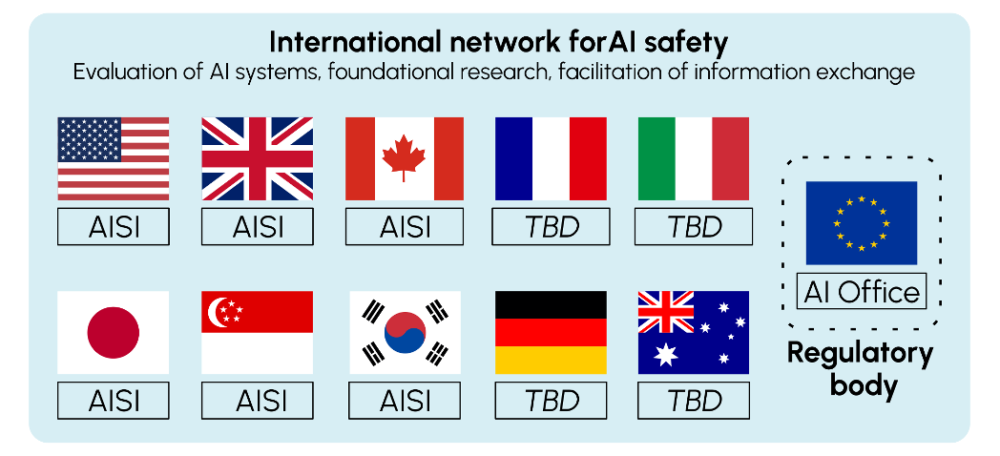
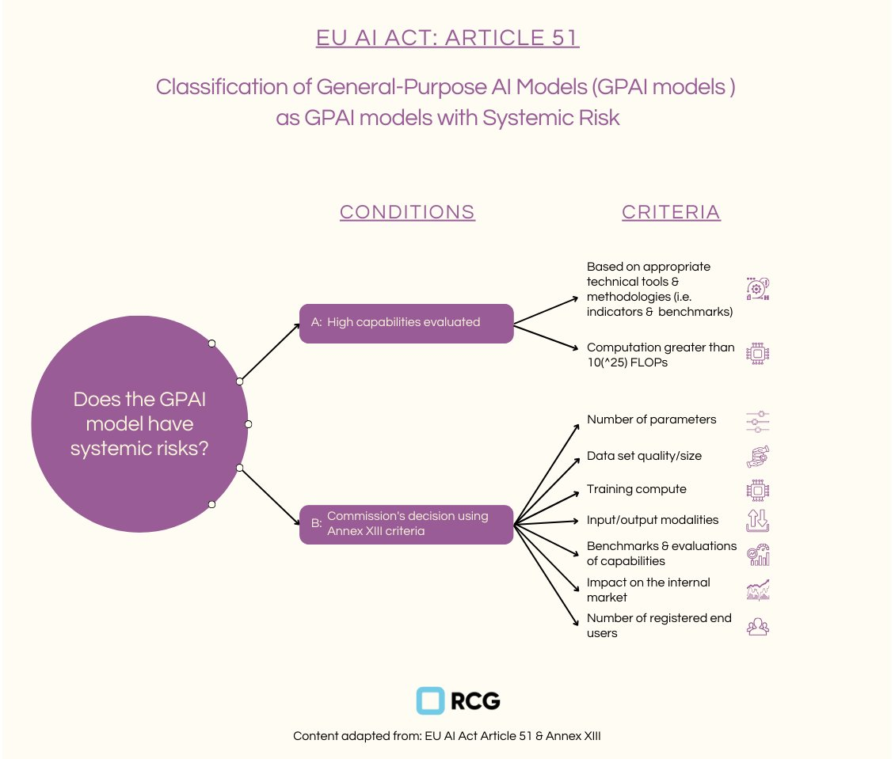
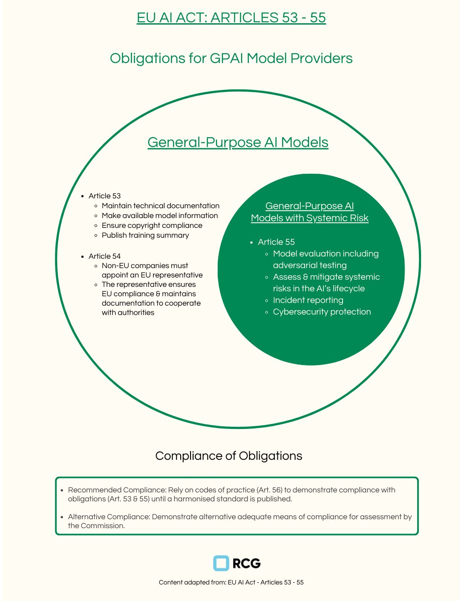
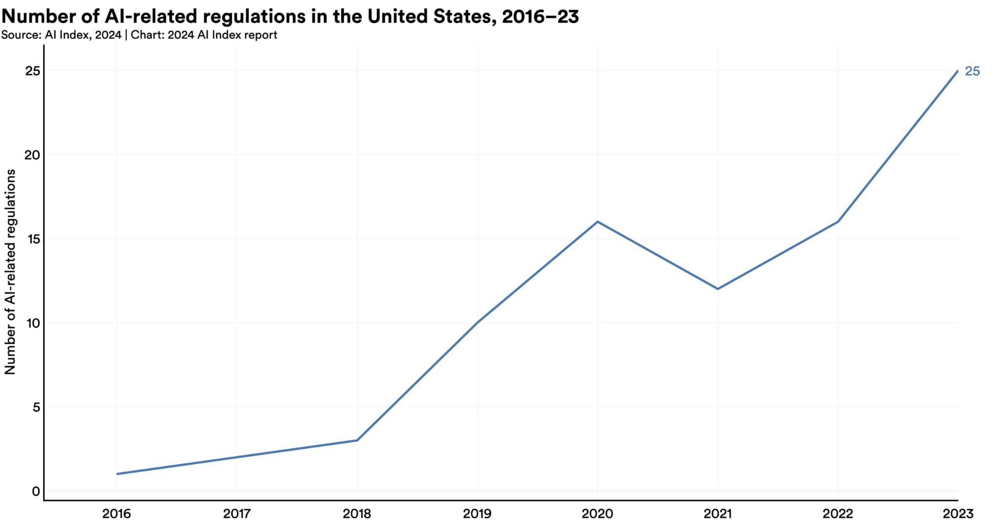

# 4.5 National Governance

    

        
            <i class="fas fa-clock"></i>
        
        

            
Reading Time

            
28 min

        

    

## 4.5.1 The need for national governance {: #01}

!!! quote "Zhang Jun (China's UN Ambassador)"

    "The potential impact of AI might exceed human cognitive boundaries. To ensure that this technology always benefits humanity, we must regulate the development of AI and prevent this technology from turning into a runaway wild horse [...] We need to strengthen the detection and evaluation of the entire lifecycle of AI, ensuring that mankind has the ability to press the pause button at critical moments."

While leading AI companies have implemented various self-regulatory measures to ensure the safe development of frontier AI systems, relying solely on corporate self-regulation is insufficient to protect national interests and public welfare. While such voluntary measures allow for rapid response to emerging issues and can often move faster than government regulation, companies may lack incentives to fully account for broader societal impacts, may face competitive pressures that compromise safety considerations, and may not have the legitimacy to make decisions that affect entire populations. National governance frameworks are therefore essential to ensure comprehensive oversight and accountability. A robust national regulatory framework needs to build on and complement these self-regulatory efforts. It should provide a baseline of standards that all companies must meet, while still allowing room for companies to go above and beyond in their internal practices.

Institutional Fit and the Challenge of Frontier AI - The concept of institutional fit—the degree to which governance institutions match the scale, scope, and characteristics of the problems they aim to address—is crucial for understanding why national governance of frontier AI is both necessary and challenging. Institutional fit helps us analyze whether existing regulatory bodies and frameworks are adequately equipped to handle the unique challenges posed by frontier AI systems, or whether new institutional arrangements are needed.

The governance of frontier AI systems presents a particular challenge for institutional fit. Unlike traditional technological governance challenges, frontier AI systems generate externalities that span multiple domains - from national security to economic stability, from social equity to democratic functioning. Traditional regulatory bodies, designed for narrower technological domains, may lack the necessary spatial remit, technical competence, or institutional authority to effectively govern these systems ([Dafoe, 2023](https://academic.oup.com/edited-volume/41989/chapter-abstract/408516484?redirectedFrom=fulltext&login=false)).

Consider the contrast with self-driving vehicles, where the primary externalities are relatively well-defined (safety of road users) and fall within existing regulatory frameworks (traffic safety agencies) ([Dafoe, 2023](https://academic.oup.com/edited-volume/41989/chapter-abstract/408516484?redirectedFrom=fulltext&login=false)). Frontier AI systems, by contrast, generate externalities that cross traditional regulatory boundaries and jurisdictions, requiring new institutional approaches.

Addressing Institutional Gaps - The governance of frontier AI reveals several institutional gaps in current regulatory frameworks ([Dafoe, 2023](https://academic.oup.com/edited-volume/41989/chapter-abstract/408516484?redirectedFrom=fulltext&login=false)). The expertise gap manifests in traditional regulatory bodies' frequent lack of technical expertise to evaluate advanced AI systems. This necessitates either the development of new technical capabilities within existing institutions, the creation of new specialized regulatory bodies, or novel partnerships between government and technical experts.

A coordination gap exists due to the cross-cutting nature of frontier AI externalities. New mechanisms are needed for coordination between different regulatory agencies, federal and state/local authorities, public and private sector entities, and domestic and international governance bodies.

The temporal gap emerges from the rapid pace of AI development, creating a mismatch with traditional regulatory processes. Governance frameworks must be adaptable to technological change, capable of anticipating future developments, and able to respond quickly to emerging risks.

Implementation Challenges - Several factors complicate the implementation of effective domestic governance. Political polarization can impede the development of consensus on governance approaches, particularly regarding the appropriate level of state oversight, balance between innovation and regulation, distribution of benefits and risks, and protection of civil liberties.

Technical complexity creates challenges for effective oversight and monitoring, development of appropriate standards, assessment of compliance, and risk evaluation and management.

The governance of frontier AI systems requires significant institutional innovation at the national level. While existing regulatory frameworks provide some foundation, the unique characteristics of frontier AI - its broad externalities, rapid development, and deep political implications - necessitate new approaches to governance. Success will require careful attention to institutional fit, stakeholder representation, and the balance between competing interests and values ([Dafoe, 2023](https://academic.oup.com/edited-volume/41989/chapter-abstract/408516484?redirectedFrom=fulltext&login=false)).

National governance is also more complex to create and maintain than self-regulatory efforts by companies because laws and regulations result from a sometimes long and complex policy-making process, which unfolds in distinct phases, each offering opportunities for governance interventions. During the agenda-setting phase, governance actors work to elevate specific AI-related issues to the forefront of public and political discourse. The formulation phase involves crafting detailed policy proposals, while implementation transforms these proposals into actionable measures. Throughout this cycle, evaluation and adaptation remain crucial, allowing governance approaches to evolve in response to the rapidly changing AI landscape.

The development of effective domestic governance frameworks for frontier AI is not merely a technical challenge but a fundamental political and institutional one. It requires building new capabilities while maintaining democratic legitimacy and balancing multiple competing interests. As AI capabilities continue to advance, the ability to develop and implement such frameworks will become increasingly crucial for national welfare and security.

## 4.5.2 Current initiatives {: #02}

### 4.5.2.1 AI Safety Institutes {: #02-01}

!!! quote "Rishi Sunak (Former UK Prime Minister)"

    "Get this wrong, and AI could make it easier to build chemical or biological weapons. Terrorist groups could use AI to spread fear and destruction on an even greater scale. Criminals could exploit AI for cyber-attacks, disinformation, fraud, or even child sexual abuse. And in the most unlikely but extreme cases, there is even the risk that humanity could lose control of AI completely through the kind of AI sometimes referred to as 'super intelligence'."

Governments worldwide have recognized an urgent need to understand and manage the capabilities and risks of advanced artificial intelligence systems. This has led to the formation of AI Safety Institutes (AISIs), specialized government bodies designed to evaluate, research, and coordinate efforts to ensure AI development proceeds safely and beneficially.

The Global Movement Toward AI Safety - In recent months, we've witnessed a remarkable surge in the establishment of AISIs across major technological powers. The United States, United Kingdom, Japan, Canada, and Singapore have all launched their own institutes, while the European Union has integrated these responsibilities into its AI Office through a dedicated AI Safety Unit.

<figure markdown="span">
{ loading=lazy }
  <figcaption markdown="1"><b>Figure 4.12:</b> Announced AI Safety Institutes ([Martinet & Variengien, 2024](https://oecd.ai/en/wonk/ai-safety-institutes-challenge))</figcaption>
</figure>

Core Functions of AI Safety Institutes - We can think of AISIs as serving three fundamental purposes, each building upon the others to create a comprehensive approach to AI safety. First, they evaluate AI systems through testing and assessment protocols. This involves developing new methodologies to understand these systems' capabilities, limitations, and potential impacts on society. Second, they can help conduct foundational research in AI safety, bringing together experts from various disciplines to advance our understanding of how to build and deploy AI systems safely. Finally, they serve as information exchange hubs, creating channels for sharing crucial insights among stakeholders, from policymakers to private companies.

International Coordination and Collaboration - AI Safety Institutes have been designed from the ground up to work together across borders. The culmination of this international vision was realized at the May 2024 Seoul AI Summit, where ten countries and the European Union established a network for AI safety.

Practical Challenges and Solutions - While the promise of international collaboration through AISIs is compelling, several practical challenges must be addressed. First, there's the delicate balance of sharing sensitive information about AI systems' capabilities while protecting commercial secrets and national security interests. Then there's the challenge of varying technical capacities between nations – not every country has equal resources to attract top AI talent or conduct sophisticated evaluations. Some institutes, like the UK's AISI, have taken innovative approaches to this challenge, such as opening offices in AI talent hubs like San Francisco.

Looking to the Future - As these institutes mature, they will likely play an increasingly important role in developing international standards, conducting evaluations, and ensuring that AI development proceeds in a way that benefits humanity while minimizing potential risks. Their success will depend not only on technical expertise but also on their ability to facilitate meaningful collaboration across borders and between different stakeholders in the AI ecosystem.

### 4.5.2.2 The EU AI Act {: #02-02}

The European Union's AI Act addresses General Purpose Artificial Intelligence (GPAI) models, and we’ll focus here on what the AI Act calls GPAI models with systemic risks - the equivalent of frontier AI models.

The Act takes a dual approach to identifying GPAI models that present systemic risk. First, there's a computational threshold: any model using more than 10^25 floating point operations (FLOPs) in its training is automatically classified as presenting systemic risk. To put this in perspective, training such a model currently requires an investment of tens of millions of Euros. However, computational power isn't the only consideration. The Commission can also designate models as systemic based on their potential impact, considering factors such as user base size, scalability potential, and the possibility of causing large-scale harm. This flexible approach ensures that regulation can adapt to emerging risks, even when they come from models that don't meet the computational threshold.

<figure markdown="span">
{ loading=lazy }
  <figcaption markdown="1"><b>Figure 4.13:</b> The EU AI Act: Classification of general-purpose AI models with systemic risks (source: [Observatorio de Riesgos Catastróficos Globales](https://www.orcg.info/articulos/infografas-ley-de-inteligencia-artificial-de-la-unin-europea))</figcaption>
</figure>

Provider Obligations and Compliance - Starting August 2, 2025, providers of GPAI models must meet various obligations, with additional requirements for those models deemed to present systemic risk. All GPAI providers must maintain detailed technical documentation and provide comprehensive information to downstream providers who integrate their models. They must also implement copyright compliance policies and publish summaries of their training data. For models with systemic risk, the requirements intensify. These providers must conduct thorough evaluations, including adversarial testing to identify potential vulnerabilities. They must also track and report serious incidents, implement robust cybersecurity protections, and actively work to assess and mitigate systemic risks.

<figure markdown="span">
{ loading=lazy }
  <figcaption markdown="1"><b>Figure 4.14:</b> The EU AI Act: Obligations for providers of general-purpose AI models ([Observatorio de Riesgos Catastróficos Globales](https://www.orcg.info/articulos/infografas-ley-de-inteligencia-artificial-de-la-unin-europea))</figcaption>
</figure>

Enforcement and the AI Office - The EU AI Act establishes the AI Office - who also acts as the EU’s AI Safety Institute - as a powerful enforcement authority. This office can request information, conduct model evaluations, and mandate corrective measures when necessary. The penalties for non-compliance are substantial – providers can face fines of up to 3% of their global annual turnover or €15 million, whichever is higher. This robust enforcement mechanism reflects the EU's commitment to ensuring that powerful AI systems are developed and deployed responsibly.

The Role of the Code of Practice - The Act introduces an innovative approach to compliance through its Code of Practice. While not mandatory, this code provides a practical pathway for providers to demonstrate their compliance with the Act's requirements.

### 4.5.2.3 The US Executive Order on AI {: #02-03}

The United States has seen a flurry of legislative activity in recent years. The Executive Order on AI, signed by president Joe Biden on October 30 in 2023 stands out. Its Section 4 represents one of the most wide-ranging extensions of regulatory visibility into AI development in the United States. It introduces safety and security measures that will shape the future of AI development in the United States.

<figure markdown="span">
{ loading=lazy }
  <figcaption markdown="1"><b>Figure 4.15:</b> Number of AI-related regulations in the United States, 2016-2023 ([2024 AI Index report](https://aiindex.stanford.edu/report/))</figcaption>
</figure>

New Reporting Requirements for AI Companies - The order establishes reporting requirements for companies involved in AI development. Companies developing dual-use foundation models - sophisticated AI models trained on broad datasets using self-supervision and containing tens of billions of parameters - must provide detailed reports about their activities. These reports must cover their training processes, security measures, model weights protection strategies, and results from red-team testing. Similarly, entities operating large-scale computing clusters must disclose their locations and total available computing power.

Infrastructure and Foreign Entity Regulations - A particularly interesting aspect of Section 4 involves new regulations for Infrastructure as a Service (IaaS) providers. These companies must now report when foreign entities use their services for AI training that could enable concerning activities. This requirement extends to foreign resellers of U.S. IaaS services, creating a comprehensive monitoring system for AI development infrastructure. The secretary of commerce must draft regulations requiring these providers to verify the identities of foreign persons obtaining IaaS accounts and establish minimum standards for verification and recordkeeping - essentially, a Know-Your-Customer framework.

## 4.5.3 Policy options {: #03}

A comprehensive domestic governance regime for AI safety requires three interconnected mechanisms: development of safety standards, regulatory visibility, and compliance enforcement ([Anderljung et al. 2023](https://arxiv.org/abs/2307.03718)). These components can work together to create a framework that can effectively manage the risks associated with AI development and deployment.

Mechanisms for developing safety standards - First and foremost, we need to establish processes for identifying appropriate requirements for frontier AI developers that can evolve with the technology. Safety standards form the foundation of AI governance by establishing clear, measurable criteria for the development, testing, and deployment of AI systems. These standards must be technically precise while remaining flexible enough to accommodate rapid technological advancement.

The development of AI safety standards typically involves multiple stakeholders, including technical experts, industry representatives, civil society organizations, and government agencies. Standards development organizations (SDOs) often serve as central coordinating bodies for this process. For example, the National Institute of Standards and Technology (NIST) in the United States has developed AI risk management frameworks that serve as voluntary standards.

Mechanisms for ensuring regulatory visibility - The second building block involves creating mechanisms for regulators to gain visibility into frontier AI development processes. This is crucial for staying ahead of potential risks and ensuring compliance with established standards. Regulatory visibility mechanisms enable oversight bodies to monitor AI development and deployment effectively. These mechanisms provide regulators with the information and access needed to assess compliance with safety standards and identify emerging risks.

Mechanisms for ensuring compliance - The third building block involves creating mechanisms to ensure compliance with safety standards for the development and deployment of frontier AI models. This is where the rubber meets the road in terms of enforcement. Compliance mechanisms transform safety standards from theoretical frameworks into practical requirements with real consequences. These mechanisms must balance the need for effective enforcement with the importance of not stifling innovation.

### 4.5.3.1 Mechanisms for developing safety standards {: #03-01}

Various approaches to developing safety standards exist, from traditional standardization bodies to more dynamic multi-stakeholder processes like the EU GPAI Code of Practice. This Code, currently under development, demonstrates the vital importance of the standardization process. While not a traditional standardization mechanism, it serves to specify the high-level obligations outlined in the EU AI Act for GPAI models.

The Act mandates that providers of GPAI models with systemic risks must "ensure an adequate level of cybersecurity protection for the general-purpose AI model with systemic risk and the physical infrastructure of the model." However, this broad requirement raises numerous critical questions: What constitutes an "adequate level" of protection? What exactly comprises the "physical infrastructure" and the "model"? What evidence sufficiently demonstrates their protection? Through what specific measures should this protection be implemented?

These questions highlight why standardization is essential - organizations need guidance to comply with their legal obligations effectively. Legal ambiguity, while it can sometimes be exploited by companies to their advantage, can also create significant operational challenges and risks for companies developing and deploying AI systems.

What needs to be standardized - the example of cybersecurity protection - Protection of key AI assets requires a layered security architecture that addresses distinct but interconnected vulnerabilities. Four critical components demand protection: model weights, source code, training data, and user data. Each represents a unique security challenge while forming part of an integrated system where a breach in one area could compromise the whole.

**Model Weights** Model weights are the result of extensive training processes, often requiring massive computational resources and proprietary datasets. For companies like OpenAI, Anthropic, or Google, these weights represent a large part of their competitive edge. If leaked, it could allow competitors or malicious actors to replicate their models, potentially removing safety measures or misusing them.

Protection starts with robust encryption of stored weights, complemented by strict access controls limiting internal visibility. Advanced security can also involve segmenting weights across multiple secure locations, making unauthorized access more difficult. Continuous monitoring watches for suspicious access patterns or unusual data transfers, enabling rapid response to potential breaches.

**Source Code** The source code defines how the model processes information, makes decisions, and generates outputs. For AI companies, this code represents years of research and development, often containing proprietary algorithms and architectures.

Protecting source code isn't a new challenge – software companies have been doing it for decades. However, the stakes are higher with frontier AI. A leak could not only benefit competitors but also potentially allow malicious actors to identify and exploit vulnerabilities in the AI system.

Comprehensive protection requires secure, access-controlled version control systems managing all code changes. Advanced techniques include code obfuscation to impede understanding if breached, combined with rigorous security audits and coding standards. Critical development could also occur on air-gapped systems, physically isolated from external networks to prevent unauthorized access.

**Training Data** The training data can include everything from public web pages to proprietary information and even personal data. The challenge here is twofold: protecting the data itself and ensuring it's used ethically. A breach could expose sensitive information, while misuse could lead to biased or harmful AI models.

Protection begins with thorough data anonymization, removing identifiable information without compromising training utility. Encrypted databases with strict access controls secure stored data, while comprehensive lineage tracking maintains clear records of data sources and usage patterns. This allows organizations to maintain both security and ethical compliance throughout the training process.

**User Data** This is perhaps the most regulated aspect of AI cybersecurity, falling under laws like GDPR in Europe or the Personal Information Protection Law in China. User data in AI systems can be particularly sensitive – people might share personal details, medical information, or business secrets when interacting with an AI assistant.

Protection can include end-to-end encryption securing data both in transit and storage, combined with strict data minimization principles to collect only essential information. User controls can provide transparent options for data management, including deletion rights and usage limitations.

**The Human Element: People as the Strongest (and Weakest) Link** People can be both the strongest defense and the biggest vulnerability. Human error remains one of the biggest risks in cybersecurity. A single misplaced click, a carelessly shared password, or a fall for a phishing scam can potentially compromise even the most sophisticated security system.

This is why leading AI labs invest heavily in security training for all employees, not just their tech teams. It's about creating a culture of security awareness, where everyone understands their role in protecting these valuable assets.

### 4.5.3.2 Mechanisms for ensuring regulatory visibility {: #03-02}

The Importance of External Scrutiny - As frontier AI systems become increasingly integrated into society and the economy, decisions about their training, deployment, and use will have far-reaching implications. It's crucial that these decisions are not left solely in the hands of AI developers.

External scrutiny – involving outside actors in the evaluation of AI systems through red-teaming, auditing, and external researcher access – offers a powerful tool for enhancing the safety and accountability of frontier AI.

To be effective, external scrutiny should adhere to the ASPIRE framework ([Anderljung et al. 2023](https://arxiv.org/abs/2311.14711)):

- Access: External scrutineers need appropriate access to the AI systems and relevant information.

- Searching attitude: Scrutineers should actively seek out potential issues and vulnerabilities.

- Proportionality to the risks: The level of scrutiny should be commensurate with the potential risks posed by the system.

- Independence: Scrutineers should be free from undue influence from the AI developers.

- Resources: Adequate resources must be allocated to support thorough scrutiny.

- Expertise: Scrutineers must possess the necessary technical and domain-specific expertise.

External scrutiny of AI systems can be structured in several ways, drawing from established practices in other regulated industries. One approach mirrors financial auditing, where certified professionals conduct standardized evaluations according to established protocols. This system can incorporate different levels of disclosure requirements, from basic safety testing to in-depth capability assessments. Some frameworks include external ethics boards within AI companies, though their authority and influence varies significantly. The effectiveness of these approaches often depends on how well they balance thorough oversight with the practical constraints of AI development timelines and resource limitations.

Responsible Reporting - One crucial aspect of both self-regulation and government oversight is the implementation of responsible reporting mechanisms. Organizations developing and deploying frontier AI systems have unique access to information about these systems' capabilities and potential risks. By sharing this information responsibly, they can significantly improve our collective ability to manage AI risks ([Kolt et al. 2024](https://arxiv.org/abs/2404.02675)).

Let's break down what responsible reporting might look like in practice:

**What to Report** - Unexpected or potentially dangerous emergent capabilities

- Near-misses or safety incidents during development or deployment

- Significant breakthroughs in model performance or capabilities

- Observed misuse or attempted misuse of deployed models

**Who to Report To** - Relevant regulatory bodies

- Industry consortiums focused on AI safety

- Academic researchers working on AI alignment and safety

- The wider public

**How to Report** - Through secure, standardized reporting channels

- With appropriate protections for intellectual property and sensitive information

- In a timely manner, especially for urgent safety concerns

Different information sharing systems address the inherent tension between transparency needs and business interests in varying ways. Some approaches use tiered architectures that adapt disclosure levels to different stakeholder needs - regulators might receive detailed technical information while public disclosures remain more general. Other systems emphasize anonymization mechanisms that allow sharing of aggregate data while protecting individual company details. Legal frameworks sometimes include provisions to encourage honest reporting, such as liability protections for good faith disclosures.

Model registries - At its core, a model registry is a centralized database where information about AI models is recorded and tracked. It works like a birth certificate – when a model is deployed, its creators file some paperwork.

But what exactly goes into this paperwork? Different jurisdictions are taking different approaches, but model documentation typically encompasses several layers of information. Basic documentation often includes model identification and intended use cases, while technical specifications detail architecture, parameters, and computational requirements. Performance documentation can range from standard benchmark results to specialized evaluations of specific capabilities or risks. Impact assessments might examine potential societal effects, safety implications, and ethical considerations. Deployment documentation usually covers implementation strategies and monitoring plans.

The idea is that by collecting this information, regulators can keep tabs on the AI landscape, identify potential risks before they become problems, and have a foundation for more targeted governance down the line.

**Why Model Registries Matter** Model registries can serve multiple roles in AI governance systems. As transparency mechanisms, they enable various degrees of independent scrutiny and public visibility and trust into AI development. Some registries function as early warning systems for emerging capabilities or risks, allowing for preemptive response to potential concerns - if a model is registered with capabilities that raise red flags, regulators can step in before it's widely deployed. The accumulated data can inform policy development by providing empirical evidence about AI system characteristics and trends. Instead of broad, one-size-fits-all rules, they can tailor their approach based on the specific capabilities and risks of different models. Finally, in contexts where AI capabilities have strategic significance, registries can help governments keep track of who's developing what, potentially informing export controls or other national security measures.

Governments around the world have already started to implement model registries. The U.S., for example, has taken a relatively light-touch approach so far, focusing primarily on the most advanced AI models. In October 2023, President Biden signed an Executive Order on AI that included provisions for a model registry. The United States has adopted an initially targeted approach to model registration, focusing oversight on the most advanced AI systems while maintaining flexibility for future expansion. This strategy, formalized in the October 2023 Executive Order, establishes clear compute-based thresholds for registration requirements. Systems exceeding 10^26 floating point operations in training must provide comprehensive documentation of their capabilities and limitations. They also need to disclose measures taken to protect their models from unauthorized access or theft.

China has taken yet another approach, focusing on algorithmic recommendation systems rather than AI models per se. Their Internet Information Service Algorithmic Recommendation Management Provisions, which came into effect in 2022, target systems based on their potential influence on public discourse and social behavior. This framework requires detailed registration of algorithms used across various digital platforms, with particular emphasis on algorithms with "public opinion properties" or "social mobilization capabilities.". Companies must disclose not just technical details but also the underlying principles and intended purposes of their algorithms, creating transparency around both capabilities and intentions.

**Challenges** As you might imagine, the implementation of model registries hasn't been without its challenges:

1. Defining the Scope: One of the biggest challenges is determining which models should be subject to registration requirements. Set the bar too low, and you risk stifling innovation with excessive bureaucracy. Set it too high, and you might miss potentially risky systems.

2. Protecting Intellectual Property: AI companies invest enormous resources in developing their models and are understandably reluctant to share too much detail about their inner workings. Striking a balance between transparency and IP protection is a delicate act.

3. Enforcement and Compliance: How do you ensure companies actually comply with registration requirements? And what are the consequences for non-compliance?

A Know Your Customer regime for AI - In the financial sector, banks are required to implement Know Your Customer (KYC) schemes to identify and verify client identities. This helps prevent money laundering and other financial crimes. Similarly, we could implement a KYC scheme for frontier AI ([Egan & Heim 2023](https://www.governance.ai/research-paper/oversight-for-frontier-ai-through-kyc-scheme-for-compute-providers)). Under this scheme, compute providers would be required to implement KYC-like processes for their clients developing frontier AI models. If a company suddenly starts using an unusually large amount of compute power, this could trigger a reporting requirement. The compute provider would need to gather information about the nature of the project and report it to the relevant regulatory body.

This approach provides early warning of potentially problematic or sudden advancements in AI capabilities. It allows for nuanced and targeted export controls. It also offers more precise control over compute quantities and the flexibility to suspend access if necessary.

Implementing this regime would involve establishing a dynamic threshold of compute that effectively captures high-risk frontier model development, setting clear requirements for compute providers to keep records and report high-risk entities, and creating a government capacity to co-design, implement, administer, and enforce the scheme.

Incident reporting - AI incident reporting is a process where developers, companies, and sometimes even users report significant issues, near-misses, or incidents related to AI systems. These could range from privacy breaches and security vulnerabilities to unexpected biases in decision-making or large-scale material or human harms.

Incident reporting frameworks foster information-sharing about what went wrong (or almost went wrong), and thus creates a feedback loop that helps companies improve their systems and prevent similar issues in the future.

<figure class="iframe-figure" markdown="span">
<iframe src="https://ourworldindata.org/grapher/annual-reported-ai-incidents-controversies?tab=chart" loading="lazy" style="width: 100%; height: 600px; border: 0px none;" allow="web-share; clipboard-write"></iframe>
  <figcaption markdown="1"><b>Interactive Figure 4.7:</b> Global annual number of reported artificial intelligence incidents and controversies ([Giattino et al., 2023](https://ourworldindata.org/artificial-intelligence))</figcaption>
</figure>

**Learning from Other Industries: Aviation Safety** The Aviation Safety Reporting System (ASRS) in the United States is often held up as a gold standard for incident reporting ([Cheng 2024](https://www.convergenceanalysis.org/ai-regulatory-landscape/ai-incident-reporting)). It's confidential, voluntary, and – crucially – non-punitive. This means that pilots, air traffic controllers, and other aviation professionals can report near-misses or safety concerns without fear of repercussions. The results speak for themselves: since the ASRS was implemented, aviation fatalities have plummeted.

This approach has fostered a culture of openness that enables continuous improvement through comprehensive data collection on near-misses and potential risks. The system's success stems from its focus on identifying systemic issues rather than assigning individual blame, creating a model that could be adapted for AI safety.

AI presents unique challenges that make incident reporting particularly tricky ([Farrell 2024](https://www.pourdemain.ngo/fr/post/learning-from-history-gpai-serious-incident-reporting-2)):

1. Defining an "incident": In aviation, it is clear what constitutes an incident or near-miss. But with AI, the lines can be blurry. Is an AI chatbot giving misleading information an incident? What about subtle algorithmic bias? Clear, agreed-upon definitions are needed to ensure the viability of incident reporting systems ([OECD 2024](https://www.oecd.org/en/publications/2024/05/defining-ai-incidents-and-related-terms_88d089ec.html)).

2. Attribution and responsibility: AI systems often involve multiple stakeholders – developers, data providers, platform operators, and end-users. Determining who's responsible for reporting an incident (and potentially facing consequences) is not always straightforward.

3. Proprietary concerns: Companies invest millions in developing cutting-edge AI. They're understandably wary of sharing too much information about their systems.

**Towards a Comprehensive AI Incident Reporting Framework** Implementing such a framework requires careful design to balance multiple competing needs ([Farrell, 2024](https://www.pourdemain.ngo/fr/post/learning-from-history-gpai-serious-incident-reporting-2)). The foundation must be built on precise, tiered definitions of incidents ranging from minor technical issues to catastrophic failures. This classification system would support a dual-channel reporting structure: mandatory reporting for severe incidents causing significant harm, and confidential channels for near-misses and minor incidents, providing a way for AI professionals to report concerns and minor incidents without fear of repercussions, potentially managed by a neutral third party to ensure confidentiality. The framework's effectiveness depends on standardized reporting formats that facilitate analysis while enabling rapid dissemination of critical information. This might include fields for system specifications, incident description, root cause analysis, and mitigation steps taken. Throughout the system, careful balance must be maintained between public transparency and commercial sensitivity to ensure both broad learning and continued industry participation.

### 4.5.3.3 Mechanisms for ensuring compliance {: #03-03}

Licensing regime - One approach to compliance enforcement could be to implement a licensing regime for frontier AI models, similar to how nuclear power plants or pharmaceutical companies must be licensed to operate. Under this system, companies developing frontier AI models would need to obtain a license by demonstrating compliance with established safety standards.

This process would integrate detailed technical documentation requirements with ways to demonstrate the implementation of required safety measures (e.g. through a safety case, see [Buhl et al. 2024](https://arxiv.org/abs/2410.21572)), creating a continuous cycle of compliance and verification. Regular audits and inspections would ensure ongoing adherence to safety standards.

Another, complementary approach could be to grant enforcement powers to supervisory authorities. These authorities would have the power to conduct investigations, issue fines for non-compliance, and even halt the development or deployment of models deemed too risky. Let’s say a company is found to be developing a frontier AI model without implementing the required safety protocols. The supervisory authority could issue a cease-and-desist order, requiring the company to halt development until they can demonstrate compliance with safety standards.

Governing effectively often requires looking to other domains that have grappled with similar regulatory challenges. One particularly relevant example is the Federal Select Agent Program (FSAP) in the biosecurity domain ([Anderson-Samways 2023](https://www.iaps.ai/research/federal-select-agent-program)).

The FSAP was established to regulate the possession, use, and transfer of biological select agents and toxins that could pose a severe threat to public health and safety. Like frontier AI, the biosecurity field deals with rapidly evolving technologies, potentially severe risks, and the need to balance safety concerns with scientific progress.

The FSAP employs a sophisticated risk-based regulatory system that begins during the research and development phase. Rather than waiting until biological agents are ready for use, the program requires registration and licensing early in the process - a model particularly relevant for AI governance, where early intervention may be crucial for managing risks.

Through continuous monitoring and regular inspections, the FSAP maintains ongoing visibility into research activities, enabling quick responses to evolving risks. This is complemented by a tiered regulatory framework that applies different levels of oversight based on an agent's risk profile. Such an approach could be particularly valuable for AI governance, where the vast spectrum of AI systems demands varying levels of scrutiny. The most powerful models would face stringent controls, while less capable systems could operate under lighter oversight, creating an efficient allocation of regulatory resources.

However, the FSAP also offers cautionary tales. Its reliance on checklist-based compliance in some areas has been criticized for potentially missing novel risks. This underscores the importance of maintaining a flexible, adaptive approach in AI governance.

### 4.5.3.4 The Architecture of AI Regulations {: #03-04}

Creating AI-specific laws or relying on existing sectoral frameworks

<figure markdown="span">
{ loading=lazy }
  <figcaption markdown="1"><b>Figure 4.16:</b> ([State of AI report, 2023](https://www.stateof.ai/))</figcaption>
</figure>

**Ex ante and ex post measures** A key consideration in AI governance is the balance between ex ante and ex post measures. Ex ante governance focuses on preemptive actions, setting rules and guidelines before potentially harmful AI systems are developed or deployed. This approach is particularly relevant for frontier AI, where the stakes are high and the potential for irreversible harm exists. Ex post governance, conversely, deals with the consequences of AI deployment, including liability frameworks and remediation measures. Effective AI governance requires a judicious mix of both approaches, anticipating potential issues while remaining flexible enough to address unforeseen challenges.

**Vertical vs horizontal governance** The scope of governance measures also varies, with some targeting specific sectors (vertical regulation) and others applying broadly across multiple domains (horizontal regulation). Vertical approaches might focus on AI applications in healthcare or finance, tailoring governance to the unique challenges of each sector. Horizontal measures, such as data protection regulations or algorithmic transparency requirements, cut across sectors to address overarching concerns.

No single function or lever can adequately address the multifaceted challenges posed by frontier AI. Instead, effective governance requires a carefully orchestrated interplay of various mechanisms, adapting to the evolving capabilities of AI systems and the shifting societal and ethical landscapes they inhabit.