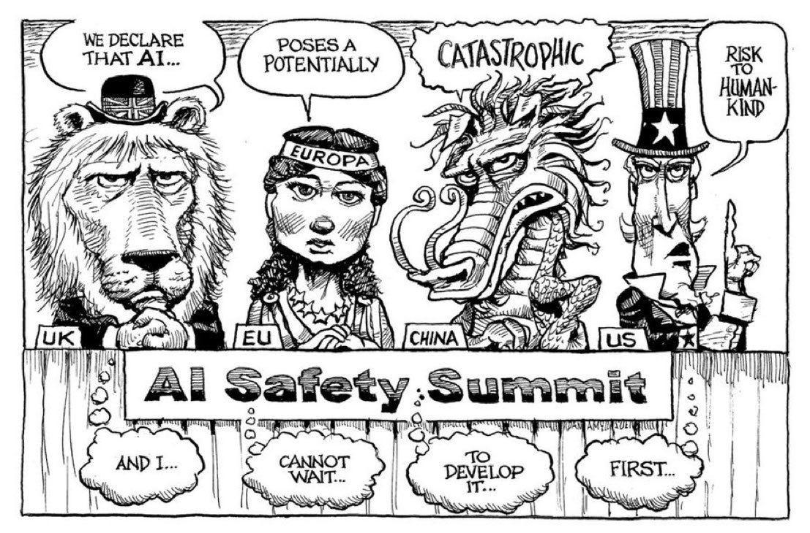

# 4.6 International Governance

    

        
            <i class="fas fa-clock"></i>
        
        

            
Reading Time

            
31 min

        

    

## 4.6.1 The need for international governance {: #01}

!!! quote "António Guterres (UN Secretary-General)"

    "AI poses a long-term global risk. Even its own designers have no idea where their breakthrough may lead. I urge [the UN Security Council] to approach this technology with a sense of urgency [...] Its creators themselves have warned that much bigger, potentially catastrophic and existential risks lie ahead."

Can't individual countries just regulate AI within their own borders? The short answer is: no, not effectively.

There are several reasons why domestic governance alone is insufficient:

1. No monopoly on development: No single country has a monopoly on AI development. Even if the United States, for example, were to implement stringent regulations, AI developers in countries with laxer standards could still potentially create and deploy dangerous AI systems that could affect the entire world.

2. Global impact: The potential risks of advanced AI - from large-scale cyberattacks to economic disruption - are inherently global in nature. As James Cleverly, the UK Foreign Secretary, put it when discussing China’s participation in the Bletchley AI Safety summit: "We cannot keep the UK public safe from the risks of AI if we exclude one of the leading nations in AI tech."

3. Race to the bottom: Without international coordination, countries may be reluctant to implement strict regulations unilaterally, fearing that they'll be left behind in the AI race. This can lead to a "race to the bottom" in terms of safety standards. International governance can help align incentives between nations, encouraging responsible AI development without forcing any one country to sacrifice its competitive edge.

<figure class="iframe-figure" markdown="span">
<iframe src="https://ourworldindata.org/grapher/cumulative-number-of-large-scale-ai-systems-by-country?tab=chart" loading="lazy" style="width: 100%; height: 600px; border: 0px none;" allow="web-share; clipboard-write"></iframe>
  <figcaption markdown="1"><b>Interactive Figure 4.8:</b> Cumulative number of large-scale AI systems by country ([Giattino et al., 2023](https://ourworldindata.org/artificial-intelligence))</figcaption>
</figure>

## 4.6.2 Current initiatives {: #02}

### 4.6.2.1 Global Impacts of National Regulations {: #02-01}

!!! quote "Kamala Harris (Former US Vice President)"

    "[...] just as AI has the potential to do profound good, it also has the potential to cause profound harm. From AI-enabled cyberattacks at a scale beyond anything we have seen before to AI-formulated bio-weapons that could endanger the lives of millions, these threats are often referred to as the "existential threats of AI" because, of course, they could endanger the very existence of humanity. These threats, without question, are profound, and they demand global action."

The inherently global nature of technology development means that national policies can have far-reaching effects.

Even immigration policy is important:

<figure markdown="span">
{ loading=lazy }
  <figcaption markdown="1"><b>Figure 4.17:</b> What are the career paths of top-tier AI researchers? (source: [MacroPolo](https://macropolo.org/digital-projects/the-global-ai-talent-tracker/))</figcaption>
</figure>

For example, the United States’ Executive Order on AI imposes reporting obligations on cloud providers, and export controls aimed at limiting China's access to advanced AI technologies. These actions, while originating from a single nation, have global implications.

Similarly, the European Union's AI Act is poised to have an impact far beyond the EU's 27 member states. Companies worldwide, eager to maintain access to the lucrative European market, often find it more cost-effective to adopt EU standards across their entire operations rather than maintaining separate standards for different regions.

For example, a U.S. tech company developing a new AI-powered facial recognition system for use in public spaces may see this system being classified as “high-risk” under the EU AI Act. This would subject it to strict requirements around data quality, documentation, human oversight, and more. Companies then have a choice to make: develop two separate versions of your product – one for the EU market and one for everywhere else – or simply simply apply the EU standards globally. Many will be tempted to choose the second option, to minimize their cost of compliance. This illustrates what's known as the “Brussels Effect” ([Bradford 2020](https://scholarship.law.columbia.edu/books/232/)): EU regulations can end up shaping global markets, even in countries where those regulations don't formally apply.

The Brussels Effect can manifest in two ways ([Siegmann & Anderljung 2022](https://www.governance.ai/research-paper/brussels-effect-ai)):

1. De facto: Companies voluntarily adopt EU standards globally to avoid the complexity and cost of maintaining different standards for different markets.

2. De jure: Other countries adopt regulations similar to the EU's, either to maintain regulatory alignment or because they view the EU's approach as a model to emulate.

For frontier AI, the Brussels Effect could be particularly significant. The EU's regulations might offer the first widely-adopted and mandated operationalization of concepts like "risk management" or "systemic risk" in the context of frontier AI. As other countries grapple with how to regulate advanced AI systems, they may look to the EU's framework as a starting point.

!!! quote "Ursula von der Leyen (Head of EU Executive Branch)"

    "[We] should not underestimate the real threats coming from AI [...] It is moving faster than even its developers anticipated [...] We have a narrowing window of opportunity to guide this technology responsibly."

### 4.6.2.2 International initiatives {: #02-02}

!!! quote "Sam Altman (Co-Founder and CEO of OpenAI)"

    "[Suggesting about how to ask for a global regulatory body:] "any compute cluster above a certain extremely high-power threshold – and given the cost here, we're talking maybe five in the world, something like that – any cluster like that has to submit to the equivalent of international weapons inspectors" […] I did a big trip around the world this year, and talked to heads of state in many of the countries that would need to participate in this, and there was almost universal support for it."

<figure markdown="span">
{ loading=lazy }
  <figcaption markdown="1"><b>Figure 4.18:</b> The global ai governance landscape</figcaption>
</figure>

But it's not just individual nations taking action. A patchwork of international initiatives has emerged to address the governance of AI on a global scale:

- **The AI Safety Summit** : Held in the UK in 2023, this event brought together 28 nations and the EU to discuss AI safety. It resulted in the Bletchley Declaration, established AI Safety Institutes, and set the stage for future summits.

- **The Hiroshima AI Process** : Launched by the G7 nations, this initiative aims to promote responsible AI development and use.

- **United Nations efforts** : The UN is working on a report due in mid-2024 that will examine international institutions for AI governance.

- **OECD guidelines** : The Organisation for Economic Co-operation and Development has been particularly influential in shaping AI governance principles.

- **Council of Europe AI treaty** : This proposed treaty aims to protect human rights in the context of AI development and use.

- **China's Global AI Governance Initiative** : Demonstrating that AI governance is a priority even for nations often at odds with Western powers, China has put forth its own proposal for international AI governance.

<figure markdown="span">
{ loading=lazy }
  <figcaption markdown="1"><b>Figure 4.19:</b> Cartoon highlighting a discrepancy between countries’ statements and their true intentions in the context of the U.K.’s november 2023 AI Safety Summit ([The Economist](https://www.economist.com/the-world-this-week/2023/11/02/kals-cartoon))</figcaption>
</figure>

### 4.6.2.3 Stages of International Policymaking {: #02-03}

International policymaking typically progresses through several stages ([Badie et al., 2011](https://sk.sagepub.com/ency/edvol/intlpoliticalscience/chpt/stages-model-policy-making)):

1. Agenda setting: Identifying the issue and getting it on the international agenda.

2. Policy formulation: Developing potential solutions and approaches.

3. Decision making: Choosing a course of action.

4. Implementation: Putting the chosen policy into practice.

5. Evaluation: Assessing the effectiveness of the policy and making adjustments as needed.

In the case of AI governance, we're still largely in the early stages of this process. The AI Safety Summit, for instance, represents a crucial step in agenda setting and initial policy formulation. But the real work of crafting binding international agreements and implementing them still lies ahead.

## 4.6.3 Policy options {: #03}

**Institutional Models.** Various institutional arrangements could support international AI governance, from scientific consensus-building bodies to emergency response networks. These range from lighter-touch coordination mechanisms to more comprehensive frameworks for standard-setting and enforcement.

**Non-proliferation.** Drawing from nuclear weapons control strategies, non-proliferation approaches aim to limit access to advanced AI systems and critical resources like specialized chips. While these measures can help slow dangerous proliferation, they face significant challenges around enforcement and potential counterproductive effects on innovation.

**Regulatory Agreements.** International regulatory frameworks offer a collaborative path forward, where countries agree to develop AI safely and verify compliance through monitoring at the model, organizational, and jurisdictional levels. The jurisdictional certification approach provides one concrete model, leveraging market access as an incentive for participation.

**Containment.** For those concerned about catastrophic risks, more dramatic measures like the MAGIC plan propose centralizing advanced AI development in a single international facility. While politically challenging, historical precedents like early nuclear weapons control proposals suggest such radical approaches shouldn't be dismissed entirely.

### 4.6.3.1 Institutional Models for International AI Governance {: #03-01}

As the international community grapples with how to govern frontier AI, a variety of institutional models have been proposed ([Maas & Villalobos 2024](https://papers.ssrn.com/sol3/papers.cfm?abstract_id=4579773)):

- **Scientific Consensus-Building** : The Intergovernmental Panel on Climate Change (IPCC) was tasked with informing governments about the state of knowledge of climate change and its effects. A similar body could provide regular reports on AI capabilities and risks to policymakers and the public. Given the rapid pace of AI development, this body would need to be nimbler than traditional scientific consensus-building organizations.

- **Political Consensus-Building and Norm-Setting** : Building on scientific consensus, we might envision a forum for political leaders to discuss AI governance issues and develop shared norms and principles. This could take the form of an AI-focused analogue to the United Nations Framework Convention on Climate Change (UNFCCC). Such a body could facilitate ongoing dialogue, negotiate agreements, and adapt governance approaches as the technology evolves.

- **Coordination of Policy and Regulation** : As countries develop their own AI regulations, there's a risk of a fragmented global landscape that could hinder innovation and create regulatory arbitrage opportunities. An international body focused on policy coordination could help address this challenge. Such an institution could work to harmonize AI regulations across countries, perhaps starting with areas of broad consensus and gradually tackling more contentious issues.

- **Enforcement of Standards and Restrictions** : For any international AI governance regime to be effective, there needs to be a mechanism for monitoring compliance and enforcing agreed-upon standards. This is where proposals like the jurisdictional certification approach discussed above come into play.

- **Stabilization and Emergency Response** : As we've discussed, the potential for "normal accidents" in AI systems is a serious concern. An international body focused on AI stability and emergency response could play a crucial role in mitigating these risks. This could consist in a global network of companies, experts and regulators, ready to assist in case of a major AI system failure or unexpected behavior. This group could also work proactively to identify potential vulnerabilities in global AI infrastructure and develop contingency plans. The International Atomic Energy Agency's Incident and Emergency Centre provides a potential model for this type of institution. However, given the potential speed of AI-related incidents, this body would need to operate on much faster timescales.

- **International Joint Research** : Collaborative international research could play a key role in ensuring that frontier AI development prioritizes safety and beneficial outcomes for humanity. An institution dedicated to facilitating such research could help pool resources, share knowledge, and ensure that safety considerations are at the forefront of AI development. CERN, the European Organization for Nuclear Research, offers one example for how such collaboration could work.

- **Distribution of Benefits and Access** : As frontier AI systems become more powerful, ensuring equitable access to their benefits will be crucial. An international institution focused on this challenge could work to prevent a harmful concentration of AI capabilities and ensure that the technology's benefits are widely distributed. This body might manage a global fund for AI development assistance, help facilitate technology transfers, or work to ensure that AI systems are developed with diverse global perspectives in mind.

!!! note "Learning from Nuclear Arms Control: Three Lessons for AI Governance"

    As we contemplate how to govern frontier AI on a global scale, it's instructive to look at how the international community has handled other powerful, potentially destructive technologies. Nuclear weapons provide a particularly relevant case study.

    At first glance, nuclear weapons and AI might seem like very different technologies. One is a physical weapon of mass destruction, the other a general-purpose technology with immensely varied applications. But both share key characteristics: they're dual-use technologies with both civilian and military applications, and they have the potential to dramatically alter the global balance of power and pose significant risks.

    So, what can we learn from decades of nuclear arms control efforts? Let's consider three key lessons ([Maas 2019](https://www.tandfonline.com/doi/abs/10.1080/13523260.2019.1576464)):

    **The Power of Norms and Institutions** In the early days of the nuclear age, many feared that nuclear weapons would proliferate rapidly, leading to widespread use. Yet today, nearly 80 years after the first nuclear detonation, only nine countries possess nuclear weapons, and they've never been used in conflict since World War II.

    This outcome was the result of a taboo and concerted efforts to build global norms against nuclear proliferation and use. The Nuclear Non-Proliferation Treaty (NPT), signed in 1968, created a framework for preventing the spread of nuclear weapons while promoting peaceful uses of nuclear technology. We might envision similar norm-building efforts for AI.

    **The Role of Epistemic Communities** The development of nuclear arms control agreements wasn't solely the work of diplomats and politicians. It relied heavily on input from scientists, engineers, and other technical experts who understood the technology and its implications.

    These experts formed what political scientists call an "epistemic community" – a network of professionals with recognized expertise in a particular domain. They played a crucial role in shaping policy debates, providing technical advice, and even serving as back-channel diplomats during tense periods of the Cold War.

    One challenge to leveraging such networks for global AI governance will be ensuring that epistemic communities can effectively inform policy decisions. Unlike nuclear physicists, who were often employed directly by governments, many AI experts work in the private sector.

    **The Persistent Challenge of "Normal Accidents"** Despite decades of careful management, the nuclear age has seen several close calls – incidents where human error, technical malfunctions, or misunderstandings nearly led to catastrophe. Sociologist Charles Perrow termed these "normal accidents," arguing that in complex, tightly-coupled systems, such incidents are inevitable.

    Applying the concept to AI, we could see unexpected interactions and cascading failures increase as AI systems become more complex and interconnected. Moreover, the speed at which AI systems operate could mean that a "normal accident" in AI might unfold too quickly for human intervention.

    This reality challenges the notion of "meaningful human control" often proposed as a safeguard for AI systems. While human oversight is crucial, we must also design governance systems that are robust to the possibility of rapid, unexpected failures.

### 4.6.3.2 Non-proliferation {: #03-02}

!!! quote "Demis Hassabis (Co-Founder and CEO of DeepMind)"

    "We must take the risks of AI as seriously as other major global challenges, like climate change. It took the international community too long to coordinate an effective global response to this, and we're living with the consequences of that now. We can't afford the same delay with AI [...] then maybe there's some kind of equivalent one day of the IAEA, which actually audits these things."

Non-proliferation, a term most commonly associated with nuclear weapons, refers to efforts to prevent the spread of dangerous technologies or materials.

In the context of AI, non-proliferation strategies aim to limit or control access to potentially dangerous AI systems or to the resources (like advanced computer chips) needed to develop them. This approach can be applied at both the national and international levels.

At the national level, this might mean only allowing companies with robust risk management procedures to access large-scale computing resources or training data. Internationally, it could involve preventing countries that lack adequate AI safety regulations from acquiring advanced AI capabilities.

This approach can help slow the spread of potentially dangerous AI technologies, giving responsible AI labs more time to develop safety methods and defensive technologies. It allows for a "pick a champion" strategy, where support is concentrated on responsible actors who are more likely to develop AI in a safe and beneficial manner.

<figure markdown="span">
{ loading=lazy }
  <figcaption markdown="1"><b>Figure 4.20:</b> Map Of BIS Country Group determinations ([Rhodium Group](https://rhg.com/research/all-in/))</figcaption>
</figure>

BIS is the “Bureau of Industry and Security”, an entity within the US Department of Commerce in charge of export control policy. Depending on which category a country belongs to, it will have easier (in blue) or harder (in yellow and orange) access to US-made chips and chip-making equipment.

Non-proliferation strategies in AI can take several forms:

1. **Unilateral prevention** : This involves a country or group of countries taking steps to prevent other actors from acquiring AI models or key AI inputs. This could be applied to entire countries, specific entities like terrorist groups, or individual labs that don't meet certain safety standards.

2. **Protection against theft** : This strategy focuses on safeguarding AI models and technologies against stealing and unwanted tech transfer. Methods might include enhanced information security measures, security clearances for AI researchers, and strict controls on the sharing of sensitive AI research.

3. **Collaborative prevention** : This approach involves countries working together to prevent proliferation, primarily to non-state actors but potentially to other states as well. An example of this could be a compute reporting regime, where cloud providers collect and share information about large-scale compute usage with regulators, who then share this information internationally to raise awareness of unwanted AI development activities.

**Non-Proliferation in Action: U.S. Export Controls Towards China** A real-world example of non-proliferation strategies in AI is the United States' implementation of export controls targeting China's AI development capabilities ([Allen 2022](https://www.csis.org/analysis/choking-chinas-access-future-ai)). Since October 2022, the U.S. has been working to block China's access to high-end chips from the U.S. and other countries, chip design software, semiconductor manufacturing equipment (SME), and even components required for producing SME.

These controls are being enforced with the cooperation of the Netherlands and Japan, who control key nodes in the global semiconductor supply chain.

It's important to note that these export controls aren't primarily about AI safety or even direct misuse of AI. They seem to be largely motivated by concerns about the use of advanced chips in weapons systems and a desire to prevent China from gaining economic (and thus geopolitical) dominance through AI.

While this is currently a unilateral policy, it has the potential to evolve into a bilateral or even multilateral arrangement through the implementation of verification mechanisms, such as through audits and inspections, which could be used to determine which companies might be added to a “white list” and thus allowed to receive advanced chips ([NCUSCR 2023](https://www.ncuscr.org/wp-content/uploads/2023/05/DE-Fall2022-final-CA-23-05-05-English.pdf)).

**Non-Proliferation: Limitations and Challenges** Non-proliferation strategies in AI governance face complex challenges that stem from both technical and geopolitical realities. Historical evidence suggests these measures can produce unintended consequences that undermine their effectiveness. The U.S. experience with satellite technology export controls in the 1990s serves as a cautionary tale - restrictive policies led to a dramatic decline in U.S. market share from 73% to 25% over a decade, while simultaneously accelerating Chinese domestic capability development ([Hwang & Weinstein 2022](https://cset.georgetown.edu/publication/decoupling-in-strategic-technologies/)).

The technical landscape presents additional complications. Ongoing improvements in AI efficiency threaten to erode the effectiveness of compute-based controls as a governance mechanism ([Pilz et al. 2023](https://arxiv.org/abs/2311.15377)). Even assuming that compute-based controls remain relevant, it can be challenging to determine in advance which states will behave responsibly (for example by implementing adequate AI safety measures), making it hard to decide where to apply non-proliferation measures. Rather than preventing proliferation, restrictive measures can sometimes catalyze development races, as evidenced by China's response to U.S. export controls through increased domestic AI investments and reciprocal control measures.

These practical challenges intersect with important moral considerations. Non-proliferation strategies often face criticism for their potentially discriminatory impact on technological and economic development across different nations. This perceived inequity can generate significant backlash, potentially undermining international cooperation necessary for effective AI governance. The challenge lies in developing approaches that can effectively manage proliferation risks while maintaining fairness and avoiding counterproductive outcomes in the global AI landscape.

### 4.6.3.3 Regulatory agreements {: #03-03}

Given the limitations of unilateral non-proliferation strategies, many experts argue for a more collaborative approach through international regulatory agreements. The basic idea is simple: countries agree to develop AI safely and prove to each other that they're complying with agreed-upon safety standards and regulations.

These agreements can take many forms, varying in their level of legalization, number of participating states, and whether they involve the creation of new international organizations. The key is that they provide a framework for states to offer reliable evidence that they and their companies are developing AI responsibly.

When designing regulatory agreements for AI, there are three key levels to consider:

1. Model level: This involves setting standards and verification processes for individual AI models.

2. Organization level: This focuses on the AI development organizations themselves, ensuring they have proper safety protocols and risk management procedures in place.

3. Jurisdiction level: This is about the broader regulatory environment in a country or region, including laws, enforcement mechanisms, and oversight bodies.

<figure markdown="span">
{ loading=lazy }
  <figcaption markdown="1"><b>Figure 4.21:</b> Accountability Targets and Verification Processes for Auditing AI models, organizations, and jurisdictions ([Mökander et al. 2023](https://arxiv.org/abs/2302.08500))</figcaption>
</figure>

Most international agreements, especially in high-stakes domaines, operate at the jurisdiction level: it's typically easier for states to negotiate with each other than to directly regulate individual companies or products across borders.

!!! note "A Proposal for AI Regulatory Agreements: the jurisdictional certification approach"

    One potential model for AI regulatory agreements would involve the creation of an international organization that certifies jurisdictions for compliance with international AI safety standards, as proposed by [Trager et al. 2023](https://www.oxfordmartin.ox.ac.uk/publications/international-governance-of-civilian-ai-a-jurisdictional-certification-approach). These standards might include requirements for licensing AI developers, liability frameworks, the establishment of national AI regulators, and specific safety standards for AI development and deployment.

    Under this model, AI labs would be monitored primarily by their national regulators. However, the international organization could also directly certify AI firms in countries that lack the resources or technical capacity to effectively regulate on their own. This approach has the advantage of encompassing all three levels (model, organization, and jurisdiction) while still allowing for some flexibility in how different countries implement the agreed-upon standards.

    For any such agreement to be effective, there need to be strong incentives for countries to participate and comply. One powerful approach is to tie compliance to market access. For example, states could ban the import of goods that integrate AI from non-certified jurisdictions. They could also ban the export of AI inputs (like specialized chips) to non-certified jurisdictions.

    To further strengthen enforcement, the agreement could require that states embed these enforcement provisions in their domestic laws as a condition of certification. This would provide all states with a strong incentive to join the regime and stay in compliance, as the economic costs of non-participation would be significant.

While the idea of a global AI regulatory regime might seem far-fetched, there are actually existing international agreements that provide useful models.

The International Civil Aviation Organization (ICAO), a UN agency, audits state aviation oversight systems and publishes reports on each state's compliance with ICAO standards. In the U.S., the Federal Aviation Administration enforces these standards and can prohibit airlines from non-compliant countries from operating in the U.S.

The Financial Action Task Force (FATF) combats money laundering and terrorism financing. States agree on a set of standards, and the FATF monitors progress. Countries that don't have or enforce the necessary regulations can be put on a blacklist, significantly impacting their ability to attract international investment.

These examples show that it's possible to create effective international regulatory regimes, even in areas that touch on sensitive issues of national security and economic competitiveness.

The Security-Transparency Tradeoff

One of the key challenges in designing any international regulatory agreement for AI is balancing the need for verification with concerns about revealing sensitive information. This is known as the security-transparency tradeoff ([Coe & Vaynman 2019](https://www.cambridge.org/core/journals/american-political-science-review/article/why-arms-control-is-so-rare/BAC79354627F72CDDDB102FE82889B8A)).

On one hand, ensuring adherence to safety measures requires some form of verification. This might involve inspectors checking safety measures in a country's labs, inspecting AI models, or monitoring compute usage. There's also a need for broader monitoring to prevent evasion of the rules – for example, tracking the locations of data centers or the sale of specialized AI chips.

On the other hand, states may be reluctant to accept such intrusive inspections. There are concerns about sovereignty costs – the idea that allowing foreign inspectors into sensitive facilities impinges on a state's independence. There are also worries about proliferation risks: inspectors could potentially gain access to valuable intellectual property and transfer this information to other countries or companies.

This security-transparency tradeoff is a key reason why arms control agreements have been relatively rare historically ([Coe & Vaynman 2019](https://www.cambridge.org/core/journals/american-political-science-review/article/why-arms-control-is-so-rare/BAC79354627F72CDDDB102FE82889B8A)). Finding the right balance between verifying compliance and protecting sensitive information is crucial for the success of any AI governance agreement.

The jurisdictional certification approach described earlier offers one potential solution to this dilemma by allowing states to monitor their own labs while still providing assurance to the international community. However, more innovative technical solutions may also help to reduce this tradeoff.

!!! note "A Proposal for a Verification Mechanism: Catching a Chinchilla"

    One intriguing proposal for verifying compliance with AI development agreements while maintaining privacy comes from the paper "What Does It Take to Catch a Chinchilla?" ([Shavit 2023](https://arxiv.org/abs/2303.11341)).

    The goal of this proposal is to "provide governments high confidence that no actor uses large quantities of specialized ML chips to execute a training run in violation of agreed rules" while maintaining the privacy and confidentiality of models and data.

    The proposal has three main components:

    1. Using on-chip firmware to occasionally save snapshots of the neural network weights stored in device memory, in a form that an inspector could later retrieve.

    2. Saving sufficient information about each training run to prove to inspectors the details of the training run that resulted in the snapshotted weights.

    3. Monitoring the chip supply chain to ensure that no actor can avoid discovery by amassing a large quantity of untracked chips.

    While this proposal is not yet technically feasible, the authors argue that it presents only "narrow technical challenges" and could potentially provide a way to verify compliance with AI development agreements without revealing sensitive information about models or training data.

While regulatory agreements offer a promising approach to international AI governance, they're not without their limitations.

The relationship between agreement effectiveness and political feasibility creates a central dilemma - the more robust the safety measures an agreement proposes, the more resistance it typically encounters from participating nations. This tradeoff between feasibility and effectiveness echoes throughout the history of international technology governance, particularly in cases like nuclear non-proliferation.

The timeline challenge compounds these difficulties. The development of the International Atomic Energy Agency's oversight capabilities serves as a sobering example - it required over two decades from the first use of nuclear weapons to establish meaningful inspection powers. In the context of AI's rapid advancement, such lengthy implementation periods could render agreements obsolete before they become operational.

The inherent difficulty of verifying compliance without exposing sensitive technological information creates additional complexity. Unlike physical technologies, AI development often leaves few observable traces, making traditional verification approaches insufficient. Finally, AI is a rapidly evolving field, and any regulatory agreement needs to be flexible enough to adapt to new developments.

### 4.6.3.4 Containment {: #03-04}

For those who believe that catastrophic risks from AI are likely in the near future, more radical approaches to governance might seem necessary. One such approach is the idea of containment or technological restraint. The basic idea behind containment is to slow down or pause the development of advanced AI. This could serve two strategies ([Maas 2022](https://verfassungsblog.de/paths-untaken/)):

- **Delay** : giving more time for society to adapt and for alignment research to catch up with capabilities

- **Restraint** : if safe alignment is deemed very unlikely, or if there's no way to ensure alignment techniques will be used, restraint might be necessary to prevent catastrophic outcomes.

**The 'MAGIC' Plan** One specific proposal for containment is the "MAGIC" (Multinational AGI Consortium) plan ([Hausenloy et al. 2023](https://arxiv.org/abs/2310.09217)). The core idea of MAGIC is to monopolize the development of advanced AI above a given compute threshold in a single facility, combined with a moratorium on development outside of this facility.

Under this plan, signatory countries would mandate cloud computing providers to prevent any training runs above a specific size within their national jurisdictions. The rationale is that advanced AI systems can be dangerous even before deployment, due to risks like theft, deceptive alignment, or power-seeking behavior.

The MAGIC plan proposes several key features to address the challenges of advanced AI development. At its core, it would establish a single, exclusive facility with a global monopoly on advanced AI model creation. This centralization aims to prevent a dangerous proliferation of powerful AI systems. The facility would prioritize safety, focusing on developing AI architectures that are inherently secure and exploring methods to constrain existing AI systems within safe boundaries. To protect its critical work, the facility would implement stringent security measures. Down the line, as safe advanced AI systems are developed, the consortium could distribute equitably the benefits of AI advancements among all participating nations.

Despite its ambitious approach to mitigating AI risks, the MAGIC plan faces substantial hurdles. The most significant challenge lies in its political feasibility. Convincing nations to relinquish their independent AI development capabilities would be extraordinarily difficult, given the perceived strategic and economic advantages of leading in AI technology. The institutional design of such a facility presents another major obstacle. Creating a governance structure that remains impartial and resistant to the influence of competing national interests would require unprecedented levels of international cooperation and trust. There are also concerns about the concentration of power inherent in the plan. Centralizing advanced AI development in a single location could create a potential single point of failure or abuse, especially if the facility's management doesn't maintain true multilateral representation. Lastly, the plan's reliance on compute-based thresholds for defining "advanced" AI may prove problematic in the long term. As AI algorithms become increasingly efficient, the correlation between computational power and AI capability may weaken, potentially rendering this aspect of the plan less effective over time.

While proposals like MAGIC might seem far-fetched, history shows us that radical schemes for international control of dangerous technologies can gain surprising traction when the stakes are high enough. The development of nuclear weapons provides an illuminating parallel.

In the immediate aftermath of World War II, as the world grappled with the implications of atomic weapons, there was a serious push for international control of nuclear technology. The 1946 Acheson-Lilienthal Plan, which formed the basis of official U.S. policy at the time, proposed a radical solution: A new U.N. authority would “control all fissionable raw materials and have a monopoly on all dangerous, i.e., military activities” ([Zaidi & Dafoe 2021](https://www.fhi.ox.ac.uk/wp-content/uploads/2021/03/International-Control-of-Powerful-Technology-Lessons-from-the-Baruch-Plan-Zaidi-Dafoe-2021.pdf)) States would shut down all military nuclear activities, keeping only nuclear power plants, which would be inspected by the U.N. authority.

This plan, while ultimately not implemented, demonstrates that even the most powerful nations can seriously consider surrendering control of strategically crucial technologies in the face of catastrophic technological risks.

Moreover, as pointed out by Maas, “States can and will unilaterally forego, cancel, or abandon strategically promising technologies for a range of mundane reasons”. ([Maas, 2023](https://www.youtube.com/watch?v=vn4ADfyrJ0Y)) In the case of nuclear weapons, an estimated 14 to 22 nuclear weapons programs were considered but left unpursued, and 7 programs were pursued but later abandoned.

This historical precedent suggests that while containing AI development through international agreement would be extremely challenging, it's not entirely outside the realm of possibility, especially if the risks become more apparent and immediate.

### 4.6.3.5 Where Do We Go From Here? {: #03-05}

As we've explored, there are several potential approaches to the international governance of frontier AI:

1. Non-proliferation: Limiting access to dangerous AI systems or the resources needed to develop them.

2. Regulatory agreements: Providing reliable evidence that states and companies are developing AI safely.

3. Containment: Monopolizing advanced AI development in a single, internationally controlled facility.

These approaches aren't mutually exclusive. In fact, managing advanced AI will likely require a combination of strategies operating at different levels. For example, governments could cooperate with like-minded states on regulatory agreements while simultaneously pursuing non-proliferation strategies to slow the spread of advanced AI capabilities to less responsible actors.

The path forward will depend on how the AI landscape evolves, how our understanding of AI risks develops, and how the international political climate shifts. Regardless of the specific approach, it is clear that some form of international governance will be crucial for managing the risks and harnessing the benefits of frontier AI.

The design of effective AI governance frameworks must navigate several fundamental tradeoffs. A central tension exists between effectiveness and political feasibility - while stronger obligations might better mitigate risks, they become increasingly difficult for states to accept and implement. This challenge is mirrored in the relationship between participation and commitment depth, where broader participation often comes at the cost of weaker commitments. Deciding whether to prioritize wide participation or strong commitments is a key strategic choice.

These structural tensions are further complicated by dynamic considerations. Any governance framework must maintain legitimacy through inclusive stakeholder representation while remaining adaptable enough to respond to rapidly evolving AI capabilities. Finally, agreements must enable compliance monitoring without compromising sensitive information about AI development.

!!! note "Under Which Conditions Will States Desire and Accept International Governance?"

    Understanding when states might be willing to participate in international AI governance is crucial for designing effective arrangements. The factors influencing this willingness can be broadly categorized into desirability and feasibility factors. Desirability factors are those that determine a state's desire to be assured that AI is being developed safely in other countries. Feasibility factors are those that would prevent a state from fulfilling its desire for assurance, i.e. from accepting an international agreement, even if the desire for assurance exists.

    In terms of desirability, several key elements come into play. First and foremost, states need to recognize that AI poses risks significant enough to warrant international cooperation. This awareness of extreme risks is fundamental to motivating action on a global scale. Additionally, states may want to ensure that other countries implement regulations, so that they can themselves regulate AI domestically without being left behind economically or technologically. Finally, a lack of trust in other countries' AI development practices could drive states towards international governance. If nations doubt the safety protocols or ethical standards of their counterparts, they may view collaborative oversight as a necessary safeguard.

    Feasibility factors are equally important in determining the viability of international agreements for AI safety. The cost of risk-reducing measures plays a crucial role; the lower the economic and strategic costs of proposed safety standards and obligations, the more likely states are to accept them. Proposals that build on or align with existing regulatory frameworks or international agreements are also more likely to gain acceptance, as they require less dramatic shifts in policy and practice. Interestingly, the potential for competitive advantage can be a motivating factor. If states believe that adhering to safety regulations could give them an edge in the global market by fostering trust in their AI products, they may be more willing to participate. Verification costs and mechanisms represent another critical feasibility factor. The availability of verification methods that don't reveal strategically valuable information can make agreements more palatable to states concerned about maintaining their competitive edge or national security. Moreover, the expected compliance by other states significantly influences participation willingness. Nations are more likely to commit to international governance if they believe their counterparts will adhere to the agreed-upon standards.

    Several other important factors can influence a state's willingness to engage in international AI governance. These include the number of actors involved, as broader participation can lend legitimacy and effectiveness to the effort. The presence of powerful states willing to take a leadership role can also be pivotal, as it can provide momentum and resources to the initiative. For less-resourced countries, the availability of technical aid can be a crucial factor in their ability and willingness to participate. Finally, the credibility of incentives or threats associated with participation can significantly impact a state's decision-making process: well-designed mechanisms can encourage other countries’ compliance and deter their non-participation.

There are also reasons for cautious optimism. Historical precedents like nuclear non-proliferation agreements show that international cooperation is possible even in areas of critical strategic importance. The emergence of various international AI initiatives demonstrates a growing recognition of the need for global coordination.

Moving forward, progress in AI governance will likely come through a combination of approaches: strengthening domestic regulations, fostering international cooperation through agreements and institutions, and potentially exploring more radical containment strategies if risks become more acute.