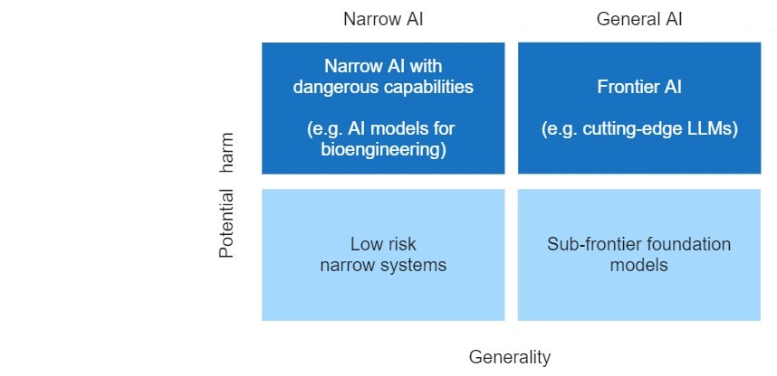

# Governance

    <!-- Left Column -->
    

        <!-- Authors -->
        

            
                <i class="fas fa-users"></i>
            
            

                
Authors

                

                    Charles Martinet
                

            

        

        
        <!-- Affiliations -->
        

            
                <i class="fas fa-building"></i>
            
            

                
Affiliations

                

                    

French Center for AI Safety (CeSIA)

                

            

        

<!-- Acknowledgements section -->

    
        <i class="fas fa-heart"></i>
    
    

        
Acknowledgements

        

            Markov Grey, Charbel-Raphael Segerie
        

    

    

    <!-- Right Column -->
    

        <!-- Date -->
        

            
                <i class="fas fa-calendar"></i>
            
            

                
Last Updated

                
2024-05-01

            

        

        
        <!-- Reading Time -->
		

			
				<i class="fas fa-clock"></i>
			
			

				
Reading Time

				
117 min (core)

			

		

        
    

    <a href="https://www.youtube.com/watch?v=FSKuDqze9es" class="action-button">
        <i class="fas fa-video"></i>
        Watch
    </a>
    

        <i class="fas fa-headphones"></i>
        Listen
    

    

        <i class="fas fa-file-pdf"></i>
        Download
    

    <a href="https://forms.gle/ZsA4hEWUx1ZrtQLL9" class="action-button">
        <i class="fas fa-comment"></i>
        Feedback
    </a>
    <a href="https://docs.google.com/document/d/1tp5rpzw_gekjju-UBp8tkbbnQOuA2QzsPF_um8Z4IOU/edit?tab=t.0#heading=h.fo57hwsn3del" class="action-button">
        <i class="fas fa-users"></i>
        Facilitate
    </a>

# Introduction

!!! warning "This chapter is still a work in progress, the full version will be uploaded soon."

Artificial intelligence (AI) has the potential to revolutionize numerous aspects of society, from healthcare to transportation to scientific research. Recent advancements have demonstrated AI's ability to defeat world champions at Go, generate photorealistic images from text descriptions, and discover new antibiotics. However, these developments also raise significant challenges and risks.

Policymakers, researchers, and the general public express both excitement about AI's potential and concern about its risks, including job displacement, privacy infringements, and the potential for AI systems to make consequential mistakes or be misused. While technical AI safety research is necessary to ensure AI systems behave reliably and align with human values as they become more capable and autonomous, it alone is insufficient to address the full spectrum of challenges posed by advanced AI systems.

This chapter explores the emerging field of AI governance, with a particular focus on frontier AI - highly capable foundation models that could possess dangerous capabilities sufficient to pose severe risks to public safety ([Anderljung et al. 2023](https://arxiv.org/abs/2307.03718)). We will examine why governance is necessary, how it complements technical AI safety efforts, and the key challenges and opportunities in this rapidly evolving field. 

<figure markdown="span">
{ loading=lazy }
  <figcaption markdown="1"><b>Figure 4.1:</b> Distinguishing AI models according to their level of potential harm and generality. We focus here on frontier AI models (source: [U.K. government](https://www.gov.uk/government/publications/frontier-ai-capabilities-and-risks-discussion-paper/frontier-ai-capabilities-and-risks-discussion-paper#figure-1))</figcaption>
</figure>

AI governance can be defined as "the study and shaping of governance systems -- including norms, policies, laws, processes, politics, and institutions -- that affect the research, development, deployment, and use of existing and future AI systems in ways that positively shape societal outcomes" ([Maas 2022](https://ea.greaterwrong.com/posts/Bzezf2zmgBhtCD3Pb/components-of-strategic-clarity-strategic-perspectives-on)). It encompasses both research into effective governance approaches and the practical implementation of these approaches. AI governance also addresses the broader systemic impacts of AI, including the interactions between multiple AI systems and their effects on economic, political, and social structures.

The scope of AI governance is broad, so this chapter will primarily focus on large-scale risks associated with frontier AI systems. We will explore why governance is necessary, how it complements technical AI safety efforts, and the key challenges and opportunities in this rapidly evolving field. Our discussion will center on the governance of commercial and civil AI applications, as military AI governance involves a distinct set of issues that are beyond the scope of this chapter.

We'll examine the current state of AI governance, proposed frameworks and policies, and the roles that various stakeholders – including governments, industry, academia, and civil society – can play in shaping the future of AI. The scope of this chapter includes:

1. An overview of AI development processes and key challenges in AI governance

2. Governance parameters and the role of compute

3. Critical issues in AI governance

4. Layers of responsibility: corporate, national, and international governance

By the end of this chapter, you'll have a comprehensive understanding of why AI governance matters and how it can help ensure that the development of frontier AI aligns with human values and societal well-being.

    ❧

