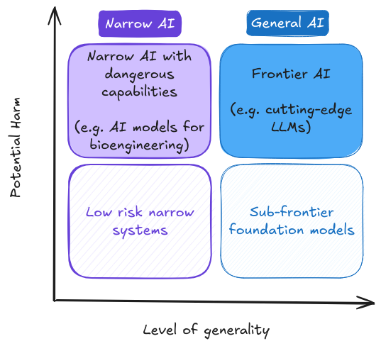

# Chapter 04 - Governance

    <!-- Left Column -->
    

        <!-- Authors -->
        

            
                <i class="fas fa-users"></i>
            
            

                
Authors

                

                    Charles Martinet
                

            

        

        
        <!-- Affiliations -->
        

            
                <i class="fas fa-building"></i>
            
            

                
Affiliations

                

                    

French Center for AI Safety (CeSIA)

                

            

        

<!-- Acknowledgements section -->

    
        <i class="fas fa-heart"></i>
    
    

        
Acknowledgements

        

            Markov Grey, Charbel-Raphael Segerie, Léo Karoubi
        

    

    

    <!-- Right Column -->
    

        <!-- Date -->
        

            
                <i class="fas fa-calendar"></i>
            
            

                
Last Updated

                
2024-12-10

            

        

        
        <!-- Reading Time -->
		

			
				<i class="fas fa-clock"></i>
			
			

				
Reading Time

				
119 min (core)

			

		

        
        <!-- Links -->
        

            
                <i class="fas fa-link"></i>
            
            

                
Also available on

                

                    <a href="https://docs.google.com/document/d/1fFVYWes5JQgSc2l9cAMQKprCevw2qW0-4MKMQPnpbxw/edit?usp=sharing" class="meta-link">Google Docs</a>
                

            

        

    

    <a href="https://www.youtube.com/watch?v=FSKuDqze9es" class="action-button">
        <i class="fas fa-video"></i>
        Watch
    </a>
    <button class="action-button audio-toggle-button">
        <i class="fas fa-headphones"></i>
        Listen
    </button>
    

        <i class="fas fa-file-pdf"></i>
        Download
    

    <a href="https://forms.gle/ZsA4hEWUx1ZrtQLL9" class="action-button">
        <i class="fas fa-comment"></i>
        Feedback
    </a>
    <a href="https://docs.google.com/document/d/1tp5rpzw_gekjju-UBp8tkbbnQOuA2QzsPF_um8Z4IOU/edit?tab=t.0#heading=h.fo57hwsn3del" class="action-button">
        <i class="fas fa-users"></i>
        Facilitate
    </a>

    <!-- Header section -->
    

        

            <i class="fas fa-headphones-alt"></i>
            Audio Version
            <i class="fas fa-robot"></i> AI-generated
        

        

            <button class="audio-close-button" aria-label="Close audio player">
                <i class="fas fa-times"></i>
            </button>
        

    

    
    <!-- MEGA embed wrapper -->
    

        <iframe 
            width="100%" 
            height="160" 
            frameborder="0" 
            src="https://mega.nz/embed/CKwiWYKJ#oWiz8s9s7GVeQiSYxBtTLgrnD5XWmuocxeIBwuPbXrw!1v1c" 
            allowfullscreen
            loading="lazy"
            allow="autoplay">
        </iframe>
    

    
    <!-- Error toggle button at the bottom -->
    

        <button class="errors-toggle-button" aria-label="View known errors">
            <i class="fas fa-exclamation-circle"></i> View known errors in AI-generated audio
        </button>
    

    
    <!-- Hidden errors panel at the bottom -->
    

        <h4>Known Errors in AI-Generated Audio</h4>
        <ul>
            <li><strong>Note:</strong> - This is an AI-generated audio version. Please report any errors you find.</li>
        </ul>
        
Found errors? Please report to <a href="mailto:contact@securite-ia.fr">contact@securite-ia.fr</a>

    

# Introduction

<figure class="video-figure" markdown="span">
<iframe style="width: 100%; aspect-ratio: 16 / 9;" frameborder="0" allowfullscreen src="https://www.youtube.com/embed/FSKuDqze9es"></iframe>
  <figcaption markdown="1"><b>Video 4.1:</b> Optional video to get an overview of Governance.</figcaption>
</figure>

!!! quote "The Bletchley Declaration (signed by 28 countries, including all AI leaders, and the EU, 2023)"

    "Substantial risks may arise from potential intentional misuse or unintended issues of control relating to alignment with human intent. These issues are in part because those capabilities are not fully understood [...] There is potential for serious, even catastrophic, harm, either deliberate or unintentional, stemming from the most significant capabilities of these AI models."

Artificial intelligence (AI) has the potential to revolutionize numerous aspects of society, from healthcare to transportation to scientific research. Recent advancements have demonstrated AI's ability to defeat world champions at Go, generate photorealistic images from text descriptions, and discover new antibiotics. However, these developments also raise significant challenges and risks.

Policymakers, researchers, and the general public express both excitement about AI's potential and concern about its risks, including job displacement, privacy infringements, and the potential for AI systems to make consequential mistakes or be misused. While technical AI safety research is necessary to ensure AI systems behave reliably and align with human values as they become more capable and autonomous, it alone is insufficient to address the full spectrum of challenges posed by advanced AI systems.

The scope of AI governance is broad, so this chapter will primarily focus on large-scale risks associated with frontier AI - highly capable foundation models that could possess dangerous capabilities sufficient to pose severe risks to public safety ([Anderljung et al., 2023](https://arxiv.org/abs/2307.03718)). We will examine why governance is necessary, how it complements technical AI safety efforts, and the key challenges and opportunities in this rapidly evolving field. Our discussion will center on the governance of commercial and civil AI applications, as military AI governance involves a distinct set of issues that are beyond the scope of this chapter.

<figure markdown="span">
{ loading=lazy }
  <figcaption markdown="1"><b>Figure 4.1:</b> Distinguishing AI models according to their level of potential harm and generality. We focus here on frontier AI models ([U.K. government, 2023](https://www.gov.uk/government/publications/frontier-ai-capabilities-and-risks-discussion-paper/frontier-ai-capabilities-and-risks-discussion-paper))</figcaption>
</figure>

AI governance can be defined as "the study and shaping of governance systems - including norms, policies, laws, processes, politics, and institutions - that affect the research, development, deployment, and use of existing and future AI systems in ways that positively shape societal outcomes" ([Maas, 2022](https://ea.greaterwrong.com/posts/Bzezf2zmgBhtCD3Pb/components-of-strategic-clarity-strategic-perspectives-on)). It encompasses both research into effective governance approaches and the practical implementation of these approaches. AI governance also addresses the broader systemic impacts of AI, including the interactions between multiple AI systems and their effects on economic, political, and social structures.

This chapter will also examine the current state of AI governance, proposed frameworks and policies, and the roles that various stakeholders – including governments, industry, academia, and civil society – can play in shaping the future of AI. The scope of this chapter includes:

- An overview of AI development processes and key challenges in AI governance

- Governance parameters and the role of compute

- Critical issues in AI governance

- Layers of responsibility: corporate, national, and international governance

By the end of this chapter, you'll have a comprehensive understanding of why AI governance matters and how it can help ensure that the development of frontier AI aligns with human values and societal well-being.
