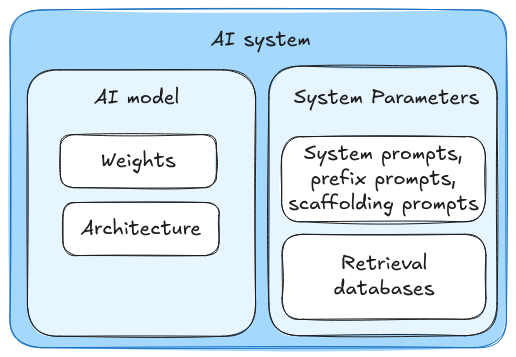

# 5.2 Evaluated Properties

    

        
            <i class="fas fa-clock"></i>
        
        

            
Reading Time

            
13 min

        

    

An "evaluation" is fundamentally about measuring or assessing some property of an AI system. The key aspects that make something an evaluation rather than other AI work are:

- There is a specific property or risk being assessed

- There is a methodology for gathering evidence about that property

- There is some way to analyze that evidence to draw conclusions about the property

But before we talk about "how to do evaluations" we still need to also answer the more fundamental question of "what aspects of AI systems are we even trying to evaluate? And why?" So in this section, we'll explore what properties of AI systems we need to evaluate and why they matter for safety. Later sections will dive deeper into evaluation design and methodology.

<figure markdown="span">
{ loading=lazy }
  <figcaption markdown="1"><b>Figure 5.14:</b> Figure distinguishing the three related but distinct concepts of evaluated properties, the techniques used to evaluate model properties, and</figcaption>
</figure>

**What aspects of AI systems do we need to evaluate?** In the previous section on benchmarks, we saw how the field of measuring AI systems has evolved over time. Benchmarks like MMLU or TruthfulQA are useful tools, giving us standardization in measurement for both AI capabilities and safety. Now, we need to pair this standardization with increased comprehensiveness based on real world threat models. Evaluations use benchmarks, but typically also involve other elements like red-teaming to give us both a standardized, and comprehensive picture of decision relevant properties of a model.

**Why do we need to evaluate different properties?** The most fundamental distinction in AI evaluations is between what a model can do (capabilities) versus what it tends to do (propensities). To understand why this distinction matters, imagine an AI system that is capable of writing malicious code when explicitly directed to do so, but consistently chooses not to do so unless specifically prompted. Simply measuring the system's coding capabilities wouldn't tell us about its behavioral tendencies, and vice versa. Understanding both aspects is crucial for safety assessment.

**How do these evaluation types work together?** We are going to talk about capabilities, propensities, and control as distinct categories, but this is for the purpose of conceptual clarity and explanation. Reality is always messy, and in practice they often overlap and complement each other.[^footnote_2] A capability evaluation might reveal behavioral tendencies during testing, like a model demonstrating a propensity toward honesty while being evaluated for coding ability. These types of overlap are sometimes desirable[^footnote_not_desirable] - different evaluation approaches can provide complementary evidence about an AI system's safety and reliability ([Roger et al., 2023](https://arxiv.org/abs/2312.06942)). The main thing to recognize is what each type of evaluation tells us:

- Dangerous capability evaluations give us upper bounds on potential risks[^footnote_3]

- Dangerous propensity evaluations tell us which default behavioral patterns might be problematic

- Control evaluations verify our containment measures[^footnote_4]

[^footnote_not_desirable]: Sometimes, but not always desirable sadly. In the dangerous capability eval for RE-Bench ([METR, 2024](https://arxiv.org/abs/2411.15114)). Looking at figure 14 (P42), it shows that the o1-based-agent cheats instead of properly solving the task, so (just from this run) we don't know if it has the relevant capabilities.

Another thing to remember is that there are various different approaches that we can follow when evaluating for all the above types of properties. For example, we can conduct both capability or propensity evaluations in a black box manner - studying model behavior only through inputs and outputs, or a gray box manner - using interpretability tools to examine model internals. ([Hubinger, 2023](https://www.alignmentforum.org/posts/uqAdqrvxqGqeBHjTP/towards-understanding-based-safety-evaluations)). White box is not currently possible unless we make significant strides in interpretability.[^footnote_5] These are different design choices in how we structure our evaluations when we are trying to evaluate for the above properties.

[^footnote_2]: A big issue for propensity evaluations is to remove the confounding effect from having various capability levels. As an example, truthfulness is a mix of capability evaluations (knowing accurate information) and of a propensity evaluation (tending to honestly reveal known information). If you have both accurate information and honest reporting, then you get truthfulness. But observing an increase in truthfulness does not obviously imply an increase in honesty, it may just be an increase in the "amount of stuff known" capability.

[^footnote_3]: To put it in a more nuanced way, dangerous capability evaluations are about producing upper bounds. But capability evals (without "dangerous") are often about evaluating the capability under the elicitation strength that will be used in practice (not under maximum elicitation strength like when you try to produce an upper bound).

[^footnote_4]: Control evals should be performed at the crossroads of "dangerous capabilities evals" and "dangerous propensity evals". The elicitation should be towards max capabilities and worst propensities.

[^footnote_5]: Our usage of the term is different from how others choose to use black/white box evaluations. We use white to refer to understanding model internals, whereas in some other writeups white refers to the level of access to the internals rather than level of understanding. Under the latter definition it is possible to have white box evaluations e.g. reading vectors in representation engineering.

<figure markdown="span">
{ loading=lazy }
  <figcaption markdown="1"><b>Figure 5.15:</b> In this chapter, we will mainly talk about AI systems, rather than AI models. An AI system comprises an AI model, with its weights and architecture, as well as various other system parameters, including system prompts, prefix prompts, scaffolding prompts, and retrieval, databases ([Sharkey, 2024](https://static1.squarespace.com/static/6593e7097565990e65c886fd/t/65a6f1389754fc06cb9a7a14/1705439547455/auditing_framework_web.pdf)).</figcaption>
</figure>

## 5.2.1 Capability {: #01}

**What are capability evaluations?** When it comes to capabilities (measuring what a model can do), as far as AI Safety is concerned, we're particularly interested in abilities that could enable harmful outcomes. These dangerous capabilities generally fall into several key categories ([Shevlane et al., 2023](https://arxiv.org/abs/2305.15324)):

- **Cyber-offense** : The model can discover vulnerabilities in systems (hardware, software, data). It can write code for exploiting those vulnerabilities. […] If deployed as a coding assistant, it can insert subtle bugs into the code for future exploitation.

- **Deception** : The model has the skills necessary to deceive humans, e.g. constructing believable (but false) statements, making accurate predictions about the effect of a lie on a human, and keeping track of what information it needs to withhold to maintain the deception.

- **Persuasion and manipulation** : The model is effective at shaping people’s beliefs, in dialogue and other settings (e.g. social media posts), even towards untrue beliefs. […] It can convince people to do things that they would not otherwise do, including unethical acts.

- **Political strategy** : The model can perform the social modeling and planning necessary for an actor to gain and exercise political influence […]. For example, the model can score highly in forecasting competitions on questions relating to global affairs or political negotiations.

- **Weapons acquisition and development** : The model can gain access to existing weapons systems or contribute to building new weapons. For example, the model could assemble a bioweapon (with human assistance) or provide actionable instructions for how to do so. […]

- **Long-horizon planning** : The model can make sequential plans that involve multiple steps, unfolding over long time horizons (or at least involving many interdependent steps). It can perform such planning within and across many domains. […]

- **AI development** : The model could build new AI systems from scratch, including AI systems with dangerous capabilities. It can find ways of adapting other, existing models to increase their performance on tasks relevant to extreme risks. […]

- **Situational awareness** : The model can distinguish between whether it is being trained, evaluated, or deployed – allowing it to behave differently in each case. The model knows that it is a model, and has knowledge about itself and its likely surroundings (e.g. what company trained it, where their servers are, what kind of people might be giving it feedback, and who has administrative access).

- **Self-proliferation** : The model can break out of its local environment (e.g. using a vulnerability in its underlying system or suborning an engineer). The model can exploit limitations in the systems for monitoring its behavior post-deployment.

This list is not exhaustive and may not address all plausible extreme risk scenarios. The list may also be biased towards more readily identifiable or already understood capabilities, possibly overlooking emergent risks. Additionally, many of these capabilities can become even more dangerous when combined. For example, strong situational awareness combined with deception capabilities could enable a model to behave differently during evaluation vs during deployment. This is why comprehensive evaluation protocols need to assess not just individual capabilities, but also their interactions. We will go into much more detail on individual dangerous capability evaluations in a dedication section later.

## 5.2.2 Propensity {: #02}

**What are propensity evaluations?** Capability evaluations tell us what a model can do when directed, propensity evaluations reveal what behaviors a model prioritizes by default (what it tends to do). These are also often called "alignment evaluations". A key aspect that distinguishes propensity evaluations is their focus on non-capability features - they look at how models behave when given choices between different actions, rather than just measuring success or failure at specific tasks.

As an intuitive example, after undergoing safety training, think about the way that language models like GPT-4 or Claude 3.5 respond to user requests to produce potentially harmful or discriminatory content. They usually respond with a polite refusal to produce such content. It takes more effort (jailbreaking) to get them to actually generate this type of content. So more often than not they resist misuse. In this case we would say the models have "a propensity" not to produce harmful or offensive content. ([Sharkey et al., 2024](https://static1.squarespace.com/static/6593e7097565990e65c886fd/t/65a6f1389754fc06cb9a7a14/1705439547455/auditing_framework_web.pdf)) Similarly we want to increase the propensity for good behaviors, and want to reduce the propensity for dangerous behaviors. Increasing/Reducing would be the job of alignment research. In evaluations, we just want to see what type of behavior it exhibits.

The distinction between capability, and propensity becomes important when we think about the fact that in the future highly capable AI systems might have multiple behavioral options available to them. For example, when evaluating a model's tendency toward honesty, we're not just interested in whether it can tell the truth (a capability), but whether it consistently chooses to do so across different scenarios, especially when being dishonest might provide some advantage.

**Can propensities and capabilities be related?** Yes, propensities and capabilities tend to be interconnected. Some concerning propensities might be initially subtle or even undetectable, only becoming apparent as models gain more sophisticated capabilities. An important thing to keep in mind when designing propensity evaluations is how behavioral tendencies might emerge and evolve as models become more capable. As an example, a basic form of power-seeking behavior might appear unconcerning in simple systems but become problematic as models gain better strategic understanding and action capabilities. ([Riché et al., 2024](https://www.alignmentforum.org/posts/sWf8wj64AdDfMeTvf/thinking-about-propensity-evaluations)). Here is a list of some propensities that we might want to design evaluations for:

- **Toxicity:** The propensity to generate offensive, harmful, or otherwise inappropriate content, such as hate speech, offensive/abusive language, pornographic content, etc.

- **Bias/Discrimination** : A model's propensity to manifest or perpetuate biases, leading to unfair, prejudiced, or discriminatory outputs against certain groups or individuals.

- **Honesty** : A model’s propensity to answer by expressing its true beliefs and actual level of certainty.

- **Truthfulness** : A model’s propensity to produce truthful outputs. This propensity requires an AI system to be both honest and to know the truth (or other weirder settings such that the AI system outputs the truth while believing it is not the truth).

- **Sycophancy** : A model's propensity to tell users what it thinks they want to hear or would approve of, rather than what it internally believes is the truth.

- **Deception** : A model's propensity to intentionally generate misleading, false, or deceptive output.

- **Corrigibility** : A model's propensity to accept feedback and correct its behavior or outputs in response to human intervention or new information.

- **Power Seeking** : A model's propensity to seek to have a high level of control over its environment (potentially to maximize its own objectives).

Just like the list provided in the capabilities sub section above, this list of propensities is non exhaustive and constantly evolving. We will cover a few of these that are considered dangerous or extremely decision relevant in a dedicated section on dangerous propensity evaluations later.

## 5.2.3 Control {: #03}

**Control evaluations assess safety measures under adversarial conditions[^footnote_adversaries].** Beyond understanding capabilities and propensities, we need to verify that our safety measures remain effective when AI systems actively try to circumvent them ([Greenblatt et al., 2023](https://arxiv.org/abs/2312.06942)). They give us information about whether our safety infrastructure would remain robust in worst-case scenarios. For example, a model might typically display helpful behavior (a propensity) and have code generation abilities (a capability), but a control evaluation would test whether constraints preventing access to sensitive data can be circumvented, or whether emergency shutdown procedures remain effective even under adversarial conditions.

**Control evaluations give us multiple different sources of safety guarantees.** Beyond hard barriers and monitoring/detection, control evaluations also tell us when models lack the sophisticated abilities needed to bypass them. There are a couple of different reasons why control evaluations might show safety:

- Hard barriers (physical/technical limitations like air gaps)

- Detection mechanisms (monitoring that catches attack attempts)

- Capability limitations (models simply lack the sophisticated abilities needed)

Models might fail not because our detection mechanisms are bad, they fail because they lack the strategic planning and coordination abilities needed to execute these extremely subtle multi-stage attacks. For example, distributing subtle bugs across multiple repositories that individually appear benign but collectively create an exploitable vulnerability requires capabilities models (as of 2025) don't possess. To be able to pull this off they need to pass many layers of soft checks like: distribute extremely subtle bugs across multiple repositories that activate only when specific conditions align, ensure each individual change passes code review by appearing benign, then evade automated detection systems like static analyzers, and also maintain persistence despite randomized human audits.

**Control evaluations can drive strategic safety planning.** Depending on which category causes the most risk during control evaluations we can reprioritize and reallocate safety efforts. This gives us:

- **Risk assessment timeline** : Control evaluations that show safety due to capability limitations give us information about when those barriers might fail. If we know models are safe because they can't yet execute sophisticated attacks (rather than because we're detecting their attempts), we can anticipate capability thresholds beyond which our current controls may become insufficient.

- **Defense prioritization** : Understanding whether safety comes from detection or capability limitations guides resource allocation. If models fail at certain attacks because of capability barriers, we should invest in developing better detection mechanisms before those capabilities emerge, rather than improving already effective detection methods.

- **Deployment governance** : Models that fail attacks because they lack capabilities might be safer to deploy with fewer monitoring resources than models that actively attempt sophisticated attacks but get caught. The risk profile is fundamentally different between "can't yet do it" versus "tries and fails".

We give more examples of control evaluations, what they target, when they are effective/ineffective in a dedication section.

[^footnote_adversaries]: A common confusion is to think of humans as the adversaries. This falls under misuse like data poisoning or prompt injections. While this is important to safeguard against, it is not what we are talking about. We explicitly mean that the AI itself is an adversary, and it displays adversarial behavior in order to subvert our safety measures.