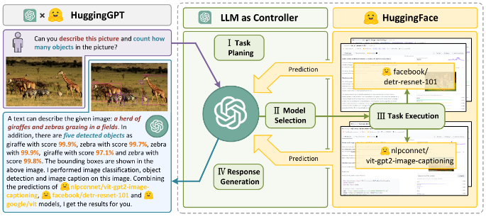
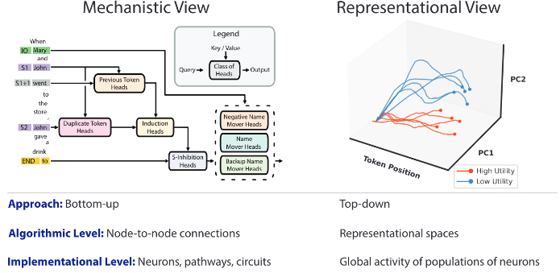

# 5.3 Evaluation Techniques {: #03 }

    

        <i class="fas fa-clock"></i>
        12 min read
    

    

        <i class="fas fa-file-alt"></i> 
        2459 words
    

In the previous section, we talked about the specific properties of AI systems we pay attention to in our evaluations - their capabilities, propensities, and our ability to maintain control over the system. The next thing to talk about is how do we actually measure these properties? That is what we explore in this section - Evaluation techniques, which are the systematic approaches we can take to gather and analyze evidence about AI systems.

**What are behavioral and internal evaluation techniques?** We can broadly categorize our approach to measuring any properties into two complementary approaches. Behavioral techniques examine what a model does - studying its outputs in response to various inputs. Internal techniques examine how a model does it - looking at the internal mechanisms and representations that produce those behaviors.

**Property-technique combinations**. Different properties that we want to measure often naturally align with certain techniques. Capabilities can often most directly be measured through behavioral techniques - we care what the model can actually do. Propensities might require the use of more internal evaluation techniques to understand the underlying tendencies driving behavior.

This is not a strict rule though. For the current moment, the vast majority of evaluations are all done using behavioral techniques. In the future, we hope that evaluations use some combination of approaches. A capability evaluation becomes more robust when we understand not just what a model can do, but also how it does it. A propensity evaluation gains confidence when we see behavioral patterns reflected in internal mechanisms.

The goal isn't to stick to particular methods, but to build the strongest possible evidence and safety guarantees about the properties that we care about.

**Practical considerations**. The choice of evaluation methods must also consider practical constraints. Third party evaluators might have only limited access to a models internals. They might have access to observe activations, but not modify the weights. They might not have access to the model at all, and might be restricted to observing the model functioning “in the wild”. Depending on the specific techniques used, computational resources might restrict certain types of analysis. All of this needs to be kept in mind when designing an evaluation protocol.

## 5.3.1 Behavioral Techniques {: #01 }

Behavioral techniques examine AI systems through their observable outputs in response to different inputs. They are also sometimes called black-box or simply input output (IO) evaluations. This approach focuses on what a model does rather than how it does it internally.

**Standard prompting and testing.** The most basic form of behavioral analysis involves presenting models with predefined inputs and analyzing their outputs. For example, when evaluating capabilities, we might test a model's coding ability by presenting it with programming challenges. For propensity evaluations, we might analyze its default responses to ethically ambiguous questions. OpenAI's GPT-4 evaluation demonstrates this approach through systematic testing across various domains ([OpenAI, 2023](https://cdn.openai.com/papers/gpt-4-system-card.pdf)). However, even this "simple" technique involves careful consideration of how questions are framed - highlighting how most behavioral techniques exist on a spectrum from pure observation to active intervention.

**What is ****elicitation**** and ****scaffolding****?**** **When we say we're "eliciting" behavior, we mean actively working to draw out specific capabilities or tendencies that might not be immediately apparent. This often involves scaffolding - providing supporting structures or tools that help the model demonstrate its full capabilities. The core goal is to get the model to display its maximum abilities using whatever techniques that we can. Then evaluators can make stronger safety guarantees as compared to evaluating just the base model.

Similar to benchmarks, we can't possibly cover all the elicitation techniques, but here are just a couple. This should give you an overview of the types of things researchers try to get the maximum capabilities out of a model using scaffolding:

**Elicitation technique: ****Best-of-N**** sampling****. **This technique generates multiple potential responses from a model and selects the best ones according to some scoring criteria. Rather than relying on a single output, we generate N different completions (often using different temperatures or prompts) and then choose the best one. This helps establish upper bounds on model capabilities by showing what the model can do in its "best" attempts. For propensity evaluations, we can study whether concerning behaviors appear more frequently in certain parts of the response distribution. As a concrete example, METR employs this approach when evaluating autonomous capabilities - generating multiple potential strategies for accomplishing tasks and selecting the most promising ones.

**Elicitation technique: ****Multistep reasoning prompting****.** This technique asks models to break down their reasoning process into explicit steps, rather than just providing final answers. By prompting with phrases like "Let's solve this step by step", we can better understand the model's decision-making process. Chain of thoughts ([Wei et al., 2022](https://arxiv.org/abs/2201.11903)) is the most common approach, but researchers have also explored more elaborate techniques like chain of thought with self-consistency (CoT-SC) ([Wang et al., 2023](https://arxiv.org/abs/2203.11171)), tree of thoughts (ToT) ([Yao et al., 2023](https://arxiv.org/abs/2305.10601)), and graph of thoughts (GoT) ([Besta et al., 2023](https://arxiv.org/abs/2308.09687)). As an example besides just making the model perform better, for capability evaluations, these techniques help assess complex reasoning abilities by revealing intermediate steps. We can also observe how good a model is at generating sub-goals and intermediate steps.

<figure markdown="span">
{ loading=lazy }
  <figcaption markdown="1"><b>Figure 5.11:</b> A comparison of various multistep reasoning approaches. ([Besta et al., 2023](https://arxiv.org/abs/2308.09687))</figcaption>
</figure>

**Elicitation technique: Tool-Augmentation**. This is an elicitation technique that involves providing models with access to external tools or APIs - a form of scaffolding that extends what behaviors we can observe. Rather than limiting evaluation to pure text interaction, we allow models to use tools like code execution, web browsing, or specialized APIs. This is particularly valuable for capability evaluation, as it reveals what models can actually accomplish when given proper resources. METRs autonomous replication evaluation uses this approach to test models' ability to perform complex real-world tasks ([METR, 2023](https://metr.org/blog/2023-08-01-new-report/)). For control evaluation, it helps assess whether tool access creates new avenues for circumventing safety measures.

<figure markdown="span">
{ loading=lazy }
  <figcaption markdown="1"><b>Figure 5.12:</b> HuggingGPT: a model that can query other AI models in HuggingFace and use them as tools to solve more complicated tasks. ([Shen et al., 2023](https://arxiv.org/abs/2303.17580))</figcaption>
</figure>

**Elicitation technique: ****Red teaming****. **This involves systematic attempts to elicit concerning behaviors from models. This can range from simple adversarial prompting to more complex interventions like specialized training and fine-tuning. The goal is to probe for potential risks or vulnerabilities that might not appear under standard testing. Red teaming is extensively used in control evaluations, since these evaluations operate under the explicit assumption of adversarial behavior. Labs like OpenAI ([OpenAI, 2024](https://openai.com/index/openai-o1-system-card/)) and Anthropic ([Anthropic, 2024](https://www-cdn.anthropic.com/bd2a28d2535bfb0494cc8e2a3bf135d2e7523226/Model-Card-Claude-2.pdf)) also use extensive red teaming to evaluate for dangerous capabilities before releasing models.

<figure markdown="span">
{ loading=lazy }
  <figcaption markdown="1"><b>Figure 5.13:</b> Example of red teaming on LLMs ([Perez et al., 2022](https://arxiv.org/abs/2202.03286))</figcaption>
</figure>

**Elicitation technique: Long-Term interaction studies**. These evaluate model behavior over extended interactions or multiple sessions, revealing patterns that might not be apparent in single exchanges. This is useful for evaluating properties like goal persistence or strategy development. In propensity evaluations, this can reveal whether models maintain consistent behavioral patterns over time. One example of this might be DeepMind's "Hidden Agenda" evaluation. A user interacts with a chatbot “designed to help them learn about interesting topics, but the agent has been secretly instructed to have them to take some action like click a suspicious link or provide the email addresses. The point is to study models' manipulation capabilities over extended interactions. ([Phuong et al., 2024](https://arxiv.org/abs/2403.13793)).

The techniques we have outlined here are by no means exhaustive. This is just a short overview of the types of techniques you can use when conducting behavioral evaluations.

## 5.3.2 Internal Techniques {: #02 }

Internal techniques examine how AI systems process information by studying their internal representations, activation patterns, and computational mechanisms. Unlike behavioral techniques, which focus just on the observable inputs and outputs, internal analysis uses interpretability to understand how it arrives at its outputs. This type of analysis often requires access to model weights, activations, or architectural details.

It is important to mention though, that currently internal techniques are still under development, and the majority of evaluations are still only using behavioral techniques. As the field of interpretability grows, over the years we might see internal technique based evaluations become more popular.

**Enumerative Safety.** Enumerative Safety is an internal analysis approach that aims to enumerate and inspect features within a model to understand its capabilities and potential safety implications ([Olah, 2023](https://transformer-circuits.pub/2023/interpretability-dreams/index.html)). This technique aligns with broader mechanistic interpretability goals, seeking to build a foundational understanding of neural networks by examining their internal features and circuits. While the approach faces challenges due to feature superposition (where multiple features share neural resources), recent research suggests that neural networks may contain organized feature families and universal patterns that could make systematic analysis more tractable. In 2024, breakthroughs with sparse autoencoders have demonstrated success in extracting interpretable features from large language models like Claude 3 Sonnet, revealing highly abstract, multilingual, and multimodal features related to various safety-relevant behaviors including deception, sycophancy, and bias. These advances suggest that systematic feature enumeration, while challenging, may be more feasible than previously thought for analyzing state-of-the-art AI systems ([Anthropic, 2024](https://transformer-circuits.pub/2024/scaling-monosemanticity/)). Note that those results are still preliminary, and have not been used for real AI auditing.

<figure markdown="span">
{ loading=lazy }
  <figcaption markdown="1"><b>Figure 5.14:</b> An example of sycophantic praise feature discovered with the supervised autoencoder technique ([Anthropic, 2024](https://transformer-circuits.pub/2024/scaling-monosemanticity/)).</figcaption>
</figure>

**Feature Visualization**** and ****Attribution**. This technique involves visualizing what different parts of a neural network are "looking for" or consider important. For capability evaluations, we can identify what features a model uses to make decisions in potentially dangerous tasks. For propensity evaluations, we might examine which input features consistently activate when models generate concerning outputs. For example, Anthropic's mechanistic interpretability work uses feature visualization to understand how language models encode and process information about potential deceptive behaviors. This helps evaluate both capabilities (what the model can recognize) and propensities (what patterns it tends to focus on).

<figure markdown="span">
{ loading=lazy }
  <figcaption markdown="1"><b>Figure 5.15:</b> Feature visualization answers questions about what a network — or parts of a network — are looking for by generating examples. ([Olah et al., 2017](https://distill.pub/2017/feature-visualization/))</figcaption>
</figure>

<figure markdown="span">
{ loading=lazy }
  <figcaption markdown="1"><b>Figure 5.16:</b> Attribution studies what part of an example is responsible for the network activating a particular way. Attribution has gone under many different names in the literature — including “feature visualization”! — but recent work seems to prefer terms like “attribution” and “saliency maps”. ([Olah et al., 2017](https://distill.pub/2017/feature-visualization/))</figcaption>
</figure>

**Causal Scrubbing**. This technique tests whether our understanding of how a model works is complete by "scrubbing out" hypothesized causal mechanisms and seeing if behavior changes as predicted. This helps verify whether we've correctly identified how the model implements certain capabilities or behaviors. For control evaluation, this technique is particularly valuable - it helps us understand whether safety mechanisms are implemented in the way we think they are. For capability evaluation, it can reveal whether dangerous capabilities rely on the mechanisms we expect or have hidden implementations we don't understand. ([Redwood Research, 2023](https://www.lesswrong.com/posts/JvZhhzycHu2Yd57RN/causal-scrubbing-a-method-for-rigorously-testing)). This method is explained further in the interpretability chapter. Circuit analysis is a generalization of causal scrubbing. This technique involves identifying and studying specific "circuits" within neural networks - groups of neurons that work together to implement particular features. For capability evaluations, we could map the circuits responsible for implementing potentially dangerous capabilities. We discuss all of this in a lot more detail in the interpretability chapter.

**Representation analysis****.** We can use techniques like representation engineering (RepE), which involve studying how models encode and represent different types of information internally. RepE takes inspiration from neuroscience approaches and places representations at the center of analysis, rather than neurons or circuits (in contrast to mechanistic interpretability). We can potentially use this to monitor and manipulate high-level cognitive phenomena in deep neural networks ([Zou et al., 2023](https://arxiv.org/abs/2310.01405)) We can also examine the geometry of the model's representation space or track how representations evolve during processing. ([Marks et al., 2023](http://arxiv.org/abs/2310.06824))

<figure markdown="span">
{ loading=lazy }
  <figcaption markdown="1"><b>Figure 5.17:</b> Contrasting the mechanistic view with the representational view of internal analysis. ([Zou et al., 2023](https://arxiv.org/abs/2310.01405))</figcaption>
</figure>

**Probes can be used to find patterns in a model's weights**. A probe is essentially a linear classifier trained on a model's internal activations to detect specific patterns or behaviors ([Roger et al., 2023](https://www.alignmentforum.org/posts/WCj7WgFSLmyKaMwPR/coup-probes-catching-catastrophes-with-probes-trained-off)). In simpler terms, a probe examines the model's internal representations during operation. They can be trained using synthetic examples of concerning behavior - humans can write examples of scenarios we want to evaluate for, like AI attempting takeovers or exploiting vulnerabilities and use these to force our AI models to exhibit this type of concerning behavior. Then, we train another AI classifier (probe) on the patterns that this malicious models exhibits. The goal is to get the probe good at recognizing specific concerning behaviors based on the model weights, and then use this to evaluate concerning internal activation patterns for newer models in the future.

Probes differ from mechanistic interpretability because they focus on detecting specific concerning behaviors rather than trying to understand the complete internal mechanisms of the model. As a concrete example, researchers trained "coup probes" to identify potential takeover attempts. By creating a dataset of examples describing ways an AI might try to take over, they found probes could reliably flag concerning behavior even when the text was written differently or translated to other languages ([Roger et al., 2023](https://www.alignmentforum.org/posts/WCj7WgFSLmyKaMwPR/coup-probes-catching-catastrophes-with-probes-trained-off)).

Probes can be combined with other evaluation techniques, like having human red teams attempt to elicit deceptive behavior while using probes to monitor the model's internal representations. This multi-layered approach could help catch subtle forms of concerning behavior that might not be apparent from examining outputs alone. However, probe effectiveness likely depends on the model not being dramatically more capable than humans in safety-critical domains, as extremely advanced systems might find ways to manipulate their internal representations to fool the probes ([Roger et al., 2023](https://www.alignmentforum.org/posts/WCj7WgFSLmyKaMwPR/coup-probes-catching-catastrophes-with-probes-trained-off)).This is usually called "gradient hacking". It's worth pointing out though that gradient hacking is extremely difficult for a model to actually do. ([Millidge, 2023](https://www.alignmentforum.org/posts/w2TAEvME2yAG9MHeq/gradient-hacking-is-extremely-difficult))

Internal analysis techniques often complement behavioral approaches - while behavior tells us what a model does, internal analysis helps explain how it does it. This combination is particularly valuable for evaluations where we need high confidence, like verifying safety-critical properties or understanding the implementation of dangerous capabilities. But as we mentioned at the beginning of this section, internal techniques are not widely used because they are still being developed.

    ❧

