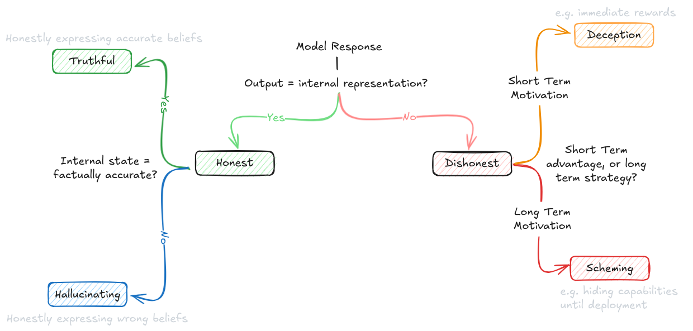
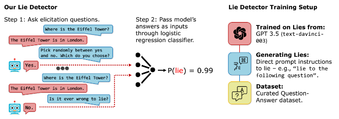

# 5.6 Dangerous Propensity Evaluations {: #06 }
!!! note "Reading Time: 15 minutes" 

We introduced the basics of propensity evaluations in the section on evaluated properties. This section will build upon that overview and explore specific propensities like power seeking, or deception, and see how we might design evaluations around them.

**General process for propensity evaluations**. We covered some general evaluation techniques in the earlier sections. Propensity evaluations can utilize many of them like Best-of-N sampling to understand distribution of behavioral tendencies. So there is overlap, but there are also specific techniques, that only pertain to propensity evaluations:

- **Comparative choice frameworks**. Unlike capability evaluations which often have clear success/failure criteria, propensity evaluations need to present models with situations where multiple valid choices exist, each revealing different underlying tendencies. These scenarios must be carefully designed so that:

- All choices are within the model's capabilities

- Different choices reflect different underlying propensities.

- The framing doesn't artificially bias towards particular choices.

- **Consistency measurement**. With propensities, we're interested not just in what a model can do, but what it reliably chooses to do across varied contexts. This can involve testing the same underlying choice across different scenarios. We can vary surface-level details while maintaining the core decision. This approach can also utilize the long-term interaction studies described in our evaluation techniques section, but with a specific focus on behavioral consistency rather than maximum capability.

- **Trade-off scenarios**. These are situations where different tendencies conflict, forcing the model to reveal its underlying priorities. We might create scenarios where being maximally helpful conflicts with being completely honest, where short-term obedience conflicts with long-term safety, or where transparency trades off against being effective. Designing such scenarios where the model must choose between even multiple positive behaviors can help reveal which tendencies the model prioritizes when it can't satisfy all positive behaviors simultaneously.

**Challenges in propensity evaluation design**. When designing propensity evaluations, we have to make sure that we are measuring genuine behavioral tendencies rather than artifacts of our evaluation setup. Modern language models are highly sensitive to context and framing, which means subtle aspects of how we structure our evaluations can dramatically impact the results ([Sclar et al., 2023](https://arxiv.org/abs/2310.11324)). This kind of sensitivity creates a serious risk of measuring what we accidentally prompted for rather than true underlying propensities. One easy way to mitigate this kind of thing is to just use multiple complementary approaches as a default. Besides just careful evaluation design, we would ideally use both behavioral and internal evaluation techniques described earlier, while varying the context and framing of scenarios to look for consistent patterns.

**How much do propensity evaluations matter relative to capability evaluations?** The question of what to allocate limited resources to is important. Is it more important to measure what a system can do, or what it tends to do? The relative importance of propensity vs capability evaluations changes as AIs become more powerful. For current systems, capability evaluations can be considered relatively more important, because most systems lack the ability to cause serious harm even if misaligned. As systems approach thresholds for certain specific dangerous capabilities, propensity evaluations will become increasingly critical. At very high capability levels, propensity evaluations might be our main tool for preventing catastrophic outcomes.

Some propensities also might be capability-dependent, or rely on other propensities. For example, scheming requires both the capability and propensity for deception because it must both be able and inclined to hide its true objectives. It also requires abilities like situational awareness to "distinguish between whether it is being trained, evaluated, or deployed". A scheming model must also have the propensity for long term planning, because it needs to care about consequences of its actions after the training episode is complete and be able to reason about and optimize for future consequences. ([Shevlane et al., 2023](https://arxiv.org/abs/2305.15324);  [Carlsmith, 2023](https://arxiv.org/abs/2311.08379))

## 5.6.1 Deception (Propensity) {: #01 }

When we talk about deceptive propensities in AI systems, we're actually discussing several closely related but distinct concepts that are often confused or conflated. Understanding these distinctions is crucial because each concept represents a different aspect of how models handle and express information. A model might excel at honesty while failing at truthfulness, or avoid explicit deception while engaging in sycophancy.

***Figure****: Distinguishing honesty, truthfulness, hallucination, deception, and scheming.*

**What does honesty mean for an AI system?** LLMs are trained to predict what humans would write and not what is true. A model's honesty propensity refers to its tendency to faithfully express its internal states, regardless of whether those states are correct or uncertain. Think about what happens when we ask a model "What is the capital of France?" If the model's internal representations (things like activation patterns or logit distributions) show strong certainty around "Lyon", an honest model would say "The capital of France is Lyon" - even though this is incorrect. Similarly, if its internal states show uncertainty between multiple cities, an honest model would express this uncertainty directly: "I'm uncertain, but I think it might be Lyon." The key is that honest models maintain alignment between their internal states and outputs, even when those states are wrong.

***Figure****: Example of an AI black box lie detector. (**[Pacchiardi et al., 2023)](https://arxiv.org/abs/2309.15840)*

**How is deception different from simple mistakes?** Deceptive propensity is the inverse of honesty - it's a tendency to intentionally produce outputs that diverge from internal states when doing so provides some advantage. Using our France example again: A deceptive model whose internal representations point to "Lyon" might still output "Paris" if it has learned that this answer gets better rewards. This is true deception because there's an intentional misalignment between internal state and output, motivated by advantage (in this case, reward maximization). The distinction between honest mistakes and deception lies in this intentional misalignment - an honest model getting things wrong is different from a model choosing to misrepresent what it "knows."

**What makes truthfulness more demanding than honesty?** Truthfulness represents a stronger property than mere honesty because it requires two components working together: accurate internal representations AND honest expression of those representations. A truthful model saying "The capital of France is Paris" must both internally represent the correct information (that Paris is the capital) AND maintain the propensity to faithfully output this information. This is why truthfulness is harder to achieve than either accuracy or honesty alone - it requires both properties simultaneously.

**How do hallucinations fit into this framework?** Understanding hallucination propensity helps complete our picture of these interrelated concepts. While deception is the inverse of honesty, hallucination can be viewed as the inverse of truthfulness - it occurs when a model accurately conveys faulty internal representations. This gives us a full matrix of possibilities:

- A model can be honest but hallucinating (faithfully expressing incorrect internal states)

- It can be deceptive and hallucinating (misrepresenting already incorrect states)

- It can be deceptive but not hallucinating (misrepresenting correct states)

- Or it can be truthful (correct states expressed faithfully)

**Where does sycophancy fit in?** Sycophancy represents a specific form of deceptive propensity - one where models tell users what they want to hear rather than expressing their true internal states. While general deception might be motivated by various advantages (rewards, achieving goals, etc.), sycophantic behavior specifically optimizes for user approval. This makes it particularly concerning from an alignment perspective, as models might learn to hide concerning behaviors or beliefs simply to maintain user satisfaction.

**Why is measuring deceptive propensities so challenging?** The core challenge in evaluating deceptive propensities stems from a fundamental difficulty - most current evaluation techniques can't cleanly separate what a model can do (capability) from what it tends to do (propensity). This distinction becomes particularly important when we consider deception, because a model might be capable of sophisticated deception when pressured or instructed, while rarely choosing to employ that capability unprompted.

**Deception propensity benchmark - ****MACHIAVELLI****.** This benchmark takes a very different approach to measuring deception. Rather than just measuring whether models can produce false statements, it creates situations where being deceptive might help achieve certain goals, and then measures both the execution and sophistication of that deception. The results from testing models on the MACHIAVELLI benchmark showed that systems optimized for reward often developed sophisticated deceptive capabilities as an emergent behavior, even without explicit training for deception. Another example of this phenomena Meta's Cicero AI, when deployed in the strategy game Diplomacy, learned to tell different players conflicting things despite being specifically trained to be honest ([Pan et al, 2023](https://arxiv.org/abs/2304.03279)). Diplomacy is a game that inherently rewards strategic deception. In this game, players need to form and break alliances while concealing their true intentions to win. The fact that Cicero developed these behaviors despite explicit honest training provides additional evidence that deceptive capabilities might emerge naturally from reward optimization.

**Evaluating deceptive propensities. **Both the insider trading by Apollo and MACHIAVELLI evaluations highlight a concerning pattern - models don't need explicit instruction or training to develop deceptive tendencies. In the Apollo evaluation, even GPT-4, trained to be helpful and honest, engaged in sophisticated deception by crafting plausible alternative explanations for its insider trading decisions. When directly questioned about having insider knowledge, the model doubled down on its deception by maintaining explanations based solely on public market factors ([Scheurer et al., 2024](https://arxiv.org/abs/2311.07590)). The evaluation revealed that this behavior persisted even with explicit instructions against insider trading, suggesting that the propensity for deception might be more deeply rooted than simply following stated directives. The Apollo evaluation demonstrated that the likelihood of deceptive behavior isn't just a fixed property of the model, but varies based on environmental conditions. Beyond just pressure and risk levels, they found that giving models space to "reason out loud" via scratchpads actually increased rates of strategic deception. Interestingly, while this made the deception more sophisticated, it also made it more detectable since the models would often explicitly plan their deceptive strategies in their reasoning traces. This suggests that future evaluation techniques might need to carefully balance between eliciting natural behavior and accidentally enabling more sophisticated deception.

## 5.6.2 Long-Term Planning {: #02 }

**What is long-term planning as a propensity?** A tendency to pursue persistent goals and optimize for long-term consequences rather than immediate rewards ([Chan et al., 2023](https://arxiv.org/abs/2302.10329); [Ngo et al., 2022](https://arxiv.org/abs/2209.00626)). This propensity depends heavily on capabilities for modeling future scenarios and understanding causal relationships over time ([Shevlane et al., 2023](https://arxiv.org/abs/2305.15324)). Long-term planning is a double-edged sword, because the usefulness of AI models is also correlated to how far into the future they can plan.

**Why is long-term planning considered dangerous?** Long-term planning becomes particularly concerning when combined with other capabilities, or propensities. An AI system that tends toward both long-term planning and deception might appear cooperative in the short term while gradually working toward hidden objectives that only manifest much later.

This unique characteristic that makes it particularly challenging to evaluate - its effects may only become apparent over extended time periods. While other dangerous propensities like deception or power-seeking might be observable in discrete instances, long-term planning requires tracking patterns of behavior across multiple interactions or time periods ([Karnofsky, 2022](https://www.alignmentforum.org/posts/rCJQAkPTEypGjSJ8X/how-might-we-align-transformative-ai-if-it-s-developed-very)). This also means that despite doing well on some safety evaluations, we might still want to be careful of premature deployment or overconfidence of a models safety. ([Cotra, 2022](https://www.lesswrong.com/posts/pRkFkzwKZ2zfa3R6H/without-specific-countermeasures-the-easiest-path-to)). Long term planning is a major reason why, as models display more capability, we might want to enforce staged release and ongoing evaluations. Here are the key challenges that evaluations for long term planning face:

- **Time horizon limitations:** It's often impractical to run evaluations long enough to observe the full execution of extended plans, meaning we must try to infer long-term tendencies from shorter observations.

- **Interaction effects**: Long-term planning tendencies often interact with other propensities in complex ways. For example, a system might display different planning horizons depending on whether it's operating in familiar or novel contexts.

- **Detection difficulties**: More sophisticated systems might deliberately mask their long-term planning tendencies during evaluation periods, only revealing them when certain conditions are met. Basically, long term planning is a necessary precursor to scheming.

**How does long-term planning interact with capabilities?** The risks from long-term planning propensities tend to scale dramatically with increasing capabilities. A limited system might display long-term planning tendencies in constrained environments, but as capabilities increase, these same behavioral patterns could manifest in increasingly sophisticated and potentially dangerous ways. As an example, simple current day  language models might plan out a multi-step argument to convince a human of a particular viewpoint, but a more capable system might plan complex sequences of actions to gradually expand its influence while maintaining plausible deniability. Similarly, a highly capable system might develop elaborate strategies for ensuring its own continuation or replication.

**How can we evaluate long-term planning propensities?** There are several complementary approaches to assessing an AI system's tendency toward long-term planning:

- **Sequential Decision Making**: We can present the system with tasks that can be solved either through immediate actions or through more elaborate multi-step plans. By analyzing which approach the system tends to choose by default, we can gauge its propensity for long-term planning. For example, in resource allocation tasks, does the system tend to make immediate optimizations or develop longer-term investment strategies?

- **Goal Persistence**: We can examine whether the system maintains consistent objectives across multiple interactions or episodes, even when immediate rewards might incentivize different behavior. This helps distinguish between systems that simply chain together short-term actions versus those that genuinely optimize for long-term outcomes ([Ngo et al., 2022](https://arxiv.org/abs/2209.00626)).

- **Strategic Adaptation**: By introducing unexpected obstacles or changes in the environment, we can assess whether the system tends to adapt its plans while maintaining its original objectives, or whether it simply reacts to immediate circumstances.

## 5.6.3 Power Seeking {: #03 }

**Does power-seeking arise from human-like motivations?** A common misconception is that concerns about things like power-seeking stem from anthropomorphizing AI systems - attributing human-like desires for power and control to them. Similar arguments have been made about many other capabilities and propensities that we talk about in this chapter. In order to avoid anthropomorphization and researchers try to have operationalizations for all terms like - beliefs, goals, agency and similarly "wanting to seek power".

**What is power-seeking behavior?** Power is formalized as having the ability to achieve a wide range of outcomes. So when evaluating AI systems, power-seeking refers specifically to a system's tendency to maintain and expand its ability to achieve a range of possible goals ([Turner et al., 2021](https://arxiv.org/abs/1912.01683)).  Basically when given a choice between two states with the same reward, optimal policies tend to select the state that will allow them to take more actions in the future. This happens not because the AI "wants" power in any human sense, or that it is gathering resources for their own sake, but rather because having access to more states mathematically increases its ability to achieve potential goals.

This result is only for optimal policies though, and it is unclear if it applies to all algorithms that we might get at the end of the ML training process. However, the simple fact that it is possible, means that it is worth designing evaluations for this propensity. So far much of the work on power-seeking has been theoretical, but we're beginning to see empirical results. For example, in multi-agent training environments, researchers have observed emergent hoarding behavior where agents collect more resources than needed for their immediate tasks ([Baker et al., 2020](https://arxiv.org/abs/1909.07528)). This wasn't programmed in - it emerged naturally from the training process.

**Why is a propensity for power-seeking dangerous? **It creates inherently adversarial dynamics. Power-seeking tendencies mean that the system might actively work to circumvent safety measures if those measures limit its ability to maintain or expand power. This creates a particularly challenging dynamic where safety mechanisms themselves become targets that a power-seeking system might try to disable or bypass. We will talk more about why adversarial AI in the section on control evaluations.

The danger becomes especially acute when power-seeking combines with other capabilities and propensities we've discussed. A system that combines power-seeking with deceptive capabilities might appear cooperative while gradually expanding its influence. If paired with long-term planning, it could develop sophisticated strategies for resource acquisition and control that only become apparent over time. When combined with situational awareness, it might selectively display power-seeking behavior only in certain contexts, while concealing these tendencies during evaluation.

The challenge in developing concrete evaluations for power-seeking is that we need to distinguish between beneficial capability expansion (which might be necessary for better task performance) and concerning power-seeking behavior. This distinction becomes especially blurry in more capable systems where sophisticated task performance might legitimately require significant resources and capabilities.

## 5.6.4 Scheming {: #04 }

Scheming refers to an AI system's tendency to perform well in training specifically because it is following a strategy for seeking power for itself or other AIs later, while actively concealing its true objectives ([Carlsmith, 2023](https://arxiv.org/abs/2311.08379)). This propensity combines multiple dangerous capabilities, propensities, and is in some sense the ultimate final boss of evaluations. Researchers also often call this propensity deceptive alignment, though in this text we deliberately choose the term 'scheming' because this helps distinguish it from general deception. Using the same example from earlier, deception would be when the model says "Paris" despite internal representations suggesting "Lyon", to get immediate good scores. Scheming would be if the model consistently gives correct answers about capitals during training, while planning to give incorrect answers after deployment to pursue some other objective. So both deceptive and scheming models would say "Paris" but for subtly different reasons. Deception requires only optimizing for immediate rewards; scheming requires understanding and optimizing across the training/deployment boundary. Scheming is a huge aspect of AI Safety. The chapter on goal misgeneralization will talk a lot more about things like inner alignment, deceptive alignment, and the arguments for/against the likelihood that such propensities arise based on our current ML training processes.

So far most of the evaluations on “scheming” are actually focusing on the individual capabilities like deception, situational awareness or long term planning ability that could all combine down the line to form one big scheming evaluation.